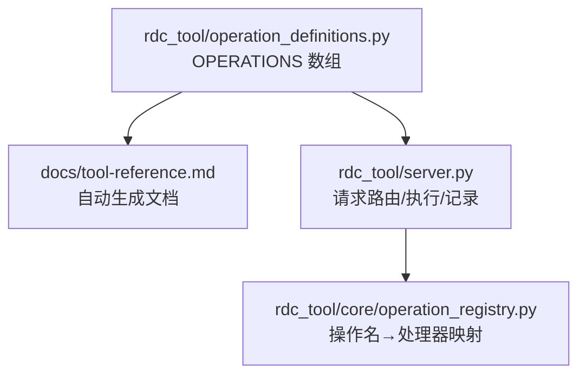
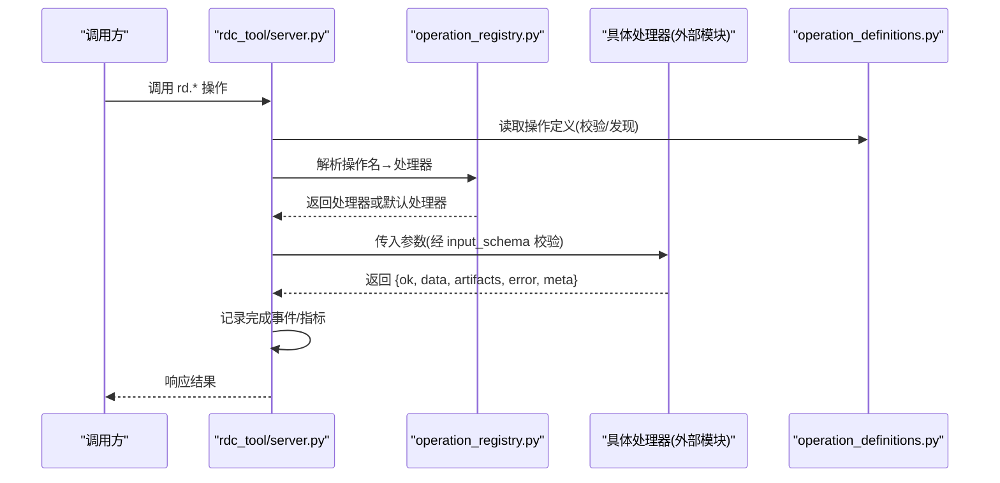
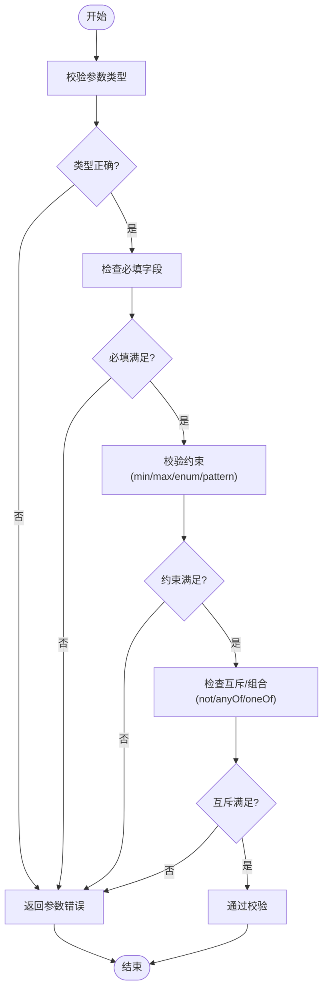
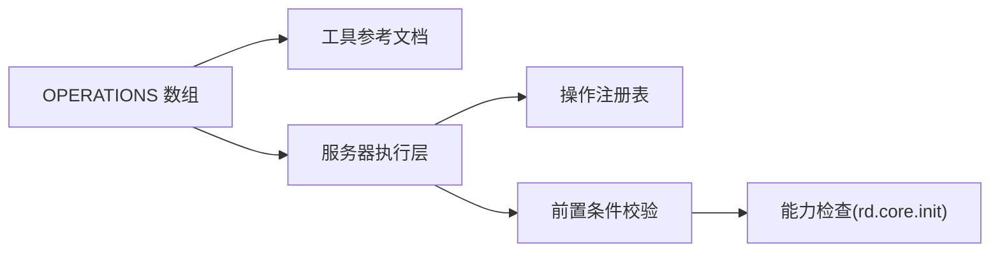

# 操作定义规范

<cite>
**本文引用的文件**
- [operation_definitions.py](file://rdc_tool/operation_definitions.py)
- [tool-reference.md](file://docs/tool-reference.md)
- [operation_registry.py](file://rdc_tool/core/operation_registry.py)
- [server.py](file://rdc_tool/server.py)
</cite>

## 目录
1. [简介](#简介)
2. [项目结构](#项目结构)
3. [核心组件](#核心组件)
4. [架构总览](#架构总览)
5. [详细组件分析](#详细组件分析)
6. [依赖关系分析](#依赖关系分析)
7. [性能注意事项](#性能注意事项)
8. [故障排查指南](#故障排查指南)
9. [结论](#结论)
10. [附录](#附录)

## 简介
本规范面向希望在 OPERATIONS 数组中新增 rd.* 操作的开发者与维护者，系统化说明每个必需字段的含义、格式与约束，并给出完整示例模式。内容覆盖：name、group、description、parameter_raw、returns_raw、param_names、prerequisites、namespace、input_schema、scope、effects、evidence_kind、path_inputs 等字段；同时解释 JSON Schema 参数校验规则（类型、验证、默认值、约束），以及前置条件的声明方式（依赖工具链与能力）。

## 项目结构
- 操作元数据集中定义在 rdc_tool/operation_definitions.py 的 OPERATIONS 数组中，每个元素描述一个 rd.* 操作。
- 文档生成脚本会基于该模块生成 docs/tool-reference.md，作为对外参考手册。
- 运行时通过服务器层解析调用、执行操作并记录结果。
- 内部注册表用于将操作名映射到处理器函数（由其他模块实现）。

图示来源
- [operation_definitions.py:1-100](file://rdc_tool/operation_definitions.py#L1-L100)
- [tool-reference.md:1-12](file://docs/tool-reference.md#L1-L12)
- [server.py:118-149](file://rdc_tool/server.py#L118-L149)
- [operation_registry.py:1-45](file://rdc_tool/core/operation_registry.py#L1-L45)

章节来源
- [operation_definitions.py:1-100](file://rdc_tool/operation_definitions.py#L1-L100)
- [tool-reference.md:1-12](file://docs/tool-reference.md#L1-L12)

## 核心组件
- 操作定义（OPERATIONS）：每个操作是一个字典，包含名称、分组、描述、参数、返回值、前置条件、命名空间、输入 schema、作用域、副作用、证据类型、路径输入等。
- 文档生成：从操作定义自动产出工具参考文档，保证“定义即文档”。
- 服务器执行：接收调用，校验参数（依据 input_schema），选择上下文与作用域，执行对应处理器，记录完成事件与指标。
- 注册表：维护操作名到处理器的映射，支持批量注册与默认处理器。

章节来源
- [operation_definitions.py:1-100](file://rdc_tool/operation_definitions.py#L1-L100)
- [server.py:118-149](file://rdc_tool/server.py#L118-L149)
- [operation_registry.py:1-45](file://rdc_tool/core/operation_registry.py#L1-L45)

## 架构总览
下图展示了从客户端调用到操作执行的端到端流程，以及操作定义如何驱动文档生成与运行时行为。

图示来源
- [server.py:118-149](file://rdc_tool/server.py#L118-L149)
- [operation_registry.py:1-45](file://rdc_tool/core/operation_registry.py#L1-L45)
- [operation_definitions.py:1-100](file://rdc_tool/operation_definitions.py#L1-L100)

## 详细组件分析

### 操作定义字段规范
以下字段为新增 rd.* 操作时必须提供或合理设置的键。请严格遵循现有操作的模式与约束。

- name（操作名称）
  - 格式：字符串，形如 rd.<namespace>.<action>
  - 要求：全局唯一，语义清晰，便于发现与检索
  - 示例参考：见各操作条目中的 name 字段

- group（分组标识）
  - 格式：字符串，建议使用“编号+中文分类”形式，便于归类展示
  - 要求：与现有分组风格一致，体现功能域
  - 示例参考：见各操作条目中的 group 字段

- description（功能描述）
  - 格式：简洁明确的自然语言描述
  - 要求：说明操作目的、适用场景与关键行为
  - 示例参考：见各操作条目中的 description 字段

- parameter_raw（参数定义）
  - 格式：HTML 片段，使用   分隔多个参数，每个参数以 “名称 (类型): 说明” 的形式呈现
  - 要求：与 param_names 顺序一致；可选参数需标注“可选”和默认值；复杂对象可引用 input_schema
  - 示例参考：见各操作条目中的 parameter_raw 字段

- returns_raw（返回值定义）
  - 格式：HTML 片段，描述 ok/data/artifacts/error/meta/projections 等字段
  - 要求：明确成功与失败分支的数据结构；必要时说明 artifact 行为
  - 示例参考：见各操作条目中的 returns_raw 字段

- param_names（参数名列表）
  - 格式：字符串数组，按 parameter_raw 的顺序列出所有参数名
  - 要求：与 input_schema.properties 的 key 集合一致（含可选）
  - 示例参考：见各操作条目中的 param_names 字段

- prerequisites（前置条件）
  - 格式：对象数组，每项包含 requires、via_tools、reason，以及可选 when
  - 要求：声明操作运行所需的上下文资源或能力；when 可用于条件前置
  - 示例参考：见各操作条目中的 prerequisites 字段

- namespace（命名空间）
  - 格式：字符串，表示操作所属的功能域（如 buffer、capture、core、debug、export、mesh、perf、pipeline、remote、replay、resource、session、shader、texture、util、vfs 等）
  - 要求：与 name 前缀一致，便于组织与过滤
  - 示例参考：见各操作条目中的 namespace 字段

- input_schema（输入验证 schema）
  - 格式：JSON Schema object
  - 要求：
    - type: "object"
    - properties: 每个参数的 schema，包含 type、description、enum、default、minimum、maximum、pattern 等
    - required: 必填参数列表
    - additionalProperties: 通常设为 false，禁止额外字段
    - not/anyOf/oneOf: 用于表达互斥或组合约束（例如 state/event_id 互斥）
  - 示例参考：见各操作条目中的 input_schema 字段

- scope（执行范围）
  - 格式：字符串，常见值包括 global、context、capture、replay
  - 要求：反映操作对系统状态的作用域；影响调度与隔离策略
  - 示例参考：见各操作条目中的 scope 字段

- effects（副作用声明）
  - 格式：字符串数组，列举操作可能产生的副作用类型
  - 常见值：lifecycle、global_config、remote_control、replay_position、replay_position_temporary、artifact_write、artifact_delete、desktop_window、context_metadata、shader_debug、shader_replacement、measurement、intervention、rollback 等
  - 要求：准确描述副作用，便于审计、回放与幂等性控制
  - 示例参考：见各操作条目中的 effects 字段

- evidence_kind（证据类型）
  - 格式：字符串或 null
  - 常见值：null、measurement、intervention、rollback
  - 要求：标记操作是否产生测量证据或干预/回滚证据，用于后续证据链管理
  - 示例参考：见各操作条目中的 evidence_kind 字段

- path_inputs（路径输入）
  - 格式：对象数组，每项包含 name、access
  - access 取值：read、write、read_directory
  - 要求：声明操作访问的文件/目录路径参数及其权限，便于安全与沙箱策略
  - 示例参考：见各操作条目中的 path_inputs 字段

章节来源
- [operation_definitions.py:1-100](file://rdc_tool/operation_definitions.py#L1-L100)
- [operation_definitions.py:1166-1284](file://rdc_tool/operation_definitions.py#L1166-L1284)
- [operation_definitions.py:1390-1460](file://rdc_tool/operation_definitions.py#L1390-L1460)
- [operation_definitions.py:1960-2007](file://rdc_tool/operation_definitions.py#L1960-L2007)
- [operation_definitions.py:2286-2371](file://rdc_tool/operation_definitions.py#L2286-L2371)

### JSON Schema 参数校验要点
- 基本类型：string、integer、number、boolean、array、object
- 常用约束：
  - minimum/maximum：数值边界
  - enum：枚举限制
  - default：默认值（当参数可选时）
  - pattern：字符串正则匹配（如有需要）
  - required：必填字段
  - additionalProperties：是否允许额外属性（建议 false）
  - not/anyOf/oneOf：复杂约束（如互斥字段）
- 描述信息：description 应清晰说明用途、单位、默认值与约束

章节来源
- [operation_definitions.py:32-66](file://rdc_tool/operation_definitions.py#L32-L66)
- [operation_definitions.py:83-124](file://rdc_tool/operation_definitions.py#L83-L124)
- [operation_definitions.py:140-160](file://rdc_tool/operation_definitions.py#L140-L160)
- [operation_definitions.py:233-244](file://rdc_tool/operation_definitions.py#L233-L244)
- [operation_definitions.py:269-282](file://rdc_tool/operation_definitions.py#L269-L282)

### 前置条件声明方式
- requires：声明所需资源或能力（如 session_id、remote_id、capability.remote）
- via_tools：声明依赖的工具链（如 rd.capture.open_file、rd.capture.open_replay、rd.core.init、rd.remote.connect）
- reason：简要说明为何需要该前置条件
- when：可选条件表达式，用于条件前置（如 options.remote_id_present）

章节来源
- [operation_definitions.py:28-31](file://rdc_tool/operation_definitions.py#L28-L31)
- [operation_definitions.py:189-191](file://rdc_tool/operation_definitions.py#L189-L191)
- [operation_definitions.py:260-267](file://rdc_tool/operation_definitions.py#L260-L267)
- [operation_definitions.py:1982-1985](file://rdc_tool/operation_definitions.py#L1982-L1985)

### 作用域与副作用
- scope
  - global：全局作用域，不绑定特定会话或上下文
  - context：作用于当前 daemon 上下文
  - capture：作用于捕获文件句柄
  - replay：作用于回放会话
- effects
  - lifecycle：生命周期变更（创建/关闭资源）
  - global_config：修改全局配置
  - remote_control：远程连接/控制
  - replay_position / replay_position_temporary：改变回放位置（临时或持久）
  - artifact_write / artifact_delete：写入或删除工件
  - desktop_window：桌面窗口交互
  - context_metadata：上下文元数据更新
  - shader_debug / shader_replacement：着色器调试/替换
  - measurement / intervention / rollback：证据相关

章节来源
- [operation_definitions.py:63-66](file://rdc_tool/operation_definitions.py#L63-L66)
- [operation_definitions.py:178-181](file://rdc_tool/operation_definitions.py#L178-L181)
- [operation_definitions.py:241-244](file://rdc_tool/operation_definitions.py#L241-L244)
- [operation_definitions.py:279-282](file://rdc_tool/operation_definitions.py#L279-L282)
- [operation_definitions.py:303-306](file://rdc_tool/operation_definitions.py#L303-L306)
- [operation_definitions.py:557-560](file://rdc_tool/operation_definitions.py#L557-L560)
- [operation_definitions.py:593-596](file://rdc_tool/operation_definitions.py#L593-L596)
- [operation_definitions.py:616-618](file://rdc_tool/operation_definitions.py#L616-L618)
- [operation_definitions.py:1193-1196](file://rdc_tool/operation_definitions.py#L1193-L1196)
- [operation_definitions.py:1243-1246](file://rdc_tool/operation_definitions.py#L1243-L1246)
- [operation_definitions.py:1280-1283](file://rdc_tool/operation_definitions.py#L1280-L1283)
- [operation_definitions.py:1339-1342](file://rdc_tool/operation_definitions.py#L1339-L1342)
- [operation_definitions.py:1386-1389](file://rdc_tool/operation_definitions.py#L1386-L1389)
- [operation_definitions.py:1457-1460](file://rdc_tool/operation_definitions.py#L1457-L1460)
- [operation_definitions.py:2004-2007](file://rdc_tool/operation_definitions.py#L2004-L2007)
- [operation_definitions.py:2302-2305](file://rdc_tool/operation_definitions.py#L2302-L2305)
- [operation_definitions.py:2368-2371](file://rdc_tool/operation_definitions.py#L2368-L2371)

### 路径输入与工件
- path_inputs 用于声明路径型参数的访问权限（读/写/读目录）
- artifact_write 副作用表明操作会产生工件（如导出图片、二进制、日志等）
- 对于大体积数据，优先输出到文件并通过 artifact 机制传递，避免 JSON 过大

章节来源
- [operation_definitions.py:63-66](file://rdc_tool/operation_definitions.py#L63-L66)
- [operation_definitions.py:241-244](file://rdc_tool/operation_definitions.py#L241-L244)
- [operation_definitions.py:1193-1196](file://rdc_tool/operation_definitions.py#L1193-L1196)
- [operation_definitions.py:1243-1246](file://rdc_tool/operation_definitions.py#L1243-L1246)
- [operation_definitions.py:1280-1283](file://rdc_tool/operation_definitions.py#L1280-L1283)
- [operation_definitions.py:1339-1342](file://rdc_tool/operation_definitions.py#L1339-L1342)
- [operation_definitions.py:1386-1389](file://rdc_tool/operation_definitions.py#L1386-L1389)
- [operation_definitions.py:1457-1460](file://rdc_tool/operation_definitions.py#L1457-L1460)

### 完整操作定义示例模式
以下为不同类型操作的定义模式摘要（以“路径引用”代替代码片段）：

- 缓冲区读取（重放作用域，临时位置变更，可能写工件）
  - 参考：[operation_definitions.py:4-66](file://rdc_tool/operation_definitions.py#L4-L66)
- 结构化缓冲解码（重放作用域，位置变更）
  - 参考：[operation_definitions.py:67-124](file://rdc_tool/operation_definitions.py#L67-L124)
- 捕获文件打开（全局作用域，生命周期变更，读路径）
  - 参考：[operation_definitions.py:223-244](file://rdc_tool/operation_definitions.py#L223-L244)
- 创建回放会话（全局作用域，生命周期变更，条件前置）
  - 参考：[operation_definitions.py:245-282](file://rdc_tool/operation_definitions.py#L245-L282)
- 导出截图（重放作用域，位置变更，写工件，证据类型为 measurement）
  - 参考：[operation_definitions.py:1284-1342](file://rdc_tool/operation_definitions.py#L1284-L1342)
- 导出纹理（重放作用域，位置变更，写工件，证据类型为 measurement）
  - 参考：[operation_definitions.py:1390-1460](file://rdc_tool/operation_definitions.py#L1390-L1460)
- 远程连接（全局作用域，远程控制，能力前置）
  - 参考：[operation_definitions.py:1960-2007](file://rdc_tool/operation_definitions.py#L1960-L2007)
- 切换帧（重放作用域，位置变更）
  - 参考：[operation_definitions.py:2349-2371](file://rdc_tool/operation_definitions.py#L2349-L2371)

章节来源
- [operation_definitions.py:4-66](file://rdc_tool/operation_definitions.py#L4-L66)
- [operation_definitions.py:67-124](file://rdc_tool/operation_definitions.py#L67-L124)
- [operation_definitions.py:223-244](file://rdc_tool/operation_definitions.py#L223-L244)
- [operation_definitions.py:245-282](file://rdc_tool/operation_definitions.py#L245-L282)
- [operation_definitions.py:1284-1342](file://rdc_tool/operation_definitions.py#L1284-L1342)
- [operation_definitions.py:1390-1460](file://rdc_tool/operation_definitions.py#L1390-L1460)
- [operation_definitions.py:1960-2007](file://rdc_tool/operation_definitions.py#L1960-L2007)
- [operation_definitions.py:2349-2371](file://rdc_tool/operation_definitions.py#L2349-L2371)

### 参数校验流程图（JSON Schema）

图示来源
- [operation_definitions.py:32-66](file://rdc_tool/operation_definitions.py#L32-L66)
- [operation_definitions.py:83-124](file://rdc_tool/operation_definitions.py#L83-L124)
- [operation_definitions.py:140-160](file://rdc_tool/operation_definitions.py#L140-L160)
- [operation_definitions.py:233-244](file://rdc_tool/operation_definitions.py#L233-L244)
- [operation_definitions.py:269-282](file://rdc_tool/operation_definitions.py#L269-L282)

## 依赖关系分析
- 操作定义与文档：OPERATIONS 数组是单一事实源，工具参考文档由其生成，确保一致性。
- 操作定义与运行时：服务器在执行前读取操作定义进行发现与校验；注册表负责将操作名解析为处理器。
- 前置条件与能力：某些操作依赖全局能力（如 remote），需在 prerequisites 中显式声明 via rd.core.init。

图示来源
- [operation_definitions.py:1-100](file://rdc_tool/operation_definitions.py#L1-L100)
- [tool-reference.md:1-12](file://docs/tool-reference.md#L1-L12)
- [server.py:118-149](file://rdc_tool/server.py#L118-L149)
- [operation_registry.py:1-45](file://rdc_tool/core/operation_registry.py#L1-L45)

章节来源
- [operation_definitions.py:1-100](file://rdc_tool/operation_definitions.py#L1-L100)
- [tool-reference.md:1-12](file://docs/tool-reference.md#L1-L12)
- [server.py:118-149](file://rdc_tool/server.py#L118-L149)
- [operation_registry.py:1-45](file://rdc_tool/core/operation_registry.py#L1-L45)

## 性能注意事项
- 大体积数据：优先通过 output_path 输出到文件，并在 returns_raw 中说明 artifact 行为，避免 JSON 过大导致传输与解析开销。
- 采样与限制：对耗时操作（如计数器采样、全量事件遍历）提供 max_events、stride、max_bytes 等限制参数，降低负载。
- 临时位置变更：replay_position_temporary 副作用表明仅临时移动回放位置，适合只读查询；持久位置变更需谨慎使用。
- 工件清理：提供清理接口（如 rd.util.cleanup_artifacts）以便释放磁盘空间。

章节来源
- [operation_definitions.py:4-66](file://rdc_tool/operation_definitions.py#L4-L66)
- [operation_definitions.py:1648-1678](file://rdc_tool/operation_definitions.py#L1648-L1678)
- [operation_definitions.py:1679-1714](file://rdc_tool/operation_definitions.py#L1679-L1714)
- [operation_definitions.py:233-244](file://rdc_tool/operation_definitions.py#L233-L244)

## 故障排查指南
- 参数校验失败：检查 input_schema 的 required、type、enum、minimum/maximum、not/anyOf/oneOf 等约束是否与调用参数一致。
- 前置条件缺失：确认 prerequisites 中 requires/via_tools 是否已满足（如先打开捕获文件、再创建回放会话；启用 remote 能力）。
- 作用域不匹配：根据 scope 判断是否在正确的上下文/会话中调用（global vs replay vs context）。
- 副作用影响：注意 effects 中的 replay_position、artifact_write 等，避免误用导致状态不一致或工件堆积。
- 证据类型：measurement/intervention/rollback 会影响证据链，确保操作意图与证据类型一致。

章节来源
- [operation_definitions.py:32-66](file://rdc_tool/operation_definitions.py#L32-L66)
- [operation_definitions.py:28-31](file://rdc_tool/operation_definitions.py#L28-L31)
- [operation_definitions.py:63-66](file://rdc_tool/operation_definitions.py#L63-L66)
- [operation_definitions.py:178-181](file://rdc_tool/operation_definitions.py#L178-L181)
- [operation_definitions.py:241-244](file://rdc_tool/operation_definitions.py#L241-L244)
- [operation_definitions.py:279-282](file://rdc_tool/operation_definitions.py#L279-L282)
- [operation_definitions.py:1339-1342](file://rdc_tool/operation_definitions.py#L1339-L1342)
- [operation_definitions.py:1457-1460](file://rdc_tool/operation_definitions.py#L1457-L1460)

## 结论
通过在 OPERATIONS 数组中规范地添加 rd.* 操作，可以实现一致的参数校验、清晰的依赖声明、可控的作用域与副作用，以及可生成的权威文档。遵循本规范有助于提升可维护性、可观测性与安全性，并为自动化与 Agent 调用提供稳定契约。

## 附录

### 新增操作清单模板（字段说明）
- name：操作名称（唯一）
- group：分组标识（编号+中文分类）
- description：功能描述（简洁明确）
- parameter_raw：参数定义（HTML 片段，  分隔）
- returns_raw：返回值定义（HTML 片段，描述 ok/data/artifacts/error/meta/projections）
- param_names：参数名列表（与 parameter_raw 顺序一致）
- prerequisites：前置条件（requires/via_tools/reason/when）
- namespace：命名空间（与 name 前缀一致）
- input_schema：JSON Schema（type/object/properties/required/additionalProperties/约束）
- scope：执行范围（global/context/capture/replay）
- effects：副作用（数组，精确描述）
- evidence_kind：证据类型（null/measurement/intervention/rollback）
- path_inputs：路径输入（name/access）

章节来源
- [operation_definitions.py:1-100](file://rdc_tool/operation_definitions.py#L1-L100)
- [operation_definitions.py:1166-1284](file://rdc_tool/operation_definitions.py#L1166-L1284)
- [operation_definitions.py:1390-1460](file://rdc_tool/operation_definitions.py#L1390-L1460)
- [operation_definitions.py:1960-2007](file://rdc_tool/operation_definitions.py#L1960-L2007)
- [operation_definitions.py:2286-2371](file://rdc_tool/operation_definitions.py#L2286-L2371)