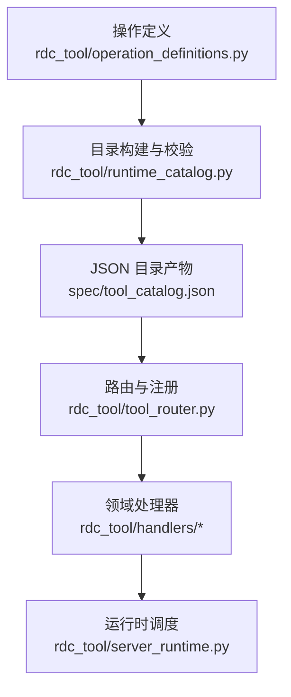
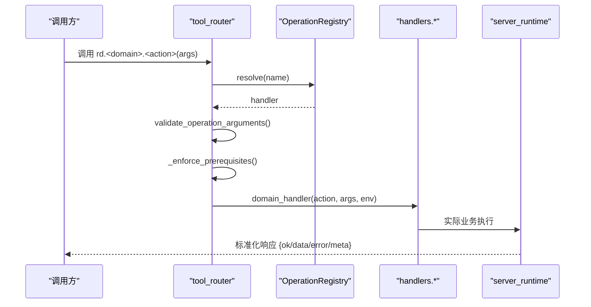
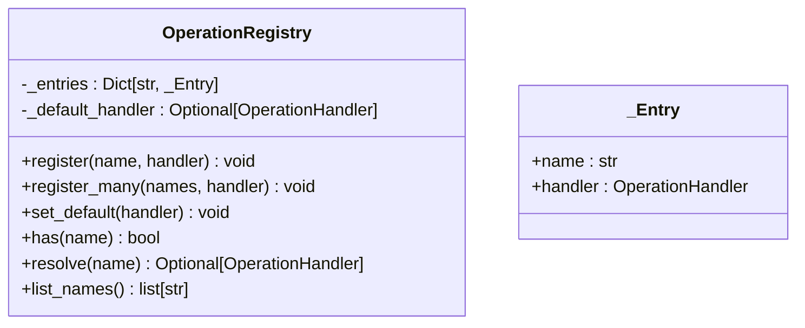
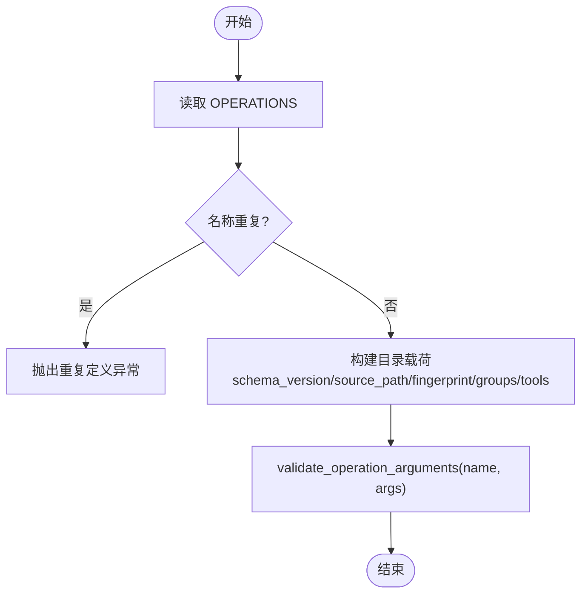
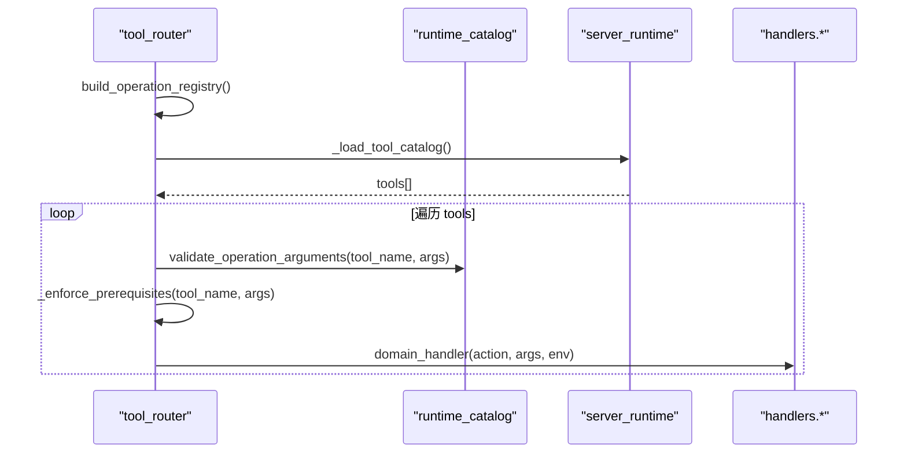
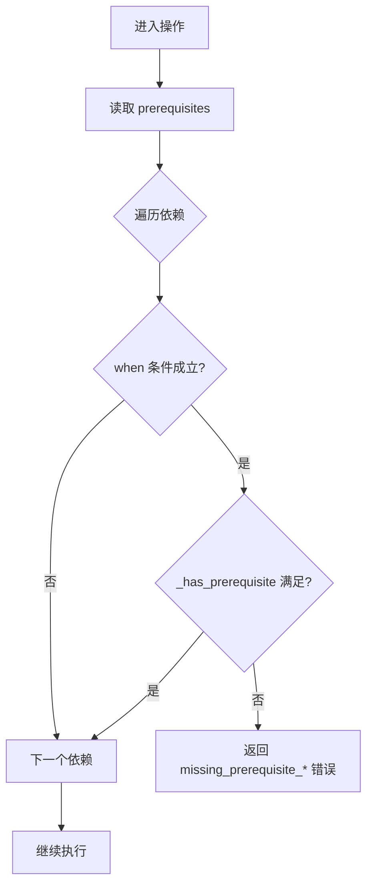
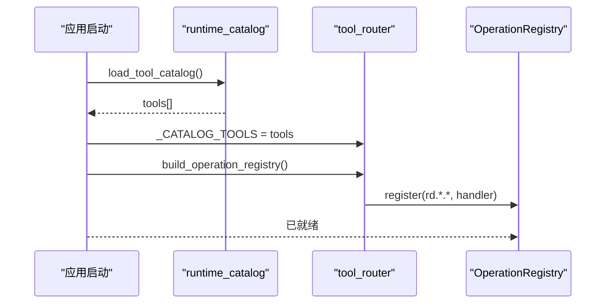

# 操作注册机制

<cite>
**本文引用的文件**
- [rdc_tool/core/operation_registry.py](file://rdc_tool/core/operation_registry.py)
- [rdc_tool/tool_router.py](file://rdc_tool/tool_router.py)
- [rdc_tool/runtime_catalog.py](file://rdc_tool/runtime_catalog.py)
- [rdc_tool/operation_definitions.py](file://rdc_tool/operation_definitions.py)
- [spec/tool_catalog.json](file://spec/tool_catalog.json)
- [rdc_tool/config.py](file://rdc_tool/config.py)
- [rdc_tool/server_runtime.py](file://rdc_tool/server_runtime.py)
- [rdc_tool/handlers/core.py](file://rdc_tool/handlers/core.py)
- [docs/troubleshooting.md](file://docs/troubleshooting.md)
</cite>

## 目录
1. [简介](#简介)
2. [项目结构](#项目结构)
3. [核心组件](#核心组件)
4. [架构总览](#架构总览)
5. [详细组件分析](#详细组件分析)
6. [依赖关系与前置条件](#依赖关系与前置条件)
7. [执行范围与作用域](#执行范围与作用域)
8. [操作发现、加载与热重载](#操作发现加载与热重载)
9. [完整注册流程示例](#完整注册流程示例)
10. [冲突检测与解决策略](#冲突检测与解决策略)
11. [性能与缓存特性](#性能与缓存特性)
12. [调试与故障排除](#调试与故障排除)
13. [结论](#结论)

## 简介
本文件系统性说明 RDC 工具链中“操作”（tool）的发现、注册、路由与执行机制。重点覆盖：
- 命名空间组织原则与模块划分
- 版本管理与指纹校验
- 依赖声明与前置条件检查
- 执行范围（global/replay/remote）语义
- 动态加载、缓存与热重载支持
- 从定义到可用的完整注册流程
- 冲突检测与解决策略
- 调试与排障指南

## 项目结构
RDC 将“操作”以声明式方式集中定义，并在运行时构建路由表，按命名空间分发到具体处理器。关键路径如下：
- 操作定义：`rdc_tool/operation_definitions.py` 中的 `OPERATIONS` 列表
- 目录生成与校验：`spec/tool_catalog.json` 由代码生成并带指纹
- 目录加载与参数校验：`rdc_tool/runtime_catalog.py`
- 路由与注册：`rdc_tool/tool_router.py` 使用 `OperationRegistry`
- 领域处理器：`rdc_tool/handlers/*` 下的各模块
- 运行时上下文与调度：`rdc_tool/server_runtime.py`

**图表来源**
- [rdc_tool/operation_definitions.py:1-120](file://rdc_tool/operation_definitions.py#L1-L120)
- [rdc_tool/runtime_catalog.py:17-35](file://rdc_tool/runtime_catalog.py#L17-L35)
- [spec/tool_catalog.json:1-25](file://spec/tool_catalog.json#L1-L25)
- [rdc_tool/tool_router.py:131-154](file://rdc_tool/tool_router.py#L131-L154)
- [rdc_tool/server_runtime.py:1-10](file://rdc_tool/server_runtime.py#L1-L10)

**章节来源**
- [rdc_tool/operation_definitions.py:1-120](file://rdc_tool/operation_definitions.py#L1-L120)
- [rdc_tool/runtime_catalog.py:17-35](file://rdc_tool/runtime_catalog.py#L17-L35)
- [spec/tool_catalog.json:1-25](file://spec/tool_catalog.json#L1-L25)
- [rdc_tool/tool_router.py:131-154](file://rdc_tool/tool_router.py#L131-L154)
- [rdc_tool/server_runtime.py:1-10](file://rdc_tool/server_runtime.py#L1-L10)

## 核心组件
- 操作注册表：轻量字典 + 默认处理器，提供注册、查询、列出能力
- 目录加载器：从 `OPERATIONS` 构造目录，计算指纹，导出描述与参数校验
- 路由器：解析 `rd.<domain>.<action>`，绑定领域处理器，注入前置条件校验与参数校验
- 领域处理器：按命名空间实现具体业务逻辑
- 运行时：统一入口，记录操作历史、上下文快照、错误归一化

**章节来源**
- [rdc_tool/core/operation_registry.py:12-45](file://rdc_tool/core/operation_registry.py#L12-L45)
- [rdc_tool/runtime_catalog.py:17-91](file://rdc_tool/runtime_catalog.py#L17-L91)
- [rdc_tool/tool_router.py:34-57,131-154:34-57](file://rdc_tool/tool_router.py#L34-L57)
- [rdc_tool/handlers/core.py:8-9](file://rdc_tool/handlers/core.py#L8-L9)
- [rdc_tool/server_runtime.py:1-10](file://rdc_tool/server_runtime.py#L1-L10)

## 架构总览
操作的生命周期分为：定义 → 目录生成 → 路由注册 → 调用时校验 → 分发执行 → 结果封装。

**图表来源**
- [rdc_tool/tool_router.py:131-154](file://rdc_tool/tool_router.py#L131-L154)
- [rdc_tool/runtime_catalog.py:38-91](file://rdc_tool/runtime_catalog.py#L38-L91)
- [rdc_tool/server_runtime.py:90-120](file://rdc_tool/server_runtime.py#L90-L120)

## 详细组件分析

### 操作注册表 OperationRegistry
- 职责：维护 name→handler 映射，支持批量注册、默认处理器、存在性检查、名称列表
- 复杂度：注册 O(1)，查找 O(1)，列出 O(n log n)（排序）
- 扩展点：可设置默认处理器用于未知操作的回退

**图表来源**
- [rdc_tool/core/operation_registry.py:12-45](file://rdc_tool/core/operation_registry.py#L12-L45)

**章节来源**
- [rdc_tool/core/operation_registry.py:12-45](file://rdc_tool/core/operation_registry.py#L12-L45)

### 目录加载与参数校验 runtime_catalog
- 从 `OPERATIONS` 去重检查后深拷贝返回
- 生成目录载荷，包含 schema_version、source_path、fingerprint、tool_count、groups、tools
- 提供 `describe_operation` 和 `validate_operation_arguments`，基于 JSON Schema 风格约束进行强校验

**图表来源**
- [rdc_tool/runtime_catalog.py:17-35](file://rdc_tool/runtime_catalog.py#L17-L35)
- [rdc_tool/runtime_catalog.py:38-91](file://rdc_tool/runtime_catalog.py#L38-L91)

**章节来源**
- [rdc_tool/runtime_catalog.py:17-35](file://rdc_tool/runtime_catalog.py#L17-L35)
- [rdc_tool/runtime_catalog.py:38-91](file://rdc_tool/runtime_catalog.py#L38-L91)

### 路由与注册 tool_router
- 维护域名到处理器的映射，如 buffer/capture/core/debug 等
- 构建全局索引 `_CATALOG_TOOLS` 与 `_TOOL_INDEX`
- 在 `build_operation_registry` 中遍历目录，为每个 `rd.<domain>.<action>` 创建包装处理器：
  - 先做参数校验
  - 再做前置条件检查
  - 最后委派给对应领域处理器
- 前置条件检查支持 when 条件（如 options.remote_id_present），以及 snapshot 中的 session_id/capture_file_id/remote_id/active_event_id 等

**图表来源**
- [rdc_tool/tool_router.py:34-57](file://rdc_tool/tool_router.py#L34-L57)
- [rdc_tool/tool_router.py:80-128](file://rdc_tool/tool_router.py#L80-L128)
- [rdc_tool/tool_router.py:131-154](file://rdc_tool/tool_router.py#L131-L154)

**章节来源**
- [rdc_tool/tool_router.py:34-57](file://rdc_tool/tool_router.py#L34-L57)
- [rdc_tool/tool_router.py:80-128](file://rdc_tool/tool_router.py#L80-L128)
- [rdc_tool/tool_router.py:131-154](file://rdc_tool/tool_router.py#L131-L154)

### 领域处理器 handlers/core
- 作为 core 命名空间的统一入口，转发到 server_runtime 的核心调度方法
- 其他命名空间类似，各自负责具体业务

**章节来源**
- [rdc_tool/handlers/core.py:8-9](file://rdc_tool/handlers/core.py#L8-L9)

### 运行时 server_runtime
- 统一入口，记录操作开始、上下文准备、自动预览同步、执行、结果后处理与错误映射
- 管理上下文快照、远程连接、会话生命周期、指标与日志

**章节来源**
- [rdc_tool/server_runtime.py:1-10](file://rdc_tool/server_runtime.py#L1-L10)
- [rdc_tool/server_runtime.py:90-120](file://rdc_tool/server_runtime.py#L90-L120)

## 依赖关系与前置条件
- 操作元数据中包含 prerequisites 数组，声明该操作运行前必须满足的条件
- 常见依赖包括：
  - capture_file_id：需通过 rd.capture.open_file 打开捕获文件
  - session_id：需通过 rd.capture.open_replay 创建回放会话
  - remote_id：需通过 rd.remote.connect 建立远程句柄
  - active_event_id：当前回放事件有效
  - capability.remote：是否启用远程能力
- when 条件控制依赖的生效时机，例如仅当 options.remote_id_present 时才要求 remote_id
- 未满足前置条件会返回结构化错误，包含 code、category、details 与修复建议

**图表来源**
- [rdc_tool/tool_router.py:80-128](file://rdc_tool/tool_router.py#L80-L128)

**章节来源**
- [rdc_tool/tool_router.py:80-128](file://rdc_tool/tool_router.py#L80-L128)
- [spec/tool_catalog.json:43-52](file://spec/tool_catalog.json#L43-L52)

## 执行范围与作用域
- 每个操作定义包含 scope 字段，指示其作用域：
  - global：全局配置或生命周期操作，如初始化、关闭、获取版本/能力
  - replay：需要活跃回放会话的操作，如读取 buffer/纹理、调试
  - remote：涉及远程连接或目标控制的操作
- 作用域影响：
  - 前置条件检查（如 session_id、remote_id）
  - 资源生命周期管理（会话复用、清理）
  - 能力矩阵暴露（remote capability matrix）
- 典型场景：
  - 全局：rd.core.init、rd.core.get_version、rd.core.shutdown
  - 回放：rd.buffer.get_data、rd.debug.continue
  - 远程：rd.remote.connect、rd.remote.capture

**章节来源**
- [rdc_tool/operation_definitions.py:283-306](file://rdc_tool/operation_definitions.py#L283-L306)
- [rdc_tool/operation_definitions.py:465-489](file://rdc_tool/operation_definitions.py#L465-L489)
- [rdc_tool/operation_definitions.py:2268-2285](file://rdc_tool/operation_definitions.py#L2268-L2285)

## 操作发现、加载与热重载
- 发现来源：`rdc_tool/operation_definitions.py` 中的 `OPERATIONS` 列表
- 加载过程：
  - `runtime_catalog.load_tool_catalog()` 深拷贝并去重检查
  - `tool_router._CATALOG_TOOLS` 在模块导入时加载一次，构建索引
  - `tool_router.build_operation_registry()` 根据目录构建注册表
- 缓存机制：
  - 目录载荷包含 fingerprint（SHA-256），可用于外部缓存或一致性校验
  - 运行时通过 `server_runtime._load_tool_catalog()` 获取目录，避免重复 IO
- 热重载支持：
  - 当前实现为进程内一次性加载；若需热重载，可在服务重启或显式重建注册表时重新加载目录
  - 建议在配置变更或插件更新后触发重建，确保新操作可用

**图表来源**
- [rdc_tool/runtime_catalog.py:17-35](file://rdc_tool/runtime_catalog.py#L17-L35)
- [rdc_tool/tool_router.py:56-57](file://rdc_tool/tool_router.py#L56-L57)
- [rdc_tool/tool_router.py:131-154](file://rdc_tool/tool_router.py#L131-L154)

**章节来源**
- [rdc_tool/runtime_catalog.py:17-35](file://rdc_tool/runtime_catalog.py#L17-L35)
- [rdc_tool/tool_router.py:56-57](file://rdc_tool/tool_router.py#L56-L57)
- [rdc_tool/tool_router.py:131-154](file://rdc_tool/tool_router.py#L131-L154)

## 完整注册流程示例
以下以 `rd.buffer.get_data` 为例，展示从定义到可用的全过程：
1. 定义：在 `rdc_tool/operation_definitions.py` 中添加条目，包含 name、namespace、scope、prerequisites、input_schema 等
2. 生成目录：构建脚本将 `OPERATIONS` 写入 `spec/tool_catalog.json`，并计算 fingerprint
3. 加载目录：`runtime_catalog.load_tool_catalog()` 读取并校验
4. 构建路由：`tool_router.build_operation_registry()` 为 `rd.buffer.get_data` 创建处理器
5. 调用校验：调用时先执行 `validate_operation_arguments`，再检查 prerequisites
6. 分发执行：委派到 `handlers.buffer.handle("get_data", args, env)`
7. 结果封装：返回标准化响应，包含 ok/data/artifacts/error/meta

**章节来源**
- [rdc_tool/operation_definitions.py:4-66](file://rdc_tool/operation_definitions.py#L4-L66)
- [spec/tool_catalog.json:27-128](file://spec/tool_catalog.json#L27-L128)
- [rdc_tool/runtime_catalog.py:17-35](file://rdc_tool/runtime_catalog.py#L17-L35)
- [rdc_tool/tool_router.py:131-154](file://rdc_tool/tool_router.py#L131-L154)

## 冲突检测与解决策略
- 名称冲突：`runtime_catalog.load_tool_catalog()` 对 `OPERATIONS` 中的 name 去重检查，重复则抛出异常
- 依赖循环：`spec/validate_catalog.py` 检查 prerequisite 的 via_tools 不能自引用，且 must 指向已知工具
- 作用域冲突：通过 scope 与 prerequisites 组合约束，避免在不适用上下文中调用
- 解决策略：
  - 修改操作名以避免冲突
  - 修正 prerequisites 的 via_tools 指向正确的前置操作
  - 调整 scope 与 when 条件，确保调用时机正确

**章节来源**
- [rdc_tool/runtime_catalog.py:17-21](file://rdc_tool/runtime_catalog.py#L17-L21)
- [spec/validate_catalog.py:75-100](file://spec/validate_catalog.py#L75-L100)

## 性能与缓存特性
- 目录加载：内存中维护 `_CATALOG_TOOLS` 与 `_TOOL_INDEX`，避免重复解析
- 参数校验：基于 JSON Schema 风格的递归校验，时间复杂度与参数结构深度相关
- 前置条件检查：O(k) 遍历 prerequisites，k 为依赖数量
- 指纹校验：fingerprint 可用于外部缓存键，确保目录一致性
- 建议：
  - 减少不必要的参数嵌套与大型对象传递
  - 合理使用 scope 与 prerequisites，避免无效调用
  - 在批量操作中合并请求，降低往返次数

**章节来源**
- [rdc_tool/tool_router.py:56-57](file://rdc_tool/tool_router.py#L56-L57)
- [rdc_tool/runtime_catalog.py:38-91](file://rdc_tool/runtime_catalog.py#L38-L91)
- [rdc_tool/runtime_catalog.py:24-28](file://rdc_tool/runtime_catalog.py#L24-L28)

## 调试与故障排除
- 使用 `rdc-tool --json doctor` 检查工具根目录、Python 运行时、RenderDoc 布局、目录计数、守护进程状态
- 使用 `rdc-tool context status --json` 查看当前上下文，必要时 `rdc-tool context clear --json` 清理并重开捕获
- 远程回放失败时，检查 `remote_handle_consumed` 状态，必要时重新连接
- 回放重开：`rd.capture.open_replay` 会复用同捕获的活跃会话；如需释放资源，调用 `rd.capture.close_replay`
- 着色器替换：遵循 `edit_plan` 指导，注意 SPIR-V/DXIL 编码与编译器输出
- 纹理导出：明确格式支持，避免将 PNG 视为 HDR 证据
- 操作不存在：升级后旧名称不再执行，使用 `rdc-tool tools search/describe` 查找新接口

**章节来源**
- [docs/troubleshooting.md:1-58](file://docs/troubleshooting.md#L1-L58)

## 结论
RDC 的操作注册机制以声明式定义为核心，通过目录生成、路由注册、参数校验与前置条件检查，实现了高内聚、低耦合的可扩展架构。命名空间清晰、作用域明确、依赖可验证，配合指纹与缓存机制，保障了系统的稳定性与性能。开发者只需遵循命名约定与依赖声明，即可快速添加新操作并被系统自动发现与加载。