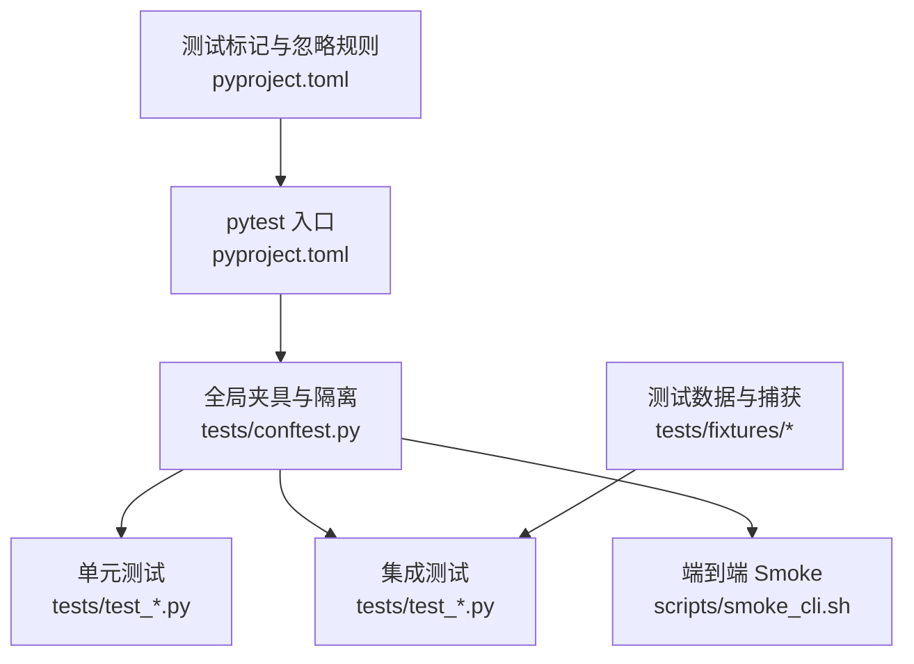
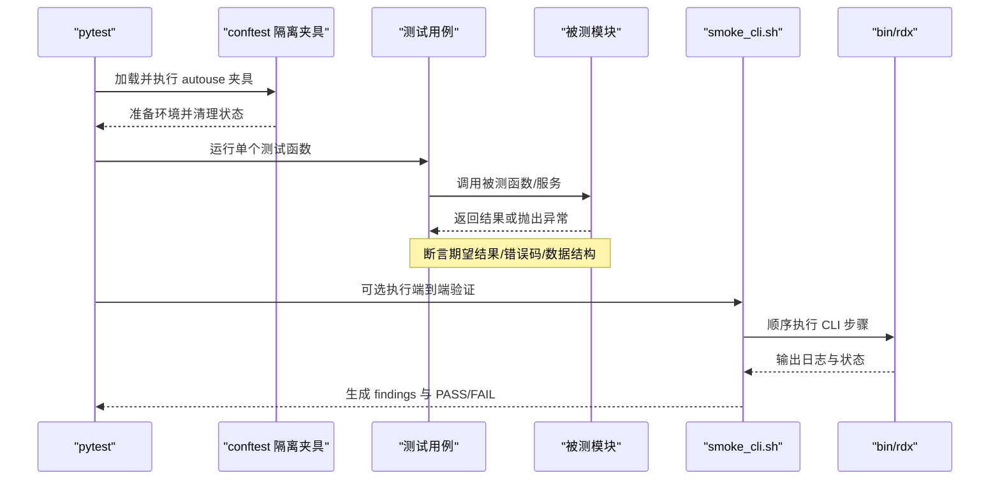
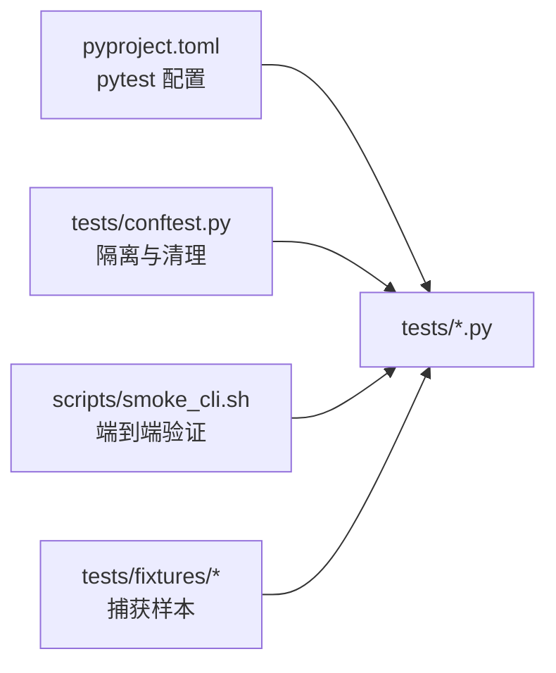

# 测试编写指南

<cite>
**本文引用的文件**
- [tests/conftest.py](file://tests/conftest.py)
- [pyproject.toml](file://pyproject.toml)
- [docs/fixture-strategy.md](file://docs/fixture-strategy.md)
- [scripts/smoke_cli.sh](file://scripts/smoke_cli.sh)
- [tests/test_cli_call_args.py](file://tests/test_cli_call_args.py)
- [tests/test_context_snapshot.py](file://tests/test_context_snapshot.py)
- [tests/test_runtime_worker.py](file://tests/test_runtime_worker.py)
- [tests/test_perf_service_failures.py](file://tests/test_perf_service_failures.py)
- [tests/test_replay_read.py](file://tests/test_replay_read.py)
- [tests/fixtures/README.md](file://tests/fixtures/README.md)
</cite>

## 目录
1. [简介](#简介)
2. [项目结构](#项目结构)
3. [核心组件](#核心组件)
4. [架构总览](#架构总览)
5. [详细组件分析](#详细组件分析)
6. [依赖关系分析](#依赖关系分析)
7. [性能与并发注意事项](#性能与并发注意事项)
8. [故障排查指南](#故障排查指南)
9. [结论](#结论)
10. [附录：完整示例与最佳实践清单](#附录完整示例与最佳实践清单)

## 简介
本指南面向为 RDX-Tool 新操作编写全面测试的工程师，覆盖单元测试、集成测试、端到端验证、性能测试、测试数据管理、覆盖率与质量检查、异步与并发测试、调试技巧与常见问题。内容基于仓库现有测试实现与配置，提供可操作的规范与参考路径，帮助你在不破坏既有稳定性的前提下快速产出高质量测试。

## 项目结构
RDX-Tool 使用 pytest 作为测试框架，测试位于 tests 目录；通过 conftest.py 统一设置运行环境、隔离运行时状态与清理策略；通过 pyproject.toml 定义测试标记（unit、contract、fixture_integration、gpu_live）以及 pytest 行为；smoke 脚本提供 CLI 端到端验证流程；fixtures 目录存放受控的小型公开捕获样本，配合文档约束确保可重复与合规。

图表来源
- [pyproject.toml:36-44](file://pyproject.toml#L36-L44)
- [tests/conftest.py:1-46](file://tests/conftest.py#L1-L46)
- [scripts/smoke_cli.sh:238-263](file://scripts/smoke_cli.sh#L238-L263)

章节来源
- [pyproject.toml:36-44](file://pyproject.toml#L36-L44)
- [tests/conftest.py:1-46](file://tests/conftest.py#L1-L46)
- [scripts/smoke_cli.sh:238-263](file://scripts/smoke_cli.sh#L238-L263)

## 核心组件
- 全局隔离夹具：在每次测试前后自动清理运行时状态、日志与上下文快照，避免跨测试污染。
- 测试标记体系：unit、contract、fixture_integration、gpu_live，用于区分不同层级的测试与执行条件。
- 固定捕获策略：仅允许小型公开 .rdc 进入仓库，发布包排除 fixtures，保证可复现与合规。
- Smoke 端到端流程：按步骤执行 CLI 命令，记录日志与发现项，支持超时与上下文清理。

章节来源
- [tests/conftest.py:29-46](file://tests/conftest.py#L29-L46)
- [pyproject.toml:36-44](file://pyproject.toml#L36-L44)
- [docs/fixture-strategy.md:1-28](file://docs/fixture-strategy.md#L1-L28)
- [scripts/smoke_cli.sh:123-146](file://scripts/smoke_cli.sh#L123-L146)

## 架构总览
下图展示了从 pytest 到具体测试模块的调用链，以及 smoke 脚本如何驱动 CLI 进行端到端验证。

图表来源
- [tests/conftest.py:29-46](file://tests/conftest.py#L29-L46)
- [scripts/smoke_cli.sh:238-263](file://scripts/smoke_cli.sh#L238-L263)

## 详细组件分析

### 单元测试模式与断言
- 使用 monkeypatch 替换外部依赖或内部函数，构造可控输入与副作用。
- 使用 tmp_path 创建临时文件与目录，避免真实文件系统污染。
- 对参数解析、错误分支、边界值进行充分覆盖，断言返回值、异常类型与消息。

示例参考路径
- 参数解析与错误处理：[tests/test_cli_call_args.py:8-116](file://tests/test_cli_call_args.py#L8-L116)

章节来源
- [tests/test_cli_call_args.py:8-116](file://tests/test_cli_call_args.py#L8-L116)

### 上下文快照与操作分发
- 通过 server.dispatch_operation 调用操作，使用 transport="test" 隔离网络与真实运行时。
- 断言更新与读取的一致性，校验只读字段与保留字段不被修改。
- 支持显式 context_id 的多上下文隔离。

示例参考路径
- 上下文更新与读取往返、产物追踪、禁用宏、多上下文：[tests/test_context_snapshot.py:12-108](file://tests/test_context_snapshot.py#L12-L108)

章节来源
- [tests/test_context_snapshot.py:12-108](file://tests/test_context_snapshot.py#L12-L108)

### 工作进程与生命周期
- 模拟子进程与 IO，验证环境变量注入、状态快照字段过滤、循环与原生线程复用。
- 验证 EOF 关闭时先触发 shutdown 再释放资源。

示例参考路径
- 工作进程启动、环境、状态、线程与关闭：[tests/test_runtime_worker.py:49-136](file://tests/test_runtime_worker.py#L49-L136)

章节来源
- [tests/test_runtime_worker.py:49-136](file://tests/test_runtime_worker.py#L49-L136)

### 性能服务失败路径
- 当 RenderDoc 不可用时，枚举/采样/热点检测应抛出明确错误。
- 控制器方法抛错时，不应伪装成功，需向上抛出带语义的错误。
- 热点 top_k=0 表示返回全部事件并按微秒排序。

示例参考路径
- 失败路径与数值处理：[tests/test_perf_service_failures.py:20-112](file://tests/test_perf_service_failures.py#L20-L112)

章节来源
- [tests/test_perf_service_failures.py:20-112](file://tests/test_perf_service_failures.py#L20-L112)

### 回放读取与恢复保护
- preserving_event 在读取失败或取消时应回滚事件，确保设备一致性。
- 初始内容溯源需要满足字节完整性、资源匹配与格式覆盖等约束。
- 同时发生读取与恢复失败时，错误信息应包含两者原因。

示例参考路径
- 恢复保护、取消、初始内容溯源与覆盖校验：[tests/test_replay_read.py:10-176](file://tests/test_replay_read.py#L10-L176)

章节来源
- [tests/test_replay_read.py:10-176](file://tests/test_replay_read.py#L10-L176)

### 端到端 Smoke 流程
- 默认执行入口 smoke（doctor、tools list/search）。
- 若提供 --rdc，则执行 daemon-backed capture 链路，包括 open、status、vfs、context 更新与清理。
- 每步支持超时，失败时记录 findings 并清理上下文与守护进程。

示例参考路径
- 步骤执行、日志与清理：[scripts/smoke_cli.sh:238-263](file://scripts/smoke_cli.sh#L238-L263)

章节来源
- [scripts/smoke_cli.sh:238-263](file://scripts/smoke_cli.sh#L238-L263)

## 依赖关系分析
- 测试框架与标记：pytest 通过 pyproject.toml 配置 testpaths、norecursedirs 与 markers。
- 全局夹具：conftest.py 设置中间目录、清理运行时状态与快照，确保测试隔离。
- 外部依赖隔离：通过 monkeypatch 替换渲染后端、子进程、导入逻辑等，避免真实 GPU/RenderDoc 依赖。
- 数据与制品：fixtures README 约束捕获样本的来源与许可，发布包排除测试数据。

图表来源
- [pyproject.toml:36-44](file://pyproject.toml#L36-L44)
- [tests/conftest.py:1-46](file://tests/conftest.py#L1-L46)
- [scripts/smoke_cli.sh:238-263](file://scripts/smoke_cli.sh#L238-L263)
- [tests/fixtures/README.md:1-26](file://tests/fixtures/README.md#L1-L26)

章节来源
- [pyproject.toml:36-44](file://pyproject.toml#L36-L44)
- [tests/conftest.py:1-46](file://tests/conftest.py#L1-L46)
- [tests/fixtures/README.md:1-26](file://tests/fixtures/README.md#L1-L26)

## 性能与并发注意事项
- 异步测试：使用 asyncio.run 或 async 测试函数，结合 pytest 的异步支持；注意任务取消与恢复路径。
- 原生线程：验证原生线程在同一循环中复用，避免频繁创建销毁导致的开销与竞争。
- 超时控制：smoke 脚本支持超时，测试中应避免长时间阻塞；必要时使用 pytest-timeout 或自定义超时装饰器。
- 资源隔离：利用 conftest 的自动清理，确保并发测试不会互相干扰。

章节来源
- [tests/test_runtime_worker.py:93-136](file://tests/test_runtime_worker.py#L93-L136)
- [scripts/smoke_cli.sh:148-176](file://scripts/smoke_cli.sh#L148-L176)

## 故障排查指南
- 常见错误定位：优先查看 smoke 日志与 findings 文件，确认失败步骤与环境变量。
- 上下文污染：确认 conftest 是否生效；必要时手动清理 runtime_state 与 context_snapshot。
- 外部依赖缺失：通过 monkeypatch 屏蔽 RenderDoc/GPU 依赖，聚焦业务逻辑；逐步放开依赖定位问题。
- 参数解析错误：针对 JSON 字符串、BOM、文件路径、互斥参数等边界情况补充断言。

章节来源
- [scripts/smoke_cli.sh:123-146](file://scripts/smoke_cli.sh#L123-L146)
- [tests/conftest.py:29-46](file://tests/conftest.py#L29-L46)
- [tests/test_cli_call_args.py:21-116](file://tests/test_cli_call_args.py#L21-L116)

## 结论
RDX-Tool 的测试体系以 pytest 为核心，通过全局夹具实现强隔离，通过标记体系分层组织测试，通过 smoke 脚本完成端到端验证。遵循本文的编写模式与最佳实践，可以为新操作构建高覆盖、可维护且稳定的测试套件，并确保在 CI 与本地环境中一致地运行。

## 附录：完整示例与最佳实践清单

### 单元测试最佳实践
- 使用 monkeypatch 替换外部依赖，构造确定性与可重复场景。
- 使用 tmp_path 管理临时文件，避免真实路径污染。
- 对参数解析、错误分支、边界值进行充分覆盖，断言返回值、异常类型与消息。
- 参考路径：[tests/test_cli_call_args.py:8-116](file://tests/test_cli_call_args.py#L8-L116)

章节来源
- [tests/test_cli_call_args.py:8-116](file://tests/test_cli_call_args.py#L8-L116)

### 集成测试设计原则
- 使用 transport="test" 隔离网络与真实运行时，验证操作分发与上下文快照。
- 校验只读字段与保留字段不被修改，确保数据一致性。
- 支持显式 context_id 的多上下文隔离。
- 参考路径：[tests/test_context_snapshot.py:12-108](file://tests/test_context_snapshot.py#L12-L108)

章节来源
- [tests/test_context_snapshot.py:12-108](file://tests/test_context_snapshot.py#L12-L108)

### 端到端验证与性能测试
- 使用 smoke 脚本执行 CLI 步骤，记录日志与 findings，支持超时与清理。
- 在无 GPU/RenderDoc 环境下，通过标记与跳过机制控制执行。
- 参考路径：[scripts/smoke_cli.sh:238-263](file://scripts/smoke_cli.sh#L238-L263)

章节来源
- [scripts/smoke_cli.sh:238-263](file://scripts/smoke_cli.sh#L238-L263)

### 测试数据管理
- 仅允许小型公开 .rdc 进入仓库，记录大小、SHA256、来源与许可。
- 发布包排除 fixtures，避免泄露与体积膨胀。
- 参考路径：[tests/fixtures/README.md:1-26](file://tests/fixtures/README.md#L1-L26)、[docs/fixture-strategy.md:1-28](file://docs/fixture-strategy.md#L1-L28)

章节来源
- [tests/fixtures/README.md:1-26](file://tests/fixtures/README.md#L1-L26)
- [docs/fixture-strategy.md:1-28](file://docs/fixture-strategy.md#L1-L28)

### 覆盖率与代码质量
- 当前仓库未内置覆盖率插件配置；可在 CI 中引入 pytest-cov 并设定阈值。
- 建议将 unit 与 contract 测试纳入默认 gate，fixture_integration 与 gpu_live 按需启用。
- 参考路径：[pyproject.toml:36-44](file://pyproject.toml#L36-L44)

章节来源
- [pyproject.toml:36-44](file://pyproject.toml#L36-L44)

### 异步与并发测试
- 使用 asyncio.run 或 async 测试函数，关注取消与恢复路径。
- 验证原生线程在同一循环中复用，避免竞争与泄漏。
- 参考路径：[tests/test_runtime_worker.py:93-136](file://tests/test_runtime_worker.py#L93-L136)、[tests/test_replay_read.py:10-49](file://tests/test_replay_read.py#L10-L49)

章节来源
- [tests/test_runtime_worker.py:93-136](file://tests/test_runtime_worker.py#L93-L136)
- [tests/test_replay_read.py:10-49](file://tests/test_replay_read.py#L10-L49)

### 调试技巧与常见问题
- 优先查看 smoke 日志与 findings，定位失败步骤与环境变量。
- 使用 conftest 的自动清理，避免上下文污染。
- 通过 monkeypatch 屏蔽外部依赖，逐步放开定位问题。
- 参考路径：[scripts/smoke_cli.sh:123-146](file://scripts/smoke_cli.sh#L123-L146)、[tests/conftest.py:29-46](file://tests/conftest.py#L29-L46)

章节来源
- [scripts/smoke_cli.sh:123-146](file://scripts/smoke_cli.sh#L123-L146)
- [tests/conftest.py:29-46](file://tests/conftest.py#L29-L46)