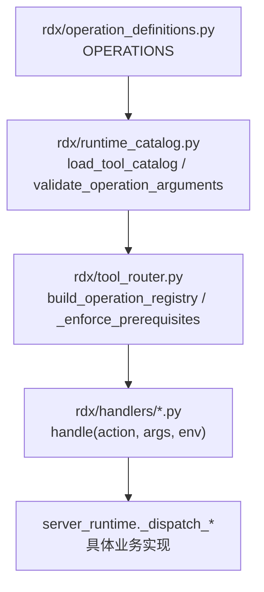
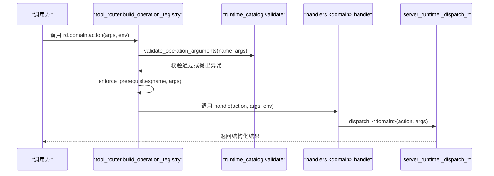
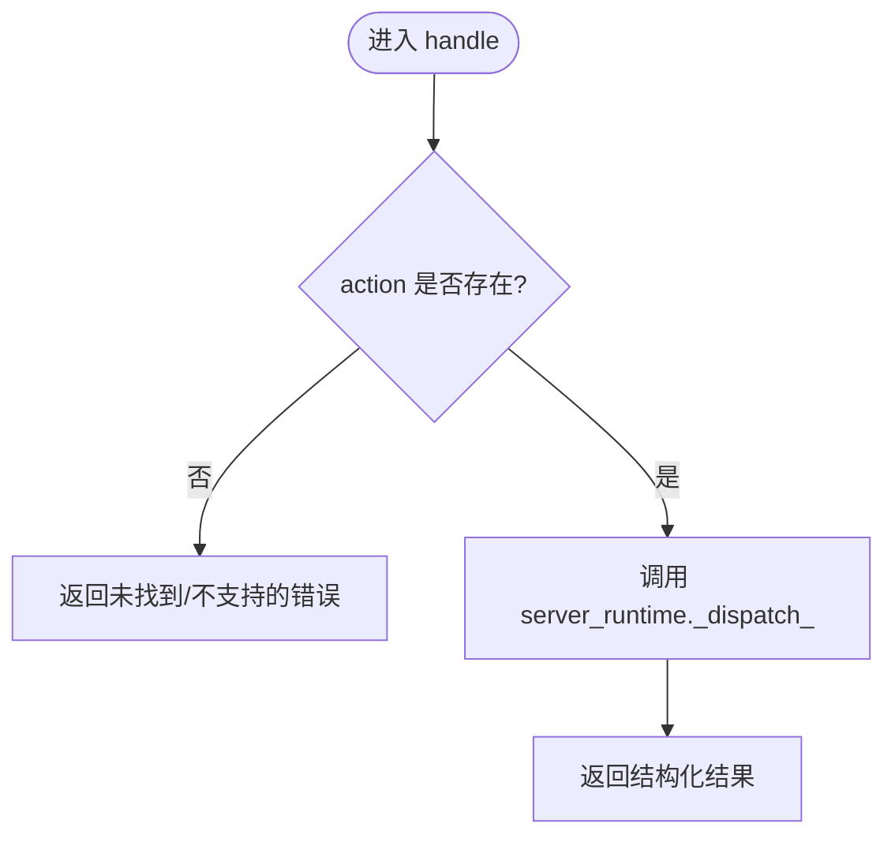
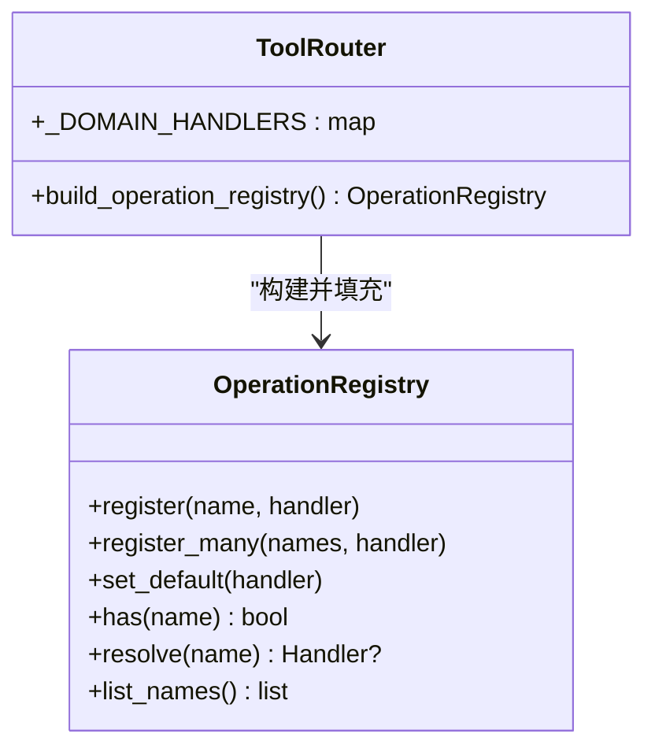
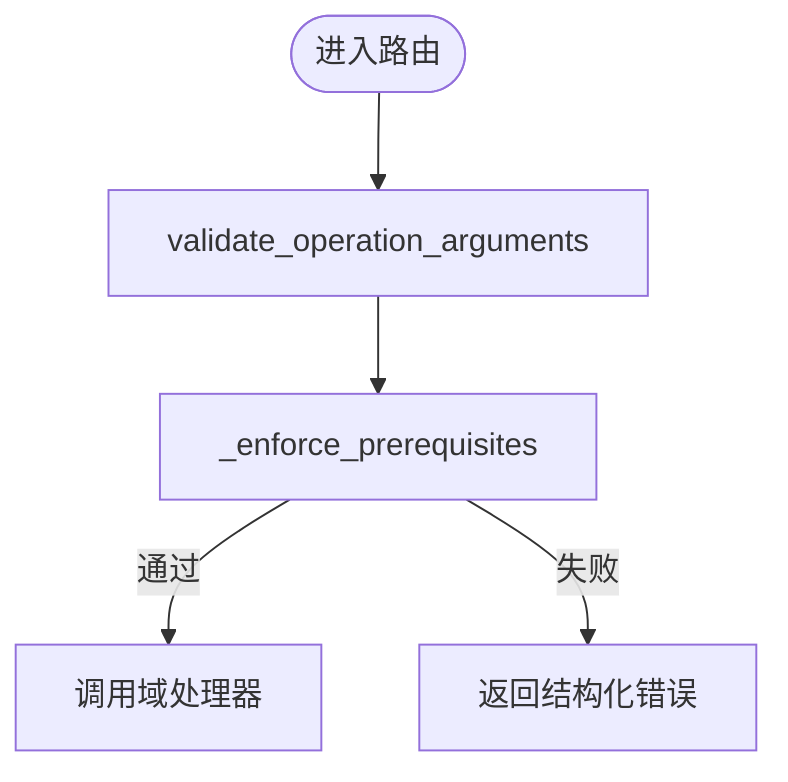
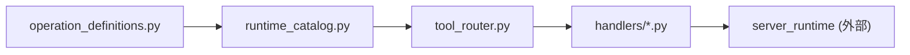

# 添加新操作

<cite>
**本文引用的文件**
- [operation_definitions.py](file://rdx/operation_definitions.py)
- [runtime_catalog.py](file://rdx/runtime_catalog.py)
- [tool_router.py](file://rdx/tool_router.py)
- [operation_registry.py](file://rdx/core/operation_registry.py)
- [handlers/core.py](file://rdx/handlers/core.py)
- [handlers/buffer.py](file://rdx/handlers/buffer.py)
- [handlers/capture.py](file://rdx/handlers/capture.py)
- [conftest.py](file://tests/conftest.py)
- [test_cli_call_args.py](file://tests/test_cli_call_args.py)
- [tool-reference.md](file://docs/tool-reference.md)
</cite>

## 目录
1. [简介](#简介)
2. [项目结构](#项目结构)
3. [核心组件](#核心组件)
4. [架构总览](#架构总览)
5. [详细组件分析](#详细组件分析)
6. [依赖关系分析](#依赖关系分析)
7. [性能考虑](#性能考虑)
8. [故障排查指南](#故障排查指南)
9. [结论](#结论)
10. [附录：完整新增操作流程示例](#附录完整新增操作流程示例)

## 简介
本指南面向需要在 RDC-Tool 中添加新的 rd.* 操作的开发者。内容覆盖操作定义规范、处理器实现模式、注册与路由机制、错误处理与状态管理、测试编写方法，以及版本管理与向后兼容性策略。目标是让读者能够以最小成本完成从“定义”到“实现”再到“测试与发布”的完整闭环。

## 项目结构
RDC-Tool 的操作系统由“声明式定义 + 运行时目录分发 + 参数校验 + 前置条件检查 + 处理器调度”构成。关键路径如下：
- 操作元数据集中定义在 rdx/operation_definitions.py 的 OPERATIONS 数组中。
- 运行时通过 rdx/runtime_catalog.py 加载并生成工具目录（catalog），并提供参数校验能力。
- rdx/tool_router.py 负责将 rd.domain.action 解析为对应域处理器，并在调用前执行参数校验与前置条件检查。
- 各域处理器位于 rdx/handlers/*，通常仅做轻量转发到 server_runtime 的具体实现。
- 统一注册表 rdx/core/operation_registry.py 用于维护已注册操作名到异步处理器的映射。

**图表来源**
- [operation_definitions.py:1-800](file://rdx/operation_definitions.py#L1-L800)
- [runtime_catalog.py:17-91](file://rdx/runtime_catalog.py#L17-L91)
- [tool_router.py:34-156](file://rdx/tool_router.py#L34-L156)

**章节来源**
- [operation_definitions.py:1-800](file://rdx/operation_definitions.py#L1-L800)
- [runtime_catalog.py:17-91](file://rdx/runtime_catalog.py#L17-L91)
- [tool_router.py:34-156](file://rdx/tool_router.py#L34-L156)

## 核心组件
- 操作定义层：在 OPERATIONS 数组中声明每个 rd.* 操作的名称、分组、描述、参数 schema、返回值说明、前置条件、命名空间、作用域、副作用等。
- 目录与校验层：runtime_catalog 负责去重、复制、指纹计算、按名称查找定义，并对入参进行 JSON Schema 风格校验。
- 路由与注册层：tool_router 根据 name 拆分 domain/action，选择对应域处理器；构建 OperationRegistry 并注册所有 rd.* 操作。
- 处理器层：handlers/* 中的 handle 函数接收 action、args、env，并委托给 server_runtime 的具体实现。
- 注册表：OperationRegistry 提供 register/register_many/list_names/resolve 等能力，支持默认处理器。

**章节来源**
- [operation_definitions.py:1-800](file://rdx/operation_definitions.py#L1-L800)
- [runtime_catalog.py:17-91](file://rdx/runtime_catalog.py#L17-L91)
- [tool_router.py:34-156](file://rdx/tool_router.py#L34-L156)
- [operation_registry.py:1-45](file://rdx/core/operation_registry.py#L1-L45)
- [handlers/core.py:1-11](file://rdx/handlers/core.py#L1-L11)
- [handlers/buffer.py:1-11](file://rdx/handlers/buffer.py#L1-L11)
- [handlers/capture.py:1-11](file://rdx/handlers/capture.py#L1-L11)

## 架构总览
下图展示了从 CLI 或上层调用方发起一次 rd.* 操作请求，到最终执行业务逻辑的完整流程，包括参数校验、前置条件检查、域路由与处理器调用。

**图表来源**
- [tool_router.py:131-156](file://rdx/tool_router.py#L131-L156)
- [runtime_catalog.py:38-91](file://rdx/runtime_catalog.py#L38-L91)
- [handlers/core.py:8-10](file://rdx/handlers/core.py#L8-L10)

## 详细组件分析

### 操作定义规范（在 OPERATIONS 中添加）
- 名称与命名空间
  - name 必须形如 rd.domain.action，其中 domain 需与 handlers 下的模块名一致。
  - namespace 应与 domain 保持一致，便于分组与发现。
- 分组与描述
  - group 用于归类展示，建议沿用现有分组语义。
  - description 简明描述操作目的与典型用法。
- 参数 schema（input_schema）
  - 使用 JSON Schema 风格对象，包含 type、properties、required、enum、minimum/maximum、additionalProperties 等。
  - 对复杂类型（object/array）要细化 items/properties，确保可被 runtime_catalog 校验。
- 返回值格式（returns_raw）
  - 用自然语言描述返回结构，保持与现有操作一致，例如 ok/data/artifacts/error/meta/projections。
- 前置条件（prerequisites）
  - 声明该操作运行前必须具备的环境或资源，如 session_id、capture_file_id、remote_id 等。
  - via_tools 指明可通过哪些工具获得前置依赖。
  - when 可用于条件性前置（如 options.remote_id_present）。
- 作用域与副作用（scope/effects）
  - scope 表示操作的作用范围：global、replay、context、capture 等。
  - effects 描述副作用类型，如 lifecycle、replay_position、artifact_write、shader_debug、global_config 等。
- 证据与路径输入（evidence_kind/path_inputs）
  - evidence_kind 用于标注是否产生证据型输出。
  - path_inputs 声明读/写路径类参数的访问方式。

参考现有条目（例如 buffer、capture、core 等）的结构与字段组织方式，确保一致性。

**章节来源**
- [operation_definitions.py:1-800](file://rdx/operation_definitions.py#L1-L800)
- [tool-reference.md:1-200](file://docs/tool-reference.md#L1-L200)

### 处理器实现模式
- 域处理器职责单一：每个 handlers/<domain>.py 暴露一个 async handle(action, args, env)，内部转发到 server_runtime 的对应分发函数。
- 新增域时，需在 tool_router 的 _DOMAIN_HANDLERS 中注册 domain -> handler 映射。
- 若新增 action 属于已有域，只需在 operation_definitions 中声明，无需改动处理器文件（除非需要特殊逻辑）。
- 若新增域，则需：
  - 创建 rdx/handlers/<new_domain>.py，实现 handle。
  - 在 tool_router.py 的 _DOMAIN_HANDLERS 中注册。
  - 在 operation_definitions.py 中为该域的所有 action 添加定义。

**图表来源**
- [handlers/core.py:8-10](file://rdx/handlers/core.py#L8-L10)
- [handlers/buffer.py:8-10](file://rdx/handlers/buffer.py#L8-L10)
- [handlers/capture.py:8-10](file://rdx/handlers/capture.py#L8-L10)

**章节来源**
- [handlers/core.py:1-11](file://rdx/handlers/core.py#L1-L11)
- [handlers/buffer.py:1-11](file://rdx/handlers/buffer.py#L1-L11)
- [handlers/capture.py:1-11](file://rdx/handlers/capture.py#L1-L11)
- [tool_router.py:34-54](file://rdx/tool_router.py#L34-L54)

### 操作注册机制
- 自动注册：tool_router.build_operation_registry 会遍历 catalog 中的所有工具项，过滤出 rd.* 名称，并按 domain/action 拆分，绑定到对应域处理器后注册到 OperationRegistry。
- 命名空间组织：name 的二级段即为 domain，对应 handlers 下的模块名；namespace 字段用于文档与分组。
- 依赖关系声明：通过 prerequisites 声明依赖的资源或上下文；when 字段支持条件依赖。
- 执行范围设置：scope 控制操作作用域；effects 描述副作用类型，供上层编排与审计。

**图表来源**
- [tool_router.py:131-156](file://rdx/tool_router.py#L131-L156)
- [operation_registry.py:18-45](file://rdx/core/operation_registry.py#L18-L45)

**章节来源**
- [tool_router.py:131-156](file://rdx/tool_router.py#L131-L156)
- [operation_registry.py:1-45](file://rdx/core/operation_registry.py#L1-L45)

### 参数校验与前置条件检查
- 参数校验：在路由阶段调用 runtime_catalog.validate_operation_arguments，依据 input_schema 严格校验类型、必填、枚举、数值范围、未知属性等。
- 前置条件检查：_enforce_prerequisites 读取当前上下文快照，判断 session_id、capture_file_id、remote_id、active_event_id、capability.remote 等是否满足；不满足时返回结构化错误，阻止后续执行。
- 条件前置：when 字段支持基于参数动态判定（如 options.remote_id_present）。

**图表来源**
- [tool_router.py:89-128](file://rdx/tool_router.py#L89-L128)
- [runtime_catalog.py:38-91](file://rdx/runtime_catalog.py#L38-L91)

**章节来源**
- [tool_router.py:80-128](file://rdx/tool_router.py#L80-L128)
- [runtime_catalog.py:38-91](file://rdx/runtime_catalog.py#L38-L91)

### 错误处理模式
- 校验错误：参数不符合 schema 时，返回 validation_error，包含错误消息与分类。
- 前置缺失：返回 missing_prerequisite_* 错误，附带 prerequisite、via_tools、reason 等详情。
- 未找到操作：CLI 层在未注册操作时会返回 operation_not_found。
- 处理器异常：建议在 server_runtime 实现中捕获并转换为结构化错误，避免裸异常上抛。

**章节来源**
- [tool_router.py:64-77](file://rdx/tool_router.py#L64-L77)
- [tool_router.py:143-151](file://rdx/tool_router.py#L143-L151)
- [test_cli_call_args.py:8-18](file://tests/test_cli_call_args.py#L8-L18)

### 状态管理
- 上下文快照：tool_router 通过 server_runtime._context_snapshot() 获取当前上下文状态，用于前置条件判断。
- 会话与远程：session_id、capture_file_id、remote_id 等关键标识可从 args 或运行时状态中获取。
- 作用域与副作用：scope 与 effects 帮助上层理解操作对 replay 位置、全局配置、远程连接等的影响。

**章节来源**
- [tool_router.py:89-109](file://rdx/tool_router.py#L89-L109)
- [operation_definitions.py:1-800](file://rdx/operation_definitions.py#L1-L800)

## 依赖关系分析
- 强依赖
  - operation_definitions.py 是所有操作的唯一真相源。
  - runtime_catalog.py 依赖 operation_definitions 进行加载与校验。
  - tool_router.py 依赖 runtime_catalog 与 handlers 映射，构建注册表。
- 弱依赖
  - handlers/* 仅做转发，实际逻辑在 server_runtime。
  - tests 依赖 conftest 提供的隔离环境与路径设置。

**图表来源**
- [operation_definitions.py:1-800](file://rdx/operation_definitions.py#L1-L800)
- [runtime_catalog.py:17-91](file://rdx/runtime_catalog.py#L17-L91)
- [tool_router.py:34-156](file://rdx/tool_router.py#L34-L156)

**章节来源**
- [operation_definitions.py:1-800](file://rdx/operation_definitions.py#L1-L800)
- [runtime_catalog.py:17-91](file://rdx/runtime_catalog.py#L17-L91)
- [tool_router.py:34-156](file://rdx/tool_router.py#L34-L156)

## 性能考虑
- 大对象输出：对于可能较大的数据（如 buffer 原始字节），优先使用 artifact 文件或 base64 限制，避免 JSON 过大导致传输与解析开销。
- 分页与限制：对列表/树/调用栈等接口，提供 limit/max_items/max_elements 等限制，防止内存与 CPU 压力。
- 缓存与复用：Replay Session 在同一 capture 下可复用，减少重复初始化开销。
- 日志与指标：通过 core.get_logs 与 get_runtime_metrics 监控性能瓶颈与恢复情况。

[本节为通用指导，不直接分析具体文件]

## 故障排查指南
- 参数校验失败
  - 现象：返回 validation_error。
  - 排查：核对 input_schema 的 required、type、enum、minimum/maximum、additionalProperties 等约束。
- 前置条件缺失
  - 现象：返回 missing_prerequisite_*。
  - 排查：确认是否先调用 open_file/open_replay/connect 等前置操作；检查 when 条件是否符合预期。
- 操作未找到
  - 现象：返回 operation_not_found。
  - 排查：确认 name 是否为 rd.* 且已在 OPERATIONS 中声明；确认 domain 与 handlers 映射存在。
- 上下文隔离问题
  - 现象：跨上下文状态污染。
  - 排查：使用 conftest 的隔离 fixture 清理 runtime_state 与 context_snapshot。

**章节来源**
- [tool_router.py:64-77](file://rdx/tool_router.py#L64-L77)
- [tool_router.py:143-151](file://rdx/tool_router.py#L143-L151)
- [test_cli_call_args.py:8-18](file://tests/test_cli_call_args.py#L8-L18)
- [conftest.py:29-46](file://tests/conftest.py#L29-L46)

## 结论
新增 rd.* 操作的核心在于“声明式定义 + 严格校验 + 前置条件 + 域路由”。遵循本文规范，可在保证兼容性与可维护性的前提下快速扩展能力。建议始终配套单元测试与集成测试，并通过 tool-reference 验证生成的文档一致性。

[本节为总结，不直接分析具体文件]

## 附录：完整新增操作流程示例

### 步骤一：在 OPERATIONS 中添加操作元数据
- 在 rdx/operation_definitions.py 的 OPERATIONS 数组末尾追加新条目。
- 关键字段：
  - name：形如 rd.domain.action。
  - group/description：分组与描述。
  - parameter_raw/returns_raw：人类可读的参数与返回说明。
  - param_names：参数名列表。
  - prerequisites：前置依赖（requires/via_tools/when/reason）。
  - namespace：与 domain 一致。
  - input_schema：JSON Schema 风格的参数约束。
  - scope/effects：作用域与副作用。
  - evidence_kind/path_inputs：证据与路径输入。

参考现有条目（如 rd.buffer.get_data、rd.capture.open_replay、rd.core.init）的结构。

**章节来源**
- [operation_definitions.py:1-800](file://rdx/operation_definitions.py#L1-L800)

### 步骤二：确保域处理器可用
- 若 action 属于已有域（如 buffer/capture/core），无需修改处理器文件。
- 若新增域，需：
  - 创建 rdx/handlers/<new_domain>.py，实现 async handle(action, args, env)。
  - 在 tool_router.py 的 _DOMAIN_HANDLERS 中注册 domain -> handler。

**章节来源**
- [handlers/core.py:1-11](file://rdx/handlers/core.py#L1-L11)
- [handlers/buffer.py:1-11](file://rdx/handlers/buffer.py#L1-L11)
- [handlers/capture.py:1-11](file://rdx/handlers/capture.py#L1-L11)
- [tool_router.py:34-54](file://rdx/tool_router.py#L34-L54)

### 步骤三：验证参数校验与前置条件
- 使用 runtime_catalog.validate_operation_arguments 对入参进行校验。
- 使用 _enforce_prerequisites 检查前置条件，确保在缺少必要上下文时返回结构化错误。

**章节来源**
- [runtime_catalog.py:38-91](file://rdx/runtime_catalog.py#L38-L91)
- [tool_router.py:89-128](file://rdx/tool_router.py#L89-L128)

### 步骤四：编写单元测试
- 使用 pytest 框架，结合 tests/conftest.py 的隔离 fixture 清理运行时状态。
- 针对参数校验、前置条件、错误分支编写用例。
- 可参考 test_cli_call_args.py 中对 CLI 参数解析与错误返回的断言方式。

**章节来源**
- [conftest.py:29-46](file://tests/conftest.py#L29-L46)
- [test_cli_call_args.py:8-18](file://tests/test_cli_call_args.py#L8-L18)

### 步骤五：编写集成测试
- 模拟完整的调用链路：打开捕获文件 -> 创建 Replay Session -> 调用新操作 -> 关闭资源。
- 验证返回结构、artifacts、meta、error 等字段是否符合约定。
- 验证副作用：如 replay_position、artifact_write、lifecycle 等。

[本节为通用指导，不直接分析具体文件]

### 步骤六：版本管理与向后兼容
- 新增可选参数：在 input_schema 中设为 optional，并提供合理默认值，保持旧调用兼容。
- 变更必填参数：谨慎评估影响；必要时通过 when 条件或废弃标记过渡。
- 变更返回结构：保持 ok/data/artifacts/error/meta 外层结构稳定；新增字段应向后兼容。
- 更新文档：运行脚本生成 tool-reference，确保文档与定义一致。

**章节来源**
- [tool-reference.md:1-200](file://docs/tool-reference.md#L1-L200)