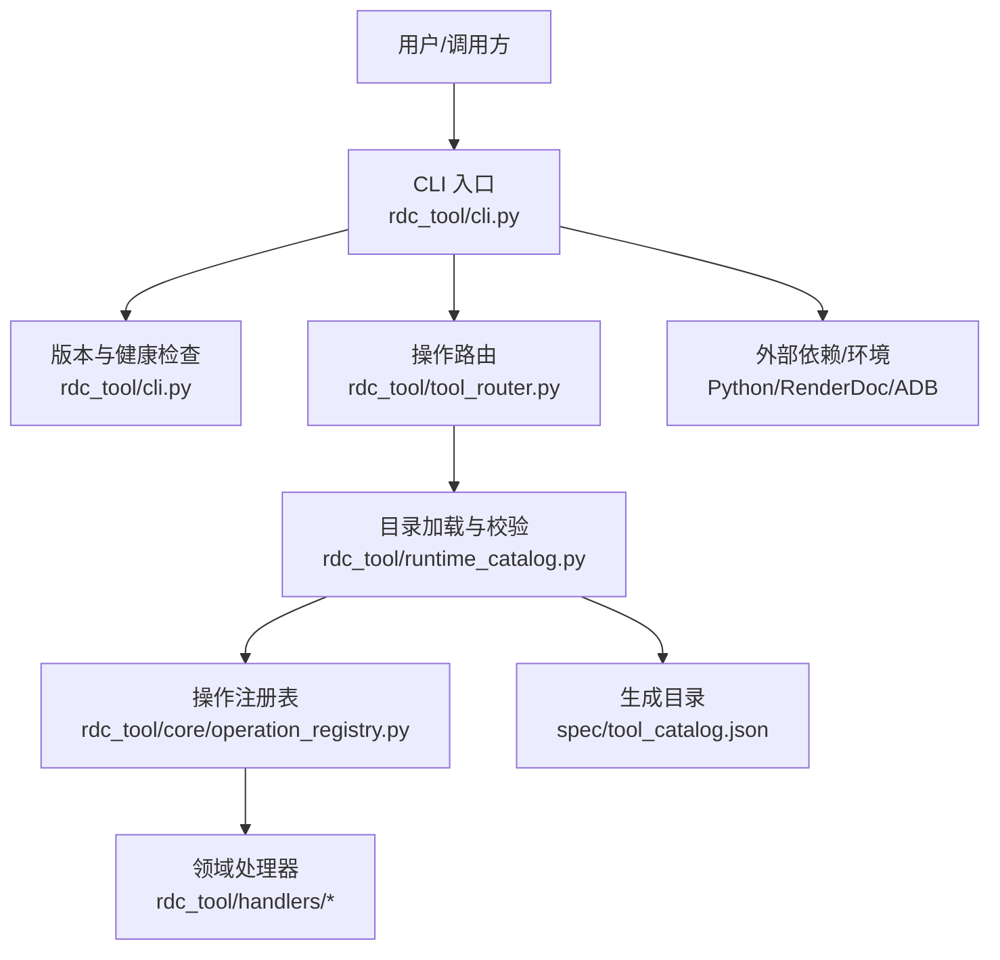
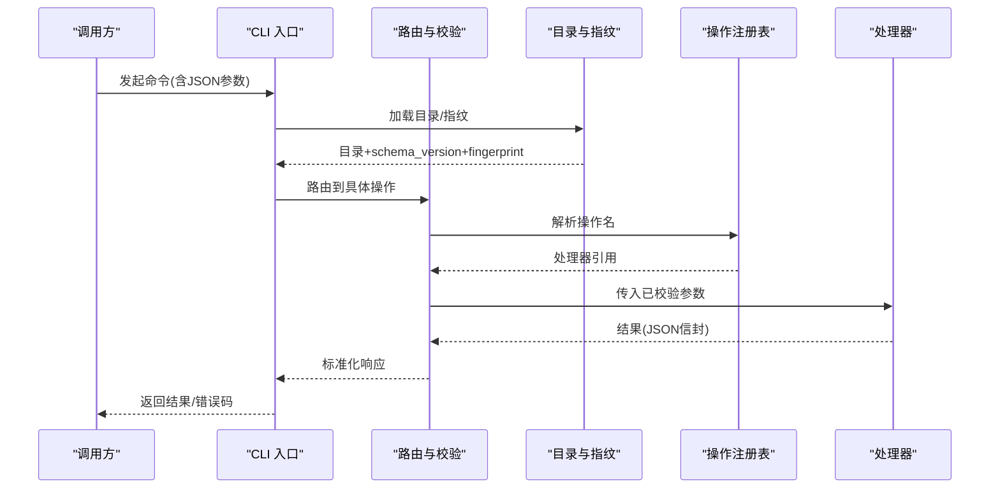
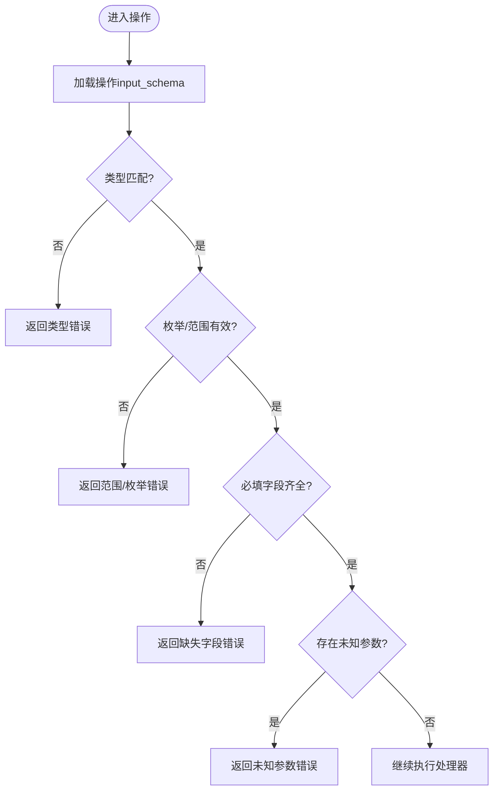
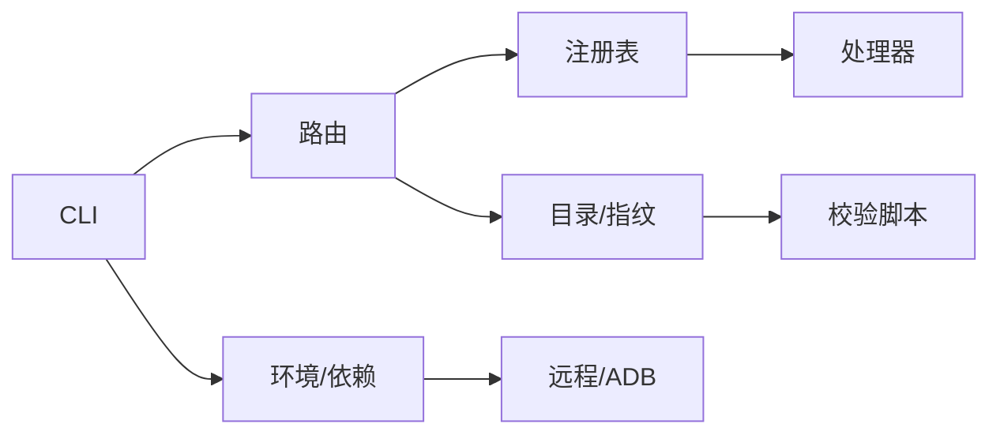

# 版本管理和兼容性

<cite>
**本文引用的文件**
- [README.md](file://README.md)
- [pyproject.toml](file://pyproject.toml)
- [stability.md](file://docs/stability.md)
- [public-contract.md](file://docs/public-contract.md)
- [tool-interface-upgrade.md](file://docs/tool-interface-upgrade.md)
- [cli.py](file://rdc_tool/cli.py)
- [tool_router.py](file://rdc_tool/tool_router.py)
- [runtime_catalog.py](file://rdc_tool/runtime_catalog.py)
- [operation_registry.py](file://rdc_tool/core/operation_registry.py)
- [tool_catalog.json](file://spec/tool_catalog.json)
- [validate_catalog.py](file://spec/validate_catalog.py)
- [remote_bootstrap.py](file://rdc_tool/remote_bootstrap.py)
- [experiment_runner.py](file://rdc_tool/core/experiment_runner.py)
</cite>

## 目录
1. [简介](#简介)
2. [项目结构](#项目结构)
3. [核心组件](#核心组件)
4. [架构总览](#架构总览)
5. [详细组件分析](#详细组件分析)
6. [依赖关系分析](#依赖关系分析)
7. [性能与可维护性考虑](#性能与可维护性考虑)
8. [故障排查指南](#故障排查指南)
9. [结论](#结论)
10. [附录](#附录)

## 简介
本指南面向希望安全更新现有操作、添加新功能并保证向后兼容的开发者与维护者。RDC Tool 采用“代码即契约”的版本管理策略：通过代码生成的工具目录与严格的参数校验，确保 CLI 入口和 JSON 信封稳定；任何接口变更都需同步更新定义、注册表、测试与文档，避免引入运行时别名或隐藏兼容层。本文从语义化版本、API 版本协商、废弃策略、向后/向前兼容设计、迁移路径、兼容性测试、弃用流程、多版本并行部署等方面给出系统化说明，并结合仓库中的实际实现进行映射。

## 项目结构
RDC Tool 以 CLI 为唯一公开入口，通过“操作定义 → 目录生成 → 路由分发 → 处理器执行”的链路提供能力。关键目录与职责如下：
- rdc_tool/cli.py：CLI 入口、健康检查、版本信息输出、错误码与退出码约定。
- rdc_tool/tool_router.py：基于目录的操作路由、前置条件校验、未知参数拒绝。
- rdc_tool/runtime_catalog.py：从代码定义加载工具目录、计算指纹、描述单个操作、校验参数。
- rdc_tool/core/operation_registry.py：统一操作注册表，支持按名称解析与列表枚举。
- spec/tool_catalog.json：由代码生成的工具目录（包含 schema_version、fingerprint、工具分组等）。
- docs/*：稳定性、公共契约、接口升级与迁移说明。
- scripts/*：构建、打包、发布门禁脚本。
- tests/*：单元、契约、集成测试，覆盖行为与契约一致性。

图表来源
- [cli.py:535-550](file://rdc_tool/cli.py#L535-L550)
- [tool_router.py:131-155](file://rdc_tool/tool_router.py#L131-L155)
- [runtime_catalog.py:17-28](file://rdc_tool/runtime_catalog.py#L17-L28)
- [operation_registry.py:18-45](file://rdc_tool/core/operation_registry.py#L18-L45)
- [tool_catalog.json:1-25](file://spec/tool_catalog.json#L1-L25)

章节来源
- [README.md:1-70](file://README.md#L1-L70)
- [pyproject.toml:1-45](file://pyproject.toml#L1-L45)

## 核心组件
- 版本与契约元数据：CLI 输出版本、schema_version、平台、入口点与兼容性信息，供调用方识别能力与约束。
- 目录与指纹：从代码定义生成目录，附带不可变指纹，用于契约校验与一致性门禁。
- 参数校验：在路由阶段对输入参数进行强类型、枚举、范围、必填、未知参数等校验，未知参数直接失败，不隐式转换。
- 操作注册与路由：按命名空间将 rd.* 操作分发到对应处理器，支持前置条件检查与结构化错误返回。
- 稳定性与退出码：明确成功、运行时/断言失败、参数/安装失败的退出码，便于自动化集成。

章节来源
- [cli.py:535-550](file://rdc_tool/cli.py#L535-L550)
- [runtime_catalog.py:38-91](file://rdc_tool/runtime_catalog.py#L38-L91)
- [tool_router.py:131-155](file://rdc_tool/tool_router.py#L131-L155)
- [stability.md:1-50](file://docs/stability.md#L1-L50)

## 架构总览
RDC Tool 的版本管理与兼容性通过以下机制保障：
- 语义化版本：包版本位于配置中，CLI 暴露 tool_version 与 schema_version，调用方可据此选择兼容能力。
- API 版本协商：通过 schema_version 与 catalog fingerprint 表达当前契约；消费者应验证目录与能力，而非依赖包号。
- 废弃策略：旧操作名不再接受，无运行时别名；删除与替代方案在文档中记录，不在运行期做转发。
- 向后兼容：新增可选参数、扩展返回值字段时，保持未知参数拒绝与严格模式，避免破坏既有调用。
- 向前兼容：默认值与可选参数使新客户端可渐进升级；服务端仍接受旧请求（仅使用必要字段）。
- 多版本并行：通过 --daemon-context 隔离上下文，不同调用方可独立管理生命周期与状态。

图表来源
- [cli.py:535-550](file://rdc_tool/cli.py#L535-L550)
- [runtime_catalog.py:17-28](file://rdc_tool/runtime_catalog.py#L17-L28)
- [tool_router.py:131-155](file://rdc_tool/tool_router.py#L131-L155)
- [operation_registry.py:18-45](file://rdc_tool/core/operation_registry.py#L18-L45)

## 详细组件分析

### 版本与契约元数据
- CLI 输出 tool_version、schema_version、platform、entrypoints、compatibility 等信息，供调用方识别能力边界与兼容性。
- 公共契约强调 JSON 信封稳定，TSV 仅在文档声明的命令下稳定；退出码有明确约定。
- Android 连接与远程能力具备所有权与超时预算控制，避免跨进程资源冲突。

章节来源
- [cli.py:535-550](file://rdc_tool/cli.py#L535-L550)
- [public-contract.md:1-26](file://docs/public-contract.md#L1-L26)
- [stability.md:1-50](file://docs/stability.md#L1-L50)

### 目录生成与指纹校验
- 目录来源于代码定义，去重后生成 JSON，附带 schema_version、source_path、fingerprint、tool_count、groups。
- 校验脚本禁止已移除的兼容别名与文案残留，确保目录与实现一致。
- 指纹用于 CI 门禁与消费者能力探测，避免“包号即版本”的错误假设。

章节来源
- [runtime_catalog.py:17-28](file://rdc_tool/runtime_catalog.py#L17-L28)
- [tool_catalog.json:1-25](file://spec/tool_catalog.json#L1-L25)
- [validate_catalog.py:127-161](file://spec/validate_catalog.py#L127-L161)

### 参数校验与未知参数拒绝
- 路由阶段对每个操作的 input_schema 进行强校验：类型、枚举、长度、数值范围、必填、oneOf/not、additionalProperties=false。
- 未知参数直接失败，不翻译旧名或别名；这保证了向后兼容的“只增不改”原则。
- 处理器可通过 prerequisites 声明依赖（如 session_id），未满足则返回结构化错误。

图表来源
- [runtime_catalog.py:38-91](file://rdc_tool/runtime_catalog.py#L38-L91)
- [tool_router.py:131-155](file://rdc_tool/tool_router.py#L131-L155)

章节来源
- [runtime_catalog.py:38-91](file://rdc_tool/runtime_catalog.py#L38-L91)
- [tool_router.py:131-155](file://rdc_tool/tool_router.py#L131-L155)

### 操作注册与路由
- 所有 rd.* 操作通过目录驱动注册到 OperationRegistry，按 domain.action 分发到对应处理器。
- 路由前执行参数校验与前置条件检查，失败即返回结构化错误，避免进入业务逻辑。
- 处理器模块按领域划分（buffer/capture/core/debug/diag/event/export/macro/mesh/perf/pipeline/remote/replay/resource/session/shader/texture/util/vfs）。

章节来源
- [tool_router.py:1-155](file://rdc_tool/tool_router.py#L1-L155)
- [operation_registry.py:18-45](file://rdc_tool/core/operation_registry.py#L18-L45)

### 接口升级与废弃策略
- 当前接口移除了大量旧入口，不提供运行时别名或转发；替代方案在文档中明确。
- 删除项分为“合理”与“删过头”，后者需在 primitive 层面补齐能力，而不是恢复旧包装。
- 新增操作（如 mesh.get_post_transform_data）作为单一入口承载能力，避免重复宏。

章节来源
- [tool-interface-upgrade.md:1-332](file://docs/tool-interface-upgrade.md#L1-L332)

### 向后兼容与向前兼容设计
- 向后兼容：新增可选参数与扩展返回值字段，保持未知参数拒绝与严格模式；消费者忽略未知字段即可兼容新版本。
- 向前兼容：默认值与可选参数允许旧客户端继续使用；服务端仅读取必要字段，不强制新字段。
- 通过 schema_version 与 fingerprint 表达契约版本，消费者应在启动时验证目录与能力。

章节来源
- [stability.md:1-50](file://docs/stability.md#L1-L50)
- [public-contract.md:1-26](file://docs/public-contract.md#L1-L26)
- [runtime_catalog.py:17-28](file://rdc_tool/runtime_catalog.py#L17-L28)

### 多版本并行与上下文隔离
- --daemon-context <id> 选择连续运行时命名空间，省略时使用 default；不同上下文相互隔离。
- 该机制支持多调用方并行使用，避免共享状态冲突；调用方负责上下文生命周期管理。

章节来源
- [stability.md:1-50](file://docs/stability.md#L1-L50)
- [public-contract.md:1-26](file://docs/public-contract.md#L1-L26)

### 远程连接与资源所有权
- Android 连接复用已有 helper，若无则启动自身 helper；拥有权通过 PID 与 ADB forward 标识。
- 清理过程检查 ownership 变化，防止误删其他进程资源；超时预算覆盖引导与连接。

章节来源
- [remote_bootstrap.py:701-742](file://rdc_tool/remote_bootstrap.py#L701-L742)

### 实验与回归判定
- 实验引擎在执行 patch 前后测量指标，结合置信度与阈值判定改进/回归/不确定，并在失败时回滚。
- 该机制可用于灰度验证与回归检测，配合契约测试与真实模型验收。

章节来源
- [experiment_runner.py:83-762](file://rdc_tool/core/experiment_runner.py#L83-L762)

## 依赖关系分析
- CLI 依赖目录与注册表，路由依赖领域处理器；目录来自代码定义，受校验脚本约束。
- 远程能力依赖 ADB/设备状态，具有所有权与清理保护。
- 测试与脚本构成门禁链，确保目录、契约、行为一致性。

图表来源
- [cli.py:535-550](file://rdc_tool/cli.py#L535-L550)
- [tool_router.py:131-155](file://rdc_tool/tool_router.py#L131-L155)
- [runtime_catalog.py:17-28](file://rdc_tool/runtime_catalog.py#L17-L28)
- [validate_catalog.py:127-161](file://spec/validate_catalog.py#L127-L161)
- [remote_bootstrap.py:701-742](file://rdc_tool/remote_bootstrap.py#L701-L742)

章节来源
- [pyproject.toml:1-45](file://pyproject.toml#L1-L45)
- [tool_catalog.json:1-25](file://spec/tool_catalog.json#L1-L25)

## 性能与可维护性考虑
- 目录生成与指纹计算在启动时完成，后续路由轻量；参数校验集中且可复用。
- 处理器按领域拆分，降低耦合；注册表支持批量注册与默认处理器。
- 远程连接具备超时与清理保护，避免资源泄漏与僵尸进程。
- 建议：
  - 新增字段优先使用可选参数与默认值，避免破坏旧调用。
  - 变更 input_schema 时需同步更新测试与文档，并通过校验脚本。
  - 对复杂操作增加 prerequisites 与结构化错误，提升可诊断性。
  - 对远程能力增加幂等与所有权检查，确保清理安全。

[本节为通用指导，无需特定文件来源]

## 故障排查指南
- 参数错误：检查 input_schema 的必填、枚举、范围与未知参数；确认 additionalProperties=false 下的字段拼写。
- 目录不一致：重新生成 tool_catalog.json，核对 fingerprint 与工具数量；运行校验脚本定位问题。
- 远程连接失败：检查 ADB forward 所有权、PID 归属与超时预算；查看清理日志与错误码。
- 退出码含义：0 成功；1 运行时/断言/工具失败；2 参数/安装/引导失败。

章节来源
- [runtime_catalog.py:38-91](file://rdc_tool/runtime_catalog.py#L38-L91)
- [validate_catalog.py:127-161](file://spec/validate_catalog.py#L127-L161)
- [remote_bootstrap.py:701-742](file://rdc_tool/remote_bootstrap.py#L701-L742)
- [stability.md:1-50](file://docs/stability.md#L1-L50)

## 结论
RDC Tool 通过“代码即契约”的版本管理策略，结合严格的参数校验、目录指纹与稳定的 JSON 信封，实现了高可靠的后向兼容与清晰的废弃策略。新增功能应以可选参数与默认值推进，避免破坏既有调用；接口变更需同步更新定义、注册表、测试与文档。通过上下文隔离与远程所有权保护，支持多版本并行与稳健部署。建议在 CI 中加入目录与契约校验、回归测试与灰度验证，确保每次发布的安全性与可追溯性。

[本节为总结，无需特定文件来源]

## 附录

### 版本迁移指南（客户端适配、服务端兼容、数据迁移）
- 客户端适配：
  - 启动时读取 tool_version 与 schema_version，必要时降级或提示升级。
  - 对新增可选参数保持忽略；对新增返回值字段保持健壮解析。
  - 使用 rdc-tool tools list/describe 获取能力清单，动态适配。
- 服务端兼容：
  - 新增字段默认值与可选参数，不强制旧客户端提供。
  - 未知参数拒绝，避免隐式兼容层；通过目录与 schema 表达能力。
- 数据迁移：
  - 对持久化结构采用增量扩展；保留旧字段并标记废弃。
  - 在导入时进行最小必要转换，避免破坏历史数据。

章节来源
- [cli.py:535-550](file://rdc_tool/cli.py#L535-L550)
- [runtime_catalog.py:17-28](file://rdc_tool/runtime_catalog.py#L17-L28)
- [stability.md:1-50](file://docs/stability.md#L1-L50)

### 兼容性测试方法（回归测试、契约测试、灰度发布）
- 回归测试：覆盖参数校验、路由、处理器行为与错误路径；使用 fixtures 与模拟后端。
- 契约测试：校验目录唯一性、名称前缀、移除别名、schema 有效性；CI 门禁必须通过。
- 灰度发布：使用实验引擎对比基线与变更后指标，结合置信度与阈值判定；失败自动回滚。

章节来源
- [validate_catalog.py:127-161](file://spec/validate_catalog.py#L127-L161)
- [experiment_runner.py:83-762](file://rdc_tool/core/experiment_runner.py#L83-L762)

### 版本弃用流程与用户通知
- 弃用步骤：
  - 在文档中标注废弃入口与替代方案。
  - 停止在运行期接受旧名；通过目录与校验拒绝未知参数。
  - 在 CLI 健康检查或版本信息中提示可用能力与迁移指引。
- 用户通知：
  - 通过 rdc-tool version --json 与 rdc-tool tools describe 暴露能力与约束。
  - 在错误消息中提供结构化 code、category、message 与 details，便于自动化处理。

章节来源
- [tool-interface-upgrade.md:1-332](file://docs/tool-interface-upgrade.md#L1-L332)
- [cli.py:535-550](file://rdc_tool/cli.py#L535-L550)
- [stability.md:1-50](file://docs/stability.md#L1-L50)

### 多版本并行技术支持与部署策略
- 技术支撑：
  - --daemon-context 隔离上下文，支持多实例并行。
  - 远程连接具备所有权与清理保护，避免跨进程冲突。
- 部署策略：
  - 先部署新版并保持旧版可用；通过上下文切换逐步迁移调用方。
  - 使用契约校验与回归测试确保新旧版本一致性。
  - 灰度放量，结合实验引擎评估影响，必要时回滚。

章节来源
- [stability.md:1-50](file://docs/stability.md#L1-L50)
- [public-contract.md:1-26](file://docs/public-contract.md#L1-L26)
- [remote_bootstrap.py:701-742](file://rdc_tool/remote_bootstrap.py#L701-L742)