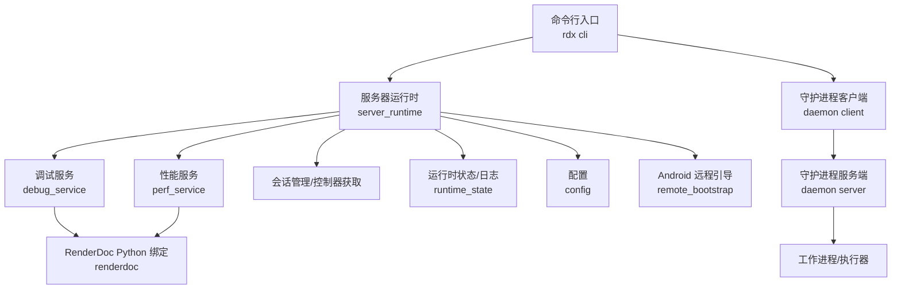
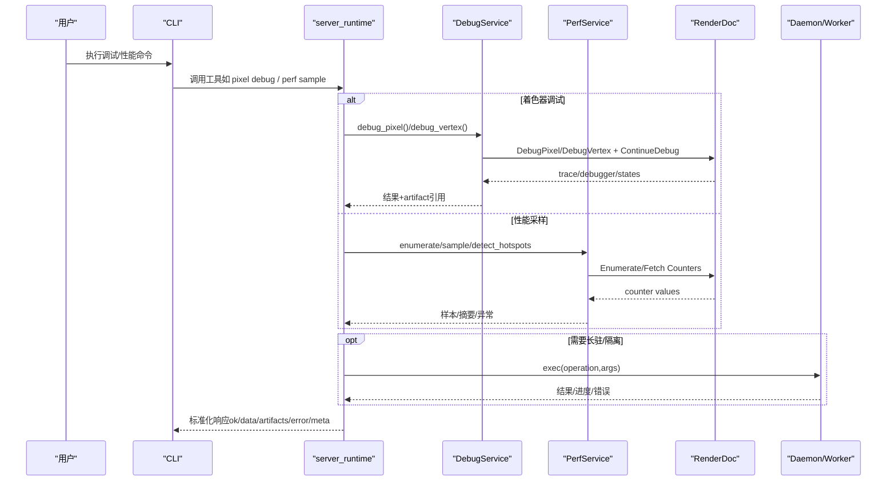
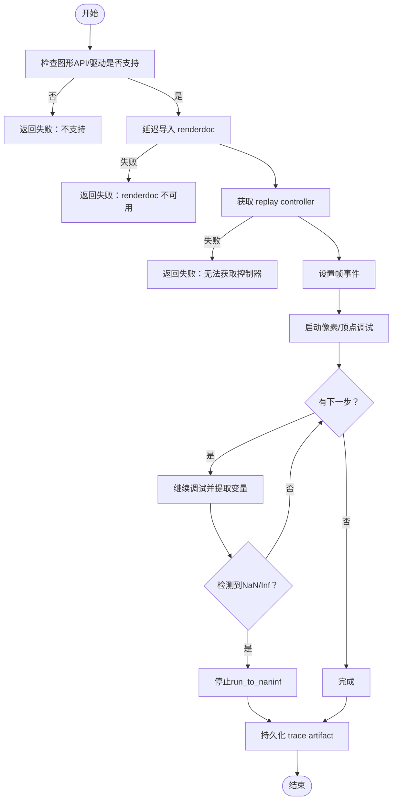
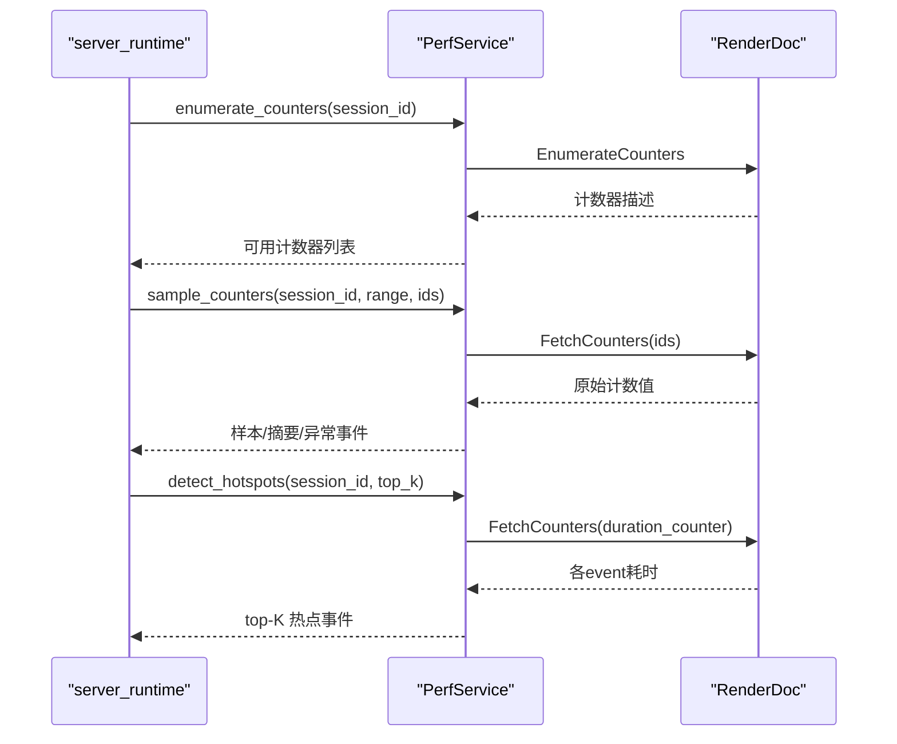
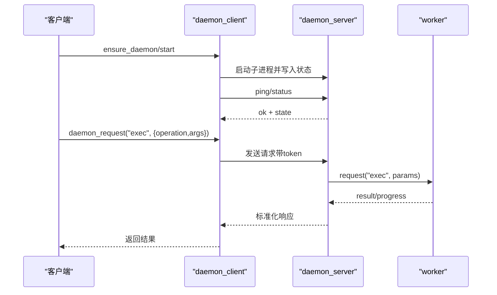
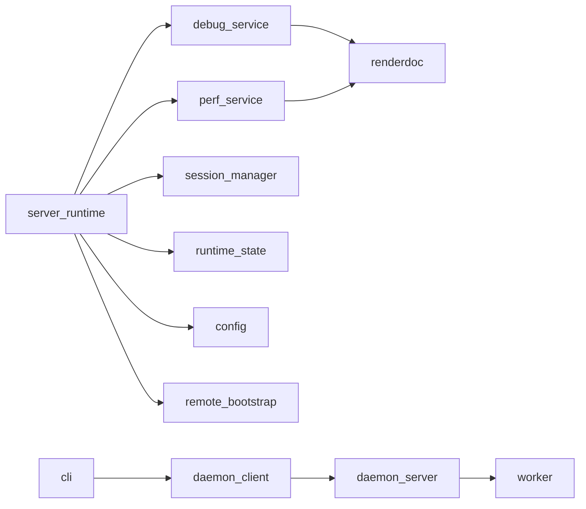

# 调试指南

<cite>
**本文引用的文件**
- [debug_service.py](file://rdx/core/debug_service.py)
- [perf_service.py](file://rdx/core/perf_service.py)
- [server_runtime.py](file://rdx/server_runtime.py)
- [daemon_server.py](file://rdx/daemon/server.py)
- [daemon_client.py](file://rdx/daemon/client.py)
- [config.py](file://rdx/config.py)
- [runtime_state.py](file://rdx/runtime_state.py)
- [remote_bootstrap.py](file://rdx/remote_bootstrap.py)
- [troubleshooting.md](file://docs/troubleshooting.md)
- [cli.py](file://rdx/cli.py)
</cite>

## 目录
1. [简介](#简介)
2. [项目结构](#项目结构)
3. [核心组件](#核心组件)
4. [架构总览](#架构总览)
5. [详细组件分析](#详细组件分析)
6. [依赖关系分析](#依赖关系分析)
7. [性能考虑](#性能考虑)
8. [故障排查指南](#故障排查指南)
9. [结论](#结论)
10. [附录](#附录)

## 简介
本指南面向使用 RDC-Tool（RDX）的开发者，提供系统化的调试方法：包括内置调试服务、日志与结构化记录、性能分析、守护进程与进程间通信排查、RenderDoc 集成（GPU 调试、着色器调试、渲染状态检查）、常见问题诊断流程、远程调试（Android）配置与自动化脚本建议，以及调试结果的分析与报告生成。

## 项目结构
RDX 将“运行时/工具”与“守护进程/工作进程”解耦，通过 Windows 命名管道进行通信；核心能力由 service 层封装 RenderDoc API，并通过 server_runtime 统一注册与分发；配置、持久化状态与日志位于独立模块；Android 远程通过 bootstrap 自动准备环境并建立转发通道。

图表来源
- [server_runtime.py:1-120](file://rdx/server_runtime.py#L1-L120)
- [debug_service.py:1-60](file://rdx/core/debug_service.py#L1-L60)
- [perf_service.py:1-60](file://rdx/core/perf_service.py#L1-L60)
- [daemon_server.py:1-120](file://rdx/daemon/server.py#L1-L120)
- [daemon_client.py:460-520](file://rdx/daemon/client.py#L460-L520)
- [remote_bootstrap.py:510-700](file://rdx/remote_bootstrap.py#L510-L700)

章节来源
- [server_runtime.py:1-120](file://rdx/server_runtime.py#L1-L120)
- [daemon_server.py:1-120](file://rdx/daemon/server.py#L1-L120)
- [daemon_client.py:460-520](file://rdx/daemon/client.py#L460-L520)
- [remote_bootstrap.py:510-700](file://rdx/remote_bootstrap.py#L510-L700)

## 核心组件
- 调试服务（DebugService）：封装 RenderDoc 像素/顶点着色器调试，支持逐步执行、NaN/Inf 检测、trace 持久化为 JSON artifact。
- 性能服务（PerfService）：枚举 GPU 计数器、采样 per-event 计数值、统计异常与热点事件。
- 服务器运行时（server_runtime）：统一注册工具、维护上下文/会话/预览/远程句柄、调度执行、持久化状态与日志。
- 守护进程（daemon server/client）：基于命名管道的长驻服务，负责生命周期管理、心跳、租约、清理与 exec 派发。
- Android 远程引导（remote_bootstrap）：自动安装/启动 RenderDocCmd、探测端口、建立 ADB forward、返回连接信息。
- 配置与状态（config, runtime_state）：环境变量驱动配置、上下文/会话/捕获状态与运行日志的持久化。

章节来源
- [debug_service.py:43-120](file://rdx/core/debug_service.py#L43-L120)
- [perf_service.py:212-318](file://rdx/core/perf_service.py#L212-L318)
- [server_runtime.py:177-239](file://rdx/server_runtime.py#L177-L239)
- [daemon_server.py:102-170](file://rdx/daemon/server.py#L102-L170)
- [remote_bootstrap.py:510-700](file://rdx/remote_bootstrap.py#L510-L700)
- [config.py:117-186](file://rdx/config.py#L117-L186)
- [runtime_state.py:41-57](file://rdx/runtime_state.py#L41-L57)

## 架构总览
RDX 采用“命令→运行时→服务→底层驱动”的分层设计。CLI 调用 server_runtime 暴露的工具，内部再委派到具体 service；需要长驻或跨进程时通过 daemon 协调；Android 场景通过 remote_bootstrap 准备远程环境。

图表来源
- [server_runtime.py:1-120](file://rdx/server_runtime.py#L1-L120)
- [debug_service.py:54-120](file://rdx/core/debug_service.py#L54-L120)
- [perf_service.py:235-318](file://rdx/core/perf_service.py#L235-L318)
- [daemon_server.py:572-643](file://rdx/daemon/server.py#L572-L643)

## 详细组件分析

### 着色器调试（DebugService）
- 能力：按像素坐标或顶点实例启动调试，逐步执行 shader，提取变量变化，检测 NaN/Inf，输出 trace 为 JSON artifact。
- 关键流程：检查支持性→延迟导入 renderdoc→获取 replay controller→设置帧事件→启动调试→循环 ContinueDebug→收集步骤→释放 trace→持久化 artifact。
- 错误处理：不支持 API/驱动、renderdoc 缺失、控制器不可用、ContinueDebug 异常、FreeTrace 异常均被捕获并返回结构化 notes。

图表来源
- [debug_service.py:54-267](file://rdx/core/debug_service.py#L54-L267)

章节来源
- [debug_service.py:43-120](file://rdx/core/debug_service.py#L43-L120)
- [debug_service.py:120-267](file://rdx/core/debug_service.py#L120-L267)
- [debug_service.py:427-490](file://rdx/core/debug_service.py#L427-L490)

### 性能分析与热点检测（PerfService）
- 能力：枚举 GPU 计数器、在指定 event 范围采样、计算统计摘要、识别异常事件、检测 top-K 最慢事件。
- 关键点：通过线程池执行阻塞的 RenderDoc 调用；对 duration 单位与类型做严格校验；空/非有限值报错；z-score 异常阈值固定。
- 输出：per-event 样本、per-counter 摘要（min/max/mean/p95/hotspot）、异常事件列表。

图表来源
- [perf_service.py:235-318](file://rdx/core/perf_service.py#L235-L318)
- [perf_service.py:314-487](file://rdx/core/perf_service.py#L314-L487)
- [perf_service.py:493-618](file://rdx/core/perf_service.py#L493-L618)

章节来源
- [perf_service.py:212-318](file://rdx/core/perf_service.py#L212-L318)
- [perf_service.py:314-487](file://rdx/core/perf_service.py#L314-L487)
- [perf_service.py:493-618](file://rdx/core/perf_service.py#L493-L618)

### 守护进程与进程间通信（Daemon）
- 通信协议：Windows 命名管道，请求体包含 token/method/params；服务端鉴权后路由到对应 handler。
- 生命周期：后台线程监控空闲/租约/所有者丢失，超时则停止；支持 attach/heartbeat/detach 管理客户端存活。
- 执行模型：exec 操作通过 worker 执行，记录 active_operation、trace_id、进度与耗时元数据。

图表来源
- [daemon_client.py:467-520](file://rdx/daemon/client.py#L467-L520)
- [daemon_server.py:572-643](file://rdx/daemon/server.py#L572-L643)
- [daemon_server.py:657-690](file://rdx/daemon/server.py#L657-L690)

章节来源
- [daemon_server.py:102-170](file://rdx/daemon/server.py#L102-L170)
- [daemon_server.py:572-643](file://rdx/daemon/server.py#L572-L643)
- [daemon_client.py:467-520](file://rdx/daemon/client.py#L467-L520)
- [daemon_client.py:623-733](file://rdx/daemon/client.py#L623-L733)

### 日志系统与结构化记录
- 日志级别：可通过环境变量 RDX_LOG_LEVEL 控制；CLI 入口会应用该级别。
- 运行时日志：context/state 与 logs 路径由 runtime_state 提供，JSONL 追加写入，便于查询过滤。
- 操作元数据：daemon.exec 记录 operation、trace_id、duration_ms 等，便于关联问题。

章节来源
- [config.py:117-186](file://rdx/config.py#L117-L186)
- [runtime_state.py:41-57](file://rdx/runtime_state.py#L41-L57)
- [daemon_server.py:616-643](file://rdx/daemon/server.py#L616-L643)
- [cli.py:1756-1769](file://rdx/cli.py#L1756-L1769)

### 远程调试（Android）
- 自动准备：选择设备、探测 ABI、安装/复用 RenderDocCmd、推送配置、启动 Activity、探测 unix socket 端口、建立 ADB forward。
- 连接信息：返回 host/port/remote_port/forward_spec 等，供上层建立渲染后端连接。
- 恢复策略：若连接已消费或占用，需重新连接或通过远程工作流恢复。

章节来源
- [remote_bootstrap.py:510-700](file://rdx/remote_bootstrap.py#L510-L700)
- [remote_bootstrap.py:701-778](file://rdx/remote_bootstrap.py#L701-L778)
- [troubleshooting.md:47-52](file://docs/troubleshooting.md#L47-L52)

## 依赖关系分析
- DebugService/PerfService 依赖 RenderDoc Python 绑定，采用延迟导入避免无渲染环境时加载失败。
- server_runtime 聚合多个 service，并通过 session_manager 获取控制器；同时管理 preview、remotes、shader_debugs 等句柄。
- daemon 与 worker 通过命名管道通信，client 负责启动、等待就绪、心跳与清理。
- Android 远程依赖 adb 与 RenderDocCmd，bootstrap 负责环境准备与端口转发。

图表来源
- [server_runtime.py:177-239](file://rdx/server_runtime.py#L177-L239)
- [debug_service.py:573-595](file://rdx/core/debug_service.py#L573-L595)
- [perf_service.py:73-96](file://rdx/core/perf_service.py#L73-L96)
- [daemon_client.py:623-733](file://rdx/daemon/client.py#L623-L733)
- [remote_bootstrap.py:510-700](file://rdx/remote_bootstrap.py#L510-L700)

章节来源
- [server_runtime.py:177-239](file://rdx/server_runtime.py#L177-L239)
- [debug_service.py:573-595](file://rdx/core/debug_service.py#L573-L595)
- [perf_service.py:73-96](file://rdx/core/perf_service.py#L73-L96)
- [daemon_client.py:623-733](file://rdx/daemon/client.py#L623-L733)
- [remote_bootstrap.py:510-700](file://rdx/remote_bootstrap.py#L510-L700)

## 性能考虑
- 采样开销：GPU 计数器读取为阻塞调用，已通过线程池 offload，避免阻塞事件循环。
- 阈值与范围：采样前校验 event_range 与 counter 可用性；duration 单位必须为秒且结果为浮点/整型宽度合法。
- 热点检测：仅基于单一 duration 计数器排序，top_k 可限制输出规模。
- 资源释放：调试 trace 在 finally 中释放，防止驱动资源泄漏。

章节来源
- [perf_service.py:223-229](file://rdx/core/perf_service.py#L223-L229)
- [perf_service.py:314-380](file://rdx/core/perf_service.py#L314-L380)
- [perf_service.py:493-618](file://rdx/core/perf_service.py#L493-L618)
- [debug_service.py:204-211](file://rdx/core/debug_service.py#L204-L211)

## 故障排查指南

### 连接失败（本地/远程）
- 本地命名管道：确认 daemon 已启动且状态文件存在；检查 token/pipe_name；查看 active_request_count 与 active_operation 定位卡住操作。
- Android 远程：确认 adb devices 可见、ABI 探测成功、RenderDocCmd 已启动、unix socket 端口已出现、ADB forward 已建立；若 remote_handle_consumed，需重新连接。

章节来源
- [daemon_client.py:467-520](file://rdx/daemon/client.py#L467-L520)
- [daemon_server.py:572-643](file://rdx/daemon/server.py#L572-L643)
- [remote_bootstrap.py:510-700](file://rdx/remote_bootstrap.py#L510-L700)
- [troubleshooting.md:13-19](file://docs/troubleshooting.md#L13-L19)

### 内存泄漏与资源未释放
- 调试 trace：确保 FreeTrace 在 finally 中调用；若异常提前退出，仍应释放。
- 会话/捕获：通过 context status 检查当前 session/capture；必要时 clear context 并重新打开 .rdc。
- 守护进程：长时间空闲或 owner 丢失会触发停止；若残留，清理状态文件并重启。

章节来源
- [debug_service.py:204-211](file://rdx/core/debug_service.py#L204-L211)
- [troubleshooting.md:7-12](file://docs/troubleshooting.md#L7-L12)
- [daemon_server.py:532-570](file://rdx/daemon/server.py#L532-L570)

### 性能瓶颈定位
- 使用 PerfService 枚举计数器并采样，关注 p95、异常事件与 hotspot event。
- 若无法获取 duration 计数器，更新匹配的 runtime 或使用全回放计数器测量整段耗时。
- 结合事件图与管线状态，定位具体 draw-call 或 compute 阶段。

章节来源
- [perf_service.py:235-318](file://rdx/core/perf_service.py#L235-L318)
- [perf_service.py:314-487](file://rdx/core/perf_service.py#L314-L487)
- [perf_service.py:493-618](file://rdx/core/perf_service.py#L493-L618)

### 着色器调试失败
- 检查图形 API 是否支持（D3D11/D3D12/Vulkan），OpenGL/ES 不支持。
- 确认 renderdoc Python 模块可用；否则返回 notes 提示。
- 若 DebugPixel/DebugVertex 返回无效 trace，说明该 draw call 不可调试。

章节来源
- [debug_service.py:94-120](file://rdx/core/debug_service.py#L94-L120)
- [debug_service.py:427-466](file://rdx/core/debug_service.py#L427-L466)
- [debug_service.py:573-595](file://rdx/core/debug_service.py#L573-L595)

### 日志级别与结构化日志分析
- 设置 RDX_LOG_LEVEL 调整日志级别；CLI 会在启动时应用。
- 通过 runtime_state 提供的日志路径读取 JSONL，按 operation/trace_id 过滤，结合 daemon.exec 的 meta 字段关联问题。

章节来源
- [config.py:117-186](file://rdx/config.py#L117-L186)
- [runtime_state.py:41-57](file://rdx/runtime_state.py#L41-L57)
- [daemon_server.py:616-643](file://rdx/daemon/server.py#L616-L643)
- [cli.py:1756-1769](file://rdx/cli.py#L1756-L1769)

### 远程调试（Android）设置与使用
- 使用 remote connect/open_replay 流程；成功后通过 context status 验证。
- 若连接被消费，不要复用旧 handle，需重新连接或走远程恢复流程。
- 注意 ADB forward 所有权变更与端口冲突，必要时清理并重试。

章节来源
- [remote_bootstrap.py:510-700](file://rdx/remote_bootstrap.py#L510-L700)
- [troubleshooting.md:47-52](file://docs/troubleshooting.md#L47-L52)

### 调试脚本与自动化建议
- 使用 rdx --json doctor 快速自检工具链与 daemon 状态。
- 使用 rdx context status --json 检查上下文与会话；必要时 clear 并重新打开 capture。
- 对重复问题，录制最小复现命令与参数，导出截图/纹理作为证据。

章节来源
- [troubleshooting.md:3-12](file://docs/troubleshooting.md#L3-L12)

### 调试结果分析与报告生成
- 将调试 trace 与性能样本保存为 artifacts；利用 report 配置生成 HTML/Markdown/JSON 报告。
- 报告中嵌入缩略图与关键指标（p95、异常事件、hotspot），便于归档与分享。

章节来源
- [config.py:107-115](file://rdx/config.py#L107-L115)
- [debug_service.py:212-267](file://rdx/core/debug_service.py#L212-L267)
- [perf_service.py:432-487](file://rdx/core/perf_service.py#L432-L487)

## 结论
RDX 提供了从着色器级到 GPU 级的完整调试与分析能力，配合守护进程与 Android 远程支持，覆盖本地与移动平台。通过结构化日志、artifacts 与报告机制，开发者可以高效定位问题、量化性能并生成可追溯的证据。建议在复杂场景中优先使用 PerfService 与 DebugService 的组合，并结合 daemon 的 exec 元数据进行端到端追踪。

## 附录
- 常用命令参考：doctor、context status/clear/update、event show、pipeline show、export screenshot。
- 环境变量：RDX_LOG_LEVEL、RDX_RENDERDOC_PATH、RDX_ARTIFACT_STORE、RDX_DATA_DIR、RDX_REPORT_DIR、RDX_GPU_VENDOR、RDX_HEADLESS 等。
- 状态文件位置：daemon/session/runtime 状态与日志位于运行时目录，按 context 区分。

章节来源
- [troubleshooting.md:3-12](file://docs/troubleshooting.md#L3-L12)
- [config.py:117-186](file://rdx/config.py#L117-L186)
- [runtime_state.py:41-57](file://rdx/runtime_state.py#L41-L57)