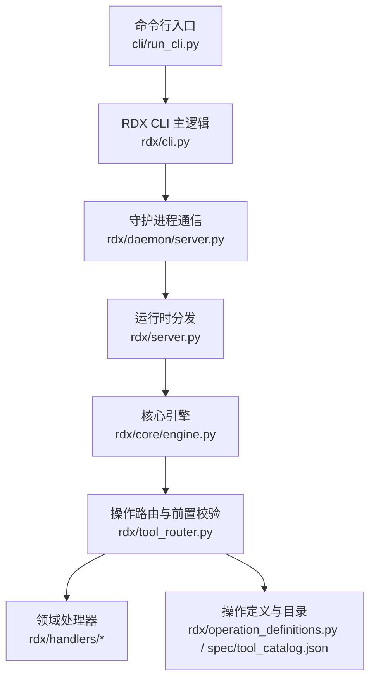
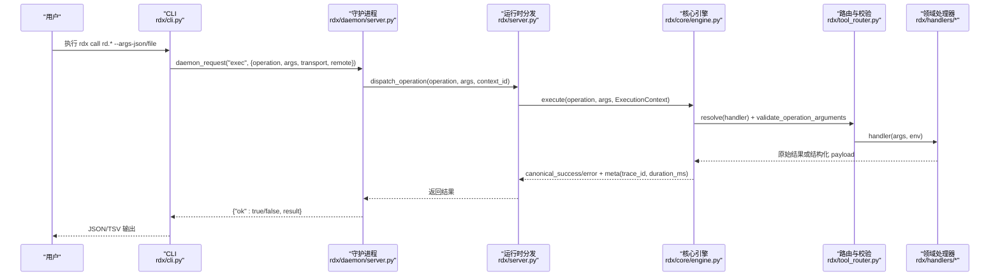
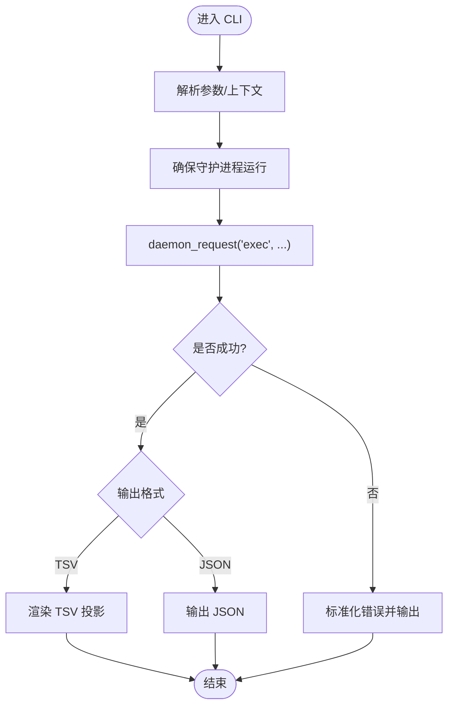
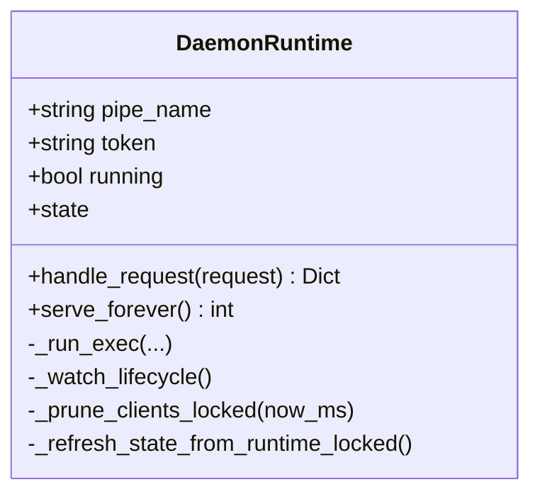
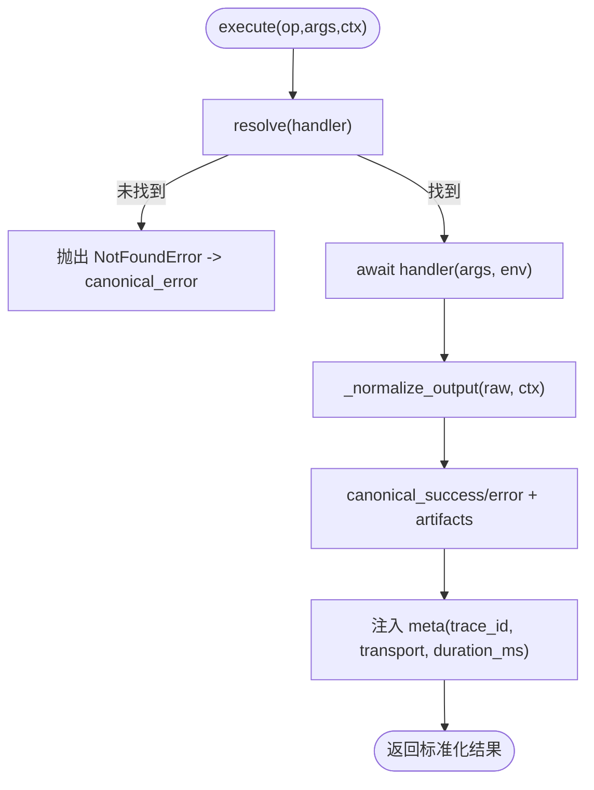
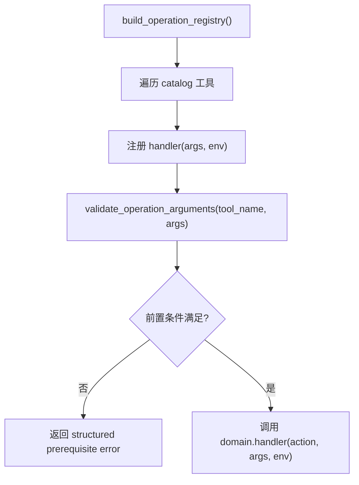
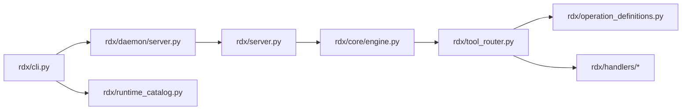

# 工具收敛任务执行记录

<cite>
**本文引用的文件**
- [README.md](file://README.md)
- [docs/tool-convergence-tasks.md](file://docs/tool-convergence-tasks.md)
- [rdx/cli.py](file://rdx/cli.py)
- [cli/run_cli.py](file://cli/run_cli.py)
- [rdx/server.py](file://rdx/server.py)
- [rdx/core/engine.py](file://rdx/core/engine.py)
- [rdx/daemon/server.py](file://rdx/daemon/server.py)
- [rdx/tool_router.py](file://rdx/tool_router.py)
- [rdx/runtime_catalog.py](file://rdx/runtime_catalog.py)
- [rdx/operation_definitions.py](file://rdx/operation_definitions.py)
- [spec/tool_catalog.json](file://spec/tool_catalog.json)
- [docs/tools.md](file://docs/tools.md)
- [pyproject.toml](file://pyproject.toml)
</cite>

## 目录
1. [简介](#简介)
2. [项目结构](#项目结构)
3. [核心组件](#核心组件)
4. [架构总览](#架构总览)
5. [详细组件分析](#详细组件分析)
6. [依赖关系分析](#依赖关系分析)
7. [性能与可靠性](#性能与可靠性)
8. [故障排查指南](#故障排查指南)
9. [结论](#结论)
10. [附录](#附录)

## 简介
本记录聚焦“工具收敛”目标：将工具集从历史规模收敛至稳定、可验证的集合，并补齐缺失能力、修复集成问题、完善文档与门禁。当前仓库提供以 CLI 为主的 RenderDoc .rdc 运行时（Windows x64 本地回放 + Android 远程回放），通过 rdx 命令暴露 JSON-first 的 rd.* 操作；可用工具清单由操作定义生成并通过 discovery 暴露。

- 入口与常用命令见 README 中的示例。
- 工具契约、分组与发现接口在 docs/tools.md 中说明。
- 本次收敛的核心事实、任务矩阵与验收证据集中在 docs/tool-convergence-tasks.md。

**章节来源**
- [README.md:1-70](file://README.md#L1-L70)
- [docs/tools.md:1-39](file://docs/tools.md#L1-L39)

## 项目结构
仓库采用“CLI + Daemon + Core Engine + Handlers + Catalog”的分层组织：
- 顶层 CLI 入口：rdx/cli.py、cli/run_cli.py、rdx.bat/bin/rdx
- 守护进程：rdx/daemon/server.py（命名管道）
- 统一执行引擎：rdx/core/engine.py
- 操作路由与注册：rdx/tool_router.py
- 操作定义与目录：rdx/operation_definitions.py、spec/tool_catalog.json
- 运行时目录与路径：rdx/runtime_catalog.py、rdx/runtime_paths.py（未展开）
- 业务处理器：rdx/handlers/*（按领域划分）
- 构建与脚本：scripts/*、pyproject.toml

**图表来源**
- [cli/run_cli.py:226-282](file://cli/run_cli.py#L226-L282)
- [rdx/cli.py:240-261](file://rdx/cli.py#L240-L261)
- [rdx/daemon/server.py:537-606](file://rdx/daemon/server.py#L537-L606)
- [rdx/server.py:62-142](file://rdx/server.py#L62-L142)
- [rdx/core/engine.py:40-75](file://rdx/core/engine.py#L40-L75)
- [rdx/tool_router.py:131-154](file://rdx/tool_router.py#L131-L154)
- [rdx/operation_definitions.py:1-200](file://rdx/operation_definitions.py#L1-L200)
- [spec/tool_catalog.json:1-25](file://spec/tool_catalog.json#L1-L25)

**章节来源**
- [pyproject.toml:1-45](file://pyproject.toml#L1-L45)
- [docs/tools.md:1-39](file://docs/tools.md#L1-L39)

## 核心组件
- CLI 适配器：负责参数解析、JSON/TSV 输出、doctor/version/completion、上下文管理、调用 daemon 执行 rd.* 操作。
- Daemon 服务：基于 Windows 命名管道的长驻进程，维护上下文状态、工作进程生命周期、心跳与租约、活跃请求计数、最近操作记录等。
- 核心引擎：统一封装操作执行、异常映射、结果归一化、元数据注入（trace_id、transport、duration_ms）。
- 操作路由：从 catalog 加载工具定义，按 domain.action 分派到 handlers，并在执行前进行参数校验与前置条件检查。
- 目录与契约：操作定义集中声明输入约束、前置条件、作用域、效果、证据类型与路径输入；catalog 提供指纹与分组统计。

**章节来源**
- [rdx/cli.py:54-118](file://rdx/cli.py#L54-L118)
- [rdx/daemon/server.py:101-163](file://rdx/daemon/server.py#L101-L163)
- [rdx/core/engine.py:21-75](file://rdx/core/engine.py#L21-L75)
- [rdx/tool_router.py:34-57](file://rdx/tool_router.py#L34-L57)
- [rdx/runtime_catalog.py:13-28](file://rdx/runtime_catalog.py#L13-L28)
- [rdx/operation_definitions.py:1-200](file://rdx/operation_definitions.py#L1-L200)

## 架构总览
下图展示一次典型 CLI 调用到后端执行的端到端流程，包括上下文选择、守护进程调度、核心引擎执行与结果归一化。

**图表来源**
- [rdx/cli.py:240-261](file://rdx/cli.py#L240-L261)
- [rdx/daemon/server.py:537-606](file://rdx/daemon/server.py#L537-L606)
- [rdx/server.py:62-142](file://rdx/server.py#L62-L142)
- [rdx/core/engine.py:40-75](file://rdx/core/engine.py#L40-L75)
- [rdx/tool_router.py:131-154](file://rdx/tool_router.py#L131-L154)

## 详细组件分析

### CLI 适配器（rdx/cli.py）
- 职责：
  - 解析参数、构造 JSON/TSV 输出、doctor/version/completion。
  - 通过 ensure_daemon + daemon_request 调用守护进程执行 rd.* 操作。
  - 处理 session_id 默认推导、tabular 投影渲染、错误规范化。
- 关键点：
  - _daemon_exec 封装了超时策略与错误包装。
  - _render_tabular 支持 TSV 投影，失败时回退为结构化错误提示。
  - 上下文隔离通过 --daemon-context 控制。

**图表来源**
- [rdx/cli.py:240-261](file://rdx/cli.py#L240-L261)
- [rdx/cli.py:327-391](file://rdx/cli.py#L327-L391)

**章节来源**
- [rdx/cli.py:54-118](file://rdx/cli.py#L54-L118)
- [rdx/cli.py:240-261](file://rdx/cli.py#L240-L261)
- [rdx/cli.py:327-391](file://rdx/cli.py#L327-L391)

### 守护进程（rdx/daemon/server.py）
- 职责：
  - 命名管道监听、认证、方法分发（ping/status/shutdown/exec/clear_context 等）。
  - 维护上下文状态、工作进程生命周期、客户端心跳与租约、活跃请求计数、最近操作。
  - 清理空闲/超时的上下文，保障资源释放。
- 关键点：
  - handle_request 对 exec 进行线程安全封装，转发给 worker 执行。
  - clear_context 会尝试停止 worker 并清理快照与状态。
  - 生命周期监控线程根据 owner_pid、attached_clients、idle_timeout 决定是否退出。

**图表来源**
- [rdx/daemon/server.py:101-163](file://rdx/daemon/server.py#L101-L163)
- [rdx/daemon/server.py:537-606](file://rdx/daemon/server.py#L537-L606)
- [rdx/daemon/server.py:507-535](file://rdx/daemon/server.py#L507-L535)

**章节来源**
- [rdx/daemon/server.py:101-163](file://rdx/daemon/server.py#L101-L163)
- [rdx/daemon/server.py:537-606](file://rdx/daemon/server.py#L537-L606)

### 核心引擎（rdx/core/engine.py）
- 职责：
  - 统一执行操作、捕获耗时、注入 trace_id/transport/duration_ms。
  - 将多种返回形式归一化为标准 envelope（schema_version/tool_version/result_kind/ok/data/artifacts/error/meta/projections）。
  - 收集 artifact 候选并发布。
- 关键点：
  - 异常映射为 CoreError，统一错误码与分类。
  - 兼容旧式 success/error_message 与新式 ok/data 结构。

**图表来源**
- [rdx/core/engine.py:40-75](file://rdx/core/engine.py#L40-L75)
- [rdx/core/engine.py:77-203](file://rdx/core/engine.py#L77-L203)

**章节来源**
- [rdx/core/engine.py:21-75](file://rdx/core/engine.py#L21-L75)
- [rdx/core/engine.py:77-203](file://rdx/core/engine.py#L77-L203)

### 操作路由与前置校验（rdx/tool_router.py）
- 职责：
  - 从 catalog 加载工具定义，按 domain.action 路由到对应 handler。
  - 在执行前进行参数校验与前置条件检查（如 session_id、capture_file_id、remote 能力等）。
- 关键点：
  - _enforce_prerequisites 读取上下文快照判断前置是否满足，否则返回结构化错误。
  - 支持 when 条件（如 options.remote_id_present）控制前置生效范围。

**图表来源**
- [rdx/tool_router.py:131-154](file://rdx/tool_router.py#L131-L154)
- [rdx/tool_router.py:89-128](file://rdx/tool_router.py#L89-L128)

**章节来源**
- [rdx/tool_router.py:34-57](file://rdx/tool_router.py#L34-L57)
- [rdx/tool_router.py:89-128](file://rdx/tool_router.py#L89-L128)
- [rdx/tool_router.py:131-154](file://rdx/tool_router.py#L131-L154)

### 操作定义与目录（rdx/operation_definitions.py、spec/tool_catalog.json）
- 职责：
  - 单一权威源声明所有 rd.* 操作的名称、分组、描述、参数约束、前置条件、作用域、效果、证据类型与路径输入。
  - 生成 catalog 与参考文档，提供指纹用于一致性校验。
- 关键点：
  - tool_count 与 groups 统计来自 catalog。
  - runtime_catalog 提供 load_tool_catalog、describe_operation、validate_operation_arguments。

**章节来源**
- [rdx/operation_definitions.py:1-200](file://rdx/operation_definitions.py#L1-L200)
- [spec/tool_catalog.json:1-25](file://spec/tool_catalog.json#L1-L25)
- [rdx/runtime_catalog.py:13-28](file://rdx/runtime_catalog.py#L13-L28)
- [rdx/runtime_catalog.py:31-90](file://rdx/runtime_catalog.py#L31-L90)

## 依赖关系分析
- 模块耦合：
  - CLI 依赖 daemon client、runtime paths、timeout policy、tool catalog。
  - Daemon 依赖 worker、runtime state、context snapshot、progress sink。
  - Server 依赖 core engine、artifact publisher、server_runtime。
  - Engine 依赖 operation registry、contracts、errors、progress reporter。
  - Router 依赖 server_runtime 的 catalog 与 handlers。
- 外部依赖：
  - Python 运行时与第三方库（aiofiles、jinja2、numpy、Pillow、pydantic）。
  - Windows 命名管道、ctypes 系统调用。
  - RenderDoc 二进制与绑定（renderdoc.dll/pyd/json）。

**图表来源**
- [rdx/cli.py:17-46](file://rdx/cli.py#L17-L46)
- [rdx/daemon/server.py:17-28](file://rdx/daemon/server.py#L17-L28)
- [rdx/server.py:7-11](file://rdx/server.py#L7-L11)
- [rdx/core/engine.py:12-16](file://rdx/core/engine.py#L12-L16)
- [rdx/tool_router.py:7-30](file://rdx/tool_router.py#L7-L30)

**章节来源**
- [pyproject.toml:13-19](file://pyproject.toml#L13-L19)
- [rdx/cli.py:17-46](file://rdx/cli.py#L17-L46)
- [rdx/daemon/server.py:17-28](file://rdx/daemon/server.py#L17-L28)
- [rdx/server.py:7-11](file://rdx/server.py#L7-L11)
- [rdx/core/engine.py:12-16](file://rdx/core/engine.py#L12-L16)
- [rdx/tool_router.py:7-30](file://rdx/tool_router.py#L7-L30)

## 性能与可靠性
- 性能特征：
  - 核心引擎记录 duration_ms，便于定位慢操作。
  - 守护进程维护 active_request_count 与 last_activity_at，支持空闲回收。
  - 异步执行与进度上报（ProgressReporter）提升长耗时任务的可观测性。
- 可靠性：
  - 统一错误映射与标准化 envelope，便于上层消费。
  - 前置条件校验避免无效调用。
  - 守护进程租约与心跳机制防止僵尸连接。
- 优化建议：
  - 对大对象输出优先使用 artifact 文件而非 JSON 内联。
  - 合理设置超时策略（daemon_exec_timeout_s、worker_exec_timeout_s）。
  - 利用 TSV 投影减少控制台输出体积。

[本节为通用指导，不直接分析具体文件]

## 故障排查指南
- 常见问题定位：
  - doctor 命令检查环境完整性（Python、RenderDoc 布局、SPIR-V 工具、catalog 路径、启动器存在性）。
  - 若 daemon 不可用，检查命名管道、token、owner_pid、lease/idle 超时。
  - 若操作失败，查看 meta.trace_id 与 duration_ms，结合最近操作日志定位阶段。
- 常见错误：
  - 前置条件缺失（session_id/capture_file_id/remote 能力）：检查上下文与参数。
  - 参数校验失败：对照 input_schema 修正类型、枚举、范围。
  - TSV 投影不支持：改用 JSON 或选择支持 tabular 的命令。
- 恢复步骤：
  - 清理上下文：rdx context clear 或 daemon clear_context。
  - 重启守护进程：stop/start。
  - 重新打开捕获：rdx capture open --file ...。

**章节来源**
- [rdx/cli.py:407-529](file://rdx/cli.py#L407-L529)
- [rdx/daemon/server.py:537-606](file://rdx/daemon/server.py#L537-L606)
- [rdx/core/engine.py:62-75](file://rdx/core/engine.py#L62-L75)

## 结论
本次工具收敛以“必要能力恢复”为主线，完成了 18 项缺失能力的映射、实现与验证，修复了原生基础、管线与描述符、捕获与结构化数据、初始内容与帧计时、Agent 策略与手册、Android 重复观察等关键问题，并通过真实用例与门禁保障了稳定性。最终形成稳定的 128 个 rd.* 操作集合，具备清晰的契约、可靠的执行链路和完善的诊断能力。后续可按需扩展新工具，但应遵循现有目录与路由规范，保持向后兼容与可验证性。

[本节为总结，不直接分析具体文件]

## 附录
- 快速上手：
  - 版本与环境检查：rdx --version、rdx --json doctor
  - 工具发现：rdx tools list --json、rdx tools search <query>
  - 上下文管理：rdx context status/update/list/clear
  - 直接调用：rdx call rd.* --args-file/--args-json --format json/tsv
- 参考文档：
  - 会话模型、Agent 模型、安装、稳定性、文档治理、工具参考、工具接口升级、Native Agent Playbook、Fixture 策略、脚本说明。

**章节来源**
- [README.md:5-27](file://README.md#L5-L27)
- [docs/tools.md:1-39](file://docs/tools.md#L1-L39)
- [docs/tool-reference.md:1-31](file://docs/tool-reference.md#L1-L31)