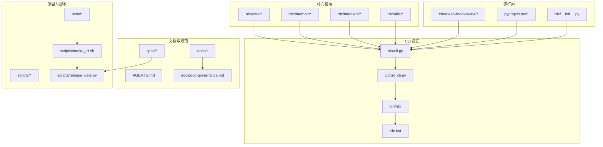
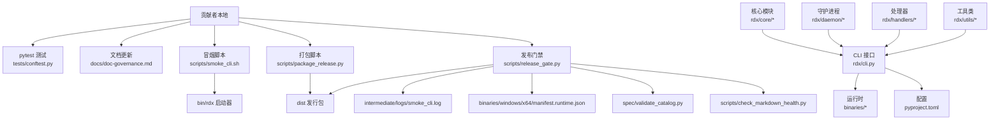
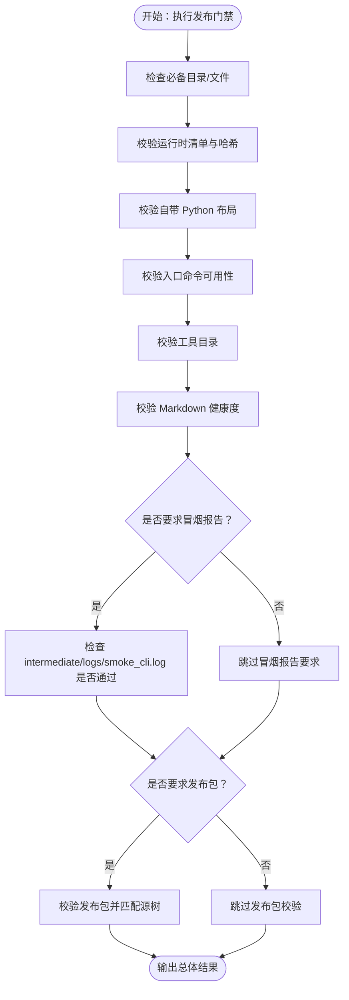
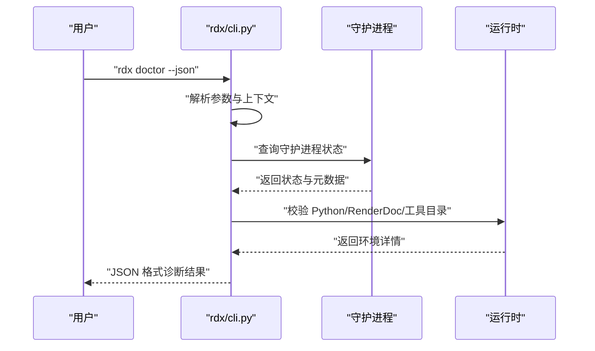
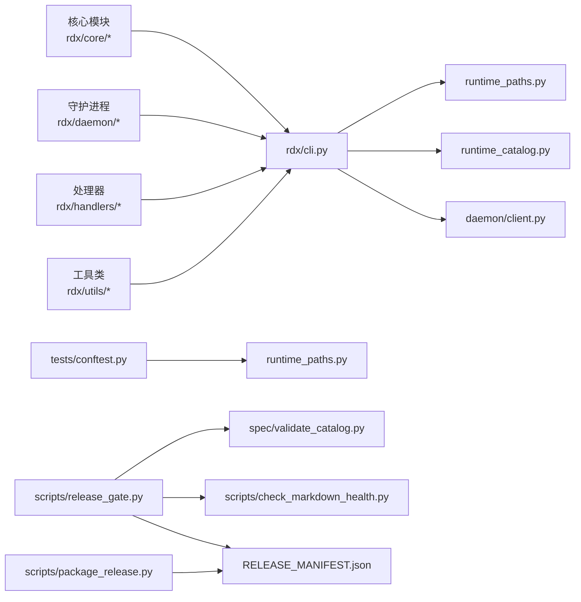

# 贡献流程

<cite>
**本文引用的文件**
- [README.md](file://README.md)
- [AGENTS.md](file://AGENTS.md)
- [docs/doc-governance.md](file://docs/doc-governance.md)
- [pyproject.toml](file://pyproject.toml)
- [scripts/README.md](file://scripts/README.md)
- [scripts/smoke_cli.sh](file://scripts/smoke_cli.sh)
- [scripts/release_gate.py](file://scripts/release_gate.py)
- [scripts/package_release.py](file://scripts/package_release.py)
- [tests/conftest.py](file://tests/conftest.py)
- [rdx/cli.py](file://rdx/cli.py)
- [rdx/__init__.py](file://rdx/__init__.py)
- [spec/tool_catalog.json](file://spec/tool_catalog.json)
</cite>

## 更新摘要
**所做更改**
- 扩展了代理治理范围，涵盖核心 rdx 模块、CLI 接口、文档、脚本、测试和规格
- 更新了开发工作流程，考虑这些组件之间的相互依赖关系
- 增强了项目结构说明，包括完整的目录组织和职责划分
- 完善了版本控制和代码审查流程，确保跨组件变更的一致性

## 目录
1. [简介](#简介)
2. [项目结构](#项目结构)
3. [核心组件](#核心组件)
4. [架构总览](#架构总览)
5. [详细组件分析](#详细组件分析)
6. [依赖关系分析](#依赖关系分析)
7. [性能考虑](#性能考虑)
8. [故障排查指南](#故障排查指南)
9. [结论](#结论)
10. [附录](#附录)

## 简介
本指南面向希望参与 RDX Agent Tools 工具集开发的贡献者，覆盖从开发环境准备、代码提交与分支管理、合并请求流程到文档治理、版本控制与代码审查的最佳实践。同时提供脚本化测试与发布门禁检查的工作流说明，帮助确保变更质量与一致性。

**更新** 本次更新扩展了代理治理范围，现在涵盖核心 rdx 模块、CLI 接口、文档、脚本、测试和规格等更广泛的项目结构。开发工作流程需要考虑这些组件之间的相互依赖关系，确保变更的一致性和完整性。

## 项目结构
该仓库采用"CLI 优先"的包形态，核心入口为 Windows 批处理启动器与跨平台二进制启动器，配合自包含的 Python 运行时与工具目录，形成可独立部署的发行包。关键目录与文件职责概览：

- **rdx/**：Python 包，包含核心模块、守护进程、处理器、工具路由等
- **bin/**：二进制启动器目录
- **cli/**：CLI 适配层和启动脚本
- **docs/**：用户与内部文档，遵循"CLI 命令优先"原则
- **scripts/**：可复用的冒烟与发布门禁检查脚本
- **tests/**：基于 pytest 的测试框架，含自动清理运行时状态的夹具
- **binaries/**：自包含运行时与模块
- **spec/**：工具目录与校验脚本
- **policy/**：策略定义
- **intermediate/**：中间产物和运行时状态

**图表来源**
- [rdx/cli.py:1-800](file://rdx/cli.py#L1-L800)
- [AGENTS.md:1-22](file://AGENTS.md#L1-L22)
- [docs/doc-governance.md:1-14](file://docs/doc-governance.md#L1-L14)
- [scripts/release_gate.py:27-50](file://scripts/release_gate.py#L27-L50)

**章节来源**
- [README.md:1-68](file://README.md#L1-L68)
- [AGENTS.md:1-22](file://AGENTS.md#L1-L22)
- [docs/doc-governance.md:1-14](file://docs/doc-governance.md#L1-L14)
- [scripts/README.md:1-26](file://scripts/README.md#L1-L26)

## 核心组件
- **CLI 启动与命令分发**：通过 rdx/cli.py 提供统一入口，支持 doctor、tools、daemon、context、session preview、call、capture、vfs、diff、assert、completion 等命令族
- **核心模块**：rdx/core/ 包含引擎、会话管理、服务层等核心功能
- **守护进程**：rdx/daemon/ 提供客户端-服务器通信机制
- **处理器**：rdx/handlers/ 实现各种工具的具体逻辑
- **发布门禁检查**：scripts/release_gate.py 对结构完整性、清单一致性、用户文档合规性、入口可用性、工具目录校验、Markdown 健康度、冒烟日志与发布包进行综合检查
- **冒烟脚本**：scripts/smoke_cli.sh 以 Bash 直接调用 bin/rdx 执行基础与可选捕获链路，输出中间日志
- **发布打包**：scripts/package_release.py 构建自包含 Windows x64 Zip 包，生成清单与校验信息
- **测试夹具**：tests/conftest.py 在每次测试前/后隔离并清理运行时状态，保证测试稳定性
- **文档治理**：docs/doc-governance.md 明确用户文档与内部文档边界、导航链接维护与预览几何一致性要求

**章节来源**
- [rdx/cli.py:1-800](file://rdx/cli.py#L1-L800)
- [scripts/release_gate.py:1-200](file://scripts/release_gate.py#L1-L200)
- [scripts/smoke_cli.sh:1-263](file://scripts/smoke_cli.sh#L1-L263)
- [scripts/package_release.py:1-100](file://scripts/package_release.py#L1-L100)
- [tests/conftest.py:1-44](file://tests/conftest.py#L1-L44)
- [docs/doc-governance.md:1-14](file://docs/doc-governance.md#L1-L14)

## 架构总览
下图展示从贡献者本地到发布门禁的整体流程，以及关键组件之间的交互。

**图表来源**
- [scripts/smoke_cli.sh:1-263](file://scripts/smoke_cli.sh#L1-L263)
- [scripts/package_release.py:1-100](file://scripts/package_release.py#L1-L100)
- [scripts/release_gate.py:1-200](file://scripts/release_gate.py#L1-L200)
- [tests/conftest.py:1-44](file://tests/conftest.py#L1-L44)
- [docs/doc-governance.md:1-14](file://docs/doc-governance.md#L1-L14)

## 详细组件分析

### 贡献流程与分支策略
- **分支命名建议**
  - 功能开发：feature/功能点简述
  - 修复：fix/问题描述
  - 文档：docs/更新范围
  - 重构：refactor/影响范围
- **提交信息规范**
  - 类型: 摘要
  - 类型取值：feat、fix、docs、style、refactor、perf、test、build、ci、chore
  - 摘要简洁明确，必要时在正文补充动机与影响
- **合并请求（MR）**
  - 必须包含冒烟日志与测试结果摘要
  - 需通过发布门禁检查
  - 至少一名维护者审查并批准
  - 合并前确保工具目录与用户文档同步更新

**更新** 由于代理治理现在涵盖更广泛的项目结构，在提交变更时需要考虑以下组件的相互影响：
- 核心 rdx 模块变更需要更新相关文档和测试
- CLI 接口变更需要同步更新工具目录和用户文档
- 脚本变更需要验证冒烟测试和发布门禁
- 测试变更需要确保与其他组件的兼容性

**章节来源**
- [scripts/release_gate.py:1-200](file://scripts/release_gate.py#L1-L200)
- [docs/doc-governance.md:1-14](file://docs/doc-governance.md#L1-L14)
- [AGENTS.md:1-22](file://AGENTS.md#L1-L22)

### 文档治理规则
- **用户文档优先**：仅描述 Shell 入口与标准 JSON 行为，避免暴露 Python 内部实现
- **导航链接维护**：保持与 AGENTS.md 一致；用户文档不得引导用户执行虚拟环境或包管理器安装
- **版本与依赖来源**：GA 产物自包含，依赖来源通过 pyproject.toml、运行时清单、许可证清单与 SBOM 追踪
- **工具目录同步**：对涉及预览几何的行为变更，需同步更新 preview_geometry_smoke.py 与用户文档

**更新** 文档治理规则现已扩展到涵盖整个项目结构：
- 核心模块文档应关注 API 设计和使用模式
- CLI 文档应保持与实现的一致性
- 脚本文档应包含完整的使用示例和错误处理
- 测试文档应说明测试策略和覆盖率要求

**章节来源**
- [docs/doc-governance.md:1-14](file://docs/doc-governance.md#L1-L14)
- [AGENTS.md:1-22](file://AGENTS.md#L1-L22)

### 版本控制与代码审查
- **版本号来源**：pyproject.toml 中的 project.version
- **变更记录**：CHANGELOG.md 由维护者更新
- **审查要点**
  - CLI 命令行为与 JSON 输出一致性
  - 工具目录变更与 catalog 校验
  - 用户文档与内部文档边界清晰
  - 发布门禁检查项全部通过

**更新** 代码审查现在需要考虑跨组件的影响：
- 核心模块变更需要评估对 CLI 和测试的影响
- CLI 变更需要验证工具目录和用户文档
- 脚本变更需要确保冒烟测试和发布门禁通过
- 测试变更需要覆盖相关的功能路径

**章节来源**
- [pyproject.toml:1-45](file://pyproject.toml#L1-L45)
- [scripts/release_gate.py:1-200](file://scripts/release_gate.py#L1-L200)

### 开发环境搭建
- **基础依赖**
  - Python：>=3.11（推荐使用系统自带或已配置的解释器）
  - 依赖声明：见 pyproject.toml 的 dependencies 与 optional-dependencies.dev
- **安装与运行**
  - 使用 pip 安装开发依赖：pytest
  - 运行测试：pytest（默认 testpaths 指向 tests，且忽略 intermediate、binaries 等目录）
  - 运行冒烟：bash scripts/smoke_cli.sh（在 Bash 终端中可见每一步 CLI 调用）
- **CLI 入口**
  - rdx 命令由 pyproject.toml 的 project.scripts.rdx 指定
  - 支持 completion 生成不同 Shell 的补全脚本

**章节来源**
- [pyproject.toml:1-45](file://pyproject.toml#L1-L45)
- [tests/conftest.py:1-44](file://tests/conftest.py#L1-L44)
- [scripts/README.md:1-26](file://scripts/README.md#L1-L26)
- [scripts/smoke_cli.sh:1-263](file://scripts/smoke_cli.sh#L1-L263)
- [rdx/cli.py:1-800](file://rdx/cli.py#L1-L800)

### 测试运行与冒烟检查
- **测试运行**
  - pytest 自动加载 tests 目录，使用 conftest.py 隔离运行时状态
  - 支持标记：unit、contract、fixture_integration、gpu_live
- **冒烟检查**
  - 通过 Bash 直接调用 bin/rdx，覆盖 doctor、tools 列表/搜索、上下文与 VFS 基础能力
  - 可选传入外部 .rdc 文件以执行带守护进程的捕获链路
  - 日志输出至 intermediate/logs/smoke_cli.log

**更新** 测试策略现在需要考虑整个项目结构的相互依赖：
- 核心模块测试需要模拟 CLI 和守护进程交互
- CLI 测试需要验证所有命令路径
- 脚本测试需要确保冒烟和发布门禁正常工作
- 集成测试需要覆盖完整的用户工作流

**章节来源**
- [tests/conftest.py:1-44](file://tests/conftest.py#L1-L44)
- [scripts/README.md:1-26](file://scripts/README.md#L1-L26)
- [scripts/smoke_cli.sh:1-263](file://scripts/smoke_cli.sh#L1-L263)

### 发布门禁检查（Release Gate）
- **结构与清单**
  - 必备目录与文件存在性检查
  - Windows x64 运行时清单完整性与哈希校验
  - 自带 Python 运行时布局验证
- **入口可用性**
  - rdx.bat 与 rdx 启动器的 doctor、version、completion、context、vfs、call 等命令可用
- **工具目录与健康度**
  - 工具目录校验通过
  - Markdown 健康度检查通过
- **报告与证据**
  - 可选要求冒烟日志中包含"PAS S"
  - 可选要求发布包存在并校验匹配源树

**图表来源**
- [scripts/release_gate.py:1-200](file://scripts/release_gate.py#L1-L200)

**章节来源**
- [scripts/release_gate.py:1-200](file://scripts/release_gate.py#L1-L200)

### 发布打包与校验
- **打包流程**
  - 选择受控的根文件与目录集合复制到暂存区
  - 生成 RELEASE_MANIFEST.json、LICENSE_INVENTORY.json、SBOM.json
  - 打包为 Windows x64 Zip 并生成 SHA256SUMS
- **校验流程**
  - scripts/release_gate.py 调用 verify_release_package.py 校验包内清单与源树一致性

**章节来源**
- [scripts/package_release.py:1-100](file://scripts/package_release.py#L1-L100)
- [scripts/release_gate.py:1-200](file://scripts/release_gate.py#L1-L200)

### CLI 命令与参数解析（代码级概览）
- **命令分发**：rdx/cli.py 将命令映射到具体处理器，如 doctor、tools list/search、daemon、context、session preview、call、capture、vfs、diff、assert、completion
- **参数解析**：支持 --json、--daemon-context、--args-json/--args-file、--format 等通用选项
- **错误处理**：统一返回标准化错误载荷，便于下游消费

**图表来源**
- [rdx/cli.py:1-800](file://rdx/cli.py#L1-L800)

**章节来源**
- [rdx/cli.py:1-800](file://rdx/cli.py#L1-L800)

## 依赖关系分析
- **CLI 与运行时**
  - rdx/cli.py 依赖运行时路径、工具目录与守护进程客户端
- **测试与运行时隔离**
  - tests/conftest.py 在每次测试前后清理运行时状态，避免跨用例污染
- **发布门禁与工具目录**
  - scripts/release_gate.py 依赖 spec/validate_catalog.py 与 scripts/check_markdown_health.py
- **构建与清单**
  - scripts/package_release.py 生成 RELEASE_MANIFEST.json 与校验文件，供 scripts/release_gate.py 校验

**更新** 依赖关系分析现在涵盖整个项目结构：
- 核心模块依赖于工具目录和运行时环境
- CLI 接口协调各个组件之间的交互
- 脚本依赖于测试框架和发布工具
- 测试覆盖所有主要组件的功能路径

**图表来源**
- [rdx/cli.py:1-800](file://rdx/cli.py#L1-L800)
- [tests/conftest.py:1-44](file://tests/conftest.py#L1-L44)
- [scripts/release_gate.py:1-200](file://scripts/release_gate.py#L1-L200)
- [scripts/package_release.py:1-100](file://scripts/package_release.py#L1-L100)

**章节来源**
- [rdx/cli.py:1-800](file://rdx/cli.py#L1-L800)
- [tests/conftest.py:1-44](file://tests/conftest.py#L1-L44)
- [scripts/release_gate.py:1-200](file://scripts/release_gate.py#L1-L200)
- [scripts/package_release.py:1-100](file://scripts/package_release.py#L1-L100)

## 性能考虑
- **冒烟脚本使用 Bash 直接调用 bin/rdx**，减少额外 Python 调度开销，便于在 CI 终端中观察每一步 CLI 调用
- **发布门禁检查优先使用系统工具**（如 rg）进行文本扫描，若不可用则回退到纯 Python 实现，确保在不同环境中稳定运行
- **测试夹具自动清理运行时状态**，避免重复初始化带来的额外时间消耗

**更新** 性能考虑现在涵盖整个项目结构：
- 核心模块设计注重内存使用和计算效率
- CLI 接口优化命令解析和响应时间
- 脚本使用高效的文件操作和数据处理
- 测试策略平衡覆盖率和执行速度

## 故障排查指南
- **冒烟失败**
  - 检查 intermediate/logs/smoke_cli.log 中的错误行与上下文状态
  - 若超时，确认 STEP_TIMEOUT 与 OPEN_TIMEOUT 设置是否合理
- **发布门禁失败**
  - 清单不一致：核对 binaries/windows/x64/manifest.runtime.json 与源树差异
  - 用户文档包含包管理器指令：根据 docs/doc-governance.md 规范修改
  - 缺失必备目录/文件：对照 scripts/release_gate.py 中的 REQUIRED_DIRS/REQUIRED_FILES
- **测试异常**
  - 查看 tests/conftest.py 的隔离逻辑是否生效，确认中间态文件被正确清理
- **CLI 诊断**
  - 使用 rdx --json doctor 获取环境与工具目录状态，定位缺失项

**更新** 故障排查现在需要考虑跨组件的问题：
- 核心模块问题可能影响 CLI 和测试
- CLI 问题可能影响用户文档和工具目录
- 脚本问题可能影响冒烟测试和发布流程
- 测试问题可能掩盖其他组件的缺陷

**章节来源**
- [scripts/smoke_cli.sh:1-263](file://scripts/smoke_cli.sh#L1-L263)
- [scripts/release_gate.py:1-200](file://scripts/release_gate.py#L1-L200)
- [tests/conftest.py:1-44](file://tests/conftest.py#L1-L44)
- [docs/doc-governance.md:1-14](file://docs/doc-governance.md#L1-L14)
- [rdx/cli.py:1-800](file://rdx/cli.py#L1-L800)

## 结论
通过 CLI 优先的设计、严格的发布门禁与脚本化冒烟检查，本项目在保证用户使用体验的同时，确保了内部实现的一致性与可维护性。贡献者应严格遵循文档治理与版本控制规范，确保每次变更都经过充分验证与审查。

**更新** 随着代理治理范围的扩大，贡献者需要更加关注整个项目结构的协调性。每次变更都应该考虑对其他组件的影响，确保核心模块、CLI 接口、文档、脚本、测试和规格之间的一致性。

## 附录
- **常用命令速查**
  - 运行冒烟：bash scripts/smoke_cli.sh
  - 运行发布门禁：python scripts/release_gate.py
  - 构建发布包：python scripts/package_release.py
  - 运行测试：pytest
- **贡献示例**
  - 新增工具：更新工具目录与 catalog 校验脚本，同步更新用户文档与预览几何相关说明
  - 修复 CLI 行为：补充测试用例，确保 JSON 输出契约不变，更新冒烟脚本中的相关步骤

**更新** 新的贡献示例：
- 核心模块变更：更新相关文档、测试用例和 CLI 接口
- CLI 接口变更：同步更新工具目录、用户文档和冒烟测试
- 脚本变更：验证冒烟测试和发布门禁，更新相关文档
- 测试变更：确保覆盖新功能路径，更新测试夹具和断言

**章节来源**
- [scripts/README.md:1-26](file://scripts/README.md#L1-L26)
- [scripts/smoke_cli.sh:1-263](file://scripts/smoke_cli.sh#L1-L263)
- [scripts/release_gate.py:1-200](file://scripts/release_gate.py#L1-L200)
- [scripts/package_release.py:1-100](file://scripts/package_release.py#L1-L100)
- [tests/conftest.py:1-44](file://tests/conftest.py#L1-L44)