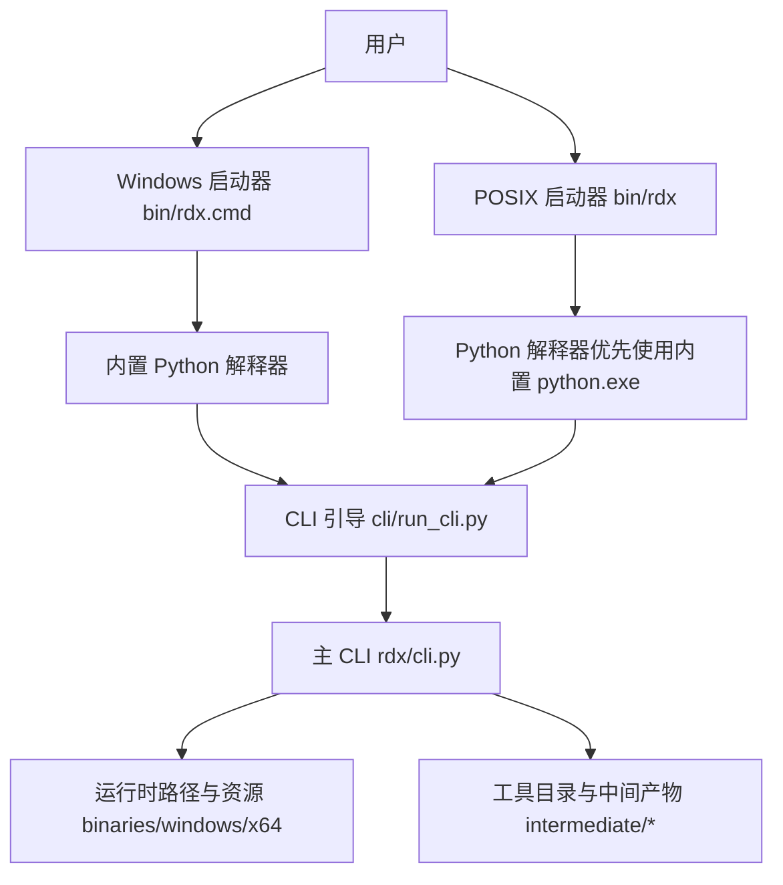
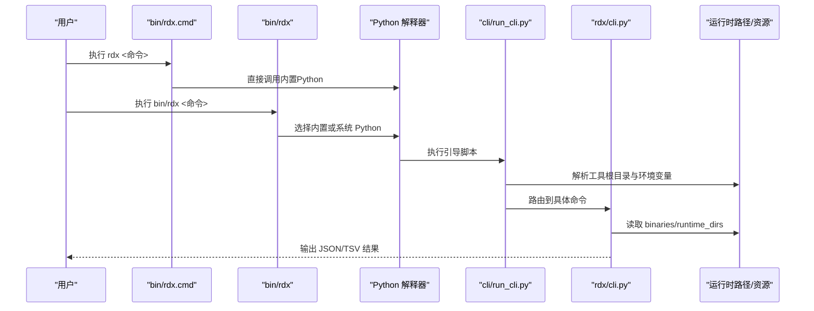
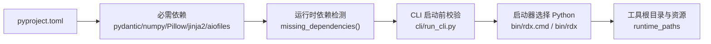

# 快速开始

<cite>
**本文引用的文件**
- [README.md](file://README.md)
- [docs/quickstart.md](file://docs/quickstart.md)
- [docs/install.md](file://docs/install.md)
- [docs/troubleshooting.md](file://docs/troubleshooting.md)
- [bin/rdx.cmd](file://bin/rdx.cmd)
- [bin/rdx](file://bin/rdx)
- [cli/run_cli.py](file://cli/run_cli.py)
- [rdx/cli.py](file://rdx/cli.py)
- [scripts/rdx_install.ps1](file://scripts/rdx_install.ps1)
- [scripts/smoke_cli.sh](file://scripts/smoke_cli.sh)
- [pyproject.toml](file://pyproject.toml)
- [rdx/runtime_requirements.py](file://rdx/runtime_requirements.py)
- [rdx/runtime_paths.py](file://rdx/runtime_paths.py)
- [rdx/__init__.py](file://rdx/__init__.py)
</cite>

## 更新摘要
**所做的更改**
- 更新了Windows启动器说明，从复杂的PowerShell系统简化为简单的bin/rdx.cmd薄启动器
- 移除了对已删除的rdx.bat和scripts/rdx_bat_launcher.ps1的引用
- 更新了架构图表以反映新的启动流程
- 修正了安装和验证步骤中的入口点说明
- 更新了故障排除指南以匹配新的启动器架构

## 目录
1. [简介](#简介)
2. [项目结构](#项目结构)
3. [核心组件](#核心组件)
4. [架构总览](#架构总览)
5. [详细组件分析](#详细组件分析)
6. [依赖关系分析](#依赖关系分析)
7. [性能注意事项](#性能注意事项)
8. [故障排除指南](#故障排除指南)
9. [结论](#结论)
10. [附录](#附录)

## 简介
本快速开始指南面向首次使用 RDC-Tool（rdx-tools）的用户，目标是帮助你在 Windows 平台上快速完成环境准备、安装与验证，并掌握常用命令行操作。你将学会：
- 检查系统与环境要求
- 下载并安装 Windows x64 安装包
- 运行版本检查与环境诊断
- 打开捕获文件、浏览事件、查看上下文状态等基础工作流
- 使用冒烟测试脚本验证安装是否成功
- 排查常见问题

## 项目结构
RDC-Tool 提供自包含的 Windows x64 分发包，内置 Python 运行时与 RenderDoc 相关资源，用户无需自行安装 Python 或虚拟环境。关键入口包括：
- **Windows 启动器：bin/rdx.cmd** - 简化的薄启动器，直接调用内置Python
- POSIX Shell 启动器：bin/rdx
- Python CLI 引导：cli/run_cli.py
- 主 CLI 实现：rdx/cli.py
- 安装脚本：scripts/rdx_install.ps1
- 冒烟测试脚本：scripts/smoke_cli.sh

**图表来源**
- [bin/rdx.cmd:1-12](file://bin/rdx.cmd#L1-L12)
- [bin/rdx:1-40](file://bin/rdx#L1-L40)
- [cli/run_cli.py:16-63](file://cli/run_cli.py#L16-L63)
- [rdx/cli.py:62-104](file://rdx/cli.py#L62-L104)
- [rdx/runtime_paths.py:60-80](file://rdx/runtime_paths.py#L60-L80)

**章节来源**
- [README.md:5-27](file://README.md#L5-L27)
- [docs/quickstart.md:1-49](file://docs/quickstart.md#L1-L49)
- [docs/install.md:1-39](file://docs/install.md#L1-L39)

## 核心组件
- **启动器层**
  - **Windows 启动器 bin/rdx.cmd** - 简化的薄启动器，直接设置环境变量并调用内置Python，无复杂PowerShell逻辑
  - POSIX 启动器 bin/rdx：优先使用内置 Python，其次回退到系统 python3/python。
- CLI 层
  - cli/run_cli.py：解析工具根目录、设置环境变量、检查依赖、路由命令。
  - rdx/cli.py：实现 version、doctor、tools、context、capture、vfs、event、pipeline、export 等命令。
- 运行时与资源
  - binaries/windows/x64：包含 renderdoc.dll、renderdoc.json、pymodules、bundled Python。
  - runtime_paths：统一解析 tools_root、runtime_root、artifacts_dir、logs_dir 等路径。
- 安装与验证
  - scripts/rdx_install.ps1：复制文件、可选更新 PATH、执行 doctor。
  - scripts/smoke_cli.sh：打印每条命令、记录日志、超时控制、清理上下文。

**章节来源**
- [bin/rdx.cmd:1-12](file://bin/rdx.cmd#L1-L12)
- [bin/rdx:1-40](file://bin/rdx#L1-L40)
- [cli/run_cli.py:16-63](file://cli/run_cli.py#L16-L63)
- [rdx/cli.py:62-104](file://rdx/cli.py#L62-L104)
- [rdx/runtime_paths.py:14-123](file://rdx/runtime_paths.py#L14-L123)
- [scripts/rdx_install.ps1:1-190](file://scripts/rdx_install.ps1#L1-L190)
- [scripts/smoke_cli.sh:1-264](file://scripts/smoke_cli.sh#L1-L264)

## 架构总览
下图展示了从用户输入到命令执行的完整流程，以及关键组件之间的交互。**更新后的架构更加简洁，移除了PowerShell中间层**。

**图表来源**
- [bin/rdx.cmd:1-12](file://bin/rdx.cmd#L1-L12)
- [bin/rdx:1-40](file://bin/rdx#L1-L40)
- [cli/run_cli.py:16-63](file://cli/run_cli.py#L16-L63)
- [rdx/cli.py:62-104](file://rdx/cli.py#L62-L104)
- [rdx/runtime_paths.py:14-123](file://rdx/runtime_paths.py#L14-L123)

## 详细组件分析

### 环境准备与系统依赖检查
- Python 环境要求
  - 项目声明 requires-python >= 3.11；但分发包自带 Python，通常无需额外安装。
  - 若需自定义 Python，可通过环境变量 RDX_PYTHON 指定可执行文件。
- 必需 Python 依赖
  - pydantic、numpy、Pillow、jinja2、aiofiles。缺失时会在 doctor 中报告。
- 运行时资源
  - binaries/windows/x64 下应存在 renderdoc.dll、renderdoc.json、pymodules/renderdoc.pyd。
- 工具根目录
  - 通过 RDX_TOOLS_ROOT 或脚本所在目录解析；确保 bin/rdx.cmd、bin/rdx、cli/run_cli.py 存在。

**章节来源**
- [pyproject.toml:5-22](file://pyproject.toml#L5-L22)
- [rdx/runtime_requirements.py:7-13](file://rdx/runtime_requirements.py#L7-L13)
- [bin/rdx:7-18](file://bin/rdx#L7-L18)
- [rdx/runtime_paths.py:14-63](file://rdx/runtime_paths.py#L14-L63)
- [docs/install.md:1-39](file://docs/install.md#L1-L39)

### Windows 平台安装说明
- 获取安装包
  - 下载 rdx-tools-<version>-windows-x64.zip。
- 解压与安装
  - 解压后在 PowerShell 中执行安装脚本，可选择将安装目录加入 PATH。
  - 示例命令：
    - powershell -ExecutionPolicy Bypass -File scripts/rdx_install.ps1 -Action install -InstallDir "$env:LOCALAPPDATA\Programs\rdx-tools" -AddToPath
    - 升级：将 -Action 改为 upgrade
    - 卸载：将 -Action 改为 uninstall
- 安装后验证
  - 使用安装脚本自带的 doctor 或直接运行 rdx --json doctor。
  - 预期：返回 ok=true 的诊断信息，包含工具根目录、Python 布局、RenderDoc 资源、启动器存在性、目录结构等。

**更新** 现在使用简化的 bin/rdx.cmd 启动器，不再需要PowerShell中间层。

**章节来源**
- [docs/install.md:5-39](file://docs/install.md#L5-L39)
- [scripts/rdx_install.ps1:141-186](file://scripts/rdx_install.ps1#L141-L186)
- [rdx/cli.py:410-532](file://rdx/cli.py#L410-L532)

### 基本命令行操作示例
以下命令均可在 PowerShell 或 CMD 中执行（Windows）。JSON 为代理协议首选格式；TSV 仅用于列表/投影命令。

- 版本检查
  - rdx --version
  - rdx version --json
- 环境诊断
  - rdx --json doctor
- 工具发现
  - rdx tools list --json --limit 5
  - rdx tools search pipeline --json
- 上下文状态
  - rdx context status --json
- 打开捕获文件并预览
  - rdx capture open --file "C:\path\sample.rdc" --frame-index 0 --preview
  - rdx session preview on
  - rdx session preview status
  - rdx session preview off
- 浏览文件系统与事件
  - rdx vfs ls --path / --format tsv
  - rdx vfs cat --path /context --format json
  - rdx event list --format tsv
  - rdx pipeline show --event-id 42 --format json
- 资源与导出
  - rdx resource list --format tsv
  - rdx export screenshot --event-id 42 --out .\frame.png

提示
- 若需要隔离运行，可使用 --daemon-context <id> 指定上下文。
- 非交互模式（Windows）：rdx --non-interactive --json doctor。

**章节来源**
- [README.md:5-27](file://README.md#L5-L27)
- [docs/quickstart.md:5-49](file://docs/quickstart.md#L5-L49)
- [rdx/cli.py:62-104](file://rdx/cli.py#L62-L104)

### 冒烟测试脚本使用方法
- 用途
  - 自动执行一组 CLI 命令，打印每条命令与输出，记录日志，并在失败时清理上下文。
- 基本用法
  - bash scripts/smoke_cli.sh
  - 带捕获文件的完整链路：bash scripts/smoke_cli.sh --rdc "C:/path/sample.rdc" --context cli-smoke
- 参数说明
  - --tools-root：指定工具根目录（默认脚本父目录）
  - --rdc：可选的 .rdc 捕获文件路径
  - --context：上下文 ID（默认基于时间戳）
  - --timeout：默认步骤超时秒数
  - --open-timeout：打开捕获的超时秒数
- 输出与日志
  - 日志位于 intermediate/logs/smoke_cli.log
  - 发现摘要位于 intermediate/logs/tool_smoke_findings.md
- 预期行为
  - 无 --rdc：仅执行入口冒烟（doctor、tools list/search），成功后退出。
  - 有 --rdc：执行上下文清理、打开捕获、查询状态、列出 VFS、工具列表、清理上下文与停止守护进程。

**章节来源**
- [scripts/smoke_cli.sh:18-69](file://scripts/smoke_cli.sh#L18-L69)
- [scripts/smoke_cli.sh:229-264](file://scripts/smoke_cli.sh#L229-L264)
- [docs/quickstart.md:35-49](file://docs/quickstart.md#L35-L49)

### 常见错误与恢复流程
- 缺少依赖
  - 现象：doctor 报告 dependencies_missing；CLI 直接报错 missing dependencies。
  - 处理：确认内置 Python 可用或正确设置 RDX_PYTHON；重新安装或修复 binaries。
- 会话状态不正确
  - 现象：VFS/facade/diff/assert 报 session_required。
  - 处理：使用 capture open 打开捕获，或通过 --session-id 指定；必要时 context clear 后重试。
- 远程句柄被消费
  - 现象：remote_handle_consumed。
  - 处理：不要复用旧句柄；通过远程工作流重建连接。
- 重开回放
  - 现象：stale_session_requires_restart。
  - 处理：关闭并重放；先检查上下文状态与操作历史。
- Shader 替换失败
  - 现象：shader_build_failed，failure_reason=spirv_assembly_failed。
  - 处理：检查 spirv-as 可用性；按 edit_plan 编辑；注意只读反汇编不可直接替换。
- Texture 导出限制
  - 现象：请求 HDR/EXR/DDS 失败。
  - 处理：PNG 为显示映射证据，不等同于保留 HDR；仅在需要持久化时使用导出。
- **新增：Windows启动器问题**
  - 现象：bin/rdx.cmd 找不到或无法执行
  - 处理：确认安装目录包含 bin/rdx.cmd；检查PATH设置；重新运行安装脚本

**章节来源**
- [docs/troubleshooting.md:1-58](file://docs/troubleshooting.md#L1-L58)
- [cli/run_cli.py:239-254](file://cli/run_cli.py#L239-L254)
- [rdx/cli.py:410-532](file://rdx/cli.py#L410-L532)

## 依赖关系分析
- 构建与发布
  - 构建后端 setuptools，Python 版本要求 >= 3.11。
  - 依赖项：pydantic、numpy、Pillow、jinja2、aiofiles。
- 运行时依赖检测
  - 通过模块导入探测缺失依赖；打包时排除测试与开发辅助包。
- 路径与资源
  - tools_root 决定 binaries、intermediate、runtime 等子目录位置。
  - 启动器优先使用内置 Python，其次系统 python3/python。

**图表来源**
- [pyproject.toml:5-22](file://pyproject.toml#L5-L22)
- [rdx/runtime_requirements.py:7-13](file://rdx/runtime_requirements.py#L7-L13)
- [cli/run_cli.py:66-68](file://cli/run_cli.py#L66-L68)
- [bin/rdx:7-18](file://bin/rdx#L7-L18)
- [bin/rdx.cmd:1-12](file://bin/rdx.cmd#L1-L12)
- [rdx/runtime_paths.py:14-80](file://rdx/runtime_paths.py#L14-L80)

**章节来源**
- [pyproject.toml:5-22](file://pyproject.toml#L5-L22)
- [rdx/runtime_requirements.py:7-73](file://rdx/runtime_requirements.py#L7-L73)
- [bin/rdx:7-18](file://bin/rdx#L7-L18)
- [bin/rdx.cmd:1-12](file://bin/rdx.cmd#L1-L12)
- [rdx/runtime_paths.py:14-80](file://rdx/runtime_paths.py#L14-L80)

## 性能注意事项
- 打开大型捕获文件可能耗时较长，建议合理设置 --open-timeout。
- TSV 投影仅适用于列表/投影命令；复杂嵌套数据请使用 JSON。
- 预览功能会渲染完整帧缓冲，避免误用 viewport/scissor 导致显示不全。
- 多次重复打开/关闭回放会占用资源，建议在任务结束后清理上下文与停止守护进程。
- **新增：启动器优化** - 新的 bin/rdx.cmd 启动器更轻量，减少了PowerShell开销，启动速度更快。

## 故障排除指南
- 第一步：运行诊断
  - rdx --json doctor
  - 关注 tools_root、Python 布局、RenderDoc 资源、启动器存在性、目录结构。
- 第二步：检查上下文
  - rdx context status --json
  - 如状态异常，执行 rdx context clear --json 后重新打开捕获。
- 第三步：查看日志
  - 冒烟测试日志：intermediate/logs/smoke_cli.log
  - 发现摘要：intermediate/logs/tool_smoke_findings.md
- 第四步：清理与重启
  - rdx daemon stop
  - rdx context clear
  - 重新执行冒烟测试或目标命令。
- **新增：Windows启动器故障排除**
  - 如果 rdx 命令无法识别，检查PATH是否正确设置
  - 确认 bin/rdx.cmd 文件存在且可执行
  - 验证 bundled Python 是否存在于 binaries/windows/x64/python/

**章节来源**
- [docs/troubleshooting.md:1-58](file://docs/troubleshooting.md#L1-L58)
- [scripts/smoke_cli.sh:178-197](file://scripts/smoke_cli.sh#L178-L197)
- [rdx/cli.py:410-532](file://rdx/cli.py#L410-L532)

## 结论
通过本指南，你已了解 RDC-Tool 的环境要求、Windows 安装流程、常用命令与冒烟测试方法，并掌握了基本的故障定位与恢复步骤。**更新后的架构更加简洁高效**，新的 bin/rdx.cmd 薄启动器提供了更快的启动速度和更少的依赖。建议在日常使用中优先采用 JSON 输出进行自动化处理，TSV 用于人类可读的列表浏览。遇到问题时，先从 doctor 与 context status 入手，结合日志与冒烟测试快速定位。

## 附录

### 常用命令速查
- 版本与诊断
  - rdx --version
  - rdx version --json
  - rdx --json doctor
- 工具发现
  - rdx tools list --json --limit 5
  - rdx tools search pipeline --json
- 上下文与会话
  - rdx context status --json
  - rdx context update --key notes --value "triaged" --json
  - rdx capture open --file "C:\path\sample.rdc" --frame-index 0
  - rdx session preview on|status|off
- 浏览与导出
  - rdx vfs ls --path / --format tsv
  - rdx event list --format tsv
  - rdx pipeline show --event-id 42 --format json
  - rdx resource list --format tsv
  - rdx export screenshot --event-id 42 --out .\frame.png

**章节来源**
- [README.md:5-27](file://README.md#L5-L27)
- [docs/quickstart.md:5-49](file://docs/quickstart.md#L5-L49)
- [rdx/cli.py:62-104](file://rdx/cli.py#L62-L104)

### 版本与入口点
- 版本号来源于 rdx/__init__.py，CLI 输出包含 schema_version、tool_version、platform、entrypoints 等信息。
- **更新后的入口点**：
  - Windows CMD：bin/rdx.cmd（简化的薄启动器）
  - POSIX shell：bin/rdx
  - Python CLI：cli/run_cli.py

**章节来源**
- [rdx/__init__.py:1-4](file://rdx/__init__.py#L1-L4)
- [cli/run_cli.py:164-196](file://cli/run_cli.py#L164-L196)
- [rdx/cli.py:535-556](file://rdx/cli.py#L535-L556)
- [bin/rdx.cmd:1-12](file://bin/rdx.cmd#L1-L12)