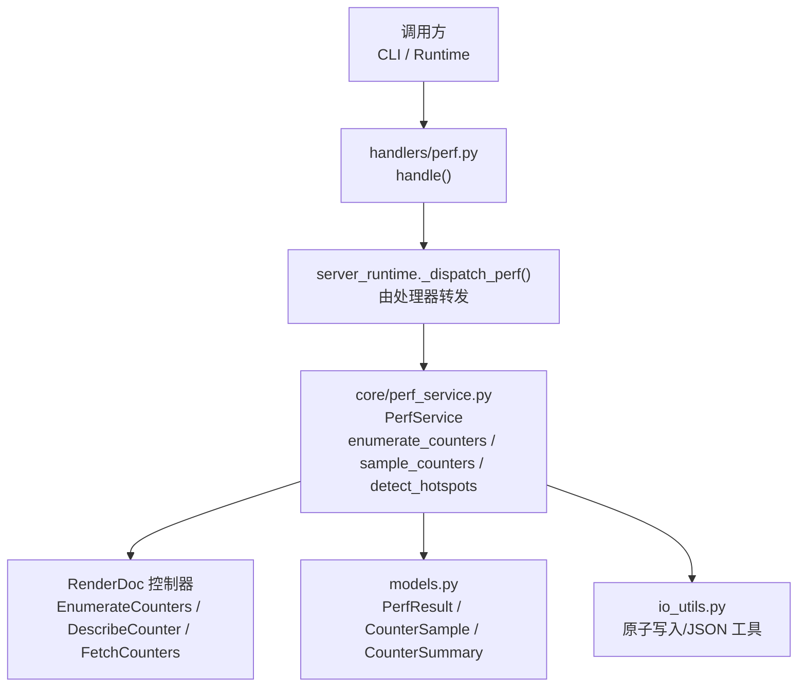
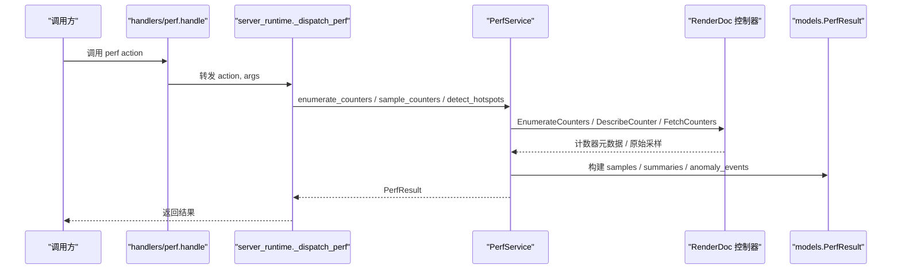
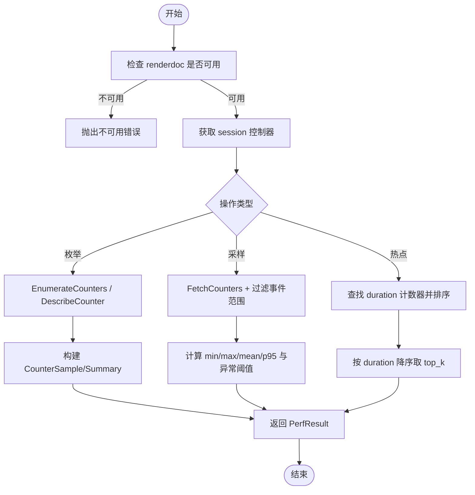
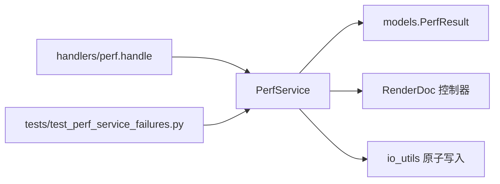

# 性能问题分析

<cite>
**本文引用的文件**
- [perf_service.py](file://rdc_tool/core/perf_service.py)
- [perf.py](file://rdc_tool/handlers/perf.py)
- [models.py](file://rdc_tool/models.py)
- [io_utils.py](file://rdc_tool/io_utils.py)
- [test_perf_service_failures.py](file://tests/test_perf_service_failures.py)
</cite>

## 目录
1. [简介](#简介)
2. [项目结构](#项目结构)
3. [核心组件](#核心组件)
4. [架构总览](#架构总览)
5. [详细组件分析](#详细组件分析)
6. [依赖关系分析](#依赖关系分析)
7. [性能注意事项](#性能注意事项)
8. [故障排查指南](#故障排查指南)
9. [结论](#结论)
10. [附录](#附录)

## 简介
本指南面向 RDC-Tool 的性能问题定位与优化，覆盖内存泄漏检测、I/O 瓶颈识别、CPU 使用率优化、性能监控工具使用、基准测试与回归测试方法，以及调优最佳实践与常见问题解决方案。文档基于仓库中的性能服务实现（GPU 计数器采样）、IO 原子写入工具、数据模型与测试用例进行说明，确保内容可追溯至具体代码位置。

## 项目结构
RDC-Tool 在性能相关的关键路径包括：
- 性能服务层：提供 GPU 性能计数器枚举、采样、热点检测等能力，封装 RenderDoc 原生接口并通过异步线程池执行避免阻塞事件循环。
- 处理器路由：将外部请求分发到 server_runtime 的 perf 处理分支。
- 数据模型：定义性能结果的结构化类型（样本、摘要、异常事件）。
- I/O 工具：提供原子写入、JSON 安全序列化、追加 JSONL 等能力，保障日志/状态文件的完整性与一致性。
- 测试：覆盖性能服务在运行时不可用、驱动拒绝采样等失败场景，验证错误传播与返回值格式。

**图表来源**
- [perf.py:8-10](file://rdc_tool/handlers/perf.py#L8-L10)
- [perf_service.py:212-618](file://rdc_tool/core/perf_service.py#L212-L618)
- [models.py:463-483](file://rdc_tool/models.py#L463-L483)
- [io_utils.py:117-161](file://rdc_tool/io_utils.py#L117-L161)

**章节来源**
- [perf.py:8-10](file://rdc_tool/handlers/perf.py#L8-L10)
- [perf_service.py:212-618](file://rdc_tool/core/perf_service.py#L212-L618)
- [models.py:463-483](file://rdc_tool/models.py#L463-L483)
- [io_utils.py:117-161](file://rdc_tool/io_utils.py#L117-L161)

## 核心组件
- PerfService：提供 GPU 性能计数器的异步操作，包含枚举可用计数器、按事件范围采样并生成统计摘要、检测热点事件；内部通过线程池执行同步调用以避免阻塞事件循环。
- models.PerfResult/CounterSample/CounterSummary：结构化输出采样结果、每计数器统计（最小值、最大值、均值、P95、热点事件 ID）以及异常事件列表。
- handlers.perf.handle：统一入口，将 action 和参数转发给 server_runtime 的 perf 调度器。
- io_utils：原子写入文本/JSON、追加 JSONL，保证日志或状态文件在并发或崩溃场景下的完整性。

**章节来源**
- [perf_service.py:212-618](file://rdc_tool/core/perf_service.py#L212-L618)
- [models.py:463-483](file://rdc_tool/models.py#L463-L483)
- [perf.py:8-10](file://rdc_tool/handlers/perf.py#L8-L10)
- [io_utils.py:117-161](file://rdc_tool/io_utils.py#L117-L161)

## 架构总览
性能服务的调用链从处理器进入，最终落到 PerfService 的具体方法，所有对 RenderDoc 控制器的同步调用均通过 _offload 放入线程池执行，从而保持异步非阻塞。采样结果以 models 中定义的模型返回，便于上层聚合与展示。

**图表来源**
- [perf.py:8-10](file://rdc_tool/handlers/perf.py#L8-L10)
- [perf_service.py:235-487](file://rdc_tool/core/perf_service.py#L235-L487)
- [models.py:463-483](file://rdc_tool/models.py#L463-L483)

## 详细组件分析

### 性能服务（PerfService）
- 枚举计数器：获取可用的 GPU performance counters 及其描述信息，用于后续采样选择。
- 采样计数器：在指定事件范围内抓取计数器值，计算 per-counter 统计（min/max/mean/p95），并标记异常事件（超过均值 + 3*标准差）。
- 热点检测：基于 GPU duration 计数器识别最慢的事件，支持 top_k 限制，返回按降序排列的热点事件。
- 异步与线程池：所有对控制器的同步调用通过 _offload 在默认线程池中执行，避免阻塞事件循环。
- 延迟导入：renderdoc 模块采用延迟导入，提升加载性能并在缺失时给出明确警告。

**图表来源**
- [perf_service.py:235-487](file://rdc_tool/core/perf_service.py#L235-L487)
- [perf_service.py:493-618](file://rdc_tool/core/perf_service.py#L493-L618)

**章节来源**
- [perf_service.py:212-618](file://rdc_tool/core/perf_service.py#L212-L618)

### 数据模型（PerfResult/CounterSample/CounterSummary）
- CounterSample：记录每个事件的单个计数器值。
- CounterSummary：记录每个计数器的统计摘要，包括最小值、最大值、均值、P95 以及热点事件 ID。
- PerfResult：聚合 samples、summaries 与 anomaly_events，作为统一的性能结果载体。

**章节来源**
- [models.py:463-483](file://rdc_tool/models.py#L463-L483)

### I/O 工具（原子写入与 JSON 安全处理）
- atomic_write_text / atomic_write_json：先写入临时文件再原子替换目标路径，失败时清理临时文件并回滚备份，保证文件一致性。
- safe_json_text：对字符串进行 UTF-8 校验与转义，避免写入非法字符导致异常。
- atomic_append_jsonl：追加 JSONL 行，自动处理换行与已有内容拼接。

这些能力可用于性能日志、运行状态快照、采样结果的持久化，减少并发写入导致的损坏风险。

**章节来源**
- [io_utils.py:19-161](file://rdc_tool/io_utils.py#L19-L161)

### 处理器路由（handlers/perf）
- handle(action, args, env)：将 perf 相关的 action 与参数转发给 server_runtime 的调度器，简化上层调用。

**章节来源**
- [perf.py:8-10](file://rdc_tool/handlers/perf.py#L8-L10)

## 依赖关系分析
- PerfService 依赖 RenderDoc 控制器进行计数器枚举与采样，并通过 models 输出结构化结果。
- handlers.perf 仅做路由，不直接实现业务逻辑，降低耦合度。
- io_utils 被上层用于持久化性能相关数据，确保日志与状态文件的原子性与安全性。
- 测试用例验证了当渲染后端不可用或驱动拒绝采样时的错误行为，确保错误不会误报为成功。

**图表来源**
- [perf.py:8-10](file://rdc_tool/handlers/perf.py#L8-L10)
- [perf_service.py:235-487](file://rdc_tool/core/perf_service.py#L235-L487)
- [models.py:463-483](file://rdc_tool/models.py#L463-L483)
- [io_utils.py:117-161](file://rdc_tool/io_utils.py#L117-L161)
- [test_perf_service_failures.py:20-55](file://tests/test_perf_service_failures.py#L20-L55)

**章节来源**
- [perf_service.py:235-487](file://rdc_tool/core/perf_service.py#L235-L487)
- [test_perf_service_failures.py:20-55](file://tests/test_perf_service_failures.py#L20-L55)

## 性能注意事项
- 内存使用监控与对象生命周期分析
  - 使用 Python 内置 tracemalloc 捕获分配轨迹，对比两次快照的差异，定位增长最快的分配源。
  - 结合 weakref 跟踪对象生命周期，确认是否存在长生命周期引用导致无法回收。
  - 针对大对象（如图像、缓冲区）使用流式读写与分块处理，避免一次性加载到内存。
  - 在 PerfService 中，计数器采样结果以结构化模型返回，注意控制单次采样的事件范围与计数器数量，避免产生过大的中间集合。

- 垃圾回收调优
  - 合理设置 GC 阈值，避免频繁触发导致抖动；在高吞吐场景下可适当放宽阈值。
  - 对短期大对象使用上下文管理器或显式释放，缩短存活时间。
  - 避免在热路径创建大量临时对象，复用缓冲与数据结构。

- I/O 瓶颈识别与优化
  - 使用 io_utils 的原子写入与 JSON 安全序列化，减少因编码错误或并发写入导致的重试与回滚开销。
  - 对日志与状态文件采用追加模式（JSONL），避免整文件重写带来的 I/O 放大。
  - 批量写入与合并小写为大写，减少系统调用次数。
  - 对于大文件读取，优先使用流式 API 与分块处理，避免一次性读入内存。

- CPU 使用率优化
  - 计算密集型任务尽量下沉到线程池或进程池执行，避免阻塞事件循环。
  - 在 PerfService 中，所有对控制器的同步调用通过 _offload 放入线程池，保持异步响应性。
  - 算法复杂度分析：热点检测中对事件持续时间排序的时间复杂度为 O(n log n)，可通过 top_k 限制减少排序规模。
  - 并行处理配置：根据 CPU 核数调整线程池大小，避免过度并行导致上下文切换开销。

- 性能监控工具使用
  - 内置性能服务：通过 PerfService 的 enumerate_counters、sample_counters、detect_hotspots 获取 GPU 计数器与热点事件。
  - 系统监控工具：结合操作系统工具（如 Windows Performance Monitor、Linux perf）观察 CPU、内存、磁盘 I/O 指标。
  - 第三方分析器：可使用 cProfile、py-spy、memory_profiler 等进行函数级与内存级分析。

- 基准测试与回归测试
  - 建立基准用例：对关键路径（如热点检测、采样）构造固定输入，记录耗时与资源占用。
  - 回归测试：在变更前后运行相同基准，比较性能指标变化，防止退化。
  - 测试覆盖：参考 test_perf_service_failures.py，覆盖运行时不可用、驱动拒绝采样等失败场景，确保错误传播正确。

[本节为通用指导，不直接分析具体文件]

## 故障排查指南
- 渲染后端不可用
  - 现象：调用性能服务时抛出“counter query unavailable”或“counter sampling unavailable”。
  - 原因：renderdoc 模块未加载或版本不匹配。
  - 处理：确保渲染后端已正确安装并可导入；检查环境变量与路径配置。

- 驱动拒绝采样
  - 现象：EnumerateCounters/DescribeCounter/FetchCounters 抛出异常，服务上报“counter read failed”。
  - 原因：驱动不支持该计数器或当前队列配置不可用。
  - 处理：更换驱动版本或调整队列配置；降级到支持的计数器集合。

- 非秒单位持续时间
  - 现象：duration 计数器单位不是秒时被拒绝。
  - 原因：当前实现仅支持秒单位的持续时间转换。
  - 处理：选择单位为秒的计数器，或在扩展中增加单位换算逻辑。

- 原子写入失败
  - 现象：atomic_swap_path 多次重试后仍失败，抛出 AtomicWriteError。
  - 原因：目标路径权限不足、磁盘空间不足或竞争条件。
  - 处理：检查文件系统权限与剩余空间；增加重试间隔与次数；确保临时文件位于同一文件系统。

**章节来源**
- [test_perf_service_failures.py:20-55](file://tests/test_perf_service_failures.py#L20-L55)
- [perf_service.py:235-487](file://rdc_tool/core/perf_service.py#L235-L487)
- [perf_service.py:493-618](file://rdc_tool/core/perf_service.py#L493-L618)
- [io_utils.py:67-115](file://rdc_tool/io_utils.py#L67-L115)

## 结论
RDC-Tool 的性能服务通过异步线程池与结构化模型实现了高效的 GPU 计数器采样与热点检测，配合原子写入工具保障了性能数据的可靠性。在实际使用中，应结合内存监控、I/O 优化、CPU 并行配置与系统工具进行综合调优，并通过基准与回归测试确保性能稳定。遇到渲染后端不可用或驱动拒绝采样等问题时，可依据故障排查指南快速定位与解决。

[本节为总结，不直接分析具体文件]

## 附录
- 常用性能指标
  - P95 延迟：反映尾部延迟，适合评估用户体验。
  - 热点事件：GPU 持续时间最长的若干事件，优先优化。
  - 异常事件：超出均值 + 3*标准差的采样点，提示潜在波动或资源争用。

- 推荐流程
  - 启用性能服务采样，收集计数器与热点。
  - 使用 tracemalloc 与 cProfile 定位内存与 CPU 热点。
  - 应用 I/O 优化（原子写入、批量写入、流式处理）。
  - 调整并行度与 GC 策略，重新运行基准测试。
  - 将结果持久化为 JSONL，便于追踪与回溯。

[本节为补充信息，不直接分析具体文件]