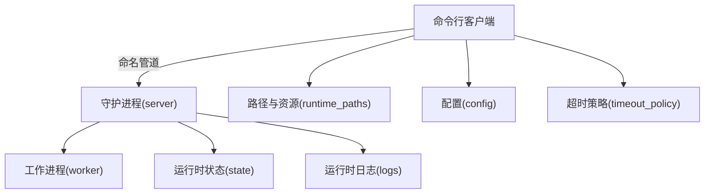
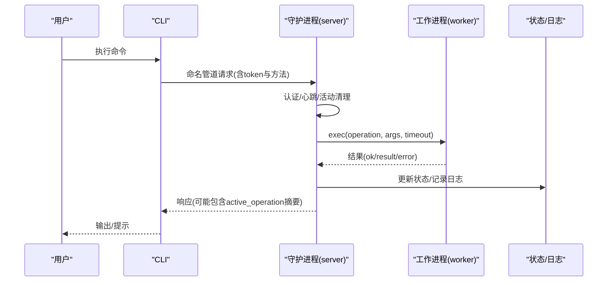
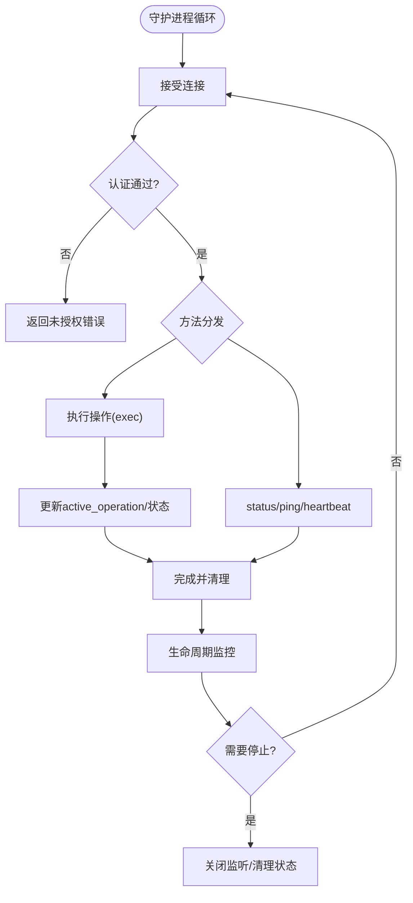
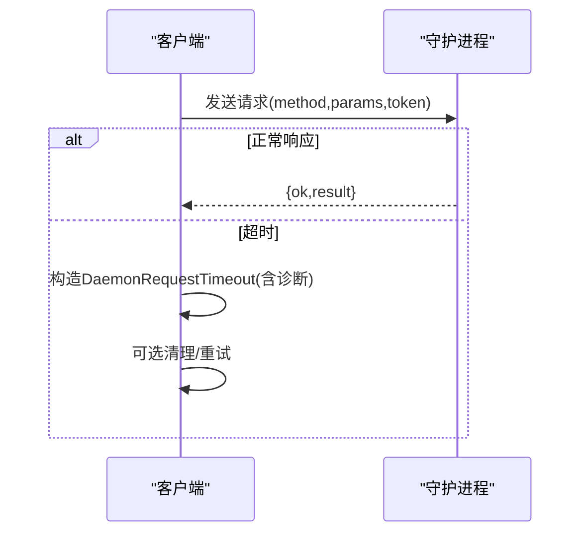
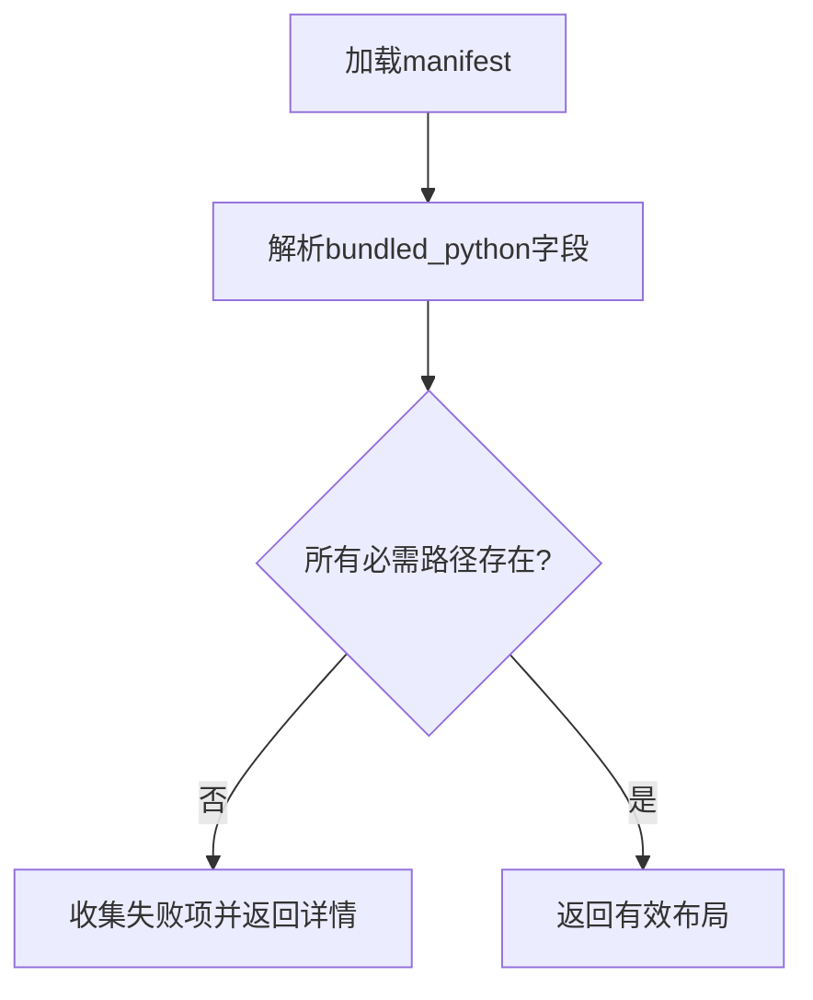
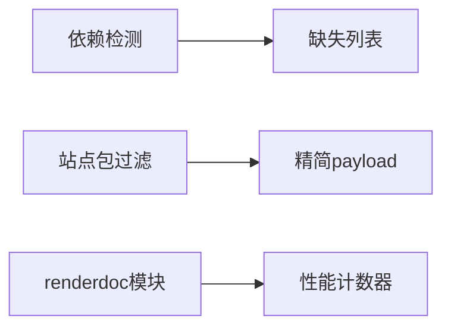

# 故障排除

<cite>
**本文引用的文件**
- [rdx/core/errors.py](file://rdx/core/errors.py)
- [rdx/daemon/server.py](file://rdx/daemon/server.py)
- [rdx/daemon/client.py](file://rdx/daemon/client.py)
- [rdx/config.py](file://rdx/config.py)
- [rdx/runtime_requirements.py](file://rdx/runtime_requirements.py)
- [rdx/python_runtime.py](file://rdx/python_runtime.py)
- [rdx/runtime_paths.py](file://rdx/runtime_paths.py)
- [rdx/runtime_state.py](file://rdx/runtime_state.py)
- [rdx/timeout_policy.py](file://rdx/timeout_policy.py)
- [rdx/io_utils.py](file://rdx/io_utils.py)
- [rdx/progress.py](file://rdx/progress.py)
- [scripts/smoke_cli.sh](file://scripts/smoke_cli.sh)
- [docs/troubleshooting.md](file://docs/troubleshooting.md)
</cite>

## 目录
1. [简介](#简介)
2. [项目结构](#项目结构)
3. [核心组件](#核心组件)
4. [架构总览](#架构总览)
5. [详细组件分析](#详细组件分析)
6. [依赖关系分析](#依赖关系分析)
7. [性能注意事项](#性能注意事项)
8. [故障排除指南](#故障排除指南)
9. [结论](#结论)
10. [附录](#附录)

## 简介
本指南面向使用 RDC-Tool（RDX）的用户与运维人员，聚焦“可操作”的排障方法：从环境检查、连接问题、性能诊断到日志收集与调试工具使用，提供分步骤的诊断流程、常见错误解释与修复建议。文档中的每个技术点均对应仓库中的具体实现或配置，便于快速定位与验证。

## 项目结构
RDX 采用“CLI + 守护进程 + 工作进程 + 运行时状态/日志”的分层设计：
- CLI 通过命名管道与守护进程通信；守护进程负责认证、心跳、生命周期管理，并将执行请求转发给工作进程。
- 运行期状态与日志持久化在 intermediate/runtime 目录下，支持多上下文隔离。
- 内置 Python 运行时与二进制资源位于 binaries 下，路径解析由 runtime_paths 统一管理。
- 超时策略集中定义，按操作类型区分默认超时与重型操作超时。

图表来源
- [rdx/daemon/server.py:572-643](file://rdx/daemon/server.py#L572-L643)
- [rdx/daemon/client.py:467-515](file://rdx/daemon/client.py#L467-L515)
- [rdx/runtime_paths.py:14-123](file://rdx/runtime_paths.py#L14-L123)
- [rdx/config.py:15-130](file://rdx/config.py#L15-L130)
- [rdx/timeout_policy.py:56-104](file://rdx/timeout_policy.py#L56-L104)

章节来源
- [rdx/daemon/server.py:572-643](file://rdx/daemon/server.py#L572-L643)
- [rdx/daemon/client.py:467-515](file://rdx/daemon/client.py#L467-L515)
- [rdx/runtime_paths.py:14-123](file://rdx/runtime_paths.py#L14-L123)
- [rdx/config.py:15-130](file://rdx/config.py#L15-L130)
- [rdx/timeout_policy.py:56-104](file://rdx/timeout_policy.py#L56-L104)

## 核心组件
- 错误分类与映射：统一将异常映射为带 code/category/details 的结构化错误，便于上层处理与退出码映射。
- 守护进程：基于 Windows 命名管道的服务，负责认证、心跳、活动清理、会话/捕获状态同步、执行调度与生命周期监控。
- 守护进程客户端：封装命名管道通信、重试、超时、状态清理与守护进程启动/停止流程。
- 运行时路径与资源：集中解析 tools_root、binaries、Python 运行时、中间产物与日志目录。
- 运行时状态：持久化上下文/会话/恢复信息，提供原子写入与并发锁保护。
- 超时策略：按操作前缀与语义设置不同超时，避免长耗时任务阻塞。
- 进度上报：统一的 ProgressEvent/ProgressSink，用于记录操作阶段与进度。
- 内置 Python 校验：校验打包的 Python 布局、版本元数据与必需文件完整性。
- 依赖检测：列出缺失的第三方依赖，辅助安装与环境修复。

章节来源
- [rdx/core/errors.py:9-119](file://rdx/core/errors.py#L9-L119)
- [rdx/daemon/server.py:102-690](file://rdx/daemon/server.py#L102-L690)
- [rdx/daemon/client.py:31-515](file://rdx/daemon/client.py#L31-L515)
- [rdx/runtime_paths.py:14-123](file://rdx/runtime_paths.py#L14-L123)
- [rdx/runtime_state.py:104-500](file://rdx/runtime_state.py#L104-L500)
- [rdx/timeout_policy.py:56-104](file://rdx/timeout_policy.py#L56-L104)
- [rdx/progress.py:14-86](file://rdx/progress.py#L14-L86)
- [rdx/python_runtime.py:104-172](file://rdx/python_runtime.py#L104-L172)
- [rdx/runtime_requirements.py:7-57](file://rdx/runtime_requirements.py#L7-L57)

## 架构总览
下图展示了 CLI 到守护进程再到工作进程的调用链路与关键状态交互。

图表来源
- [rdx/daemon/server.py:572-643](file://rdx/daemon/server.py#L572-L643)
- [rdx/daemon/client.py:467-515](file://rdx/daemon/client.py#L467-L515)
- [rdx/runtime_state.py:448-500](file://rdx/runtime_state.py#L448-L500)

## 详细组件分析

### 守护进程通信与生命周期
- 认证：请求必须携带 token，否则返回未授权错误。
- 心跳与会话清理：定期清理无心跳或已退出的客户端，防止僵尸连接占用。
- 生命周期监控：当所有者进程丢失且租约过期，或空闲超过阈值时自动停止。
- 执行调度：exec 请求会设置 active_operation 并记录 trace_id、阶段与进度，完成后清理。

图表来源
- [rdx/daemon/server.py:572-690](file://rdx/daemon/server.py#L572-L690)
- [rdx/daemon/server.py:166-225](file://rdx/daemon/server.py#L166-L225)
- [rdx/daemon/server.py:532-570](file://rdx/daemon/server.py#L532-L570)

章节来源
- [rdx/daemon/server.py:166-225](file://rdx/daemon/server.py#L166-L225)
- [rdx/daemon/server.py:532-570](file://rdx/daemon/server.py#L532-L570)
- [rdx/daemon/server.py:572-690](file://rdx/daemon/server.py#L572-L690)

### 守护进程客户端与超时
- 连接建立：读取 daemon_state.json，构造命名管道地址并发送请求。
- 超时处理：若未在限定时间内收到响应，抛出带诊断信息的超时异常，包含操作名、上下文、活跃请求计数与 active_operation 摘要。
- 清理与重启：当守护进程不可用或状态不一致时，尝试优雅关闭并清理残留状态。

图表来源
- [rdx/daemon/client.py:467-515](file://rdx/daemon/client.py#L467-L515)
- [rdx/daemon/client.py:518-553](file://rdx/daemon/client.py#L518-L553)
- [rdx/daemon/client.py:554-607](file://rdx/daemon/client.py#L554-L607)

章节来源
- [rdx/daemon/client.py:467-515](file://rdx/daemon/client.py#L467-L515)
- [rdx/daemon/client.py:518-607](file://rdx/daemon/client.py#L518-L607)

### 运行时路径与内置 Python 校验
- 路径解析：tools_root、binaries、runtime、logs 等路径统一由 runtime_paths 提供，支持环境变量覆盖。
- 内置 Python：通过 manifest.runtime.json 描述布局，校验入口、DLL、stdlib、site-packages 等是否存在。
- 常见问题：缺少 python.exe/DLL、stdlib 标记文件、路径逃逸等都会导致校验失败。

图表来源
- [rdx/python_runtime.py:28-92](file://rdx/python_runtime.py#L28-L92)
- [rdx/python_runtime.py:104-172](file://rdx/python_runtime.py#L104-L172)
- [rdx/runtime_paths.py:14-123](file://rdx/runtime_paths.py#L14-L123)

章节来源
- [rdx/python_runtime.py:28-92](file://rdx/python_runtime.py#L28-L92)
- [rdx/python_runtime.py:104-172](file://rdx/python_runtime.py#L104-L172)
- [rdx/runtime_paths.py:14-123](file://rdx/runtime_paths.py#L14-L123)

### 运行时状态与日志
- 状态文件：context/session/capture/recovery/preview/limits/metrics 等结构化存储，支持并发锁与原子写入。
- 日志文件：JSONL 格式追加写入，支持按时间过滤与最近条数限制。
- 常用排查：查看当前 session_id、capture_path、recovery_status、recent_operations 等关键字段。

章节来源
- [rdx/runtime_state.py:104-500](file://rdx/runtime_state.py#L104-L500)
- [rdx/runtime_state.py:448-500](file://rdx/runtime_state.py#L448-L500)

### 超时策略
- 按操作前缀与语义分配不同超时：远程连接、打开回放、关闭回放、重型操作等均有专门阈值。
- 传输缓冲：daemon/exec 会在基础超时上增加缓冲秒数，降低瞬时抖动导致的误判。

章节来源
- [rdx/timeout_policy.py:56-104](file://rdx/timeout_policy.py#L56-L104)

### 进度上报
- 通过 ProgressEvent/ProgressSink 将操作阶段、进度百分比与细节上报至守护进程状态，便于观察长耗时任务的实时进展。

章节来源
- [rdx/progress.py:14-86](file://rdx/progress.py#L14-L86)

## 依赖关系分析
- 运行时依赖：pydantic、numpy、Pillow、jinja2、aiofiles 等，缺失时会报告具体包名。
- 内置站点包过滤：构建时排除测试/开发相关包，减少体积与冲突。
- 路径与模块：renderdoc Python 模块延迟导入，仅在性能计数器功能启用时加载。

图表来源
- [rdx/runtime_requirements.py:7-73](file://rdx/runtime_requirements.py#L7-L73)
- [rdx/core/perf_service.py:69-96](file://rdx/core/perf_service.py#L69-L96)

章节来源
- [rdx/runtime_requirements.py:7-73](file://rdx/runtime_requirements.py#L7-L73)
- [rdx/core/perf_service.py:69-96](file://rdx/core/perf_service.py#L69-L96)

## 性能注意事项
- GPU 性能计数器：
  - 枚举/描述/抓取 counters，计算 per-event 样本、汇总统计与异常事件（z-score > 3）。
  - 热点检测：基于 EventGPUDuration/GPUDuration 等名称匹配，返回 top-K 最慢事件。
  - 全回放帧时长采样：FrameGPUDuration 可用于整段回放耗时测量。
- I/O 与内存：
  - 纹理导出与直读受限于后端能力与格式支持；不支持的压缩布局或无效子资源会返回结构化失败。
  - 大对象读取需考虑 max_texture_readback_bytes 等限制。
- CPU 与线程：
  - 重操作通过 worker_exec_timeout_s 控制超时，避免长时间阻塞。
  - 异步/线程池 offload 用于阻塞式控制器调用，降低主循环阻塞风险。

章节来源
- [rdx/core/perf_service.py:212-618](file://rdx/core/perf_service.py#L212-L618)
- [docs/troubleshooting.md:29-35](file://docs/troubleshooting.md#L29-L35)
- [rdx/config.py:27-43](file://rdx/config.py#L27-L43)
- [rdx/timeout_policy.py:56-104](file://rdx/timeout_policy.py#L56-L104)

## 故障排除指南

### 环境问题诊断与解决
- Python 版本与布局不兼容
  - 现象：无法启动内置 Python、找不到 DLL 或 stdlib。
  - 诊断：运行内置 Python 布局校验，检查 manifest.runtime.json 与 binaries/python 下的必需文件。
  - 解决：修复 binaries 目录完整性，确保 python.exe、python3.dll、Lib/site-packages 等存在且路径正确。
  - 参考：[内置 Python 校验:104-172](file://rdx/python_runtime.py#L104-L172)、[路径解析:14-123](file://rdx/runtime_paths.py#L14-L123)
- 系统依赖缺失
  - 现象：导入第三方库失败。
  - 诊断：使用依赖检测获取缺失包列表。
  - 解决：安装缺失依赖（如 pydantic、numpy、Pillow、jinja2、aiofiles）。
  - 参考：[依赖检测:7-57](file://rdx/runtime_requirements.py#L7-L57)
- 权限问题
  - 现象：读写状态/日志失败、无法创建目录。
  - 诊断：检查 intermediate/runtime 目录权限与磁盘空间。
  - 解决：以管理员/具备写权限的账户运行，或调整目录 ACL。
  - 参考：[原子写入与目录创建:117-147](file://rdx/io_utils.py#L117-L147)、[状态文件写入:404-416](file://rdx/runtime_state.py#L404-L416)

章节来源
- [rdx/python_runtime.py:104-172](file://rdx/python_runtime.py#L104-L172)
- [rdx/runtime_paths.py:14-123](file://rdx/runtime_paths.py#L14-L123)
- [rdx/runtime_requirements.py:7-57](file://rdx/runtime_requirements.py#L7-L57)
- [rdx/io_utils.py:117-147](file://rdx/io_utils.py#L117-L147)
- [rdx/runtime_state.py:404-416](file://rdx/runtime_state.py#L404-L416)

### 连接问题排查
- 守护进程通信失败
  - 现象：命令卡住或报超时。
  - 诊断：检查 daemon_state.json 是否完整（pipe_name、token），确认守护进程 PID 存活。
  - 解决：清理残留状态后重新启动守护进程；必要时强制终止僵尸进程。
  - 参考：[守护进程状态与清理:554-607](file://rdx/daemon/client.py#L554-L607)、[守护进程启动:623-733](file://rdx/daemon/client.py#L623-L733)
- 远程连接超时
  - 现象：rd.remote.connect 或 open_replay 超时。
  - 诊断：根据操作类型查看超时策略；检查网络可达性与端口配置。
  - 解决：增大超时或修正网络/代理设置；避免重复连接导致句柄被消费。
  - 参考：[超时策略](file://rdx/timeout_policy.py:56-104)、[远程生命周期说明](file://docs/troubleshooting.md:13-19)
- 网络配置错误
  - 现象：ADB/SSH/RenderDoc 远程协议连接失败。
  - 诊断：检查 remote_host、remote_port、remote_protocol、remote_auth_mode/value。
  - 解决：修正配置，确保设备在线且服务可用；避免替换用户端口映射。
  - 参考：[后端配置](file://rdx/config.py:15-25)、[Android 连接恢复](file://docs/troubleshooting.md:47-52)

章节来源
- [rdx/daemon/client.py:554-733](file://rdx/daemon/client.py#L554-L733)
- [rdx/timeout_policy.py:56-104](file://rdx/timeout_policy.py#L56-L104)
- [rdx/config.py:15-25](file://rdx/config.py#L15-L25)
- [docs/troubleshooting.md:13-19](file://docs/troubleshooting.md#L13-L19)
- [docs/troubleshooting.md:47-52](file://docs/troubleshooting.md#L47-L52)

### 性能问题分析
- 内存泄漏检测
  - 方法：结合 recent_operations 与 metrics.operation_error_count 观察异常增长；对大对象导出（纹理/缓冲区）谨慎使用，优先按需读取。
  - 参考：[运行时状态指标](file://rdx/runtime_state.py:104-149)、[纹理导出限制](file://docs/troubleshooting.md:29-35)
- I/O 瓶颈识别
  - 方法：关注 large readback、导出格式不支持导致的失败；检查磁盘空间与写入速度。
  - 参考：[原子写入与备份](file://rdx/io_utils.py:67-115)、[导出失败处理](file://docs/troubleshooting.md:29-35)
- CPU 使用率优化
  - 方法：合理设置超时与并发；避免重复枚举/抓取 counters；使用 detect_hotspots 定位昂贵事件。
  - 参考：[性能计数器热点检测](file://rdx/core/perf_service.py:493-618)、[超时策略](file://rdx/timeout_policy.py:56-104)

章节来源
- [rdx/runtime_state.py:104-149](file://rdx/runtime_state.py#L104-L149)
- [rdx/io_utils.py:67-115](file://rdx/io_utils.py#L67-L115)
- [docs/troubleshooting.md:29-35](file://docs/troubleshooting.md#L29-L35)
- [rdx/core/perf_service.py:493-618](file://rdx/core/perf_service.py#L493-L618)
- [rdx/timeout_policy.py:56-104](file://rdx/timeout_policy.py#L56-L104)

### 日志收集与诊断信息
- 位置与内容
  - 运行时状态：intermediate/runtime/rdx_cli/runtime_state*.json
  - 运行时日志：intermediate/runtime/rdx_cli/runtime_logs*.jsonl
  - 守护进程状态：intermediate/runtime/rdx_cli/daemon_state*.json
- 采集方式
  - 使用 context status、daemon status、tools list/search 等命令输出 JSON。
  - 脚本 smoke_cli.sh 会记录命令与发现，便于复现与归档。
- 关键信息
  - session_id、capture_path、recovery_status、active_event_id、frame_index、attached_clients、active_operation。
- 参考
  - [状态与日志路径](file://rdx/runtime_paths.py:83-123)、[状态读取/写入](file://rdx/runtime_state.py:388-500)、[守护进程状态](file://rdx/daemon/client.py:257-307)、[冒烟脚本](file://scripts/smoke_cli.sh:178-197)

章节来源
- [rdx/runtime_paths.py:83-123](file://rdx/runtime_paths.py#L83-L123)
- [rdx/runtime_state.py:388-500](file://rdx/runtime_state.py#L388-L500)
- [rdx/daemon/client.py:257-307](file://rdx/daemon/client.py#L257-L307)
- [scripts/smoke_cli.sh:178-197](file://scripts/smoke_cli.sh#L178-L197)

### 调试工具与最佳实践
- 调试服务
  - 使用 daemon status/ping/heartbeat 检查守护进程健康；attach_client/claim_owner 维护会话所有权。
  - 参考：[守护进程方法](file://rdx/daemon/server.py:572-643)、[客户端心跳/附加](file://rdx/daemon/client.py:754-800)
- 状态检查
  - 使用 context status/update 查看与记录恢复备注；clear 清理无效上下文。
  - 参考：[上下文状态](file://docs/troubleshooting.md:7-11)
- 性能监控
  - 使用 perf service 枚举/采样 counters，detect_hotspots 定位热点；结合 recent_operations 与 metrics 评估稳定性。
  - 参考：[性能服务](file://rdx/core/perf_service.py:212-618)、[状态指标](file://rdx/runtime_state.py:104-149)
- 最佳实践
  - 避免重复连接与重用已被消费的句柄；在 open_replay 前释放资源；遇到 staled_session_requires_restart 时按提示恢复。
  - 参考：[回放重开与恢复](file://docs/troubleshooting.md:17-19)

章节来源
- [rdx/daemon/server.py:572-643](file://rdx/daemon/server.py#L572-L643)
- [rdx/daemon/client.py:754-800](file://rdx/daemon/client.py#L754-L800)
- [docs/troubleshooting.md:7-19](file://docs/troubleshooting.md#L7-L19)
- [rdx/core/perf_service.py:212-618](file://rdx/core/perf_service.py#L212-L618)
- [rdx/runtime_state.py:104-149](file://rdx/runtime_state.py#L104-L149)

### 常见错误信息与解决方案
- validation_error / not_found / assertion_failed / runtime_error / permission_error / io_error / internal_error
  - 含义：参数校验失败、资源不存在、断言失败、运行时错误、权限不足、I/O 错误、内部错误。
  - 处理：根据 category 与 details 定位原因；权限类错误检查文件系统与进程权限；I/O 错误检查磁盘与路径。
  - 参考：[错误分类与映射](file://rdx/core/errors.py:9-119)
- daemon_timeout
  - 含义：等待守护进程响应超时。
  - 处理：检查守护进程状态与活跃请求；清理残留状态并重试。
  - 参考：[客户端超时异常](file://rdx/daemon/client.py:31-37)、[超时处理](file://rdx/daemon/client.py:467-515)
- shader_build_failed / spirv_assembly_failed
  - 含义：着色器编译/汇编失败。
  - 处理：检查 spirv-as 工具可用性；编辑前阅读 edit_plan；仅替换可编辑源。
  - 参考：[着色器替换](file://docs/troubleshooting.md:21-28)
- DataNotAvailable（保存纹理）
  - 含义：读回失败或空闲超时导致连接关闭。
  - 处理：检查首次原生传输失败；避免无限重试与掩盖性替代图像。
  - 参考：[Android 连接与读回](file://docs/troubleshooting.md:47-58)

章节来源
- [rdx/core/errors.py:9-119](file://rdx/core/errors.py#L9-L119)
- [rdx/daemon/client.py:31-37](file://rdx/daemon/client.py#L31-L37)
- [rdx/daemon/client.py:467-515](file://rdx/daemon/client.py#L467-L515)
- [docs/troubleshooting.md:21-28](file://docs/troubleshooting.md#L21-L28)
- [docs/troubleshooting.md:47-58](file://docs/troubleshooting.md#L47-L58)

### 性能调优建议
- 合理设置超时：对重型操作使用更长的超时，避免误杀；对轻量操作保持短超时以提升响应。
- 控制并发与队列：worker.max_workers_per_gpu、task_queue_size 影响吞吐与资源占用。
- 限制读回大小：max_texture_readback_bytes 避免过大内存占用。
- 利用性能计数器：通过 detect_hotspots 与 sample_counters 精准定位瓶颈事件。
- 参考：[配置项](file://rdx/config.py:27-43)、[超时策略](file://rdx/timeout_policy.py:56-104)、[性能服务](file://rdx/core/perf_service.py:212-618)

章节来源
- [rdx/config.py:27-43](file://rdx/config.py#L27-L43)
- [rdx/timeout_policy.py:56-104](file://rdx/timeout_policy.py#L56-L104)
- [rdx/core/perf_service.py:212-618](file://rdx/core/perf_service.py#L212-L618)

## 结论
通过统一的状态与日志、健壮的守护进程通信与超时策略、以及完善的性能计数器能力，RDX 提供了端到端的排障与调优手段。建议在日常使用中遵循“先查状态与日志、再定位连接与超时、最后进行性能分析”的流程，并结合本文提供的模板与步骤高效解决问题。

## 附录

### 问题报告模板与信息收集清单
- 基本信息
  - 操作系统与版本、RDX 版本、工具根目录（tools_root）
  - 使用的上下文 ID（context_id）、会话 ID（session_id）
- 环境与依赖
  - 内置 Python 布局校验结果（成功/失败及失败项）
  - 缺失依赖列表（如有）
- 连接与超时
  - 守护进程状态（pid、last_activity_at、attached_clients）
  - 最近一次操作的 active_operation 摘要与超时值
- 状态与日志
  - runtime_state*.json 的关键字段（session_id、capture_path、recovery_status）
  - runtime_logs*.jsonl 最近 N 行
  - daemon_state*.json 摘要
- 复现步骤
  - 命令序列（可参考冒烟脚本的记录方式）
  - 期望行为与实际行为
- 参考
  - [冒烟脚本记录](file://scripts/smoke_cli.sh:123-146)
  - [状态与日志路径](file://rdx/runtime_paths.py:83-123)

章节来源
- [scripts/smoke_cli.sh:123-146](file://scripts/smoke_cli.sh#L123-L146)
- [rdx/runtime_paths.py:83-123](file://rdx/runtime_paths.py#L83-L123)