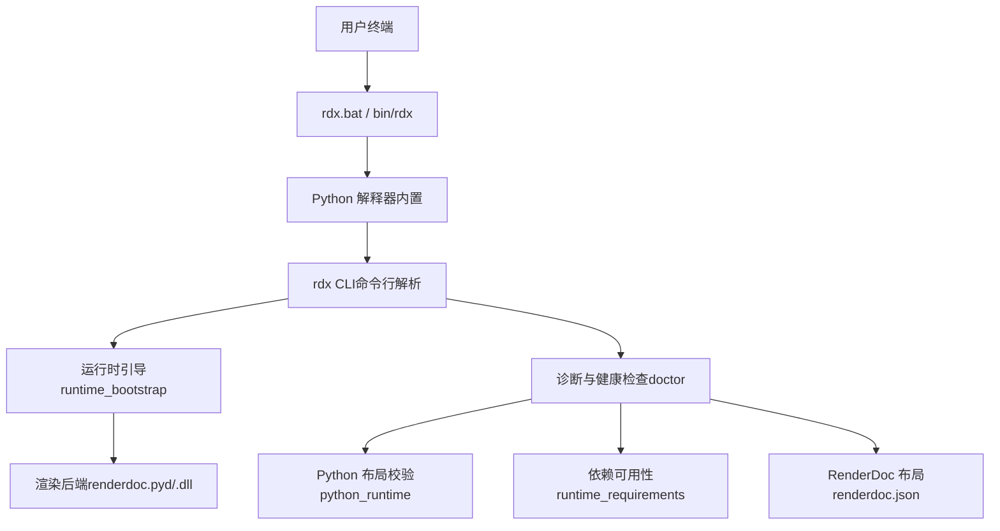
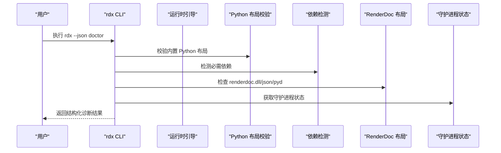
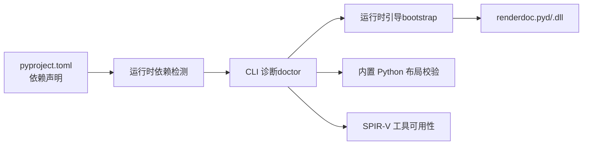

# 环境问题诊断

<cite>
**本文引用的文件**
- [README.md](file://README.md)
- [pyproject.toml](file://pyproject.toml)
- [rdx/cli.py](file://rdx/cli.py)
- [rdx/python_runtime.py](file://rdx/python_runtime.py)
- [rdx/runtime_requirements.py](file://rdx/runtime_requirements.py)
- [rdx/runtime_bootstrap.py](file://rdx/runtime_bootstrap.py)
- [binaries/windows/x64/renderdoc.json](file://binaries/windows/x64/renderdoc.json)
- [scripts/rdx_install.ps1](file://scripts/rdx_install.ps1)
- [docs/install.md](file://docs/install.md)
- [docs/troubleshooting.md](file://docs/troubleshooting.md)
- [rdx/core/errors.py](file://rdx/core/errors.py)
</cite>

## 目录
1. [简介](#简介)
2. [项目结构](#项目结构)
3. [核心组件](#核心组件)
4. [架构总览](#架构总览)
5. [详细组件分析](#详细组件分析)
6. [依赖关系分析](#依赖关系分析)
7. [性能注意事项](#性能注意事项)
8. [故障排查指南](#故障排查指南)
9. [结论](#结论)
10. [附录](#附录)

## 简介
本指南面向在 Windows x64 上使用 rdx-tools（CLI-only RenderDoc .rdc runtime）的用户与自动化流程，聚焦“环境问题诊断”。内容覆盖：
- Python 版本兼容性检查、依赖冲突检测与解决
- 系统依赖缺失识别与修复（RenderDoc 运行时、SPIR-V 工具等）
- 权限问题排查（文件访问、PATH、管理员权限等）
- 环境验证工具使用与输出解读（doctor、install 脚本）
- 常见环境错误及解决步骤
- 自动化检查与修复脚本使用方法

## 项目结构
- 自包含的 Windows x64 发布包，无需用户安装 Python 或虚拟环境；通过内置 Python 运行。
- CLI 入口为 rdx，支持 doctor、version、tools、daemon、context、capture、session、export 等命令。
- 运行时依赖由 pyproject 声明，并通过 bundled Python 与 site-packages 提供。
- RenderDoc 绑定以 renderdoc.dll + renderdoc.pyd 形式随包分发，并由 bootstrap 负责路径与 DLL 加载准备。
- 安装与诊断脚本位于 scripts/，文档位于 docs/。

**图示来源**
- [rdx/cli.py:410-532](file://rdx/cli.py#L410-L532)
- [rdx/runtime_bootstrap.py:105-130](file://rdx/runtime_bootstrap.py#L105-L130)
- [rdx/python_runtime.py:104-172](file://rdx/python_runtime.py#L104-L172)
- [rdx/runtime_requirements.py:7-57](file://rdx/runtime_requirements.py#L7-L57)
- [binaries/windows/x64/renderdoc.json:1-49](file://binaries/windows/x64/renderdoc.json#L1-L49)

**章节来源**
- [README.md:1-70](file://README.md#L1-L70)
- [docs/install.md:1-31](file://docs/install.md#L1-L31)

## 核心组件
- 环境健康检查（doctor）：汇总 Python 运行时、内置 Python 布局、RenderDoc 布局、工具目录、目录结构、SPIR-V 工具可用性、目录与启动器存在性、守护进程状态等。
- Python 运行时校验：读取 manifest.runtime.json 中的 bundled_python 元数据，校验关键文件/目录是否存在，并报告当前 Python 详情。
- 依赖检测：基于 REQUIRED_DEPENDENCIES 列表探测 pydantic、numpy、Pillow、jinja2、aiofiles 是否可导入。
- 运行时引导：将 binaries_root 和 pymodules_dir 加入 PATH/sys.path，注册 DLL 搜索目录，尝试导入 renderdoc 模块。
- 安装脚本：复制资源、可选更新用户 PATH、执行 doctor 验证。

**章节来源**
- [rdx/cli.py:410-532](file://rdx/cli.py#L410-L532)
- [rdx/python_runtime.py:104-172](file://rdx/python_runtime.py#L104-L172)
- [rdx/runtime_requirements.py:7-57](file://rdx/runtime_requirements.py#L7-L57)
- [rdx/runtime_bootstrap.py:105-130](file://rdx/runtime_bootstrap.py#L105-L130)
- [scripts/rdx_install.ps1:119-167](file://scripts/rdx_install.ps1#L119-L167)

## 架构总览
下图展示从 CLI 到运行时与 RenderDoc 的关键调用链，以及 doctor 的诊断分支。

**图示来源**
- [rdx/cli.py:410-532](file://rdx/cli.py#L410-L532)
- [rdx/runtime_bootstrap.py:105-130](file://rdx/runtime_bootstrap.py#L105-L130)
- [rdx/python_runtime.py:104-172](file://rdx/python_runtime.py#L104-L172)
- [rdx/runtime_requirements.py:7-57](file://rdx/runtime_requirements.py#L7-L57)

## 详细组件分析

### Python 版本与运行时兼容性
- 要求：项目要求 Python >= 3.11；发布包自带内置 Python，通常无需用户安装。
- 内置 Python 布局校验：
  - 读取 manifest.runtime.json 中 bundled_python 字段，校验 python_entry、pythonw_entry、python3_dll、python_dll、stdlib_layout、site_packages、dll_dir、pth_file 等元数据与对应路径。
  - 若 stdlib 为 zip，则校验 zip 文件存在；否则校验目录与关键标记文件（如 os.py、site.py、encodings/__init__.py）。
  - 同时收集当前运行 Python 的可执行路径、版本、前缀信息用于对比。
- 常见问题定位：
  - 缺少 bundled_python 元数据键：会报告具体缺失键名。
  - 路径逃逸或无法解析：抛出运行时错误并记录失败原因。
  - 缺少关键文件或目录：列出具体 label 与路径。

**章节来源**
- [pyproject.toml:5-19](file://pyproject.toml#L5-L19)
- [rdx/python_runtime.py:28-92](file://rdx/python_runtime.py#L28-L92)
- [rdx/python_runtime.py:104-172](file://rdx/python_runtime.py#L104-L172)

### 依赖冲突检测与解决
- 依赖清单：pydantic、numpy、Pillow、jinja2、aiofiles。
- 检测方式：按 import_name 探测模块是否可被导入；不可导入则视为缺失。
- 解决建议：
  - 优先使用发布包自带的 site-packages；避免混用外部虚拟环境导致版本不一致。
  - 若需自定义扩展，确保与内置 Python ABI 兼容，且不被打包排除规则过滤。
  - 若出现导入失败，先运行 doctor 查看 dependencies.missing 列表，再按需修复。

**章节来源**
- [rdx/runtime_requirements.py:7-57](file://rdx/runtime_requirements.py#L7-L57)
- [rdx/cli.py:410-532](file://rdx/cli.py#L410-L532)

### RenderDoc 运行时与 SPIR-V 工具
- RenderDoc 布局：
  - 期望文件：renderdoc.dll、renderdoc.json、pymodules/renderdoc.pyd。
  - doctor 会逐一检查这些文件是否存在，并报告 failures。
  - renderdoc.json 描述 Vulkan 层配置与启用环境变量。
- SPIR-V 工具：
  - 通过 which 查找 spirv-as/spirv-dis，用于 SPIR-V ASM 编辑与汇编场景。
  - 当 shader 替换需要汇编时，若缺失会提示相关失败原因。
- 运行时引导：
  - 将 binaries_root 与 pymodules_dir 加入 PATH 与 sys.path，并注册 DLL 搜索目录，随后尝试导入 renderdoc 模块。
  - 可通过环境变量 RDX_RUNTIME_DLL_DIR、RDX_RENDERDOC_PATH 覆盖默认路径。

**章节来源**
- [rdx/cli.py:410-532](file://rdx/cli.py#L410-L532)
- [binaries/windows/x64/renderdoc.json:1-49](file://binaries/windows/x64/renderdoc.json#L1-L49)
- [rdx/runtime_bootstrap.py:42-130](file://rdx/runtime_bootstrap.py#L42-L130)

### 权限问题排查
- 文件与目录权限：
  - 若读写 artifacts/logs/runtime dirs 失败，可能触发 IO 或 permission 错误；doctor 会报告目录存在性与可达性。
- PATH 与环境变量：
  - 安装脚本可添加用户级 PATH 条目；若未生效，检查用户 PATH 是否包含目标目录。
  - 运行时引导会将 binaries_root 前置到 PATH，避免依赖系统全局路径。
- 管理员权限：
  - 修改用户 PATH 通常需要当前会话具备相应权限；建议使用安装脚本的 AddToPath 功能。
  - 某些系统级操作（如注册表项写入）不在本工具范围内；如遇权限不足，请以管理员身份运行终端或调整策略。

**章节来源**
- [scripts/rdx_install.ps1:88-117](file://scripts/rdx_install.ps1#L88-L117)
- [rdx/runtime_bootstrap.py:60-90](file://rdx/runtime_bootstrap.py#L60-L90)
- [rdx/core/errors.py:60-77](file://rdx/core/errors.py#L60-L77)

### 环境验证工具与输出解读
- rdx --json doctor：
  - 输出包含 tools_root、context_id、python（current/bundled）、dependencies（missing/auth_required）、renderdoc（layout_ok/failures）、shader_tools（spirv_as/spirv_dis）、catalog、runtime_dirs、launchers、daemon 等。
  - ok 为真表示环境完整；否则返回 setup_incomplete 错误，附带 details 便于定位。
- 安装脚本：
  - 支持 install/upgrade/uninstall/doctor；可 DryRun 预览行为；升级后自动执行 doctor。
- 其他命令：
  - version --json：工具版本、平台、入口点、兼容性信息。
  - context status --json：活跃上下文状态，用于判断是否有 session。

**章节来源**
- [rdx/cli.py:410-532](file://rdx/cli.py#L410-L532)
- [scripts/rdx_install.ps1:119-167](file://scripts/rdx_install.ps1#L119-L167)
- [docs/troubleshooting.md:1-58](file://docs/troubleshooting.md#L1-L58)

### 常见环境错误与解决步骤
- 依赖缺失：
  - 现象：dependencies.missing 非空。
  - 处理：确认使用内置 Python；不要引入冲突的外部 site-packages；必要时重新解压发布包。
- 内置 Python 布局异常：
  - 现象：bundled_python_failures 包含缺失文件或目录。
  - 处理：重新解压发布包；确保未被杀毒软件隔离；检查路径长度与字符集。
- RenderDoc 布局不完整：
  - 现象：renderdoc.layout_ok 为假，failures 列出缺失文件。
  - 处理：确保 binaries_root 下存在 renderdoc.dll、renderdoc.json、pymodules/renderdoc.pyd；不要移动发布包目录。
- SPIR-V 工具缺失：
  - 现象：shader_tools.spirv_as.available 为假。
  - 处理：安装 SPIRV-Tools 并将 spirv-as/spirv-dis 加入 PATH；或在构建环境中提供。
- 守护进程异常：
  - 现象：daemon 状态异常或连接失败。
  - 处理：重启守护进程；清理残留状态；检查端口占用与网络连通性（远程场景）。
- Android 远程连接：
  - 现象：ADB 查询失败、socket 歧义、原生 busy/incompatible。
  - 处理：等待设备就绪；修正网络；避免强制停止用户服务；重试连接。

**章节来源**
- [rdx/cli.py:410-532](file://rdx/cli.py#L410-L532)
- [docs/troubleshooting.md:1-58](file://docs/troubleshooting.md#L1-L58)

## 依赖关系分析
- 构建与运行依赖：
  - 构建：setuptools>=68、wheel。
  - 运行：aiofiles>=23.0、jinja2>=3.1、numpy>=1.24、Pillow>=10.0、pydantic>=2.0。
  - 开发可选：pytest>=9.0。
- 运行时模块依赖：
  - CLI 依赖 daemon/client、runtime_paths、runtime_requirements、python_runtime、runtime_catalog 等。
  - 运行时引导依赖 binaries_root/pymodules_dir，并管理 PATH 与 DLL 搜索目录。
- 外部依赖：
  - RenderDoc：renderdoc.dll + renderdoc.pyd + renderdoc.json。
  - SPIR-V 工具：spirv-as/spirv-dis（可选但推荐）。

**图示来源**
- [pyproject.toml:5-19](file://pyproject.toml#L5-L19)
- [rdx/runtime_requirements.py:7-57](file://rdx/runtime_requirements.py#L7-L57)
- [rdx/runtime_bootstrap.py:105-130](file://rdx/runtime_bootstrap.py#L105-L130)
- [rdx/cli.py:410-532](file://rdx/cli.py#L410-L532)

**章节来源**
- [pyproject.toml:1-45](file://pyproject.toml#L1-L45)
- [rdx/runtime_requirements.py:7-57](file://rdx/runtime_requirements.py#L7-L57)

## 性能注意事项
- 避免在频繁调用的路径上重复导入 renderdoc 模块；bootstrap 已缓存 DLL 目录注册。
- 大对象（图像/纹理）传输应谨慎；优先使用导出或流式接口。
- 远程连接超时与重试策略需合理设置，避免阻塞主流程。

[本节为通用指导，不直接分析具体文件]

## 故障排查指南
- 第一步：运行 rdx --json doctor，关注以下字段：
  - dependencies.missing：缺失依赖列表。
  - python.bundled_python_ok/bundled_python_failures：内置 Python 布局是否完整。
  - renderdoc.layout_ok/failures：RenderDoc 文件是否齐全。
  - shader_tools.spirv_as/spirv_dis.available：SPIR-V 工具是否可用。
  - launchers.*_exists：启动器是否存在。
  - daemon：守护进程状态。
- 第二步：根据 failures 逐项修复：
  - 缺失依赖：确认使用内置 Python，不要混入外部 site-packages。
  - 内置 Python 布局异常：重新解压发布包，检查路径与权限。
  - RenderDoc 布局不完整：确保 binaries_root 与 pymodules 目录完整。
  - SPIR-V 工具缺失：安装并加入 PATH。
- 第三步：如需远程或 Android 场景，参考远程生命周期与连接恢复说明，检查 ADB、socket、原生状态。

**章节来源**
- [rdx/cli.py:410-532](file://rdx/cli.py#L410-L532)
- [docs/troubleshooting.md:1-58](file://docs/troubleshooting.md#L1-L58)

## 结论
通过内置 Python、严格的布局校验、依赖检测与 RenderDoc/SPIR-V 工具可用性检查，rdx-tools 提供了完善的环境健康诊断能力。遇到问题时，优先使用 doctor 与安装脚本进行快速定位与修复；结合上下文状态与远程生命周期说明，可高效恢复工作流。

[本节为总结，不直接分析具体文件]

## 附录

### 自动化脚本使用方法
- 安装/升级/卸载/诊断：
  - 使用 scripts/rdx_install.ps1，参数 Action=install|upgrade|uninstall|doctor，InstallDir 指定安装目录，AddToPath 可选添加用户 PATH，DryRun 预览变更。
  - 升级后会自动执行 doctor 验证。
- Smoke 测试：
  - 通过 bash scripts/smoke_cli.sh 执行端到端检查；可传入 --rdc 与 --context 指定捕获与上下文。
- 环境变量：
  - RDX_INTERMEDIATE_ROOT：隔离输出根目录，便于任务隔离与清理。

**章节来源**
- [scripts/rdx_install.ps1:1-171](file://scripts/rdx_install.ps1#L1-L171)
- [docs/install.md:1-31](file://docs/install.md#L1-L31)
- [scripts/README.md:1-29](file://scripts/README.md#L1-L29)

### 错误分类与映射
- 统一错误类型：CoreError 及其子类（ValidationError、NotFoundError、RuntimeToolError、PermissionToolError、IOToolError、InternalToolError）。
- 异常映射：FileNotFoundError -> NotFoundError；PermissionError -> PermissionToolError；ValueError/TypeError/KeyError -> ValidationError；OSError -> IOToolError；其他 -> InternalToolError。
- 使用场景：诊断与修复过程中，依据 code/category/message/details 快速定位问题类别与上下文。

**章节来源**
- [rdx/core/errors.py:1-121](file://rdx/core/errors.py#L1-L121)