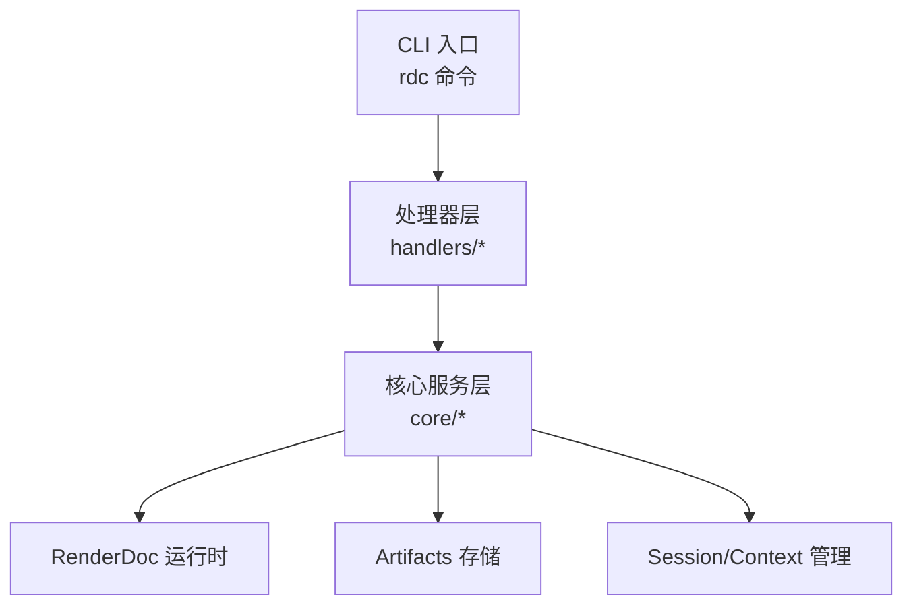
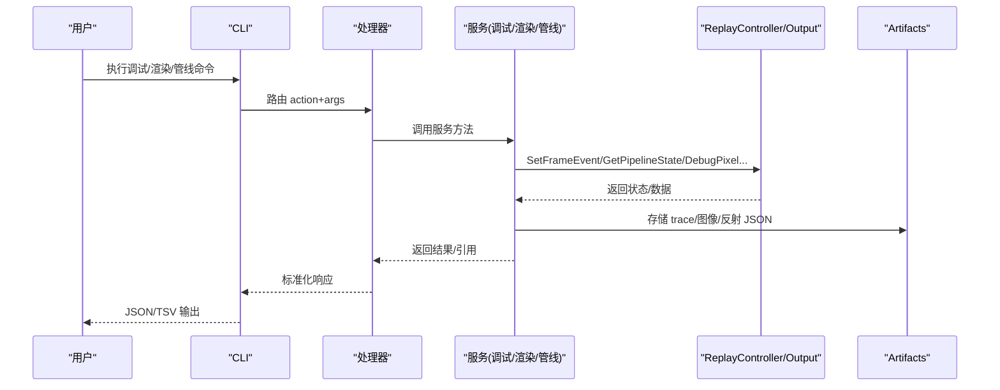
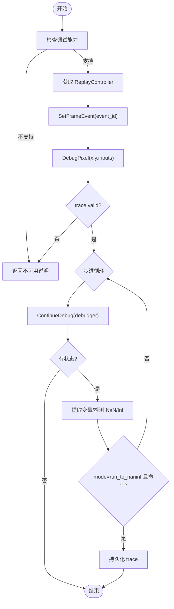
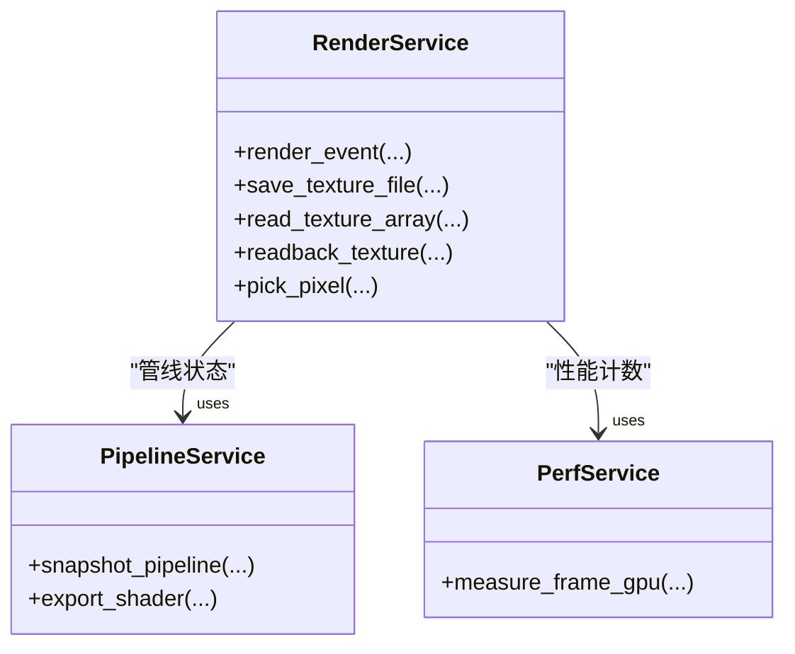
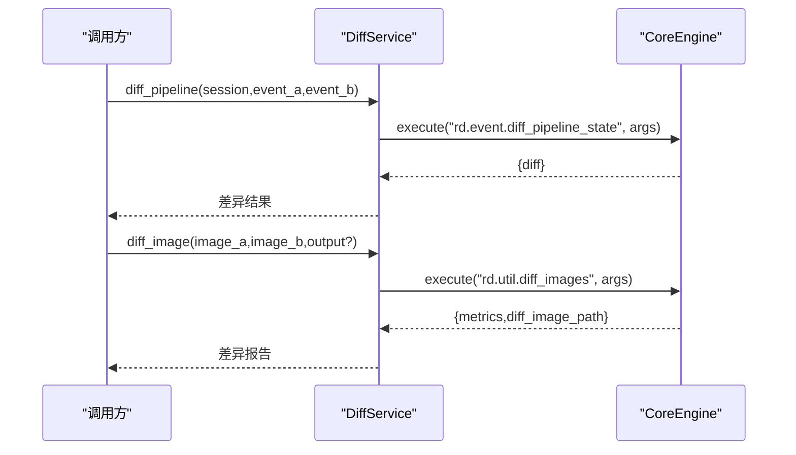
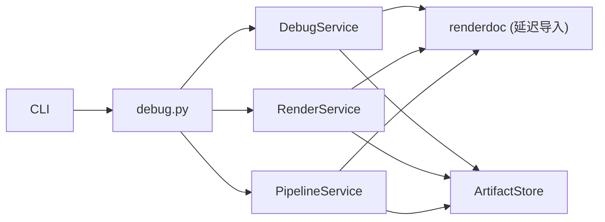

# 调试工具使用

<cite>
**本文引用的文件**
- [README.md](file://README.md)
- [tools.md](file://docs/tools.md)
- [tool-reference.md](file://docs/tool-reference.md)
- [troubleshooting.md](file://docs/troubleshooting.md)
- [debug_service.py](file://rdc_tool/core/debug_service.py)
- [render_service.py](file://rdc_tool/core/render_service.py)
- [pipeline_service.py](file://rdc_tool/core/pipeline_service.py)
- [diff_service.py](file://rdc_tool/core/diff_service.py)
- [renderdoc_status.py](file://rdc_tool/core/renderdoc_status.py)
- [perf_service.py](file://rdc_tool/core/perf_service.py)
- [debug.py](file://rdc_tool/handlers/debug.py)
- [cli.py](file://rdc_tool/cli.py)
</cite>

## 目录
1. [简介](#简介)
2. [项目结构](#项目结构)
3. [核心组件](#核心组件)
4. [架构总览](#架构总览)
5. [详细组件分析](#详细组件分析)
6. [依赖关系分析](#依赖关系分析)
7. [性能与稳定性考虑](#性能与稳定性考虑)
8. [故障排查指南](#故障排查指南)
9. [结论](#结论)
10. [附录：常用命令与操作索引](#附录：常用命令与操作索引)

## 简介
本指南面向使用 rdc-tools 进行图形捕获回放与调试的工程师，覆盖以下能力：
- 调试服务：像素/顶点着色器逐步执行、变量检查、调用栈分析、断点设置与条件断点。
- 渲染状态检查：GPU 状态监控、管线状态验证、资源绑定检查、图像导出与叠加层可视化。
- 差异比较：Pipeline 状态差异、图像差异分析、资源变化检测。
- 日志收集与诊断信息获取：运行时指标、操作历史、RenderDoc 错误结构化信息。
- 调试会话管理：上下文隔离、预览窗口、断点持久化、条件断点。
- 最佳实践与问题定位技巧：常见失败模式、恢复步骤、避免误判的方法。

## 项目结构
rdc-tools 以“服务 + 处理器 + CLI”分层组织：
- 服务层（core）：封装 RenderDoc API，提供异步接口，如 DebugService、RenderService、PipelineService、DiffService、PerfService。
- 处理器层（handlers）：将 CLI 或上层调用路由到具体服务实现。
- CLI 层（cli）：暴露 rdc 命令，负责参数解析、上下文选择、预览控制、结果输出。
- 文档与参考：工具清单、分组、参数契约、故障排查。

图表来源
- [cli.py:1120-1194](file://rdc_tool/cli.py#L1120-L1194)
- [debug.py:8-10](file://rdc_tool/handlers/debug.py#L8-L10)
- [debug_service.py:43-66](file://rdc_tool/core/debug_service.py#L43-L66)
- [render_service.py:346-422](file://rdc_tool/core/render_service.py#L346-L422)
- [pipeline_service.py:590-702](file://rdc_tool/core/pipeline_service.py#L590-L702)
- [diff_service.py:11-50](file://rdc_tool/core/diff_service.py#L11-L50)

章节来源
- [README.md:1-70](file://README.md#L1-L70)
- [tools.md:1-39](file://docs/tools.md#L1-L39)

## 核心组件
- 调试服务（DebugService）：围绕 RenderDoc 的 shader debug 原语，提供像素/顶点着色器逐步执行、NaN/Inf 自动停止、trace 持久化。
- 渲染服务（RenderService）：headless 渲染、纹理 readback、像素拾取、图像编码与导出、叠加层可视化。
- 管线服务（PipelineService）：快照当前事件管线状态（shader、RT/DS、blend、viewport/scissor、topology、bindings 等），支持按 API 类型提取。
- 差异服务（DiffService）：统一包装 pipeline 状态差异与图像差异对比。
- 性能服务（PerfService）：GPU 计数器枚举、采样、帧级耗时测量。
- 状态与错误辅助（renderdoc_status）：结构化 RenderDoc 状态码、消息与错误构建。

章节来源
- [debug_service.py:43-66](file://rdc_tool/core/debug_service.py#L43-L66)
- [render_service.py:346-422](file://rdc_tool/core/render_service.py#L346-L422)
- [pipeline_service.py:590-702](file://rdc_tool/core/pipeline_service.py#L590-L702)
- [diff_service.py:11-50](file://rdc_tool/core/diff_service.py#L11-L50)
- [perf_service.py:28-63](file://rdc_tool/core/perf_service.py#L28-L63)
- [renderdoc_status.py:10-105](file://rdc_tool/core/renderdoc_status.py#L10-L105)

## 架构总览
调试工作流从 CLI 进入，经处理器分发到对应服务，服务通过 session_manager 获取 replay controller/output，调用 RenderDoc API 完成数据抓取与分析，并将结果持久化为 artifacts。

图表来源
- [debug.py:8-10](file://rdc_tool/handlers/debug.py#L8-L10)
- [debug_service.py:122-213](file://rdc_tool/core/debug_service.py#L122-L213)
- [render_service.py:421-521](file://rdc_tool/core/render_service.py#L421-L521)
- [pipeline_service.py:607-702](file://rdc_tool/core/pipeline_service.py#L607-L702)
- [diff_service.py:21-50](file://rdc_tool/core/diff_service.py#L21-L50)

## 详细组件分析

### 调试服务：断点、变量检查、调用栈
- 功能要点
  - 像素着色器调试：支持 run-to-NaN/Inf 与 full trace，步进上限保护。
  - 顶点着色器调试：指定 vertex_id/instance_id 步进并记录寄存器/变量。
  - 变量提取：扁平化 SourceVariableMapping 为 name->value 映射，支持 float/int 向量。
  - Trace 持久化：保存为 JSON artifact，便于后续离线分析。
  - 能力检测：优先使用 session capabilities，否则基于 GraphicsAPI 启发式判断是否支持 shader debug。
- 关键流程（像素调试）

图表来源
- [debug_service.py:94-213](file://rdc_tool/core/debug_service.py#L94-L213)
- [debug_service.py:427-466](file://rdc_tool/core/debug_service.py#L427-L466)

- 断点与条件断点
  - 设置断点：通过 rd.debug.set_breakpoints 传入 PC 或源码位置列表。
  - 继续执行：rd.debug.continue 直到断点/结束/超时。
  - 表达式求值：rd.debug.evaluate_expression 在 debugger 上下文中计算表达式。
  - 调用栈：rd.debug.get_callstack 获取函数名/文件/行。
  - 变量检查：rd.debug.get_variables 支持名称过滤与展开深度。
  - 运行到目标：rd.debug.run_to 运行到指定 PC 或源码位置。
  - 清理与结束：rd.debug.clear_breakpoints、rd.debug.finish。

- 会话管理与断点持久化
  - 上下文隔离：通过 --daemon-context 选择独立命名空间；rd.session.* 操作作用于该上下文。
  - 预览窗口：rd.session.open_preview/close_preview/status 控制预览显示与绑定。
  - 断点持久化：断点本身由 RenderDoc 调试会话管理；可将 trace 与变量快照作为 artifacts 持久化，用于复现与共享。

章节来源
- [debug_service.py:54-267](file://rdc_tool/core/debug_service.py#L54-L267)
- [debug_service.py:271-421](file://rdc_tool/core/debug_service.py#L271-L421)
- [debug_service.py:427-466](file://rdc_tool/core/debug_service.py#L427-L466)
- [tool-reference.md:82-97](file://docs/tool-reference.md#L82-L97)
- [cli.py:1197-1210](file://rdc_tool/cli.py#L1197-L1210)

### 渲染状态检查：GPU 状态、管线验证、资源绑定
- GPU 状态监控
  - 帧级 GPU 耗时：PerfService.measure_frame_gpu 使用 FrameGPUDuration 计数器，返回完整单队列重放耗时样本。
  - 事件范围采样：可枚举计数器并在 event 范围内采样，识别热点事件。
- 管线状态验证
  - PipelineService.snapshot_pipeline 返回 shaders、render_targets、depth_target、blend_states、depth_stencil、viewports/scissors、topology、vertex_inputs、以及各 API 特定 section（push_constants、dynamic_state、root_signature、descriptor_heaps、resource_states）。
  - 资源绑定检查：按 stage 收集 SRV/UAV/CBV/Sampler 绑定，包含 descriptor 与 sampler 详情。
- 图像导出与叠加层
  - RenderService.render_event 将当前事件输出渲染为 PNG/JPG/EXR/HDR，支持 subresource、channels、overlay、HDR multiplier、flip_y、raw_output。
  - Overlay 名称映射：nan、clipping、drawcall、wireframe、depth、stencil、backface_cull、viewport_scissor、quad_overdraw、triangle_size。
  - 纹理导出：save_texture_file/read_texture_array/readback_texture 支持 raw/NPZ/PNG/JPG/EXR/HDR，并提供统计信息。

图表来源
- [render_service.py:346-521](file://rdc_tool/core/render_service.py#L346-L521)
- [pipeline_service.py:590-702](file://rdc_tool/core/pipeline_service.py#L590-L702)
- [perf_service.py:28-63](file://rdc_tool/core/perf_service.py#L28-L63)

章节来源
- [render_service.py:235-338](file://rdc_tool/core/render_service.py#L235-L338)
- [render_service.py:523-646](file://rdc_tool/core/render_service.py#L523-L646)
- [render_service.py:658-794](file://rdc_tool/core/render_service.py#L658-L794)
- [pipeline_service.py:175-373](file://rdc_tool/core/pipeline_service.py#L175-L373)
- [pipeline_service.py:392-502](file://rdc_tool/core/pipeline_service.py#L392-L502)
- [perf_service.py:28-63](file://rdc_tool/core/perf_service.py#L28-L63)

### 差异比较工具：Pipeline 状态差异、图像差异、资源变化
- Pipeline 状态差异
  - DiffService.diff_pipeline 调用 rd.event.diff_pipeline_state，对比两个事件的管线状态差异，帮助定位“状态被谁修改”。
- 图像差异分析
  - DiffService.diff_image 调用 rd.util.diff_images，对比两张图片（PNG/JPEG/EXR），输出差异图与指标（PSNR、SSIM、最大绝对误差）。
- 资源变化检测
  - 结合 PipelineService 的 bindings 快照与 Resource 使用查询（rd.resource.get_usage），可识别哪些事件读写/绑定了资源，从而推断变化来源。

图表来源
- [diff_service.py:11-50](file://rdc_tool/core/diff_service.py#L11-L50)
- [tool-reference.md:108-109](file://docs/tool-reference.md#L108-L109)
- [tool-reference.md:235-237](file://docs/tool-reference.md#L235-L237)

章节来源
- [diff_service.py:11-50](file://rdc_tool/core/diff_service.py#L11-L50)
- [tool-reference.md:108-109](file://docs/tool-reference.md#L108-L109)
- [tool-reference.md:235-237](file://docs/tool-reference.md#L235-L237)

### 日志收集与诊断信息获取
- 内部日志与操作历史
  - rd.core.get_logs：读取内部日志，可按时间/级别过滤。
  - rd.core.get_operation_history：读取最近 trace-linked 操作历史，支持按时间、状态、操作名过滤。
- 运行时指标与限制
  - rd.core.get_runtime_metrics：自监控指标、限制配置、恢复摘要、最近操作统计。
- RenderDoc 错误结构化
  - renderdoc_status.status_ok/status_text/status_code_name/status_code_raw：统一解析状态码与消息。
  - build_renderdoc_error_details/raise_renderdoc_error：构造带 source_layer、operation、backend_type、capture_context 的结构化错误。

章节来源
- [tool-reference.md:64-80](file://docs/tool-reference.md#L64-L80)
- [renderdoc_status.py:10-105](file://rdc_tool/core/renderdoc_status.py#L10-L105)

### 调试会话管理、断点持久化、条件断点
- 会话与上下文
  - rdc-tool context status/update/list/clear：查看/更新/列出/清除上下文。
  - rd.session.get_context：读取上下文快照，包括 runtime、remote、focus、sessions、recovery、limits、preview 等。
  - rd.session.open_preview/close_preview/status：打开/关闭/查询预览窗口。
- 断点与条件断点
  - rd.debug.set_breakpoints：设置断点（PC 或源码位置）。
  - rd.debug.evaluate_expression：在调试上下文中求值表达式，可用于条件断点逻辑。
  - rd.debug.continue：继续执行直到断点/结束/超时。
  - 断点持久化：将 trace、变量快照、断点配置保存为 artifacts，以便后续复现与共享。

章节来源
- [tool-reference.md:82-97](file://docs/tool-reference.md#L82-L97)
- [tool-reference.md:183-199](file://docs/tool-reference.md#L183-L199)
- [cli.py:1197-1210](file://rdc_tool/cli.py#L1197-L1210)

## 依赖关系分析
- 服务对 RenderDoc 的延迟导入：避免在无渲染环境加载失败，首次使用时才导入。
- 服务对 session_manager 的松耦合：通过 Protocol 定义最小接口（get_controller/get_output），便于测试替换。
- 服务对 artifact_store 的抽象：所有持久化产物通过 store/store_file 写入，统一元数据与 MIME。
- CLI 到处理器的路由：debug 处理器统一转发到 server_runtime._dispatch_debug。

图表来源
- [debug.py:8-10](file://rdc_tool/handlers/debug.py#L8-L10)
- [debug_service.py:573-595](file://rdc_tool/core/debug_service.py#L573-L595)
- [render_service.py:39-56](file://rdc_tool/core/render_service.py#L39-L56)
- [pipeline_service.py:34-48](file://rdc_tool/core/pipeline_service.py#L34-L48)

章节来源
- [debug_service.py:573-595](file://rdc_tool/core/debug_service.py#L573-L595)
- [render_service.py:39-56](file://rdc_tool/core/render_service.py#L39-L56)
- [pipeline_service.py:34-48](file://rdc_tool/core/pipeline_service.py#L34-L48)
- [debug.py:8-10](file://rdc_tool/handlers/debug.py#L8-L10)

## 性能与稳定性考虑
- 非阻塞设计：所有阻塞的 RenderDoc 调用通过 asyncio.to_thread 分派，避免阻塞事件循环。
- 步进上限保护：像素/顶点调试设置 max_steps，防止 trace 失控。
- 格式降级与回退：EXR/HDR 编码不可用时回退到 PNG；raw 输出尺寸不匹配时填充或截断。
- 计数器可用性校验：整帧 GPU 耗时需后端支持 FrameGPUDuration，否则明确报错。
- 资源释放：调试 trace 完成后调用 FreeTrace，避免驱动资源泄漏。

章节来源
- [render_service.py:6-11](file://rdc_tool/core/render_service.py#L6-L11)
- [debug_service.py:83-87](file://rdc_tool/core/debug_service.py#L83-L87)
- [render_service.py:304-333](file://rdc_tool/core/render_service.py#L304-L333)
- [perf_service.py:32-37](file://rdc_tool/core/perf_service.py#L32-L37)
- [debug_service.py:204-213](file://rdc_tool/core/debug_service.py#L204-L213)

## 故障排查指南
- 前置检查
  - 运行 rdc-tool --json doctor 检查工具根路径、Python 运行时、RenderDoc DLL/PYD 布局、catalog 数量、启动器与守护进程状态。
  - 使用 rdc-tool context status --json 检查活跃上下文；若捕获/会话不正确，执行 rdc-tool context clear --json 后重新打开 .rdc。
- 远程生命周期
  - remote_handle_consumed 表示句柄已被消费，不得复用；需重新连接或通过远程工作流恢复。
- 重开回放
  - rd.capture.open_replay 重用同上下文下的现有 live session；先关闭再重开；守护进程超时后检查上下文与操作历史。
- Shader 替换
  - 编辑前阅读 edit_plan；SPIR-V 可使用 SPIR-V ASM 目标；DXIL/DXBC 反汇编默认只读；编译失败不包含 ReplaceResource。
- 纹理导出
  - 显式 HDR/EXR/DDS 请求不可用时会失败关闭；PNG 是显示映射输出，不应视为 HDR 证据。
- 预览问题
  - preview 打不开或失效：检查 session preview status 与当前 session_id；确认 framebuffer extent 未被 viewport/scissor 混淆。
- Android 连接恢复
  - ADB 查询失败、缺少 socket、socket 歧义、原生 busy/incompatible 为不同失败；成功 PNG 不等于建立 Android 屏幕呈现。
- 恢复查询失败
  - 缺失缩略图、初始化溯源、不支持 GPU 时间戳覆盖率、readback 失败为不同结果；服务器端空闲接收超时可能关闭连接。

章节来源
- [troubleshooting.md:1-58](file://docs/troubleshooting.md#L1-L58)
- [tool-reference.md:47-63](file://docs/tool-reference.md#L47-L63)
- [tool-reference.md:200-217](file://docs/tool-reference.md#L200-L217)
- [tool-reference.md:218-230](file://docs/tool-reference.md#L218-L230)

## 结论
rdc-tools 提供了完整的图形调试与诊断能力：从着色器级逐步执行、变量与调用栈检查，到管线状态快照、资源绑定验证、图像与管线差异对比，再到日志与运行时指标采集。通过上下文隔离、预览窗口与 artifacts 持久化，可实现高效的问题定位与复现。遵循最佳实践与故障排查步骤，可显著降低调试成本并提高准确性。

## 附录：常用命令与操作索引
- 环境与上下文
  - rdc-tool --json doctor
  - rdc-tool context status --json
  - rdc-tool context update --key notes --value "..." --json
  - rdc-tool context clear --json
- 捕获与会话
  - rdc-tool capture open --file "<path>" --frame-index 0
  - rdc-tool session preview on|off|status
- 事件与管线
  - rdc-tool event list --format tsv
  - rdc-tool pipeline show --event-id 42 --format json
  - rd.pipeline.get_state --detail full --sections [...]
- 资源与导出
  - rdc-tool resource list --format tsv
  - rd.export.texture / rd.export.screenshot / rd.export.shader_bundle
- 调试
  - rd.shader.debug_start / rd.debug.set_breakpoints / rd.debug.continue / rd.debug.get_variables / rd.debug.get_callstack
- 差异
  - rd.event.diff_pipeline_state
  - rd.util.diff_images
- 日志与诊断
  - rd.core.get_logs / rd.core.get_operation_history / rd.core.get_runtime_metrics

章节来源
- [README.md:5-21](file://README.md#L5-L21)
- [tools.md:1-39](file://docs/tools.md#L1-L39)
- [tool-reference.md:1-12](file://docs/tool-reference.md#L1-L12)