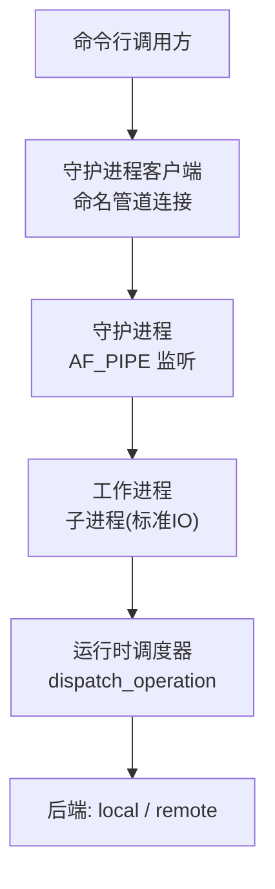
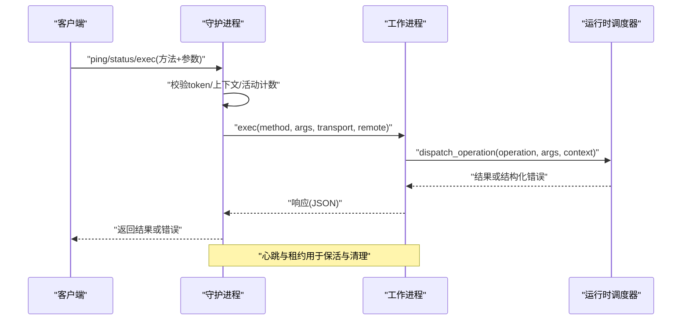
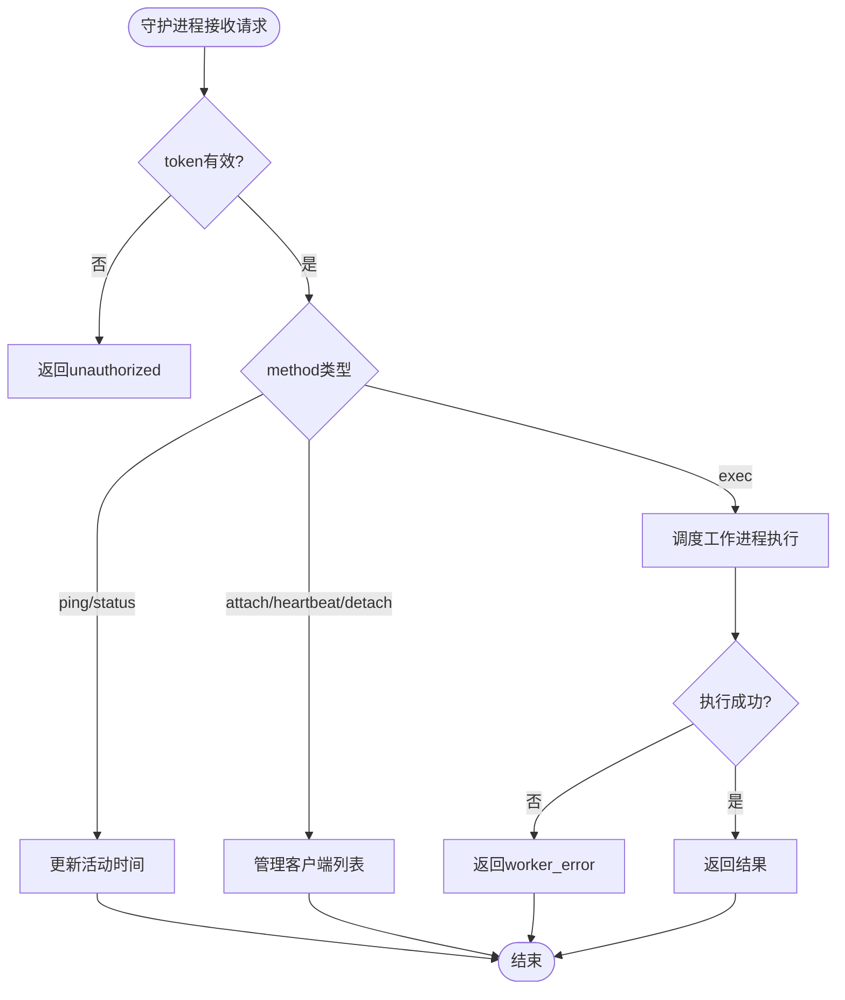
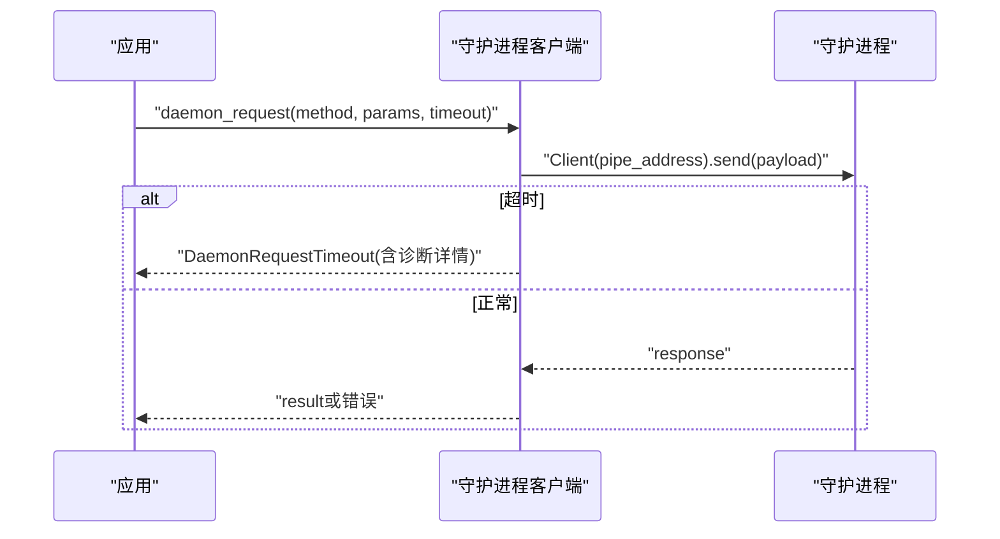
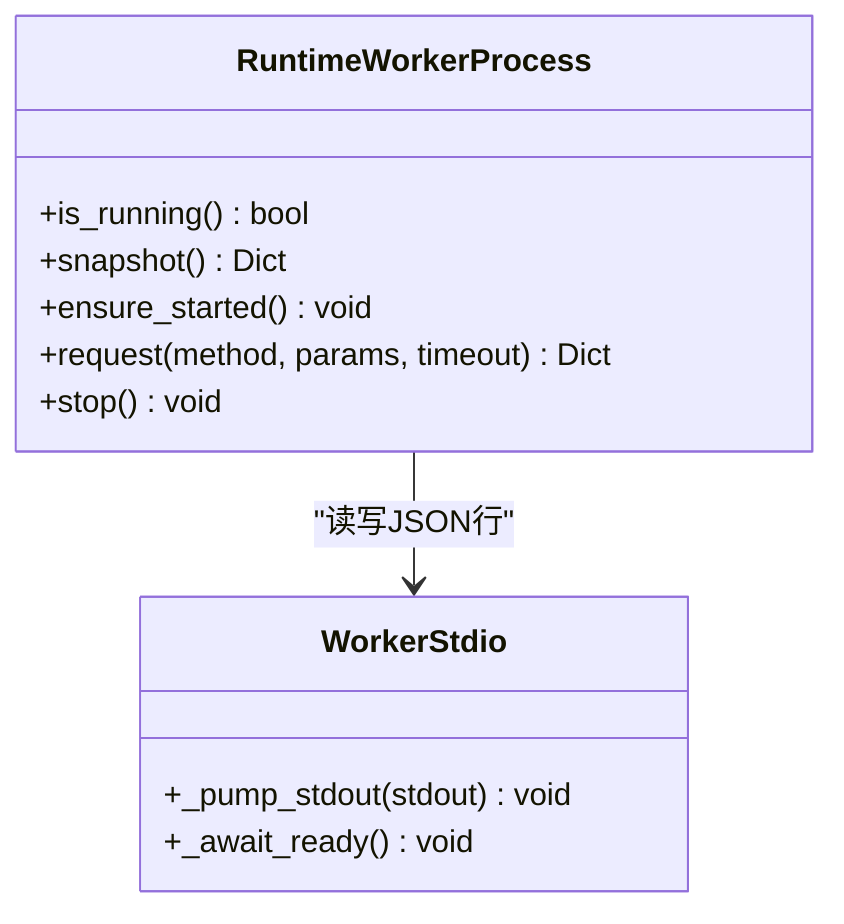
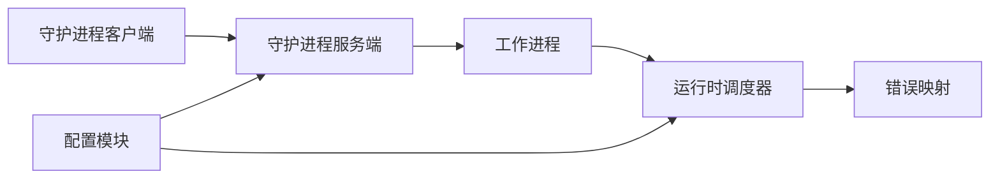
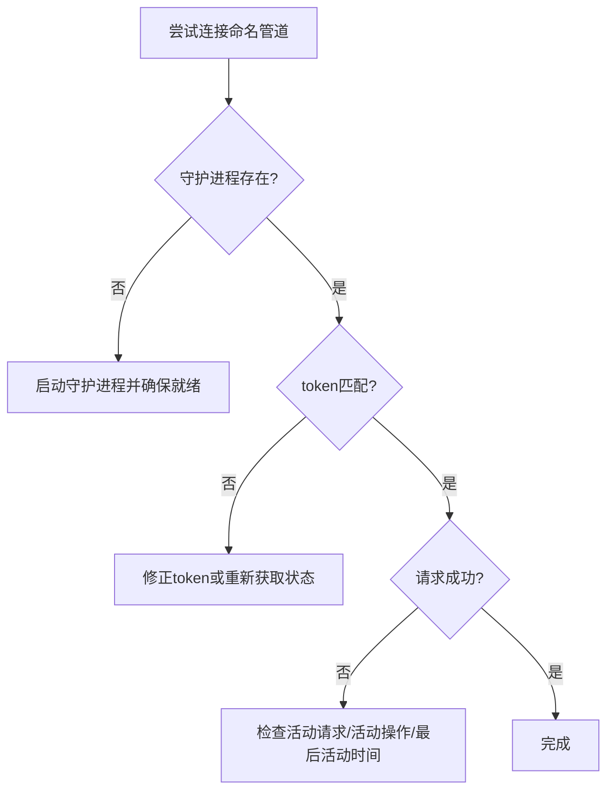

# 连接问题排查

<cite>
**本文引用的文件**
- [rdx/daemon/server.py](file://rdx/daemon/server.py)
- [rdx/daemon/client.py](file://rdx/daemon/client.py)
- [rdx/daemon/worker.py](file://rdx/daemon/worker.py)
- [rdx/runtime_worker.py](file://rdx/runtime_worker.py)
- [rdx/server.py](file://rdx/server.py)
- [rdx/config.py](file://rdx/config.py)
- [rdx/core/errors.py](file://rdx/core/errors.py)
- [docs/troubleshooting.md](file://docs/troubleshooting.md)
- [docs/agent-integration.md](file://docs/agent-integration.md)
</cite>

## 目录
1. [简介](#简介)
2. [项目结构](#项目结构)
3. [核心组件](#核心组件)
4. [架构总览](#架构总览)
5. [详细组件分析](#详细组件分析)
6. [依赖关系分析](#依赖关系分析)
7. [性能与超时特性](#性能与超时特性)
8. [故障排查指南](#故障排查指南)
9. [结论](#结论)
10. [附录：常用命令与恢复流程](#附录常用命令与恢复流程)

## 简介
本指南面向RDX工具链中的“连接问题”，覆盖守护进程通信失败、命名管道连接、进程状态检查、端口占用检测、远程连接超时（含Android设备）、网络配置验证、防火墙与代理设置、IP与端口映射、连接状态监控、调试信息收集、常见错误日志分析与解决方案，以及连接测试与故障恢复流程。内容基于仓库中守护进程、客户端、工作进程、运行时调度与配置的源码实现进行系统化梳理。

## 项目结构
RDX的连接链路主要包含以下层次：
- 本地CLI通过命名管道与守护进程通信
- 守护进程负责认证、会话管理、心跳保活、生命周期清理，并调度工作进程执行具体操作
- 工作进程承载RenderDoc运行时，异步执行操作并通过标准输出与守护进程交互
- 运行时调度器将操作路由到具体处理器，支持本地与远程后端

**图表来源**
- [rdx/daemon/client.py:118-120](file://rdx/daemon/client.py#L118-L120)
- [rdx/daemon/server.py:657-690](file://rdx/daemon/server.py#L657-L690)
- [rdx/daemon/worker.py:69-119](file://rdx/daemon/worker.py#L69-L119)
- [rdx/server.py:62-142](file://rdx/server.py#L62-L142)

**章节来源**
- [rdx/daemon/server.py:1-728](file://rdx/daemon/server.py#L1-L728)
- [rdx/daemon/client.py:1-902](file://rdx/daemon/client.py#L1-L902)
- [rdx/daemon/worker.py:1-203](file://rdx/daemon/worker.py#L1-L203)
- [rdx/runtime_worker.py:1-167](file://rdx/runtime_worker.py#L1-L167)
- [rdx/server.py:1-150](file://rdx/server.py#L1-L150)

## 核心组件
- 守护进程服务端：使用Windows命名管道监听请求，维护上下文、会话、活动操作、客户端列表与心跳，自动清理空闲或失去所有者的守护进程。
- 守护进程客户端：负责发现/启动守护进程、建立命名管道连接、发送带令牌的方法请求、处理超时与诊断信息。
- 工作进程：由守护进程派生，运行渲染回放运行时，通过JSON行协议与守护进程通信，提供exec/clear_context/status/shutdown等方法。
- 运行时调度器：统一入口，记录trace_id、进度上报、异常规范化、预览同步等。
- 配置模块：定义后端类型、远程主机/端口/协议、重放超时、资源限制等关键参数。

**章节来源**
- [rdx/daemon/server.py:102-165](file://rdx/daemon/server.py#L102-L165)
- [rdx/daemon/client.py:467-515](file://rdx/daemon/client.py#L467-L515)
- [rdx/daemon/worker.py:24-45](file://rdx/daemon/worker.py#L24-L45)
- [rdx/server.py:62-142](file://rdx/server.py#L62-L142)
- [rdx/config.py:15-35](file://rdx/config.py#L15-L35)

## 架构总览
下图展示了从CLI到后端的完整调用序列，包括守护进程的认证、心跳、工作进程调度与运行时执行。

**图表来源**
- [rdx/daemon/client.py:467-515](file://rdx/daemon/client.py#L467-L515)
- [rdx/daemon/server.py:572-643](file://rdx/daemon/server.py#L572-L643)
- [rdx/daemon/worker.py:144-170](file://rdx/daemon/worker.py#L144-L170)
- [rdx/server.py:62-142](file://rdx/server.py#L62-L142)

## 详细组件分析

### 守护进程服务端（命名管道）
- 监听地址：使用Windows命名管道，地址格式为“\\.\pipe\<pipe_name>”。
- 认证：每个请求必须携带token，否则返回未授权错误。
- 会话与活动：维护attached_clients、active_request_count、active_operation、last_activity_at等字段，用于心跳与空闲清理。
- 生命周期：后台线程周期性检查所有者进程存活、租约过期、空闲超时，满足条件则停止守护进程。
- 错误处理：请求处理异常时返回结构化错误；连接异常时关闭连接并返回错误。

**图表来源**
- [rdx/daemon/server.py:166-170](file://rdx/daemon/server.py#L166-L170)
- [rdx/daemon/server.py:572-643](file://rdx/daemon/server.py#L572-L643)
- [rdx/daemon/server.py:532-570](file://rdx/daemon/server.py#L532-L570)

**章节来源**
- [rdx/daemon/server.py:102-165](file://rdx/daemon/server.py#L102-L165)
- [rdx/daemon/server.py:532-570](file://rdx/daemon/server.py#L532-L570)
- [rdx/daemon/server.py:572-643](file://rdx/daemon/server.py#L572-L643)

### 守护进程客户端（命名管道连接）
- 连接方式：通过multiprocessing.connection.Client连接到“\\.\pipe\<pipe_name>”。
- 超时处理：若等待响应超过阈值，抛出DaemonRequestTimeout，附带操作名、上下文、活跃请求数、活动操作摘要、最近守护进程状态等诊断信息。
- 守护进程管理：自动清理陈旧状态、尝试启动守护进程、轮询就绪、优雅关闭或强制终止。
- 上下文与租约：支持多上下文隔离，按租约与心跳判断客户端存活。

**图表来源**
- [rdx/daemon/client.py:118-120](file://rdx/daemon/client.py#L118-L120)
- [rdx/daemon/client.py:467-515](file://rdx/daemon/client.py#L467-L515)

**章节来源**
- [rdx/daemon/client.py:31-37](file://rdx/daemon/client.py#L31-L37)
- [rdx/daemon/client.py:467-515](file://rdx/daemon/client.py#L467-L515)
- [rdx/daemon/client.py:518-525](file://rdx/daemon/client.py#L518-L525)
- [rdx/daemon/client.py:539-552](file://rdx/daemon/client.py#L539-L552)

### 工作进程（子进程）
- 启动：守护进程通过subprocess启动工作进程，注入环境变量（上下文ID、二进制目录、RenderDoc路径、清单路径）。
- 就绪信号：工作进程启动完成后输出“ready”消息，守护进程等待该信号。
- 请求协议：以JSON行形式在stdin写入请求，stdout读取响应；支持exec、clear_context、status、shutdown。
- 超时与退出：请求有超时控制；EOF或异常会触发错误处理。

**图表来源**
- [rdx/daemon/worker.py:24-45](file://rdx/daemon/worker.py#L24-L45)
- [rdx/daemon/worker.py:57-136](file://rdx/daemon/worker.py#L57-L136)
- [rdx/daemon/worker.py:144-170](file://rdx/daemon/worker.py#L144-L170)

**章节来源**
- [rdx/daemon/worker.py:69-119](file://rdx/daemon/worker.py#L69-L119)
- [rdx/daemon/worker.py:121-136](file://rdx/daemon/worker.py#L121-L136)
- [rdx/daemon/worker.py:144-170](file://rdx/daemon/worker.py#L144-L170)

### 运行时调度器
- 统一入口：dispatch_operation负责创建ExecutionContext、记录trace_id、进度上报、异常规范化、预览同步。
- 后端选择：transport与remote标志决定本地或远程执行路径。
- 错误归一化：将异常映射为核心错误类型，便于上层统一处理。

**章节来源**
- [rdx/server.py:62-142](file://rdx/server.py#L62-L142)
- [rdx/core/errors.py:9-119](file://rdx/core/errors.py#L9-L119)

### 配置与后端
- 后端配置：type可为local或remote；remote_host、remote_port、remote_protocol、remote_auth_mode/value用于远程连接。
- 重放超时：replay_timeout_seconds影响长时间操作的超时策略。
- 环境注入：可通过环境变量调整日志级别、GPU供应商、数据目录、报告目录等。

**章节来源**
- [rdx/config.py:15-35](file://rdx/config.py#L15-L35)
- [rdx/config.py:117-186](file://rdx/config.py#L117-L186)

## 依赖关系分析
- 守护进程依赖客户端提供的状态管理与清理逻辑，同时依赖工作进程执行具体任务。
- 工作进程依赖运行时调度器执行操作，并通过标准输入输出与守护进程通信。
- 运行时调度器依赖错误映射与工具注册表，确保操作可执行且错误可追踪。
- 配置模块贯穿后端选择与超时策略，影响连接行为。

**图表来源**
- [rdx/daemon/client.py:467-515](file://rdx/daemon/client.py#L467-L515)
- [rdx/daemon/server.py:572-643](file://rdx/daemon/server.py#L572-L643)
- [rdx/daemon/worker.py:144-170](file://rdx/daemon/worker.py#L144-L170)
- [rdx/server.py:62-142](file://rdx/server.py#L62-L142)
- [rdx/config.py:15-35](file://rdx/config.py#L15-L35)

**章节来源**
- [rdx/daemon/server.py:572-643](file://rdx/daemon/server.py#L572-L643)
- [rdx/daemon/client.py:467-515](file://rdx/daemon/client.py#L467-L515)
- [rdx/daemon/worker.py:144-170](file://rdx/daemon/worker.py#L144-L170)
- [rdx/server.py:62-142](file://rdx/server.py#L62-L142)
- [rdx/config.py:15-35](file://rdx/config.py#L15-L35)

## 性能与超时特性
- 守护进程空闲超时：默认15分钟无活动则停止守护进程，避免资源泄漏。
- 租约机制：客户端心跳间隔与租约时间共同决定守护进程是否认为客户端仍活跃。
- 工作进程请求超时：默认30秒，可根据操作动态计算超时。
- 守护进程就绪轮询：启动后以指数退避轮询ping，直至就绪或超时。
- 重放超时：默认120秒，适用于长时间回放或远端操作。

**章节来源**
- [rdx/daemon/server.py:532-570](file://rdx/daemon/server.py#L532-L570)
- [rdx/daemon/client.py:25-28](file://rdx/daemon/client.py#L25-L28)
- [rdx/daemon/worker.py:20-21](file://rdx/daemon/worker.py#L20-L21)
- [rdx/config.py:28-35](file://rdx/config.py#L28-L35)

## 故障排查指南

### 守护进程通信失败（命名管道）
- 现象：无法连接命名管道、请求超时、未授权。
- 排查步骤：
  - 确认守护进程已启动并监听命名管道地址“\\.\pipe\<pipe_name>”。
  - 检查客户端使用的token是否与守护进程一致。
  - 查看守护进程状态文件，确认pid、pipe_name、token、上下文、活动请求数、最后活动时间。
  - 若守护进程因空闲或租约过期而停止，需重新启动或通过owner_pid抢占。
  - 使用“ping”方法探测守护进程是否就绪。

**图表来源**
- [rdx/daemon/server.py:657-690](file://rdx/daemon/server.py#L657-L690)
- [rdx/daemon/client.py:467-515](file://rdx/daemon/client.py#L467-L515)
- [rdx/daemon/client.py:518-525](file://rdx/daemon/client.py#L518-L525)

**章节来源**
- [rdx/daemon/server.py:166-170](file://rdx/daemon/server.py#L166-L170)
- [rdx/daemon/server.py:572-643](file://rdx/daemon/server.py#L572-L643)
- [rdx/daemon/client.py:467-515](file://rdx/daemon/client.py#L467-L515)

### 进程状态检查与端口占用检测
- 进程状态：
  - 守护进程与工作者进程均维护pid，并可通过系统API检查进程是否仍在运行。
  - 守护进程会清理非活跃客户端与失去所有者的守护进程。
- 端口占用：
  - 本地命名管道不涉及TCP端口；远程后端使用TCP端口（默认38920），需检查占用与可达性。
  - 若远程连接失败，检查防火墙、代理、NAT映射与端口转发是否正确。

**章节来源**
- [rdx/daemon/server.py:85-100](file://rdx/daemon/server.py#L85-L100)
- [rdx/daemon/client.py:362-399](file://rdx/daemon/client.py#L362-L399)
- [rdx/config.py:15-25](file://rdx/config.py#L15-L25)

### 远程连接超时（Android设备）
- 现象：Android设备连接超时、ADB查询失败、socket歧义、原生忙/不兼容。
- 排查步骤：
  - 确认ADB服务可用，设备在线，端口映射正确。
  - 检查远程后端配置（host/port/protocol/auth）。
  - 查看上下文状态与操作历史，确认是否重复连接导致handle被消费。
  - 遵循文档建议：不要强制停止用户服务或替换端口映射；在网络修复后重试。

**章节来源**
- [docs/troubleshooting.md:47-52](file://docs/troubleshooting.md#L47-L52)
- [rdx/config.py:15-25](file://rdx/config.py#L15-L25)

### 网络连接错误（IP、端口映射、代理）
- IP与端口：
  - 远程后端默认端口为38920，需确保目标主机可达、端口开放。
  - 检查路由器/NAT映射、防火墙规则、代理设置。
- 代理：
  - 若通过代理访问远程服务，需确保代理允许该端口与协议。
  - 某些环境下代理可能拦截或延迟连接，导致超时。

**章节来源**
- [rdx/config.py:15-25](file://rdx/config.py#L15-L25)

### 连接状态监控与调试信息收集
- 监控手段：
  - 使用“status”方法获取守护进程状态，包括上下文、会话、捕获、活动操作、最后活动时间、后端类型。
  - 使用“context status --json”查看当前上下文与恢复状态。
  - 使用“doctor”检查工具根、Python运行时、RenderDoc布局、守护进程状态。
- 调试信息：
  - 捕获守护进程状态文件（daemon_state.json及上下文相关状态）。
  - 捕获工作进程状态（worker state）。
  - 记录操作trace_id与duration_ms，定位慢操作与失败点。

**章节来源**
- [rdx/daemon/server.py:222-225](file://rdx/daemon/server.py#L222-L225)
- [rdx/daemon/client.py:159-175](file://rdx/daemon/client.py#L159-L175)
- [docs/troubleshooting.md:3-19](file://docs/troubleshooting.md#L3-L19)
- [docs/agent-integration.md:5-14](file://docs/agent-integration.md#L5-L14)

### 常见连接错误的日志分析与解决方案
- 未授权（unauthorized）：token不匹配，重新获取或刷新守护进程状态。
- 未知方法（unknown_method）：请求method拼写错误或版本不兼容，升级工具或对齐接口。
- 工作进程错误（worker_error）：工作进程执行失败，检查运行时日志与上下文快照。
- 超时（daemon_timeout/worker request timed out）：检查负载、网络、远端设备状态，必要时重启上下文。
- 会话冲突（stale_session_requires_restart）：关闭并重开隔离会话，避免重用旧handle。

**章节来源**
- [rdx/daemon/server.py:572-643](file://rdx/daemon/server.py#L572-L643)
- [rdx/daemon/client.py:31-37](file://rdx/daemon/client.py#L31-L37)
- [rdx/daemon/worker.py:144-170](file://rdx/daemon/worker.py#L144-L170)
- [docs/troubleshooting.md:13-19](file://docs/troubleshooting.md#L13-L19)

### 连接测试工具与故障恢复流程
- 测试工具：
  - “rdx --json doctor”快速诊断环境与守护进程状态。
  - “rdx context status --json”查看上下文与会话。
  - “rdx tools search/pipeline”验证工具可用性。
- 恢复流程：
  - 清理上下文：“rdx context clear --json”释放会话/预览/远端/快照。
  - 停止守护进程：“rdx daemon stop --json”停止对应命名空间的守护进程与工作进程。
  - 重启并重新连接：确保owner_pid传递以便回收，避免僵尸进程。

**章节来源**
- [docs/agent-integration.md:16-31](file://docs/agent-integration.md#L16-L31)
- [docs/troubleshooting.md:7-19](file://docs/troubleshooting.md#L7-L19)

## 结论
RDX的连接链路围绕命名管道与子进程协作构建，具备完善的认证、心跳、租约与生命周期管理机制。排查连接问题时，应优先检查守护进程状态、token一致性、活动操作与最后活动时间，再结合远程后端配置与网络环境进行诊断。通过“doctor”、“context status”与状态文件收集调试信息，配合上下文清理与守护进程重启，可有效恢复连接与服务。

## 附录：常用命令与恢复流程
- 诊断命令：
  - rdx --json doctor
  - rdx context status --json
  - rdx tools search pipeline --json
- 恢复命令：
  - rdx context clear --json
  - rdx daemon stop --json
  - rdx capture open --file <path> [--remote-id "<id>"]
- 注意事项：
  - 使用“--daemon-context”隔离不同任务上下文。
  - 传递“--owner-pid”以便在父进程死亡后回收守护进程与工作进程。
  - 对Android设备连接，遵循文档建议，避免强制停止用户服务或替换端口映射。

**章节来源**
- [docs/agent-integration.md:5-31](file://docs/agent-integration.md#L5-L31)
- [docs/troubleshooting.md:7-19](file://docs/troubleshooting.md#L7-L19)