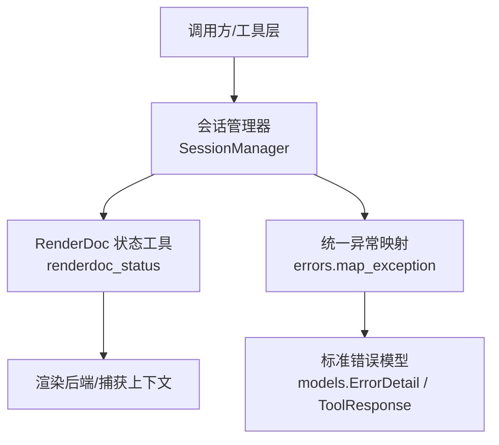
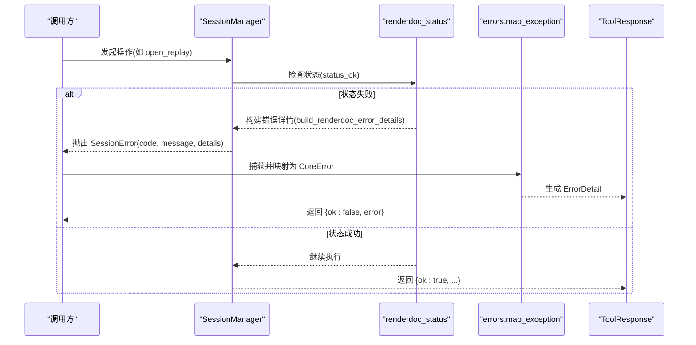
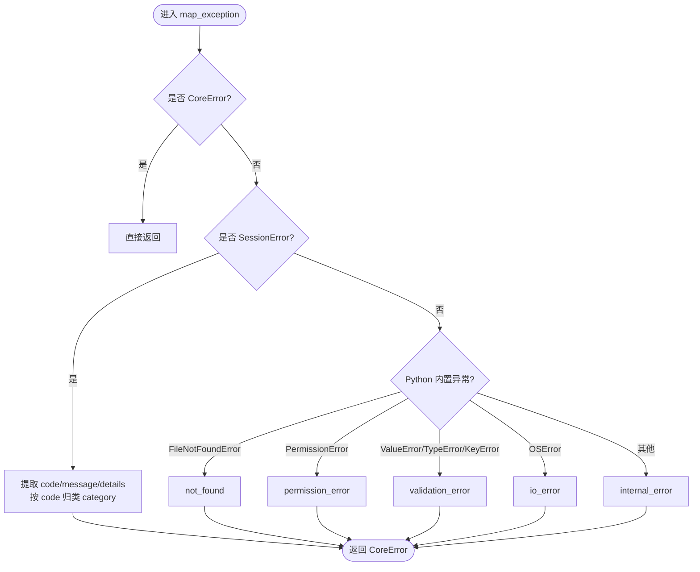
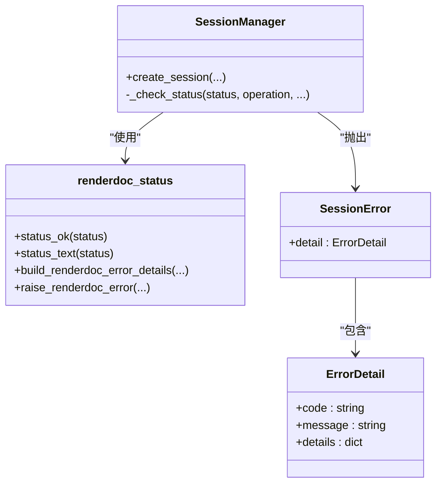

# 错误参考手册

<cite>
**本文引用的文件**
- [rdc_tool/core/errors.py](file://rdc_tool/core/errors.py)
- [rdc_tool/core/session_manager.py](file://rdc_tool/core/session_manager.py)
- [rdc_tool/core/renderdoc_status.py](file://rdc_tool/core/renderdoc_status.py)
- [rdc_tool/models.py](file://rdc_tool/models.py)
- [docs/troubleshooting.md](file://docs/troubleshooting.md)
</cite>

## 目录
1. [简介](#简介)
2. [项目结构](#项目结构)
3. [核心组件](#核心组件)
4. [架构总览](#架构总览)
5. [详细组件分析](#详细组件分析)
6. [依赖关系分析](#依赖关系分析)
7. [性能考虑](#性能考虑)
8. [故障排查指南](#故障排查指南)
9. [结论](#结论)
10. [附录](#附录)

## 简介
本手册面向 RDC-Tool 的使用者与开发者，系统化梳理错误分类、错误码与错误消息、触发条件与影响范围、根本原因、修复步骤、预防建议与最佳实践。同时提供错误日志格式说明、关键字段解释、常见错误模式识别与自动修复方法，以及错误报告模板与信息收集清单，帮助快速定位并解决问题。

## 项目结构
围绕错误处理的核心代码集中在以下模块：
- 统一异常体系与映射：rdc_tool/core/errors.py
- 会话管理与 RenderDoc 状态封装：rdc_tool/core/session_manager.py、rdc_tool/core/renderdoc_status.py
- 结构化响应与错误模型：rdc_tool/models.py
- 排错指引与常见问题：docs/troubleshooting.md

图表来源
- [rdc_tool/core/session_manager.py:91-115](file://rdc_tool/core/session_manager.py#L91-L115)
- [rdc_tool/core/renderdoc_status.py:57-104](file://rdc_tool/core/renderdoc_status.py#L57-L104)
- [rdc_tool/core/errors.py:90-119](file://rdc_tool/core/errors.py#L90-L119)
- [rdc_tool/models.py:111-122](file://rdc_tool/models.py#L111-L122)

章节来源
- [rdc_tool/core/errors.py:1-121](file://rdc_tool/core/errors.py#L1-L121)
- [rdc_tool/core/session_manager.py:1-200](file://rdc_tool/core/session_manager.py#L1-L200)
- [rdc_tool/core/renderdoc_status.py:1-105](file://rdc_tool/core/renderdoc_status.py#L1-L105)
- [rdc_tool/models.py:1-200](file://rdc_tool/models.py#L1-L200)
- [docs/troubleshooting.md:1-58](file://docs/troubleshooting.md#L1-L58)

## 核心组件
- 统一异常基类与分类：CoreError 及其子类（验证、未找到、断言失败、运行时、权限、IO、内部错误），通过 code/category/message/details 四元组标准化错误信息。
- 异常到标准错误的映射：map_exception 将 Python 内置异常与 SessionError 转换为 CoreError，便于上层统一处理与输出。
- 会话错误封装：SessionError 携带 ErrorDetail，用于会话生命周期中的错误上报。
- RenderDoc 状态工具：status_ok/status_text/build_renderdoc_error_details/raise_renderdoc_error 将底层状态转为结构化错误详情。
- 结构化响应：ToolResponse 包含 ok、trace_id、error、artifact，作为工具调用的统一返回结构。

章节来源
- [rdc_tool/core/errors.py:9-119](file://rdc_tool/core/errors.py#L9-L119)
- [rdc_tool/core/session_manager.py:142-146](file://rdc_tool/core/session_manager.py#L142-L146)
- [rdc_tool/core/renderdoc_status.py:10-104](file://rdc_tool/core/renderdoc_status.py#L10-L104)
- [rdc_tool/models.py:111-122](file://rdc_tool/models.py#L111-L122)

## 架构总览
下图展示了从工具调用到错误上报的完整链路：工具调用进入会话管理，遇到 RenderDoc 状态失败时构造结构化错误详情并抛出；上层捕获后通过 map_exception 归一化为 CoreError，最终在 ToolResponse 中返回。

图表来源
- [rdc_tool/core/session_manager.py:91-115](file://rdc_tool/core/session_manager.py#L91-L115)
- [rdc_tool/core/renderdoc_status.py:57-104](file://rdc_tool/core/renderdoc_status.py#L57-L104)
- [rdc_tool/core/errors.py:90-119](file://rdc_tool/core/errors.py#L90-L119)
- [rdc_tool/models.py:111-122](file://rdc_tool/models.py#L111-L122)

## 详细组件分析

### 统一异常体系与映射
- 设计要点
  - 所有业务异常继承自 CoreError，具备稳定字段：code、message、category、details。
  - 子类覆盖默认 code 与 category，便于按域分类统计与路由。
  - map_exception 负责将 Python 内置异常与 SessionError 转换为 CoreError，确保上层只面对统一类型。
- 关键行为
  - FileNotFoundError -> not_found
  - PermissionError -> permission_error
  - ValueError/TypeError/KeyError -> validation_error
  - OSError -> io_error
  - 其他未预期异常 -> internal_error
  - SessionError -> 根据 code 后缀或特定值归类为 not_found 或 runtime，并保留 detail 中的详细信息。

图表来源
- [rdc_tool/core/errors.py:90-119](file://rdc_tool/core/errors.py#L90-L119)

章节来源
- [rdc_tool/core/errors.py:9-119](file://rdc_tool/core/errors.py#L9-L119)

### 会话管理与 RenderDoc 错误
- 设计要点
  - _check_status 对 RenderDoc 状态进行统一校验，失败时通过 build_renderdoc_error_details 构造结构化详情，并抛出 SessionError。
  - SessionError.detail 使用 models.ErrorDetail，便于序列化与传输。
- 关键行为
  - 当 status_ok 为假时，记录 source_layer、operation、backend_type、capture_context、classification、fix_hint 等上下文。
  - 抛出 SessionError(code="renderdoc_error", message=状态文本, details=结构化详情)。

图表来源
- [rdc_tool/core/session_manager.py:91-115](file://rdc_tool/core/session_manager.py#L91-L115)
- [rdc_tool/core/renderdoc_status.py:57-104](file://rdc_tool/core/renderdoc_status.py#L57-L104)
- [rdc_tool/models.py:111-122](file://rdc_tool/models.py#L111-L122)

章节来源
- [rdc_tool/core/session_manager.py:91-115](file://rdc_tool/core/session_manager.py#L91-L115)
- [rdc_tool/core/renderdoc_status.py:57-104](file://rdc_tool/core/renderdoc_status.py#L57-L104)
- [rdc_tool/models.py:111-122](file://rdc_tool/models.py#L111-L122)

### 结构化响应与错误模型
- 设计要点
  - ToolResponse.ok 表示整体成功与否；error 字段承载 ErrorDetail；artifact 用于附带产物引用；trace_id 用于追踪。
  - ErrorDetail.code/message/details 构成最小可诊断单元。
- 使用场景
  - 工具调用失败时，设置 ok=false 并填充 error；成功时返回 artifact 或空 error。

章节来源
- [rdc_tool/models.py:111-122](file://rdc_tool/models.py#L111-L122)

## 依赖关系分析
- errors.py 依赖 models 中的 ErrorDetail（通过 SessionError 间接使用）。
- session_manager.py 依赖 renderdoc_status.py 的状态判断与详情构建。
- renderdoc_status.py 依赖 errors.RuntimeToolError 以抛出运行时错误。
- 各 handler 通过 server_runtime 分发到具体实现，最终可能触发上述错误路径。

图表来源
- [rdc_tool/core/errors.py:90-119](file://rdc_tool/core/errors.py#L90-L119)
- [rdc_tool/core/session_manager.py:91-115](file://rdc_tool/core/session_manager.py#L91-L115)
- [rdc_tool/core/renderdoc_status.py:57-104](file://rdc_tool/core/renderdoc_status.py#L57-L104)
- [rdc_tool/models.py:111-122](file://rdc_tool/models.py#L111-L122)

章节来源
- [rdc_tool/core/errors.py:90-119](file://rdc_tool/core/errors.py#L90-L119)
- [rdc_tool/core/session_manager.py:91-115](file://rdc_tool/core/session_manager.py#L91-L115)
- [rdc_tool/core/renderdoc_status.py:57-104](file://rdc_tool/core/renderdoc_status.py#L57-L104)
- [rdc_tool/models.py:111-122](file://rdc_tool/models.py#L111-L122)

## 性能考虑
- 避免重复创建会话：SessionManager 使用单例与锁保护，减少并发冲突与资源竞争。
- 状态检查集中化：通过 _check_status 统一处理 RenderDoc 状态，降低分散的错误分支带来的开销。
- 错误详情轻量：details 仅包含必要上下文，避免过大负载影响序列化与传输。

[本节为通用指导，不直接分析具体文件]

## 故障排查指南
- 前置诊断
  - 运行环境自检：优先执行 rdc-tool --json doctor，确认工具根路径、Python 运行时、RenderDoc DLL/PYD 布局、启动器与守护进程状态。
  - 会话状态检查：使用 rdc-tool context status --json 查看当前上下文；若存在错误上下文，执行 rdc-tool context clear --json 并重新打开 .rdc。
- 常见错误模式与修复
  - 需要会话但未激活：当 VFS、facade、diff pipeline、assert pipeline 返回 session_required 时，需先打开捕获或传入 --session-id。
  - 远程回放句柄被消费：remote_handle_consumed 表示句柄已被 rd.capture.open_replay 消费，应重连或通过远程工作流恢复，不要复用旧句柄。
  - 陈旧会话清理失败：daemon 超时后，检查上下文与操作历史；若仍失败，按返回的 recovery commands 执行重启流程。
  - Shader 替换失败：编辑前读取 edit_plan；若 debug 源不可用，使用 SPIR-V ASM 或二进制路径；当 spirv_assembly_failed 时检查 rdc-tool --json doctor 中的 shader_tools.spirv_as。
  - 纹理导出失败：不支持的 packed/compressed 布局、字节数不匹配、无效 subresource、非有限输入、无效直方图范围或后端读取失败均会返回结构化失败；PNG 为显示映射输出，不应视为 HDR 证据。
  - Android 连接恢复：ADB 查询失败、缺少 socket、socket 歧义、原生 busy/incompatible 为不同失败；重试网络/就绪性修正，不要强制停止用户服务或替换端口映射。
  - 恢复查询失败：缺失缩略图、初始化溯源、GPU 时间戳覆盖不足、readback 失败为不同结果；失败的重放恢复需关闭并重新打开隔离会话。
  - SaveTexture DataNotAvailable：空闲期后的读回失败，检查首个原生传输失败；服务端五秒空闲接收超时可能导致连接关闭，后续空数据错误为次生问题；使用匹配的 rebuilt helper 进行空闲包轮询，不要掩盖为陈旧图像或无限重试。
- 自动修复建议
  - 针对 session_required：自动提示或尝试打开最近一次捕获。
  - 针对 remote_handle_consumed：自动断开并重连，或引导至远程工作流。
  - 针对 stale_session_requires_restart：自动执行清理命令并重启会话。
  - 针对 shader_build_failed：检测 spirv-as 可用性并给出安装/配置指引。
  - 针对 DataNotAvailable：自动重试并切换为重建 helper 的空闲轮询策略。

章节来源
- [docs/troubleshooting.md:1-58](file://docs/troubleshooting.md#L1-L58)

## 结论
本手册基于代码库中的统一异常体系、会话管理与 RenderDoc 状态工具，构建了完整的错误分类、错误码与消息规范，并结合排错文档提供了常见错误模式的识别与修复路径。遵循本手册的实践，可有效提升问题定位效率与系统稳定性。

[本节为总结性内容，不直接分析具体文件]

## 附录

### 错误分类与错误码总览
- 验证错误（validation）
  - 错误码：validation_error
  - 触发条件：参数校验失败、类型不匹配、键不存在等
  - 影响范围：调用入口或工具参数解析阶段
  - 根本原因：上游输入不符合契约
  - 修复步骤：修正输入参数，确保类型与必填项正确
  - 预防建议：在入口处增加强类型校验与白名单过滤
- 未找到（not_found）
  - 错误码：not_found
  - 触发条件：文件不存在、会话不存在、资源未加载
  - 影响范围：资源访问或会话选择阶段
  - 根本原因：目标对象不存在或未正确初始化
  - 修复步骤：检查路径与会话选择，必要时重新打开捕获
  - 预防建议：建立资源存在性检查与默认回退策略
- 断言失败（assertion_failed）
  - 错误码：assertion_failed
  - 触发条件：内部不变量不满足
  - 影响范围：内部逻辑一致性检查
  - 根本原因：代码假设被破坏
  - 修复步骤：定位断言位置，修复前置条件
  - 预防建议：完善前置条件与边界测试
- 运行时错误（runtime）
  - 错误码：runtime_error
  - 触发条件：RenderDoc 状态失败、远程会话异常、I/O 超时等
  - 影响范围：运行时交互阶段
  - 根本原因：外部依赖或环境异常
  - 修复步骤：依据 details 中的 fix_hint 与环境信息进行修复
  - 预防建议：增强重试与降级策略
- 权限错误（permission）
  - 错误码：permission_error
  - 触发条件：无权限访问文件或设备
  - 影响范围：文件系统或设备访问
  - 根本原因：权限不足或安全策略限制
  - 修复步骤：提升权限或以管理员身份运行
  - 预防建议：最小权限原则与预检
- I/O 错误（io）
  - 错误码：io_error
  - 触发条件：磁盘/网络 I/O 失败
  - 影响范围：读写与传输
  - 根本原因：介质或网络异常
  - 修复步骤：检查介质健康与网络连接，重试或更换路径
  - 预防建议：超时与重试机制，错误隔离
- 内部错误（internal）
  - 错误码：internal_error
  - 触发条件：未预期的异常或逻辑错误
  - 影响范围：任意阶段
  - 根本原因：缺陷或兼容性问题
  - 修复步骤：收集 trace_id 与 details，提交问题单
  - 预防建议：完善日志与单元测试

章节来源
- [rdc_tool/core/errors.py:9-87](file://rdc_tool/core/errors.py#L9-L87)
- [rdc_tool/core/errors.py:90-119](file://rdc_tool/core/errors.py#L90-L119)
- [rdc_tool/core/session_manager.py:91-115](file://rdc_tool/core/session_manager.py#L91-L115)

### 错误日志格式与关键字段
- ToolResponse
  - ok：布尔，表示整体成功与否
  - trace_id：字符串，用于追踪请求链
  - error：ErrorDetail，包含 code、message、details
  - artifact：ArtifactRef，可选产物引用
- ErrorDetail
  - code：错误码，如 validation_error、not_found、runtime_error 等
  - message：人类可读的错误消息
  - details：结构化上下文，可能包含 source_layer、operation、backend_type、capture_context、renderdoc_status、classification、fix_hint 等
- RenderDoc 状态详情
  - result_code_raw：原始状态码
  - result_code_name：状态码名称
  - status_text：状态文本

章节来源
- [rdc_tool/models.py:111-122](file://rdc_tool/models.py#L111-L122)
- [rdc_tool/core/renderdoc_status.py:57-79](file://rdc_tool/core/renderdoc_status.py#L57-L79)

### 常见错误模式与自动修复方法
- 模式：session_required
  - 自动修复：提示或自动打开最近捕获，或注入 --session-id
- 模式：remote_handle_consumed
  - 自动修复：断开并重连，或引导至远程工作流
- 模式：stale_session_requires_restart
  - 自动修复：执行清理命令并重启会话
- 模式：shader_build_failed (spirv_assembly_failed)
  - 自动修复：检测并提示安装/配置 spirv-as，或回退到二进制替换
- 模式：DataNotAvailable（SaveTexture）
  - 自动修复：切换到重建 helper 的空闲轮询策略，避免无限重试

章节来源
- [docs/troubleshooting.md:13-58](file://docs/troubleshooting.md#L13-L58)

### 错误报告模板与信息收集清单
- 错误报告模板
  - 标题：简明描述问题现象
  - 环境：操作系统、Python 版本、RenderDoc 版本、工具版本
  - 复现步骤：最小可复现步骤
  - 期望结果：预期行为
  - 实际结果：错误码、错误消息、details
  - 日志附件：trace_id、ToolResponse、上下文快照
  - 附加信息：截图、录屏、相关配置文件
- 信息收集清单
  - rdc-tool --json doctor 输出
  - rdc-tool context status --json 输出
  - 操作历史与上下文快照
  - ToolResponse 的 error 与 artifact
  - RenderDoc 状态详情（result_code_raw、result_code_name、status_text）
  - 网络/设备状态（Android 连接、ADB 状态）
  - 文件与路径信息（捕获文件、导出路径、权限）

[本节为通用模板与清单，不直接分析具体文件]