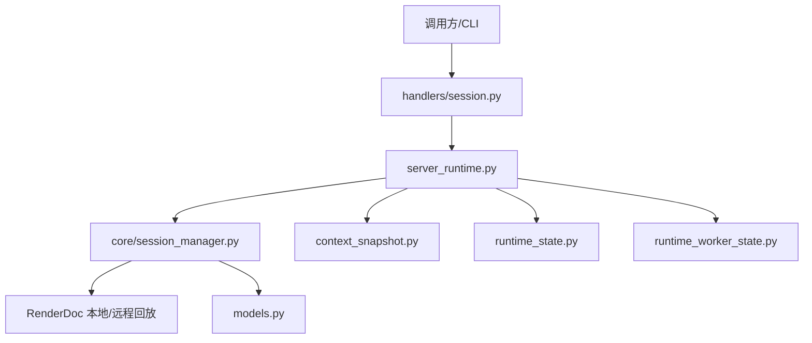
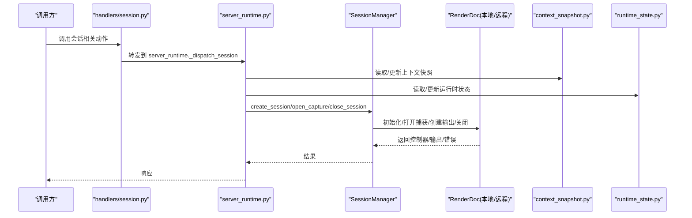
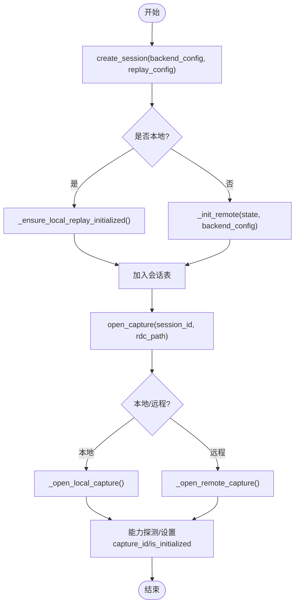
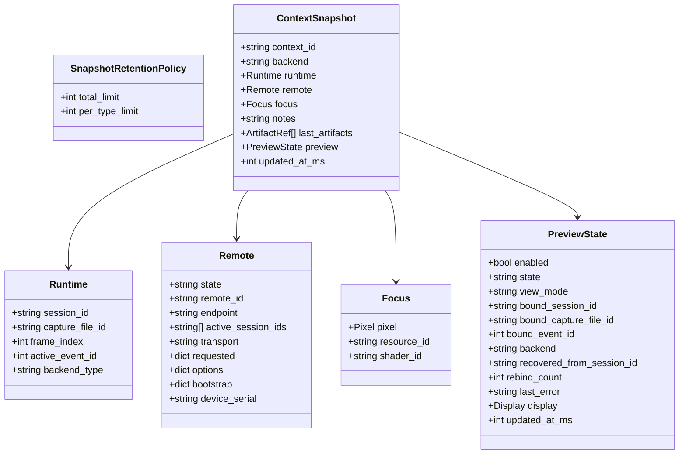
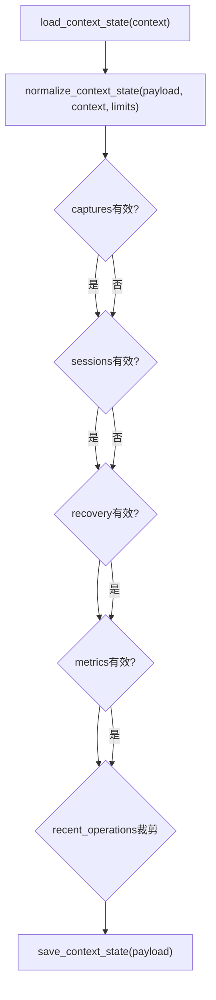
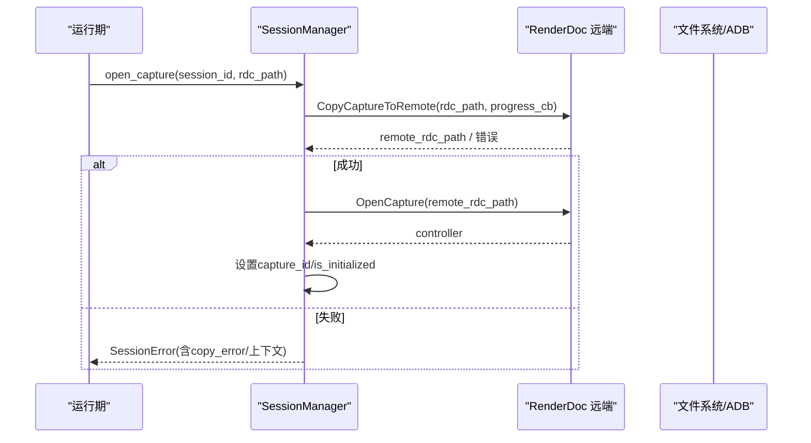
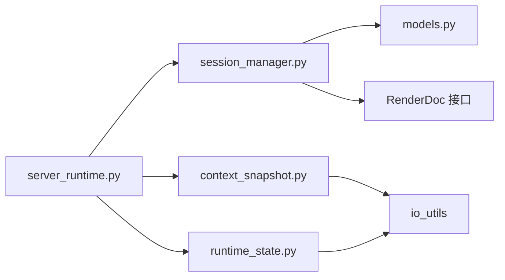

# 会话管理

<cite>
**本文引用的文件**
- [session_manager.py](file://rdx/core/session_manager.py)
- [context_snapshot.py](file://rdx/context_snapshot.py)
- [runtime_state.py](file://rdx/runtime_state.py)
- [models.py](file://rdx/models.py)
- [server_runtime.py](file://rdx/server_runtime.py)
- [handlers/session.py](file://rdx/handlers/session.py)
- [session-model.md](file://docs/session-model.md)
- [runtime_worker_state.py](file://rdx/runtime_worker_state.py)
</cite>

## 目录
1. [简介](#简介)
2. [项目结构](#项目结构)
3. [核心组件](#核心组件)
4. [架构总览](#架构总览)
5. [详细组件分析](#详细组件分析)
6. [依赖关系分析](#依赖关系分析)
7. [性能考虑](#性能考虑)
8. [故障排查指南](#故障排查指南)
9. [结论](#结论)
10. [附录](#附录)

## 简介
本文件围绕回放会话的生命周期管理与状态持久化机制，系统化说明 SessionManager 的设计与实现，涵盖会话创建、打开捕获、切换、销毁与状态同步；阐述上下文快照机制（渲染状态的捕获、序列化与恢复）；解释运行时状态管理（文件句柄、内存资源与 GPU 资源的跟踪）；说明多会话隔离的实现；详述会话恢复与故障恢复（断点续传与状态重建）；给出最佳实践（资源清理与内存优化）；并提供会话监控与调试工具的使用指南。

## 项目结构
与“会话管理”直接相关的代码分布在以下模块：
- 会话生命周期与后端抽象：rdx/core/session_manager.py
- 上下文快照与预览状态：rdx/context_snapshot.py
- 运行时持久化状态与日志：rdx/runtime_state.py
- 数据模型与枚举：rdx/models.py
- 服务层路由与调度：rdx/server_runtime.py
- 会话处理器入口：rdx/handlers/session.py
- 会话模型文档：docs/session-model.md
- Worker 持久化状态：rdx/runtime_worker_state.py

图表来源
- [handlers/session.py:8-13](file://rdx/handlers/session.py#L8-L13)
- [server_runtime.py:1-200](file://rdx/server_runtime.py#L1-L200)
- [session_manager.py:148-569](file://rdx/core/session_manager.py#L148-L569)
- [context_snapshot.py:242-475](file://rdx/context_snapshot.py#L242-L475)
- [runtime_state.py:104-416](file://rdx/runtime_state.py#L104-L416)
- [models.py:128-157](file://rdx/models.py#L128-L157)

章节来源
- [handlers/session.py:8-13](file://rdx/handlers/session.py#L8-L13)
- [server_runtime.py:1-200](file://rdx/server_runtime.py#L1-L200)

## 核心组件
- SessionManager：单例式会话管理器，负责会话创建、打开捕获、关闭会话、获取控制器/输出、能力探测、远端连接与复制、无头输出创建与清理等。
- Context Snapshot：上下文快照，用于跨进程/重启的会话上下文持久化（包含 session_id、frame_index、active_event_id、preview 等），提供规范化、原子写入与并发锁。
- Runtime State：运行时持久化状态，记录当前上下文中的 captures/sessions/recovery/metrics 等，支持加载、保存、最近操作裁剪与日志追加。
- Models：会话能力、会话信息、捕获信息等数据结构定义。
- Server Runtime：服务层，将上层动作分发到具体处理逻辑，并集成上下文快照与运行时状态。
- Handlers/Session：会话相关动作的分发入口，部分动作委托给 replay_observation。

章节来源
- [session_manager.py:118-299](file://rdx/core/session_manager.py#L118-L299)
- [context_snapshot.py:242-475](file://rdx/context_snapshot.py#L242-L475)
- [runtime_state.py:104-416](file://rdx/runtime_state.py#L104-L416)
- [models.py:128-157](file://rdx/models.py#L128-L157)
- [server_runtime.py:1-200](file://rdx/server_runtime.py#L1-L200)
- [handlers/session.py:8-13](file://rdx/handlers/session.py#L8-L13)

## 架构总览
会话管理的整体流程如下：
- 调用方通过 handlers/session.py 进入，内部根据 action 路由到 server_runtime 或 replay_observation。
- server_runtime 负责解析参数、维护上下文、调用 SessionManager 完成会话生命周期操作，并在关键节点读写 context_snapshot 与 runtime_state。
- SessionManager 封装 RenderDoc 本地/远程回放接口，管理控制器、输出、远端连接与资源清理。
- 上下文快照与运行时状态提供跨进程/重启的持久化能力，确保会话可恢复与可观测。

图表来源
- [handlers/session.py:8-13](file://rdx/handlers/session.py#L8-L13)
- [server_runtime.py:1-200](file://rdx/server_runtime.py#L1-L200)
- [session_manager.py:175-251](file://rdx/core/session_manager.py#L175-L251)
- [context_snapshot.py:447-475](file://rdx/context_snapshot.py#L447-L475)
- [runtime_state.py:388-416](file://rdx/runtime_state.py#L388-L416)

## 详细组件分析

### SessionManager：会话生命周期与资源管理
- 设计要点
  - 单例模式：保证全局唯一会话管理器实例，避免重复初始化。
  - 异步锁：使用 asyncio.Lock 保护会话字典与关键路径，防止竞态。
  - 后端抽象：LOCAL/REMOTE 两种后端，统一接口；远程支持 adb_android 传输与通用 CopyCaptureToRemote。
  - 能力探测：打开捕获后查询 API 类型、着色器调试、补丁支持、计数器支持等。
  - 无头输出：为每个会话创建无头窗口输出，尺寸来自 replay_config。
  - 资源清理：按顺序关闭输出、控制器、捕获文件、远端连接，并在无剩余本地会话时关闭回放子系统。

- 关键流程
  - 创建会话：create_session 生成 session_id，初始化本地回放或建立远端连接，记录 capabilities。
  - 打开捕获：open_capture 区分本地/远程，设置 capture_id、rdc_path、is_initialized，填充能力。
  - 关闭会话：close_session 移除状态并执行 _cleanup，释放所有资源。
  - 获取控制器/输出：get_controller/get_output 校验存在性并返回。
  - 列表与会话信息：list_sessions/get_session 暴露只读视图。

图表来源
- [session_manager.py:175-251](file://rdx/core/session_manager.py#L175-L251)
- [session_manager.py:301-440](file://rdx/core/session_manager.py#L301-L440)

章节来源
- [session_manager.py:148-569](file://rdx/core/session_manager.py#L148-L569)

### 上下文快照：渲染状态捕获、序列化与恢复
- 作用
  - 持久化会话上下文（session_id、capture_file_id、frame_index、active_event_id、backend_type、remote 信息、focus、notes、last_artifacts、preview 等）。
  - 提供规范化函数，确保字段类型与取值合法，便于跨版本兼容。
  - 原子写入与并发锁：基于 msvcrt 文件锁与线程锁，保证多进程/多线程安全。
  - 保留策略：对 last_artifacts 进行去重与数量限制，避免无限增长。

- 关键能力
  - load_context_snapshot/save_context_snapshot：读取/保存上下文快照。
  - normalize_context_snapshot/update_user_context/merge_recent_artifacts：规范化与增量更新。
  - default_preview_state/normalize_preview_display_state：预览几何与显示状态标准化。

图表来源
- [context_snapshot.py:39-171](file://rdx/context_snapshot.py#L39-L171)
- [context_snapshot.py:242-475](file://rdx/context_snapshot.py#L242-L475)

章节来源
- [context_snapshot.py:18-171](file://rdx/context_snapshot.py#L18-L171)
- [context_snapshot.py:242-475](file://rdx/context_snapshot.py#L242-L475)

### 运行时状态：文件句柄、内存资源与GPU资源跟踪
- 作用
  - 持久化当前上下文的 captures/sessions/recovery/metrics/recent_operations 等。
  - 提供默认限制（最大上下文数、每上下文会话数、捕获文件大小、估计回放内存等）。
  - 规范化与裁剪：对 sessions/captures/recent_operations 进行规范化与长度限制，避免状态膨胀。
  - 日志追加：append_runtime_log/read_runtime_logs 支持按时间过滤读取。

- 资源跟踪
  - captures：记录捕获文件句柄（路径、只读、驱动、大小、指纹、恢复状态等）。
  - sessions：记录会话句柄（session_id、capture_file_id、frame_index、active_event_id、后端类型、状态、错误、着色器替换、远端信息、恢复信息）。
  - metrics：统计操作次数、错误次数、恢复尝试/成功/失败、拒绝次数、活跃会话/捕获/操作计数、最近操作耗时分布。

图表来源
- [runtime_state.py:104-149](file://rdx/runtime_state.py#L104-L149)
- [runtime_state.py:293-385](file://rdx/runtime_state.py#L293-L385)
- [runtime_state.py:388-416](file://rdx/runtime_state.py#L388-L416)

章节来源
- [runtime_state.py:104-416](file://rdx/runtime_state.py#L104-L416)

### 多会话隔离：状态独立性保障
- 会话级隔离
  - SessionManager 以 session_id 为键维护独立 SessionState，包含 controller/output/capture_file/remote_server 等。
  - 每个会话拥有独立的回放控制器与输出，避免共享状态污染。
- 上下文级隔离
  - context_snapshot 与 runtime_state 支持按 context_id 隔离（default 与自定义上下文），文件命名带上下文标识。
  - 通过 normalize_context_id/_sanitize_context 确保上下文 ID 安全与稳定。
- 远端会话隔离
  - 远端连接在 SessionState 中记录 host/port/transport/bootstrap/device_serial，避免跨会话复用导致冲突。
  - 远端捕获复制与打开过程在会话内完成，失败时清理临时路径并抛出明确错误。

章节来源
- [session_manager.py:118-299](file://rdx/core/session_manager.py#L118-L299)
- [context_snapshot.py:184-220](file://rdx/context_snapshot.py#L184-L220)
- [runtime_state.py:41-56](file://rdx/runtime_state.py#L41-L56)

### 会话恢复与故障恢复：断点续传与状态重建
- 断点续传
  - 远端 Android 场景：使用 ADB 推送 .rdc 到设备，计算 SHA256 校验，若已存在且一致则复用，否则新建并登记所有权；失败时清理。
  - 通用远端场景：CopyCaptureToRemote 回调进度，成功后 OpenCapture；失败时抛出明确错误并附带上下文信息。
- 状态重建
  - runtime_state.recovery 记录扫描/尝试/成功/错误等信息，支持识别 recovered/degraded/deferred 会话。
  - context_snapshot 记录 session_id/frame_index/active_event_id，结合 runtime_state 的 sessions 表，可在重启后重建回放位置。
- 故障处理
  - SessionError 携带 code/message/details，便于上层分类与提示修复建议。
  - 清理阶段收集错误并记录日志，确保即使部分步骤失败也能尽量释放资源。

图表来源
- [session_manager.py:373-440](file://rdx/core/session_manager.py#L373-L440)
- [session_manager.py:442-507](file://rdx/core/session_manager.py#L442-L507)

章节来源
- [session_manager.py:373-507](file://rdx/core/session_manager.py#L373-L507)
- [runtime_state.py:119-149](file://rdx/runtime_state.py#L119-L149)

### 最佳实践：资源清理与内存优化
- 资源清理
  - 始终通过 close_session 释放控制器、输出、捕获文件与远端连接；避免手动持有原生句柄。
  - 本地回放子系统在无剩余本地会话时自动关闭，减少全局资源占用。
  - 远端捕获复制失败时及时清理临时路径，避免设备空间泄漏。
- 内存优化
  - 使用 replay_config.width/height 控制无头输出尺寸，避免过大纹理占用内存。
  - 合理设置 SnapshotRetentionPolicy.total_limit/per_type_limit，限制 last_artifacts 规模。
  - 使用 runtime_state.limits 控制 max_estimated_replay_memory_bytes 与 replay_memory_multiplier，预估回放内存上限。
- 并发与锁
  - 利用 SessionManager._lock 与上下文快照/运行时状态的锁机制，避免竞态与损坏。
  - 长耗时操作通过 _offload 在 executor 中执行，保持事件循环响应。

章节来源
- [session_manager.py:509-569](file://rdx/core/session_manager.py#L509-L569)
- [context_snapshot.py:39-47](file://rdx/context_snapshot.py#L39-L47)
- [runtime_state.py:92-101](file://rdx/runtime_state.py#L92-L101)

### 会话监控与调试工具
- 运行时日志
  - append_runtime_log/read_runtime_logs：追加与读取 JSONL 格式的运行日志，支持 since_ms 过滤与 max_lines 限制。
  - summarize_operation_durations：统计最近操作耗时分布（平均、P95、最大）。
- 上下文快照
  - load_context_snapshot/save_context_snapshot：查看/更新上下文快照，包括 session_id、frame_index、active_event_id、preview 等。
  - update_user_context/merge_recent_artifacts：用户侧更新 notes/focus/artifacts，便于问题定位。
- 会话能力与状态
  - get_session/list_sessions：获取会话能力与基本信息。
  - runtime_state.metrics：统计操作/错误/恢复/拒绝计数与活跃资源数量。

章节来源
- [runtime_state.py:448-500](file://rdx/runtime_state.py#L448-L500)
- [context_snapshot.py:447-541](file://rdx/context_snapshot.py#L447-L541)
- [session_manager.py:275-293](file://rdx/core/session_manager.py#L275-L293)

## 依赖关系分析
- 模块耦合
  - server_runtime 依赖 SessionManager、context_snapshot、runtime_state，承担调度与状态协调职责。
  - SessionManager 依赖 models（SessionInfo/CaptureInfo/SessionCapabilities）、renderdoc_status（错误详情构建）。
  - context_snapshot 与 runtime_state 均依赖 io_utils 的原子写入与路径工具。
- 外部依赖
  - RenderDoc 本地/远程回放接口（OpenCaptureFile/OpenCapture/CreateHeadlessWindowingData/CreateOutput 等）。
  - ADB 子进程调用（Android 远端场景）。
- 潜在循环依赖
  - 当前结构清晰分层，未见明显循环依赖；server_runtime 作为顶层编排者，不反向被底层模块导入。

图表来源
- [server_runtime.py:1-200](file://rdx/server_runtime.py#L1-L200)
- [session_manager.py:148-299](file://rdx/core/session_manager.py#L148-L299)
- [context_snapshot.py:242-475](file://rdx/context_snapshot.py#L242-L475)
- [runtime_state.py:104-416](file://rdx/runtime_state.py#L104-L416)

章节来源
- [server_runtime.py:1-200](file://rdx/server_runtime.py#L1-L200)
- [session_manager.py:148-299](file://rdx/core/session_manager.py#L148-L299)

## 性能考虑
- 无头输出尺寸：replay_config.width/height 直接影响显存与内存占用，应根据目标设备与展示需求合理设置。
- 远端传输：CopyCaptureToRemote 与 ADB push 可能耗时较长，应配合进度回调与超时策略，避免阻塞主循环。
- 状态裁剪：last_artifacts 与 recent_operations 需设置合理上限，避免状态文件膨胀影响加载性能。
- 回放子系统：仅在必要时初始化/关闭本地回放，减少全局开销。

[本节为通用指导，无需特定文件引用]

## 故障排查指南
- 常见错误码
  - session_conflict：会话 ID 冲突，检查是否重复创建。
  - capture_already_open：同一会话重复打开捕获，应先关闭再打开。
  - controller_missing/output_missing：会话未正确初始化或已销毁，检查生命周期。
  - remote_endpoint_required：远端配置缺少 host，补充配置。
  - no_remote_server：远端会话无活动连接，先建立连接。
  - remote_capture_copy_failed：远端复制失败，检查网络/设备可达性与权限。
- 错误详情
  - SessionError.detail 包含 code/message/details，details 中通常包含 source_layer、operation、classification、fix_hint 等，便于定位与修复。
- 清理与恢复
  - 若清理阶段出现异常，会记录警告日志；检查 output.Shutdown/controller.Shutdown/capture_file.CloseFile/remote.ShutdownConnection 是否成功。
  - 使用 runtime_state.recovery 与 context_snapshot 检查恢复状态与上下文一致性。

章节来源
- [session_manager.py:91-116](file://rdx/core/session_manager.py#L91-L116)
- [session_manager.py:517-569](file://rdx/core/session_manager.py#L517-L569)
- [runtime_state.py:119-149](file://rdx/runtime_state.py#L119-L149)

## 结论
本系统通过 SessionManager 统一管理回放会话的生命周期，结合上下文快照与运行时状态实现跨进程/重启的持久化与恢复；通过严格的资源清理与并发锁保障稳定性；通过远端复制与 ADB 校验提升可靠性；通过监控与日志工具辅助问题定位。遵循本文的最佳实践可有效降低资源泄漏风险、提升性能与可维护性。

[本节为总结，无需特定文件引用]

## 附录
- 会话模型参考：docs/session-model.md 提供了回放生命周期、预览状态、观察导出、Android 助手生命周期、临时回放读取等高层约定。
- Worker 状态：runtime_worker_state.py 提供 worker 级别的持久化状态存取，便于 daemon 管理 worker 生命周期。

章节来源
- [session-model.md:11-82](file://docs/session-model.md#L11-L82)
- [runtime_worker_state.py:19-56](file://rdx/runtime_worker_state.py#L19-L56)