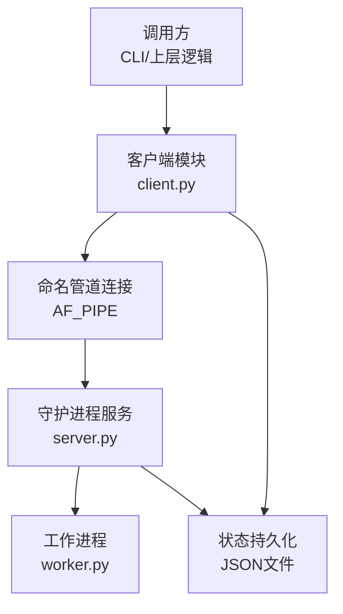
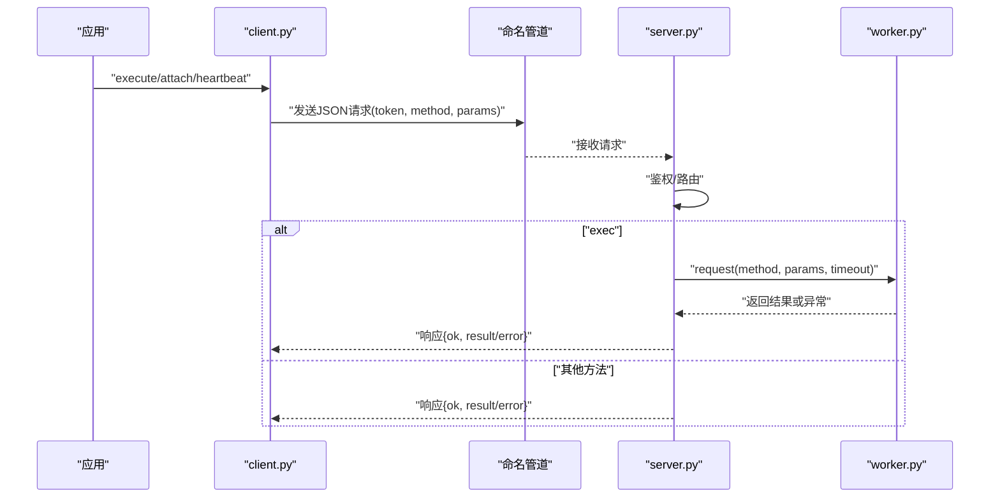
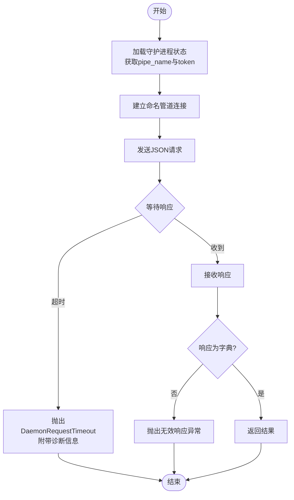
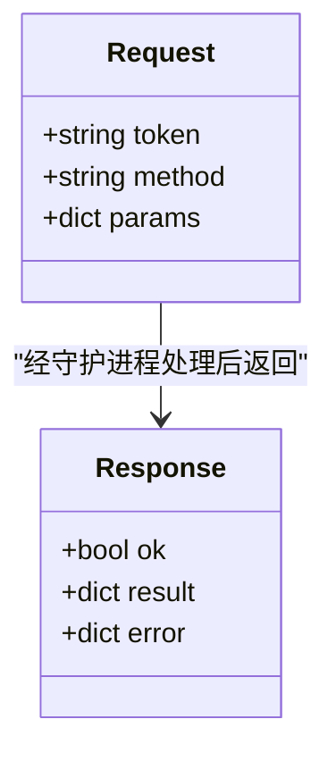
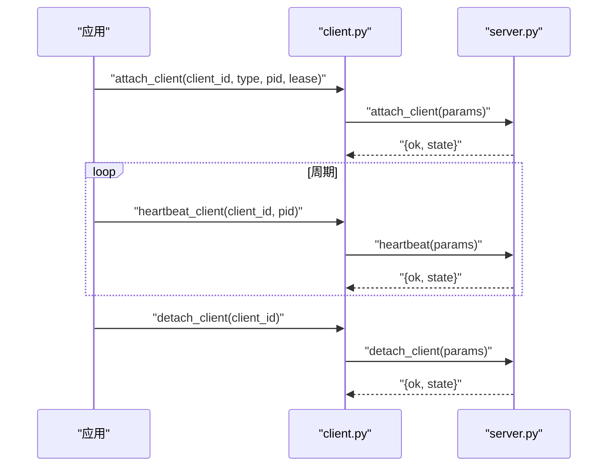
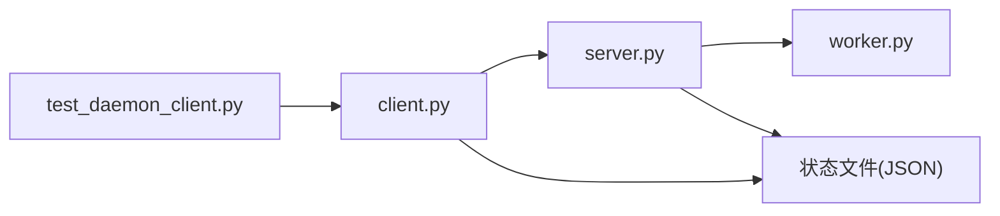

# 守护进程客户端

<cite>
**本文引用的文件**
- [rdx/daemon/client.py](file://rdx/daemon/client.py)
- [rdx/daemon/server.py](file://rdx/daemon/server.py)
- [rdx/daemon/worker.py](file://rdx/daemon/worker.py)
- [rdx/config.py](file://rdx/config.py)
- [tests/test_daemon_client.py](file://tests/test_daemon_client.py)
</cite>

## 目录
1. [简介](#简介)
2. [项目结构](#项目结构)
3. [核心组件](#核心组件)
4. [架构总览](#架构总览)
5. [详细组件分析](#详细组件分析)
6. [依赖关系分析](#依赖关系分析)
7. [性能考量](#性能考量)
8. [故障排除指南](#故障排除指南)
9. [结论](#结论)
10. [附录：API参考与配置](#附录api参考与配置)

## 简介
本文件面向“守护进程客户端”的实现，重点解释如何通过命名管道与守护进程通信，涵盖连接管理、消息序列化协议、同步/异步调用模式、会话管理（附加、心跳、分离）、错误处理与重试策略、以及完整的客户端API与配置说明。文档以代码为依据，提供可追溯的源码路径与图示，帮助读者快速理解并正确使用该客户端。

## 项目结构
围绕守护进程客户端的关键代码位于以下模块：
- 客户端实现：rdx/daemon/client.py
- 守护进程服务：rdx/daemon/server.py
- 工作进程生命周期：rdx/daemon/worker.py
- 全局配置与环境变量：rdx/config.py
- 客户端行为测试：tests/test_daemon_client.py

图表来源
- [rdx/daemon/client.py:467-515](file://rdx/daemon/client.py#L467-L515)
- [rdx/daemon/server.py:572-643](file://rdx/daemon/server.py#L572-L643)
- [rdx/daemon/worker.py:144-170](file://rdx/daemon/worker.py#L144-L170)

章节来源
- [rdx/daemon/client.py:1-902](file://rdx/daemon/client.py#L1-L902)
- [rdx/daemon/server.py:1-728](file://rdx/daemon/server.py#L1-L728)
- [rdx/daemon/worker.py:1-203](file://rdx/daemon/worker.py#L1-L203)
- [rdx/config.py:1-186](file://rdx/config.py#L1-L186)
- [tests/test_daemon_client.py:1-460](file://tests/test_daemon_client.py#L1-L460)

## 核心组件
- NamedPipeClient（通过 client.py 中的 daemon_request 等函数封装）：负责命名管道连接建立、请求发送与响应接收、超时控制、诊断信息收集。
- 守护进程服务端（server.py 中的 DaemonRuntime）：监听命名管道、鉴权、路由方法、维护会话与会话清理、转发执行到工作进程。
- 工作进程（worker.py 中的 RuntimeWorkerProcess）：独立子进程，承载实际运行时任务，通过标准输入输出进行JSON行协议通信。
- 状态与上下文管理：client.py 中提供状态文件的读写、上下文隔离、清理与回收逻辑；server.py 中维护守护进程状态快照与存活检查。

章节来源
- [rdx/daemon/client.py:467-515](file://rdx/daemon/client.py#L467-L515)
- [rdx/daemon/server.py:102-176](file://rdx/daemon/server.py#L102-L176)
- [rdx/daemon/worker.py:24-170](file://rdx/daemon/worker.py#L24-L170)

## 架构总览
客户端与服务端通过Windows命名管道进行单请求-单响应的RPC式通信。每次请求包含token鉴权、method与params。服务端根据method分发到具体处理器，部分操作会委派给工作进程执行。守护进程在后台线程中监控生命周期，基于租约与空闲超时自动退出。

图表来源
- [rdx/daemon/client.py:467-515](file://rdx/daemon/client.py#L467-L515)
- [rdx/daemon/server.py:572-643](file://rdx/daemon/server.py#L572-L643)
- [rdx/daemon/worker.py:144-170](file://rdx/daemon/worker.py#L144-L170)

## 详细组件分析

### 连接管理机制（NamedPipeClient）
- 连接建立：使用 multiprocessing.connection.Client 以 AF_PIPE 连接到 \\.\pipe\<pipe_name>。
- 请求封装：将 token、method、params 序列化为字典并通过 send 发送。
- 响应等待：poll轮询等待响应，支持超时；若超时则抛出结构化异常并附带诊断信息。
- 资源释放：finally块确保连接关闭。

图表来源
- [rdx/daemon/client.py:467-515](file://rdx/daemon/client.py#L467-L515)

章节来源
- [rdx/daemon/client.py:467-515](file://rdx/daemon/client.py#L467-L515)

### 重连策略与连接池管理
- 重连策略：当前实现未内置自动重连；每次调用都会新建连接并在完成后关闭。可通过上层循环实现重试。
- 连接池：未实现连接池；每次请求创建新连接，避免长连接带来的状态复杂性与资源泄漏风险。
- 建议：在高并发场景下，可在调用层实现有限数量的连接复用与队列限流，但需自行处理异常与超时。

章节来源
- [rdx/daemon/client.py:467-515](file://rdx/daemon/client.py#L467-L515)

### 消息序列化协议
- 格式：JSON字典，包含字段 token、method、params。
- 解析：服务端 handle_request 对请求进行校验与鉴权，再按method分派。
- 响应：统一返回 {ok, result} 或 {ok, error} 的结构，便于上层判断成功与失败。

图表来源
- [rdx/daemon/server.py:572-643](file://rdx/daemon/server.py#L572-L643)

章节来源
- [rdx/daemon/server.py:572-643](file://rdx/daemon/server.py#L572-L643)

### 同步与异步调用模式
- 同步阻塞：daemon_request 默认阻塞等待响应，支持超时；适合简单调用流程。
- 非阻塞/异步：当前未提供协程接口；可在调用层使用线程或事件循环包装，实现非阻塞调用。
- 工作进程通信：worker.py 使用标准输入输出行协议，通过队列读取响应，内部有超时控制。

章节来源
- [rdx/daemon/client.py:467-515](file://rdx/daemon/client.py#L467-L515)
- [rdx/daemon/worker.py:144-170](file://rdx/daemon/worker.py#L144-L170)

### 会话管理（附加、心跳、分离）
- 附加 attach_client：向守护进程注册客户端标识、类型、PID与租约时间，用于后续心跳与清理。
- 心跳 heartbeat_client：周期性更新 last_heartbeat_at，防止被判定为不活跃而清理。
- 分离 detach_client：从守护进程的已附加客户端列表中移除。
- 服务端清理：守护进程定期修剪不活跃的客户端，依据租约与心跳时间。

图表来源
- [rdx/daemon/client.py:754-834](file://rdx/daemon/client.py#L754-L834)
- [rdx/daemon/server.py:376-450](file://rdx/daemon/server.py#L376-L450)

章节来源
- [rdx/daemon/client.py:754-834](file://rdx/daemon/client.py#L754-L834)
- [rdx/daemon/server.py:376-450](file://rdx/daemon/server.py#L376-L450)

### 错误处理与重试策略
- 超时处理：daemon_request 在等待响应超时时抛出 DaemonRequestTimeout，包含 operation、context_id、timeout_seconds、active_request_count、active_operation 摘要等信息，便于定位问题。
- 网络异常：连接或收发异常会被捕获并转换为结构化错误；服务端也会返回 {ok: false, error}。
- 自动恢复：ensure_daemon 会在检测到守护进程不存在或不可用时尝试启动；cleanup_stale_daemon_states 会清理僵尸状态并终止残留进程。
- 重试建议：上层可根据错误码与详情决定重试次数与退避策略。

章节来源
- [rdx/daemon/client.py:31-37](file://rdx/daemon/client.py#L31-L37)
- [rdx/daemon/client.py:467-515](file://rdx/daemon/client.py#L467-L515)
- [rdx/daemon/client.py:554-607](file://rdx/daemon/client.py#L554-L607)
- [rdx/daemon/server.py:572-643](file://rdx/daemon/server.py#L572-L643)

### 完整客户端API参考
以下为常用API及其用途与示例路径（不包含具体代码内容）：
- execute / exec：执行操作，参数包含 operation 与 args，支持 transport 与 remote 标记。
  - 参考路径：[rdx/daemon/client.py:467-515](file://rdx/daemon/client.py#L467-L515)
- attach：附加客户端，参数包含 client_id、client_type、pid、lease_timeout_seconds。
  - 参考路径：[rdx/daemon/client.py:754-789](file://rdx/daemon/client.py#L754-L789)
- heartbeat：心跳保持，参数包含 client_id、pid。
  - 参考路径：[rdx/daemon/client.py:792-812](file://rdx/daemon/client.py#L792-L812)
- detach：分离客户端，参数包含 client_id。
  - 参考路径：[rdx/daemon/client.py:815-834](file://rdx/daemon/client.py#L815-L834)
- clear_context：清理上下文，无守护进程时直接清理本地状态。
  - 参考路径：[rdx/daemon/client.py:837-871](file://rdx/daemon/client.py#L837-L871)
- stop_daemon：停止守护进程与工作进程，清理状态。
  - 参考路径：[rdx/daemon/client.py:874-902](file://rdx/daemon/client.py#L874-L902)
- ensure_daemon/start_daemon：确保守护进程运行，必要时启动并等待就绪。
  - 参考路径：[rdx/daemon/client.py:623-733](file://rdx/daemon/client.py#L623-L733)

章节来源
- [rdx/daemon/client.py:467-902](file://rdx/daemon/client.py#L467-L902)

### 配置选项与环境变量
- 守护进程启动参数：pipe_name、token、daemon_context、owner_pid、lease_timeout_seconds、idle_timeout_seconds。
  - 参考路径：[rdx/daemon/client.py:665-681](file://rdx/daemon/client.py#L665-L681)
- 环境变量影响：
  - RDX_TOOLS_ROOT：设置Python路径前缀，便于导入工具模块。
  - RDX_CONTEXT_ID、RDX_DAEMON_PID、RDX_RUNTIME_DLL_DIR、RDX_RENDERDOC_PATH、RDX_WORKER_SOURCE_MANIFEST：工作进程环境。
  - 其他配置项（如日志级别、GPU厂商、存储路径等）在 config.py 中定义。
  - 参考路径：[rdx/daemon/worker.py:78-89](file://rdx/daemon/worker.py#L78-L89)
  - 参考路径：[rdx/config.py:135-185](file://rdx/config.py#L135-L185)

章节来源
- [rdx/daemon/client.py:665-681](file://rdx/daemon/client.py#L665-L681)
- [rdx/daemon/worker.py:78-89](file://rdx/daemon/worker.py#L78-L89)
- [rdx/config.py:135-185](file://rdx/config.py#L135-L185)

## 依赖关系分析
- client.py 依赖 server.py 的常量与工具函数（如 DEFAULT_LEASE_TIMEOUT_S、DEFAULT_IDLE_TIMEOUT_S）。
- server.py 依赖 worker.py 的工作进程管理与状态快照。
- 状态文件由 client.py 与 server.py 共同读写，保证一致性。
- 测试覆盖关键行为：上下文隔离、清理、停止、超时诊断等。

图表来源
- [rdx/daemon/client.py:1-902](file://rdx/daemon/client.py#L1-L902)
- [rdx/daemon/server.py:1-728](file://rdx/daemon/server.py#L1-L728)
- [rdx/daemon/worker.py:1-203](file://rdx/daemon/worker.py#L1-L203)
- [tests/test_daemon_client.py:1-460](file://tests/test_daemon_client.py#L1-L460)

章节来源
- [rdx/daemon/client.py:1-902](file://rdx/daemon/client.py#L1-L902)
- [rdx/daemon/server.py:1-728](file://rdx/daemon/server.py#L1-L728)
- [rdx/daemon/worker.py:1-203](file://rdx/daemon/worker.py#L1-L203)
- [tests/test_daemon_client.py:1-460](file://tests/test_daemon_client.py#L1-L460)

## 性能考量
- 连接开销：每次请求新建命名管道连接，适用于低频调用；高频场景建议在调用层实现连接复用。
- 超时与轮询：daemon_request 使用 poll(0.1) 轮询，降低CPU占用；合理设置超时以避免长时间阻塞。
- 工作进程限制：worker_exec_timeout_s 根据操作动态计算超时，避免长时间占用资源。
- 状态持久化：原子写入状态文件，减少竞争与损坏风险。

章节来源
- [rdx/daemon/client.py:467-515](file://rdx/daemon/client.py#L467-L515)
- [rdx/daemon/server.py:358-374](file://rdx/daemon/server.py#L358-L374)

## 故障排除指南
- 常见错误与定位：
  - 超时：DaemonRequestTimeout 包含 operation、context_id、timeout_seconds、active_request_count、active_operation 摘要，便于定位卡住的操作。
    - 参考路径：[rdx/daemon/client.py:467-515](file://rdx/daemon/client.py#L467-L515)
  - 未授权：token不匹配导致 unauthorized。
    - 参考路径：[rdx/daemon/server.py:166-169](file://rdx/daemon/server.py#L166-L169)
  - 未知方法：unknown_method。
    - 参考路径：[rdx/daemon/server.py:643-643](file://rdx/daemon/server.py#L643-L643)
  - 工作进程错误：worker_error，包含异常消息。
    - 参考路径：[rdx/daemon/server.py:480-483](file://rdx/daemon/server.py#L480-L483)
- 自动恢复：
  - cleanup_stale_daemon_states 清理僵尸状态并终止残留进程。
    - 参考路径：[rdx/daemon/client.py:554-607](file://rdx/daemon/client.py#L554-L607)
  - ensure_daemon 检测守护进程是否运行，必要时启动并等待就绪。
    - 参考路径：[rdx/daemon/client.py:623-733](file://rdx/daemon/client.py#L623-L733)
- 调试建议：
  - 检查状态文件内容与 active_operation 摘要。
  - 确认守护进程与工作者进程是否存活。
  - 调整超时与租约参数以适应不同负载。

章节来源
- [rdx/daemon/client.py:554-607](file://rdx/daemon/client.py#L554-L607)
- [rdx/daemon/client.py:623-733](file://rdx/daemon/client.py#L623-L733)
- [rdx/daemon/server.py:166-169](file://rdx/daemon/server.py#L166-L169)
- [rdx/daemon/server.py:480-483](file://rdx/daemon/server.py#L480-L483)
- [rdx/daemon/server.py:643-643](file://rdx/daemon/server.py#L643-L643)

## 结论
守护进程客户端通过命名管道实现了稳定可靠的进程间通信，具备完善的鉴权、会话管理、超时与错误处理机制。结合守护进程的生命周期监控与工作进程隔离，能够支撑复杂的运行时操作。建议在高频调用场景中引入连接复用与重试策略，并根据业务需求调整超时与租约参数以获得最佳性能与稳定性。

## 附录：API参考与配置
- API方法：
  - execute/exec：执行操作，参数包含 operation、args、transport、remote。
    - 参考路径：[rdx/daemon/client.py:467-515](file://rdx/daemon/client.py#L467-L515)
  - attach：附加客户端，参数包含 client_id、client_type、pid、lease_timeout_seconds。
    - 参考路径：[rdx/daemon/client.py:754-789](file://rdx/daemon/client.py#L754-L789)
  - heartbeat：心跳保持，参数包含 client_id、pid。
    - 参考路径：[rdx/daemon/client.py:792-812](file://rdx/daemon/client.py#L792-L812)
  - detach：分离客户端，参数包含 client_id。
    - 参考路径：[rdx/daemon/client.py:815-834](file://rdx/daemon/client.py#L815-L834)
  - clear_context：清理上下文。
    - 参考路径：[rdx/daemon/client.py:837-871](file://rdx/daemon/client.py#L837-L871)
  - stop_daemon：停止守护进程与工作进程。
    - 参考路径：[rdx/daemon/client.py:874-902](file://rdx/daemon/client.py#L874-L902)
  - ensure_daemon/start_daemon：确保守护进程运行。
    - 参考路径：[rdx/daemon/client.py:623-733](file://rdx/daemon/client.py#L623-L733)
- 配置与环境变量：
  - 守护进程参数：pipe_name、token、daemon_context、owner_pid、lease_timeout_seconds、idle_timeout_seconds。
    - 参考路径：[rdx/daemon/client.py:665-681](file://rdx/daemon/client.py#L665-L681)
  - 环境变量：RDX_TOOLS_ROOT、RDX_CONTEXT_ID、RDX_DAEMON_PID、RDX_RUNTIME_DLL_DIR、RDX_RENDERDOC_PATH、RDX_WORKER_SOURCE_MANIFEST。
    - 参考路径：[rdx/daemon/worker.py:78-89](file://rdx/daemon/worker.py#L78-L89)
  - 其他配置项（日志级别、GPU厂商、存储路径等）。
    - 参考路径：[rdx/config.py:135-185](file://rdx/config.py#L135-L185)

章节来源
- [rdx/daemon/client.py:467-902](file://rdx/daemon/client.py#L467-L902)
- [rdx/daemon/worker.py:78-89](file://rdx/daemon/worker.py#L78-L89)
- [rdx/config.py:135-185](file://rdx/config.py#L135-L185)