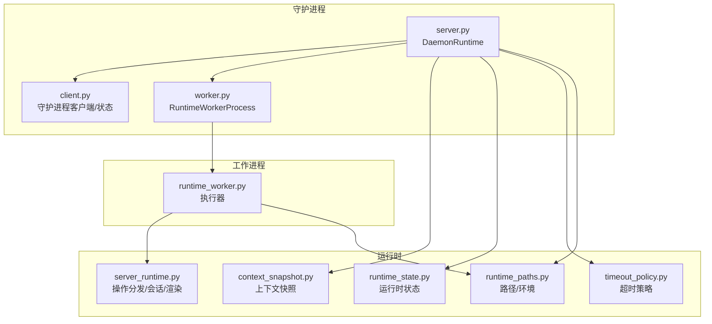
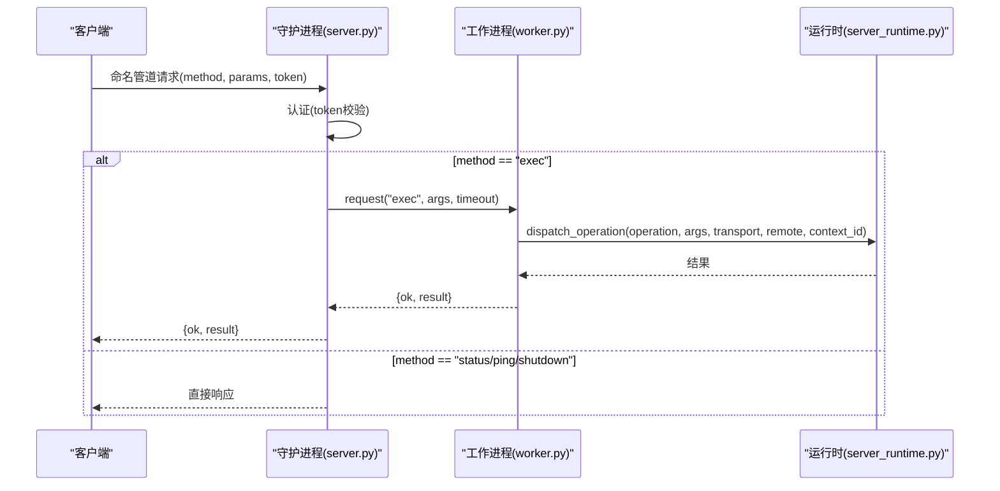
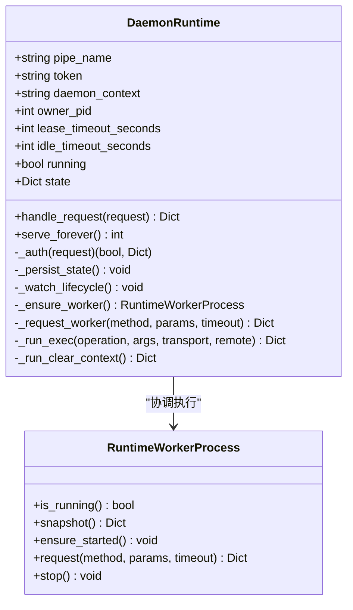
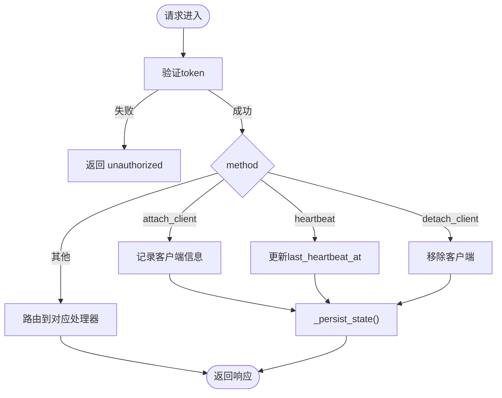
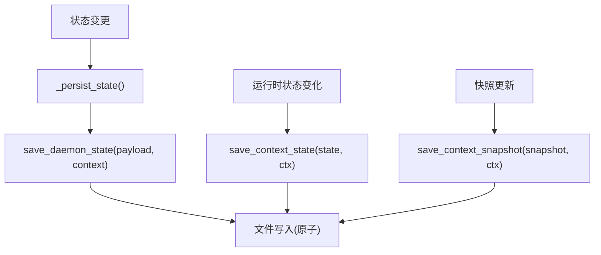
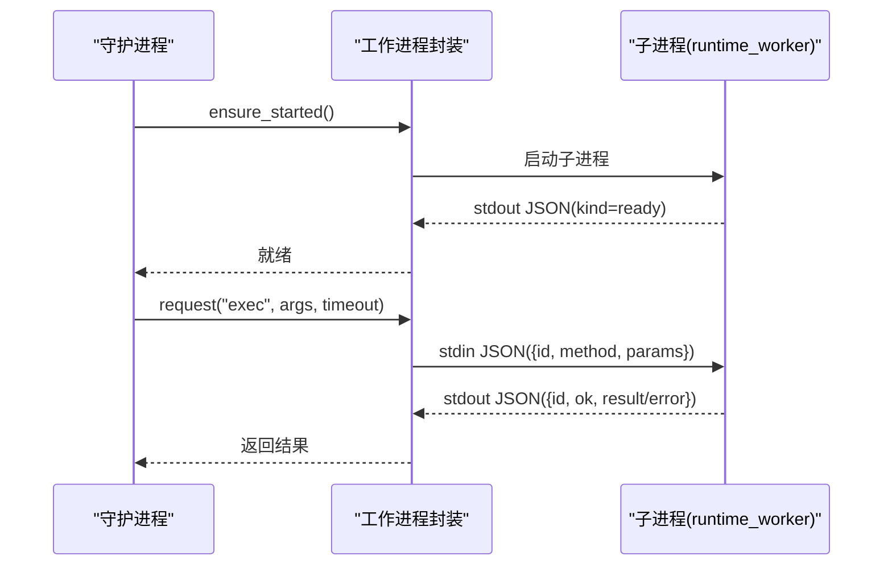
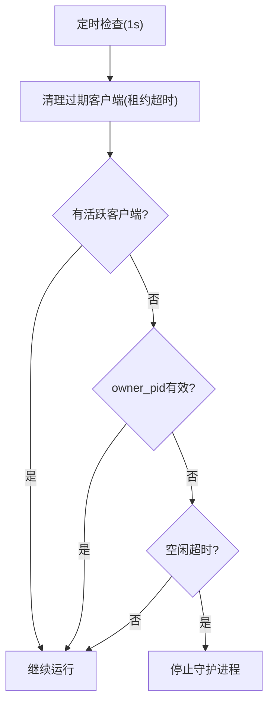
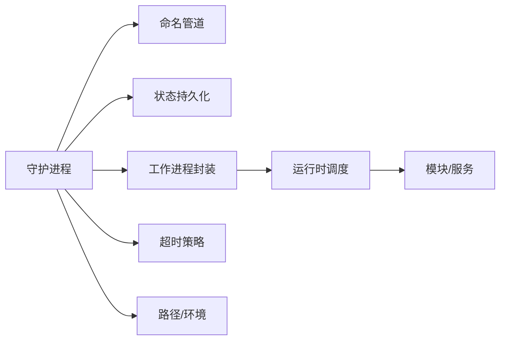

# 守护进程服务器

<cite>
**本文引用的文件**
- [rdx/daemon/server.py](file://rdx/daemon/server.py)
- [rdx/daemon/client.py](file://rdx/daemon/client.py)
- [rdx/daemon/worker.py](file://rdx/daemon/worker.py)
- [rdx/runtime_worker.py](file://rdx/runtime_worker.py)
- [rdx/context_snapshot.py](file://rdx/context_snapshot.py)
- [rdx/runtime_state.py](file://rdx/runtime_state.py)
- [rdx/timeout_policy.py](file://rdx/timeout_policy.py)
- [rdx/server_runtime.py](file://rdx/server_runtime.py)
- [rdx/runtime_paths.py](file://rdx/runtime_paths.py)
</cite>

## 目录
1. [简介](#简介)
2. [项目结构](#项目结构)
3. [核心组件](#核心组件)
4. [架构总览](#架构总览)
5. [详细组件分析](#详细组件分析)
6. [依赖关系分析](#依赖关系分析)
7. [性能与超时控制](#性能与超时控制)
8. [故障排查指南](#故障排查指南)
9. [结论](#结论)
10. [附录：API方法参考](#附录api方法参考)

## 简介
本文件面向守护进程服务器的实现，重点解释基于Windows命名管道的服务机制、DaemonRuntime类的架构设计（监听、请求处理循环、生命周期管理）、认证与客户端连接管理、状态持久化（上下文快照保存与恢复）、工作进程管理（进程池创建、任务分发、资源清理）、超时控制策略（租约超时、空闲超时、所有者丢失检测），以及完整的API方法参考（ping、status、exec等）和错误处理与异常恢复机制。同时提供性能监控与调试工具的使用说明。

## 项目结构
守护进程相关代码主要分布在以下模块：
- 守护进程服务端：rdx/daemon/server.py
- 守护进程客户端与状态管理：rdx/daemon/client.py
- 工作进程封装：rdx/daemon/worker.py
- 工作进程实际执行器：rdx/runtime_worker.py
- 上下文快照与运行时状态：rdx/context_snapshot.py、rdx/runtime_state.py
- 超时策略：rdx/timeout_policy.py
- 运行时调度与服务：rdx/server_runtime.py
- 路径与环境：rdx/runtime_paths.py

图表来源
- [rdx/daemon/server.py:102-690](file://rdx/daemon/server.py#L102-L690)
- [rdx/daemon/client.py:467-733](file://rdx/daemon/client.py#L467-L733)
- [rdx/daemon/worker.py:24-203](file://rdx/daemon/worker.py#L24-L203)
- [rdx/runtime_worker.py:65-167](file://rdx/runtime_worker.py#L65-L167)
- [rdx/context_snapshot.py:214-475](file://rdx/context_snapshot.py#L214-L475)
- [rdx/runtime_state.py:388-416](file://rdx/runtime_state.py#L388-L416)
- [rdx/timeout_policy.py:56-104](file://rdx/timeout_policy.py#L56-L104)
- [rdx/runtime_paths.py:60-123](file://rdx/runtime_paths.py#L60-L123)

章节来源
- [rdx/daemon/server.py:102-690](file://rdx/daemon/server.py#L102-L690)
- [rdx/daemon/client.py:467-733](file://rdx/daemon/client.py#L467-L733)
- [rdx/daemon/worker.py:24-203](file://rdx/daemon/worker.py#L24-L203)
- [rdx/runtime_worker.py:65-167](file://rdx/runtime_worker.py#L65-L167)
- [rdx/context_snapshot.py:214-475](file://rdx/context_snapshot.py#L214-L475)
- [rdx/runtime_state.py:388-416](file://rdx/runtime_state.py#L388-L416)
- [rdx/timeout_policy.py:56-104](file://rdx/timeout_policy.py#L56-L104)
- [rdx/runtime_paths.py:60-123](file://rdx/runtime_paths.py#L60-L123)

## 核心组件
- DaemonRuntime：守护进程主类，负责命名管道监听、请求路由、认证、状态持久化、工作进程协调、生命周期监控。
- RuntimeWorkerProcess：工作进程封装，负责启动/停止子进程、请求转发、就绪等待、状态持久化。
- runtime_worker：工作进程执行器，接收JSON命令并调用server_runtime的dispatch_operation执行具体操作。
- context_snapshot/runtime_state：上下文快照与运行时状态的持久化与规范化，支持多上下文隔离。
- timeout_policy：按操作类型计算超时时间，区分重/极重操作。
- server_runtime：运行时调度中心，注册并分发各类操作，维护会话、捕获、远程连接等。

章节来源
- [rdx/daemon/server.py:102-690](file://rdx/daemon/server.py#L102-L690)
- [rdx/daemon/worker.py:24-203](file://rdx/daemon/worker.py#L24-L203)
- [rdx/runtime_worker.py:65-167](file://rdx/runtime_worker.py#L65-L167)
- [rdx/context_snapshot.py:214-475](file://rdx/context_snapshot.py#L214-L475)
- [rdx/runtime_state.py:388-416](file://rdx/runtime_state.py#L388-L416)
- [rdx/timeout_policy.py:56-104](file://rdx/timeout_policy.py#L56-L104)
- [rdx/server_runtime.py:1-120](file://rdx/server_runtime.py#L1-L120)

## 架构总览
守护进程通过Windows命名管道对外暴露RPC接口，内部将“执行”类请求委派给独立的工作进程，工作进程使用异步事件循环执行具体操作，并通过stdout JSON流与守护进程通信。守护进程维护进程内状态、附加客户端列表、活动操作、租约与空闲超时，并在后台线程中监控生命周期。

图表来源
- [rdx/daemon/server.py:572-643](file://rdx/daemon/server.py#L572-L643)
- [rdx/daemon/worker.py:144-170](file://rdx/daemon/worker.py#L144-L170)
- [rdx/runtime_worker.py:97-155](file://rdx/runtime_worker.py#L97-L155)
- [rdx/server_runtime.py:1-120](file://rdx/server_runtime.py#L1-L120)

## 详细组件分析

### DaemonRuntime 架构设计
- 命名管道监听：在serve_forever中创建AF_PIPE监听器，接受连接后为每个连接启动线程处理请求。
- 请求处理循环：handle_request统一解析method与params，进行token认证，然后分派到对应处理方法。
- 生命周期管理：_watch_lifecycle后台线程每1秒检查：
  - 清理过期客户端（基于心跳与租约超时）
  - 检测所有者丢失（owner_pid不存在且无活跃客户端且超过租约）
  - 空闲超时（无活跃请求且最后活动时间超过idle_timeout）
  - 满足任一条件则触发_stop()关闭监听、清理状态并退出。
- 状态持久化：每次关键状态变更调用_persist_state()写入daemon_state.json（或按上下文命名的文件）。
- 工作进程协调：_ensure_worker确保RuntimeWorkerProcess存在并启动；_request_worker封装exec调用并处理异常重试。

图表来源
- [rdx/daemon/server.py:102-690](file://rdx/daemon/server.py#L102-L690)
- [rdx/daemon/worker.py:24-203](file://rdx/daemon/worker.py#L24-L203)

章节来源
- [rdx/daemon/server.py:102-690](file://rdx/daemon/server.py#L102-L690)

### 认证机制与客户端连接管理
- 认证：所有请求必须携带token字段，服务端比对守护进程的token，不匹配返回unauthorized。
- 客户端附着：attach_client记录client_id、client_type、pid、attached_at、last_heartbeat_at、lease_timeout_seconds；heartbeat更新心跳；detach_client移除。
- 租约与心跳：_prune_clients_locked根据last_heartbeat_at与lease_timeout_seconds清理过期客户端；_watch_lifecycle结合owner_lost_should_stop决定是否停止守护进程。

图表来源
- [rdx/daemon/server.py:166-176](file://rdx/daemon/server.py#L166-L176)
- [rdx/daemon/server.py:376-450](file://rdx/daemon/server.py#L376-L450)
- [rdx/daemon/server.py:532-570](file://rdx/daemon/server.py#L532-L570)

章节来源
- [rdx/daemon/server.py:166-176](file://rdx/daemon/server.py#L166-L176)
- [rdx/daemon/server.py:376-450](file://rdx/daemon/server.py#L376-L450)
- [rdx/daemon/server.py:532-570](file://rdx/daemon/server.py#L532-L570)

### 状态持久化机制（上下文快照与恢复）
- 上下文快照：context_snapshot_path生成快照文件路径，load/save/clear提供原子读写与锁保护；normalize_context_snapshot规范化数据并保留最近产物。
- 运行时状态：runtime_state提供session/capture/recovery/preview/limits/metrics等结构化状态，支持加载、保存、清理与日志追加。
- 守护进程状态：daemon_state.json（或按上下文命名）保存pipe_name、token、pid、active_operation、attached_clients、worker信息等；_refresh_state_from_runtime_locked从runtime_state同步session/capture/后端等信息。

图表来源
- [rdx/daemon/server.py:171-176](file://rdx/daemon/server.py#L171-L176)
- [rdx/context_snapshot.py:447-475](file://rdx/context_snapshot.py#L447-L475)
- [rdx/runtime_state.py:388-416](file://rdx/runtime_state.py#L388-L416)

章节来源
- [rdx/daemon/server.py:171-176](file://rdx/daemon/server.py#L171-L176)
- [rdx/context_snapshot.py:447-475](file://rdx/context_snapshot.py#L447-L475)
- [rdx/runtime_state.py:388-416](file://rdx/runtime_state.py#L388-L416)

### 工作进程管理（进程池、任务分发、资源清理）
- 进程创建：RuntimeWorkerProcess._spawn设置环境变量（RDX_CONTEXT_ID、RDX_DAEMON_PID、RDX_RUNTIME_DLL_DIR、RDX_RENDERDOC_PATH、RDX_WORKER_SOURCE_MANIFEST），启动子进程执行rdx.runtime_worker。
- 就绪等待：_await_ready读取子进程stdout JSON，等待kind=ready或startup_error。
- 任务分发：request序列化请求并写入stdin，阻塞等待队列中的响应（带超时）。
- 资源清理：stop尝试优雅shutdown，若失败则kill进程，关闭句柄并清除worker状态。

图表来源
- [rdx/daemon/worker.py:69-143](file://rdx/daemon/worker.py#L69-L143)
- [rdx/daemon/worker.py:144-170](file://rdx/daemon/worker.py#L144-L170)
- [rdx/runtime_worker.py:65-167](file://rdx/runtime_worker.py#L65-L167)

章节来源
- [rdx/daemon/worker.py:69-170](file://rdx/daemon/worker.py#L69-L170)
- [rdx/runtime_worker.py:65-167](file://rdx/runtime_worker.py#L65-L167)

### 超时控制策略（租约超时、空闲超时、所有者丢失检测）
- 租约超时：客户端心跳间隔超过lease_timeout_seconds视为失效，被_prune_clients_locked清理。
- 空闲超时：若无活跃请求且last_activity_at超过idle_timeout_seconds，守护进程自动停止。
- 所有者丢失：owner_lost_should_stop判断owner_pid是否存活、是否有活跃客户端、是否超过租约；若满足停止条件则停止守护进程。
- 操作超时：timeout_policy.operation_timeout_s根据operation前缀与参数计算超时；daemon_exec_timeout_s用于守护进程委派给工作进程的超时。

图表来源
- [rdx/daemon/server.py:181-211](file://rdx/daemon/server.py#L181-L211)
- [rdx/daemon/server.py:532-570](file://rdx/daemon/server.py#L532-L570)
- [rdx/daemon/client.py:402-415](file://rdx/daemon/client.py#L402-L415)
- [rdx/timeout_policy.py:56-104](file://rdx/timeout_policy.py#L56-L104)

章节来源
- [rdx/daemon/server.py:181-211](file://rdx/daemon/server.py#L181-L211)
- [rdx/daemon/server.py:532-570](file://rdx/daemon/server.py#L532-L570)
- [rdx/daemon/client.py:402-415](file://rdx/daemon/client.py#L402-L415)
- [rdx/timeout_policy.py:56-104](file://rdx/timeout_policy.py#L56-L104)

### API方法参考
- ping：返回pong与context_id，更新last_activity_at。
- status：返回running与state快照，包含attached_clients、active_operation、worker信息等。
- shutdown：停止守护进程，清理状态并退出。
- claim_owner：设置owner_pid（仅允许一次），用于所有权绑定。
- attach_client/heartbeat/detach_client：管理客户端附着与心跳。
- set_state/get_state：同步/获取上下文快照相关状态。
- clear_context：释放上下文（优先通过工作进程clear_context，否则清理快照与状态）。
- exec：派发operation到工作进程执行，支持transport与remote标志，按timeout_policy计算超时。

章节来源
- [rdx/daemon/server.py:572-643](file://rdx/daemon/server.py#L572-L643)
- [rdx/daemon/server.py:452-530](file://rdx/daemon/server.py#L452-L530)

## 依赖关系分析
- 守护进程依赖：
  - 命名管道：multiprocessing.connection.Listener/Client
  - 状态持久化：context_snapshot、runtime_state、io_utils.atomic_write_json
  - 工作进程：RuntimeWorkerProcess
  - 超时策略：timeout_policy
  - 路径与环境：runtime_paths
- 工作进程依赖：
  - 运行时调度：server_runtime.dispatch_operation
  - 标准输入输出：sys.stdin/stdout JSON协议
  - 父进程监控：RDX_DAEMON_PID

图表来源
- [rdx/daemon/server.py:102-690](file://rdx/daemon/server.py#L102-L690)
- [rdx/daemon/worker.py:24-203](file://rdx/daemon/worker.py#L24-L203)
- [rdx/runtime_worker.py:65-167](file://rdx/runtime_worker.py#L65-L167)
- [rdx/server_runtime.py:1-120](file://rdx/server_runtime.py#L1-L120)

章节来源
- [rdx/daemon/server.py:102-690](file://rdx/daemon/server.py#L102-L690)
- [rdx/daemon/worker.py:24-203](file://rdx/daemon/worker.py#L24-L203)
- [rdx/runtime_worker.py:65-167](file://rdx/runtime_worker.py#L65-L167)
- [rdx/server_runtime.py:1-120](file://rdx/server_runtime.py#L1-L120)

## 性能与超时控制
- 超时分层：
  - 守护进程请求超时：daemon_exec_timeout_s基于operation决定基础超时，再叠加缓冲时间。
  - 工作进程请求超时：worker.request内置REQUEST_TIMEOUT_S默认值，可外部传入。
  - 客户端轮询：daemon_request使用poll与退避延迟避免忙轮询。
- 并发模型：
  - 守护进程为每个连接分配线程，避免阻塞监听。
  - 工作进程使用单线程异步事件循环，限制重操作对图形资源的竞争。
- 资源清理：
  - 工作进程stop时尝试优雅shutdown，失败则强制kill并清理句柄。
  - 守护进程_stop时关闭监听、删除状态文件并退出。

章节来源
- [rdx/timeout_policy.py:56-104](file://rdx/timeout_policy.py#L56-L104)
- [rdx/daemon/worker.py:144-170](file://rdx/daemon/worker.py#L144-L170)
- [rdx/daemon/client.py:467-516](file://rdx/daemon/client.py#L467-L516)
- [rdx/daemon/server.py:227-245](file://rdx/daemon/server.py#L227-L245)

## 故障排查指南
- 常见错误码：
  - unauthorized：token不匹配
  - bad_request：参数缺失或格式错误
  - not_found：未附着的客户端
  - worker_error：工作进程执行异常
  - unknown_method：未知方法
- 诊断信息：
  - active_operation：当前活动操作的trace_id、stage、message、progress_pct
  - attached_clients：客户端列表及心跳时间
  - recovery_status：恢复状态
  - 运行时日志：read_runtime_logs可读取最近日志行
- 恢复步骤：
  - 清理残留状态：cleanup_stale_daemon_states会尝试优雅停止并清理文件
  - 重新附着：attach_client并定期heartbeat
  - 重启守护进程：ensure_daemon/start_daemon

章节来源
- [rdx/daemon/server.py:572-643](file://rdx/daemon/server.py#L572-L643)
- [rdx/daemon/client.py:554-607](file://rdx/daemon/client.py#L554-L607)
- [rdx/runtime_state.py:448-473](file://rdx/runtime_state.py#L448-L473)

## 结论
守护进程服务器通过命名管道提供稳定可靠的本地RPC接口，结合工作进程隔离执行环境，实现了高内聚的请求处理与资源管理。其生命周期监控、租约与空闲超时、所有者丢失检测确保了系统健壮性；上下文快照与运行时状态持久化提供了跨进程的状态一致性。通过合理的超时策略与错误处理，系统在复杂场景下仍能保持可用性与可观测性。

## 附录：API方法参考
- ping：健康检查，返回pong与context_id
- status：返回守护进程运行状态与快照
- shutdown：优雅停止守护进程
- claim_owner：绑定所有者进程ID
- attach_client/heartbeat/detach_client：客户端生命周期管理
- set_state/get_state：上下文快照状态同步与查询
- clear_context：释放上下文资源
- exec：执行操作，支持transport与remote标志，按超时策略控制

章节来源
- [rdx/daemon/server.py:572-643](file://rdx/daemon/server.py#L572-L643)