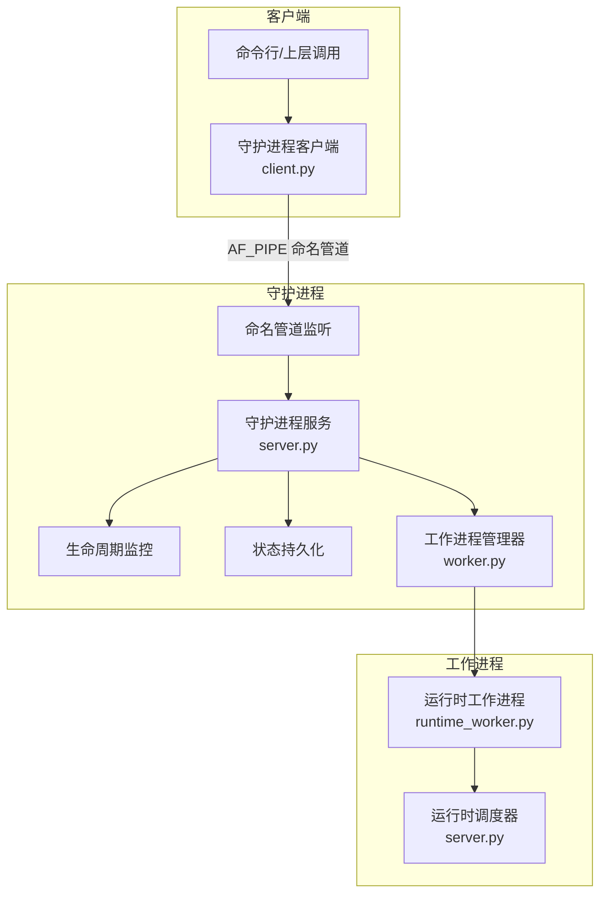
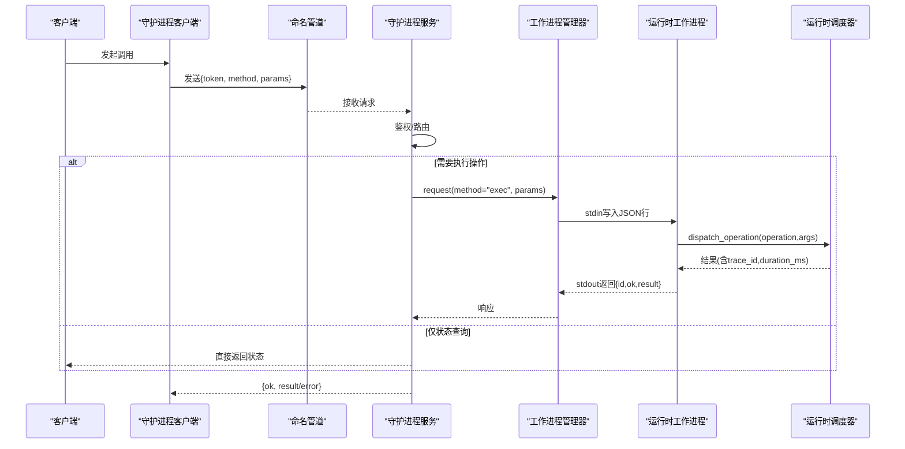
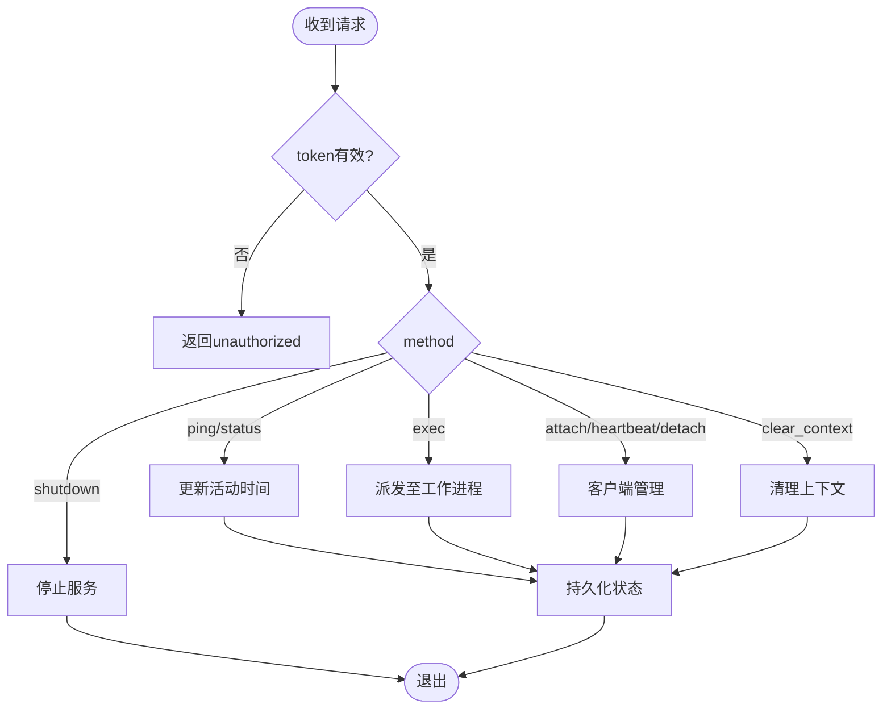
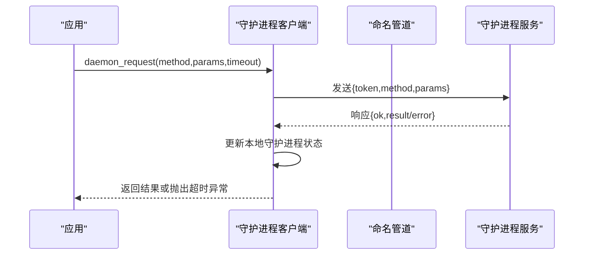
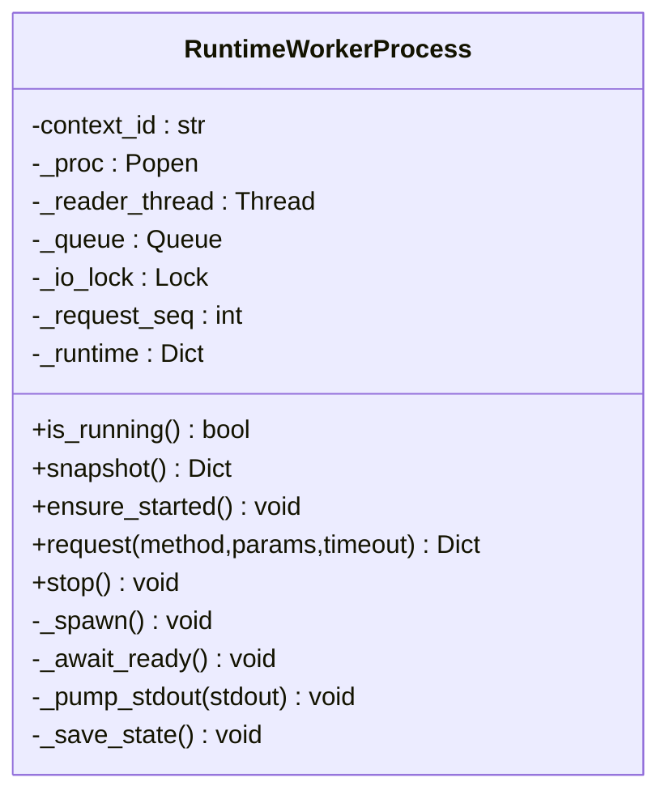
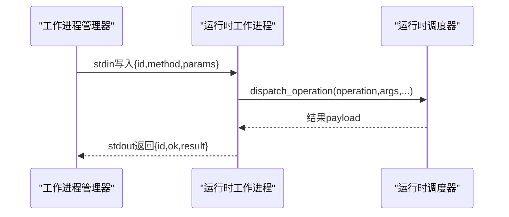
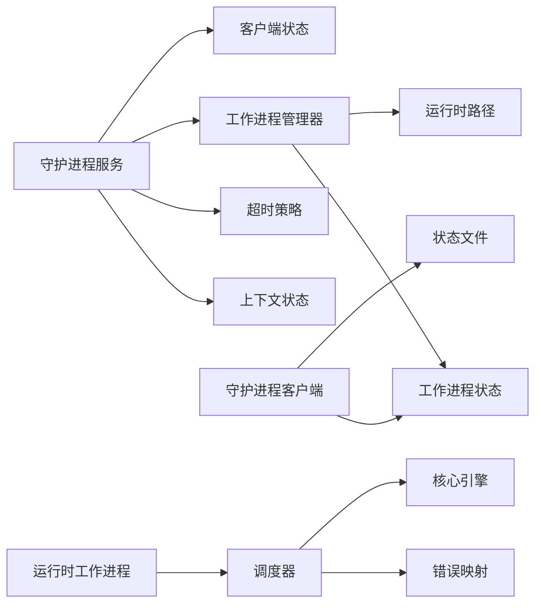

# 守护进程通信

<cite>
**本文引用的文件**
- [rdc_tool/daemon/server.py](file://rdc_tool/daemon/server.py)
- [rdc_tool/daemon/client.py](file://rdc_tool/daemon/client.py)
- [rdc_tool/daemon/worker.py](file://rdc_tool/daemon/worker.py)
- [rdc_tool/runtime_worker.py](file://rdc_tool/runtime_worker.py)
- [rdc_tool/server.py](file://rdc_tool/server.py)
- [rdc_tool/core/contracts.py](file://rdc_tool/core/contracts.py)
- [rdc_tool/core/errors.py](file://rdc_tool/core/errors.py)
- [rdc_tool/timeout_policy.py](file://rdc_tool/timeout_policy.py)
- [rdc_tool/runtime_state.py](file://rdc_tool/runtime_state.py)
</cite>

## 目录
1. [简介](#简介)
2. [项目结构](#项目结构)
3. [核心组件](#核心组件)
4. [架构总览](#架构总览)
5. [详细组件分析](#详细组件分析)
6. [依赖关系分析](#依赖关系分析)
7. [性能考量](#性能考量)
8. [故障排查指南](#故障排查指南)
9. [结论](#结论)
10. [附录：通信协议规范](#附录通信协议规范)

## 简介
本文件系统性阐述 RDC 工具链中的守护进程通信机制，覆盖命名管道连接建立、消息序列化与反序列化、守护进程服务器架构（请求处理、会话管理、资源清理）、客户端同步/异步调用模式、工作进程隔离与任务分发、超时与重试、故障恢复策略，以及完整的通信协议规范、性能优化建议与调试监控方法。目标是帮助开发者与使用者理解并高效使用基于 Windows 命名管道的本地守护进程通信体系。

## 项目结构
围绕守护进程通信的关键代码分布在以下模块：
- 守护进程服务端：监听命名管道、鉴权、请求路由、状态持久化、生命周期监控、工作进程协调
- 守护进程客户端：发现/启动守护进程、发送请求、等待响应、清理残留状态
- 工作进程管理器：维护独立渲染运行时子进程，通过标准输入输出进行 JSON 行协议通信
- 运行时调度器：在工作进程中执行具体操作，统一错误映射与结果封装
- 超时策略：按操作类型计算超时，区分重/极重操作
- 状态与上下文：持久化上下文、会话、捕获、日志等元数据，支持多上下文隔离

图表来源
- [rdc_tool/daemon/server.py:657-690](file://rdc_tool/daemon/server.py#L657-L690)
- [rdc_tool/daemon/client.py:467-515](file://rdc_tool/daemon/client.py#L467-L515)
- [rdc_tool/daemon/worker.py:144-170](file://rdc_tool/daemon/worker.py#L144-L170)
- [rdc_tool/runtime_worker.py:97-155](file://rdc_tool/runtime_worker.py#L97-L155)
- [rdc_tool/server.py:62-145](file://rdc_tool/server.py#L62-L145)

章节来源
- [rdc_tool/daemon/server.py:102-165](file://rdc_tool/daemon/server.py#L102-L165)
- [rdc_tool/daemon/client.py:22-29](file://rdc_tool/daemon/client.py#L22-L29)
- [rdc_tool/daemon/worker.py:24-45](file://rdc_tool/daemon/worker.py#L24-L45)
- [rdc_tool/runtime_worker.py:65-89](file://rdc_tool/runtime_worker.py#L65-L89)
- [rdc_tool/server.py:38-47](file://rdc_tool/server.py#L38-L47)

## 核心组件
- 守护进程服务（DaemonRuntime）：提供命名管道监听、认证、请求路由、状态快照与持久化、活动操作跟踪、空闲/租约超时退出、工作进程生命周期管理
- 守护进程客户端：负责启动/连接守护进程、发送带 token 的请求、轮询等待响应、清理残留状态、附加/心跳/分离客户端
- 工作进程管理器（RuntimeWorkerProcess）：启动/停止渲染运行时子进程，通过队列收集 stdout JSON 行，按请求 ID 匹配响应，设置超时
- 运行时调度器（dispatch_operation）：在工作进程内执行具体操作，统一错误映射、进度上报、上下文同步、结果封装
- 超时策略：根据操作前缀或特定操作名返回不同超时值，区分默认、重型、极重型操作
- 状态与上下文：持久化守护进程状态、上下文状态、会话、捕获、日志；支持多上下文隔离与并发安全

章节来源
- [rdc_tool/daemon/server.py:102-165](file://rdc_tool/daemon/server.py#L102-L165)
- [rdc_tool/daemon/client.py:467-515](file://rdc_tool/daemon/client.py#L467-L515)
- [rdc_tool/daemon/worker.py:144-170](file://rdc_tool/daemon/worker.py#L144-L170)
- [rdc_tool/server.py:62-145](file://rdc_tool/server.py#L62-L145)
- [rdc_tool/timeout_policy.py:56-99](file://rdc_tool/timeout_policy.py#L56-L99)
- [rdc_tool/runtime_state.py:388-416](file://rdc_tool/runtime_state.py#L388-L416)

## 架构总览
守护进程采用“单进程监听 + 每请求线程处理”的模型，配合独立的工作进程执行渲染相关任务。客户端通过命名管道发送 JSON 请求，守护进程校验 token 后路由到对应处理器，必要时委派给工作进程执行，并将结果返回。守护进程持续监控活动、租约与空闲超时，自动清理资源并退出。

图表来源
- [rdc_tool/daemon/client.py:467-515](file://rdc_tool/daemon/client.py#L467-L515)
- [rdc_tool/daemon/server.py:572-643](file://rdc_tool/daemon/server.py#L572-L643)
- [rdc_tool/daemon/worker.py:144-170](file://rdc_tool/daemon/worker.py#L144-L170)
- [rdc_tool/runtime_worker.py:97-155](file://rdc_tool/runtime_worker.py#L97-L155)
- [rdc_tool/server.py:62-145](file://rdc_tool/server.py#L62-L145)

## 详细组件分析

### 守护进程服务器（DaemonRuntime）
- 命名管道监听：使用 AF_PIPE 家族创建 Listener，接受连接后为每个连接启动线程处理请求
- 认证：校验请求中的 token，未通过则返回 unauthorized
- 请求路由：支持 ping、status、shutdown、claim_owner、attach_client、heartbeat、detach_client、set_state、get_state、clear_context、exec
- 活动操作跟踪：记录当前操作的 trace_id、阶段、进度、开始时间，便于诊断
- 状态持久化：将守护进程状态保存到 JSON 文件，包含上下文、会话、捕获、后端、工作进程信息
- 生命周期监控：后台线程定期清理过期客户端、检查所有者丢失与空闲超时，满足条件时优雅停止
- 工作进程协调：确保工作进程运行，失败时重启并重试一次请求

图表来源
- [rdc_tool/daemon/server.py:572-643](file://rdc_tool/daemon/server.py#L572-L643)
- [rdc_tool/daemon/server.py:532-570](file://rdc_tool/daemon/server.py#L532-L570)
- [rdc_tool/daemon/server.py:657-690](file://rdc_tool/daemon/server.py#L657-L690)

章节来源
- [rdc_tool/daemon/server.py:102-165](file://rdc_tool/daemon/server.py#L102-L165)
- [rdc_tool/daemon/server.py:572-643](file://rdc_tool/daemon/server.py#L572-L643)
- [rdc_tool/daemon/server.py:657-690](file://rdc_tool/daemon/server.py#L657-L690)

### 守护进程客户端（daemon_request 等）
- 连接建立：从守护进程状态读取 pipe_name 与 token，构造 \\.\pipe\{name} 地址，使用 multiprocessing.connection.Client 连接
- 请求发送：发送包含 token、method、params 的字典
- 等待响应：轮询 conn.poll，超过超时抛出自定义超时异常，附带上下文与活跃操作摘要
- 状态同步：从响应中更新本地守护进程状态，用于后续调用
- 守护进程管理：ensure_daemon/start_daemon 负责启动守护进程、等待就绪、失败清理；cleanup_stale_daemon_states 清理僵尸进程与残留状态

图表来源
- [rdc_tool/daemon/client.py:467-515](file://rdc_tool/daemon/client.py#L467-L515)
- [rdc_tool/daemon/client.py:623-732](file://rdc_tool/daemon/client.py#L623-L732)
- [rdc_tool/daemon/client.py:554-606](file://rdc_tool/daemon/client.py#L554-L606)

章节来源
- [rdc_tool/daemon/client.py:467-515](file://rdc_tool/daemon/client.py#L467-L515)
- [rdc_tool/daemon/client.py:623-732](file://rdc_tool/daemon/client.py#L623-L732)
- [rdc_tool/daemon/client.py:554-606](file://rdc_tool/daemon/client.py#L554-L606)

### 工作进程管理器（RuntimeWorkerProcess）
- 进程生命周期：ensure_started 保证工作进程存在；_spawn 启动子进程并设置环境变量；_await_ready 等待 ready 信号
- 请求/响应：stdin 写入 JSON 行（id、method、params），stdout 读取 JSON 行，按 id 匹配响应；队列缓冲并发输出
- 超时控制：request 方法设置 deadline，超时抛出 TimeoutError；stop 方法优雅关闭，必要时强制终止
- 状态保存：每次请求后保存工作进程状态，停止时清理

图表来源
- [rdc_tool/daemon/worker.py:24-45](file://rdc_tool/daemon/worker.py#L24-L45)
- [rdc_tool/daemon/worker.py:144-170](file://rdc_tool/daemon/worker.py#L144-L170)
- [rdc_tool/daemon/worker.py:172-203](file://rdc_tool/daemon/worker.py#L172-L203)

章节来源
- [rdc_tool/daemon/worker.py:24-45](file://rdc_tool/daemon/worker.py#L24-L45)
- [rdc_tool/daemon/worker.py:144-170](file://rdc_tool/daemon/worker.py#L144-L170)
- [rdc_tool/daemon/worker.py:172-203](file://rdc_tool/daemon/worker.py#L172-L203)

### 运行时工作进程（runtime_worker.py）
- 启动流程：解析参数、设置上下文 ID、启动父进程监控线程、输出 ready 信号
- 请求处理：循环读取 stdin JSON 行，解析 method 与 params，调用调度器执行 exec/clear_context/status/shutdown
- 结果输出：以 JSON 行形式写回 stdout，包含 id、ok、result/error
- 优雅关闭：shutdown 完成后退出；异常情况下确保关闭

图表来源
- [rdc_tool/runtime_worker.py:97-155](file://rdc_tool/runtime_worker.py#L97-L155)
- [rdc_tool/server.py:62-145](file://rdc_tool/server.py#L62-L145)

章节来源
- [rdc_tool/runtime_worker.py:65-89](file://rdc_tool/runtime_worker.py#L65-L89)
- [rdc_tool/runtime_worker.py:97-155](file://rdc_tool/runtime_worker.py#L97-L155)

### 运行时调度器（dispatch_operation）
- 上下文准备：初始化 CoreEngine、ExecutionContext、ProgressReporter
- 自动预览同步：对非预览自同步的操作，在前后执行预览同步
- 错误映射：将异常映射为统一的 CoreError，生成 canonical_error
- 结果记录：记录操作开始/结束、耗时、trace_id，便于追踪

章节来源
- [rdc_tool/server.py:62-145](file://rdc_tool/server.py#L62-L145)
- [rdc_tool/core/errors.py:90-119](file://rdc_tool/core/errors.py#L90-L119)

### 超时策略与重试
- 超时计算：operation_timeout_s 根据操作名与前缀返回不同超时；transport_timeout_s 增加缓冲；daemon_exec_timeout_s/worker_exec_timeout_s 分别用于守护进程与工作进程
- 重试机制：守护进程在执行 exec 时若工作进程异常，会停止并重启工作进程后重试一次
- 故障恢复：守护进程生命周期监控依据所有者丢失、租约过期、空闲超时决定退出；清理上下文与会话状态

章节来源
- [rdc_tool/timeout_policy.py:56-99](file://rdc_tool/timeout_policy.py#L56-L99)
- [rdc_tool/daemon/server.py:452-493](file://rdc_tool/daemon/server.py#L452-L493)
- [rdc_tool/daemon/server.py:532-570](file://rdc_tool/daemon/server.py#L532-L570)

### 会话管理与资源清理
- 会话管理：守护进程状态包含 session_id、capture_file_id、active_event_id、frame_index 等，反映当前会话与捕获状态
- 资源清理：clear_context 调用工作进程清理上下文或直接清理快照与状态；cleanup_stale_daemon_states 清理僵尸守护进程与工作进程，删除残留状态文件

章节来源
- [rdc_tool/daemon/server.py:247-258](file://rdc_tool/daemon/server.py#L247-L258)
- [rdc_tool/daemon/server.py:494-530](file://rdc_tool/daemon/server.py#L494-L530)
- [rdc_tool/daemon/client.py:554-606](file://rdc_tool/daemon/client.py#L554-L606)

## 依赖关系分析
- 守护进程服务依赖客户端状态读写、工作进程管理器、超时策略、上下文状态
- 客户端依赖守护进程状态、上下文状态、工作进程状态、IO 工具
- 工作进程管理器依赖运行时路径、工作进程状态、IO 工具
- 运行时工作进程依赖调度器、IO 工具
- 调度器依赖核心引擎、工件发布器、错误映射、进度上报

图表来源
- [rdc_tool/daemon/server.py:102-165](file://rdc_tool/daemon/server.py#L102-L165)
- [rdc_tool/daemon/client.py:22-29](file://rdc_tool/daemon/client.py#L22-L29)
- [rdc_tool/daemon/worker.py:24-45](file://rdc_tool/daemon/worker.py#L24-L45)
- [rdc_tool/runtime_worker.py:65-89](file://rdc_tool/runtime_worker.py#L65-L89)
- [rdc_tool/server.py:38-47](file://rdc_tool/server.py#L38-L47)

章节来源
- [rdc_tool/daemon/server.py:102-165](file://rdc_tool/daemon/server.py#L102-L165)
- [rdc_tool/daemon/client.py:22-29](file://rdc_tool/daemon/client.py#L22-L29)
- [rdc_tool/daemon/worker.py:24-45](file://rdc_tool/daemon/worker.py#L24-L45)
- [rdc_tool/runtime_worker.py:65-89](file://rdc_tool/runtime_worker.py#L65-L89)
- [rdc_tool/server.py:38-47](file://rdc_tool/server.py#L38-L47)

## 性能考量
- 连接复用：守护进程使用单监听器接受多个连接，每个连接独立线程处理，避免频繁创建/销毁底层句柄
- 批量处理：当前实现为逐条请求处理；可通过合并小请求或在客户端侧批量化减少往返次数
- 超时调优：根据操作类型调整超时，重型/极重型操作使用更长超时，避免误杀长耗时任务
- I/O 缓冲：工作进程使用队列缓冲 stdout 输出，降低阻塞风险
- 状态持久化：守护进程状态与上下文状态原子写入，减少竞争与损坏风险

[本节为通用指导，不直接分析具体文件]

## 故障排查指南
- 常见错误码与类别：
  - validation_error、not_found、assertion_failed、runtime_error、permission_error、io_error、internal_error
- 超时异常：
  - 客户端抛出 DaemonRequestTimeout，包含 operation、failed_step、context_id、timeout_seconds、active_request_count、active_operation、recovery_hint
- 工作进程异常：
  - 守护进程检测到工作进程异常时会停止并重启，随后重试请求
- 状态清理：
  - 使用 cleanup_stale_daemon_states 清理僵尸守护进程与工作进程，删除残留状态文件
- 调试建议：
  - 查看守护进程状态文件与上下文日志，关注 active_operation、last_activity_at、attached_clients
  - 检查工作进程是否报告 ready，确认环境变量是否正确设置

章节来源
- [rdc_tool/core/errors.py:9-87](file://rdc_tool/core/errors.py#L9-L87)
- [rdc_tool/daemon/client.py:31-37](file://rdc_tool/daemon/client.py#L31-L37)
- [rdc_tool/daemon/client.py:467-515](file://rdc_tool/daemon/client.py#L467-L515)
- [rdc_tool/daemon/server.py:452-493](file://rdc_tool/daemon/server.py#L452-L493)
- [rdc_tool/daemon/client.py:554-606](file://rdc_tool/daemon/client.py#L554-L606)

## 结论
RDC 守护进程通信体系通过命名管道实现高效的本地进程间通信，结合工作进程隔离、严格的超时策略与完善的错误映射，提供了稳定可靠的运行时执行环境。客户端与服务端通过标准化的 JSON 消息交互，支持多种操作方法与状态管理。通过合理的超时配置、状态清理与故障恢复机制，系统能够在复杂场景下保持健壮性。建议在生产环境中结合监控与日志进行性能调优与问题定位。

[本节为总结，不直接分析具体文件]

## 附录：通信协议规范

### 命名管道地址与连接
- 地址格式：\\.\pipe\{pipe_name}
- 连接方式：multiprocessing.connection.Client(family="AF_PIPE")
- 认证：请求体必须包含 token，服务端校验通过后处理

章节来源
- [rdc_tool/daemon/client.py:118-119](file://rdc_tool/daemon/client.py#L118-L119)
- [rdc_tool/daemon/client.py:467-515](file://rdc_tool/daemon/client.py#L467-L515)
- [rdc_tool/daemon/server.py:166-169](file://rdc_tool/daemon/server.py#L166-L169)

### 请求与响应格式
- 请求体：
  - token: string
  - method: string（如 ping、status、exec、attach_client、heartbeat、detach_client、set_state、get_state、clear_context、shutdown）
  - params: object（随 method 变化）
- 响应体：
  - ok: boolean
  - result: object（成功时的结果）
  - error: object（失败时的错误，包含 code、message、details）

章节来源
- [rdc_tool/daemon/client.py:467-515](file://rdc_tool/daemon/client.py#L467-L515)
- [rdc_tool/daemon/server.py:572-643](file://rdc_tool/daemon/server.py#L572-L643)

### 工作进程内部协议
- 请求格式（stdin）：
  - id: string（唯一标识）
  - method: string（exec、clear_context、status、shutdown）
  - params: object
- 响应格式（stdout）：
  - id: string（与请求一致）
  - ok: boolean
  - result: object（成功时的结果）
  - error: object（失败时的错误）

章节来源
- [rdc_tool/daemon/worker.py:144-170](file://rdc_tool/daemon/worker.py#L144-L170)
- [rdc_tool/runtime_worker.py:97-155](file://rdc_tool/runtime_worker.py#L97-L155)

### 状态码与错误处理
- 错误类别：validation、not_found、assertion_failed、runtime、permission、io、internal
- 错误码：由 map_exception 映射为标准代码
- 超时：客户端抛出 DaemonRequestTimeout，包含详细信息以便诊断

章节来源
- [rdc_tool/core/errors.py:9-87](file://rdc_tool/core/errors.py#L9-L87)
- [rdc_tool/core/errors.py:90-119](file://rdc_tool/core/errors.py#L90-L119)
- [rdc_tool/daemon/client.py:31-37](file://rdc_tool/daemon/client.py#L31-L37)

### 超时与重试策略
- 超时计算：operation_timeout_s 根据操作名与前缀返回不同超时；transport_timeout_s 增加缓冲
- 重试：守护进程在执行 exec 时若工作进程异常，停止并重启后重试一次
- 租约与空闲：守护进程依据租约超时与空闲超时决定是否退出

章节来源
- [rdc_tool/timeout_policy.py:56-99](file://rdc_tool/timeout_policy.py#L56-L99)
- [rdc_tool/daemon/server.py:452-493](file://rdc_tool/daemon/server.py#L452-L493)
- [rdc_tool/daemon/server.py:532-570](file://rdc_tool/daemon/server.py#L532-L570)

### 调试与监控
- 守护进程状态：通过 get_state 获取，包含 context_id、pid、session_id、capture_file_id、active_event_id、backend、active_request_count、last_activity_at、recovery_status、worker 信息
- 上下文日志：读取 runtime_logs.jsonl，过滤 since_ms 获取最近日志
- 工作进程状态：通过 snapshot 获取 running、pid、binaries_dir、pymodules_dir、source_manifest

章节来源
- [rdc_tool/daemon/server.py:610-613](file://rdc_tool/daemon/server.py#L610-L613)
- [rdc_tool/runtime_state.py:448-472](file://rdc_tool/runtime_state.py#L448-L472)
- [rdc_tool/daemon/worker.py:37-45](file://rdc_tool/daemon/worker.py#L37-L45)