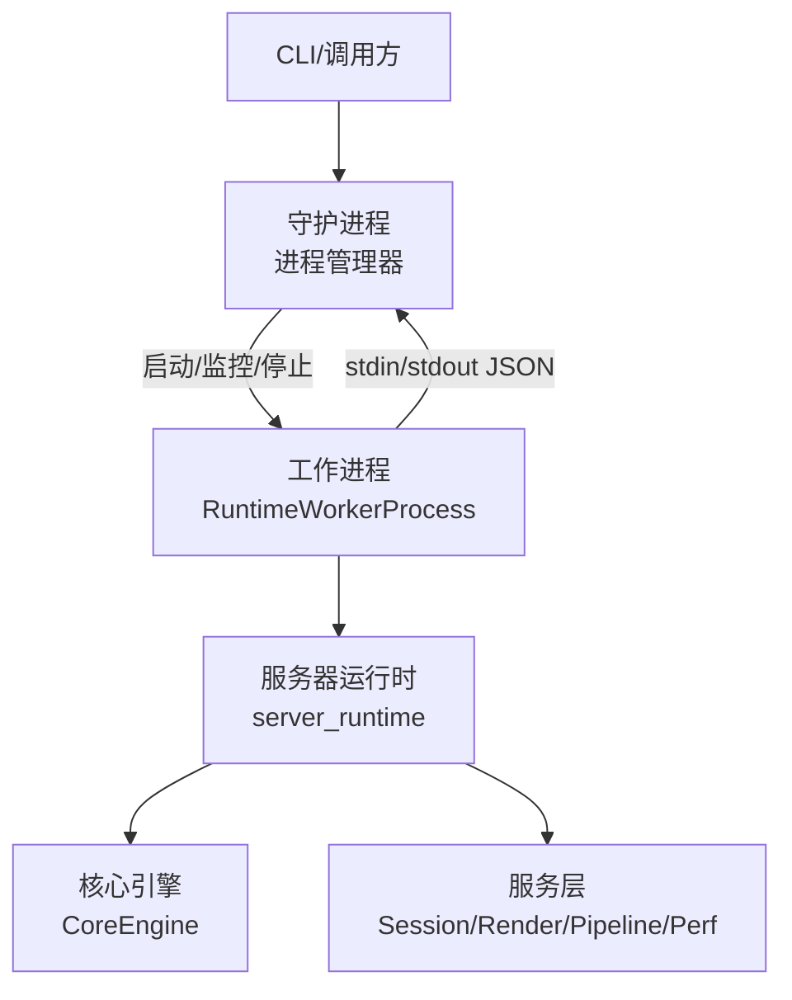
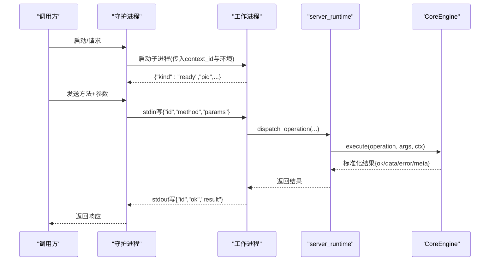
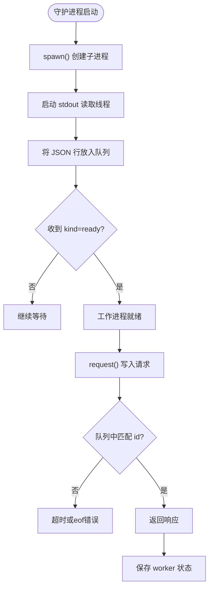
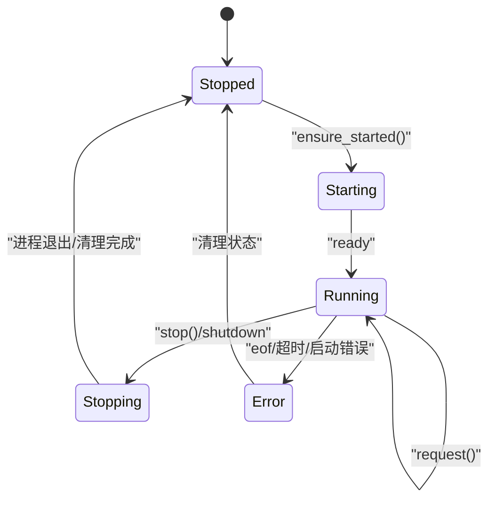
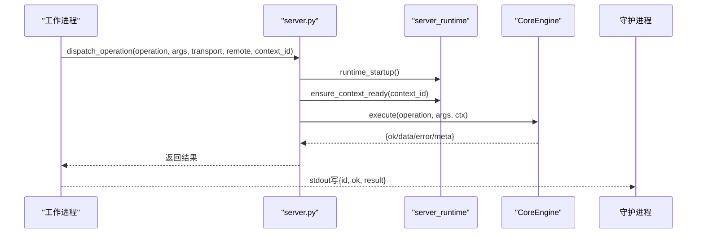
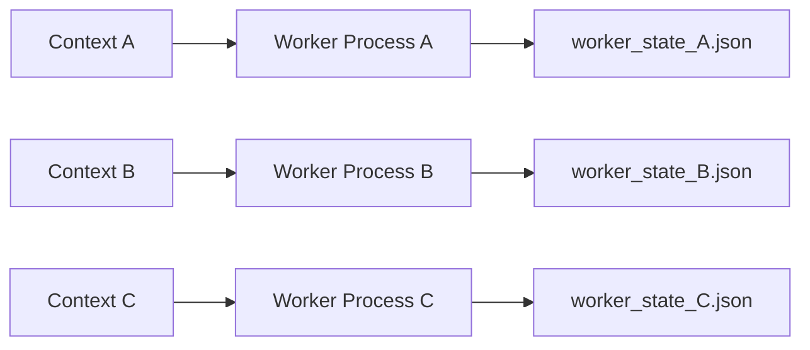
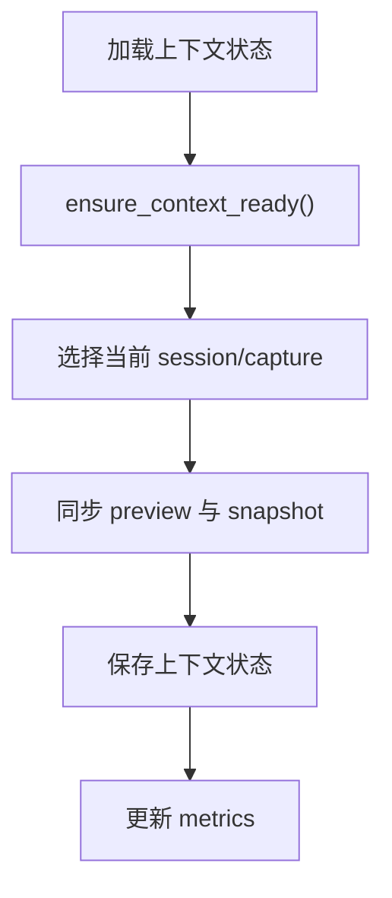
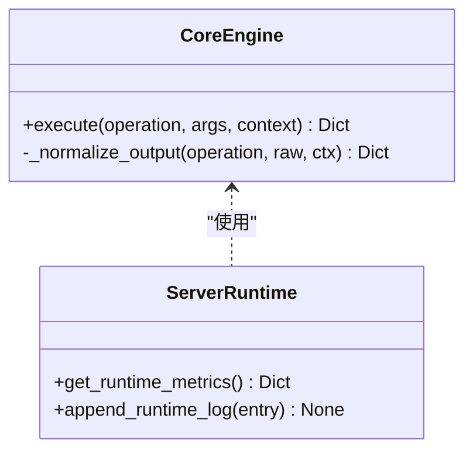
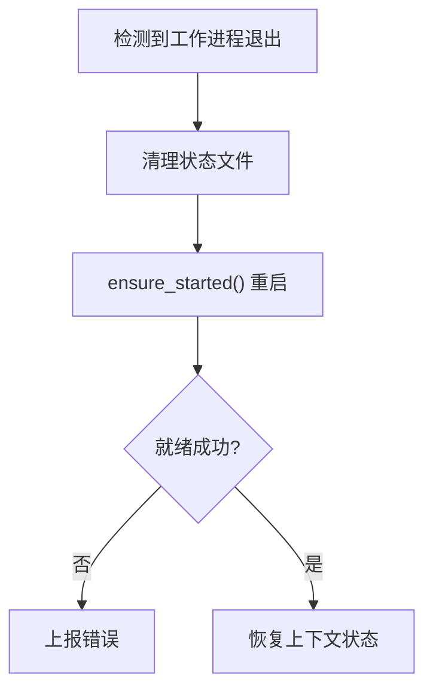
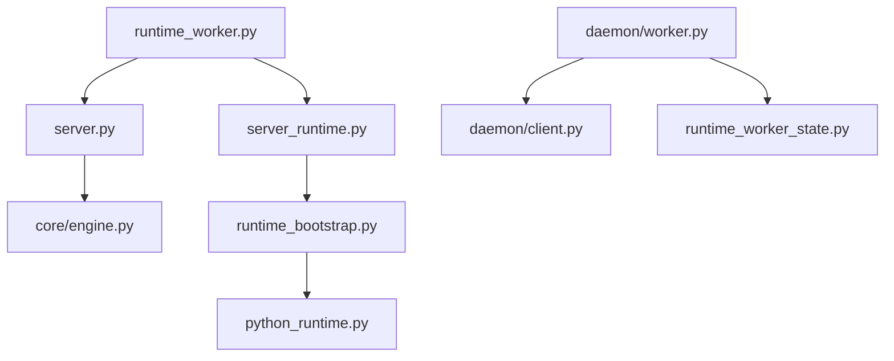

# 工作进程管理

<cite>
**本文引用的文件**
- [runtime_worker.py](file://rdx/runtime_worker.py)
- [daemon/worker.py](file://rdx/daemon/worker.py)
- [server_runtime.py](file://rdx/server_runtime.py)
- [server.py](file://rdx/server.py)
- [runtime_bootstrap.py](file://rdx/runtime_bootstrap.py)
- [python_runtime.py](file://rdx/python_runtime.py)
- [core/engine.py](file://rdx/core/engine.py)
- [operation_definitions.py](file://rdx/operation_definitions.py)
- [daemon/client.py](file://rdx/daemon/client.py)
</cite>

## 目录
1. [简介](#简介)
2. [项目结构](#项目结构)
3. [核心组件](#核心组件)
4. [架构总览](#架构总览)
5. [详细组件分析](#详细组件分析)
6. [依赖关系分析](#依赖关系分析)
7. [性能考量](#性能考量)
8. [故障排查指南](#故障排查指南)
9. [结论](#结论)
10. [附录](#附录)

## 简介
本文件围绕 RDX 的“工作进程”（RenderDoc-backed runtime worker）进行系统化文档化，重点解释 RuntimeWorkerProcess 的设计模式与实现机制，覆盖以下主题：
- 隔离架构：进程间通信、资源隔离与内存保护
- 生命周期管理：启动、监控、重启与优雅关闭
- 任务调度：操作分发、参数传递与结果返回
- 进程池管理：多进程支持、负载均衡与资源优化
- 状态同步：上下文状态共享与数据一致性保证
- 监控接口：健康检查、性能指标与日志收集
- 故障恢复：崩溃检测、自动重启与数据恢复
- 性能调优建议与最佳实践

## 项目结构
RDX 的工作进程由“守护进程 + 子进程”组成：
- 守护进程负责进程生命周期管理、状态持久化、客户端连接与会话协调
- 工作进程是独立的 Python 子进程，承载 RenderDoc 运行时与回放会话，避免主进程崩溃影响业务
- 通过标准输入/输出进行 JSON 协议通信，使用线程读取 stdout 并放入队列，请求带 id 匹配响应
- 运行环境通过环境变量注入二进制路径、Python 模块路径与清单信息，确保渲染库加载正确

图表来源
- [daemon/worker.py:24-203](file://rdx/daemon/worker.py#L24-L203)
- [runtime_worker.py:65-167](file://rdx/runtime_worker.py#L65-L167)
- [server_runtime.py:1-120](file://rdx/server_runtime.py#L1-L120)
- [core/engine.py:30-76](file://rdx/core/engine.py#L30-L76)

章节来源
- [daemon/worker.py:24-203](file://rdx/daemon/worker.py#L24-L203)
- [runtime_worker.py:65-167](file://rdx/runtime_worker.py#L65-L167)

## 核心组件
- RuntimeWorkerProcess：封装工作进程的启动、请求发送、响应接收、就绪等待、优雅关闭与状态持久化
- 工作进程 main：解析参数、设置上下文 ID、启动父进程守护线程、进入 stdin 消息循环、分发 exec/clear_context/status/shutdown
- server_runtime：运行时服务层，维护上下文、会话、预览、远程连接、配置与指标；提供 ensure_context_ready、shutdown 等能力
- CoreEngine：统一执行引擎，注册操作、执行 handler、标准化输出、记录耗时与追踪 ID
- daemon/client：守护进程客户端，通过命名管道与守护进程交互，管理守护进程生命周期、清理残留状态

章节来源
- [daemon/worker.py:24-203](file://rdx/daemon/worker.py#L24-L203)
- [runtime_worker.py:65-167](file://rdx/runtime_worker.py#L65-L167)
- [server_runtime.py:1-120](file://rdx/server_runtime.py#L1-L120)
- [core/engine.py:30-76](file://rdx/core/engine.py#L30-L76)
- [daemon/client.py:467-515](file://rdx/daemon/client.py#L467-L515)

## 架构总览
工作进程采用“守护进程管理 + 独立子进程执行”的隔离架构：
- 隔离性：每个 context_id 对应一个工作进程，避免跨上下文污染；子进程崩溃不影响守护进程
- 通信：JSON 行协议，stdin 写入请求，stdout 输出响应；守护进程通过队列与线程解耦 I/O
- 资源：工作进程内使用单线程异步执行器承载 RenderDoc 回放线程，避免频繁创建销毁导致原生上下文失效
- 状态：守护进程与工作进程均持久化状态（守护进程保存 daemon/session/worker 状态；工作进程保存 worker_state.json）
- 监控：工作进程上报 ready/startup_error/eof；守护进程维护活跃请求计数、最近活动、回收策略

图表来源
- [daemon/worker.py:144-170](file://rdx/daemon/worker.py#L144-L170)
- [runtime_worker.py:97-155](file://rdx/runtime_worker.py#L97-L155)
- [server.py:62-145](file://rdx/server.py#L62-L145)
- [core/engine.py:40-76](file://rdx/core/engine.py#L40-L76)

## 详细组件分析

### 工作进程隔离与进程间通信
- 隔离设计
  - 每个 context_id 拥有独立工作进程，避免共享状态冲突
  - 通过环境变量注入二进制与 Python 模块路径，确保渲染库加载在隔离环境中
  - 工作进程内使用单线程异步执行器承载渲染回放，避免原生上下文失效
- 进程间通信
  - 守护进程通过 subprocess.Popen 启动工作进程，stdin/stdout 为 JSON 行协议
  - 守护进程使用队列与线程读取 stdout，按请求 id 匹配响应
  - 工作进程收到 shutdown 后退出，守护进程捕获 eof 并清理资源

图表来源
- [daemon/worker.py:57-136](file://rdx/daemon/worker.py#L57-L136)
- [daemon/worker.py:144-170](file://rdx/daemon/worker.py#L144-L170)

章节来源
- [runtime_worker.py:25-63](file://rdx/runtime_worker.py#L25-L63)
- [runtime_worker.py:65-167](file://rdx/runtime_worker.py#L65-L167)
- [daemon/worker.py:57-136](file://rdx/daemon/worker.py#L57-L136)
- [daemon/worker.py:144-170](file://rdx/daemon/worker.py#L144-L170)

### 生命周期管理（启动、监控、重启、优雅关闭）
- 启动流程
  - 守护进程设置环境变量（context_id、daemon_pid、二进制与模块路径），以子进程方式启动工作进程
  - 工作进程设置 RDX_CONTEXT_ID，启动父进程守护线程，上报 ready 状态
- 监控机制
  - 守护进程通过队列监听 eof，若工作进程提前退出则抛出异常
  - 工作进程内部通过 _is_pid_running 检测父进程是否存活，父进程退出时工作进程主动退出
- 重启策略
  - ensure_started() 在请求前检查进程是否存活，必要时 stop() 再 spawn()
  - 守护进程在清理残留状态时尝试优雅关闭，失败则强制 kill
- 优雅关闭
  - 守护进程发送 shutdown 方法，工作进程调用 runtime_shutdown 并返回 stopped=true
  - 守护进程等待进程退出，关闭 stdin/stdout，清理状态文件

图表来源
- [daemon/worker.py:138-203](file://rdx/daemon/worker.py#L138-L203)
- [runtime_worker.py:56-63](file://rdx/runtime_worker.py#L56-L63)
- [runtime_worker.py:150-161](file://rdx/runtime_worker.py#L150-L161)

章节来源
- [daemon/worker.py:69-136](file://rdx/daemon/worker.py#L69-L136)
- [daemon/worker.py:138-203](file://rdx/daemon/worker.py#L138-L203)
- [runtime_worker.py:56-63](file://rdx/runtime_worker.py#L56-L63)
- [runtime_worker.py:150-161](file://rdx/runtime_worker.py#L150-L161)

### 任务调度机制（操作分发、参数传递、结果返回）
- 操作分发
  - 工作进程收到 method="exec"，调用 server.dispatch_operation(operation, args, transport, remote, context_id)
  - server_runtime.ensure_context_ready 确保上下文初始化，CoreEngine.execute 查找并执行 handler
- 参数传递
  - 请求体包含 id、method、params；params 中的 operation、args、transport、remote、context_id 被提取并传递
- 结果返回
  - CoreEngine 标准化结果为 {ok/data/error/meta}，包含 trace_id、duration_ms、transport
  - 工作进程通过 stdout 返回 {id, ok, result}，守护进程按 id 匹配并返回给调用方

图表来源
- [runtime_worker.py:111-122](file://rdx/runtime_worker.py#L111-L122)
- [server.py:62-145](file://rdx/server.py#L62-L145)
- [core/engine.py:40-76](file://rdx/core/engine.py#L40-L76)

章节来源
- [runtime_worker.py:97-155](file://rdx/runtime_worker.py#L97-L155)
- [server.py:62-145](file://rdx/server.py#L62-L145)
- [core/engine.py:40-76](file://rdx/core/engine.py#L40-L76)

### 进程池管理（多进程支持、负载均衡、资源优化）
- 多进程支持
  - 每个 context_id 对应一个工作进程，守护进程可管理多个上下文的工作进程
  - 通过 worker_state.json 持久化每个上下文的工作进程状态（running、pid、路径等）
- 负载均衡
  - 当前实现未内置动态负载均衡；可通过外部调度器将不同 context_id 的任务分配到不同进程
  - 结合上下文容量限制（max_contexts）避免过载
- 资源优化
  - 工作进程内使用单线程异步执行器，减少上下文切换开销
  - 守护进程对空闲/租约超时的上下文进行回收，释放资源

图表来源
- [runtime_worker_state.py:19-56](file://rdx/runtime_worker_state.py#L19-L56)
- [daemon/client.py:554-606](file://rdx/daemon/client.py#L554-L606)

章节来源
- [runtime_worker_state.py:19-56](file://rdx/runtime_worker_state.py#L19-L56)
- [daemon/client.py:554-606](file://rdx/daemon/client.py#L554-L606)

### 状态同步机制（上下文状态共享与数据一致性保证）
- 上下文状态
  - server_runtime 维护 context_states、context_snapshots、sessions、captures 等
  - 通过 _context_state() 与 _store_context_state() 加载/保存上下文状态到文件
- 快照与保留策略
  - 使用 SnapshotRetentionPolicy 控制快照数量与类型限制
  - 通过 merge_recent_artifacts 合并近期工件
- 一致性保证
  - 每次操作前后记录开始/结束时间、trace_id、传输方式
  - 预览状态与上下文状态同步，确保 UI 与后端一致

图表来源
- [server_runtime.py:413-468](file://rdx/server_runtime.py#L413-L468)
- [server_runtime.py:764-800](file://rdx/server_runtime.py#L764-L800)

章节来源
- [server_runtime.py:413-468](file://rdx/server_runtime.py#L413-L468)
- [server_runtime.py:764-800](file://rdx/server_runtime.py#L764-L800)

### 监控接口（健康检查、性能指标、日志收集）
- 健康检查
  - 工作进程启动时上报 ready，启动失败上报 startup_error
  - 守护进程通过 READY_TIMEOUT_S 等待就绪，超时则报错
- 性能指标
  - CoreEngine 记录 duration_ms、trace_id、transport
  - server_runtime 提供 get_runtime_metrics 获取上下文指标、限制配置、恢复摘要与最近操作统计
- 日志收集
  - 工作进程通过 safe_stream_write 输出结构化日志
  - 守护进程可读取上下文日志文件，支持按时间与级别过滤

图表来源
- [core/engine.py:40-76](file://rdx/core/engine.py#L40-L76)
- [operation_definitions.py:376-393](file://rdx/operation_definitions.py#L376-L393)

章节来源
- [core/engine.py:40-76](file://rdx/core/engine.py#L40-L76)
- [operation_definitions.py:376-393](file://rdx/operation_definitions.py#L376-L393)

### 故障恢复策略（崩溃检测、自动重启、数据恢复）
- 崩溃检测
  - 守护进程通过队列监听 eof，若工作进程提前退出则抛出异常
  - 工作进程检测父进程退出后主动终止
- 自动重启
  - ensure_started() 在请求前检查进程状态，必要时重启
  - 守护进程清理残留状态后重新启动
- 数据恢复
  - 上下文状态与快照持久化，重启后可恢复
  - worker_state.json 记录工作进程状态，便于诊断与恢复

图表来源
- [daemon/worker.py:121-136](file://rdx/daemon/worker.py#L121-L136)
- [daemon/worker.py:138-170](file://rdx/daemon/worker.py#L138-L170)
- [runtime_worker_state.py:46-56](file://rdx/runtime_worker_state.py#L46-L56)

章节来源
- [daemon/worker.py:121-136](file://rdx/daemon/worker.py#L121-L136)
- [daemon/worker.py:138-170](file://rdx/daemon/worker.py#L138-L170)
- [runtime_worker_state.py:46-56](file://rdx/runtime_worker_state.py#L46-L56)

## 依赖关系分析
- 工作进程依赖 server_runtime 与 CoreEngine 执行操作
- 守护进程依赖 daemon/client 与 runtime_worker_state 管理进程与状态
- 运行时引导模块负责设置 Python 环境与 DLL 路径，确保 RenderDoc 库加载

图表来源
- [runtime_worker.py:72-122](file://rdx/runtime_worker.py#L72-L122)
- [server.py:26-47](file://rdx/server.py#L26-L47)
- [daemon/worker.py:16-18](file://rdx/daemon/worker.py#L16-L18)
- [runtime_bootstrap.py:105-131](file://rdx/runtime_bootstrap.py#L105-L131)

章节来源
- [runtime_worker.py:72-122](file://rdx/runtime_worker.py#L72-L122)
- [server.py:26-47](file://rdx/server.py#L26-L47)
- [daemon/worker.py:16-18](file://rdx/daemon/worker.py#L16-L18)
- [runtime_bootstrap.py:105-131](file://rdx/runtime_bootstrap.py#L105-L131)

## 性能考量
- 使用单线程异步执行器承载渲染回放，避免频繁创建销毁导致的原生上下文失效
- 通过上下文容量限制（max_contexts）与回收策略防止资源耗尽
- 请求超时与就绪超时避免长时间阻塞
- 日志与指标记录有助于定位瓶颈与优化

[本节为通用指导，不直接分析具体文件]

## 故障排查指南
- 工作进程无法就绪
  - 检查 READY_TIMEOUT_S 与启动错误上报
  - 查看上下文状态与 worker_state.json
- 请求超时
  - 检查守护进程 active_request_count 与最近活动
  - 确认工作进程是否仍在运行
- 崩溃恢复
  - 清理残留状态后重启
  - 检查上下文快照与日志

章节来源
- [daemon/worker.py:121-136](file://rdx/daemon/worker.py#L121-L136)
- [daemon/client.py:467-515](file://rdx/daemon/client.py#L467-L515)
- [daemon/client.py:554-606](file://rdx/daemon/client.py#L554-L606)

## 结论
RDX 的工作进程管理通过守护进程与工作进程的隔离架构，实现了稳定的 RenderDoc 运行时执行环境。通过 JSON 行协议、状态持久化、监控接口与故障恢复策略，系统具备高可用性与可观测性。在多上下文场景下，结合容量限制与回收策略，可有效管理资源并提升整体性能。

[本节为总结，不直接分析具体文件]

## 附录
- 环境变量说明
  - RDX_CONTEXT_ID：上下文标识
  - RDX_DAEMON_PID：守护进程 PID
  - RDX_RUNTIME_DLL_DIR：二进制目录
  - RDX_RENDERDOC_PATH：Python 模块目录
  - RDX_WORKER_SOURCE_MANIFEST：源清单路径
- 关键常量
  - READY_TIMEOUT_S：工作进程就绪超时
  - REQUEST_TIMEOUT_S：请求超时

章节来源
- [daemon/worker.py:20-22](file://rdx/daemon/worker.py#L20-L22)
- [daemon/worker.py:78-84](file://rdx/daemon/worker.py#L78-L84)