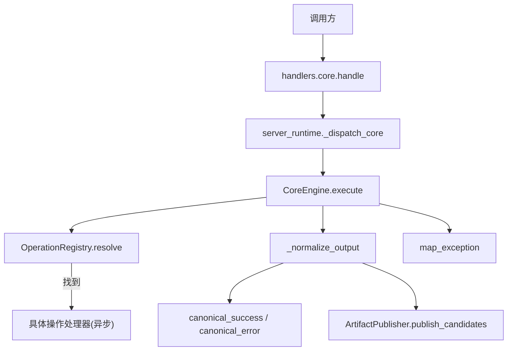
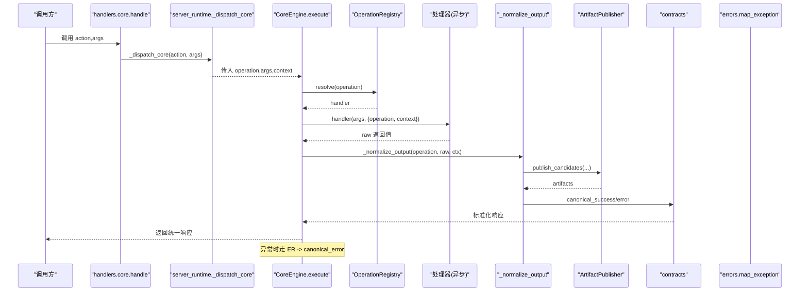
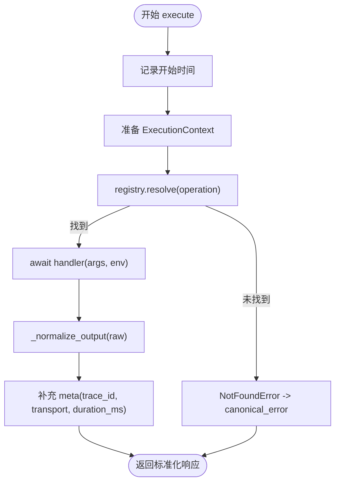
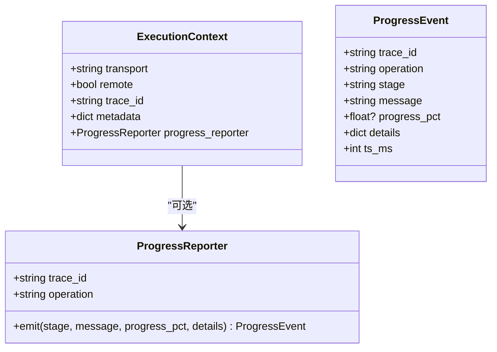
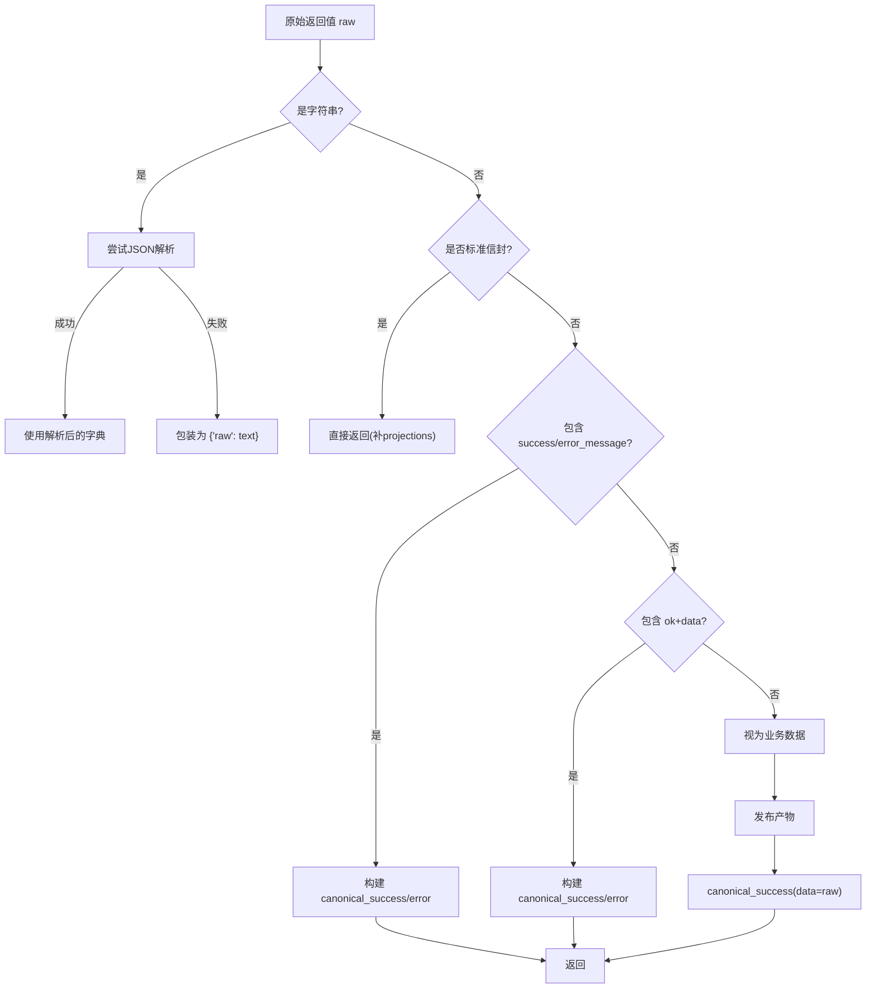
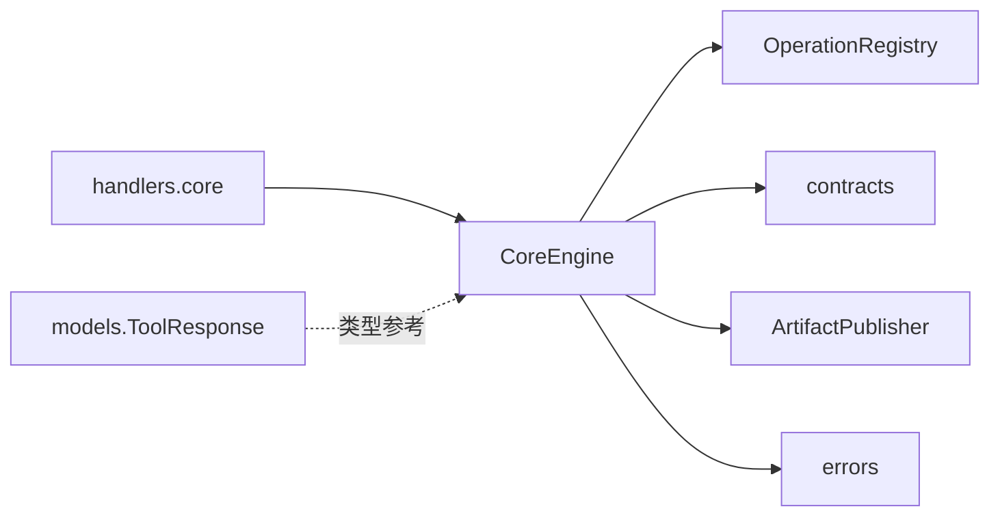

# 执行引擎

<cite>
**本文引用的文件**
- [engine.py](file://rdc_tool/core/engine.py)
- [operation_registry.py](file://rdc_tool/core/operation_registry.py)
- [contracts.py](file://rdc_tool/core/contracts.py)
- [errors.py](file://rdc_tool/core/errors.py)
- [artifact_publisher.py](file://rdc_tool/core/artifact_publisher.py)
- [progress.py](file://rdc_tool/progress.py)
- [core.py](file://rdc_tool/handlers/core.py)
- [server_runtime.py](file://rdc_tool/server_runtime.py)
- [models.py](file://rdc_tool/models.py)
</cite>

## 目录
1. [简介](#简介)
2. [项目结构](#项目结构)
3. [核心组件](#核心组件)
4. [架构总览](#架构总览)
5. [详细组件分析](#详细组件分析)
6. [依赖关系分析](#依赖关系分析)
7. [性能与监控](#性能与监控)
8. [故障排查指南](#故障排查指南)
9. [结论](#结论)
10. [附录：扩展处理器与自定义错误处理](#附录：扩展处理器与自定义错误处理)

## 简介
本文件聚焦于执行引擎的核心设计与实现，围绕 CoreEngine 类展开，完整说明操作执行的端到端生命周期：参数解析、处理器查找、异步执行、结果标准化、错误映射与统一输出。同时解释 ExecutionContext 上下文管理机制（传输类型、远程标识、跟踪ID、进度报告器），并阐述输出标准化过程与错误映射机制。最后提供扩展新操作处理器和自定义错误处理的实践指引，以及性能监控与调试信息收集方式。

## 项目结构
执行引擎位于 rdc_tool/core 下，以 CoreEngine 为中心，配合 OperationRegistry 进行处理器注册与分发，通过 contracts 生成统一响应信封，借助 ArtifactPublisher 产出产物引用，并通过 errors 完成异常到标准错误的转换。handlers.core 作为入口将外部调用路由到 server_runtime._dispatch_core，最终由 CoreEngine 驱动执行。

图表来源
- [core.py:8-10](file://rdc_tool/handlers/core.py#L8-L10)
- [engine.py:40-75](file://rdc_tool/core/engine.py#L40-L75)
- [operation_registry.py:18-43](file://rdc_tool/core/operation_registry.py#L18-L43)
- [contracts.py:98-164](file://rdc_tool/core/contracts.py#L98-L164)
- [artifact_publisher.py:60-118](file://rdc_tool/core/artifact_publisher.py#L60-L118)
- [errors.py:90-119](file://rdc_tool/core/errors.py#L90-L119)

章节来源
- [core.py:8-10](file://rdc_tool/handlers/core.py#L8-L10)
- [engine.py:21-75](file://rdc_tool/core/engine.py#L21-L75)
- [operation_registry.py:18-43](file://rdc_tool/core/operation_registry.py#L18-L43)
- [contracts.py:98-164](file://rdc_tool/core/contracts.py#L98-L164)
- [artifact_publisher.py:60-118](file://rdc_tool/core/artifact_publisher.py#L60-L118)
- [errors.py:90-119](file://rdc_tool/core/errors.py#L90-L119)

## 核心组件
- CoreEngine：统一的执行入口，负责生命周期编排、度量统计、上下文注入、结果标准化与错误归一化。
- ExecutionContext：承载传输类型、是否远程、跟踪ID、元数据与进度报告器的轻量上下文对象。
- OperationRegistry：操作名到异步处理器的注册与解析表，支持默认处理器。
- contracts：统一的成功/失败响应信封构造与产物候选收集。
- artifact_publisher：根据环境配置将本地路径或URL转换为统一产物描述，支持S3上传。
- errors：定义核心错误类型及异常到标准错误的映射。
- progress：进度事件与上报接口，供处理器在长耗时操作中汇报进度。
- handlers.core：将外部动作转发给 server_runtime._dispatch_core，从而进入引擎流程。

章节来源
- [engine.py:21-75](file://rdc_tool/core/engine.py#L21-L75)
- [operation_registry.py:18-43](file://rdc_tool/core/operation_registry.py#L18-L43)
- [contracts.py:98-164](file://rdc_tool/core/contracts.py#L98-L164)
- [artifact_publisher.py:15-118](file://rdc_tool/core/artifact_publisher.py#L15-L118)
- [errors.py:9-119](file://rdc_tool/core/errors.py#L9-L119)
- [progress.py:14-84](file://rdc_tool/progress.py#L14-L84)
- [core.py:8-10](file://rdc_tool/handlers/core.py#L8-L10)

## 架构总览
下图展示了从调用到返回的完整时序，包括上下文传递、处理器执行、产物发布、结果标准化与错误处理。

图表来源
- [core.py:8-10](file://rdc_tool/handlers/core.py#L8-L10)
- [engine.py:40-75](file://rdc_tool/core/engine.py#L40-L75)
- [operation_registry.py:18-43](file://rdc_tool/core/operation_registry.py#L18-L43)
- [artifact_publisher.py:60-118](file://rdc_tool/core/artifact_publisher.py#L60-L118)
- [contracts.py:98-164](file://rdc_tool/core/contracts.py#L98-L164)
- [errors.py:90-119](file://rdc_tool/core/errors.py#L90-L119)

## 详细组件分析

### CoreEngine 与执行生命周期
- 参数解析：execute 接收 operation 与 args，复制为 payload_args；若未提供 context，则创建默认 ExecutionContext。
- 处理器查找：通过 registry.resolve(operation) 获取异步处理器；未找到则抛出 NotFoundError。
- 异步执行：await handler(payload_args, {"operation": operation, "context": ctx})，处理器可读取上下文中的 trace_id、transport、remote、metadata 与 progress_reporter。
- 结果标准化：_normalize_output 将多种返回格式统一为 schema_version/tool_version/result_kind/ok/data/artifacts/error/meta/projections 的标准信封。
- 元数据注入：成功路径中补充 meta.trace_id、meta.transport、meta.duration_ms；失败路径同样注入。
- 错误处理：捕获所有异常，使用 map_exception 转换为 CoreError，再经 canonical_error 输出统一错误信封。

图表来源
- [engine.py:40-75](file://rdc_tool/core/engine.py#L40-L75)
- [engine.py:77-203](file://rdc_tool/core/engine.py#L77-L203)
- [errors.py:90-119](file://rdc_tool/core/errors.py#L90-L119)
- [contracts.py:98-164](file://rdc_tool/core/contracts.py#L98-L164)

章节来源
- [engine.py:40-75](file://rdc_tool/core/engine.py#L40-L75)
- [engine.py:77-203](file://rdc_tool/core/engine.py#L77-L203)

### ExecutionContext 上下文管理
- 字段说明：
  - transport：传输类型，默认 "core"，用于区分调用通道。
  - remote：是否远程执行，影响产物上传策略。
  - trace_id：唯一跟踪ID，默认自动生成，贯穿日志、进度与响应。
  - metadata：任意键值对，供处理器与后续阶段共享。
  - progress_reporter：可选的进度上报器，处理器可在长任务中调用 emit(stage, message, progress_pct, details)。
- 使用方式：处理器可从 env.context 读取上述字段；进度上报通过 ProgressReporter.emit 推送结构化事件。

图表来源
- [engine.py:21-28](file://rdc_tool/core/engine.py#L21-L28)
- [progress.py:14-84](file://rdc_tool/progress.py#L14-L84)

章节来源
- [engine.py:21-28](file://rdc_tool/core/engine.py#L21-L28)
- [progress.py:14-84](file://rdc_tool/progress.py#L14-L84)

### 输出标准化过程
_normalize_output 支持多种输入形态：
- 字符串：尝试解析为JSON；否则包装为 {"raw": str}。
- 已符合标准信封：直接补齐 projections 后返回。
- 旧式 success/error_message 结构：提取 data 与 details，必要时发布产物，生成 canonical_success 或 canonical_error。
- ok/data 结构：按 ok 分支分别生成成功或失败信封，自动收集 artifacts。
- 其他字典：视为业务数据，发布产物并封装为 canonical_success。

产物收集规则：
- 扫描 payload 中的已知路径/URL键（如 artifact_path、saved_path、image_path、diff_path、values_path、report_path、exports 等）。
- 根据 remote 标志与环境变量决定是否上传至远端存储（S3），并生成统一产物描述。

图表来源
- [engine.py:77-203](file://rdc_tool/core/engine.py#L77-L203)
- [contracts.py:191-221](file://rdc_tool/core/contracts.py#L191-L221)
- [artifact_publisher.py:60-118](file://rdc_tool/core/artifact_publisher.py#L60-L118)

章节来源
- [engine.py:77-203](file://rdc_tool/core/engine.py#L77-L203)
- [contracts.py:191-221](file://rdc_tool/core/contracts.py#L191-L221)
- [artifact_publisher.py:60-118](file://rdc_tool/core/artifact_publisher.py#L60-L118)

### 错误映射机制
- 异常分类：
  - CoreError 及其子类：validation_error、not_found、assertion_failed、runtime_error、permission_error、io_error、internal_error。
  - 第三方异常映射：FileNotFoundError -> not_found；PermissionError -> permission_error；ValueError/TypeError/KeyError -> validation_error；OSError -> io_error；其他 -> internal_error。
  - SessionError：特殊处理，根据 code 后缀决定 category 为 not_found 或 runtime。
- 统一输出：无论成功或失败，最终都通过 canonical_success/canonical_error 输出稳定结构的 JSON 响应，便于上层消费与工具链集成。

章节来源
- [errors.py:9-119](file://rdc_tool/core/errors.py#L9-L119)
- [engine.py:62-75](file://rdc_tool/core/engine.py#L62-L75)
- [contracts.py:98-164](file://rdc_tool/core/contracts.py#L98-L164)

### 处理器查找与注册
- OperationRegistry 维护 name -> handler 的映射，支持批量注册 register_many、设置默认处理器 set_default、查询 has 与列出 list_names。
- CoreEngine 通过 resolve 获取处理器；未找到时抛出 NotFoundError，确保未知操作被明确拒绝。

章节来源
- [operation_registry.py:18-43](file://rdc_tool/core/operation_registry.py#L18-L43)
- [engine.py:51-54](file://rdc_tool/core/engine.py#L51-L54)

### 产物发布策略
- 模式控制：通过环境变量 RDC_TOOL_ARTIFACT_MODE 控制 local/remote；RDC_TOOL_REMOTE_ARTIFACT_MIN_BYTES 控制远端上传阈值。
- S3 上传：当满足条件且配置齐全时，使用 boto3 上传并生成预签名URL；否则回退到本地产物描述。
- 去重：基于 path 或 url 的去重集合，避免重复产物。

章节来源
- [artifact_publisher.py:15-118](file://rdc_tool/core/artifact_publisher.py#L15-L118)

## 依赖关系分析
- CoreEngine 依赖 OperationRegistry 进行处理器分发，依赖 contracts 生成统一响应，依赖 artifact_publisher 处理产物，依赖 errors 做异常映射。
- handlers.core 仅做转发，实际逻辑集中在 server_runtime._dispatch_core（由 CoreEngine 驱动）。
- models 定义了通用响应封装 ToolResponse 等模型，但执行引擎主要使用 dict 信封；ToolResponse 可用于更严格的类型约束场景。

图表来源
- [engine.py:40-75](file://rdc_tool/core/engine.py#L40-L75)
- [operation_registry.py:18-43](file://rdc_tool/core/operation_registry.py#L18-L43)
- [contracts.py:98-164](file://rdc_tool/core/contracts.py#L98-L164)
- [artifact_publisher.py:60-118](file://rdc_tool/core/artifact_publisher.py#L60-L118)
- [errors.py:90-119](file://rdc_tool/core/errors.py#L90-L119)
- [core.py:8-10](file://rdc_tool/handlers/core.py#L8-L10)
- [models.py:117-122](file://rdc_tool/models.py#L117-L122)

章节来源
- [engine.py:40-75](file://rdc_tool/core/engine.py#L40-L75)
- [operation_registry.py:18-43](file://rdc_tool/core/operation_registry.py#L18-L43)
- [contracts.py:98-164](file://rdc_tool/core/contracts.py#L98-L164)
- [artifact_publisher.py:60-118](file://rdc_tool/core/artifact_publisher.py#L60-L118)
- [errors.py:90-119](file://rdc_tool/core/errors.py#L90-L119)
- [core.py:8-10](file://rdc_tool/handlers/core.py#L8-L10)
- [models.py:117-122](file://rdc_tool/models.py#L117-L122)

## 性能与监控
- 执行时长：每次执行记录 duration_ms，写入响应 meta，便于统计与告警。
- 进度上报：通过 ProgressReporter.emit 发送结构化事件，包含 trace_id、operation、stage、message、progress_pct、details 与时间戳，适合实时展示与日志聚合。
- 产物大小与远端上传：通过环境变量控制远端上传阈值，避免小文件频繁上传造成开销。
- 建议：
  - 在长耗时处理器中使用 progress_reporter 定期上报进度，提升用户体验。
  - 合理设置 RDC_TOOL_REMOTE_ARTIFACT_MIN_BYTES，平衡网络与存储成本。
  - 结合 meta.duration_ms 与日志级别，定位慢操作。

章节来源
- [engine.py:47-61](file://rdc_tool/core/engine.py#L47-L61)
- [progress.py:14-84](file://rdc_tool/progress.py#L14-L84)
- [artifact_publisher.py:15-34](file://rdc_tool/core/artifact_publisher.py#L15-L34)

## 故障排查指南
- 常见错误类型与含义：
  - validation_error：参数校验失败（如类型、必填缺失）。
  - not_found：资源不存在或未注册的操作。
  - assertion_failed：内部断言失败。
  - runtime_error：运行时异常（如底层库不可用）。
  - permission_error：权限不足。
  - io_error：文件系统I/O错误。
  - internal_error：未预期内部错误。
- 排查步骤：
  - 检查响应 error.code 与 error.category，定位问题域。
  - 查看 meta.trace_id 关联日志，确认执行链路。
  - 对于 not_found，确认操作名是否正确注册。
  - 对于 io_error，检查文件路径、权限与磁盘空间。
  - 对于 runtime_error，检查依赖库加载与运行时状态。
- 日志与指标：
  - 使用 rd.core.get_logs 获取内部日志。
  - 使用 rd.core.get_runtime_metrics 获取自监控指标与限制配置。

章节来源
- [errors.py:9-119](file://rdc_tool/core/errors.py#L9-L119)
- [engine.py:62-75](file://rdc_tool/core/engine.py#L62-L75)
- [contracts.py:129-164](file://rdc_tool/core/contracts.py#L129-L164)

## 结论
CoreEngine 提供了统一、健壮且可扩展的执行框架，将不同来源的操作处理器纳入一致的生命周期管理，输出标准化的JSON响应，并内置完善的错误映射与产物管理能力。ExecutionContext 使上下文信息（传输、远程、跟踪、进度）贯穿整个执行链路，便于追踪与诊断。通过 OperationRegistry 与 contracts，系统具备良好的可维护性与演进能力。

## 附录：扩展处理器与自定义错误处理

### 如何扩展新的操作处理器
- 注册处理器：
  - 使用 OperationRegistry.register(name, handler) 或 register_many(names, handler) 将新操作名绑定到异步处理器函数。
  - 处理器签名：async def handler(args: Dict[str, Any], env: Dict[str, Any]) -> Any
  - env 中包含 operation 与 context（ExecutionContext），可读取 trace_id、transport、remote、metadata 与 progress_reporter。
- 返回格式：
  - 推荐返回标准信封（schema_version/tool_version/result_kind/ok/data/artifacts/error/meta/projections）。
  - 也支持旧式 success/error_message 或 ok/data 结构，引擎会自动标准化。
  - 如需附带产物，可在返回体中包含已知路径/URL键，或由引擎自动收集。
- 示例路径（不展示代码内容）：
  - 注册与调用示例可参考 diff_service 中对 engine.execute 的使用。

章节来源
- [operation_registry.py:18-43](file://rdc_tool/core/operation_registry.py#L18-L43)
- [engine.py:40-75](file://rdc_tool/core/engine.py#L40-L75)
- [diff_service.py:11-51](file://rdc_tool/core/diff_service.py#L11-L51)

### 如何自定义错误处理逻辑
- 抛出 CoreError 或其子类，以获得稳定的错误码与类别。
- 若需将第三方异常映射为特定错误，可在调用点捕获并抛出对应 CoreError。
- 引擎会统一调用 map_exception 进行兜底映射，确保最终输出 canonical_error。
- 建议在处理器中显式抛出语义明确的错误，以便上层快速定位问题。

章节来源
- [errors.py:9-119](file://rdc_tool/core/errors.py#L9-L119)
- [engine.py:62-75](file://rdc_tool/core/engine.py#L62-L75)
- [contracts.py:129-164](file://rdc_tool/core/contracts.py#L129-L164)

### 进度报告与调试信息
- 进度报告：
  - 在处理器中通过 env.context.progress_reporter.emit(stage, message, progress_pct, details) 上报进度。
  - 事件包含 trace_id、operation、stage、message、progress_pct、details 与时间戳，便于前端展示与日志聚合。
- 调试信息：
  - 使用 rd.core.get_logs 获取内部日志。
  - 使用 rd.core.get_runtime_metrics 获取运行指标与限制配置。
  - 利用 meta.trace_id 关联一次调用的全部日志与进度事件。

章节来源
- [progress.py:14-84](file://rdc_tool/progress.py#L14-L84)
- [engine.py:47-61](file://rdc_tool/core/engine.py#L47-L61)