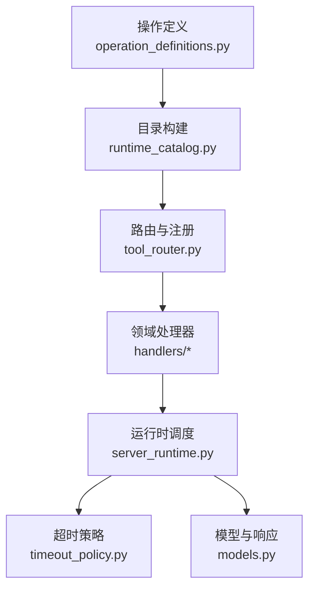
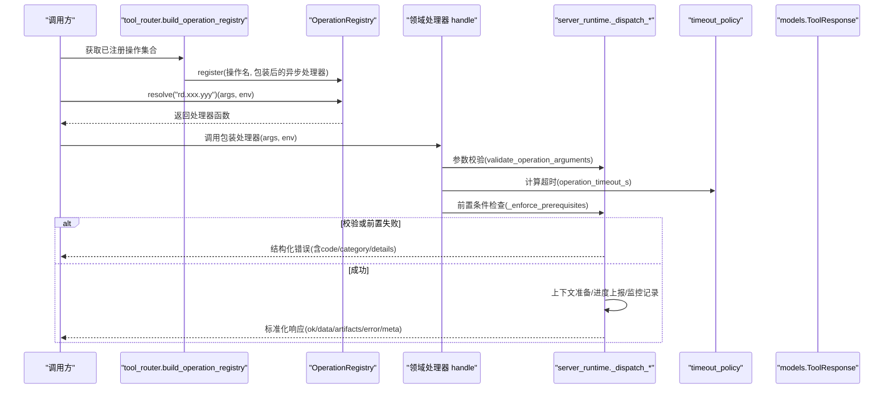
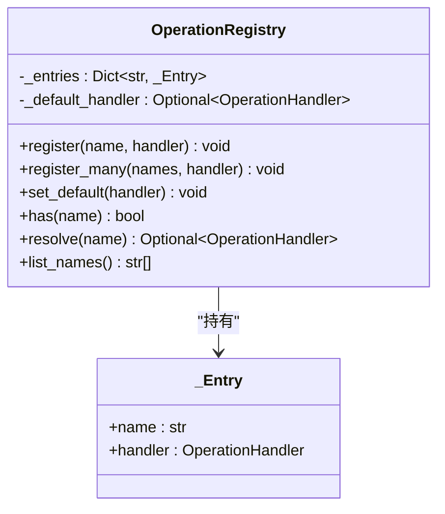
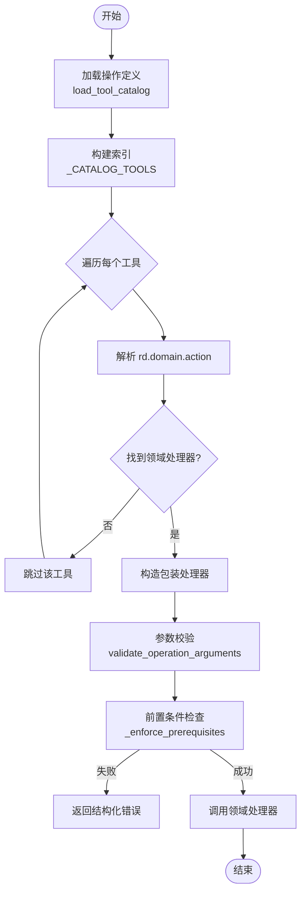
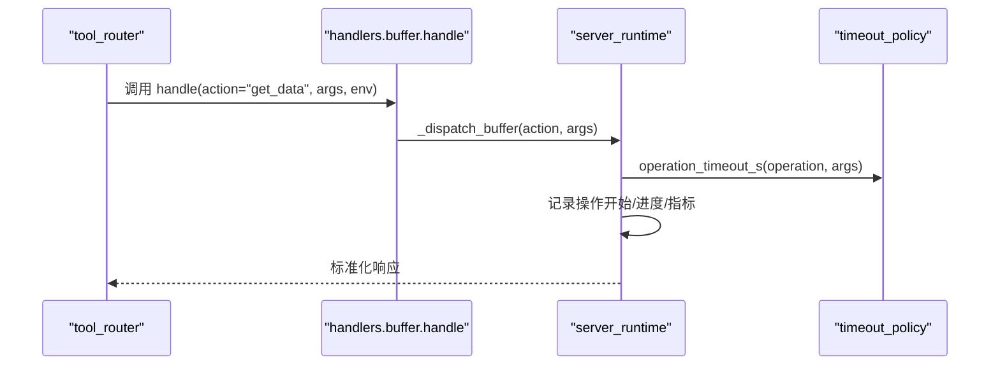
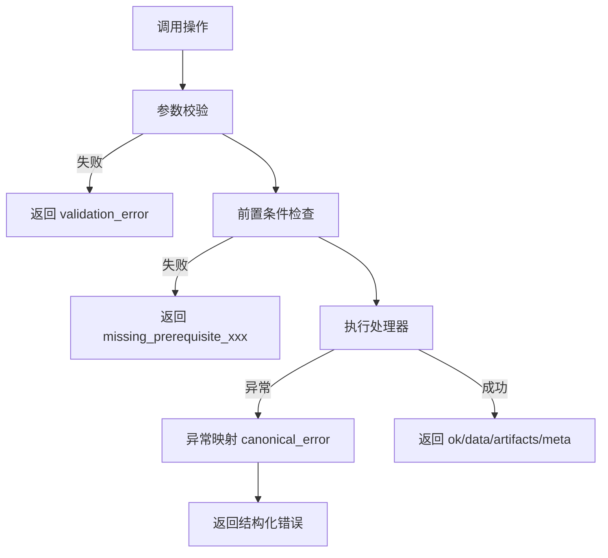
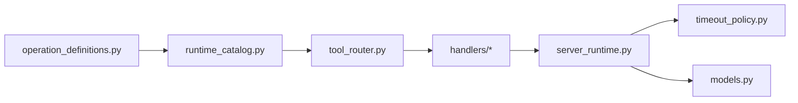

# 操作注册表

<cite>
**本文引用的文件**
- [operation_registry.py](file://rdc_tool/core/operation_registry.py)
- [tool_router.py](file://rdc_tool/tool_router.py)
- [runtime_catalog.py](file://rdc_tool/runtime_catalog.py)
- [operation_definitions.py](file://rdc_tool/operation_definitions.py)
- [server_runtime.py](file://rdc_tool/server_runtime.py)
- [handlers/core.py](file://rdc_tool/handlers/core.py)
- [handlers/buffer.py](file://rdc_tool/handlers/buffer.py)
- [timeout_policy.py](file://rdc_tool/timeout_policy.py)
- [models.py](file://rdc_tool/models.py)
</cite>

## 目录
1. [简介](#简介)
2. [项目结构](#项目结构)
3. [核心组件](#核心组件)
4. [架构总览](#架构总览)
5. [详细组件分析](#详细组件分析)
6. [依赖关系分析](#依赖关系分析)
7. [性能与监控](#性能与监控)
8. [故障排查指南](#故障排查指南)
9. [结论](#结论)
10. [附录：添加新操作的完整指南](#附录添加新操作的完整指南)

## 简介
本文件面向“操作注册表”机制，系统性说明 RDC 工具运行时如何动态发现、注册、校验并调用操作（Operation）。重点包括：
- OperationRegistry 的设计与职责：注册、解析、默认处理器、列表能力。
- 动态发现与加载：基于集中式操作定义生成目录，再按命名约定路由到领域处理器。
- 操作定义规范：参数校验、返回值格式、元数据管理（分组、作用域、前置条件等）。
- 装饰器与约定：当前实现以“声明式目录 + 命名约定”为主，而非 Python 装饰器；通过统一入口分发到各 handler。
- 版本与向后兼容：通过 schema_version、指纹、input_schema 约束保障兼容性。
- 错误处理与超时：统一的参数校验、前置条件检查、异常映射与超时策略。
- 性能分析与监控：指标采集、操作历史、进度上报与快照同步。

## 项目结构
RDC 的操作体系由“定义层 + 目录层 + 路由层 + 处理器层 + 执行层”构成：
- 定义层：集中描述所有公开操作及其输入输出、元数据。
- 目录层：从定义层构建可查询的工具目录，提供校验与描述能力。
- 路由层：根据操作名解析 domain 与 action，选择对应领域处理器，并在调用前做参数校验和前置条件检查。
- 处理器层：按领域划分的 handle(action, args, env)，内部委托给 server_runtime 的具体实现。
- 执行层：server_runtime 负责上下文准备、调度、结果封装、监控与错误处理。

**图表来源**
- [operation_definitions.py:1-800](file://rdc_tool/operation_definitions.py#L1-L800)
- [runtime_catalog.py:1-91](file://rdc_tool/runtime_catalog.py#L1-L91)
- [tool_router.py:1-156](file://rdc_tool/tool_router.py#L1-L156)
- [handlers/core.py:1-11](file://rdc_tool/handlers/core.py#L1-L11)
- [server_runtime.py:1-800](file://rdc_tool/server_runtime.py#L1-L800)
- [timeout_policy.py:1-104](file://rdc_tool/timeout_policy.py#L1-L104)
- [models.py:100-125](file://rdc_tool/models.py#L100-L125)

**章节来源**
- [operation_definitions.py:1-800](file://rdc_tool/operation_definitions.py#L1-L800)
- [runtime_catalog.py:1-91](file://rdc_tool/runtime_catalog.py#L1-L91)
- [tool_router.py:1-156](file://rdc_tool/tool_router.py#L1-L156)
- [server_runtime.py:1-800](file://rdc_tool/server_runtime.py#L1-L800)

## 核心组件
- OperationRegistry：轻量级异步处理器注册表，支持按名称注册、批量注册、默认处理器、存在性检查、解析与列出名称。
- ToolRouter：将目录中的每个操作映射为注册项，包装为统一入口，先做参数校验与前置条件检查，再委派到领域处理器。
- RuntimeCatalog：从集中式定义构建目录，提供 describe_operation 与 validate_operation_arguments。
- Handlers：按领域划分，统一签名 handle(action, args, env)，内部委托至 server_runtime 的 _dispatch_* 方法。
- ServerRuntime：上下文管理、调度、结果封装、监控、错误映射、预览同步等。
- TimeoutPolicy：按操作类型与参数计算超时时间，区分重/极重任务。

**章节来源**
- [operation_registry.py:1-45](file://rdc_tool/core/operation_registry.py#L1-L45)
- [tool_router.py:1-156](file://rdc_tool/tool_router.py#L1-L156)
- [runtime_catalog.py:1-91](file://rdc_tool/runtime_catalog.py#L1-L91)
- [handlers/core.py:1-11](file://rdc_tool/handlers/core.py#L1-L11)
- [handlers/buffer.py:1-11](file://rdc_tool/handlers/buffer.py#L1-L11)
- [server_runtime.py:1-800](file://rdc_tool/server_runtime.py#L1-L800)
- [timeout_policy.py:1-104](file://rdc_tool/timeout_policy.py#L1-L104)

## 架构总览
下图展示了从外部调用到具体处理器执行的完整链路，以及关键拦截点（参数校验、前置条件、超时、错误映射）。

**图表来源**
- [tool_router.py:131-154](file://rdc_tool/tool_router.py#L131-L154)
- [runtime_catalog.py:38-91](file://rdc_tool/runtime_catalog.py#L38-L91)
- [timeout_policy.py:56-104](file://rdc_tool/timeout_policy.py#L56-L104)
- [server_runtime.py:1-800](file://rdc_tool/server_runtime.py#L1-L800)
- [models.py:100-125](file://rdc_tool/models.py#L100-L125)

## 详细组件分析

### OperationRegistry 类设计
- 数据结构：内部维护 name -> _Entry(name, handler) 的字典，可选默认处理器。
- 注册：register(name, handler)、register_many(names, handler)。
- 解析：resolve(name) 优先精确匹配，否则回退到默认处理器。
- 能力：has(name) 判断是否存在可用处理器；list_names() 返回已注册名称排序列表。
- 复杂度：注册 O(1)，解析 O(1)，列表 O(n log n)。

**图表来源**
- [operation_registry.py:12-45](file://rdc_tool/core/operation_registry.py#L12-L45)

**章节来源**
- [operation_registry.py:1-45](file://rdc_tool/core/operation_registry.py#L1-L45)

### 动态操作发现与加载
- 定义集中化：所有公开操作在 operation_definitions.py 中以数组形式声明，包含 name、group、description、parameter_raw、returns_raw、param_names、prerequisites、namespace、input_schema、scope、effects、evidence_kind、path_inputs 等元数据。
- 目录构建：runtime_catalog.load_tool_catalog 去重并深拷贝定义；catalog_payload 生成 schema_version、source_path、fingerprint、tool_count、groups、tools。
- 路由注册：tool_router.build_operation_registry 遍历目录，解析 rd.domain.action，查找对应领域处理器，构造包装处理器并注册到 OperationRegistry。
- 参数校验：调用前先 validate_operation_arguments，依据 input_schema 进行类型、枚举、长度、数值范围、required、additionalProperties、oneOf/not 等校验。
- 前置条件：_enforce_prerequisites 读取上下文快照，检查 capture_file_id、session_id、remote_id、active_event_id、capability.remote 等是否满足。

**图表来源**
- [runtime_catalog.py:17-35](file://rdc_tool/runtime_catalog.py#L17-L35)
- [tool_router.py:56-154](file://rdc_tool/tool_router.py#L56-L154)
- [runtime_catalog.py:38-91](file://rdc_tool/runtime_catalog.py#L38-L91)

**章节来源**
- [operation_definitions.py:1-800](file://rdc_tool/operation_definitions.py#L1-L800)
- [runtime_catalog.py:1-91](file://rdc_tool/runtime_catalog.py#L1-L91)
- [tool_router.py:1-156](file://rdc_tool/tool_router.py#L1-L156)

### 处理器与调用流程
- 领域处理器统一签名：handle(action, args, env) -> Any，内部委托到 server_runtime 的 _dispatch_* 方法。
- 调用链示例（buffer）：
  - tool_router 包装处理器调用 buffer.handle。
  - buffer.handle 调用 server_runtime._dispatch_buffer。
  - server_runtime 完成上下文准备、进度上报、监控记录、结果封装。

**图表来源**
- [handlers/buffer.py:8-10](file://rdc_tool/handlers/buffer.py#L8-L10)
- [server_runtime.py:1-800](file://rdc_tool/server_runtime.py#L1-L800)
- [timeout_policy.py:56-104](file://rdc_tool/timeout_policy.py#L56-L104)

**章节来源**
- [handlers/core.py:1-11](file://rdc_tool/handlers/core.py#L1-L11)
- [handlers/buffer.py:1-11](file://rdc_tool/handlers/buffer.py#L1-L11)
- [server_runtime.py:1-800](file://rdc_tool/server_runtime.py#L1-L800)

### 操作定义的结构与规范
- 名称与分组：name 形如 rd.domain.action；group 用于分类展示。
- 描述与参数：description、parameter_raw、param_names、input_schema（JSON Schema 风格）。
- 返回值：returns_raw 描述 ok、data、artifacts、error、meta、projections。
- 前置条件：prerequisites 声明依赖（如 session_id、capture_file_id、remote_id），via_tools 给出推荐调用顺序，reason 解释原因。
- 作用域与影响：scope（global/replay）、effects（lifecycle、replay_position、artifact_write 等）。
- 路径输入：path_inputs 标记读写路径权限。
- 校验规则：input_schema 支持 type、enum、minimum/maximum、required、additionalProperties、oneOf/not、items 等。

**章节来源**
- [operation_definitions.py:1-800](file://rdc_tool/operation_definitions.py#L1-L800)
- [runtime_catalog.py:38-91](file://rdc_tool/runtime_catalog.py#L38-L91)

### 装饰器与约定
- 当前实现未使用 Python 装饰器来声明处理器，而是采用“集中式定义 + 命名约定 + 路由分发”的方式。
- 约定：
  - 操作名必须为 rd.domain.action。
  - 领域处理器位于 rdc_tool/handlers/<domain>.py，并提供 handle(action, args, env)。
  - 路由层自动将 rd.domain.action 映射到 handlers.<domain>.handle。
- 扩展方式：新增领域处理器模块并加入路由映射即可，无需修改核心注册逻辑。

**章节来源**
- [tool_router.py:34-54](file://rdc_tool/tool_router.py#L34-L54)
- [tool_router.py:131-154](file://rdc_tool/tool_router.py#L131-L154)

### 版本管理与向后兼容
- 目录指纹：catalog_payload 对工具列表计算 SHA256 指纹，便于检测变更与缓存失效。
- Schema 版本：schema_version 标识目录模式版本。
- 参数校验：input_schema 严格约束参数类型与组合，避免不兼容调用。
- 向后兼容策略：
  - 新增可选字段时保持 additionalProperties=False 的限制，确保未知参数报错，防止静默忽略。
  - 通过 oneOf/not 表达互斥或禁止的组合，保证语义一致性。
  - 通过 prerequisites 与 via_tools 引导调用顺序，降低破坏性变更风险。

**章节来源**
- [runtime_catalog.py:24-35](file://rdc_tool/runtime_catalog.py#L24-L35)
- [runtime_catalog.py:38-91](file://rdc_tool/runtime_catalog.py#L38-L91)

### 错误处理与超时机制
- 参数校验错误：validate_operation_arguments 抛出 ValueError，路由层捕获并转换为结构化错误（success=false，code=validation_error，category=validation）。
- 前置条件缺失：_enforce_prerequisites 返回结构化错误（missing_prerequisite_xxx），包含 prerequisite、via_tools、reason、tool_name。
- 异常映射：server_runtime 将内部异常映射为标准错误（canonical_error），统一 code、category、details。
- 超时策略：
  - 按操作名与参数计算超时（operation_timeout_s），区分重/极重任务。
  - 传输层额外缓冲（transport_timeout_s），daemon/worker 层分别应用不同超时。
  - 远程连接、回放打开、会话上下文等场景有特定超时值。

**图表来源**
- [tool_router.py:143-151](file://rdc_tool/tool_router.py#L143-L151)
- [runtime_catalog.py:38-91](file://rdc_tool/runtime_catalog.py#L38-L91)
- [timeout_policy.py:56-104](file://rdc_tool/timeout_policy.py#L56-L104)
- [server_runtime.py:1-800](file://rdc_tool/server_runtime.py#L1-L800)

**章节来源**
- [tool_router.py:64-128](file://rdc_tool/tool_router.py#L64-L128)
- [timeout_policy.py:1-104](file://rdc_tool/timeout_policy.py#L1-L104)
- [server_runtime.py:1-800](file://rdc_tool/server_runtime.py#L1-L800)

### 性能分析与监控集成
- 操作历史：core.get_operation_history 提供 trace-linked 操作历史，可按时间、状态、操作名过滤。
- 运行指标：core.get_runtime_metrics 返回 context 的自监控指标、限制配置、恢复摘要与最近操作统计。
- 进度上报：server_runtime 通过 ProgressReporter 上报阶段信息，记录到上下文快照。
- 快照同步：执行后 _postprocess_context_snapshot 更新上下文快照，保持预览与状态一致。
- 性能服务：PerfService 提供计数器采样与汇总，辅助定位热点事件。

**章节来源**
- [operation_definitions.py:324-393](file://rdc_tool/operation_definitions.py#L324-L393)
- [server_runtime.py:1-800](file://rdc_tool/server_runtime.py#L1-L800)

## 依赖关系分析
- 低耦合：OperationRegistry 仅关注注册与解析；ToolRouter 负责路由与校验；Handlers 专注领域逻辑；ServerRuntime 负责上下文与调度。
- 直接依赖：
  - tool_router 依赖 runtime_catalog、server_runtime、handlers。
  - runtime_catalog 依赖 operation_definitions。
  - handlers 依赖 server_runtime。
- 间接依赖：超时策略、模型、错误映射贯穿调用链。

**图表来源**
- [operation_definitions.py:1-800](file://rdc_tool/operation_definitions.py#L1-L800)
- [runtime_catalog.py:1-91](file://rdc_tool/runtime_catalog.py#L1-L91)
- [tool_router.py:1-156](file://rdc_tool/tool_router.py#L1-L156)
- [handlers/core.py:1-11](file://rdc_tool/handlers/core.py#L1-L11)
- [server_runtime.py:1-800](file://rdc_tool/server_runtime.py#L1-L800)
- [timeout_policy.py:1-104](file://rdc_tool/timeout_policy.py#L1-L104)
- [models.py:100-125](file://rdc_tool/models.py#L100-L125)

**章节来源**
- [tool_router.py:1-156](file://rdc_tool/tool_router.py#L1-L156)
- [server_runtime.py:1-800](file://rdc_tool/server_runtime.py#L1-L800)

## 性能与监控
- 建议实践：
  - 合理设置 scope 与 effects，避免不必要的状态变更。
  - 使用 path_inputs 明确路径访问权限，减少 I/O 风险。
  - 利用 prerequisites 与 via_tools 组织调用顺序，降低重试与回滚成本。
  - 针对大数据量操作（buffer/mesh/shader/perf/export）启用较重超时策略。
- 监控要点：
  - 定期查看 get_runtime_metrics 与 get_operation_history，识别慢操作与失败热点。
  - 结合 PerfService 的计数器与异常事件，定位性能瓶颈。
  - 通过进度上报与上下文快照，观察长耗时操作的阶段进展。

[本节为通用指导，不直接分析具体文件]

## 故障排查指南
- 参数校验失败：检查 input_schema 的 required、type、enum、minimum/maximum、additionalProperties、oneOf/not。
- 前置条件缺失：确认 session_id/capture_file_id/remote_id/active_event_id 是否已在上下文或参数中提供。
- 超时问题：根据操作类型调整超时策略，必要时拆分任务或增加资源。
- 异常映射：查看 canonical_error 的 code、category、details，定位错误来源。
- 预览与快照不一致：检查 _postprocess_context_snapshot 的执行时机与副作用。

**章节来源**
- [runtime_catalog.py:38-91](file://rdc_tool/runtime_catalog.py#L38-L91)
- [tool_router.py:64-128](file://rdc_tool/tool_router.py#L64-L128)
- [timeout_policy.py:56-104](file://rdc_tool/timeout_policy.py#L56-L104)
- [server_runtime.py:1-800](file://rdc_tool/server_runtime.py#L1-L800)

## 结论
RDC 的操作注册表通过“集中式定义 + 目录构建 + 路由分发 + 严格校验”的架构，实现了高内聚、低耦合的动态操作发现与加载。OperationRegistry 提供简洁的注册与解析接口；ToolRouter 将目录与处理器解耦；ServerRuntime 统一了上下文、监控、错误与超时策略。该设计便于扩展新操作、维护向后兼容性与提升系统可观测性。

[本节为总结，不直接分析具体文件]

## 附录：添加新操作的完整指南

### 步骤一：声明操作定义
- 在 operation_definitions.py 中添加一个条目，包含：
  - name：形如 rd.domain.action。
  - group/description：分类与说明。
  - parameter_raw/param_names：参数描述与名称列表。
  - returns_raw：返回值结构。
  - prerequisites：前置依赖与 via_tools。
  - namespace/scope/effects：作用域与影响。
  - input_schema：严格的 JSON Schema 约束。
  - path_inputs：路径访问权限。

**章节来源**
- [operation_definitions.py:1-800](file://rdc_tool/operation_definitions.py#L1-L800)

### 步骤二：实现领域处理器
- 若为新领域：在 rdc_tool/handlers 下新建 <domain>.py，提供 handle(action, args, env) 异步函数。
- 若为已有领域：在该领域的 handle 中新增 action 分支，委托到 server_runtime._dispatch_<domain>(action, args)。
- 遵循统一返回格式：ok、data、artifacts、error、meta、projections。

**章节来源**
- [handlers/core.py:1-11](file://rdc_tool/handlers/core.py#L1-L11)
- [handlers/buffer.py:1-11](file://rdc_tool/handlers/buffer.py#L1-L11)
- [server_runtime.py:1-800](file://rdc_tool/server_runtime.py#L1-L800)

### 步骤三：注册路由（如需新领域）
- 在 tool_router.py 的 _DOMAIN_HANDLERS 中添加新领域映射。
- 确保操作名符合 rd.domain.action 约定，以便自动解析。

**章节来源**
- [tool_router.py:34-54](file://rdc_tool/tool_router.py#L34-L54)
- [tool_router.py:131-154](file://rdc_tool/tool_router.py#L131-L154)

### 步骤四：编写测试
- 覆盖参数校验：传入非法参数，验证 validation_error。
- 覆盖前置条件：缺少依赖时，验证 missing_prerequisite_xxx。
- 覆盖正常路径：验证 ok/data/artifacts/meta。
- 覆盖超时：模拟长时间执行，验证超时策略生效。

**章节来源**
- [tests/test_cli_capture_open.py:251-403](file://tests/test_cli_capture_open.py#L251-L403)

### 步骤五：更新文档
- 在 operation_definitions.py 中完善 description、returns_raw、prerequisites、input_schema。
- 如有必要，更新相关文档（如 tools.md、tool-reference.md）。

**章节来源**
- [operation_definitions.py:1-800](file://rdc_tool/operation_definitions.py#L1-L800)