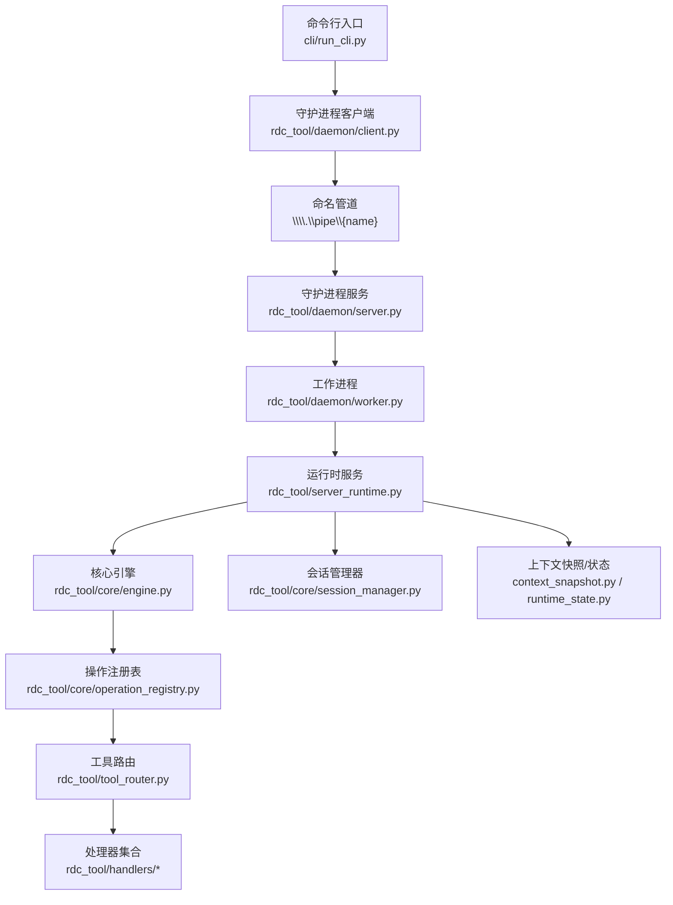
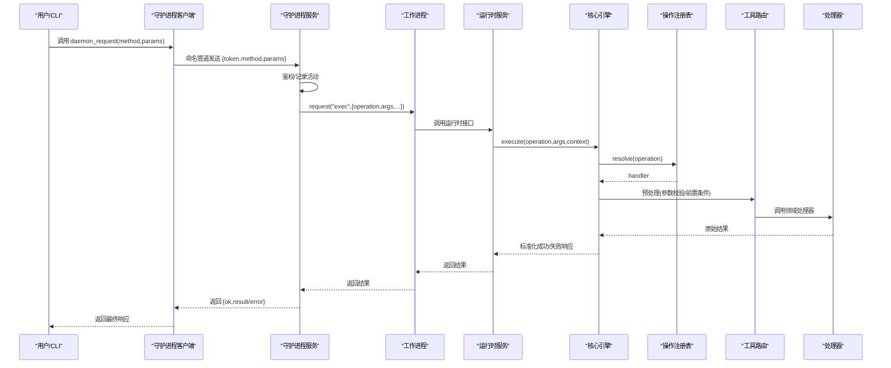
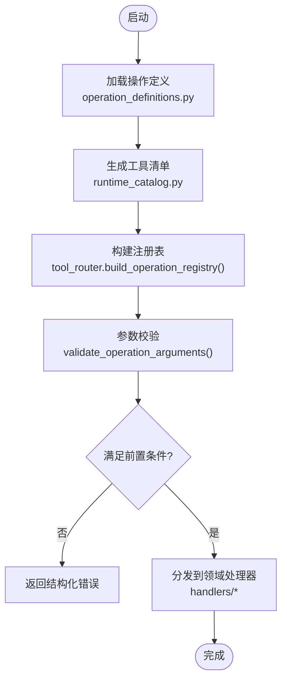
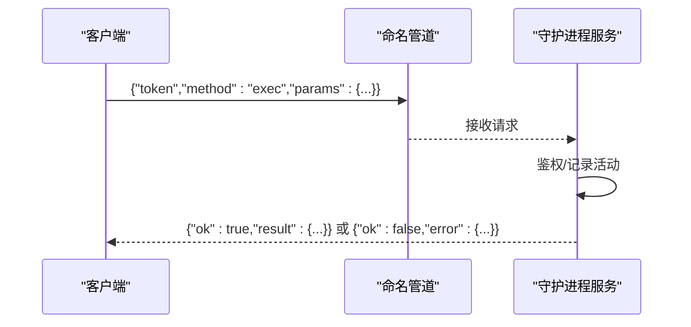
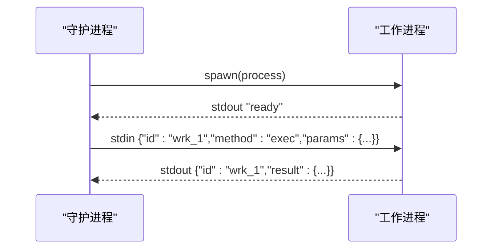
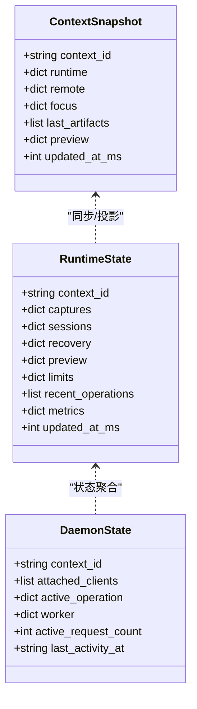
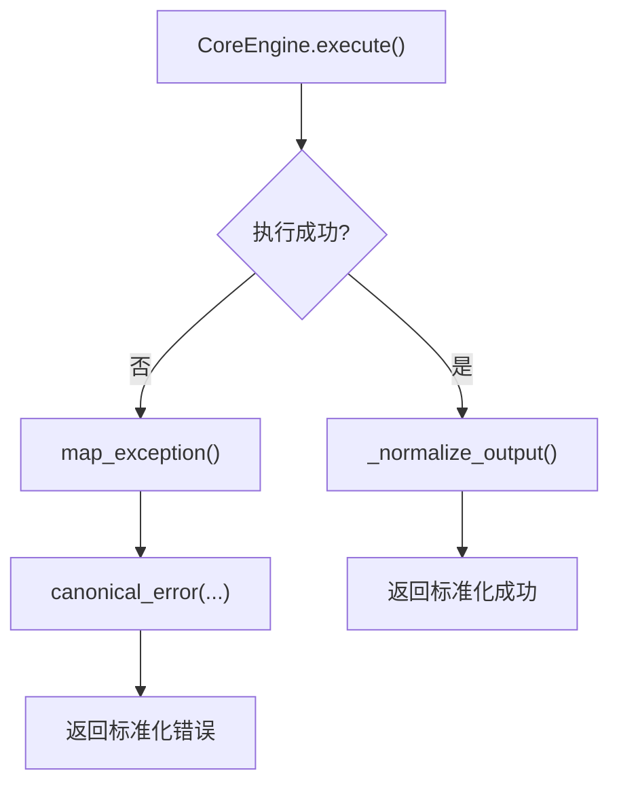
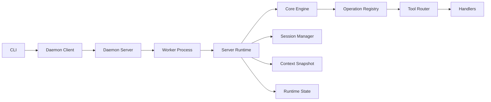

# 架构设计

<cite>
**本文引用的文件**
- [rdc_tool/core/engine.py](file://rdc_tool/core/engine.py)
- [rdc_tool/core/operation_registry.py](file://rdc_tool/core/operation_registry.py)
- [rdc_tool/tool_router.py](file://rdc_tool/tool_router.py)
- [rdc_tool/runtim_catalog.py](file://rdc_tool/runtime_catalog.py)
- [rdc_tool/operation_definitions.py](file://rdc_tool/operation_definitions.py)
- [rdc_tool/server_runtime.py](file://rdc_tool/server_runtime.py)
- [rdc_tool/handlers/core.py](file://rdc_tool/handlers/core.py)
- [rdc_tool/daemon/server.py](file://rdc_tool/daemon/server.py)
- [rdc_tool/daemon/client.py](file://rdc_tool/daemon/client.py)
- [rdc_tool/daemon/worker.py](file://rdc_tool/daemon/worker.py)
- [rdc_tool/context_snapshot.py](file://rdc_tool/context_snapshot.py)
- [rdc_tool/runtime_state.py](file://rdc_tool/runtime_state.py)
- [rdc_tool/core/session_manager.py](file://rdc_tool/core/session_manager.py)
</cite>

## 目录
1. [简介](#简介)
2. [项目结构](#项目结构)
3. [核心组件](#核心组件)
4. [架构总览](#架构总览)
5. [详细组件分析](#详细组件分析)
6. [依赖关系分析](#依赖关系分析)
7. [性能考虑](#性能考虑)
8. [故障排查指南](#故障排查指南)
9. [结论](#结论)
10. [附录](#附录)

## 简介
本架构设计文档面向 RDC-Tool（RDC）系统，系统性阐述分层架构与扩展机制：CLI 层、守护进程层、核心引擎层与处理器层的职责分离；操作注册与动态发现；守护进程的命名管道通信与消息协议；会话状态管理与上下文隔离；错误处理与异常传播；以及可扩展性与性能考量。文档提供组件交互图与数据处理流程图，帮助读者快速理解并扩展系统。

## 项目结构
RDC-Tool 采用“分层 + 插件化”的组织方式：
- CLI 层：用户入口，负责参数解析与调用守护进程。
- 守护进程层：基于 Windows 命名管道的长驻服务，负责认证、连接管理、生命周期控制、工作进程调度与状态持久化。
- 核心引擎层：统一执行引擎，负责操作路由、输出规范化、产物发布、指标与追踪元数据注入。
- 处理器层：按领域划分的操作处理器（buffer/capture/core/debug/...），通过目录组织，便于扩展。
- 运行时层：封装 RenderDoc 回放/远程能力、会话管理、预览、事件图等。
- 配置与目录：工具清单、操作定义、运行时路径、快照与状态持久化。

**图表来源**
- [rdc_tool/daemon/server.py:102-169](file://rdc_tool/daemon/server.py#L102-L169)
- [rdc_tool/daemon/client.py:467-515](file://rdc_tool/daemon/client.py#L467-L515)
- [rdc_tool/daemon/worker.py:24-143](file://rdc_tool/daemon/worker.py#L24-L143)
- [rdc_tool/server_runtime.py:1-120](file://rdc_tool/server_runtime.py#L1-L120)
- [rdc_tool/core/engine.py:30-75](file://rdc_tool/core/engine.py#L30-L75)
- [rdc_tool/core/operation_registry.py:18-43](file://rdc_tool/core/operation_registry.py#L18-L43)
- [rdc_tool/tool_router.py:131-154](file://rdc_tool/tool_router.py#L131-L154)

**章节来源**
- [rdc_tool/daemon/server.py:102-169](file://rdc_tool/daemon/server.py#L102-L169)
- [rdc_tool/daemon/client.py:467-515](file://rdc_tool/daemon/client.py#L467-L515)
- [rdc_tool/daemon/worker.py:24-143](file://rdc_tool/daemon/worker.py#L24-L143)
- [rdc_tool/server_runtime.py:1-120](file://rdc_tool/server_runtime.py#L1-L120)
- [rdc_tool/core/engine.py:30-75](file://rdc_tool/core/engine.py#L30-L75)
- [rdc_tool/core/operation_registry.py:18-43](file://rdc_tool/core/operation_registry.py#L18-L43)
- [rdc_tool/tool_router.py:131-154](file://rdc_tool/tool_router.py#L131-L154)

## 核心组件
- 核心引擎 CoreEngine：统一入口，负责操作解析、执行、输出标准化、产物发布、耗时与追踪元信息注入。
- 操作注册表 OperationRegistry：维护操作名到处理器的映射，支持默认处理器与批量注册。
- 工具路由 tool_router：从操作定义加载工具清单，构建注册表，并在调用前进行参数校验与前置条件检查。
- 守护进程 DaemonRuntime：命名管道服务端，负责认证、连接与会话管理、工作进程生命周期、状态持久化与清理。
- 工作进程 RuntimeWorkerProcess：子进程封装 RenderDoc 运行时，通过标准输入输出进行 JSON 消息通信。
- 运行时 server_runtime：集中管理配置、会话、预览、事件图、渲染服务等，提供 _dispatch_core 等分发能力。
- 会话管理 SessionManager：创建/打开/关闭会话，管理本地/远端回放控制器与输出，资源清理。
- 上下文快照与状态 context_snapshot / runtime_state：跨进程共享的上下文快照与持久化状态，含保留策略与并发锁。

**章节来源**
- [rdc_tool/core/engine.py:30-204](file://rdc_tool/core/engine.py#L30-L204)
- [rdc_tool/core/operation_registry.py:18-43](file://rdc_tool/core/operation_registry.py#L18-L43)
- [rdc_tool/tool_router.py:131-154](file://rdc_tool/tool_router.py#L131-L154)
- [rdc_tool/daemon/server.py:102-643](file://rdc_tool/daemon/server.py#L102-L643)
- [rdc_tool/daemon/worker.py:24-203](file://rdc_tool/daemon/worker.py#L24-L203)
- [rdc_tool/server_runtime.py:1-120](file://rdc_tool/server_runtime.py#L1-L120)
- [rdc_tool/core/session_manager.py:148-293](file://rdc_tool/core/session_manager.py#L148-L293)
- [rdc_tool/context_snapshot.py:174-220](file://rdc_tool/context_snapshot.py#L174-L220)
- [rdc_tool/runtime_state.py:104-149](file://rdc_tool/runtime_state.py#L104-L149)

## 架构总览
RDC-Tool 采用四层架构：
- CLI 层：发起请求，启动/连接守护进程，发送方法调用。
- 守护进程层：接收请求，鉴权，转发至工作进程，维护上下文与状态。
- 核心引擎层：统一执行与标准化输出，桥接处理器与运行时。
- 处理器层：按领域实现具体业务逻辑，访问运行时能力。

**图表来源**
- [rdc_tool/daemon/client.py:467-515](file://rdc_tool/daemon/client.py#L467-L515)
- [rdc_tool/daemon/server.py:572-643](file://rdc_tool/daemon/server.py#L572-L643)
- [rdc_tool/daemon/worker.py:144-170](file://rdc_tool/daemon/worker.py#L144-L170)
- [rdc_tool/core/engine.py:40-75](file://rdc_tool/core/engine.py#L40-L75)
- [rdc_tool/tool_router.py:131-154](file://rdc_tool/tool_router.py#L131-L154)
- [rdc_tool/handlers/core.py:8-9](file://rdc_tool/handlers/core.py#L8-L9)

## 详细组件分析

### 操作注册与动态发现机制
- 操作定义集中声明于 operation_definitions.py，包含名称、分组、描述、输入/输出约束、前置条件与作用域。
- runtime_catalog.py 读取并去重操作定义，生成工具清单，供路由层使用。
- tool_router.py 将工具清单映射为处理器，构建 OperationRegistry，并在执行前进行参数校验与前置条件检查。
- 新增处理器只需在 handlers 目录下实现对应模块，并在 tool_router 中注册域名映射即可被动态发现。

**图表来源**
- [rdc_tool/operation_definitions.py:1-120](file://rdc_tool/operation_definitions.py#L1-L120)
- [rdc_tool/runtime_catalog.py:17-28](file://rdc_tool/runtime_catalog.py#L17-L28)
- [rdc_tool/tool_router.py:131-154](file://rdc_tool/tool_router.py#L131-L154)

**章节来源**
- [rdc_tool/operation_definitions.py:1-120](file://rdc_tool/operation_definitions.py#L1-L120)
- [rdc_tool/runtime_catalog.py:17-28](file://rdc_tool/runtime_catalog.py#L17-L28)
- [rdc_tool/tool_router.py:131-154](file://rdc_tool/tool_router.py#L131-L154)

### 守护进程进程间通信与消息协议
- 通信通道：Windows 命名管道，地址格式 \\.pipe\{pipe_name}。
- 认证：请求携带 token，服务端校验通过后处理。
- 消息协议：JSON 对象，包含 method、params、token；响应包含 ok、result 或 error。
- 客户端：daemon_request 负责连接、超时轮询、诊断信息收集。
- 服务端：handle_request 分派方法（ping/status/shutdown/attach_client/heartbeat/detach_client/set_state/get_state/clear_context/exec）。

**图表来源**
- [rdc_tool/daemon/client.py:467-515](file://rdc_tool/daemon/client.py#L467-L515)
- [rdc_tool/daemon/server.py:572-643](file://rdc_tool/daemon/server.py#L572-L643)

**章节来源**
- [rdc_tool/daemon/client.py:467-515](file://rdc_tool/daemon/client.py#L467-L515)
- [rdc_tool/daemon/server.py:572-643](file://rdc_tool/daemon/server.py#L572-L643)

### 工作进程与运行时集成
- 工作进程由守护进程通过 subprocess 启动，设置环境变量（上下文 ID、RenderDoc 路径等）。
- 工作进程通过标准输入输出以 JSON 行协议通信，包含 id、method、params 与响应。
- 工作进程等待 ready 信号，超时或启动错误会抛出异常。
- 守护进程在工作进程不可用时自动重启并重试。

**图表来源**
- [rdc_tool/daemon/worker.py:69-143](file://rdc_tool/daemon/worker.py#L69-L143)
- [rdc_tool/daemon/worker.py:144-170](file://rdc_tool/daemon/worker.py#L144-L170)

**章节来源**
- [rdc_tool/daemon/worker.py:69-170](file://rdc_tool/daemon/worker.py#L69-L170)

### 会话状态管理与上下文隔离
- 上下文快照 context_snapshot：保存 session_id、capture_file_id、frame_index、active_event_id、backend_type、remote 信息等，支持保留策略与并发锁。
- 运行时状态 runtime_state：持久化 captures/sessions/recovery/preview/metrics/recent_operations，支持限制与恢复摘要。
- 守护进程状态：记录 attached_clients、active_operation、worker 信息，支持租约与空闲超时清理。
- 隔离策略：按 context_id 区分不同上下文，文件名与锁文件均带上下文后缀，避免交叉污染。

**图表来源**
- [rdc_tool/context_snapshot.py:242-279](file://rdc_tool/context_snapshot.py#L242-L279)
- [rdc_tool/runtime_state.py:104-149](file://rdc_tool/runtime_state.py#L104-L149)
- [rdc_tool/daemon/server.py:129-159](file://rdc_tool/daemon/server.py#L129-L159)

**章节来源**
- [rdc_tool/context_snapshot.py:242-279](file://rdc_tool/context_snapshot.py#L242-L279)
- [rdc_tool/runtime_state.py:104-149](file://rdc_tool/runtime_state.py#L104-L149)
- [rdc_tool/daemon/server.py:129-159](file://rdc_tool/daemon/server.py#L129-L159)

### 错误处理与异常传播
- 核心引擎捕获所有异常，映射为标准错误结构，包含 code、category、message、details、trace_id、transport、duration_ms。
- 工具路由在执行前进行参数校验与前置条件检查，失败时返回结构化错误。
- 守护进程对未知方法、无效请求、工作进程错误进行统一包装与日志记录。
- 工作进程启动失败或超时，向上抛出异常，守护进程可重试或终止。

**图表来源**
- [rdc_tool/core/engine.py:40-75](file://rdc_tool/core/engine.py#L40-L75)
- [rdc_tool/tool_router.py:143-151](file://rdc_tool/tool_router.py#L143-L151)
- [rdc_tool/daemon/server.py:572-643](file://rdc_tool/daemon/server.py#L572-L643)

**章节来源**
- [rdc_tool/core/engine.py:40-75](file://rdc_tool/core/engine.py#L40-L75)
- [rdc_tool/tool_router.py:143-151](file://rdc_tool/tool_router.py#L143-L151)
- [rdc_tool/daemon/server.py:572-643](file://rdc_tool/daemon/server.py#L572-L643)

### 扩展点与插件机制
- 处理器扩展：在 rdc_tool/handlers 下新增模块，实现 handle(action, args, env)，并在 tool_router 中注册域名映射。
- 操作定义扩展：在 operation_definitions.py 添加新条目，包含 input_schema、prerequisites、scope/effects 等。
- 运行时能力扩展：通过 server_runtime 暴露新的分发方法或能力查询，供处理器调用。
- 工作进程扩展：如需新增命令，可在工作进程中增加方法处理与响应格式。

**章节来源**
- [rdc_tool/tool_router.py:34-54](file://rdc_tool/tool_router.py#L34-L54)
- [rdc_tool/operation_definitions.py:1-120](file://rdc_tool/operation_definitions.py#L1-L120)
- [rdc_tool/server_runtime.py:1-120](file://rdc_tool/server_runtime.py#L1-L120)
- [rdc_tool/daemon/worker.py:144-170](file://rdc_tool/daemon/worker.py#L144-L170)

## 依赖关系分析
- CLI 依赖守护进程客户端，通过命名管道与服务端通信。
- 守护进程依赖工作进程与运行时服务，管理状态与生命周期。
- 核心引擎依赖操作注册表与工具路由，统一执行与标准化输出。
- 处理器依赖运行时服务，访问会话、预览、事件图等能力。
- 上下文快照与状态被多组件共享，确保一致性。

**图表来源**
- [rdc_tool/daemon/client.py:467-515](file://rdc_tool/daemon/client.py#L467-L515)
- [rdc_tool/daemon/server.py:572-643](file://rdc_tool/daemon/server.py#L572-L643)
- [rdc_tool/daemon/worker.py:144-170](file://rdc_tool/daemon/worker.py#L144-L170)
- [rdc_tool/server_runtime.py:1-120](file://rdc_tool/server_runtime.py#L1-L120)
- [rdc_tool/core/engine.py:40-75](file://rdc_tool/core/engine.py#L40-L75)
- [rdc_tool/core/operation_registry.py:18-43](file://rdc_tool/core/operation_registry.py#L18-L43)
- [rdc_tool/tool_router.py:131-154](file://rdc_tool/tool_router.py#L131-L154)

**章节来源**
- [rdc_tool/daemon/client.py:467-515](file://rdc_tool/daemon/client.py#L467-L515)
- [rdc_tool/daemon/server.py:572-643](file://rdc_tool/daemon/server.py#L572-L643)
- [rdc_tool/daemon/worker.py:144-170](file://rdc_tool/daemon/worker.py#L144-L170)
- [rdc_tool/server_runtime.py:1-120](file://rdc_tool/server_runtime.py#L1-L120)
- [rdc_tool/core/engine.py:40-75](file://rdc_tool/core/engine.py#L40-L75)
- [rdc_tool/core/operation_registry.py:18-43](file://rdc_tool/core/operation_registry.py#L18-L43)
- [rdc_tool/tool_router.py:131-154](file://rdc_tool/tool_router.py#L131-L154)

## 性能考虑
- 异步执行与线程池：核心引擎与工作进程使用异步与线程模型，避免阻塞主循环。
- 超时与重试：守护进程与工作进程均有超时控制，失败时自动重试或终止。
- 状态持久化：原子写入与文件锁，减少竞争与损坏风险。
- 资源限制：运行时限制上下文数量、会话数、捕获文件大小与内存估算，防止资源耗尽。
- 产物发布：按需发布大对象到临时目录，避免 JSON 过大导致传输瓶颈。

[本节为通用指导，不直接分析具体文件]

## 故障排查指南
- 守护进程无响应：检查命名管道是否可用，token 是否正确，查看最近活动与活跃操作。
- 工作进程启动失败：查看启动日志与 ready 信号，确认环境路径与依赖。
- 会话无法打开：检查捕获文件有效性、本地/远端回放能力与权限。
- 上下文冲突：清理残留状态文件，确保上下文唯一性。
- 超时错误：调整超时参数，检查网络与远端设备状态。

**章节来源**
- [rdc_tool/daemon/client.py:467-515](file://rdc_tool/daemon/client.py#L467-L515)
- [rdc_tool/daemon/worker.py:121-136](file://rdc_tool/daemon/worker.py#L121-L136)
- [rdc_tool/core/session_manager.py:347-382](file://rdc_tool/core/session_manager.py#L347-L382)
- [rdc_tool/context_snapshot.py:447-475](file://rdc_tool/context_snapshot.py#L447-L475)
- [rdc_tool/runtime_state.py:388-416](file://rdc_tool/runtime_state.py#L388-L416)

## 结论
RDC-Tool 通过清晰的分层架构与插件化设计，实现了高内聚、低耦合的系统结构。核心引擎统一执行与标准化输出，守护进程提供稳定的进程间通信与生命周期管理，处理器按领域划分便于扩展。上下文快照与状态持久化确保跨进程一致性与恢复能力。错误处理与性能优化贯穿各层，保障系统的健壮性与可扩展性。

[本节为总结，不直接分析具体文件]

## 附录
- 术语表：
  - 上下文（Context）：隔离的运行环境标识，用于区分不同会话与资源。
  - 会话（Session）：回放或远程连接的抽象，持有控制器与输出。
  - 捕获（Capture）：图形 API 调用的录制文件，支持回放。
  - 产物（Artifact）：操作产生的文件或数据，可发布到临时目录。
- 参考路径：
  - 操作定义：rdc_tool/operation_definitions.py
  - 工具清单：rdc_tool/runtime_catalog.py
  - 处理器目录：rdc_tool/handlers/*
  - 守护进程：rdc_tool/daemon/server.py
  - 工作进程：rdc_tool/daemon/worker.py
  - 核心引擎：rdc_tool/core/engine.py
  - 会话管理：rdc_tool/core/session_manager.py
  - 上下文快照：rdc_tool/context_snapshot.py
  - 运行时状态：rdc_tool/runtime_state.py

[本节为补充信息，不直接分析具体文件]