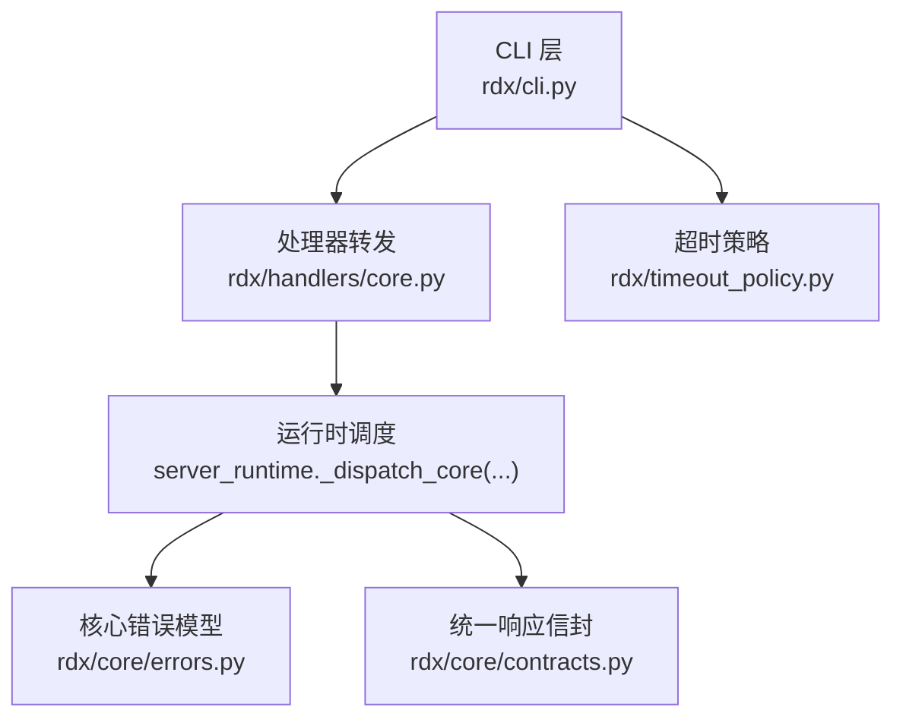
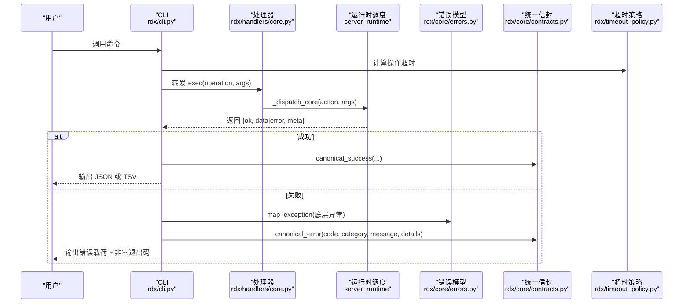
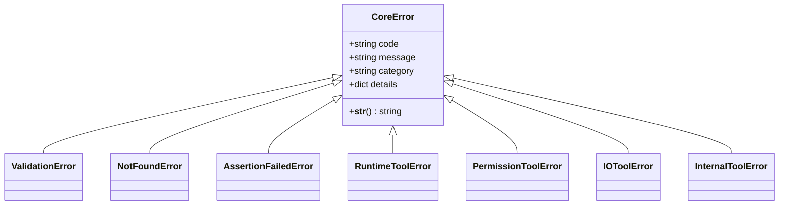
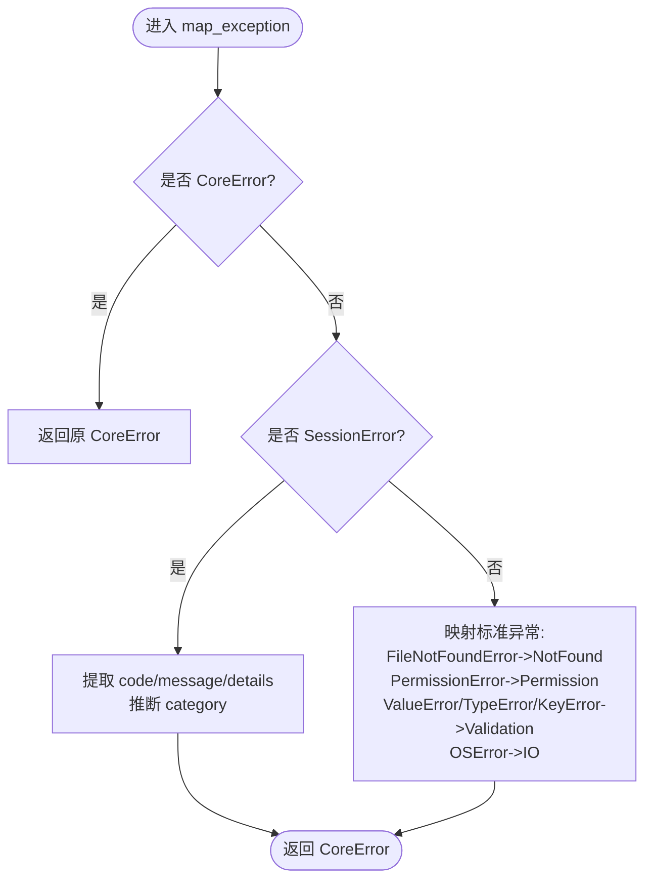
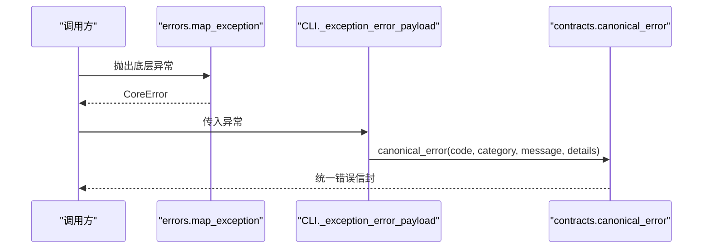
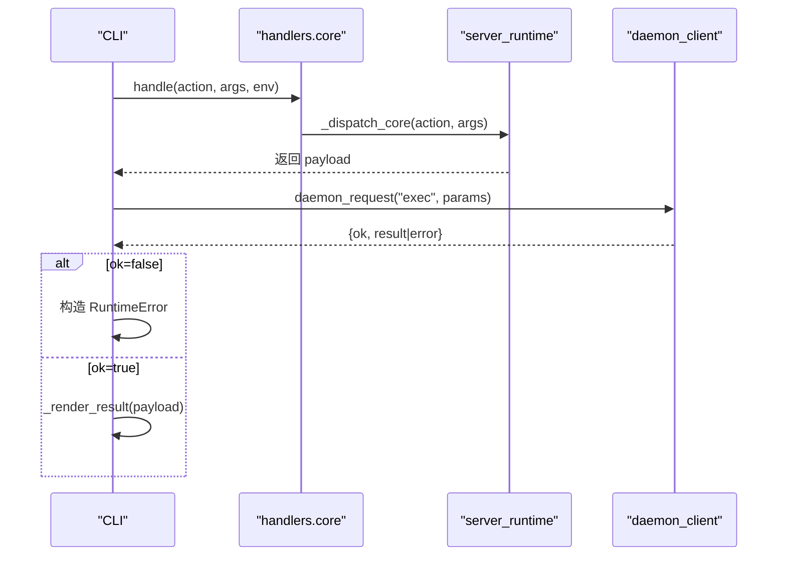
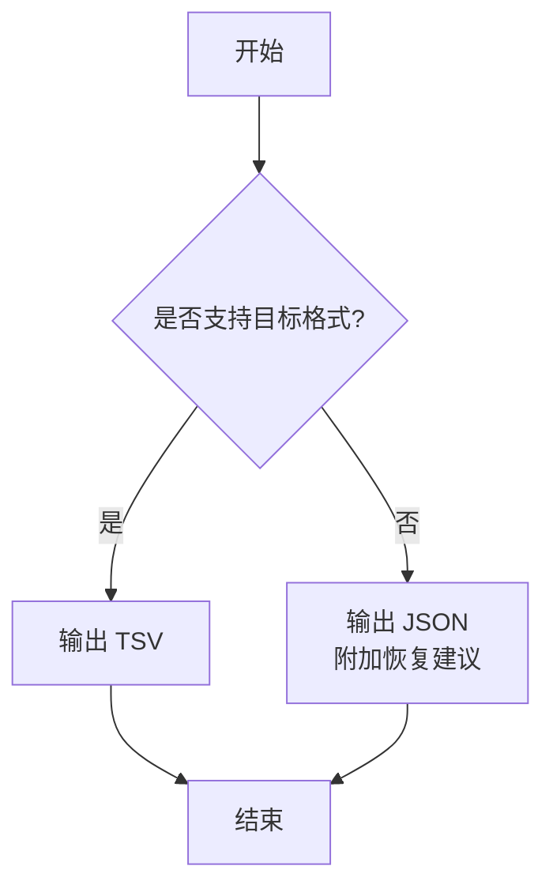
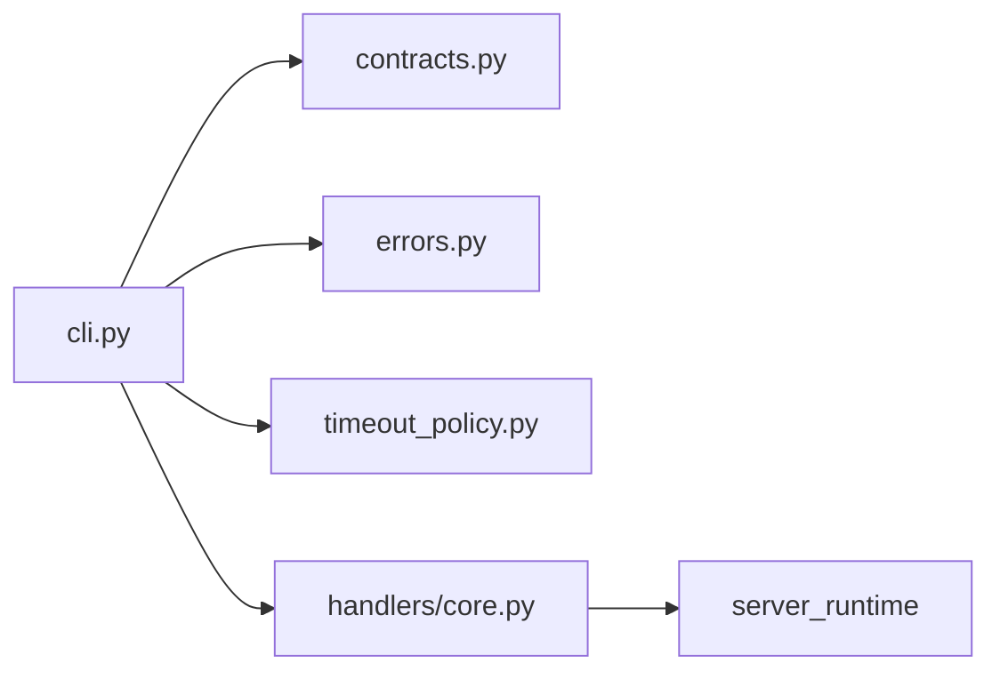

# 错误处理策略

<cite>
**本文引用的文件**
- [rdx/core/errors.py](file://rdx/core/errors.py)
- [rdx/core/contracts.py](file://rdx/core/contracts.py)
- [rdx/cli.py](file://rdx/cli.py)
- [rdx/timeout_policy.py](file://rdx/timeout_policy.py)
- [rdx/handlers/core.py](file://rdx/handlers/core.py)
</cite>

## 目录
1. [简介](#简介)
2. [项目结构](#项目结构)
3. [核心组件](#核心组件)
4. [架构总览](#架构总览)
5. [详细组件分析](#详细组件分析)
6. [依赖关系分析](#依赖关系分析)
7. [性能考虑](#性能考虑)
8. [故障排查指南](#故障排查指南)
9. [结论](#结论)
10. [附录](#附录)

## 简介
本文件系统性阐述 RDC-Tool 的错误处理策略，覆盖统一错误分类、CoreError 基类与继承层次、异常到标准化错误的映射、结构化错误信息（错误代码、类别、消息、详细信息）、从处理器层到 CLI 层的错误传播与格式化、重试与降级策略、编程实践以及日志与诊断信息收集方法。目标是让开发者与使用者都能以一致的方式理解、捕获和处理错误，并据此进行排障与优化。

## 项目结构
围绕错误处理的关键模块如下：
- rdx/core/errors.py：定义 CoreError 及其子类，提供 map_exception 将底层异常映射为统一错误对象。
- rdx/core/contracts.py：定义统一的响应信封 canonical_success/canonical_error，用于 CLI 输出和跨进程通信。
- rdx/cli.py：CLI 入口，负责捕获异常、构造错误载荷、渲染结果或错误、设置退出码。
- rdx/timeout_policy.py：超时策略，决定不同操作的超时时长，间接影响错误传播（如超时导致的失败）。
- rdx/handlers/core.py：处理器转发层，调用 server_runtime 执行核心操作。

**图表来源**
- [rdx/cli.py:243-264](file://rdx/cli.py#L243-L264)
- [rdx/handlers/core.py:8-9](file://rdx/handlers/core.py#L8-L9)
- [rdx/core/errors.py:9-119](file://rdx/core/errors.py#L9-L119)
- [rdx/core/contracts.py:98-164](file://rdx/core/contracts.py#L98-L164)
- [rdx/timeout_policy.py:56-95](file://rdx/timeout_policy.py#L56-L95)

**章节来源**
- [rdx/core/errors.py:9-119](file://rdx/core/errors.py#L9-L119)
- [rdx/core/contracts.py:98-164](file://rdx/core/contracts.py#L98-L164)
- [rdx/cli.py:107-118](file://rdx/cli.py#L107-L118)
- [rdx/timeout_policy.py:56-95](file://rdx/timeout_policy.py#L56-L95)
- [rdx/handlers/core.py:8-9](file://rdx/handlers/core.py#L8-L9)

## 核心组件
- CoreError 基类与子类：提供统一的错误结构（code、message、category、details），便于上层统一处理与展示。
- map_exception：将常见 Python 异常与 SessionError 等转换为 CoreError，确保下游只面对统一错误类型。
- canonical_error/canonical_success：构建标准化的 JSON 信封，包含 ok、error/data、meta、projections 等字段，贯穿 CLI 输出与跨进程通信。
- CLI 错误封装：_exception_error_payload 将异常转为标准错误载荷；_render_result 根据 ok 字段决定成功/失败路径与退出码。
- 超时策略：按操作类型配置超时，避免长时间阻塞，并在超时时以统一错误形式返回。

**章节来源**
- [rdx/core/errors.py:9-119](file://rdx/core/errors.py#L9-L119)
- [rdx/core/contracts.py:98-164](file://rdx/core/contracts.py#L98-L164)
- [rdx/cli.py:107-118](file://rdx/cli.py#L107-L118)
- [rdx/cli.py:385-394](file://rdx/cli.py#L385-L394)
- [rdx/timeout_policy.py:56-95](file://rdx/timeout_policy.py#L56-L95)

## 架构总览
下图展示了从 CLI 发起请求到核心执行、错误映射与返回的完整流程，包括超时控制与统一信封包装。

**图表来源**
- [rdx/cli.py:243-264](file://rdx/cli.py#L243-L264)
- [rdx/handlers/core.py:8-9](file://rdx/handlers/core.py#L8-L9)
- [rdx/core/errors.py:90-119](file://rdx/core/errors.py#L90-L119)
- [rdx/core/contracts.py:98-164](file://rdx/core/contracts.py#L98-L164)
- [rdx/timeout_policy.py:56-95](file://rdx/timeout_policy.py#L56-L95)

## 详细组件分析

### CoreError 基类与继承层次
- CoreError：包含 code、message、category、details，提供稳定的错误分类与扩展点。
- 具体错误类型：
  - ValidationError：参数校验失败（validation）
  - NotFoundError：资源不存在（not_found）
  - AssertionFailedError：断言失败（assertion_failed）
  - RuntimeToolError：运行时错误（runtime）
  - PermissionToolError：权限错误（permission）
  - IOToolError：IO 错误（io）
  - InternalToolError：内部错误（internal）

**图表来源**
- [rdx/core/errors.py:9-87](file://rdx/core/errors.py#L9-L87)

**章节来源**
- [rdx/core/errors.py:9-87](file://rdx/core/errors.py#L9-L87)

### 异常到标准化错误的映射机制
map_exception 的职责：
- 若已是 CoreError，直接返回。
- 尝试导入并匹配 SessionError，提取 detail.code/message/details，并按 code 后缀推断 category。
- 将 FileNotFoundError -> NotFoundError，PermissionError -> PermissionToolError，ValueError/TypeError/KeyError -> ValidationError，OSError -> IOToolError。
- 其他未知异常归为 InternalToolError。

**图表来源**
- [rdx/core/errors.py:90-119](file://rdx/core/errors.py#L90-L119)

**章节来源**
- [rdx/core/errors.py:90-119](file://rdx/core/errors.py#L90-L119)

### 结构化错误信息与统一信封
- 错误结构：code、category、message、details，保证机器可读与人类可读。
- 统一信封：canonical_error 生成 {ok: false, error: {...}, meta: {...}}；canonical_success 生成 {ok: true, data: {...}, meta: {...}}。
- CLI 侧通过 _exception_error_payload 将异常转为标准错误载荷，并通过 _render_result 输出 JSON/TSV 或错误。

**图表来源**
- [rdx/core/errors.py:90-119](file://rdx/core/errors.py#L90-L119)
- [rdx/cli.py:107-118](file://rdx/cli.py#L107-L118)
- [rdx/core/contracts.py:129-164](file://rdx/core/contracts.py#L129-L164)

**章节来源**
- [rdx/cli.py:107-118](file://rdx/cli.py#L107-L118)
- [rdx/core/contracts.py:129-164](file://rdx/core/contracts.py#L129-L164)

### 错误传播策略：从处理器层到 CLI 层
- 处理器层：handlers.core.handle 将 action 转发给 server_runtime._dispatch_core。
- CLI 层：_daemon_exec 调用 daemon_request，若 resp.ok 为假则构造 RuntimeError；否则解析 result 并交由 _render_result 输出。
- 渲染阶段：若 output_format=tsv 且 ok=true，尝试渲染表格；否则输出 JSON。错误时返回非零退出码。

**图表来源**
- [rdx/handlers/core.py:8-9](file://rdx/handlers/core.py#L8-L9)
- [rdx/cli.py:243-264](file://rdx/cli.py#L243-L264)
- [rdx/cli.py:385-394](file://rdx/cli.py#L385-L394)

**章节来源**
- [rdx/handlers/core.py:8-9](file://rdx/handlers/core.py#L8-L9)
- [rdx/cli.py:243-264](file://rdx/cli.py#L243-L264)
- [rdx/cli.py:385-394](file://rdx/cli.py#L385-L394)

### 重试机制与降级策略
- 重试：当前代码未实现显式重试逻辑。建议在调用 daemon_request 或网络相关操作处，基于错误类别（如 io、runtime）与可恢复性（如连接超时）实现指数退避重试。
- 降级：
  - 当 tsv 投影不可用时，回退为 JSON 输出并提示使用 --format json。
  - 当 daemon 状态异常时，清理残留状态并尝试重新加载，必要时返回“未运行”的成功负载。
  - 当 catalog 加载失败时，在 doctor 中记录错误并继续诊断。

**图表来源**
- [rdx/cli.py:330-394](file://rdx/cli.py#L330-L394)

**章节来源**
- [rdx/cli.py:330-394](file://rdx/cli.py#L330-L394)

### 编程指南：如何正确抛出与处理异常
- 在业务层优先抛出 CoreError 或其子类，携带清晰的 code、message、details。
- 对第三方或底层异常，使用 map_exception 转换为 CoreError，再向上抛出。
- 在 CLI 层捕获异常，使用 _exception_error_payload 与 canonical_error 构造统一错误载荷，并输出到 stdout。
- 对于需要重试的操作，依据 timeout_policy 计算的超时值，结合错误类别决定是否重试及重试次数。
- 对于可能失败的可选功能（如 tsv 投影），实现降级路径，确保主流程不中断。

**章节来源**
- [rdx/core/errors.py:90-119](file://rdx/core/errors.py#L90-L119)
- [rdx/cli.py:107-118](file://rdx/cli.py#L107-L118)
- [rdx/timeout_policy.py:56-95](file://rdx/timeout_policy.py#L56-L95)

### 日志记录与诊断信息收集
- 统一信封中的 meta 字段可用于携带 trace_id、transport、duration_ms 等诊断信息。
- CLI 在错误载荷中保留 code、category、message、details，便于外部工具解析与告警。
- 建议在关键路径（如 daemon 状态检查、catalog 加载、远程连接）记录上下文信息（如 context、session_id、operation），以便定位问题。

**章节来源**
- [rdx/core/contracts.py:98-164](file://rdx/core/contracts.py#L98-L164)
- [rdx/cli.py:267-308](file://rdx/cli.py#L267-L308)

## 依赖关系分析
- CLI 依赖 contracts 生成统一响应，依赖 errors 进行异常映射，依赖 timeout_policy 计算超时。
- handlers.core 仅做转发，降低耦合。
- 运行时调度与 daemon_client 负责实际执行与通信，错误由上层统一处理。

**图表来源**
- [rdx/cli.py:107-118](file://rdx/cli.py#L107-L118)
- [rdx/handlers/core.py:8-9](file://rdx/handlers/core.py#L8-L9)
- [rdx/core/contracts.py:98-164](file://rdx/core/contracts.py#L98-L164)
- [rdx/core/errors.py:90-119](file://rdx/core/errors.py#L90-L119)
- [rdx/timeout_policy.py:56-95](file://rdx/timeout_policy.py#L56-L95)

**章节来源**
- [rdx/cli.py:107-118](file://rdx/cli.py#L107-L118)
- [rdx/handlers/core.py:8-9](file://rdx/handlers/core.py#L8-L9)
- [rdx/core/contracts.py:98-164](file://rdx/core/contracts.py#L98-L164)
- [rdx/core/errors.py:90-119](file://rdx/core/errors.py#L90-L119)
- [rdx/timeout_policy.py:56-95](file://rdx/timeout_policy.py#L56-L95)

## 性能考虑
- 超时策略按操作复杂度分级，避免长耗时操作阻塞 CLI。
- 统一错误载荷减少序列化开销，便于快速诊断。
- 建议在 I/O 密集或网络操作中引入缓存与批处理，降低错误发生概率。

[本节为通用指导，无需特定文件引用]

## 故障排查指南
- 常见问题：
  - 参数校验失败：检查 code=validation_error，查看 details 中的字段说明。
  - 资源不存在：code=not_found，确认路径或 ID 是否正确。
  - 权限不足：code=permission_error，检查文件/目录权限。
  - IO 错误：code=io_error，检查磁盘、网络或进程占用。
  - 内部错误：code=internal_error，收集 meta.trace_id 与 details 上报。
- 步骤：
  - 使用 --json 获取结构化错误载荷。
  - 检查 meta.transport、meta.duration_ms 判断是否超时。
  - 核对 operation 对应的超时策略（heavy/very_heavy/default）。
  - 若涉及 daemon，先执行 status 检查并清理残留状态。

**章节来源**
- [rdx/cli.py:385-394](file://rdx/cli.py#L385-L394)
- [rdx/timeout_policy.py:56-95](file://rdx/timeout_policy.py#L56-L95)

## 结论
本项目通过 CoreError 体系与 map_exception 实现了统一的错误分类与映射，借助 canonical_error/success 构建了跨进程的稳定信封格式。CLI 层负责错误渲染、降级与退出码管理，配合超时策略保障系统稳定性。遵循本文的编程指南与排查步骤，可有效提升错误处理的规范性与可维护性。

[本节为总结，无需特定文件引用]

## 附录
- 统一信封关键字段：
  - ok：布尔，表示成功与否
  - error：当 ok=false 时存在，包含 code、category、message、details
  - data：当 ok=true 时存在，承载业务数据
  - meta：包含 transport、trace_id、duration_ms 等元信息
  - projections：用于 TSV 等投影输出

**章节来源**
- [rdx/core/contracts.py:98-164](file://rdx/core/contracts.py#L98-L164)