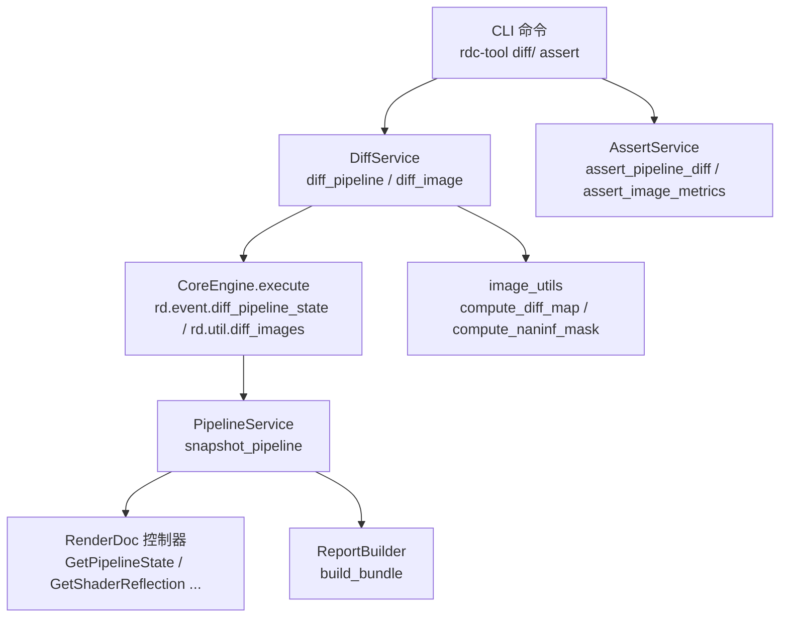
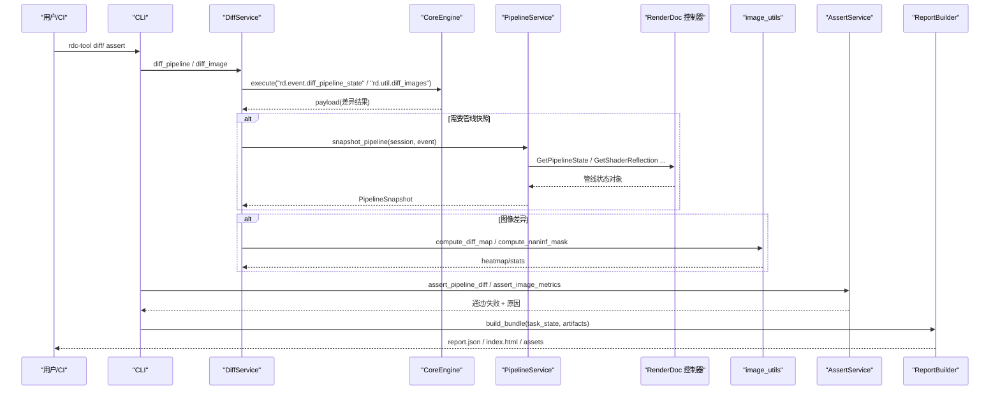
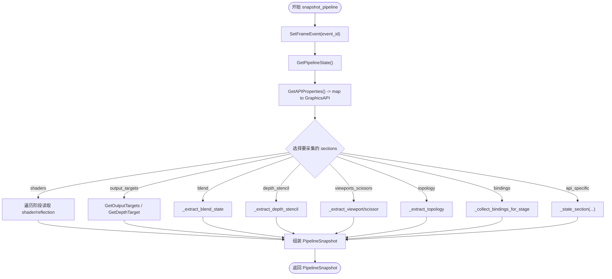
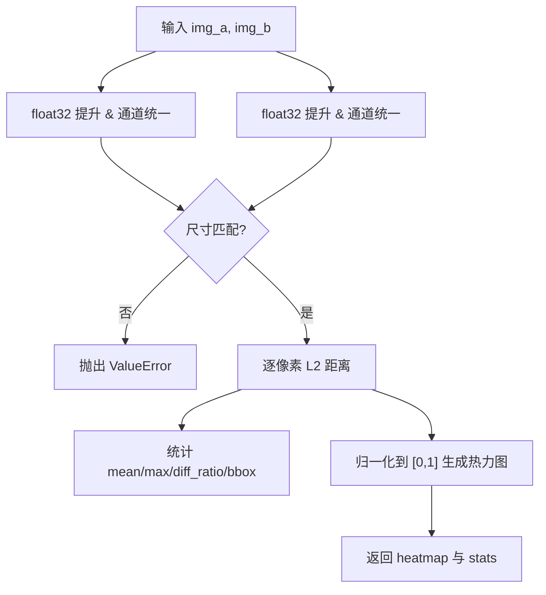
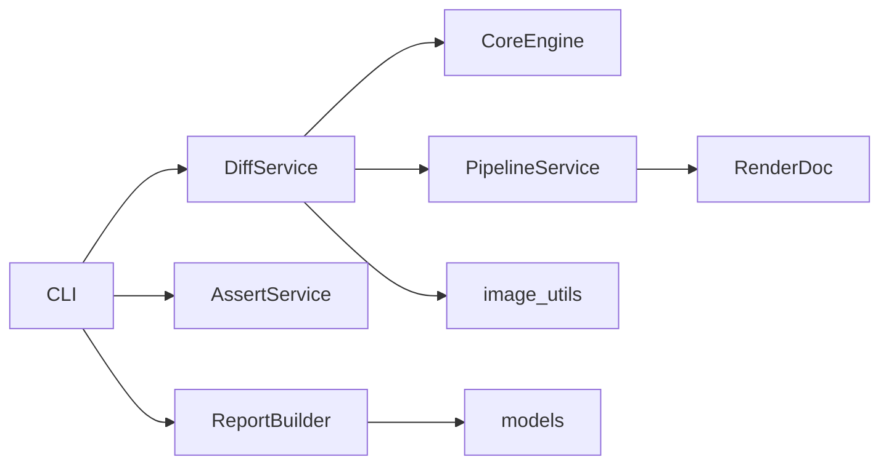

# 差异比较服务

<cite>
**本文引用的文件**
- [diff_service.py](file://rdc_tool/core/diff_service.py)
- [pipeline_service.py](file://rdc_tool/core/pipeline_service.py)
- [assert_service.py](file://rdc_tool/core/assert_service.py)
- [image_utils.py](file://rdc_tool/utils/image_utils.py)
- [report_builder.py](file://rdc_tool/core/report_builder.py)
- [models.py](file://rdc_tool/models.py)
- [cli.py](file://rdc_tool/cli.py)
- [server.py](file://rdc_tool/server.py)
</cite>

## 目录
1. [简介](#简介)
2. [项目结构](#项目结构)
3. [核心组件](#核心组件)
4. [架构总览](#架构总览)
5. [详细组件分析](#详细组件分析)
6. [依赖关系分析](#依赖关系分析)
7. [性能考虑](#性能考虑)
8. [故障排查指南](#故障排查指南)
9. [结论](#结论)
10. [附录：API 使用与示例](#附录api-使用与示例)

## 简介
本文件面向“差异比较服务”，系统性说明以下能力：
- Pipeline 状态差异检测：着色器程序、纹理绑定、缓冲区状态等 GPU 管线各阶段的对比。
- 图像差异比较算法：像素级 L2 距离、阈值设置、差异可视化（热力图/掩码）。
- 资源变化跟踪：纹理、缓冲区等资源在不同事件间的变化检测思路与集成点。
- 差异结果分析与报告生成：严重性评估、影响范围分析、交互式报告输出。
- 服务 API 使用说明：参数配置、结果格式、错误处理。
- 典型场景：回归测试、性能基准比较、问题复现验证。
- 性能优化建议与最佳实践。

## 项目结构
围绕差异比较的核心代码分布在如下模块：
- 统一差异封装：DiffService，对外暴露 pipeline 与 image 差异接口。
- 管线快照与对比数据源：PipelineService，负责从 RenderDoc 回放控制器读取管线状态并结构化。
- 图像差异工具：image_utils，提供像素级差异计算、NaN/Inf 检测、直方图/统计、PNG 序列化等。
- 断言与阈值判定：AssertService，将原始差异结果转换为通过/失败及原因。
- 报告构建：ReportBuilder，生成 JSON/Markdown/HTML 自包含调试报告。
- 模型定义：models，统一数据结构（如 PipelineSnapshot、AnomalyInfo、ArtifactRef 等）。
- CLI 入口：cli，提供 diff/ assert 命令，串联上述服务。
- 服务端路由：server，统一操作执行与异常映射。

图表来源
- [diff_service.py:11-50](file://rdc_tool/core/diff_service.py#L11-L50)
- [pipeline_service.py:597-702](file://rdc_tool/core/pipeline_service.py#L597-L702)
- [image_utils.py:143-220](file://rdc_tool/utils/image_utils.py#L143-L220)
- [report_builder.py:472-560](file://rdc_tool/core/report_builder.py#L472-L560)
- [assert_service.py:16-79](file://rdc_tool/core/assert_service.py#L16-L79)
- [cli.py:1332-1378](file://rdc_tool/cli.py#L1332-L1378)

章节来源
- [diff_service.py:11-50](file://rdc_tool/core/diff_service.py#L11-L50)
- [pipeline_service.py:597-702](file://rdc_tool/core/pipeline_service.py#L597-L702)
- [image_utils.py:143-220](file://rdc_tool/utils/image_utils.py#L143-L220)
- [report_builder.py:472-560](file://rdc_tool/core/report_builder.py#L472-L560)
- [assert_service.py:16-79](file://rdc_tool/core/assert_service.py#L16-L79)
- [cli.py:1332-1378](file://rdc_tool/cli.py#L1332-L1378)

## 核心组件
- DiffService：封装两类差异能力
  - diff_pipeline：调用底层操作 rd.event.diff_pipeline_state，传入 session_id、event_a、event_b。
  - diff_image：调用 rd.util.diff_images，支持可选 output_path 输出差异图。
- PipelineService：从 RenderDoc 回放控制器提取管线状态，包括：
  - 着色器阶段（VS/HS/DS/GS/PS/CS）及其反射信息（入口点、编码、常量块、资源声明）。
  - 渲染目标（颜色/深度）、混合状态、深度模板状态、视口/裁剪、拓扑、顶点输入。
  - 资源绑定（SRV/UAV/CBV/Sampler），按 set/space + binding 维度收集。
  - API 特定段：rasterizer/multisample/push_constants/dynamic_state/root_signature/descriptor_heaps/resource_states。
- image_utils：图像处理与差异计算
  - compute_diff_map：逐像素 L2 距离，归一化到热力图，统计 mean/max/diff_ratio/bbox。
  - compute_naninf_mask：检测 NaN/Inf 像素，生成彩色掩码与密度统计。
  - pixel_stats：逐通道 min/max/mean/std，含 has_nan/has_inf。
  - array_to_png_bytes/png_bytes_to_array：PNG 编解码。
  - tonemap_hdr：HDR 到 LDR 的简单 Reinhard 色调映射。
- AssertService：断言与阈值判定
  - assert_pipeline_diff：基于 diff 列表长度与 max_changes 阈值判断通过与否。
  - assert_image_metrics：基于 MSE、max_abs、PSNR 等指标进行阈值判定。
- ReportBuilder：生成自包含报告 bundle（JSON/Markdown/HTML），包含管线快照、实验时间线、异常详情、资源绑定视图等。
- models：统一数据结构，如 GraphicsAPI、ShaderStage、PipelineSnapshot、AnomalyInfo、ArtifactRef 等。

章节来源
- [diff_service.py:11-50](file://rdc_tool/core/diff_service.py#L11-L50)
- [pipeline_service.py:87-186](file://rdc_tool/core/pipeline_service.py#L87-L186)
- [pipeline_service.py:193-373](file://rdc_tool/core/pipeline_service.py#L193-L373)
- [pipeline_service.py:392-502](file://rdc_tool/core/pipeline_service.py#L392-L502)
- [pipeline_service.py:597-702](file://rdc_tool/core/pipeline_service.py#L597-L702)
- [image_utils.py:80-135](file://rdc_tool/utils/image_utils.py#L80-L135)
- [image_utils.py:143-220](file://rdc_tool/utils/image_utils.py#L143-L220)
- [image_utils.py:311-367](file://rdc_tool/utils/image_utils.py#L311-L367)
- [image_utils.py:375-426](file://rdc_tool/utils/image_utils.py#L375-L426)
- [image_utils.py:434-477](file://rdc_tool/utils/image_utils.py#L434-L477)
- [assert_service.py:16-79](file://rdc_tool/core/assert_service.py#L16-L79)
- [report_builder.py:472-560](file://rdc_tool/core/report_builder.py#L472-L560)
- [models.py:28-91](file://rdc_tool/models.py#L28-L91)

## 架构总览
差异比较服务由“上层 CLI/客户端”、“差异封装层”、“管线快照层”、“图像处理层”、“报告层”组成。核心流程如下：
- 用户通过 CLI 发起 diff/ assert 命令。
- CLI 调用 DiffService 或 AssertService。
- DiffService 通过 CoreEngine.execute 触发后端操作：
  - rd.event.diff_pipeline_state：返回两个事件的管线差异。
  - rd.util.diff_images：对两张图像进行像素级差异计算与可视化。
- PipelineService 在需要时从 RenderDoc 控制器抓取管线状态，形成结构化快照。
- AssertService 根据阈值判定通过/失败。
- ReportBuilder 将任务状态、异常、管线快照、实验结果打包为可分发的报告 bundle。

图表来源
- [diff_service.py:11-50](file://rdc_tool/core/diff_service.py#L11-L50)
- [pipeline_service.py:597-702](file://rdc_tool/core/pipeline_service.py#L597-L702)
- [image_utils.py:143-220](file://rdc_tool/utils/image_utils.py#L143-L220)
- [assert_service.py:16-79](file://rdc_tool/core/assert_service.py#L16-L79)
- [report_builder.py:472-560](file://rdc_tool/core/report_builder.py#L472-L560)
- [cli.py:1332-1378](file://rdc_tool/cli.py#L1332-L1378)

## 详细组件分析

### Pipeline 状态差异检测
- 数据来源：PipelineService.snapshot_pipeline 从 RenderDoc 控制器获取当前事件管线状态，并按 API 类型（D3D11/D3D12/Vulkan/OpenGL）提取对应段。
- 着色器程序：
  - 遍历所有阶段（Vertex/Hull/Domain/Geometry/Pixel/Compute），读取 shader id、entry point、encoding，以及反射信息（常量块、只读/读写资源、签名）。
  - 资源绑定：_collect_bindings_for_stage 按 SRV/UAV/CBV/Sampler 四类收集，去重键为 (set_or_space, binding, type, resource_id, array_index, descriptorStore, byteOffset)。
- 渲染目标与深度模板：
  - 颜色目标：GetOutputTargets 枚举，填充 format/width/height/is_srgb。
  - 深度目标：GetDepthTarget，若非空则解析。
  - 混合状态：_extract_blend_state 按 API 分支提取 blends 与选项。
  - 深度模板：_extract_depth_stencil 提取 depth/stencil 开关与函数。
- 视口/裁剪/拓扑：
  - _extract_viewport/_extract_scissor 分别处理 Vulkan 与其他 API 的差异。
  - _extract_topology 提取 inputAssembly/topology。
- API 特定段：
  - rasterizer/multisample/push_constants/dynamic_state/root_signature/descriptor_heaps/resource_states 通过 _state_section 动态投影。

图表来源
- [pipeline_service.py:597-702](file://rdc_tool/core/pipeline_service.py#L597-L702)
- [pipeline_service.py:193-373](file://rdc_tool/core/pipeline_service.py#L193-L373)
- [pipeline_service.py:392-502](file://rdc_tool/core/pipeline_service.py#L392-L502)

章节来源
- [pipeline_service.py:87-186](file://rdc_tool/core/pipeline_service.py#L87-L186)
- [pipeline_service.py:193-373](file://rdc_tool/core/pipeline_service.py#L193-L373)
- [pipeline_service.py:392-502](file://rdc_tool/core/pipeline_service.py#L392-L502)
- [pipeline_service.py:597-702](file://rdc_tool/core/pipeline_service.py#L597-L702)

### 图像差异比较算法
- 像素级比较：
  - compute_diff_map 将两幅图像提升到 float32，统一通道数为 3，计算逐像素 L2 距离，统计 mean_diff、max_diff、diff_pixel_count、diff_ratio，并计算 bbox。
  - 热力图生成：将 diff 归一化到 [0,1]，映射到黑→红→黄→白 RGB 渐变。
- NaN/Inf 检测：
  - compute_naninf_mask 生成 RGBA 掩码，NaN 红色、Inf 蓝色，统计 nan_count、inf_count、density、bbox。
- 统计与可视化：
  - pixel_stats 提供逐通道 min/max/mean/std，并标记 has_nan/has_inf。
  - array_to_png_bytes/png_bytes_to_array 用于 PNG 序列化/反序列化。
  - tonemap_hdr 对 HDR 数据进行简单 Reinhard 色调映射以便显示。

图表来源
- [image_utils.py:143-220](file://rdc_tool/utils/image_utils.py#L143-L220)
- [image_utils.py:80-135](file://rdc_tool/utils/image_utils.py#L80-L135)
- [image_utils.py:311-367](file://rdc_tool/utils/image_utils.py#L311-L367)
- [image_utils.py:375-426](file://rdc_tool/utils/image_utils.py#L375-L426)
- [image_utils.py:434-477](file://rdc_tool/utils/image_utils.py#L434-L477)

章节来源
- [image_utils.py:80-135](file://rdc_tool/utils/image_utils.py#L80-L135)
- [image_utils.py:143-220](file://rdc_tool/utils/image_utils.py#L143-L220)
- [image_utils.py:311-367](file://rdc_tool/utils/image_utils.py#L311-L367)
- [image_utils.py:375-426](file://rdc_tool/utils/image_utils.py#L375-L426)
- [image_utils.py:434-477](file://rdc_tool/utils/image_utils.py#L434-L477)

### 资源变化跟踪
- 资源绑定跟踪：
  - PipelineService._collect_bindings_for_stage 收集每个阶段的 SRV/UAV/CBV/Sampler 绑定，记录 set_or_space、binding、resource_id、type、format、array_index、descriptor/access 等元数据。
  - 通过反射与直接描述符访问两种方式合并，并以唯一键去重，避免重复条目。
- 资源状态段：
  - 对于 D3D12/Vulkan，_state_section 可提取 resource_states/descriptor_heaps/images 等段，辅助识别资源状态变化。
- 结合事件序列：
  - 通过在不同 event_a/event_b 之间调用 snapshot_pipeline，比较 bindings 与 resource_states 的变化，从而定位资源变化点。

章节来源
- [pipeline_service.py:392-502](file://rdc_tool/core/pipeline_service.py#L392-L502)
- [pipeline_service.py:318-373](file://rdc_tool/core/pipeline_service.py#L318-L373)

### 差异结果分析与报告生成
- 断言与阈值：
  - assert_pipeline_diff：统计 diff 列表长度，与 max_changes 比较，给出通过/失败与原因。
  - assert_image_metrics：基于 MSE、max_abs、PSNR 等指标与阈值比较，输出通过/失败与原因。
- 报告构建：
  - ReportBuilder.build_bundle 生成 report.json、report.md、index.html 与 assets/experiments 子目录。
  - HTML 内嵌 viewer，支持 final/mask/diff/compare 视图切换，右侧面板展示 pipeline/shaders/resources 等。
  - JSON 包含 bugType、captureInfo、firstBadEventId、bbox、verifierMetrics、hypotheses、fixCandidate、confidence、evidence、pipelineSnapshot、experiments、anomalies 等字段。

章节来源
- [assert_service.py:16-79](file://rdc_tool/core/assert_service.py#L16-L79)
- [report_builder.py:472-560](file://rdc_tool/core/report_builder.py#L472-L560)
- [report_builder.py:566-698](file://rdc_tool/core/report_builder.py#L566-L698)

## 依赖关系分析
- DiffService 依赖 CoreEngine.execute 调用后端操作，解耦了具体实现。
- PipelineService 依赖 RenderDoc Python 模块与 SessionManager/ArtifactStore 协议，保证可替换性与测试友好。
- image_utils 依赖 NumPy 与 PIL，提供高性能向量运算与图像编解码。
- AssertService 无外部依赖，纯逻辑判定。
- ReportBuilder 依赖 models 中的 TaskState、ExperimentResult、PipelineSnapshot 等数据结构。
- CLI 作为入口，组合上述服务，并通过 server 统一执行与错误映射。

图表来源
- [diff_service.py:11-50](file://rdc_tool/core/diff_service.py#L11-L50)
- [pipeline_service.py:597-702](file://rdc_tool/core/pipeline_service.py#L597-L702)
- [image_utils.py:143-220](file://rdc_tool/utils/image_utils.py#L143-L220)
- [assert_service.py:16-79](file://rdc_tool/core/assert_service.py#L16-L79)
- [report_builder.py:472-560](file://rdc_tool/core/report_builder.py#L472-L560)
- [models.py:28-91](file://rdc_tool/models.py#L28-L91)

章节来源
- [diff_service.py:11-50](file://rdc_tool/core/diff_service.py#L11-L50)
- [pipeline_service.py:597-702](file://rdc_tool/core/pipeline_service.py#L597-L702)
- [image_utils.py:143-220](file://rdc_tool/utils/image_utils.py#L143-L220)
- [assert_service.py:16-79](file://rdc_tool/core/assert_service.py#L16-L79)
- [report_builder.py:472-560](file://rdc_tool/core/report_builder.py#L472-L560)
- [models.py:28-91](file://rdc_tool/models.py#L28-L91)

## 性能考虑
- 管线快照：
  - 仅采集所需 sections，减少不必要的 API 调用与数据拷贝。
  - 使用 asyncio.to_thread 将阻塞式 RenderDoc 调用放入线程池，避免阻塞事件循环。
- 图像差异：
  - 先统一通道数与数据类型，再进行向量化 L2 距离计算，避免逐像素 Python 循环。
  - 对超大图像，建议分块处理或降低分辨率进行快速筛查。
- 资源绑定去重：
  - 以 (set_or_space, binding, type, resource_id, array_index, descriptorStore, byteOffset) 为键去重，避免重复条目导致后续比较开销增大。
- 报告生成：
  - 仅在必要时生成完整 HTML 报告；批量场景可优先输出 JSON 摘要。
- 阈值调优：
  - 图像差异阈值 threshold 应根据内容敏感度调整；对噪声敏感场景可适当放宽。
  - 管线差异 max_changes 应结合变更预期设定，避免误报。

[本节为通用指导，不直接分析具体文件]

## 故障排查指南
- RenderDoc 模块不可用：
  - 现象：导入 renderdoc 失败。
  - 处理：确保在 RenderDoc replay 上下文运行或将共享库目录加入 sys.path/PYTHONPATH。
- 管线读取失败：
  - 现象：读取 blend/depth/targets 时抛出 RuntimeError。
  - 处理：检查 API 类型与版本兼容性，确认控制器状态正确。
- 图像尺寸不匹配：
  - 现象：compute_diff_map 抛出 ValueError。
  - 处理：确保两张图像空间尺寸一致，必要时先缩放对齐。
- 断言失败：
  - 现象：assert_pipeline_diff/ assert_image_metrics 返回失败。
  - 处理：检查 max_changes、mse_max、psnr_min 等阈值是否合理，查看 details 中的 metrics 与 error。
- 服务端错误：
  - 现象：server 捕获异常并映射为 canonical_error。
  - 处理：查看 operation、trace_id、error.code/category/message/details 定位问题。

章节来源
- [pipeline_service.py:35-48](file://rdc_tool/core/pipeline_service.py#L35-L48)
- [pipeline_service.py:193-295](file://rdc_tool/core/pipeline_service.py#L193-L295)
- [image_utils.py:143-183](file://rdc_tool/utils/image_utils.py#L143-L183)
- [assert_service.py:16-79](file://rdc_tool/core/assert_service.py#L16-L79)
- [server.py:90-120](file://rdc_tool/server.py#L90-L120)

## 结论
差异比较服务通过统一的 DiffService 封装 pipeline 与 image 差异能力，结合 PipelineService 的结构化管线快照、image_utils 的高效像素级比较、AssertService 的阈值判定与 ReportBuilder 的可分发报告，形成了完整的回归测试与问题定位闭环。建议在 CI 中集成 diff/ assert 命令，配合合理的阈值策略与报告归档，持续保障图形栈稳定性与性能基线。

[本节为总结，不直接分析具体文件]

## 附录：API 使用与示例

### 差异检测 API
- 管线差异
  - 方法：DiffService.diff_pipeline
  - 参数：session_id、event_a、event_b、context（可选）
  - 行为：调用 rd.event.diff_pipeline_state，返回差异结果（通常包含 diff 列表）
  - 参考路径：[diff_service.py:11-29](file://rdc_tool/core/diff_service.py#L11-L29)
- 图像差异
  - 方法：DiffService.diff_image
  - 参数：image_a_path、image_b_path、output_path（可选）、context（可选）
  - 行为：调用 rd.util.diff_images，返回 metrics 与可选差异图
  - 参考路径：[diff_service.py:31-50](file://rdc_tool/core/diff_service.py#L31-L50)

章节来源
- [diff_service.py:11-50](file://rdc_tool/core/diff_service.py#L11-L50)

### 断言与阈值
- 管线断言
  - 方法：AssertService.assert_pipeline_diff
  - 参数：payload（来自 diff 结果）、max_changes（默认 0）
  - 行为：统计 diff 数量并与阈值比较，返回 passed/reason/details
  - 参考路径：[assert_service.py:16-35](file://rdc_tool/core/assert_service.py#L16-L35)
- 图像断言
  - 方法：AssertService.assert_image_metrics
  - 参数：payload（来自 diff 结果）、mse_max、max_abs_max、psnr_min（可选）
  - 行为：基于指标阈值判定，返回 passed/reason/details
  - 参考路径：[assert_service.py:37-79](file://rdc_tool/core/assert_service.py#L37-L79)

章节来源
- [assert_service.py:16-79](file://rdc_tool/core/assert_service.py#L16-L79)

### CLI 命令示例
- 管线差异
  - 命令：rdc-tool diff pipeline --session-id <id> --event-a <a> --event-b <b> [--fail-on-diff]
  - 行为：执行管线差异，可选择存在差异即失败
  - 参考路径：[cli.py:1583-1585](file://rdc_tool/cli.py#L1583-L1585)
- 图像差异
  - 命令：rdc-tool diff image --image-a <path> --image-b <path> [--out <path>] [--threshold <float>]
  - 行为：执行图像差异，可选输出差异图与阈值
  - 参考路径：[cli.py:1586-1590](file://rdc_tool/cli.py#L1586-L1590)
- 断言
  - 管线断言：rdc-tool assert pipeline --session-id <id> --event-a <a> --event-b <b> [--max-changes <int>]
  - 图像断言：rdc-tool assert image --image-a <path> --image-b <path> [--out <path>] [--mse-max <float>] [--max-abs-max <float>] [--psnr-min <float>]
  - 参考路径：[cli.py:1592-1604](file://rdc_tool/cli.py#L1592-L1604)、[cli.py:1332-1378](file://rdc_tool/cli.py#L1332-L1378)

章节来源
- [cli.py:1332-1378](file://rdc_tool/cli.py#L1332-L1378)
- [cli.py:1583-1604](file://rdc_tool/cli.py#L1583-L1604)

### 实际使用场景
- 回归测试
  - 在 CI 中执行 rdc-tool diff pipeline/ image，设置严格阈值（如 max_changes=0、mse_max=0），失败即阻断。
- 性能基准比较
  - 对不同版本的构建执行 rdc-tool diff pipeline 与 rdc-tool assert image，关注 metrics 变化（如 GPU duration、anomaly_score）。
- 问题复现验证
  - 针对已知问题，构造最小用例，执行 rdc-tool diff pipeline/ image，生成 report bundle 便于回溯。

[本节为概念性指导，不直接分析具体文件]