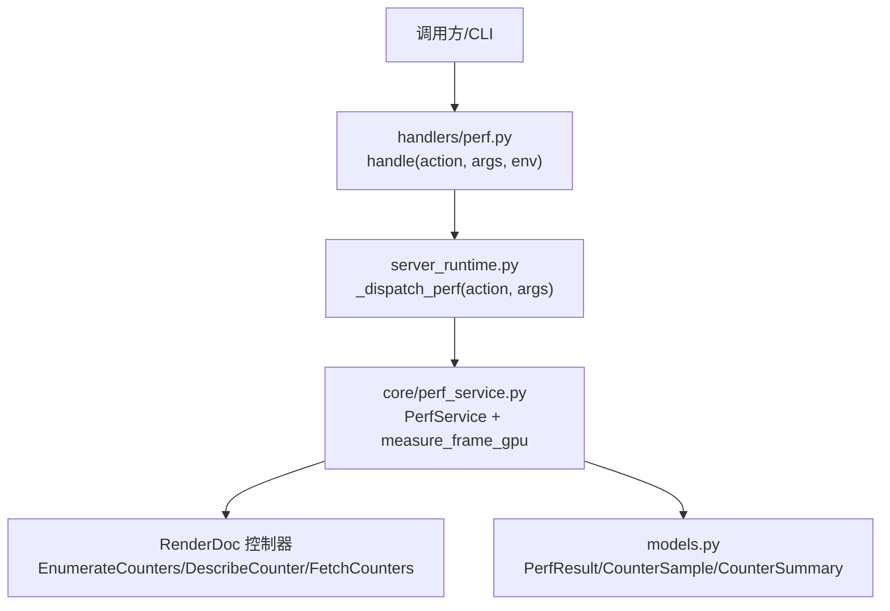
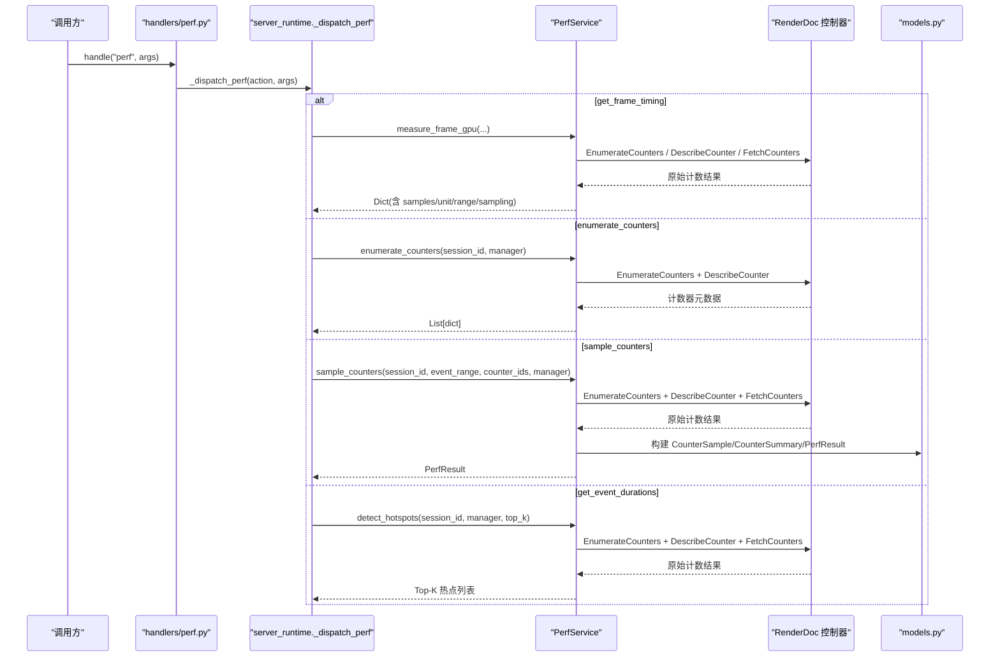
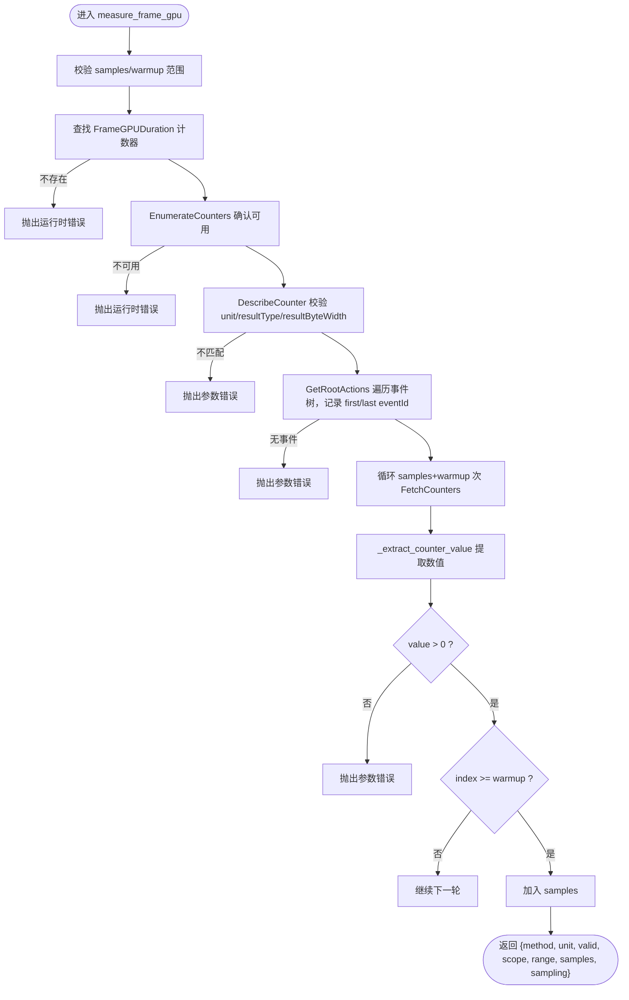
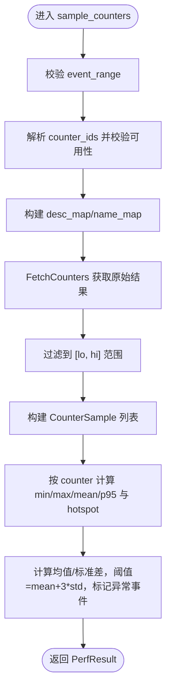
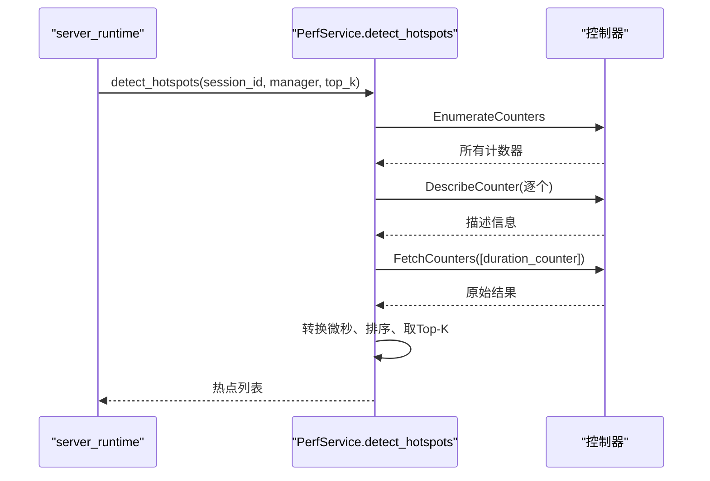
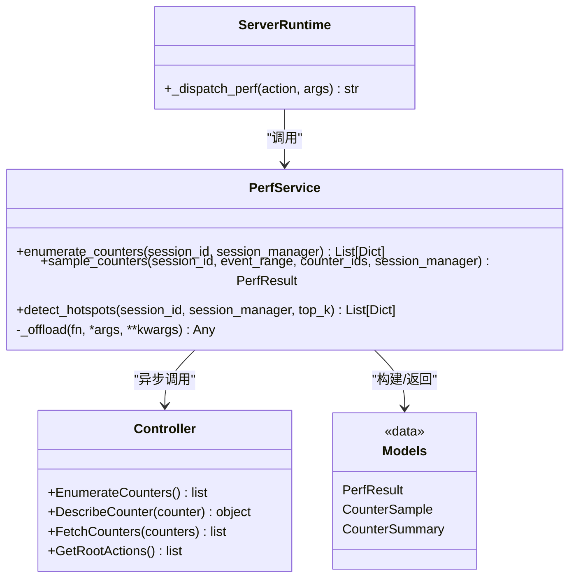

# 性能分析服务

<cite>
**本文引用的文件**
- [perf_service.py](file://rdx/core/perf_service.py)
- [models.py](file://rdx/models.py)
- [server_runtime.py](file://rdx/server_runtime.py)
- [perf.py](file://rdx/handlers/perf.py)
- [test_frame_timing.py](file://tests/test_frame_timing.py)
- [test_perf_service_failures.py](file://tests/test_perf_service_failures.py)
</cite>

## 目录
1. [简介](#简介)
2. [项目结构](#项目结构)
3. [核心组件](#核心组件)
4. [架构总览](#架构总览)
5. [详细组件分析](#详细组件分析)
6. [依赖关系分析](#依赖关系分析)
7. [性能考量](#性能考量)
8. [故障排查指南](#故障排查指南)
9. [结论](#结论)
10. [附录：使用示例与配置选项](#附录使用示例与配置选项)

## 简介
本文件面向“性能分析服务”，聚焦 GPU 性能计数器枚举、采样与分析能力。重点说明：
- measure_frame_gpu：获取整个回放的 GPU 持续时间（不聚合事件级时长），包含参数校验、counter 查找与采样流程。
- PerfService 类核心方法：
  - enumerate_counters：枚举可用 GPU 性能计数器及其描述信息。
  - sample_counters：在指定事件范围内采集性能数据，生成 per-event 样本与 per-counter 统计摘要，并检测异常事件。
  - detect_hotspots：基于 GPU 持续时间识别性能热点事件（Top-K）。
- 数据处理流程：CounterSample/CounterSummary 的构建、z-score > 3 的异常检测算法、性能统计分析。
- 错误处理机制与性能优化建议。
- 具体使用示例与配置选项说明。

## 项目结构
性能分析服务位于 rdx 子系统中，核心实现集中在 core 层，并通过 server_runtime 暴露为可被上层调用的动作接口；handlers 提供轻量转发入口；models 定义统一的数据模型。

图表来源
- [perf.py:8-10](file://rdx/handlers/perf.py#L8-L10)
- [server_runtime.py:11040-11115](file://rdx/server_runtime.py#L11040-L11115)
- [perf_service.py:28-63](file://rdx/core/perf_service.py#L28-L63)
- [perf_service.py:235-487](file://rdx/core/perf_service.py#L235-L487)
- [perf_service.py:493-617](file://rdx/core/perf_service.py#L493-L617)
- [models.py:463-482](file://rdx/models.py#L463-L482)

章节来源
- [perf.py:8-10](file://rdx/handlers/perf.py#L8-L10)
- [server_runtime.py:11040-11115](file://rdx/server_runtime.py#L11040-L11115)
- [perf_service.py:28-63](file://rdx/core/perf_service.py#L28-L63)
- [perf_service.py:235-487](file://rdx/core/perf_service.py#L235-L487)
- [perf_service.py:493-617](file://rdx/core/perf_service.py#L493-L617)
- [models.py:463-482](file://rdx/models.py#L463-L482)

## 核心组件
- PerfService：封装异步化的 GPU 计数器操作，包括枚举、采样、热点检测。内部通过线程池执行器将同步的 RenderDoc 调用从事件循环中卸载，避免阻塞。
- measure_frame_gpu：针对“整回放”的 GPU 持续时间测量，返回秒级样本，支持预热轮次丢弃。
- 数据模型：
  - CounterSample：单条 per-event、per-counter 的采样值。
  - CounterSummary：按 counter 维度计算的统计摘要（最小、最大、均值、P95、热点事件）。
  - PerfResult：汇总 samples、summaries 以及 anomaly_events（任一 counter 超过阈值的事件集合）。

章节来源
- [perf_service.py:212-229](file://rdx/core/perf_service.py#L212-L229)
- [perf_service.py:28-63](file://rdx/core/perf_service.py#L28-L63)
- [models.py:463-482](file://rdx/models.py#L463-L482)

## 架构总览
整体调用链：
- handlers/perf.py 仅做转发，实际逻辑由 server_runtime._dispatch_perf 分发到对应 action。
- _dispatch_perf 根据 action 路由到 measure_frame_gpu、enumerate_counters、sample_counters、detect_hotspots 等。
- PerfService 通过 session_manager 获取 controller，调用底层 EnumerateCounters/DescribeCounter/FetchCounters。
- 所有 I/O 密集型调用通过 _offload 在默认线程池中执行，保持异步非阻塞。

图表来源
- [perf.py:8-10](file://rdx/handlers/perf.py#L8-L10)
- [server_runtime.py:11040-11115](file://rdx/server_runtime.py#L11040-L11115)
- [perf_service.py:28-63](file://rdx/core/perf_service.py#L28-L63)
- [perf_service.py:235-487](file://rdx/core/perf_service.py#L235-L487)
- [perf_service.py:493-617](file://rdx/core/perf_service.py#L493-L617)
- [models.py:463-482](file://rdx/models.py#L463-L482)

## 详细组件分析

### measure_frame_gpu：整回放 GPU 持续时间测量
职责
- 验证参数：samples ∈ [1,16]，warmup ∈ [0,4]。
- 定位整回放计数器：FrameGPUDuration（若不存在则报错）。
- 校验该 counter 是否在可用列表中，并检查其单位/类型/宽度是否符合预期（秒、浮点、8字节）。
- 遍历根 Action 树，收集事件范围（first_event_id..last_event_id）。
- 执行多次 FetchCounters，前 warmup 轮丢弃，后续作为有效样本。
- 返回字典，包含 method/unit/valid/scope/range/samples/sampling 等字段。

关键流程

图表来源
- [perf_service.py:28-63](file://rdx/core/perf_service.py#L28-L63)

章节来源
- [perf_service.py:28-63](file://rdx/core/perf_service.py#L28-L63)
- [test_frame_timing.py:9-46](file://tests/test_frame_timing.py#L9-L46)

### PerfService.enumerate_counters：枚举可用 GPU 性能计数器
职责
- 延迟加载 renderdoc 模块，不可用时直接报错。
- 通过 session_manager.get_controller 获取控制器。
- 调用 EnumerateCounters 获取所有计数器枚举值。
- 对每个计数器调用 DescribeCounter 获取 name/description/unit/resultType 等元数据。
- 返回计数器描述列表。

错误处理
- 无法获取控制器或驱动读取失败时，记录日志并抛出运行时错误。
- 单个 DescribeCounter 失败会记录警告并转为运行时错误。

章节来源
- [perf_service.py:235-308](file://rdx/core/perf_service.py#L235-L308)
- [test_perf_service_failures.py:20-30](file://tests/test_perf_service_failures.py#L20-L30)

### PerfService.sample_counters：事件范围内采样与统计摘要
职责
- 参数校验：event_range(lo, hi) 必须合法（lo ≥ 0 且 hi ≥ lo）。
- 解析请求的 counter_ids，并在可用计数器映射中校验。
- 构建 description/name 查找表，批量 FetchCounters。
- 过滤出落在 [lo, hi] 范围内的结果，构建 CounterSample 列表。
- 按 counter 维度计算统计摘要：min/max/mean/p95，并标记 hotspot_event_id（最大值对应事件）。
- 异常检测：对每个 counter 计算均值与标准差，若 std > 0，则以 mean + 3*std 为阈值，标记超出阈值的 event_id 为异常事件。
- 返回 PerfResult(samples, summaries, anomaly_events)。

统计与异常检测
- P95 计算：线性插值法，空列表返回 0.0。
- 标准差：总体标准差，少于 2 个样本返回 0.0。
- 异常阈值：z-score > 3（即 value > mean + 3*std）。

图表来源
- [perf_service.py:314-487](file://rdx/core/perf_service.py#L314-L487)

章节来源
- [perf_service.py:314-487](file://rdx/core/perf_service.py#L314-L487)
- [models.py:463-482](file://rdx/models.py#L463-L482)
- [test_perf_service_failures.py:33-55](file://tests/test_perf_service_failures.py#L33-L55)

### PerfService.detect_hotspots：基于 GPU 持续时间的热点检测
职责
- 延迟加载 renderdoc，不可用时报错。
- 参数校验：top_k ≥ 0。
- 枚举所有计数器，查找名称或枚举名命中常见 GPU-duration 名称的计数器（如 EventGPUDuration/GPUDuration/GPU Duration）。
- 抓取所有事件的 duration 计数器，转换为微秒。
- 按 duration 降序排序，取 top_k（top_k=0 表示返回全部）。
- 返回包含 event_id、duration_us、rank 的列表。

图表来源
- [perf_service.py:493-617](file://rdx/core/perf_service.py#L493-L617)
- [server_runtime.py:11100-11114](file://rdx/server_runtime.py#L11100-L11114)

章节来源
- [perf_service.py:493-617](file://rdx/core/perf_service.py#L493-L617)
- [server_runtime.py:11100-11114](file://rdx/server_runtime.py#L11100-L11114)
- [test_perf_service_failures.py:58-97](file://tests/test_perf_service_failures.py#L58-L97)

## 依赖关系分析
- PerfService 依赖 session_manager 提供的控制器访问，解耦了具体会话管理实现。
- 所有与 RenderDoc 的交互均通过控制器方法完成，采用异步线程池卸载，避免阻塞事件循环。
- 数据模型集中定义于 models.py，确保跨模块一致性与序列化友好。
- server_runtime 作为调度中心，将外部动作映射到具体服务方法，并负责参数校验与错误包装。

图表来源
- [perf_service.py:212-229](file://rdx/core/perf_service.py#L212-L229)
- [perf_service.py:235-487](file://rdx/core/perf_service.py#L235-L487)
- [perf_service.py:493-617](file://rdx/core/perf_service.py#L493-L617)
- [server_runtime.py:11040-11115](file://rdx/server_runtime.py#L11040-L11115)
- [models.py:463-482](file://rdx/models.py#L463-L482)

章节来源
- [perf_service.py:212-229](file://rdx/core/perf_service.py#L212-L229)
- [server_runtime.py:11040-11115](file://rdx/server_runtime.py#L11040-L11115)
- [models.py:463-482](file://rdx/models.py#L463-L482)

## 性能考量
- 异步与非阻塞：所有 RenderDoc 调用通过 _offload 在默认线程池中执行，避免阻塞事件循环，提高并发吞吐。
- 采样策略：measure_frame_gpu 支持 warmup 轮次丢弃，减少冷启动影响；sample_counters 支持事件范围裁剪，降低不必要的数据量。
- 统计复杂度：P95 计算采用排序与线性插值，时间复杂度 O(n log n)，适用于中等规模数据；标准差为 O(n)。
- 异常检测：z-score > 3 阈值简单高效，适合快速识别离群事件；当 std ≤ 0 时跳过，避免误报。
- 内存占用：per_counter 累加器以 counter_id 为键存储 (event_id, value) 列表，建议在大数据集上合理设置事件范围与 stride（当前仅支持 stride=1）。

[本节为通用指导，无需特定文件引用]

## 故障排查指南
常见问题与定位要点
- renderdoc 模块不可用：
  - 现象：enumerate_counters/sample_counters/detect_hotspots 均抛出“GPU counter query unavailable”。
  - 原因：延迟导入 renderdoc 失败或未安装。
  - 处理：确保渲染文档 Python 模块在 sys.path 中或设置 RDX_RENDERDOC_PATH。
- 控制器获取失败：
  - 现象：抛出“GPU counter read failed”。
  - 原因：session_id 无效或会话未就绪。
  - 处理：检查会话生命周期与控制器可用性。
- 计数器不可用或不匹配：
  - 现象：Requested counter_id 不可用；或整回放计数器缺失。
  - 原因：后端/队列配置不支持；驱动版本不匹配。
  - 处理：使用 enumerate_counters 获取可用列表，再选择合适计数器。
- 采样结果为空或无效：
  - 现象：整回放 duration 为非正数或非有限值；或 FetchCounters 返回不完整。
  - 原因：驱动返回异常或事件范围为空。
  - 处理：检查捕获是否包含事件；调整 samples/warmup；确认驱动状态。
- 异常检测误报/漏报：
  - 现象：anomaly_events 为空或过多。
  - 原因：std 过小导致阈值不稳定；或数据分布偏态。
  - 处理：扩大采样范围；结合业务上下文调整阈值或分段分析。

章节来源
- [perf_service.py:264-308](file://rdx/core/perf_service.py#L264-L308)
- [perf_service.py:342-380](file://rdx/core/perf_service.py#L342-L380)
- [perf_service.py:526-576](file://rdx/core/perf_service.py#L526-L576)
- [test_perf_service_failures.py:20-55](file://tests/test_perf_service_failures.py#L20-L55)

## 结论
性能分析服务通过 PerfService 提供了完整的 GPU 计数器生命周期管理能力：从枚举、采样到热点检测，并以统一的模型输出结果。measure_frame_gpu 专注于整回放级别的 GPU 持续时间测量，而 sample_counters 与 detect_hotspots 分别提供细粒度统计与全局热点定位。系统采用异步线程池卸载 I/O，保证高并发下的稳定性；异常检测基于 z-score > 3，兼顾效率与实用性。配合 server_runtime 的动作分发，可在 CLI/runtime 环境中便捷地集成与扩展。

[本节为总结性内容，无需特定文件引用]

## 附录：使用示例与配置选项

### 配置选项
- get_frame_timing（整回放帧计时）
  - 参数：
    - session_id：必填。
    - samples：采样次数，范围 1..16。
    - warmup：预热轮次，范围 0..4。
  - 行为：调用 measure_frame_gpu，返回包含 method/unit/valid/scope/range/samples/sampling 的字典。
- enumerate_counters
  - 参数：session_id。
  - 行为：返回可用计数器描述列表。
- describe_counter
  - 参数：session_id、counter_id。
  - 行为：返回指定计数器的元数据。
- sample_counters
  - 参数：
    - session_id。
    - event_range：可选，包含 start_event_id/end_event_id 或 lo/hi。
    - counter_ids：可选；为空时自动枚举全部。
    - stride：当前仅支持 1。
  - 行为：返回 PerfResult（JSON 化）。
- get_event_durations
  - 参数：
    - session_id。
    - max_events：返回的最大事件数（默认 200）。
    - event_range：可选，用于过滤热点事件范围。
  - 行为：返回 Top-K 热点列表（duration_us 单位为微秒）。

章节来源
- [server_runtime.py:11040-11115](file://rdx/server_runtime.py#L11040-L11115)

### 使用示例（来自测试）
- 整回放帧计时
  - 构造控制器模拟 FetchCounters 返回 d=0.002/0.004 等秒级值。
  - 调用 measure_frame_gpu(samples=2, warmup=1)，期望 samples=[0.002, 0.004]，range.first_event_id=1，range.last_event_id=14。
  - 无效值（0、负数、NaN、Inf）应抛出 ValueError。
  - 不可用或返回不完整时应抛出 RuntimeError。
- 热点检测
  - 构造控制器返回多个事件的 EventGPUDuration 值。
  - 调用 detect_hotspots(top_k=0) 返回全部事件并按 duration_us 降序排列。
- 计数器读取失败
  - 当 renderdoc 不可用时，所有计数器相关操作抛出“unavailable”。
  - 当驱动拒绝 FetchCounters 时，抛出“read failed”。

章节来源
- [test_frame_timing.py:9-46](file://tests/test_frame_timing.py#L9-L46)
- [test_perf_service_failures.py:20-112](file://tests/test_perf_service_failures.py#L20-L112)