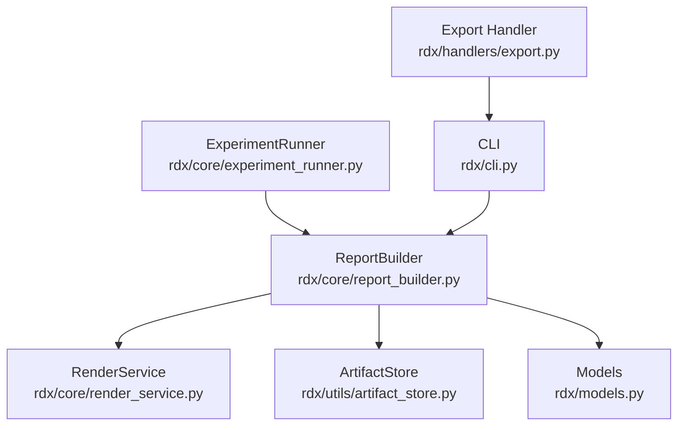
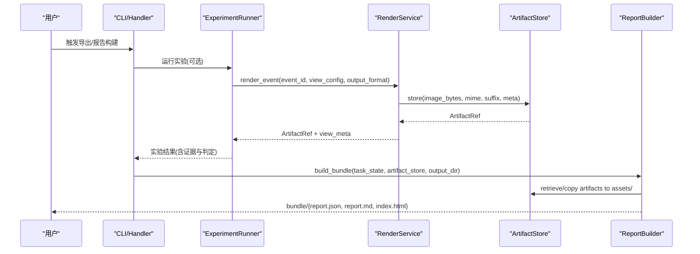
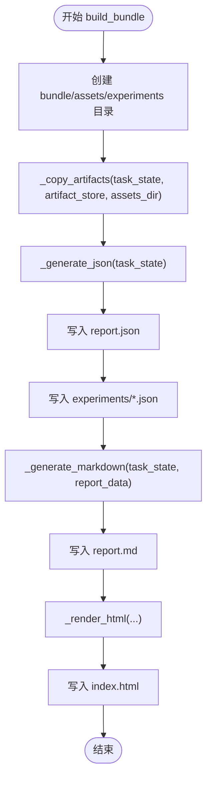
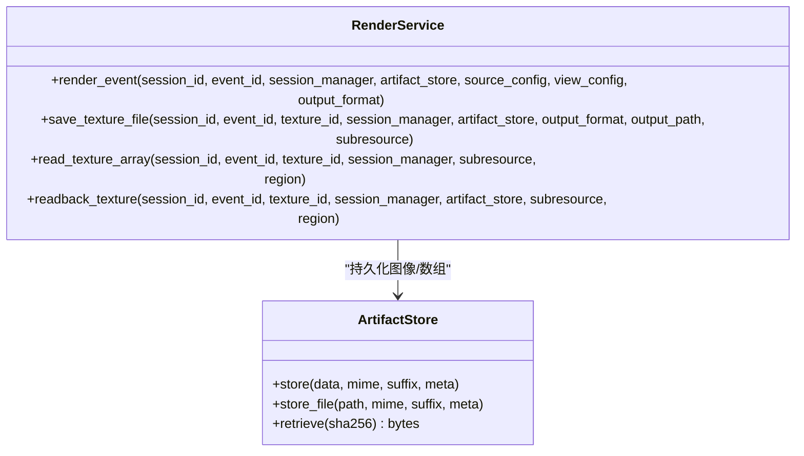
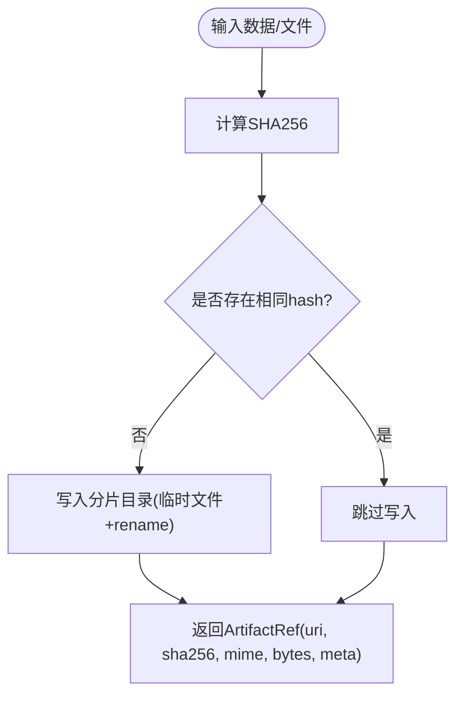
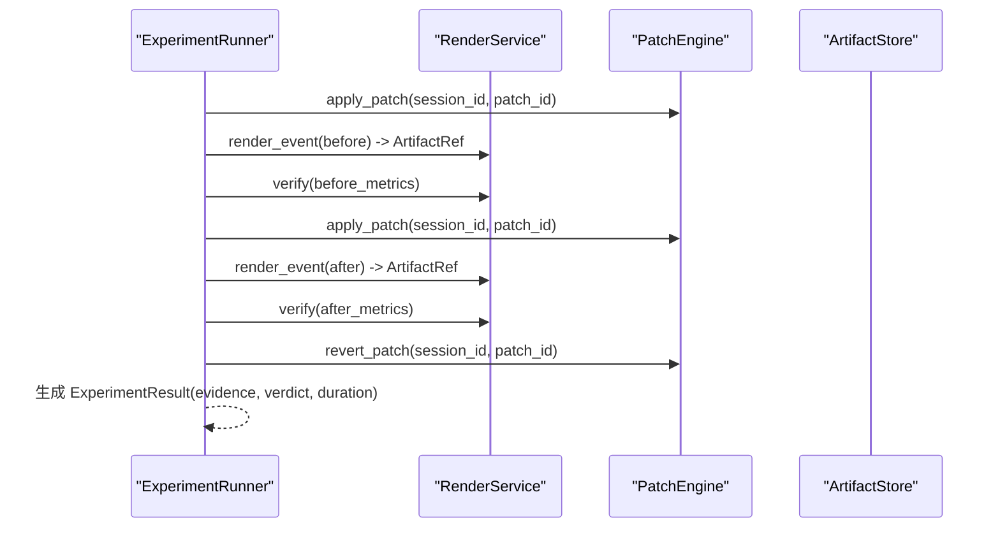
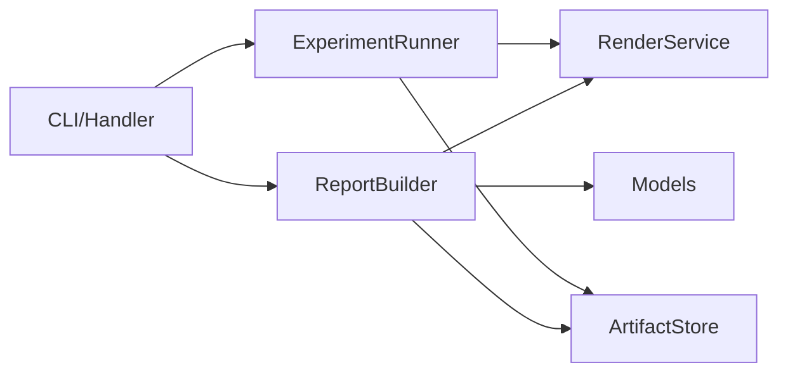

# 报告构建器

<cite>
**本文引用的文件**
- [report_builder.py](file://rdx/core/report_builder.py)
- [render_service.py](file://rdx/core/render_service.py)
- [artifact_store.py](file://rdx/utils/artifact_store.py)
- [models.py](file://rdx/models.py)
- [experiment_runner.py](file://rdx/core/experiment_runner.py)
- [export.py](file://rdx/handlers/export.py)
- [cli.py](file://rdx/cli.py)
</cite>

## 目录
1. [简介](#简介)
2. [项目结构](#项目结构)
3. [核心组件](#核心组件)
4. [架构总览](#架构总览)
5. [详细组件分析](#详细组件分析)
6. [依赖关系分析](#依赖关系分析)
7. [性能考量](#性能考量)
8. [故障排查指南](#故障排查指南)
9. [结论](#结论)
10. [附录：使用示例与扩展方式](#附录使用示例与扩展方式)

## 简介
本文件面向“报告构建器”子系统，系统性说明从数据采集、模板渲染到格式化输出的完整流程；解释可视化报告的构建机制（图表生成、交互式元素、数据钻取）；阐述证据收集系统如何自动捕获截图、日志和上下文信息；说明报告模板系统的设计与扩展方式（Jinja2 模板与回退策略）；详述报告内容组织（执行摘要、详细分析、问题定位、修复建议）；列举导出格式（HTML、Markdown、JSON）；提供定制化的配置选项与样式主题设置；并给出实际使用示例，展示如何生成不同类型的分析报告与调试报告。

## 项目结构
报告构建器位于 rdx 核心模块中，围绕 ReportBuilder 类组织，配合 RenderService 负责图像/纹理采集，ArtifactStore 负责内容寻址存储，ExperimentRunner 驱动实验与证据收集，CLI/Handlers 暴露对外接口。

**图示来源**
- [report_builder.py:462-560](file://rdx/core/report_builder.py#L462-L560)
- [render_service.py:346-521](file://rdx/core/render_service.py#L346-L521)
- [artifact_store.py:74-158](file://rdx/utils/artifact_store.py#L74-L158)
- [experiment_runner.py:83-118](file://rdx/core/experiment_runner.py#L83-L118)
- [export.py:8-9](file://rdx/handlers/export.py#L8-L9)
- [cli.py:1538-1555](file://rdx/cli.py#L1538-L1555)

**章节来源**
- [report_builder.py:1-15](file://rdx/core/report_builder.py#L1-L15)
- [render_service.py:1-11](file://rdx/core/render_service.py#L1-L11)
- [artifact_store.py:1-11](file://rdx/utils/artifact_store.py#L1-L11)

## 核心组件
- ReportBuilder：无状态构建器，负责组装 report.json、report.md、index.html 及 assets/、experiments/ 子目录，完成证据拷贝与模板渲染。
- RenderService：封装 RenderDoc 的 headless 渲染、readback、像素检查，输出图像/数值数组 artifact，支持多种格式与视图配置。
- ArtifactStore：基于 SHA256 的内容寻址存储（CAS），去重持久化图像、npz、json 等 artifact，并提供检索与清理能力。
- ExperimentRunner：顺序或批量执行实验，采集 before/after 证据、指标对比与判定结果，保证每次实验后回滚 patch。
- Models：定义 TaskState、AnomalyInfo、PipelineSnapshot、ExperimentResult、ArtifactRef 等核心数据结构。
- Export/CLI：通过 export handler 与 CLI 命令暴露导出能力（如截图、纹理导出）。

**章节来源**
- [report_builder.py:462-560](file://rdx/core/report_builder.py#L462-L560)
- [render_service.py:346-521](file://rdx/core/render_service.py#L346-L521)
- [artifact_store.py:74-158](file://rdx/utils/artifact_store.py#L74-L158)
- [experiment_runner.py:83-118](file://rdx/core/experiment_runner.py#L83-L118)
- [models.py:103-122](file://rdx/models.py#L103-L122)

## 架构总览
报告构建的整体流程如下：
1. 数据采集：RenderService 在指定事件上渲染目标纹理，编码为 PNG/JPG/EXR/HDR 或原始 npz，并通过 ArtifactStore 持久化。
2. 证据收集：ExperimentRunner 执行实验，记录 before/after 指标与截图，生成判定结果与 notes。
3. 报告生成：ReportBuilder 将 TaskState 转换为 report.json、Markdown 摘要与交互式 HTML，并复制相关 artifacts 到 bundle/assets。
4. 导出与访问：CLI/Handler 暴露导出入口，用户可通过命令行导出截图/纹理，或直接打开 index.html 进行交互分析。

**图示来源**
- [experiment_runner.py:234-270](file://rdx/core/experiment_runner.py#L234-L270)
- [render_service.py:357-521](file://rdx/core/render_service.py#L357-L521)
- [artifact_store.py:99-158](file://rdx/utils/artifact_store.py#L99-L158)
- [report_builder.py:472-560](file://rdx/core/report_builder.py#L472-L560)
- [export.py:8-9](file://rdx/handlers/export.py#L8-L9)
- [cli.py:1538-1555](file://rdx/cli.py#L1538-L1555)

## 详细组件分析

### ReportBuilder：报告构建与模板渲染
- 构建入口 build_bundle：创建 bundle 目录结构，复制 artifacts，生成 report.json、report.md、index.html，并写入 experiments/*.json。
- JSON 生成 _generate_json：聚合 bugType、captureInfo、bisect boundaries、bbox、verifierMetrics、hypotheses、fixCandidate、pipelineSnapshot、experiments、anomalies、status、时间戳等。
- Markdown 生成 _generate_markdown：结构化输出标题、摘要、异常详情、管线/着色器摘要、实验时间线、修复候选与页脚。
- HTML 渲染 _render_html：优先使用 Jinja2 渲染内嵌模板；若未安装则回退到最小 HTML。
- 资源拷贝 _copy_artifacts：从 experiment evidence 与 anomaly mask 中提取 artifact refs，按 MIME 映射扩展名，优先 get_path 直接复制，否则 retrieve 字节写入；建立 final_image/mask_image/diff_image 映射供 viewer 使用。
- 事件路径 _build_event_path：从 bisect 边界、pipeline snapshot、experiment 序列构建侧边栏可导航的事件路径。

**图示来源**
- [report_builder.py:472-560](file://rdx/core/report_builder.py#L472-L560)
- [report_builder.py:566-698](file://rdx/core/report_builder.py#L566-L698)
- [report_builder.py:704-851](file://rdx/core/report_builder.py#L704-L851)
- [report_builder.py:857-1000](file://rdx/core/report_builder.py#L857-L1000)
- [report_builder.py:1074-1158](file://rdx/core/report_builder.py#L1074-L1158)

**章节来源**
- [report_builder.py:462-560](file://rdx/core/report_builder.py#L462-L560)
- [report_builder.py:566-698](file://rdx/core/report_builder.py#L566-L698)
- [report_builder.py:704-851](file://rdx/core/report_builder.py#L704-L851)
- [report_builder.py:857-1000](file://rdx/core/report_builder.py#L857-L1000)
- [report_builder.py:1074-1158](file://rdx/core/report_builder.py#L1074-L1158)

### RenderService：可视化报告的数据源
- render_event：导航到指定 event，选择最终输出或指定 texture，配置 TextureDisplay（scale、channels、overlay、HDR、flipY、rawOutput），调用 Display 并 ReadbackOutputTexture，编码为 PNG/JPG/EXR/HDR，存入 ArtifactStore。
- save_texture_file：保存纹理到文件或临时路径，处理 raw 与 SaveTexture 失败时的错误分类与提示。
- read_texture_array/readback_texture：读取 GPU 纹理数据，解析分量布局与类型，计算统计信息（NaN/Inf、min/max/mean），序列化到 .npz 并存储。
- 图像编码 _encode_image：规范化 RGBA8 缓冲，使用 PIL 与 imageio 编码，支持 EXR/HDR 降级到 PNG。

**图示来源**
- [render_service.py:346-521](file://rdx/core/render_service.py#L346-L521)
- [render_service.py:523-646](file://rdx/core/render_service.py#L523-L646)
- [render_service.py:658-794](file://rdx/core/render_service.py#L658-L794)
- [artifact_store.py:99-158](file://rdx/utils/artifact_store.py#L99-L158)

**章节来源**
- [render_service.py:357-521](file://rdx/core/render_service.py#L357-L521)
- [render_service.py:523-646](file://rdx/core/render_service.py#L523-L646)
- [render_service.py:658-794](file://rdx/core/render_service.py#L658-L794)

### ArtifactStore：证据与资源的去重存储
- 内容寻址：以 SHA256 作为 key，两级分片目录存储，避免重复写入。
- 原子写入：先写临时文件再 rename，失败时清理。
- 多类型存储：store/store_file/store_json/store_text/store_image，统一返回 ArtifactRef（uri/sha256/mime/bytes/meta）。
- 检索与清理：retrieve/get_path/list_artifacts/cleanup_artifacts。

**图示来源**
- [artifact_store.py:99-158](file://rdx/utils/artifact_store.py#L99-L158)
- [artifact_store.py:160-232](file://rdx/utils/artifact_store.py#L160-L232)
- [artifact_store.py:234-313](file://rdx/utils/artifact_store.py#L234-L313)
- [artifact_store.py:386-440](file://rdx/utils/artifact_store.py#L386-L440)

**章节来源**
- [artifact_store.py:74-158](file://rdx/utils/artifact_store.py#L74-L158)
- [artifact_store.py:160-232](file://rdx/utils/artifact_store.py#L160-L232)
- [artifact_store.py:234-313](file://rdx/utils/artifact_store.py#L234-L313)
- [artifact_store.py:386-440](file://rdx/utils/artifact_store.py#L386-L440)

### ExperimentRunner：证据收集与判定
- 单次实验 run_experiment：应用 patch、渲染 before/after、验证指标、生成 verdict 与 notes，最后回滚 patch。
- 批量实验 batch_experiments：顺序执行，确保每个实验前环境干净。
- 错误场景构造 _make_error_result：记录 error 判定与 notes。
- 证据摘要 _build_evidence_notes：汇总 baseline/post-patch passed 与数值型指标变化。

**图示来源**
- [experiment_runner.py:234-270](file://rdx/core/experiment_runner.py#L234-L270)
- [experiment_runner.py:451-468](file://rdx/core/experiment_runner.py#L451-L468)
- [experiment_runner.py:541-575](file://rdx/core/experiment_runner.py#L541-L575)

**章节来源**
- [experiment_runner.py:83-118](file://rdx/core/experiment_runner.py#L83-L118)
- [experiment_runner.py:234-270](file://rdx/core/experiment_runner.py#L234-L270)
- [experiment_runner.py:451-468](file://rdx/core/experiment_runner.py#L451-L468)
- [experiment_runner.py:541-575](file://rdx/core/experiment_runner.py#L541-L575)

### 模型与数据结构
- ArtifactRef：描述 artifact 的 uri、sha256、mime、bytes、meta。
- AnomalyInfo/BBox：异常区域与统计（NaN/Inf、密度、像素总数）。
- PipelineSnapshot：渲染目标、深度/模板状态、混合状态、拓扑、视口、着色器、绑定等。
- ExperimentResult/ExperimentEvidence：实验状态、证据（before/after 指标与截图）、判定结果、持续时间。

**章节来源**
- [models.py:103-122](file://rdx/models.py#L103-L122)
- [models.py:187-200](file://rdx/models.py#L187-L200)

## 依赖关系分析
- ReportBuilder 依赖 RenderService 产出图像/数组 artifact，依赖 ArtifactStore 持久化与检索，依赖 Models 提供的数据结构。
- ExperimentRunner 依赖 RenderService 与 PatchEngine，并将证据写入 ArtifactStore。
- CLI/Handler 通过 export 动作分发到 server_runtime 的导出逻辑，最终可能调用 RenderService 或 ReportBuilder。

**图示来源**
- [report_builder.py:462-560](file://rdx/core/report_builder.py#L462-L560)
- [experiment_runner.py:83-118](file://rdx/core/experiment_runner.py#L83-L118)
- [export.py:8-9](file://rdx/handlers/export.py#L8-L9)
- [cli.py:1538-1555](file://rdx/cli.py#L1538-L1555)

**章节来源**
- [report_builder.py:462-560](file://rdx/core/report_builder.py#L462-L560)
- [experiment_runner.py:83-118](file://rdx/core/experiment_runner.py#L83-L118)
- [export.py:8-9](file://rdx/handlers/export.py#L8-L9)
- [cli.py:1538-1555](file://rdx/cli.py#L1538-L1555)

## 性能考量
- 大文件流式哈希：ArtifactStore 对文件采用分块读取计算 SHA256，避免一次性加载内存。
- 异步 I/O：使用 aiofiles 进行异步读写，提升并发场景下的吞吐。
- 去重存储：相同内容的 artifact 仅存一次，减少磁盘占用与 IO。
- 线程分派阻塞操作：RenderService 将 RenderDoc 调用通过 asyncio.to_thread 分派到线程，避免阻塞事件循环。
- 图像编码降级：当 EXR/HDR 编码器不可用时自动降级为 PNG，保障鲁棒性。

[本节为通用性能讨论，不直接分析具体文件]

## 故障排查指南
- RenderDoc 导入失败：RenderService 延迟导入 renderdoc，若缺失会抛出 ImportError，需确保在 RenderDoc replay context 或已添加 Python 模块路径。
- SaveTexture 失败：保存纹理时若失败，会包装为 RuntimeToolError，包含后端类型、上下文、状态码与修复提示。
- 纹理尺寸不匹配：read_texture_array 会校验 subresource 范围与缓冲区大小，超出范围或格式不支持会抛出 ValueError。
- 模板渲染回退：若未安装 Jinja2，ReportBuilder 会生成最小 HTML，缺少部分交互特性。
- 资源拷贝失败：_copy_artifacts 在无法获取 get_path/retrieve 时会记录警告，需检查 artifact_store 实现是否兼容。

**章节来源**
- [render_service.py:39-56](file://rdx/core/render_service.py#L39-L56)
- [render_service.py:597-618](file://rdx/core/render_service.py#L597-L618)
- [render_service.py:684-728](file://rdx/core/render_service.py#L684-L728)
- [report_builder.py:967-1000](file://rdx/core/report_builder.py#L967-L1000)
- [report_builder.py:1117-1143](file://rdx/core/report_builder.py#L1117-L1143)

## 结论
报告构建器通过 RenderService 采集可视化数据，ExperimentRunner 驱动实验与证据收集，ReportBuilder 整合数据并渲染为 JSON、Markdown 与交互式 HTML，结合 ArtifactStore 的去重存储，形成自包含的调试报告包。该体系支持丰富的可视化与交互功能，具备鲁棒的错误处理与回退机制，并可灵活扩展模板与导出格式。

[本节为总结性内容，不直接分析具体文件]

## 附录：使用示例与扩展方式

### 报告内容与组织结构
- 执行摘要：report.md 与 HTML 的 Summary 面板，包含 bugType、置信度、首次坏/好事件、假设尝试数、实验次数。
- 详细分析：Anomaly Details、Pipeline State、Shaders、Resources 面板，展示异常区域、管线状态、着色器信息与资源绑定。
- 问题定位：Bisect Result、Event Path 侧边栏，快速跳转到关键事件。
- 修复建议：Fix Candidate 区块，展示最佳假设与补丁 ID。

**章节来源**
- [report_builder.py:704-851](file://rdx/core/report_builder.py#L704-L851)
- [report_builder.py:857-1000](file://rdx/core/report_builder.py#L857-L1000)

### 可视化报告构建机制
- 图表生成：HTML 内置深色主题与网格布局，支持图片查看器（Final/Mask/Diff/Compare）、右侧检查器（Summary/Pipeline/Shaders/Resources）、底部实验时间线。
- 交互式元素：标签切换、比较滑块拖拽、事件树节点高亮。
- 数据钻取：点击事件节点可关联查看对应截图与指标；实验卡片显示度量变化与备注。

**章节来源**
- [report_builder.py:39-454](file://rdx/core/report_builder.py#L39-L454)
- [report_builder.py:857-1000](file://rdx/core/report_builder.py#L857-L1000)

### 证据收集系统
- 自动截图：RenderService.render_event 在指定事件渲染目标纹理并编码为图像 artifact。
- 日志与上下文：ExperimentRunner 生成 notes 与 metrics 对比；ReportBuilder 将 captureInfo、pipelineSnapshot、anomalies、experiments 写入 report.json。
- 上下文快照：CLI 支持获取上下文状态，便于诊断运行时环境。

**章节来源**
- [render_service.py:357-521](file://rdx/core/render_service.py#L357-L521)
- [experiment_runner.py:558-575](file://rdx/core/experiment_runner.py#L558-L575)
- [report_builder.py:566-698](file://rdx/core/report_builder.py#L566-L698)
- [cli.py:1120-1164](file://rdx/cli.py#L1120-L1164)

### 报告模板系统与扩展
- Jinja2 模板：内嵌 _HTML_TEMPLATE，使用 autoescape 与 SilentUndefined，确保安全与健壮。
- 回退策略：未安装 Jinja2 时生成最小 HTML，保留基础信息。
- 自定义模板开发：可在外部维护模板文件，通过替换 env.from_string 为 env.get_template 加载外部模板；或通过扩展变量注入自定义字段。

**章节来源**
- [report_builder.py:967-1000](file://rdx/core/report_builder.py#L967-L1000)
- [report_builder.py:1002-1068](file://rdx/core/report_builder.py#L1002-L1068)

### 导出格式与支持
- HTML：index.html，自包含单文件，无需外部依赖。
- Markdown：report.md，人类可读摘要。
- JSON：report.json，机器可读结构化报告。
- 其他导出：CLI 支持 screenshot、texture、buffer、mesh 导出，输出到指定路径。

**章节来源**
- [report_builder.py:472-560](file://rdx/core/report_builder.py#L472-L560)
- [cli.py:1538-1555](file://rdx/cli.py#L1538-L1555)

### 定制化配置与样式主题
- 置信度颜色：根据 confidence 阈值动态设置绿色/黄色/红色徽章。
- 主题变量：CSS 变量定义主色、背景、边框、字体等，便于整体换肤。
- 视图配置：RenderService 支持 scale、channels、overlay、hdr、range_min/max、flip_y、raw_output 等参数，影响渲染与展示。

**章节来源**
- [report_builder.py:867-878](file://rdx/core/report_builder.py#L867-L878)
- [report_builder.py:46-68](file://rdx/core/report_builder.py#L46-L68)
- [render_service.py:380-399](file://rdx/core/render_service.py#L380-L399)

### 实际使用示例
- 生成分析报告：
  - 运行实验（可选）：通过 ExperimentRunner 执行 before/after 渲染与验证。
  - 构建报告：调用 ReportBuilder.build_bundle，传入 TaskState、ArtifactStore、输出目录。
  - 查看结果：打开 bundle/index.html 进行交互分析，阅读 report.md 与 report.json。
- 生成调试报告：
  - 导出截图：CLI export screenshot --session-id ... --event-id ... --out ...
  - 导出纹理：CLI export texture --session-id ... --resource-id ... --out ...
  - 导出网格：CLI export mesh --session-id ... --event-id ... --out ...

**章节来源**
- [experiment_runner.py:234-270](file://rdx/core/experiment_runner.py#L234-L270)
- [report_builder.py:472-560](file://rdx/core/report_builder.py#L472-L560)
- [cli.py:1538-1555](file://rdx/cli.py#L1538-L1555)