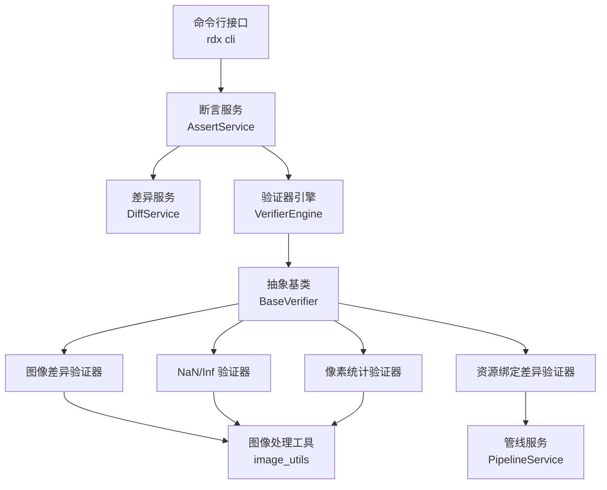
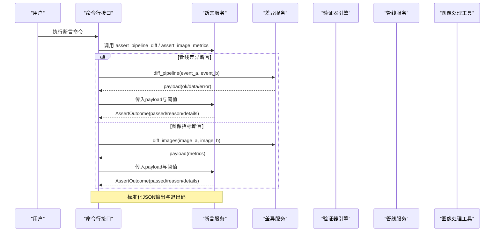
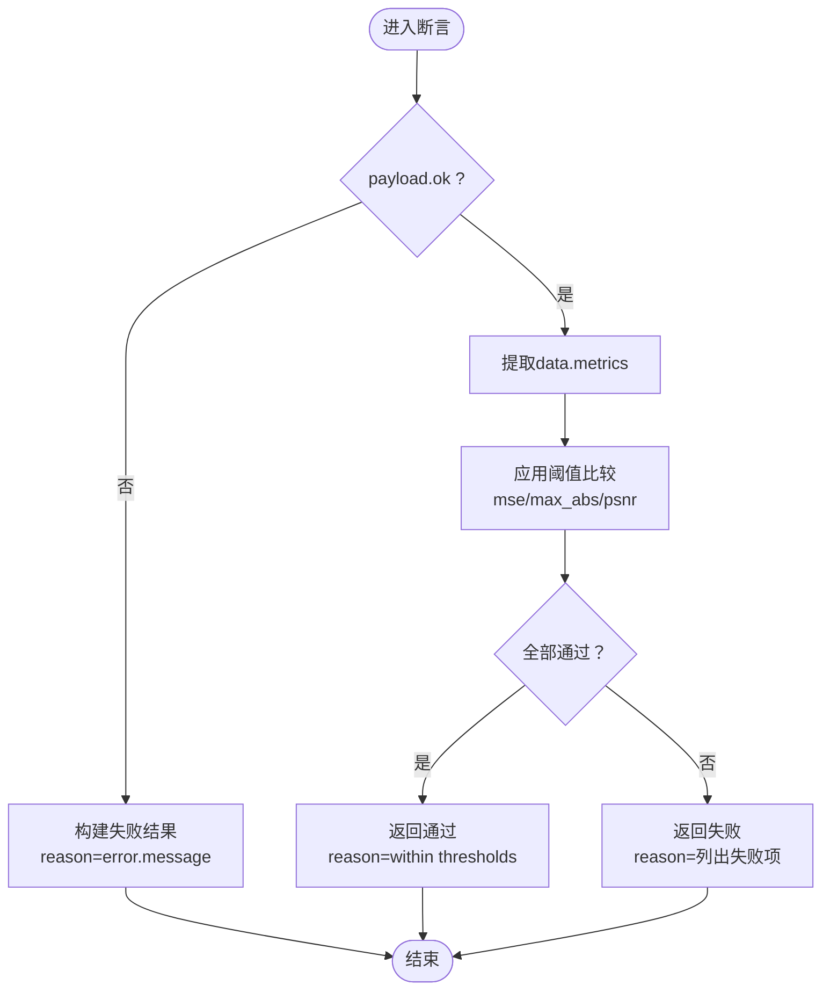
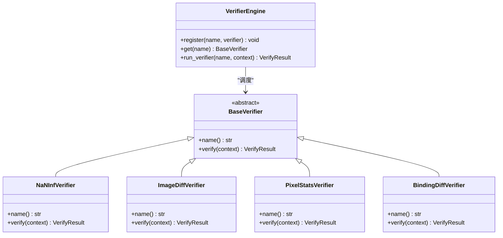
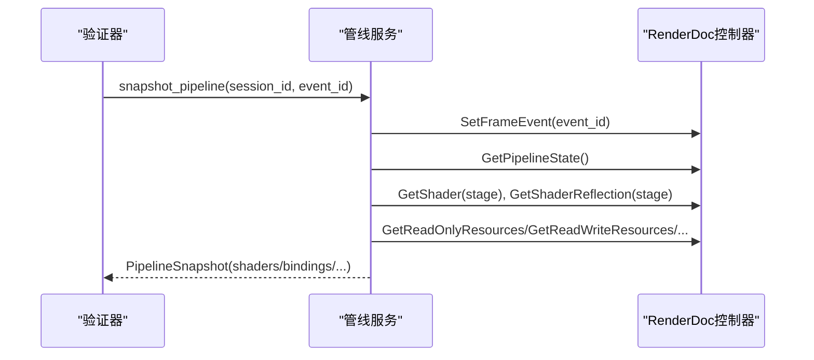
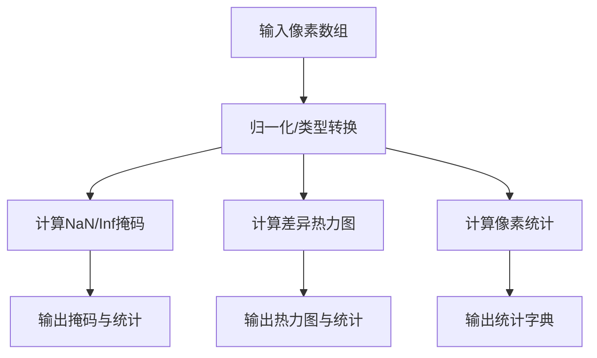
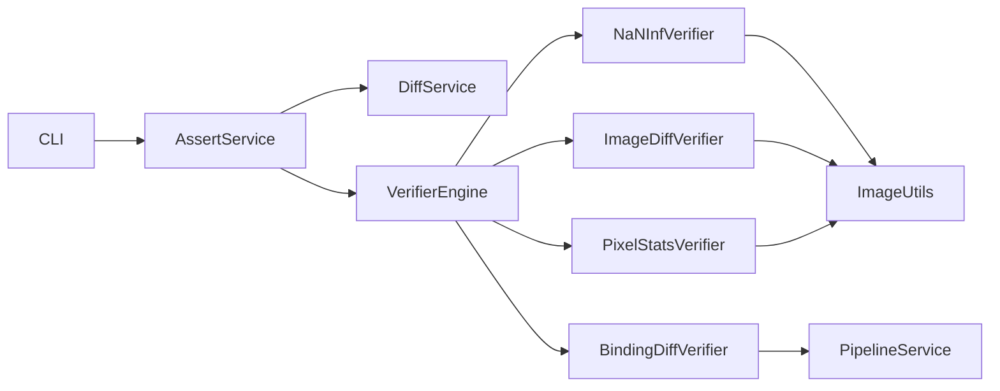

# 断言服务

<cite>
**本文引用的文件**
- [assert_service.py](file://rdx/core/assert_service.py)
- [verifiers.py](file://rdx/core/verifiers.py)
- [pipeline_service.py](file://rdx/core/pipeline_service.py)
- [image_utils.py](file://rdx/utils/image_utils.py)
- [diff_service.py](file://rdx/core/diff_service.py)
- [cli.py](file://rdx/cli.py)
- [experiment_runner.py](file://rdx/core/experiment_runner.py)
</cite>

## 目录
1. [简介](#简介)
2. [项目结构](#项目结构)
3. [核心组件](#核心组件)
4. [架构总览](#架构总览)
5. [详细组件分析](#详细组件分析)
6. [依赖关系分析](#依赖关系分析)
7. [性能考虑](#性能考虑)
8. [故障排查指南](#故障排查指南)
9. [结论](#结论)
10. [附录：API参考与使用示例](#附录api参考与使用示例)

## 简介
本文件面向“断言服务”的完整说明，覆盖以下目标：
- Pipeline 断言：着色器程序版本检查、管线状态验证、资源绑定确认。
- 图像断言：像素值比较、直方图/统计指标验证（MSE、PSNR、最大绝对差等）。
- 自定义验证规则：规则定义、执行引擎、结果评估。
- 失败处理策略：错误分类、影响评估、修复建议。
- 设计模式：规则注册、条件匹配、执行调度。
- API 参考：断言创建、执行与管理方法。
- 实战示例：自动化测试与质量保证流程。
- 性能优化与批量执行最佳实践。

## 项目结构
断言能力由多个模块协同实现：
- 断言门面与CLI集成：统一入口与标准化输出。
- 可插拔验证器引擎：抽象基类 + 内置验证器 + 注册表与调度。
- 管线快照与资源绑定：跨图形API的管线状态采集与对比。
- 图像处理工具：像素差异、NaN/Inf检测、统计计算、可视化。
- 实验运行器：二分搜索、批处理、置信度评估。

图表来源
- [assert_service.py:16-78](file://rdx/core/assert_service.py#L16-L78)
- [verifiers.py:68-852](file://rdx/core/verifiers.py#L68-L852)
- [pipeline_service.py:590-702](file://rdx/core/pipeline_service.py#L590-L702)
- [image_utils.py:80-220](file://rdx/utils/image_utils.py#L80-L220)
- [diff_service.py:11-51](file://rdx/core/diff_service.py#L11-L51)
- [cli.py:1332-1378](file://rdx/cli.py#L1332-L1378)

章节来源
- [assert_service.py:16-78](file://rdx/core/assert_service.py#L16-L78)
- [verifiers.py:68-852](file://rdx/core/verifiers.py#L68-L852)
- [pipeline_service.py:590-702](file://rdx/core/pipeline_service.py#L590-L702)
- [image_utils.py:80-220](file://rdx/utils/image_utils.py#L80-L220)
- [diff_service.py:11-51](file://rdx/core/diff_service.py#L11-L51)
- [cli.py:1332-1378](file://rdx/cli.py#L1332-L1378)

## 核心组件
- 断言服务（AssertService）
  - 提供稳定的 0/1/2 退出语义。
  - 支持管线差异断言与图像指标断言。
- 验证器引擎（VerifierEngine）
  - 基于抽象基类的可插拔验证器框架。
  - 内置四种验证器：NaN/Inf、图像差异、像素统计、资源绑定差异。
- 管线服务（PipelineService）
  - 跨图形API的管线快照与资源绑定提取。
- 图像处理工具（image_utils）
  - 像素差异、NaN/Inf掩码、统计、直方图/热力图等。
- 差异服务（DiffService）
  - 封装管线与图像差异调用。
- 实验运行器（ExperimentRunner）
  - 二分搜索定位问题帧、批处理执行、置信度评估。

章节来源
- [assert_service.py:16-78](file://rdx/core/assert_service.py#L16-L78)
- [verifiers.py:68-852](file://rdx/core/verifiers.py#L68-L852)
- [pipeline_service.py:590-702](file://rdx/core/pipeline_service.py#L590-L702)
- [image_utils.py:80-220](file://rdx/utils/image_utils.py#L80-L220)
- [diff_service.py:11-51](file://rdx/core/diff_service.py#L11-L51)
- [experiment_runner.py:144-222](file://rdx/core/experiment_runner.py#L144-L222)

## 架构总览
断言服务通过CLI触发，内部将请求分发到断言服务或验证器引擎；验证器引擎根据名称调度具体验证器；部分验证器需要管线服务与图像处理工具；最终返回结构化结果并输出标准化JSON。

图表来源
- [cli.py:1332-1378](file://rdx/cli.py#L1332-L1378)
- [diff_service.py:11-51](file://rdx/core/diff_service.py#L11-L51)
- [assert_service.py:16-78](file://rdx/core/assert_service.py#L16-L78)

## 详细组件分析

### 断言服务（AssertService）
- 功能
  - 管线差异断言：解析payload中的diff列表长度，与max_changes阈值比较。
  - 图像指标断言：读取metrics（mse、max_abs、psnr），按阈值判断是否通过。
- 数据结构
  - AssertOutcome：包含passed、reason、details。
- 错误处理
  - 若payload.ok为False，则提取error.message作为原因，并标记未通过。
- 返回值
  - 始终返回AssertOutcome，便于上层统一处理。

图表来源
- [assert_service.py:16-78](file://rdx/core/assert_service.py#L16-L78)

章节来源
- [assert_service.py:16-78](file://rdx/core/assert_service.py#L16-L78)

### 验证器引擎与内置验证器
- 抽象基类（BaseVerifier）
  - 定义name()与verify(context)接口。
- 内置验证器
  - NaNInfVerifier：渲染事件后读回纹理，计算NaN/Inf掩码与密度，必要时存储mask artifact。
  - ImageDiffVerifier：加载参考图像，计算逐像素L2距离热力图，统计mean_diff、max_diff、diff_ratio。
  - PixelStatsVerifier：在指定区域遍历像素，统计NaN/Inf、越界计数与通道均值/极值。
  - BindingDiffVerifier：对两个事件的管线快照进行资源绑定对比，记录新增、删除、变更。
- 引擎调度
  - VerifierEngine维护注册表，run_verifier捕获异常并返回VerifyResult。

图表来源
- [verifiers.py:68-852](file://rdx/core/verifiers.py#L68-L852)

章节来源
- [verifiers.py:68-852](file://rdx/core/verifiers.py#L68-L852)

### 管线服务（PipelineService）
- 功能
  - snapshot_pipeline：获取事件处的管线快照，包括shaders、render_targets、blend_states、depth_stencil、bindings、viewports/scissors、topology等。
  - export_shader：导出着色器反射信息与反汇编。
- 资源绑定提取
  - 针对D3D11/D3D12/Vulkan/OpenGL，从管线状态中提取SRV/UAV/CBV/Sampler等资源绑定条目。
- 用途
  - 为BindingDiffVerifier提供good/bad事件的快照以比较资源绑定差异。

图表来源
- [pipeline_service.py:590-702](file://rdx/core/pipeline_service.py#L590-L702)

章节来源
- [pipeline_service.py:590-702](file://rdx/core/pipeline_service.py#L590-L702)

### 图像处理工具（image_utils）
- 功能
  - compute_naninf_mask：生成NaN/Inf彩色掩码与统计（nan_count、inf_count、density、bbox）。
  - compute_diff_map：计算两张图像的逐像素L2距离热力图与统计（mean_diff、max_diff、diff_pixel_count、diff_ratio）。
  - pixel_stats：计算区域像素统计（min、max、mean、std、has_nan、has_inf）。
  - overlay_bbox：在图像上绘制边界框。
  - tonemap_hdr：HDR色调映射。
- 用途
  - 为NaNInfVerifier、ImageDiffVerifier、PixelStatsVerifier提供底层图像处理能力。

图表来源
- [image_utils.py:80-220](file://rdx/utils/image_utils.py#L80-L220)

章节来源
- [image_utils.py:80-220](file://rdx/utils/image_utils.py#L80-L220)

### 差异服务（DiffService）
- 功能
  - diff_pipeline：调用CoreEngine执行“rd.event.diff_pipeline_state”，比较两事件管线状态。
  - diff_image：调用CoreEngine执行“rd.util.diff_images”，比较两张图像。
- 用途
  - 为CLI断言命令提供统一的差异计算入口。

章节来源
- [diff_service.py:11-51](file://rdx/core/diff_service.py#L11-L51)

### 实验运行器（ExperimentRunner）
- 功能
  - run_experiment：导航到事件，运行baseline验证，可选应用patch后再次验证，生成证据链与verdict。
  - bisect：二分搜索定位首次失败的draw call，结合置信度提前退出。
  - batch_experiments：顺序执行多个实验，确保每次结束后回滚patch。
- 用途
  - 将验证器纳入端到端的质量保证流程，支持自动化回归与性能回归。

章节来源
- [experiment_runner.py:144-222](file://rdx/core/experiment_runner.py#L144-L222)
- [experiment_runner.py:332-372](file://rdx/core/experiment_runner.py#L332-L372)
- [experiment_runner.py:451-537](file://rdx/core/experiment_runner.py#L451-L537)

## 依赖关系分析
- 耦合性
  - 断言服务与CLI紧密耦合，负责标准化输出与退出码。
  - 验证器引擎与具体验证器松耦合，通过注册表扩展。
  - 管线服务依赖RenderDoc控制器，适配多图形API。
  - 图像处理工具依赖NumPy与PIL，提供高性能向量化计算。
- 外部依赖
  - RenderDoc Python模块（延迟导入以避免启动时依赖）。
  - NumPy/PIL用于图像处理。
- 潜在循环依赖
  - 各模块通过明确接口交互，未见直接循环导入。

图表来源
- [assert_service.py:16-78](file://rdx/core/assert_service.py#L16-L78)
- [verifiers.py:68-852](file://rdx/core/verifiers.py#L68-L852)
- [pipeline_service.py:590-702](file://rdx/core/pipeline_service.py#L590-L702)
- [image_utils.py:80-220](file://rdx/utils/image_utils.py#L80-L220)
- [diff_service.py:11-51](file://rdx/core/diff_service.py#L11-L51)

章节来源
- [assert_service.py:16-78](file://rdx/core/assert_service.py#L16-L78)
- [verifiers.py:68-852](file://rdx/core/verifiers.py#L68-L852)
- [pipeline_service.py:590-702](file://rdx/core/pipeline_service.py#L590-L702)
- [image_utils.py:80-220](file://rdx/utils/image_utils.py#L80-L220)
- [diff_service.py:11-51](file://rdx/core/diff_service.py#L11-L51)

## 性能考虑
- 图像差异与统计
  - 使用NumPy向量化操作，避免Python层循环瓶颈。
  - 对大图像采用区域裁剪与阈值过滤以减少计算量。
- 管线快照
  - 按需选择sections减少不必要的数据提取。
  - 异步调用RenderDoc API以降低阻塞时间。
- 批量执行
  - 实验运行器支持批处理，顺序执行并确保状态干净。
  - 二分搜索快速定位问题帧，减少无效验证次数。
- 资源管理
  - 延迟导入RenderDoc模块，避免启动开销。
  - 合理缓存artifact引用，避免重复存储。

[本节为通用性能指导，不直接分析具体文件]

## 故障排查指南
- 常见错误
  - RenderDoc不可用：抛出ImportError，需确保在Replay上下文或设置PYTHONPATH。
  - 纹理读回失败：readback_texture返回None或空数据，检查事件有效性。
  - 参考图像加载失败：路径错误或格式不支持。
  - 管线快照失败：事件不存在或API状态不可用。
- 诊断步骤
  - 查看日志中异常堆栈与耗时信息。
  - 检查payload结构与阈值配置。
  - 保存artifacts（mask、heatmap、binding diff）进行人工比对。
- 修复建议
  - 修正阈值或参考图像。
  - 确保事件处于正确帧且管线状态有效。
  - 更新驱动或RenderDoc版本以解决兼容性问题。

章节来源
- [verifiers.py:101-172](file://rdx/core/verifiers.py#L101-L172)
- [verifiers.py:268-347](file://rdx/core/verifiers.py#L268-L347)
- [verifiers.py:432-584](file://rdx/core/verifiers.py#L432-L584)
- [pipeline_service.py:590-702](file://rdx/core/pipeline_service.py#L590-L702)

## 结论
断言服务提供了从管线到图像的完整验证能力，结合可插拔验证器引擎与图像处理工具，支持自动化测试与质量保证。通过标准化输出与退出码，易于集成到CI/CD流程。实验运行器进一步增强了定位问题与批量执行的能力。

[本节为总结性内容，不直接分析具体文件]

## 附录：API参考与使用示例

### API参考
- 断言服务
  - assert_pipeline_diff(payload, max_changes=0) -> AssertOutcome
  - assert_image_metrics(payload, mse_max=None, max_abs_max=None, psnr_min=None) -> AssertOutcome
- 验证器引擎
  - register(name, verifier)
  - get(name) -> BaseVerifier
  - run_verifier(name, context) -> VerifyResult
- 管线服务
  - snapshot_pipeline(session_id, event_id, sections=None) -> PipelineSnapshot
  - export_shader(session_id, event_id, stage, session_manager, artifact_store) -> ShaderExportBundle
- 图像处理工具
  - compute_naninf_mask(pixels) -> (mask_image, stats)
  - compute_diff_map(img_a, img_b, threshold=0.01) -> (heatmap, stats)
  - pixel_stats(pixels, region=None) -> dict
- 差异服务
  - diff_pipeline(engine, session_id, event_a, event_b, context=None) -> Dict
  - diff_image(engine, image_a_path, image_b_path, output_path=None, context=None) -> Dict

章节来源
- [assert_service.py:16-78](file://rdx/core/assert_service.py#L16-L78)
- [verifiers.py:68-852](file://rdx/core/verifiers.py#L68-L852)
- [pipeline_service.py:590-702](file://rdx/core/pipeline_service.py#L590-L702)
- [image_utils.py:80-220](file://rdx/utils/image_utils.py#L80-L220)
- [diff_service.py:11-51](file://rdx/core/diff_service.py#L11-L51)

### 使用示例
- 管线差异断言
  - 通过CLI调用rdx pipeline diff，传入session_id、event_a、event_b与max_changes阈值。
  - 断言服务解析payload中的diff数量并与阈值比较，输出标准化JSON与退出码。
- 图像指标断言
  - 通过CLI调用rdx image diff，传入image_a、image_b与mse_max、max_abs_max、psnr_min阈值。
  - 断言服务读取metrics并判断是否通过。
- 自定义验证规则
  - 继承BaseVerifier实现verify方法，通过VerifierEngine.register注册。
  - 在实验运行器中配置VerifierConfig，执行前后对比。

章节来源
- [cli.py:1332-1378](file://rdx/cli.py#L1332-L1378)
- [verifiers.py:68-852](file://rdx/core/verifiers.py#L68-L852)
- [experiment_runner.py:144-222](file://rdx/core/experiment_runner.py#L144-L222)