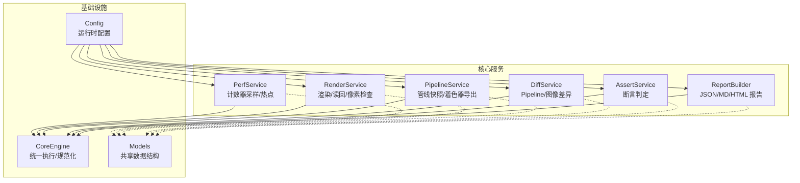
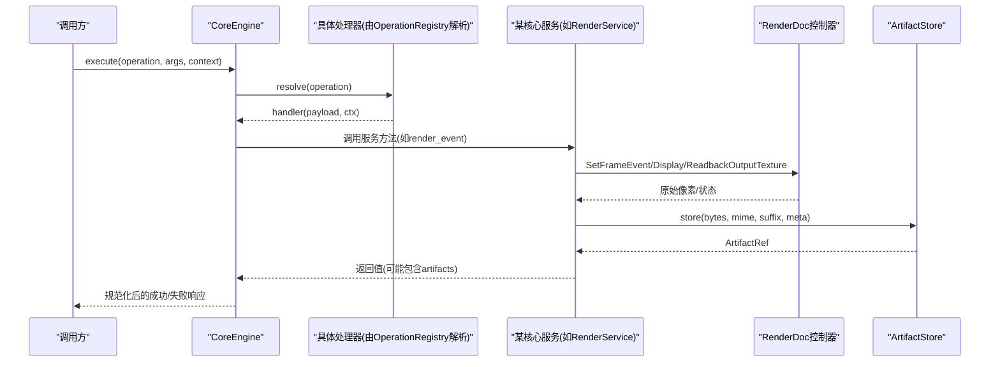
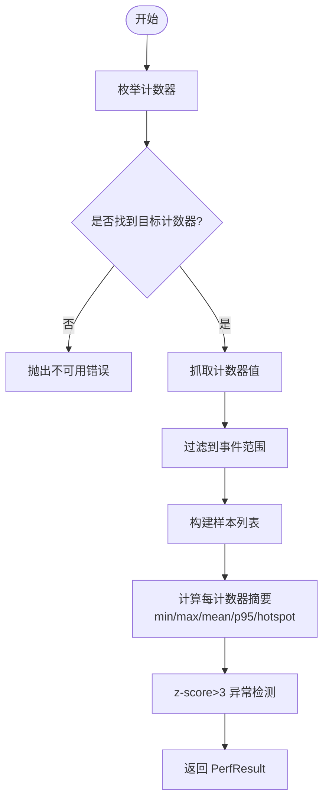
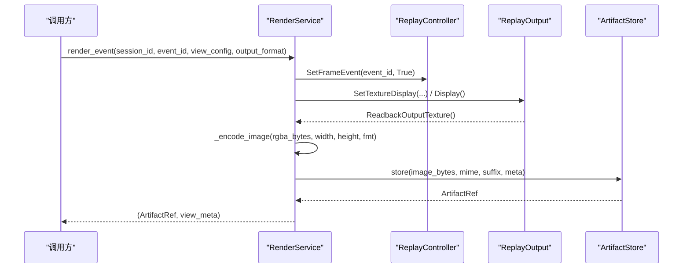
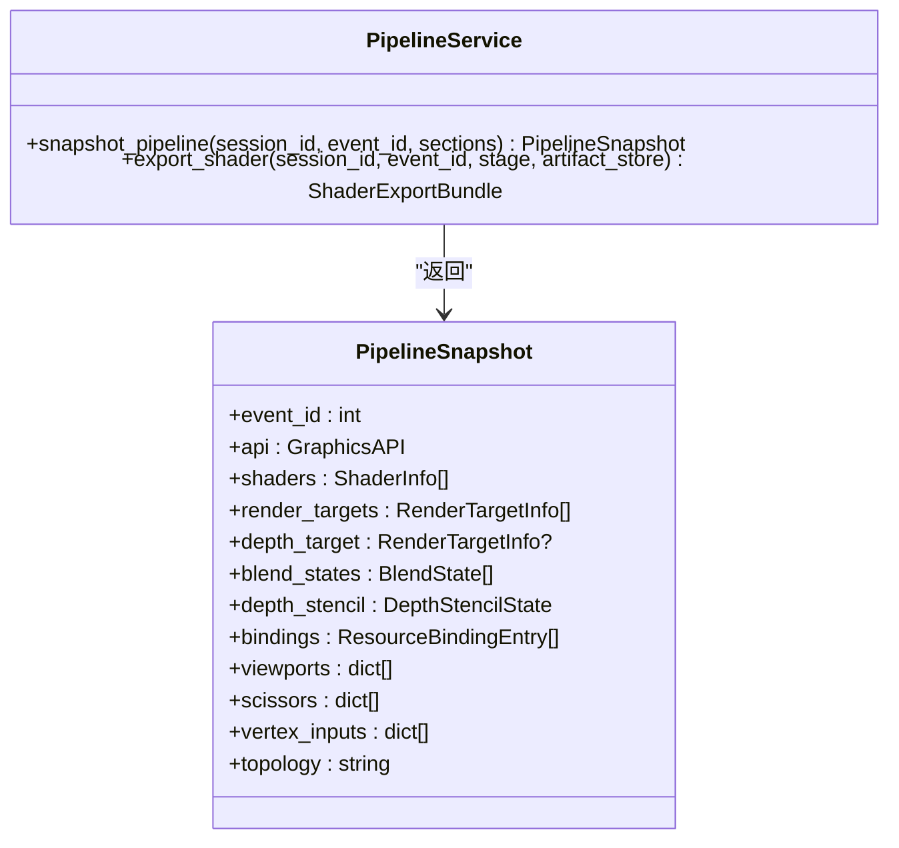
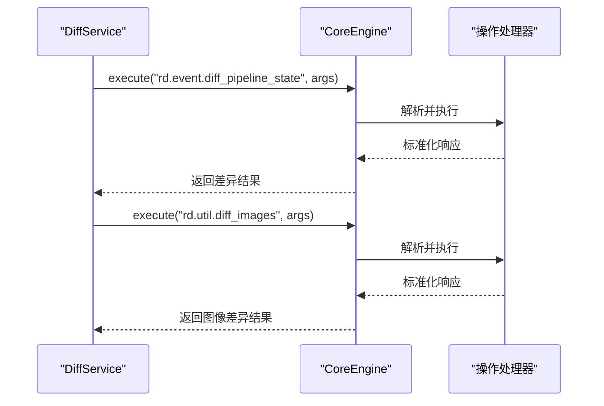
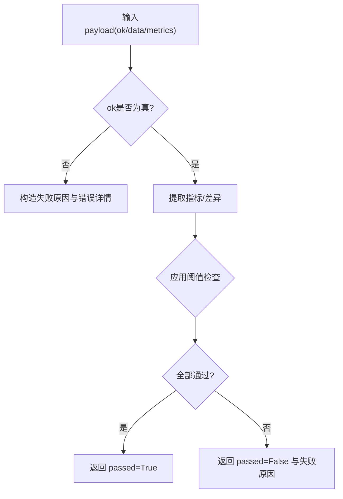
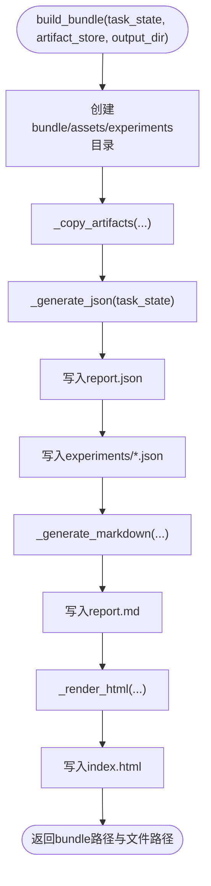
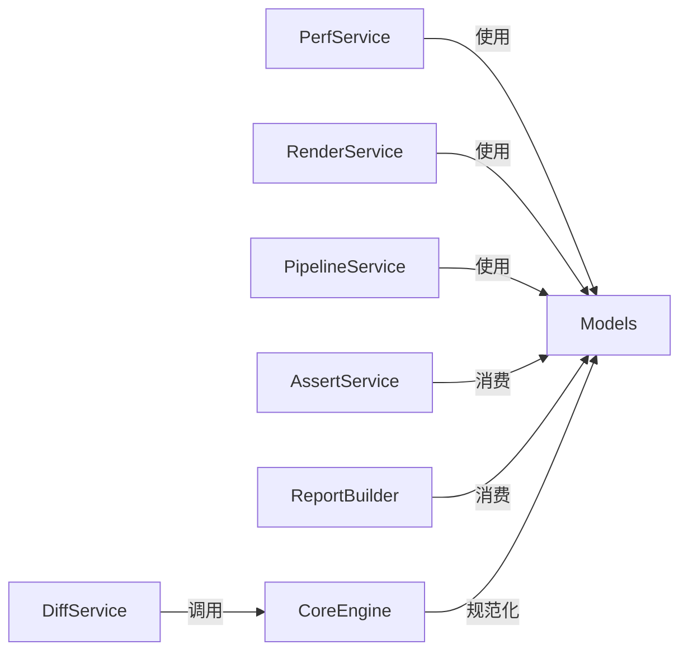

# 核心服务

<cite>
**本文引用的文件**
- [perf_service.py](file://rdc_tool/core/perf_service.py)
- [render_service.py](file://rdc_tool/core/render_service.py)
- [diff_service.py](file://rdc_tool/core/diff_service.py)
- [assert_service.py](file://rdc_tool/core/assert_service.py)
- [report_builder.py](file://rdc_tool/core/report_builder.py)
- [engine.py](file://rdc_tool/core/engine.py)
- [pipeline_service.py](file://rdc_tool/core/pipeline_service.py)
- [models.py](file://rdc_tool/models.py)
- [config.py](file://rdc_tool/config.py)
</cite>

## 目录
1. [简介](#简介)
2. [项目结构](#项目结构)
3. [核心组件](#核心组件)
4. [架构总览](#架构总览)
5. [详细组件分析](#详细组件分析)
6. [依赖关系分析](#依赖关系分析)
7. [性能考虑](#性能考虑)
8. [故障排查指南](#故障排查指南)
9. [结论](#结论)
10. [附录：配置与调优](#附录：配置与调优)

## 简介
本文件面向 RDC-Tool 的核心服务模块，系统性说明以下能力：
- 性能分析服务：计数器枚举、事件范围采样、异常检测、GPU 耗时热点识别。
- 渲染服务：帧缓冲预览、纹理导出/读取、像素级检查、渲染状态可视化。
- 差异比较服务：Pipeline 状态差异、图像差异比较、资源变化跟踪。
- 断言服务：Pipeline 断言、图像指标断言、可扩展的自定义验证规则。
- 报告构建器：结构化 JSON、Markdown 摘要、交互式 HTML 报告、证据收集与归档。
- 服务协作与数据流：各服务通过统一执行引擎与 ArtifactStore 协同工作。
- 配置与调优：运行时参数、性能优化建议、错误处理与恢复策略。

## 项目结构
核心服务位于 rdc_tool/core 下，围绕统一的 CoreEngine 操作注册机制与模型类型（models.py）组织。关键文件职责如下：
- perf_service.py：GPU 性能计数器采样与分析。
- render_service.py：无头渲染、纹理导出/读取、像素检查。
- pipeline_service.py：管线状态快照与着色器导出。
- diff_service.py：基于 CoreEngine 的统一差异封装。
- assert_service.py：断言结果标准化输出。
- report_builder.py：从任务状态生成可分发的调试报告包。
- engine.py：统一操作执行、规范化输出、错误归一化。
- models.py：跨服务共享的数据模型（ArtifactRef、AnomalyInfo、PipelineSnapshot 等）。
- config.py：集中式配置项与环境变量映射。

图表来源
- [engine.py:30-76](file://rdc_tool/core/engine.py#L30-L76)
- [models.py:103-157](file://rdc_tool/models.py#L103-L157)
- [config.py:15-133](file://rdc_tool/config.py#L15-L133)

章节来源
- [engine.py:30-76](file://rdc_tool/core/engine.py#L30-L76)
- [models.py:103-157](file://rdc_tool/models.py#L103-L157)
- [config.py:15-133](file://rdc_tool/config.py#L15-L133)

## 核心组件
- PerfService：提供 GPU 计数器枚举、指定事件范围采样、统计摘要与异常事件检测；支持整回放帧时长测量与热点 Top-K 排序。
- RenderService：将 RenderDoc 的 TextureDisplay/Readback/SaveTexture/GetTextureData 封装为异步 API，支持 PNG/JPG/EXR/HDR/RAW/NPZ 等格式，并产出 ArtifactRef。
- PipelineService：在指定事件处抓取管线快照（API 特定状态、着色器、绑定、视口/裁剪、混合/深度模板等），并可导出着色器反射与反汇编。
- DiffService：通过 CoreEngine 调用 rd.event.diff_pipeline_state 与 rd.util.diff_images，统一返回标准化响应。
- AssertService：对差异或指标进行阈值判定，输出稳定的 AssertOutcome（passed/reason/details）。
- ReportBuilder：从 TaskState 生成 bundle（report.json、report.md、index.html、assets、experiments），内嵌交互 HTML 视图。

章节来源
- [perf_service.py:212-618](file://rdc_tool/core/perf_service.py#L212-L618)
- [render_service.py:346-794](file://rdc_tool/core/render_service.py#L346-L794)
- [pipeline_service.py:590-800](file://rdc_tool/core/pipeline_service.py#L590-L800)
- [diff_service.py:11-52](file://rdc_tool/core/diff_service.py#L11-L52)
- [assert_service.py:9-80](file://rdc_tool/core/assert_service.py#L9-L80)
- [report_builder.py:462-560](file://rdc_tool/core/report_builder.py#L462-L560)

## 架构总览
所有服务以“无状态 + 显式依赖注入”的方式设计，便于测试与复用。对外暴露的接口通常接收 session_manager、artifact_store 等协议对象，内部通过 asyncio.to_thread 将阻塞的 RenderDoc 调用放入线程池，避免阻塞事件循环。

图表来源
- [engine.py:40-76](file://rdc_tool/core/engine.py#L40-L76)
- [render_service.py:357-521](file://rdc_tool/core/render_service.py#L357-L521)
- [pipeline_service.py:597-702](file://rdc_tool/core/pipeline_service.py#L597-L702)

## 详细组件分析

### 性能分析服务（PerfService）
- 计数器枚举：获取可用 GPU 计数器及其描述（名称、单位、结果类型），用于后续采样选择。
- 事件范围采样：在给定事件区间内抓取计数器值，构建 per-event 样本与 per-counter 摘要（min/max/mean/p95/hotspot event），并基于 z-score > 3 检测异常事件。
- 热点检测：自动查找 GPU duration 计数器，抓取全量事件耗时，按降序返回 Top-K 最慢事件。
- 整回放帧时长测量：使用 FrameGPUDuration 计数器一次性测量完整回放耗时，跳过事件调度间隙。

图表来源
- [perf_service.py:235-308](file://rdc_tool/core/perf_service.py#L235-L308)
- [perf_service.py:314-487](file://rdc_tool/core/perf_service.py#L314-L487)
- [perf_service.py:493-618](file://rdc_tool/core/perf_service.py#L493-L618)

章节来源
- [perf_service.py:212-618](file://rdc_tool/core/perf_service.py#L212-L618)

### 渲染服务（RenderService）
- 帧缓冲预览：导航到指定事件，设置 TextureDisplay（缩放、通道、覆盖层、HDR、翻转、raw 输出），显示并读回 RGBA 字节，编码为 PNG/JPG/EXR/HDR，持久化为 ArtifactRef。
- 纹理导出/读取：支持 SaveTexture 直接保存文件，或 GetTextureData 读取原始像素并序列化为 .npz；支持 mip/slice/sample 子资源与区域裁剪。
- 像素检查：read_texture_array 解码不同分量格式（UNORM/SRGB/SNORM/FLOAT），计算有限值的 min/max/mean 与 NaN/Inf 计数。

图表来源
- [render_service.py:357-521](file://rdc_tool/core/render_service.py#L357-L521)
- [render_service.py:523-646](file://rdc_tool/core/render_service.py#L523-L646)
- [render_service.py:658-794](file://rdc_tool/core/render_service.py#L658-L794)

章节来源
- [render_service.py:346-794](file://rdc_tool/core/render_service.py#L346-L794)

### 管线服务（PipelineService）
- 管线快照：在指定事件处获取当前管线状态，包括 API 特定的混合/深度模板/视口/拓扑、着色器信息、渲染目标、资源绑定等，返回 PipelineSnapshot。
- 着色器导出：导出着色器反射 JSON 与可选反汇编文本，作为 ArtifactRef 存储。

图表来源
- [pipeline_service.py:590-702](file://rdc_tool/core/pipeline_service.py#L590-L702)
- [pipeline_service.py:708-800](file://rdc_tool/core/pipeline_service.py#L708-L800)
- [models.py:147-200](file://rdc_tool/models.py#L147-L200)

章节来源
- [pipeline_service.py:590-800](file://rdc_tool/core/pipeline_service.py#L590-L800)

### 差异比较服务（DiffService）
- Pipeline 状态差异：调用 rd.event.diff_pipeline_state，对比两个事件的管线状态差异。
- 图像差异比较：调用 rd.util.diff_images，比较两张图像并可选择输出差异图。

图表来源
- [diff_service.py:11-52](file://rdc_tool/core/diff_service.py#L11-L52)
- [engine.py:40-76](file://rdc_tool/core/engine.py#L40-L76)

章节来源
- [diff_service.py:11-52](file://rdc_tool/core/diff_service.py#L11-L52)

### 断言服务（AssertService）
- Pipeline 断言：根据差异数量与阈值判断是否通过。
- 图像指标断言：对 MSE、最大绝对差、PSNR 等指标进行阈值校验，返回 AssertOutcome。
- 可扩展性：可通过新增静态方法实现自定义验证规则，保持 0/1/2 退出语义的稳定约定。

图表来源
- [assert_service.py:16-80](file://rdc_tool/core/assert_service.py#L16-L80)

章节来源
- [assert_service.py:9-80](file://rdc_tool/core/assert_service.py#L9-L80)

### 报告构建器（ReportBuilder）
- 构建 bundle：在输出目录下创建 bundle/，复制 artifacts 到 assets/，写入 report.json、report.md、index.html，以及每个实验的 JSON。
- JSON 报告：包含任务 ID、bug 类型、捕获信息、二分边界、包围盒、验证器指标、假设、修复候选、置信度、证据、管线快照与实验时间线。
- Markdown 报告：人类可读摘要，含异常细节、管线状态、实验时间线。
- HTML 报告：单文件交互式查看器，支持事件树、图像对比滑块、管线/着色器/资源检查面板、实验时间线。

图表来源
- [report_builder.py:472-560](file://rdc_tool/core/report_builder.py#L472-L560)
- [report_builder.py:566-698](file://rdc_tool/core/report_builder.py#L566-L698)
- [report_builder.py:704-800](file://rdc_tool/core/report_builder.py#L704-L800)

章节来源
- [report_builder.py:462-800](file://rdc_tool/core/report_builder.py#L462-L800)

## 依赖关系分析
- 服务间耦合：
  - 所有服务通过 CoreEngine.execute 统一入口，解耦了具体实现与调用方。
  - Render/Pipeline/Diff 等服务依赖 SessionManager（ReplayController/ReplayOutput）与 ArtifactStore 抽象，便于替换与测试。
- 外部依赖：
  - RenderDoc Python 模块延迟导入，仅在需要时加载，避免在无 replay 环境下的启动失败。
  - 图像处理依赖 PIL/imageio，缺失时降级为 PNG。
- 数据模型：
  - 共享模型集中在 models.py，确保跨服务一致性与可序列化。

图表来源
- [models.py:103-200](file://rdc_tool/models.py#L103-L200)
- [engine.py:40-76](file://rdc_tool/core/engine.py#L40-L76)

章节来源
- [models.py:103-200](file://rdc_tool/models.py#L103-L200)
- [engine.py:40-76](file://rdc_tool/core/engine.py#L40-L76)

## 性能考虑
- 线程池执行：所有阻塞的 RenderDoc 调用通过 asyncio.to_thread 或 run_in_executor 提交到默认线程池，避免阻塞事件循环。
- 采样与统计：
  - 计数器采样仅保留事件范围内的数据，减少内存占用。
  - p95 计算采用线性插值，标准差用于异常检测，避免引入第三方库。
- 图像编码：
  - 优先使用高效格式（PNG/JPG），EXR/HDR 在依赖缺失时自动降级。
  - read_texture_array 支持区域裁剪与格式归一化，减少不必要的全图处理。
- 报告生成：
  - 批量写入 JSON/MD/HTML，避免重复 IO。
  - 压缩与限制嵌入图片尺寸以降低报告体积。

[本节为通用指导，不直接分析具体文件]

## 故障排查指南
- RenderDoc 模块不可用：
  - 现象：计数器查询/渲染/管线快照失败。
  - 处理：确认在 RenderDoc replay 上下文运行或将 renderdoc 共享库目录加入 sys.path；服务会记录警告并抛出明确错误。
- 计数器不可用或格式不支持：
  - 现象：enumerate_counters 或 sample_counters 报错。
  - 处理：检查驱动支持的计数器集合与结果类型；必要时更换后端或更新 runtime。
- 纹理导出失败：
  - 现象：SaveTexture 返回非成功状态或生成空文件。
  - 处理：检查 texture_id、subresource、文件格式；参考 RuntimeToolError 中的 details 定位失败阶段。
- 图像差异/断言失败：
  - 现象：AssertService 返回 passed=False。
  - 处理：检查阈值设置（mse_max、max_abs_max、psnr_min）与输入图像质量；必要时调整阈值或重新采集。
- 报告构建失败：
  - 现象：bundle 未生成或部分文件缺失。
  - 处理：检查输出目录权限、artifacts 是否存在、磁盘空间；查看日志中关于拷贝/写入的错误。

章节来源
- [perf_service.py:235-308](file://rdc_tool/core/perf_service.py#L235-L308)
- [render_service.py:523-646](file://rdc_tool/core/render_service.py#L523-L646)
- [assert_service.py:37-80](file://rdc_tool/core/assert_service.py#L37-L80)
- [report_builder.py:472-560](file://rdc_tool/core/report_builder.py#L472-L560)

## 结论
核心服务以模块化、无状态、异步友好的方式组织，围绕 CoreEngine 统一执行与模型类型，实现了从性能采样、渲染读回、管线快照、差异比较、断言判定到报告生成的完整闭环。通过延迟导入 RenderDoc、线程池执行、健壮的错误归一化与灵活的配置体系，系统在保证稳定性的同时提供了良好的扩展性与可观测性。

[本节为总结，不直接分析具体文件]

## 附录：配置与调优
- 关键配置项（来自 config.py）：
  - BackendConfig：后端类型、GPU 厂商/索引、远程主机/端口/协议/认证。
  - ReplayConfig：无头模式、优化等级、默认输出分辨率、最大纹理读回大小、重放超时。
  - WorkerConfig：每 GPU 最大工作线程、远程控制器上限、任务队列大小、工作超时。
  - ArtifactConfig：存储路径、最大容量、哈希算法、是否压缩。
  - BisectConfig：二分策略、最大迭代次数、置信度阈值、早期停止策略。
  - ReportConfig：输出路径、是否生成 HTML/MD/JSON、是否嵌入缩略图、最大嵌入宽度。
  - RuntimeLimitsConfig：上下文/会话/捕获文件/大小限制、重放内存倍数、最近操作数。
  - PatchConfig：补丁操作上限、崩溃自动回滚、保留原始着色器、SPIRV/DXC 工具路径。
- 环境变量映射：
  - RDC_TOOL_RENDERDOC_PATH、RDC_TOOL_ARTIFACT_STORE、RDC_TOOL_DATA_DIR、RDC_TOOL_REPORT_DIR、RDC_TOOL_LOG_LEVEL、RDC_TOOL_GPU_VENDOR、RDC_TOOL_SPIRV_TOOLS_PATH、RDC_TOOL_HEADLESS、RDC_TOOL_BISECT_*、RDC_TOOL_CONTEXT_ARTIFACT_*、RDC_TOOL_MAX_* 等。
- 性能调优建议：
  - 合理设置 max_texture_readback_bytes 与 worker 并发，避免内存峰值过高。
  - 针对大场景降低输出分辨率或启用 raw_output 跳过 sRGB 转换。
  - 使用 top_k 控制热点检测规模，减少不必要的计数器抓取。
  - 报告生成时关闭不必要的嵌入（embed_thumbnails=false）以减少体积。

章节来源
- [config.py:15-186](file://rdc_tool/config.py#L15-L186)