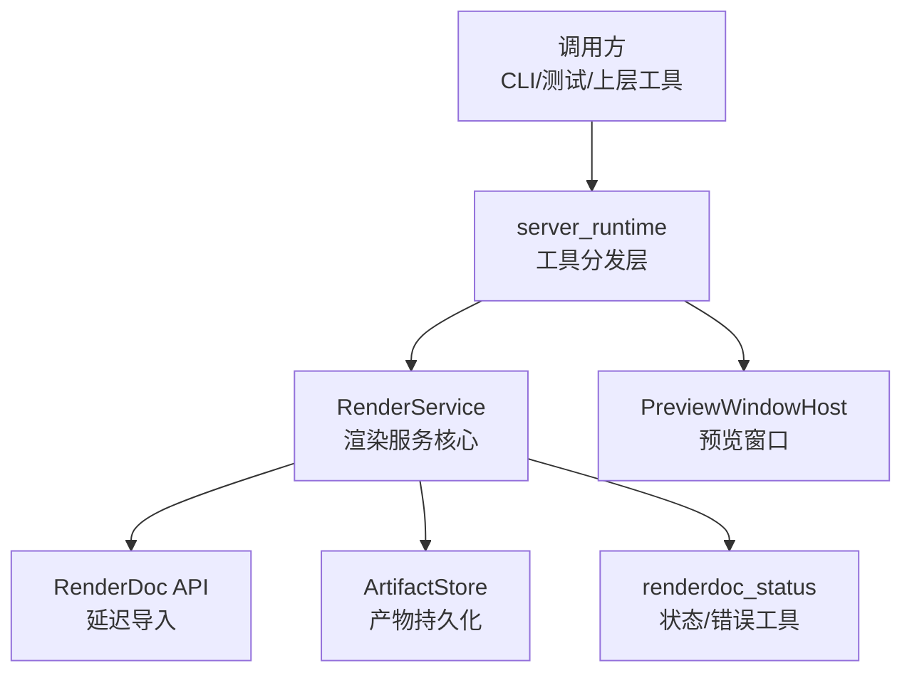
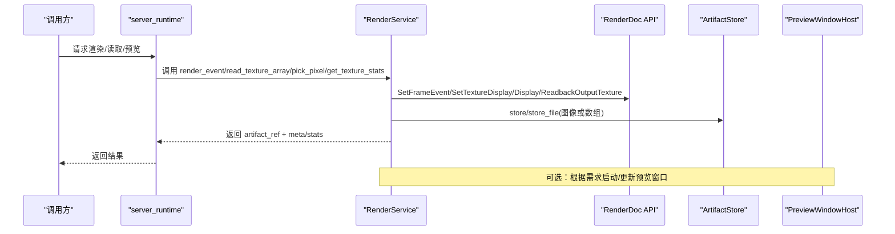
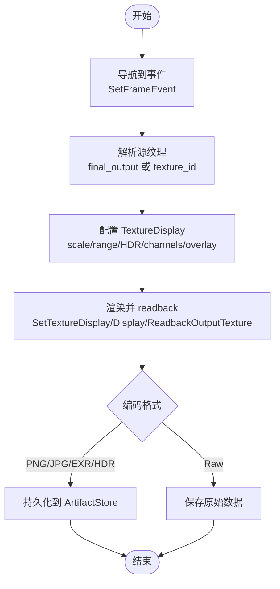
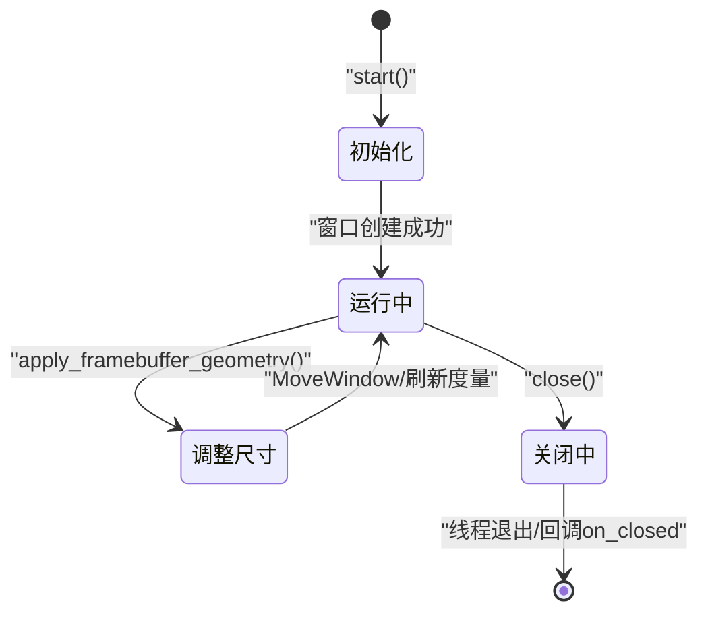
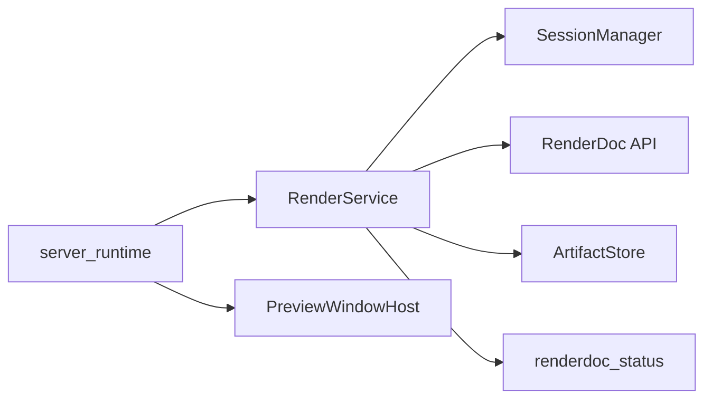

# 渲染服务

<cite>
**本文引用的文件**
- [render_service.py](file://rdc_tool/core/render_service.py)
- [preview_window.py](file://rdc_tool/preview_window.py)
- [renderdoc_status.py](file://rdc_tool/core/renderdoc_status.py)
- [server_runtime.py](file://rdc_tool/server_runtime.py)
</cite>

## 目录
1. [简介](#简介)
2. [项目结构](#项目结构)
3. [核心组件](#核心组件)
4. [架构总览](#架构总览)
5. [详细组件分析](#详细组件分析)
6. [依赖关系分析](#依赖关系分析)
7. [性能考量](#性能考量)
8. [故障排查指南](#故障排查指南)
9. [结论](#结论)
10. [附录：使用示例与最佳实践](#附录使用示例与最佳实践)

## 简介
本文件面向“渲染服务”的完整技术文档，聚焦以下目标：
- 帧缓冲预览功能的实现原理：渲染状态检查、图像捕获、预览窗口管理。
- 渲染文档集成能力：与 RenderDoc API 交互，获取渲染管线状态与资源信息。
- 预览窗口生命周期管理、图像格式转换与显示优化。
- 服务接口说明：渲染状态查询、帧缓冲操作、预览控制方法。
- 渲染错误检测与恢复机制、不同 GPU 后端兼容性处理。
- 性能监控与调试工具使用指南。
- 实际代码示例路径，展示如何使用渲染服务进行图形调试和问题诊断。

## 项目结构
渲染服务由以下关键模块构成：
- 渲染服务核心：RenderService，封装 RenderDoc 的纹理显示、readback、像素拾取、统计计算等异步接口。
- 预览窗口：PreviewWindowHost，基于 Windows GDI 创建并管理一个独立消息循环的预览窗口，用于实时显示或辅助调试。
- RenderDoc 状态工具：renderdoc_status，统一解析和包装 RenderDoc 返回的状态对象，便于错误分类与上报。
- 运行时调度：server_runtime，将渲染服务暴露为可被上层调用（如 CLI、测试）的工具入口，并协调会话、事件、资源等上下文。

图表来源
- [render_service.py:346-521](file://rdc_tool/core/render_service.py#L346-L521)
- [preview_window.py:192-437](file://rdc_tool/preview_window.py#L192-L437)
- [renderdoc_status.py:10-105](file://rdc_tool/core/renderdoc_status.py#L10-L105)
- [server_runtime.py:54-70](file://rdc_tool/server_runtime.py#L54-L70)

章节来源
- [render_service.py:346-521](file://rdc_tool/core/render_service.py#L346-L521)
- [preview_window.py:192-437](file://rdc_tool/preview_window.py#L192-L437)
- [renderdoc_status.py:10-105](file://rdc_tool/core/renderdoc_status.py#L10-L105)
- [server_runtime.py:54-70](file://rdc_tool/server_runtime.py#L54-L70)

## 核心组件
- RenderService
  - render_event：导航到指定事件，设置 TextureDisplay，渲染并 readback 输出纹理，编码为图像并持久化为 artifact。
  - save_texture_file：保存指定纹理到文件或内存产物，支持 raw/save 两种路径。
  - read_texture_array/readback_texture：从 GPU 读回纹理数据，解码为数值数组，可选区域裁剪，生成 .npz 产物与统计信息。
  - pick_pixel：在指定纹理中拾取单个像素值，支持 float/uint/int 解释。
  - get_texture_stats：使用 GPU 加速 GetMinMax 计算逐通道 min/max 统计，避免全量 readback。
- PreviewWindowHost
  - 创建独立线程的消息循环窗口，支持自动尺寸适配、用户手动调整、关闭回调、几何快照等。
- renderdoc_status
  - 提供 status_ok/status_text/status_code_name/status_code_raw/build_renderdoc_error_details/raise_renderdoc_error 等工具函数，统一错误语义。
- server_runtime
  - 注册并调度渲染相关工具，注入 SessionManager、ArtifactStore、PreviewWindowHost 等依赖，对外暴露统一接口。

章节来源
- [render_service.py:346-1042](file://rdc_tool/core/render_service.py#L346-L1042)
- [preview_window.py:192-437](file://rdc_tool/preview_window.py#L192-L437)
- [renderdoc_status.py:10-105](file://rdc_tool/core/renderdoc_status.py#L10-L105)
- [server_runtime.py:54-70](file://rdc_tool/server_runtime.py#L54-L70)

## 架构总览
渲染服务通过异步方式调用 RenderDoc API，所有阻塞调用均派发至线程执行，确保不阻塞事件循环。渲染流程包括：
- 选择源纹理：final_output 或显式 texture_id。
- 配置 TextureDisplay：缩放、范围、HDR、通道可见性、叠加层等。
- 渲染与 readback：SetTextureDisplay -> Display -> ReadbackOutputTexture。
- 编码与存储：PNG/JPG/EXR/HDR/BMP/TGA/DDS/Raw/NPZ，写入 ArtifactStore。
- 预览窗口：可选地创建/更新窗口以显示结果或辅助调试。

图表来源
- [render_service.py:357-521](file://rdc_tool/core/render_service.py#L357-L521)
- [render_service.py:658-794](file://rdc_tool/core/render_service.py#L658-L794)
- [render_service.py:800-873](file://rdc_tool/core/render_service.py#L800-L873)
- [render_service.py:879-946](file://rdc_tool/core/render_service.py#L879-L946)
- [preview_window.py:221-301](file://rdc_tool/preview_window.py#L221-L301)

## 详细组件分析

### RenderService：帧缓冲预览与图像捕获
- 渲染状态检查
  - 通过 controller.SetFrameEvent(event_id, True) 导航到目标事件。
  - 通过 GetPipelineState/GetOutputTargets 解析当前 draw call 的输出目标，选择 final_output 或显式 texture_id。
  - 通过 GetTextures 枚举资源，校验 subresource（mip/slice/sample）与纹理描述。
- 图像捕获
  - 构建 TextureDisplay 并设置 scale/rangeMin/rangeMax/hdrMultiplier/flipY/rawOutput/channels/overlay。
  - 调用 output.SetTextureDisplay -> output.Display -> output.ReadbackOutputTexture 获取 RGBA 字节流。
  - 使用 _encode_image 将 RGBA8 编码为 PNG/JPG/EXR/HDR/BMP/TGA/DDS/Raw，必要时回退到 PNG。
- 预览窗口管理
  - 可通过 PreviewWindowHost 创建独立窗口，按 framebuffer 尺寸自适应窗口大小，支持用户拖拽与自动覆盖。
- 错误处理
  - 对 SaveTexture/GetTextureData/PickPixel/GetMinMax 等调用，统一使用 renderdoc_status 工具构造结构化错误详情。
  - 对不支持的格式或无效参数抛出明确异常，包含后端类型、捕获上下文、修复提示。

图表来源
- [render_service.py:357-521](file://rdc_tool/core/render_service.py#L357-L521)
- [render_service.py:523-653](file://rdc_tool/core/render_service.py#L523-L653)
- [render_service.py:658-794](file://rdc_tool/core/render_service.py#L658-L794)

章节来源
- [render_service.py:357-521](file://rdc_tool/core/render_service.py#L357-L521)
- [render_service.py:523-653](file://rdc_tool/core/render_service.py#L523-L653)
- [render_service.py:658-794](file://rdc_tool/core/render_service.py#L658-L794)
- [render_service.py:800-873](file://rdc_tool/core/render_service.py#L800-L873)
- [render_service.py:879-946](file://rdc_tool/core/render_service.py#L879-L946)

### PreviewWindowHost：预览窗口生命周期与显示优化
- 生命周期
  - start：创建线程、注册窗口类、创建窗口、进入消息循环；等待就绪事件，超时或启动失败抛出异常。
  - close：发送 WM_CLOSE，等待线程退出；记录关闭原因（user/runtime）。
  - is_alive：检查线程与句柄有效性。
- 尺寸适配
  - apply_framebuffer_geometry：根据 framebuffer 宽高与工作区大小计算合适的客户端尺寸，支持强制重设与用户手动覆盖。
  - geometry_snapshot：返回窗口矩形、客户端矩形、是否手动覆盖等信息。
- 显示优化
  - 自动尺寸覆盖深度计数，避免在自动调整期间响应用户拖拽导致的冲突。
  - 工作区尺寸探测，优先使用 MonitorFromWindow/GetMonitorInfo，回退到主显示器工作区。

图表来源
- [preview_window.py:221-301](file://rdc_tool/preview_window.py#L221-L301)
- [preview_window.py:303-379](file://rdc_tool/preview_window.py#L303-L379)
- [preview_window.py:381-437](file://rdc_tool/preview_window.py#L381-L437)

章节来源
- [preview_window.py:192-437](file://rdc_tool/preview_window.py#L192-L437)

### RenderDoc 状态与错误处理
- 状态解析
  - status_ok：兼容多种返回类型（bool、ResultCode、对象属性）。
  - status_text/status_code_name/status_code_raw：提取可读文本、名称与原始码。
- 错误构建与抛出
  - build_renderdoc_error_details：组装 source_layer、operation、backend_type、capture_context、renderdoc_status、classification、fix_hint。
  - raise_renderdoc_error：直接抛出 RuntimeToolError，附带结构化 details。
- 在渲染服务中的使用
  - SaveTexture 失败时，构造 details 并抛出异常，包含后端类型、捕获上下文、修复提示。
  - 其他调用失败时，同样通过该工具链统一错误语义，便于上层分析与定位。

章节来源
- [renderdoc_status.py:10-105](file://rdc_tool/core/renderdoc_status.py#L10-L105)
- [render_service.py:523-653](file://rdc_tool/core/render_service.py#L523-L653)

### 运行时集成与接口暴露
- server_runtime 负责：
  - 注册渲染相关工具（render_event、read_texture_array、pick_pixel、get_texture_stats 等）。
  - 注入 SessionManager、ArtifactStore、PreviewWindowHost 等依赖。
  - 将渲染服务的异步调用封装为统一的工具调用契约，返回标准信封（ok/data/artifacts/error/meta）。
- 典型调用路径
  - 上层工具/CLI 调用 server_runtime._dispatch_replay/_dispatch_capture，内部路由到 RenderService。
  - 渲染服务返回 artifact_ref 与元数据，供 UI/报告/后续分析使用。

章节来源
- [server_runtime.py:54-70](file://rdc_tool/server_runtime.py#L54-L70)
- [render_service.py:346-521](file://rdc_tool/core/render_service.py#L346-L521)

## 依赖关系分析
- 组件耦合
  - RenderService 依赖 SessionManager（ReplayController/ReplayOutput）、ArtifactStore、RenderDoc API（延迟导入）。
  - PreviewWindowHost 依赖 Windows GDI（ctypes.windll.user32/kernel32），无外部 Python 库依赖。
  - renderdoc_status 依赖 RuntimeToolError，提供统一错误语义。
  - server_runtime 聚合上述组件，作为对外入口。
- 外部依赖
  - RenderDoc Python 模块：仅在 replay context 或共享库路径可用时加载。
  - PIL/imageio：用于图像编码（PNG/JPG/EXR/HDR），缺失时回退到 PNG。
  - NumPy：用于数组解析与统计计算。

图表来源
- [render_service.py:346-521](file://rdc_tool/core/render_service.py#L346-L521)
- [preview_window.py:192-437](file://rdc_tool/preview_window.py#L192-L437)
- [renderdoc_status.py:10-105](file://rdc_tool/core/renderdoc_status.py#L10-L105)
- [server_runtime.py:54-70](file://rdc_tool/server_runtime.py#L54-L70)

章节来源
- [render_service.py:346-521](file://rdc_tool/core/render_service.py#L346-L521)
- [preview_window.py:192-437](file://rdc_tool/preview_window.py#L192-L437)
- [renderdoc_status.py:10-105](file://rdc_tool/core/renderdoc_status.py#L10-L105)
- [server_runtime.py:54-70](file://rdc_tool/server_runtime.py#L54-L70)

## 性能考量
- 异步与线程池
  - 所有阻塞的 RenderDoc 调用通过 asyncio.to_thread 分派，避免阻塞事件循环。
- 最小化 readback
  - 优先使用 GPU 加速的 GetMinMax 计算统计，避免全量 CPU readback。
  - read_texture_array 仅返回必要区域与数据类型，减少内存与带宽占用。
- 图像编码优化
  - PNG 压缩级别适中（level=6），JPG 质量 92，EXR/HDR 使用 imageio 高效写入，缺失时回退 PNG。
- 预览窗口效率
  - 自动尺寸覆盖深度计数，避免频繁 MoveWindow 与用户拖拽冲突。
  - 工作区尺寸缓存与快速回退，减少系统调用开销。

[本节为通用性能指导，无需特定文件引用]

## 故障排查指南
- 常见错误与定位
  - SaveTexture 失败：检查 RenderDoc 状态、纹理 ID、subresource、文件格式；查看 details 中的 backend_type、capture_context、renderdoc_status。
  - 纹理不存在或 subresource 越界：确认 GetTextures 列表与 mip/slice/sample 范围。
  - 像素坐标越界：校验 x/y 与纹理尺寸（考虑 mip 缩放）。
  - 预览窗口未就绪：检查 start 超时与启动错误；确认窗口类注册与消息循环。
- 错误分类与修复提示
  - 使用 renderdoc_status 工具统一错误语义，包含 classification 与 fix_hint，便于自动化处理与人工排查。
- 后端兼容性
  - 不同 GPU 后端（D3D/Vulkan/GL）可能影响纹理格式与 readback 行为；通过 backend_type 字段区分并适配。

章节来源
- [render_service.py:523-653](file://rdc_tool/core/render_service.py#L523-L653)
- [render_service.py:658-794](file://rdc_tool/core/render_service.py#L658-L794)
- [render_service.py:800-873](file://rdc_tool/core/render_service.py#L800-L873)
- [renderdoc_status.py:10-105](file://rdc_tool/core/renderdoc_status.py#L10-L105)

## 结论
渲染服务通过 RenderDoc API 提供了强大的帧缓冲预览、纹理 readback、像素拾取与统计能力，结合 PreviewWindowHost 实现了灵活的预览窗口管理。统一的错误处理与后端兼容性策略确保了在不同环境下的稳定性。通过 server_runtime 的集中调度，渲染服务可以无缝集成到上层工具链，支持图形调试与问题诊断。

[本节为总结，无需特定文件引用]

## 附录：使用示例与最佳实践
- 渲染事件并保存为图像
  - 调用路径：server_runtime 工具 -> RenderService.render_event -> ArtifactStore.store。
  - 参考路径：[render_service.py:357-521](file://rdc_tool/core/render_service.py#L357-L521)
- 读取纹理数组并导出为 .npz
  - 调用路径：server_runtime 工具 -> RenderService.read_texture_array -> ArtifactStore.store。
  - 参考路径：[render_service.py:658-794](file://rdc_tool/core/render_service.py#L658-L794)
- 拾取像素值
  - 调用路径：server_runtime 工具 -> RenderService.pick_pixel。
  - 参考路径：[render_service.py:800-873](file://rdc_tool/core/render_service.py#L800-L873)
- 计算纹理统计
  - 调用路径：server_runtime 工具 -> RenderService.get_texture_stats。
  - 参考路径：[render_service.py:879-946](file://rdc_tool/core/render_service.py#L879-L946)
- 预览窗口使用
  - 创建与关闭：PreviewWindowHost.start/close。
  - 尺寸适配：apply_framebuffer_geometry。
  - 参考路径：[preview_window.py:221-301](file://rdc_tool/preview_window.py#L221-L301)

章节来源
- [render_service.py:357-521](file://rdc_tool/core/render_service.py#L357-L521)
- [render_service.py:658-794](file://rdc_tool/core/render_service.py#L658-L794)
- [render_service.py:800-873](file://rdc_tool/core/render_service.py#L800-L873)
- [render_service.py:879-946](file://rdc_tool/core/render_service.py#L879-L946)
- [preview_window.py:221-301](file://rdc_tool/preview_window.py#L221-L301)