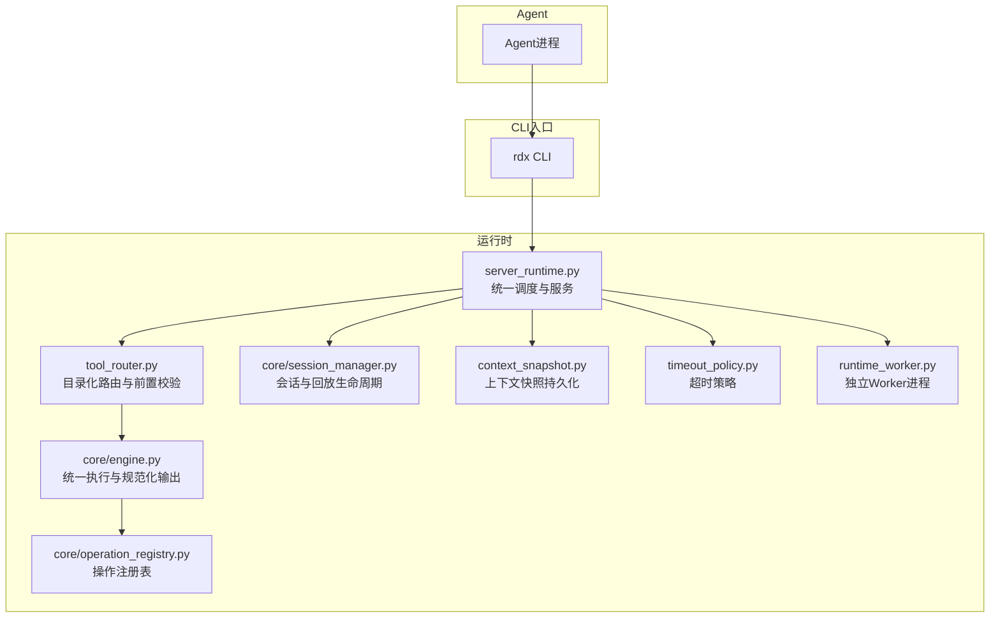
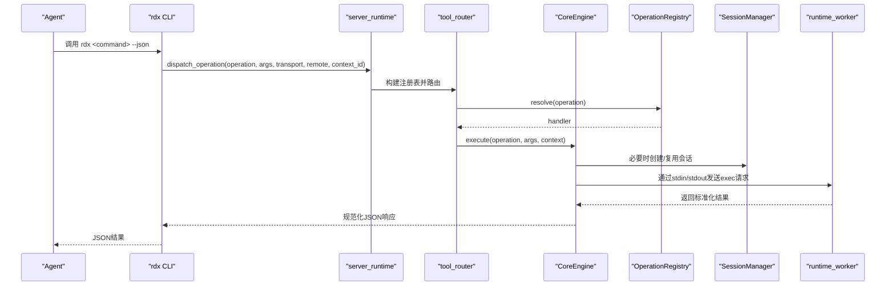
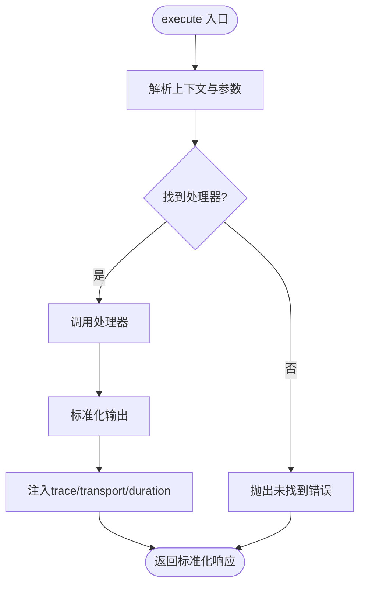
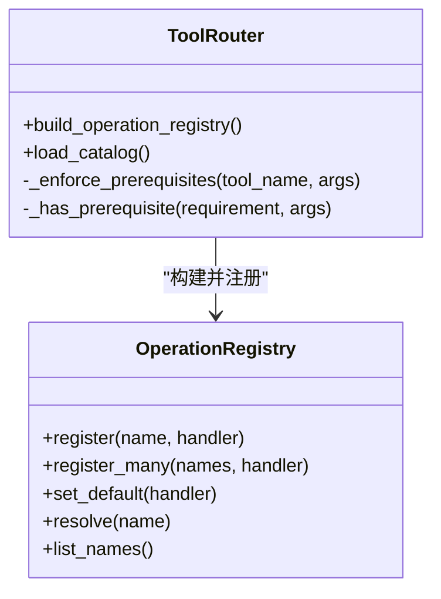
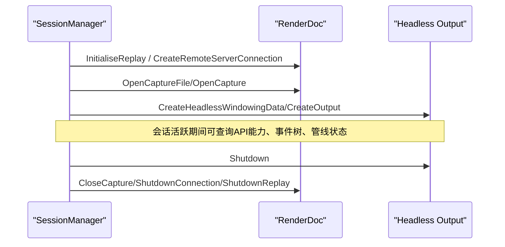
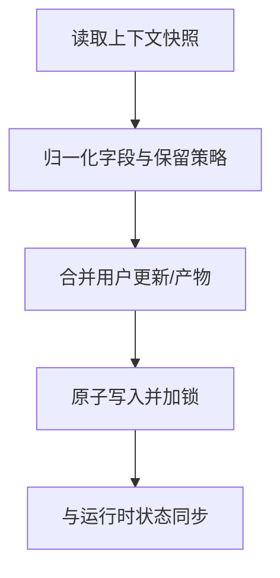
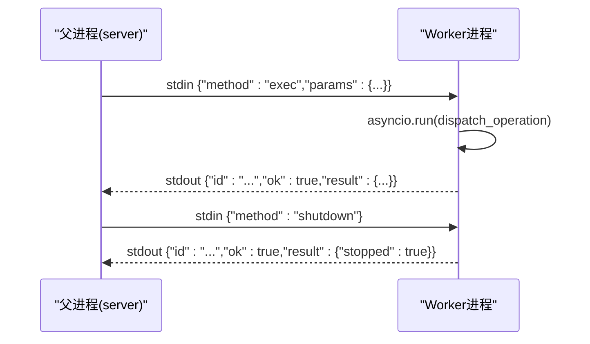
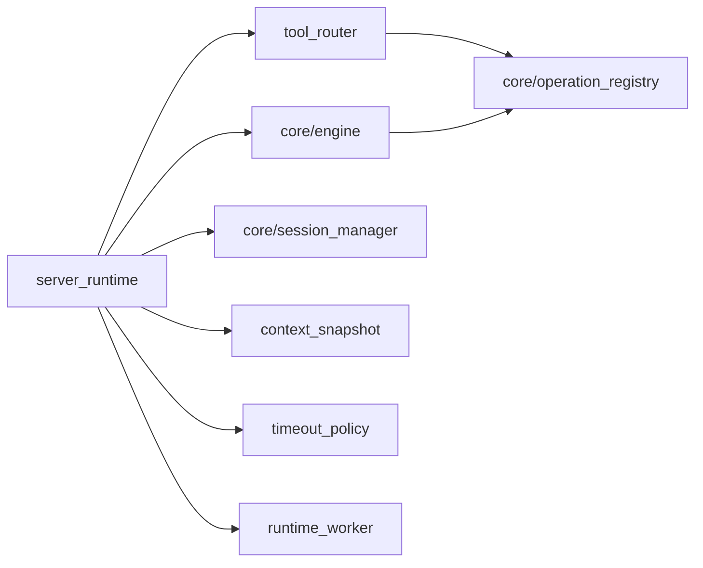

# Agent模型

<cite>
**本文引用的文件**
- [agent-model.md](file://docs/agent-model.md)
- [agent-integration.md](file://docs/agent-integration.md)
- [session-model.md](file://docs/session-model.md)
- [engine.py](file://rdx/core/engine.py)
- [operation_registry.py](file://rdx/core/operation_registry.py)
- [tool_router.py](file://rdx/tool_router.py)
- [errors.py](file://rdx/core/errors.py)
- [timeout_policy.py](file://rdx/timeout_policy.py)
- [context_snapshot.py](file://rdx/context_snapshot.py)
- [server_runtime.py](file://rdx/server_runtime.py)
- [runtime_worker.py](file://rdx/runtime_worker.py)
- [session_manager.py](file://rdx/core/session_manager.py)
</cite>

## 目录
1. [简介](#简介)
2. [项目结构](#项目结构)
3. [核心组件](#核心组件)
4. [架构总览](#架构总览)
5. [详细组件分析](#详细组件分析)
6. [依赖关系分析](#依赖关系分析)
7. [性能考量](#性能考量)
8. [故障排查指南](#故障排查指南)
9. [结论](#结论)
10. [附录：使用示例与集成模式](#附录使用示例与集成模式)

## 简介
本文件面向在自动化环境中使用RDC-Tool的Agent，系统性说明Agent的角色、工作原理、与CLI工具集的集成方式、上下文管理能力、错误处理策略、并发执行模型，以及开发最佳实践与调试技巧。Agent通过调用统一的CLI命令“rdx”完成操作，并以JSON为规范协议进行数据交换；所有重资源（如RenderDoc回放）由独立的worker进程承载，确保稳定性与隔离性。

## 项目结构
- 文档层：docs下提供Agent模型、集成指南、会话模型等权威说明。
- 运行时层：rdx目录下实现统一执行引擎、操作注册表、工具路由、上下文快照、超时策略、会话管理、服务端运行时与Worker进程通信。
- 二进制与脚本：binaries包含平台相关二进制与Python环境；scripts提供打包、验证与冒烟测试脚本。

图表来源
- [server_runtime.py:1-120](file://rdx/server_runtime.py#L1-L120)
- [tool_router.py:1-156](file://rdx/tool_router.py#L1-L156)
- [engine.py:1-204](file://rdx/core/engine.py#L1-L204)
- [operation_registry.py:1-45](file://rdx/core/operation_registry.py#L1-L45)
- [session_manager.py:1-200](file://rdx/core/session_manager.py#L1-L200)
- [context_snapshot.py:1-120](file://rdx/context_snapshot.py#L1-L120)
- [timeout_policy.py:1-104](file://rdx/timeout_policy.py#L1-L104)
- [runtime_worker.py:1-167](file://rdx/runtime_worker.py#L1-L167)

章节来源
- [agent-integration.md:1-51](file://docs/agent-integration.md#L1-L51)
- [agent-model.md:1-32](file://docs/agent-model.md#L1-L32)

## 核心组件
- 统一执行引擎（CoreEngine）：负责解析操作、调用处理器、标准化输出、收集元数据与耗时。
- 操作注册表（OperationRegistry）：维护操作名到处理器的映射，支持默认处理器与批量注册。
- 工具路由（tool_router）：基于工具目录加载catalog，按域分发到具体处理器，并执行参数校验与前置条件检查。
- 会话管理器（SessionManager）：封装本地/远端回放生命周期、控制器创建、头显输出、清理回收。
- 上下文快照（context_snapshot）：跨进程/会话的上下文状态持久化，含用户焦点、预览状态、最近产物等。
- 超时策略（timeout_policy）：按操作类型动态计算超时，区分重度/极重度任务，适配远程连接缓冲。
- Worker进程（runtime_worker）：独立进程承载Replay线程与事件循环，保证原生上下文稳定。

章节来源
- [engine.py:21-204](file://rdx/core/engine.py#L21-L204)
- [operation_registry.py:1-45](file://rdx/core/operation_registry.py#L1-L45)
- [tool_router.py:32-156](file://rdx/tool_router.py#L32-L156)
- [session_manager.py:118-207](file://rdx/core/session_manager.py#L118-L207)
- [context_snapshot.py:18-145](file://rdx/context_snapshot.py#L18-L145)
- [timeout_policy.py:1-104](file://rdx/timeout_policy.py#L1-L104)
- [runtime_worker.py:65-167](file://rdx/runtime_worker.py#L65-L167)

## 架构总览
Agent通过shell调用“rdx”命令，进入server_runtime统一调度；tool_router根据工具目录将请求路由到对应域处理器；core.engine负责执行与结果规范化；session_manager管理回放会话；context_snapshot持久化上下文；timeout_policy控制各操作的超时；runtime_worker以独立进程承载重资源，避免阻塞主流程。

图表来源
- [server_runtime.py:1-120](file://rdx/server_runtime.py#L1-L120)
- [tool_router.py:131-156](file://rdx/tool_router.py#L131-L156)
- [engine.py:40-75](file://rdx/core/engine.py#L40-L75)
- [runtime_worker.py:97-155](file://rdx/runtime_worker.py#L97-L155)

## 详细组件分析

### 统一执行引擎（CoreEngine）
- 职责：接收操作名与参数，解析上下文，调用处理器，统一包装成功/失败响应，注入trace_id、transport、duration_ms等元信息。
- 关键点：
  - 字符串或字典输入均会被规范化为标准信封。
  - 异常被映射为核心错误分类，便于上层重试与降级。
  - 产物自动收集与发布。

图表来源
- [engine.py:40-75](file://rdx/core/engine.py#L40-L75)
- [engine.py:77-204](file://rdx/core/engine.py#L77-L204)

章节来源
- [engine.py:21-204](file://rdx/core/engine.py#L21-L204)

### 操作注册表与工具路由
- OperationRegistry：维护操作名到异步处理器的映射，支持默认处理器与批量注册。
- tool_router：从catalog加载工具清单，按“rd.<domain>.<action>”拆分，绑定到域处理器；在执行前进行参数校验与前置条件检查（如capture_file_id、session_id、remote_id、active_event_id、capability.remote）。

图表来源
- [operation_registry.py:1-45](file://rdx/core/operation_registry.py#L1-L45)
- [tool_router.py:32-156](file://rdx/tool_router.py#L32-L156)

章节来源
- [operation_registry.py:1-45](file://rdx/core/operation_registry.py#L1-L45)
- [tool_router.py:1-156](file://rdx/tool_router.py#L1-L156)

### 会话管理与回放生命周期
- SessionManager：单例管理多个会话，支持本地与远端后端；创建会话、打开捕获、关闭会话、清理资源；对远端设备（Android）采用ADB拷贝与SHA256校验；创建无头输出用于回放。
- 关键流程：
  - create_session：初始化本地回放子系统或远端连接。
  - open_capture：打开捕获并获取控制器属性与能力。
  - close_session：释放控制器、输出、捕获文件、远端连接，必要时关闭回放子系统。

图表来源
- [session_manager.py:175-251](file://rdx/core/session_manager.py#L175-L251)
- [session_manager.py:301-383](file://rdx/core/session_manager.py#L301-L383)
- [session_manager.py:509-569](file://rdx/core/session_manager.py#L509-L569)

章节来源
- [session_manager.py:118-569](file://rdx/core/session_manager.py#L118-L569)

### 上下文快照与状态同步
- context_snapshot：维护每个daemon context的快照，包括运行时会话、远端连接、焦点、笔记、预览状态、最近产物等；提供读写、合并、归一化、保留策略与文件锁保护。
- 作用：
  - 跨进程共享上下文（例如Agent多次调用需保持当前捕获/会话/事件）。
  - 支持preview.display几何信息，辅助Agent判断窗口与帧缓冲尺寸。
  - 限制快照数量与类型，防止磁盘膨胀。

图表来源
- [context_snapshot.py:214-280](file://rdx/context_snapshot.py#L214-L280)
- [context_snapshot.py:367-444](file://rdx/context_snapshot.py#L367-L444)
- [context_snapshot.py:447-541](file://rdx/context_snapshot.py#L447-L541)

章节来源
- [context_snapshot.py:1-541](file://rdx/context_snapshot.py#L1-L541)

### 超时策略与重试机制
- timeout_policy：按操作类型设置不同超时，区分重度与极重度任务；远程连接增加缓冲时间；针对特定操作（如open_replay、open_file、session.*）有专门超时。
- 重试建议：
  - 网络/远端连接类错误可指数退避重试。
  - 资源占用冲突（如remote_handle_consumed）应重建连接或重新打开回放。
  - 对于I/O或渲染错误，优先检查上下文与捕获有效性，再决定是否重试。

章节来源
- [timeout_policy.py:1-104](file://rdx/timeout_policy.py#L1-L104)

### Worker进程与并发执行模型
- runtime_worker：独立进程，使用asyncio.Runner与固定大小线程池（max_workers=1）维持单一回放线程，避免原生上下文失效；通过stdin/stdout与父进程通信，支持exec、clear_context、status、shutdown方法。
- 并发模型：
  - 同一上下文内操作串行化，避免竞争。
  - 重操作（如大文件传输、全量回放统计）通过超时策略保护。
  - 多上下文隔离，可通过--daemon-context选择不同namespace。

图表来源
- [runtime_worker.py:65-167](file://rdx/runtime_worker.py#L65-L167)

章节来源
- [runtime_worker.py:1-167](file://rdx/runtime_worker.py#L1-L167)

## 依赖关系分析
- server_runtime依赖tool_router、core.engine、core.session_manager、context_snapshot、timeout_policy、runtime_worker等模块。
- tool_router依赖catalog与handlers域模块，并在执行前进行参数校验与前置条件检查。
- engine依赖operation_registry与artifact_publisher，负责结果规范化与产物收集。
- session_manager依赖renderdoc接口，管理本地/远端回放生命周期。
- context_snapshot提供跨进程状态持久化与归一化。
- timeout_policy为各操作提供超时计算。

图表来源
- [server_runtime.py:1-120](file://rdx/server_runtime.py#L1-L120)
- [tool_router.py:1-156](file://rdx/tool_router.py#L1-L156)
- [engine.py:1-204](file://rdx/core/engine.py#L1-L204)
- [session_manager.py:1-200](file://rdx/core/session_manager.py#L1-L200)
- [context_snapshot.py:1-120](file://rdx/context_snapshot.py#L1-L120)
- [timeout_policy.py:1-104](file://rdx/timeout_policy.py#L1-L104)
- [runtime_worker.py:1-167](file://rdx/runtime_worker.py#L1-L167)

章节来源
- [server_runtime.py:1-120](file://rdx/server_runtime.py#L1-L120)
- [tool_router.py:1-156](file://rdx/tool_router.py#L1-L156)

## 性能考量
- 使用bounded VFS探索与分页浏览，避免全量展开大型节点。
- 仅在全量需求时使用full模式读取管线状态。
- 利用preview.display获取稳定的帧缓冲与窗口几何，减少截图推断开销。
- 合理设置超时与重试，避免长时间阻塞。
- 重用已成功的doctor结果，减少重复探测。
- 使用JSON作为标准协议，TSV仅用于列表导航。

[本节为通用指导，不直接分析具体文件]

## 故障排查指南
- 错误分类：
  - validation_error：参数校验失败。
  - not_found：资源或操作不存在。
  - assertion_failed：内部断言失败。
  - runtime_error：运行时错误。
  - permission_error：权限不足。
  - io_error：I/O错误。
  - internal_error：内部错误。
- 常见恢复步骤：
  - 远端连接失败：检查endpoint可达性与版本兼容，必要时重建连接。
  - 捕获打开失败：确认.rdc文件有效且受支持。
  - 远端复制失败：检查ADB路径、设备序列号与远程路径权限。
  - 会话冲突：释放旧会话或重启上下文。
  - 预览不可用：检查preview.enable与display几何。

章节来源
- [errors.py:1-121](file://rdx/core/errors.py#L1-L121)
- [session_manager.py:347-440](file://rdx/core/session_manager.py#L347-L440)

## 结论
RDC-Tool的Agent模型以CLI为中心，通过统一执行引擎与工具路由将操作分发至领域处理器；会话管理器保障回放生命周期；上下文快照实现跨进程状态同步；超时策略与Worker进程保障稳定性与性能。遵循文档中的最佳实践与集成模式，可构建可靠的自动化解决方案。

[本节为总结，不直接分析具体文件]

## 附录：使用示例与集成模式

### Agent生命周期与推荐探针
- 健康检查与环境探测：
  - rdx --version
  - rdx --json doctor
  - rdx context status --json
  - rdx tools search pipeline --json
  - rdx tools describe rd.pipeline.get_state --json
  - rdx vfs ls --path / --format tsv
- 典型工作流：
  - 选择上下文并打开捕获
  - 浏览事件与管线状态
  - 更新上下文笔记与焦点
  - 清理上下文并停止守护进程

章节来源
- [agent-integration.md:5-37](file://docs/agent-integration.md#L5-L37)

### 上下文选择与状态同步
- 使用--daemon-context指定连续运行时命名空间。
- 通过rd.session.get_context读取其他命名空间的状态。
- 使用rdx context update更新notes/focus等Agent可见字段。
- 使用rdx context clear释放该命名空间的replay/preview/remote/snapshot。

章节来源
- [session-model.md:1-10](file://docs/session-model.md#L1-L10)
- [context_snapshot.py:447-541](file://rdx/context_snapshot.py#L447-L541)

### 错误处理与重试策略
- 依据错误类别决定重试：
  - 网络/远端连接类：指数退避重试，必要时重建连接。
  - 资源占用类：先释放或等待，再重试。
  - I/O/渲染类：检查上下文与捕获有效性，必要时重启上下文。
- 超时配置：
  - 远程连接：默认200秒，可增加缓冲。
  - 打开回放/文件：分别设置本地与远端超时。
  - 重度操作：event/pipeline/resource/shader等使用较重超时。
  - 极重度操作：macro/vfs使用更重超时。

章节来源
- [timeout_policy.py:8-104](file://rdx/timeout_policy.py#L8-L104)
- [errors.py:1-121](file://rdx/core/errors.py#L1-L121)

### 并发执行模型与隔离
- 同一上下文内操作串行化，避免竞争。
- 多上下文隔离，通过--daemon-context选择不同namespace。
- Worker进程维持单一回放线程，避免原生上下文失效。
- 远端连接与设备侧呈现独立于PNG导出，注意状态语义。

章节来源
- [runtime_worker.py:91-167](file://rdx/runtime_worker.py#L91-L167)
- [session-model.md:19-46](file://docs/session-model.md#L19-L46)

### 开发最佳实践
- 始终使用JSON作为标准协议，TSV仅用于列表导航。
- 使用bounded VFS探索与分页浏览，避免全量展开。
- 使用edit_plan指导着色器编辑，遵循机器可读的使用契约。
- 使用preview.display获取稳定几何，而非仅依赖截图。
- 在嵌入模式下使用rd.session.observe进行PNG观察，避免启用独立窗口生命周期。

章节来源
- [agent-model.md:9-21](file://docs/agent-model.md#L9-L21)
- [agent-integration.md:35-47](file://docs/agent-integration.md#L35-L47)
- [session-model.md:19-46](file://docs/session-model.md#L19-L46)