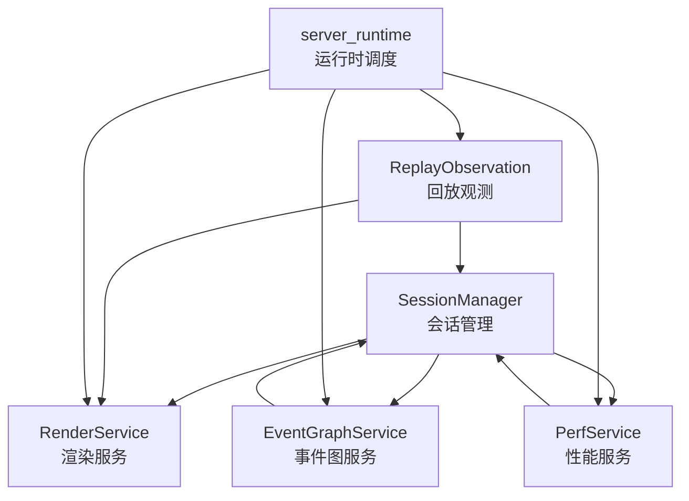
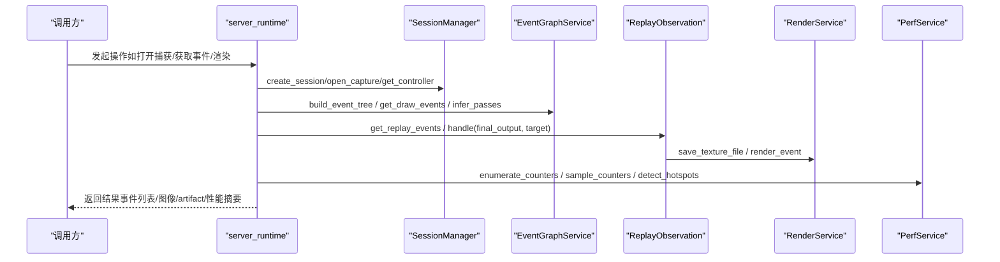
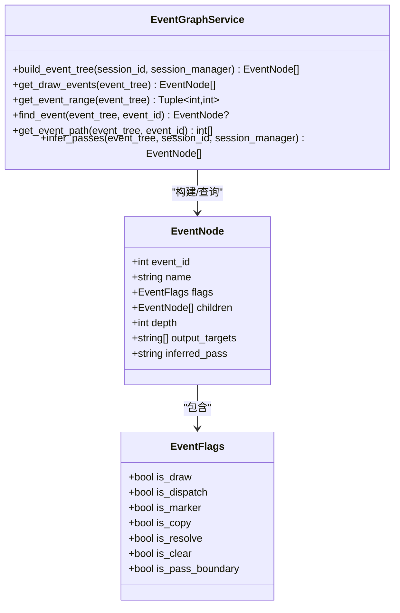
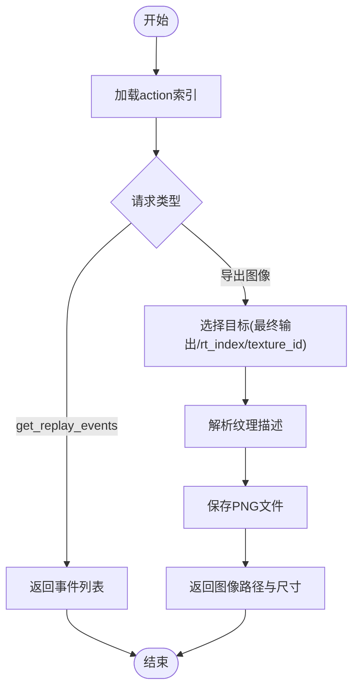
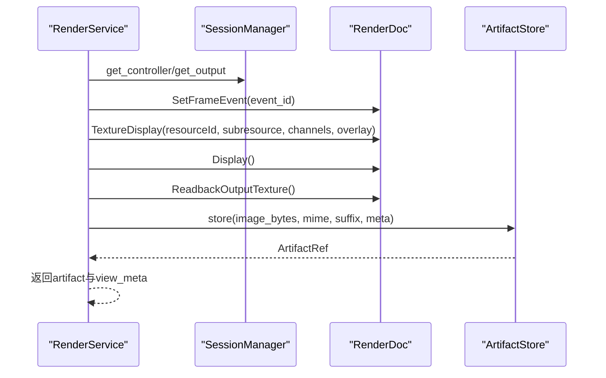
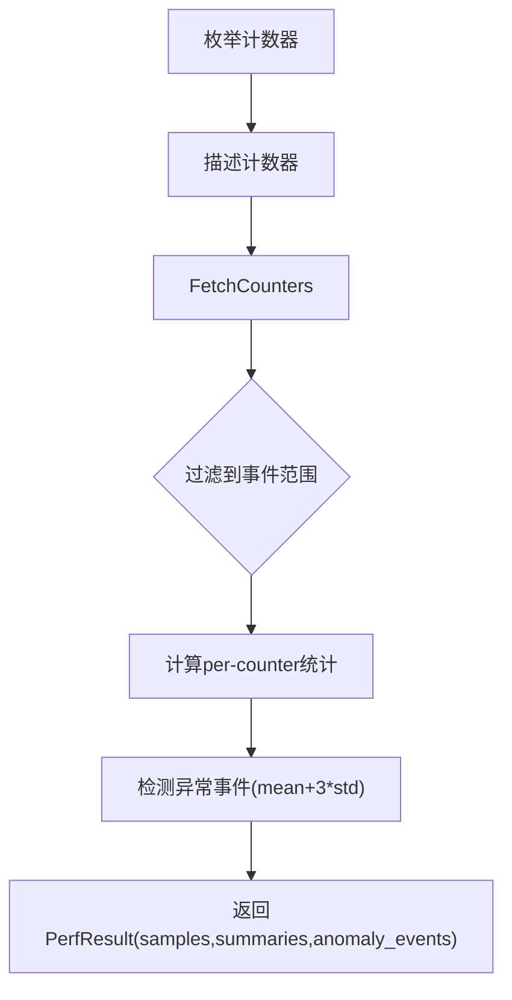
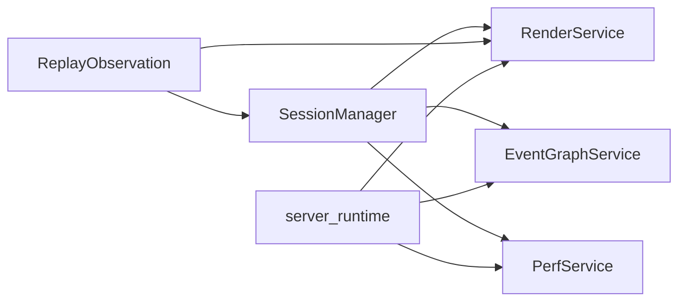

# GPU事件模型

<cite>
**本文引用的文件**
- [rdc_tool/core/event_graph.py](file://rdc_tool/core/event_graph.py)
- [rdc_tool/models.py](file://rdc_tool/models.py)
- [rdc_tool/core/session_manager.py](file://rdc_tool/core/session_manager.py)
- [rdc_tool/server_runtime.py](file://rdc_tool/server_runtime.py)
- [rdc_tool/replay_observation.py](file://rdc_tool/replay_observation.py)
- [rdc_tool/core/perf_service.py](file://rdc_tool/core/perf_service.py)
- [rdc_tool/core/render_service.py](file://rdc_tool/core/render_service.py)
- [rdc_tool/handlers/event.py](file://rdc_tool/handlers/event.py)
</cite>

## 目录
1. [简介](#简介)
2. [项目结构](#项目结构)
3. [核心组件](#核心组件)
4. [架构总览](#架构总览)
5. [详细组件分析](#详细组件分析)
6. [依赖关系分析](#依赖关系分析)
7. [性能考量](#性能考量)
8. [故障排查指南](#故障排查指南)
9. [结论](#结论)
10. [附录：API使用示例与调试技巧](#附录api使用示例与调试技巧)

## 简介
本技术文档围绕 RenderDoc 捕获文件的 GPU 事件模型展开，系统阐述事件图构建、遍历与查询机制，以及事件观测、资源绑定检查、时间线管理与性能分析能力。重点覆盖以下主题：
- 事件类型：Drawcall、Dispatch、Marker、Copy/Resolve/Clear、Pass边界等
- 事件图：Action树到 EventNode 树的转换、路径导航、范围查询
- 事件过滤与查询：按类型、ID、输出目标筛选
- 事件观测：定位帧事件、选择最终输出或颜色目标、导出图像
- 资源关联：纹理、缓冲区、着色器在事件上下文中的绑定检查
- 时间线与性能：事件范围、GPU计数器采样、热点检测
- API使用与调试：结合渲染服务与回放观察的实用流程

## 项目结构
RDC-Tool 将 GPU 事件相关能力拆分为多个服务层：
- 会话管理：负责打开捕获、获取控制器、创建无头输出
- 事件图服务：将 RenderDoc Action 树转换为可序列化的 EventNode 树，并提供查询与 pass 推断
- 回放观测：提供 get_replay_events、最终输出解析、目标选择与 PNG 导出
- 渲染服务：执行 SetFrameEvent、TextureDisplay、Readback、保存纹理为多种格式
- 性能服务：枚举/采样 GPU 计数器、统计异常、检测热点事件
- 运行时调度：统一注册工具、封装响应信封、跨模块协调

图表来源
- [rdc_tool/core/session_manager.py:175-251](file://rdc_tool/core/session_manager.py#L175-L251)
- [rdc_tool/core/event_graph.py:152-191](file://rdc_tool/core/event_graph.py#L152-L191)
- [rdc_tool/core/render_service.py:357-521](file://rdc_tool/core/render_service.py#L357-L521)
- [rdc_tool/core/perf_service.py:235-487](file://rdc_tool/core/perf_service.py#L235-L487)
- [rdc_tool/replay_observation.py:40-147](file://rdc_tool/replay_observation.py#L40-L147)
- [rdc_tool/server_runtime.py:231-238](file://rdc_tool/server_runtime.py#L231-L238)

章节来源
- [rdc_tool/core/session_manager.py:175-251](file://rdc_tool/core/session_manager.py#L175-L251)
- [rdc_tool/core/event_graph.py:152-191](file://rdc_tool/core/event_graph.py#L152-L191)
- [rdc_tool/core/render_service.py:357-521](file://rdc_tool/core/render_service.py#L357-L521)
- [rdc_tool/core/perf_service.py:235-487](file://rdc_tool/core/perf_service.py#L235-L487)
- [rdc_tool/replay_observation.py:40-147](file://rdc_tool/replay_observation.py#L40-L147)
- [rdc_tool/server_runtime.py:231-238](file://rdc_tool/server_runtime.py#L231-L238)

## 核心组件
- 事件图服务（EventGraphService）
  - 构建：从 ReplayController.GetRootActions 递归构建 EventNode 树
  - 查询：get_draw_events、get_event_range、find_event、get_event_path
  - Pass推断：infer_passes，基于输出目标变化划分逻辑 pass
- 回放观测（replay_observation）
  - 列出事件、选择最终输出（Present + SwapBuffer）、解析颜色目标、导出PNG
- 渲染服务（RenderService）
  - render_event：SetFrameEvent -> TextureDisplay -> Readback -> 编码存储
  - save_texture_file：SaveTexture/GetTextureData -> 持久化
  - read_texture_array/readback_texture：数值数组导出与统计
- 性能服务（PerfService）
  - enumerate_counters：枚举GPU计数器
  - sample_counters：按事件范围采样并统计异常
  - detect_hotspots：基于GPU时长识别Top-K热点
- 会话管理（SessionManager）
  - 打开捕获、获取控制器、创建无头输出、生命周期清理
- 运行时调度（server_runtime）
  - 工具注册、上下文状态、预览绑定、跨服务协调

章节来源
- [rdc_tool/core/event_graph.py:152-386](file://rdc_tool/core/event_graph.py#L152-L386)
- [rdc_tool/replay_observation.py:40-147](file://rdc_tool/replay_observation.py#L40-L147)
- [rdc_tool/core/render_service.py:357-800](file://rdc_tool/core/render_service.py#L357-L800)
- [rdc_tool/core/perf_service.py:235-618](file://rdc_tool/core/perf_service.py#L235-L618)
- [rdc_tool/core/session_manager.py:175-569](file://rdc_tool/core/session_manager.py#L175-L569)
- [rdc_tool/server_runtime.py:231-238](file://rdc_tool/server_runtime.py#L231-L238)

## 架构总览
下图展示从用户调用到具体服务的协作流程，包括事件图构建、回放观测、渲染与性能分析。

图表来源
- [rdc_tool/server_runtime.py:231-238](file://rdc_tool/server_runtime.py#L231-L238)
- [rdc_tool/core/session_manager.py:175-251](file://rdc_tool/core/session_manager.py#L175-L251)
- [rdc_tool/core/event_graph.py:152-191](file://rdc_tool/core/event_graph.py#L152-L191)
- [rdc_tool/replay_observation.py:40-147](file://rdc_tool/replay_observation.py#L40-L147)
- [rdc_tool/core/render_service.py:357-521](file://rdc_tool/core/render_service.py#L357-L521)
- [rdc_tool/core/perf_service.py:235-487](file://rdc_tool/core/perf_service.py#L235-L487)

## 详细组件分析

### 事件图服务（EventGraphService）
- 作用：将 RenderDoc 的 ActionDescription 树转换为 EventNode 树，支持查询、路径导航与 pass 推断
- 关键方法：
  - build_event_tree：从根动作递归构建节点，记录 flags、children、depth、output_targets
  - get_draw_events：深度优先收集 draw/dispatch 事件
  - get_event_range：收集所有 event_id，返回最小/最大范围
  - find_event / get_event_path：按 event_id 查找与路径回溯
  - infer_passes：根据相邻 draw 的输出目标集合变化划分 pass，标注 inferred_pass
- 数据模型：
  - EventFlags：is_draw、is_dispatch、is_marker、is_copy、is_resolve、is_clear、is_pass_boundary
  - EventNode：event_id、name、flags、children、depth、output_targets、inferred_pass

图表来源
- [rdc_tool/core/event_graph.py:152-386](file://rdc_tool/core/event_graph.py#L152-L386)
- [rdc_tool/models.py:163-181](file://rdc_tool/models.py#L163-L181)

章节来源
- [rdc_tool/core/event_graph.py:152-386](file://rdc_tool/core/event_graph.py#L152-L386)
- [rdc_tool/models.py:163-181](file://rdc_tool/models.py#L163-L181)

### 回放观测（ReplayObservation）
- 作用：在无窗口环境下进行回放观测，支持获取事件列表、解析最终输出（Present+SwapBuffer）、选择颜色目标并导出PNG
- 关键流程：
  - get_replay_events：加载 action index，返回排序后的事件摘要
  - final_output：定位 Present 事件，提取 swap buffer 资源，校验唯一性
  - 目标选择：支持 rt_index 或 texture_id，否则取第一个颜色输出
  - 导出：调用 RenderService.save_texture_file，生成 PNG 并返回元信息

图表来源
- [rdc_tool/replay_observation.py:40-147](file://rdc_tool/replay_observation.py#L40-L147)
- [rdc_tool/core/render_service.py:523-646](file://rdc_tool/core/render_service.py#L523-L646)

章节来源
- [rdc_tool/replay_observation.py:40-147](file://rdc_tool/replay_observation.py#L40-L147)
- [rdc_tool/core/render_service.py:523-646](file://rdc_tool/core/render_service.py#L523-L646)

### 渲染服务（RenderService）
- 作用：执行 SetFrameEvent、配置 TextureDisplay、读取输出纹理、编码保存为多种格式；支持 raw/npz 导出与像素统计
- 关键方法：
  - render_event：导航到事件，设置显示参数，ReadbackOutputTexture，编码并存储 artifact
  - save_texture_file：SaveTexture/GetTextureData，写入文件或临时文件，返回 artifact/meta/path
  - read_texture_array：读取纹理数据，解析格式，计算统计（min/max/mean/nan/inf）
  - readback_texture：序列化数组为 .npz 并存储

图表来源
- [rdc_tool/core/render_service.py:357-521](file://rdc_tool/core/render_service.py#L357-L521)
- [rdc_tool/core/render_service.py:523-646](file://rdc_tool/core/render_service.py#L523-L646)
- [rdc_tool/core/render_service.py:658-794](file://rdc_tool/core/render_service.py#L658-L794)

章节来源
- [rdc_tool/core/render_service.py:357-800](file://rdc_tool/core/render_service.py#L357-L800)

### 性能服务（PerfService）
- 作用：枚举GPU计数器、按事件范围采样、统计异常、检测热点事件
- 关键方法：
  - enumerate_counters：返回 counter_id、name、description、unit、result_type
  - sample_counters：FetchCounters后过滤到事件范围，计算 per-counter 统计与异常事件
  - detect_hotspots：基于 EventGPUDuration/GPUDuration/GPU Duration 计数，排序 Top-K

图表来源
- [rdc_tool/core/perf_service.py:235-487](file://rdc_tool/core/perf_service.py#L235-L487)

章节来源
- [rdc_tool/core/perf_service.py:235-618](file://rdc_tool/core/perf_service.py#L235-L618)

### 会话管理（SessionManager）
- 作用：创建/打开/关闭会话，获取控制器与输出，处理本地/远程后端
- 关键点：
  - open_capture：打开捕获文件，获取API属性，统计 total_events
  - _create_headless_output：创建无头输出用于渲染/读回
  - _cleanup：安全关闭输出、控制器、捕获文件、远程连接

章节来源
- [rdc_tool/core/session_manager.py:175-569](file://rdc_tool/core/session_manager.py#L175-L569)

### 运行时调度（server_runtime）
- 作用：工具注册、上下文状态管理、预览绑定、跨服务协调
- 关键点：
  - 全局服务实例：_session_manager、_event_graph_service、_render_service、_perf_service
  - 上下文快照与状态同步，确保预览与回放一致性

章节来源
- [rdc_tool/server_runtime.py:231-238](file://rdc_tool/server_runtime.py#L231-L238)

## 依赖关系分析
- SessionManager 是底层资源入口，提供 ReplayController 与 ReplayOutput
- EventGraphService 依赖 SessionManager 获取控制器以构建事件树与推断 pass
- ReplayObservation 依赖 SessionManager 与 RenderService 完成目标解析与图像导出
- PerfService 依赖 SessionManager 获取控制器以枚举/采样计数器
- server_runtime 作为协调层，组合上述服务对外暴露统一接口

图表来源
- [rdc_tool/core/session_manager.py:175-251](file://rdc_tool/core/session_manager.py#L175-L251)
- [rdc_tool/core/event_graph.py:152-191](file://rdc_tool/core/event_graph.py#L152-L191)
- [rdc_tool/replay_observation.py:40-147](file://rdc_tool/replay_observation.py#L40-L147)
- [rdc_tool/core/render_service.py:357-521](file://rdc_tool/core/render_service.py#L357-L521)
- [rdc_tool/core/perf_service.py:235-487](file://rdc_tool/core/perf_service.py#L235-L487)
- [rdc_tool/server_runtime.py:231-238](file://rdc_tool/server_runtime.py#L231-L238)

章节来源
- [rdc_tool/core/session_manager.py:175-251](file://rdc_tool/core/session_manager.py#L175-L251)
- [rdc_tool/core/event_graph.py:152-191](file://rdc_tool/core/event_graph.py#L152-L191)
- [rdc_tool/replay_observation.py:40-147](file://rdc_tool/replay_observation.py#L40-L147)
- [rdc_tool/core/render_service.py:357-521](file://rdc_tool/core/render_service.py#L357-L521)
- [rdc_tool/core/perf_service.py:235-487](file://rdc_tool/core/perf_service.py#L235-L487)
- [rdc_tool/server_runtime.py:231-238](file://rdc_tool/server_runtime.py#L231-L238)

## 性能考量
- 事件图构建复杂度：O(N)，N为 Action 树节点数；递归遍历 children
- 查询效率：get_draw_events 深度优先收集；get_event_range 全量扫描
- Pass推断：基于相邻 draw 的输出目标集合比较，时间复杂度 O(M)，M为 draw 数量
- 性能采样：FetchCounters 批量读取，过滤到事件范围后统计；异常检测使用均值与标准差阈值
- 热点检测：排序 Top-K，时间复杂度 O(E log E)，E为事件数
- 渲染读回：ReadbackOutputTexture 与 SaveTexture 可能涉及 GPU-CPU 同步，建议批量化与异步执行

[本节提供通用指导，不直接分析具体文件]

## 故障排查指南
- 无法加载 renderdoc 模块：检查运行环境是否在 RenderDoc replay context 或 sys.path 已包含共享库
- 控制器缺失：确认会话已正确打开捕获并初始化输出
- 最终输出不可用：Present 事件未找到或 swap buffer 资源不唯一
- 纹理导出失败：检查 SaveTexture 返回值与状态文本，确认文件格式与子资源有效
- 性能计数器不可用：确认驱动支持对应计数器名称，或更新匹配的 runtime
- 事件范围无效：确保 lo <= hi 且存在事件 ID

章节来源
- [rdc_tool/core/render_service.py:39-56](file://rdc_tool/core/render_service.py#L39-L56)
- [rdc_tool/core/render_service.py:523-646](file://rdc_tool/core/render_service.py#L523-L646)
- [rdc_tool/replay_observation.py:16-36](file://rdc_tool/replay_observation.py#L16-L36)
- [rdc_tool/core/perf_service.py:28-63](file://rdc_tool/core/perf_service.py#L28-L63)
- [rdc_tool/core/perf_service.py:493-618](file://rdc_tool/core/perf_service.py#L493-L618)

## 结论
RDC-Tool 通过分层服务设计，将 RenderDoc 的事件模型抽象为可查询、可观测、可分析的体系。EventGraphService 提供结构化事件图与 pass 推断；ReplayObservation 实现无窗口回放与目标导出；RenderService 完成渲染与读回；PerfService 提供性能分析与热点检测。配合 SessionManager 与 server_runtime，形成完整的 GPU 事件诊断工作流。

[本节总结整体发现，不直接分析具体文件]

## 附录：API使用示例与调试技巧
- 构建事件图并查询 Drawcall
  - 使用 EventGraphService.build_event_tree 获取树
  - 使用 get_draw_events 筛选 draw/dispatch 事件
  - 使用 get_event_range 获取事件范围，便于后续性能采样
  - 参考路径：[rdc_tool/core/event_graph.py:161-216](file://rdc_tool/core/event_graph.py#L161-L216)

- 推断 Pass 边界
  - 调用 infer_passes，基于输出目标变化划分 pass
  - 适用于缺少 debug markers 的捕获
  - 参考路径：[rdc_tool/core/event_graph.py:252-309](file://rdc_tool/core/event_graph.py#L252-L309)

- 回放观测与图像导出
  - 使用 replay_observation.handle 获取事件列表或导出 PNG
  - 支持 final_output、rt_index、texture_id 三种目标选择
  - 参考路径：[rdc_tool/replay_observation.py:40-147](file://rdc_tool/replay_observation.py#L40-L147)

- 渲染事件与纹理保存
  - 使用 RenderService.render_event 渲染当前事件并存储 artifact
  - 使用 save_texture_file 直接保存纹理为 PNG/EXR/HDR/RAW
  - 参考路径：[rdc_tool/core/render_service.py:357-521](file://rdc_tool/core/render_service.py#L357-L521)、[rdc_tool/core/render_service.py:523-646](file://rdc_tool/core/render_service.py#L523-L646)

- 性能分析与热点检测
  - 使用 PerfService.enumerate_counters 获取可用计数器
  - 使用 sample_counters 在事件范围内采样并统计异常
  - 使用 detect_hotspots 识别最慢事件
  - 参考路径：[rdc_tool/core/perf_service.py:235-487](file://rdc_tool/core/perf_service.py#L235-L487)、[rdc_tool/core/perf_service.py:493-618](file://rdc_tool/core/perf_service.py#L493-L618)

- 调试技巧
  - 先构建事件图，再按类型/范围筛选，缩小问题域
  - 使用 infer_passes 理解渲染阶段划分
  - 结合回放观测与渲染服务，验证特定事件的输出与绑定
  - 利用性能服务定位热点事件，进一步检查资源绑定与状态

章节来源
- [rdc_tool/core/event_graph.py:161-309](file://rdc_tool/core/event_graph.py#L161-L309)
- [rdc_tool/replay_observation.py:40-147](file://rdc_tool/replay_observation.py#L40-L147)
- [rdc_tool/core/render_service.py:357-646](file://rdc_tool/core/render_service.py#L357-L646)
- [rdc_tool/core/perf_service.py:235-618](file://rdc_tool/core/perf_service.py#L235-L618)