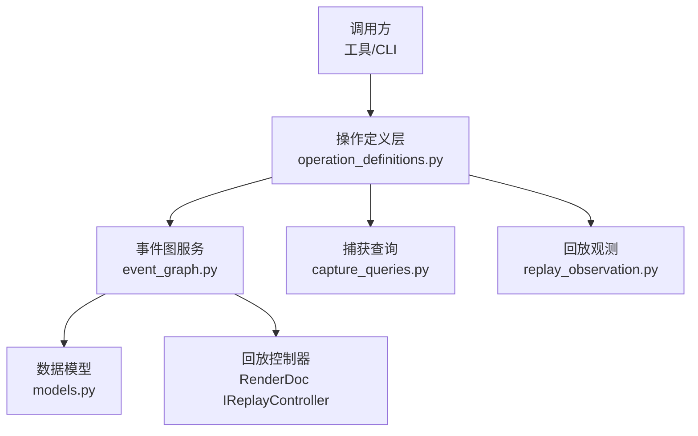
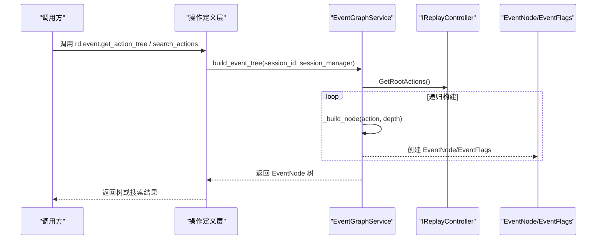
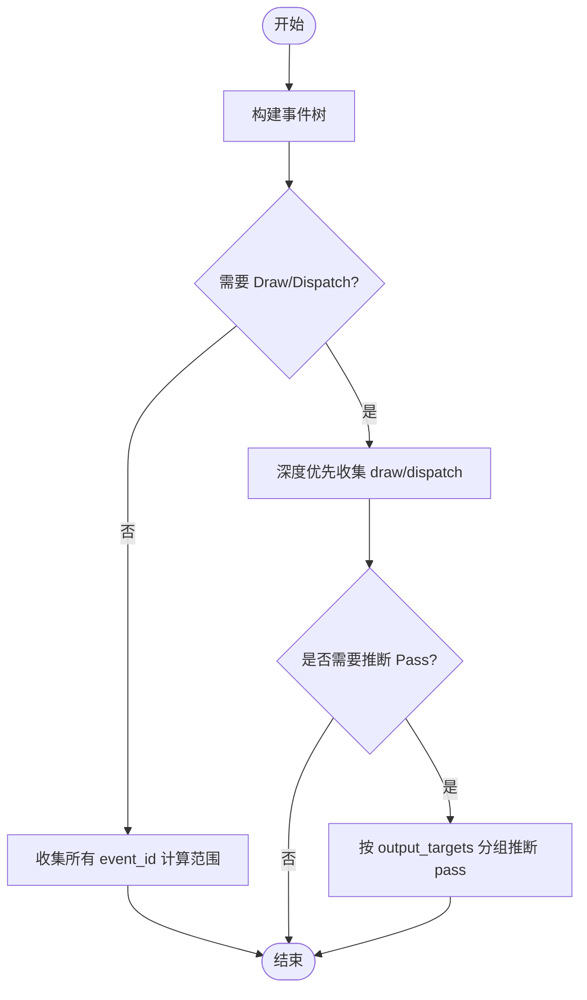
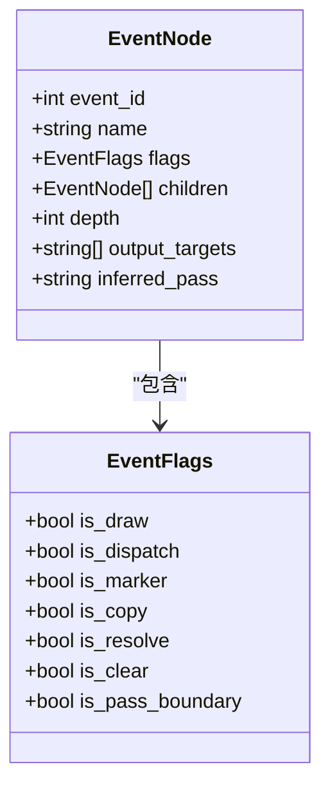
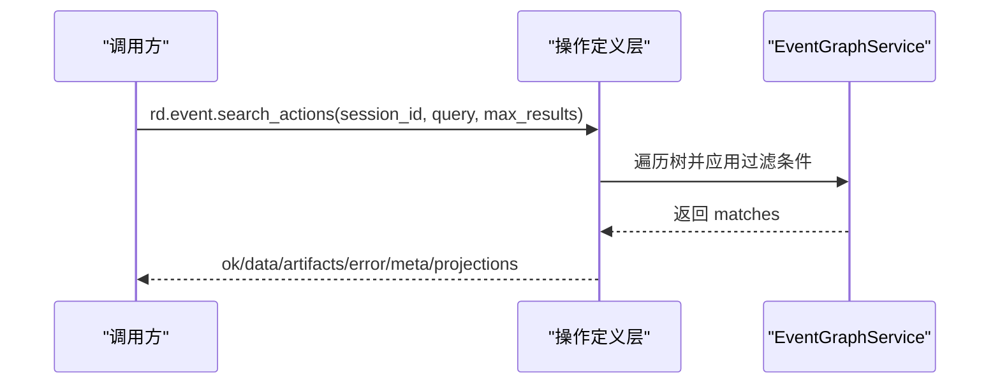
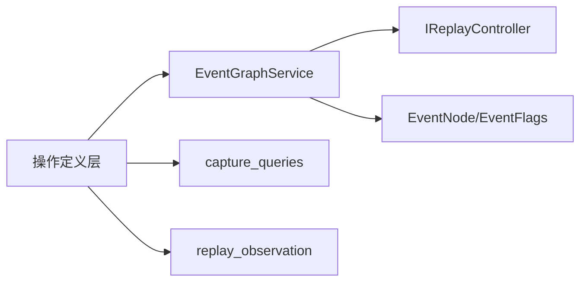

# 事件图遍历

<cite>
**本文引用的文件**
- [event_graph.py](file://rdc_tool/core/event_graph.py)
- [models.py](file://rdc_tool/models.py)
- [operation_definitions.py](file://rdc_tool/operation_definitions.py)
- [capture_queries.py](file://rdc_tool/core/capture_queries.py)
- [replay_observation.py](file://rdc_tool/replay_observation.py)
</cite>

## 目录
1. [简介](#简介)
2. [项目结构](#项目结构)
3. [核心组件](#核心组件)
4. [架构总览](#架构总览)
5. [详细组件分析](#详细组件分析)
6. [依赖关系分析](#依赖关系分析)
7. [性能考量](#性能考量)
8. [故障排查指南](#故障排查指南)
9. [结论](#结论)
10. [附录：API 使用示例与最佳实践](#附录api-使用示例与最佳实践)

## 简介
本技术文档聚焦 RDC-Tool 中的“事件图遍历”机制，围绕 Action 树构建、数据结构设计、事件导航（深度优先/广度优先）、事件依赖与调用链追踪、事件过滤与查询、索引与缓存策略、以及大规模事件数据的高效访问与优化建议展开。内容基于仓库中事件图服务、数据模型、操作定义与回放观测等源码进行系统化梳理，并提供可操作的 API 使用指引与性能调优建议。

## 项目结构
与事件图遍历直接相关的代码主要分布在以下模块：
- rdc_tool/core/event_graph.py：事件图服务，负责从 RenderDoc 的 ActionDescription 树构建 EventNode 树，提供查询、路径回溯与 Pass 推断能力。
- rdc_tool/models.py：事件节点与标志位的数据模型，定义了 EventNode、EventFlags 等核心结构。
- rdc_tool/operation_definitions.py：对外暴露的工具操作定义，包括 rd.event.search_actions、rd.event.get_action_tree、rd.event.get_action_details 等，用于事件搜索、树遍历与详情获取。
- rdc_tool/core/capture_queries.py：读取捕获元数据与结构化调用，支持按事件定位并分页读取结构化对象。
- rdc_tool/replay_observation.py：回放观测相关逻辑，包含设置 active event、输出目标解析等。

图表来源
- [event_graph.py:152-386](file://rdc_tool/core/event_graph.py#L152-L386)
- [models.py:163-181](file://rdc_tool/models.py#L163-L181)
- [operation_definitions.py:902-1149](file://rdc_tool/operation_definitions.py#L902-L1149)
- [capture_queries.py:73-119](file://rdc_tool/core/capture_queries.py#L73-L119)
- [replay_observation.py:91-109](file://rdc_tool/replay_observation.py#L91-L109)

章节来源
- [event_graph.py:152-386](file://rdc_tool/core/event_graph.py#L152-L386)
- [models.py:163-181](file://rdc_tool/models.py#L163-L181)
- [operation_definitions.py:902-1149](file://rdc_tool/operation_definitions.py#L902-L1149)
- [capture_queries.py:73-119](file://rdc_tool/core/capture_queries.py#L73-L119)
- [replay_observation.py:91-109](file://rdc_tool/replay_observation.py#L91-L109)

## 核心组件
- EventGraphService：事件图服务，提供树构建、查询、路径回溯、Pass 推断等方法。
- EventNode 与 EventFlags：事件节点与标志位模型，描述事件类型、层级、输出目标与推断 pass。
- 操作定义层：封装 rd.event.* 系列工具，如 get_action_tree、get_action_details、search_actions，统一对外接口。
- 捕获查询：在结构化捕获数据中按事件定位并分页读取调用细节。
- 回放观测：设置 active event、解析输出目标资源 ID 等。

章节来源
- [event_graph.py:152-386](file://rdc_tool/core/event_graph.py#L152-L386)
- [models.py:163-181](file://rdc_tool/models.py#L163-L181)
- [operation_definitions.py:902-1149](file://rdc_tool/operation_definitions.py#L902-L1149)
- [capture_queries.py:73-119](file://rdc_tool/core/capture_queries.py#L73-L119)
- [replay_observation.py:91-109](file://rdc_tool/replay_observation.py#L91-L109)

## 架构总览
事件图遍历的整体流程如下：
- 通过 SessionManager 获取 ReplayController，读取根 Action 列表。
- 递归将 ActionDescription 转换为 EventNode 树，映射 flags、children、output_targets 等。
- 提供多种查询方法：收集 draw/dispatch、计算事件范围、查找节点、构建路径。
- 当缺少显式 debug markers 时，根据 output targets 变化推断 render-pass 边界。
- 上层工具通过 operation_definitions 暴露的 API 进行事件搜索、树遍历与详情获取。

图表来源
- [event_graph.py:161-191](file://rdc_tool/core/event_graph.py#L161-L191)
- [event_graph.py:313-335](file://rdc_tool/core/event_graph.py#L313-L335)
- [models.py:163-181](file://rdc_tool/models.py#L163-L181)
- [operation_definitions.py:951-967](file://rdc_tool/operation_definitions.py#L951-L967)

## 详细组件分析

### 事件图服务（EventGraphService）
- 树构建：
  - 入口：build_event_tree(session_id, session_manager)，获取根 Action 并递归构建 EventNode。
  - 节点转换：_build_node 将 ActionDescription 的 flags、outputs、children、customName 映射到 EventNode。
  - 标志映射：_map_action_flags 将 RenderDoc 的 ActionFlags 转换为 EventFlags，兼容不同版本命名。
- 查询与导航：
  - get_draw_events：深度优先收集 draw/dispatch 节点，保持文档顺序。
  - get_event_range：深度优先收集所有 event_id，返回最小/最大范围。
  - find_event：按 event_id 深度优先查找节点。
  - get_event_path：从根到目标 event_id 的路径回溯。
- Pass 推断：
  - infer_passes：对 draw 序列按 output_targets 分组，若为空则通过控制器查询 pipeline state 获取输出目标；相邻 target 集变化时递增 pass_index，写入 inferred_pass。

图表来源
- [event_graph.py:195-216](file://rdc_tool/core/event_graph.py#L195-L216)
- [event_graph.py:252-309](file://rdc_tool/core/event_graph.py#L252-L309)
- [event_graph.py:337-365](file://rdc_tool/core/event_graph.py#L337-L365)

章节来源
- [event_graph.py:152-386](file://rdc_tool/core/event_graph.py#L152-L386)

### 数据模型（EventNode、EventFlags）
- EventFlags：布尔标志集合，标识 draw、dispatch、marker、copy、resolve、clear、pass_boundary 等事件类型。
- EventNode：事件节点，包含 event_id、name、flags、children、depth、output_targets、inferred_pass。
- 这些模型为事件图遍历、查询与可视化提供稳定结构。

图表来源
- [models.py:163-181](file://rdc_tool/models.py#L163-L181)

章节来源
- [models.py:163-181](file://rdc_tool/models.py#L163-L181)

### 事件搜索与过滤（rd.event.search_actions）
- 操作定义：支持 name_regex、name_contains、flags_include、flags_exclude、event_id_min、event_id_max 等多维条件，限制 max_results。
- 作用域：replay，影响 replay_position。
- 典型用法：在当前帧 Action 树中按名称、标志或事件范围筛选匹配节点，便于快速定位问题事件。

图表来源
- [operation_definitions.py:1112-1141](file://rdc_tool/operation_definitions.py#L1112-L1141)

章节来源
- [operation_definitions.py:1112-1141](file://rdc_tool/operation_definitions.py#L1112-L1141)

### 树遍历与详情获取（rd.event.get_action_tree / get_action_details）
- get_action_tree：支持 max_depth、filter（name_contains）、offset 分页，避免一次性加载过大树。
- get_action_details：获取单个 Action 的详细信息，包括 drawcall 参数、marker 范围、输出目标摘要等。
- 结合 VFS：/draws 树节点默认延迟加载 action 详情，按需请求以减少开销。

章节来源
- [operation_definitions.py:951-967](file://rdc_tool/operation_definitions.py#L951-L967)
- [operation_definitions.py:902-911](file://rdc_tool/operation_definitions.py#L902-L911)

### 捕获查询与结构化调用（capture_queries.query_calls）
- 功能：在结构化捕获文件中按事件定位 chunk，分页读取结构化对象，支持 object_path、child_offset、value_offset 继续读取。
- 预算控制：max_nodes 限制节点数量，防止内存膨胀。
- 适用场景：当需要深入查看某个事件的 API 调用细节时使用。

章节来源
- [capture_queries.py:73-119](file://rdc_tool/core/capture_queries.py#L73-L119)

### 回放观测与 Active Event（replay_observation）
- 设置 active event：SetFrameEvent(event_id, True)，更新上下文快照。
- 输出目标解析：获取当前事件的输出目标资源 ID，辅助 Pass 推断与渲染状态分析。

章节来源
- [replay_observation.py:91-109](file://rdc_tool/replay_observation.py#L91-L109)

## 依赖关系分析
- EventGraphService 依赖：
  - RenderDoc IReplayController：获取根 Action、pipeline state。
  - models.EventNode/EventFlags：构建与返回事件图结构。
  - session_manager：管理会话与控制器生命周期。
- 操作定义层依赖：
  - EventGraphService：执行树构建与查询。
  - capture_queries：结构化调用查询。
  - replay_observation：active event 管理与输出目标解析。

图表来源
- [event_graph.py:152-386](file://rdc_tool/core/event_graph.py#L152-L386)
- [operation_definitions.py:902-1149](file://rdc_tool/operation_definitions.py#L902-L1149)
- [capture_queries.py:73-119](file://rdc_tool/core/capture_queries.py#L73-L119)
- [replay_observation.py:91-109](file://rdc_tool/replay_observation.py#L91-L109)

章节来源
- [event_graph.py:152-386](file://rdc_tool/core/event_graph.py#L152-L386)
- [operation_definitions.py:902-1149](file://rdc_tool/operation_definitions.py#L902-L1149)
- [capture_queries.py:73-119](file://rdc_tool/core/capture_queries.py#L73-L119)
- [replay_observation.py:91-109](file://rdc_tool/replay_observation.py#L91-L109)

## 性能考量
- 树构建复杂度：
  - 递归构建 EventNode 的时间复杂度为 O(N)，N 为 Action 总数；空间复杂度取决于树深度与子节点数量。
- 查询与导航：
  - get_draw_events、get_event_range、find_event、get_event_path 均为深度优先遍历，时间复杂度 O(N)。
- Pass 推断：
  - 对 draw 序列按 output_targets 分组，若需查询 pipeline state 会增加额外开销；建议在必要时启用。
- 分页与预算：
  - get_action_tree 支持 max_depth 与 offset 分页；capture_queries 使用 max_nodes 预算控制节点数量。
- 缓存策略：
  - 当前实现未内置全局事件索引或结果缓存；可通过调用方维护会话级缓存（如按 session_id 缓存已构建的 EventNode 树），减少重复构建成本。
- 批量处理：
  - 对于大规模事件，建议分批查询（如限定 event_id 范围），并结合 search_actions 的多维过滤缩小结果集。

[本节为通用性能讨论，不直接分析具体文件]

## 故障排查指南
- 无法查询输出目标：
  - 当 pipeline-state 访问器不可用时，_query_output_targets 会优雅降级并记录调试日志；检查 RenderDoc 版本与后端兼容性。
- 事件不存在：
  - find_event 与 get_event_path 在未找到目标时返回 None 或空列表；确认 event_id 是否正确，或扩大搜索范围。
- 结构化调用查询失败：
  - capture_queries.query_calls 在事件未找到或 chunk 索引越界时报错；检查事件是否属于当前帧，或调整 chunk_indices。
- 树过大导致内存压力：
  - 使用 get_action_tree 的 max_depth 与 offset 分页；避免一次性加载完整树。

章节来源
- [event_graph.py:107-146](file://rdc_tool/core/event_graph.py#L107-L146)
- [event_graph.py:218-248](file://rdc_tool/core/event_graph.py#L218-L248)
- [capture_queries.py:73-119](file://rdc_tool/core/capture_queries.py#L73-L119)

## 结论
RDC-Tool 的事件图遍历机制以 EventGraphService 为核心，提供从 RenderDoc Action 树到 EventNode 树的稳定转换，并支持丰富的查询与导航能力。通过多维过滤、分页与预算控制，可在大规模事件数据下高效访问与分析。结合 Pass 推断与结构化调用查询，能够深入理解事件间的依赖关系与调用链。建议在实际使用中合理配置分页与过滤条件，并在调用方层面引入会话级缓存以提升性能。

[本节为总结性内容，不直接分析具体文件]

## 附录：API 使用示例与最佳实践

### 构建事件树并获取 Draw/Dispatch 事件
- 步骤：
  - 调用 rd.event.get_action_tree 获取根节点，或使用 EventGraphService.build_event_tree。
  - 使用 get_draw_events 收集 draw/dispatch 节点。
  - 使用 get_event_range 获取事件范围，便于后续批处理。
- 参考路径：
  - [event_graph.py:161-191](file://rdc_tool/core/event_graph.py#L161-L191)
  - [event_graph.py:195-216](file://rdc_tool/core/event_graph.py#L195-L216)

### 搜索事件（多维过滤）
- 使用 rd.event.search_actions，传入 query 字典：
  - name_contains：按名称子串匹配。
  - flags_include/flags_exclude：按事件标志过滤。
  - event_id_min/event_id_max：按事件 ID 范围过滤。
  - max_results：限制返回数量。
- 参考路径：
  - [operation_definitions.py:1112-1141](file://rdc_tool/operation_definitions.py#L1112-L1141)

### 获取事件详情与路径
- 使用 rd.event.get_action_details 获取单个事件的详细信息。
- 使用 EventGraphService.get_event_path 获取从根到目标事件的路径，用于调用链追踪。
- 参考路径：
  - [operation_definitions.py:902-911](file://rdc_tool/operation_definitions.py#L902-L911)
  - [event_graph.py:235-248](file://rdc_tool/core/event_graph.py#L235-L248)

### 推断 Render Pass
- 当缺少显式 debug markers 时，调用 infer_passes 根据 output_targets 变化推断 pass 边界。
- 参考路径：
  - [event_graph.py:252-309](file://rdc_tool/core/event_graph.py#L252-L309)

### 结构化调用查询
- 使用 capture_queries.query_calls 按事件定位并分页读取结构化对象，适合深入分析 API 调用细节。
- 参考路径：
  - [capture_queries.py:73-119](file://rdc_tool/core/capture_queries.py#L73-L119)

### 最佳实践
- 分页与预算：
  - 使用 get_action_tree 的 max_depth 与 offset 分页，避免一次性加载过大树。
  - 使用 capture_queries 的 max_nodes 预算控制节点数量。
- 过滤优先：
  - 先使用 search_actions 的多维过滤缩小结果集，再进行详情获取。
- 缓存策略：
  - 在调用方维护会话级缓存（如按 session_id 缓存 EventNode 树），减少重复构建成本。
- 错误处理：
  - 对无法查询输出目标的情况进行降级处理，记录调试日志。
  - 对事件不存在的情况进行空值处理，避免崩溃。

[本节为通用指导，不直接分析具体文件]