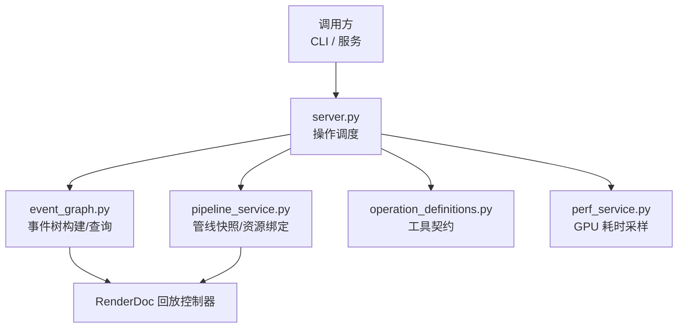
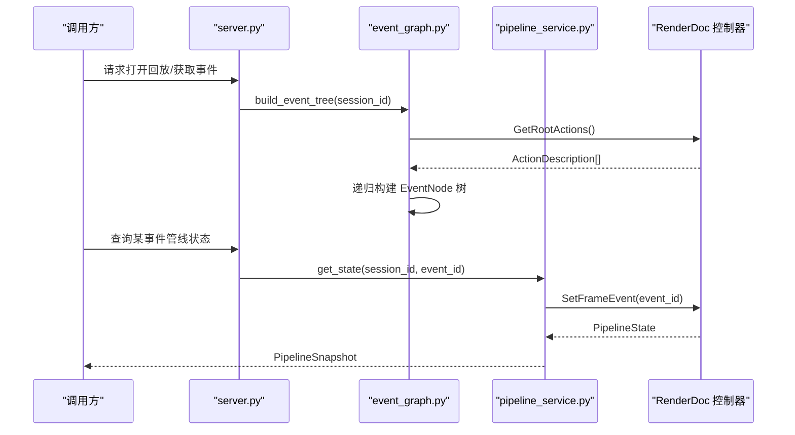
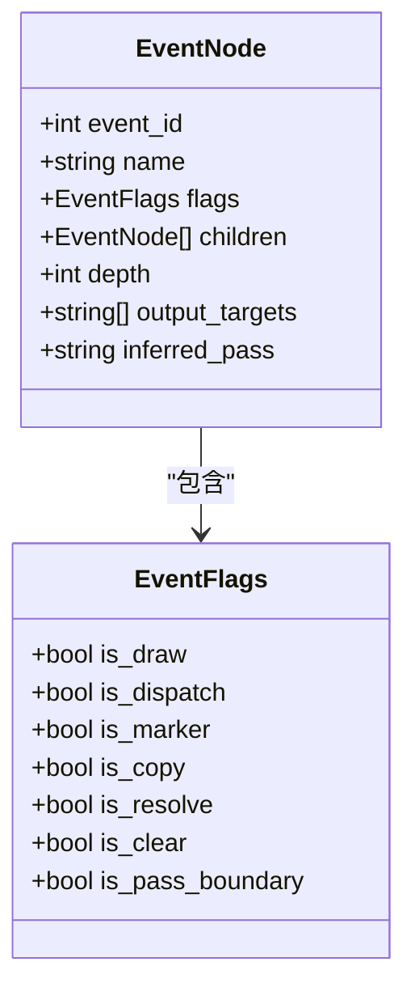
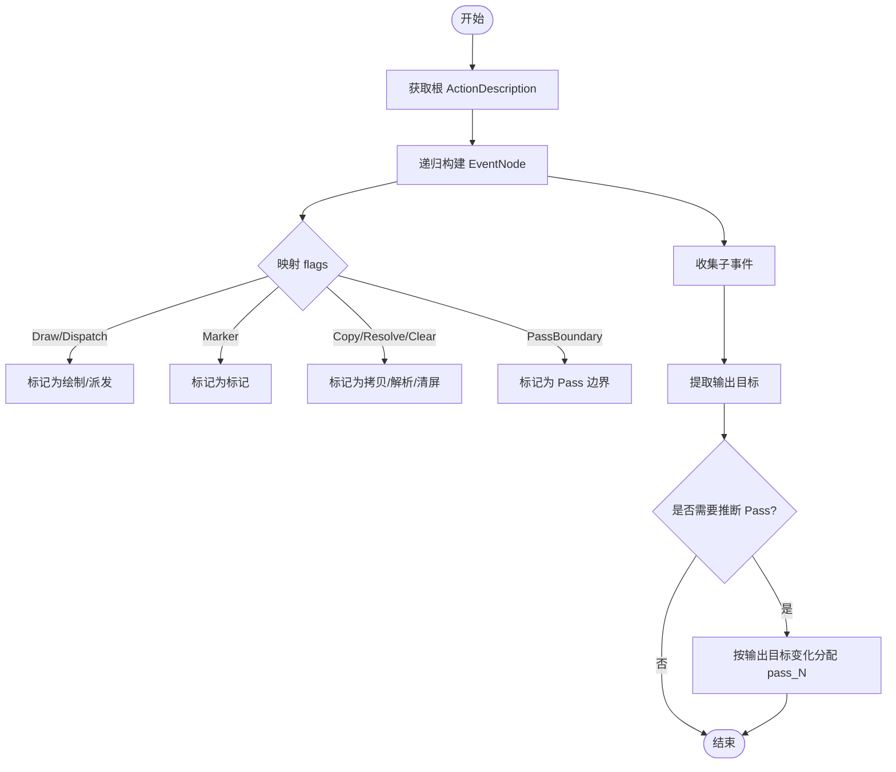
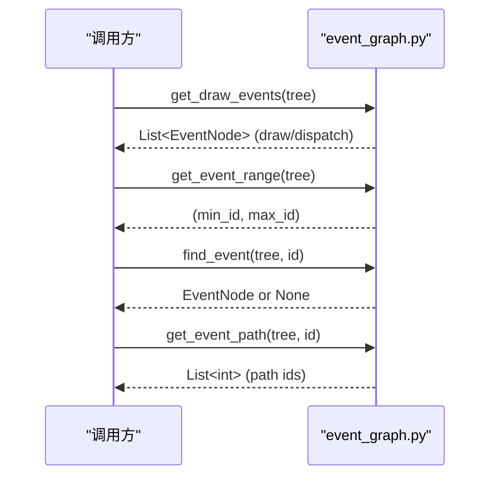
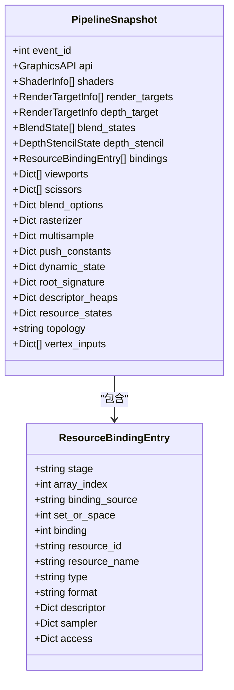
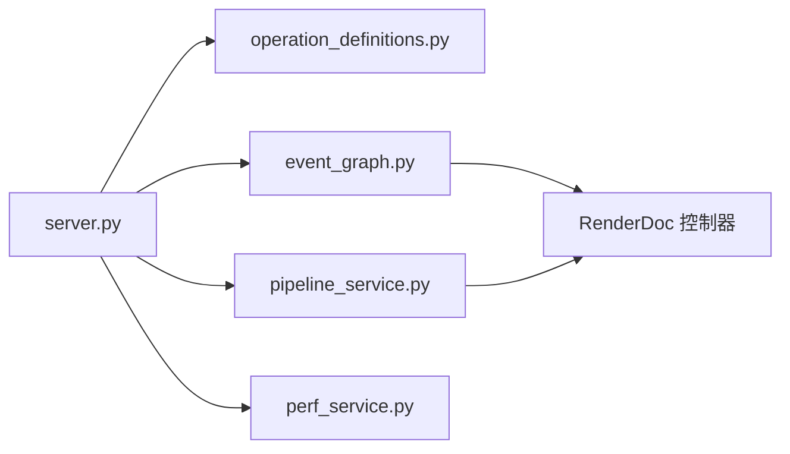
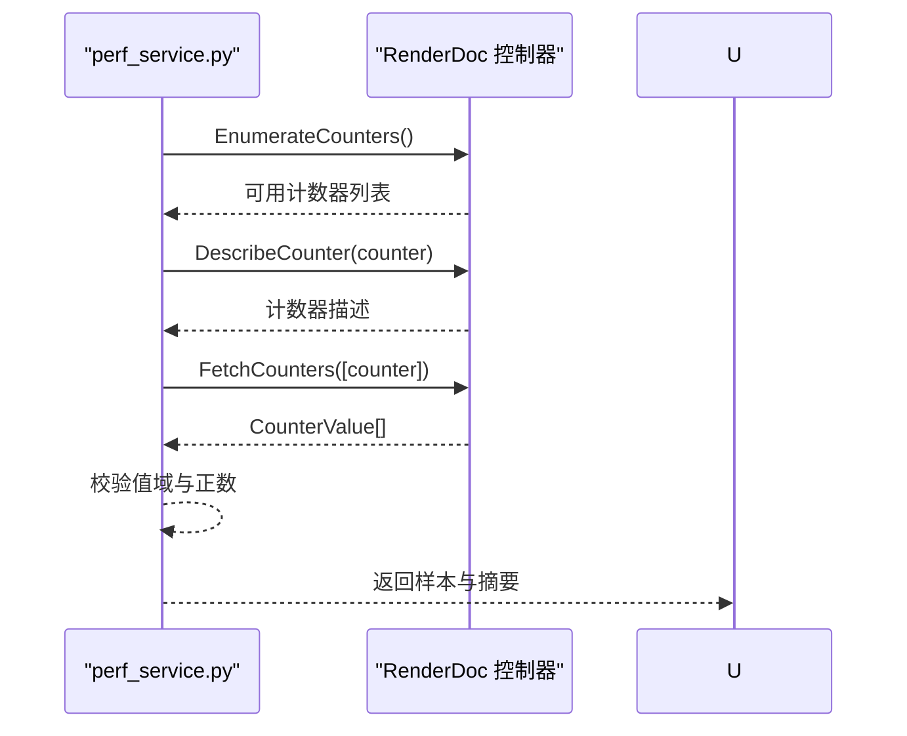

# 事件结构定义

<cite>
**本文引用的文件**
- [models.py](file://rdx/models.py)
- [event_graph.py](file://rdx/core/event_graph.py)
- [pipeline_service.py](file://rdx/core/pipeline_service.py)
- [operation_definitions.py](file://rdx/operation_definitions.py)
- [server.py](file://rdx/server.py)
- [perf_service.py](file://rdx/core/perf_service.py)
</cite>

## 目录
1. [简介](#简介)
2. [项目结构与定位](#项目结构与定位)
3. [核心组件](#核心组件)
4. [架构总览](#架构总览)
5. [详细组件分析](#详细组件分析)
6. [依赖关系分析](#依赖关系分析)
7. [性能与时间戳](#性能与时间戳)
8. [故障排查与错误处理](#故障排查与错误处理)
9. [结论](#结论)
10. [附录：事件类型与字段速查](#附录事件类型与字段速查)

## 简介
本文件面向需要理解 RenderDoc 捕获文件中 GPU 事件结构的开发者，系统性说明事件的基本结构、继承关系、层次组织方式，以及 Drawcall、状态改变、资源绑定等关键事件的属性字段、数据类型与语义含义。文档同时给出事件树构建流程、父子关系与查询方法，并补充事件验证规则与错误处理机制的要点，帮助读者快速建立对事件模型的全景认知。

## 项目结构与定位
本项目将 RenderDoc 回放控制器暴露的 ActionDescription 树转换为内部可序列化的事件树模型，并提供查询、推断 Pass 边界、获取管线快照与资源绑定等能力。核心文件职责如下：
- rdx/models.py：定义事件节点、标志位、管线快照、资源绑定条目等数据模型。
- rdx/core/event_graph.py：负责从 RenderDoc 回放控制器构建事件树，提供 draw/dispatch 收集、范围查询、路径查找与 Pass 推断。
- rdx/core/pipeline_service.py：在指定事件处读取管线状态（着色器、渲染目标、混合/深度模板、资源绑定、视口/裁剪等）。
- rdx/operation_definitions.py：对外工具接口契约，包含事件导航、mesh 配置、纹理采样等 API 的参数与返回约定。
- rdx/server.py：运行时调度入口，统一封装操作执行与上下文同步。
- rdx/core/perf_service.py：基于 RenderDoc 计数器获取整段回放的 GPU 耗时样本，用于事件级性能分析。

图表来源
- [server.py:1-120](file://rdx/server.py#L1-L120)
- [event_graph.py:152-191](file://rdx/core/event_graph.py#L152-L191)
- [pipeline_service.py:175-186](file://rdx/core/pipeline_service.py#L175-L186)
- [operation_definitions.py:1013-1048](file://rdx/operation_definitions.py#L1013-L1048)

章节来源
- [server.py:1-120](file://rdx/server.py#L1-L120)
- [event_graph.py:152-191](file://rdx/core/event_graph.py#L152-L191)
- [pipeline_service.py:175-186](file://rdx/core/pipeline_service.py#L175-L186)
- [operation_definitions.py:1013-1048](file://rdx/operation_definitions.py#L1013-L1048)

## 核心组件
- 事件节点与标志位
  - EventNode：表示一个事件节点，包含 event_id、name、flags、children、depth、output_targets、inferred_pass。
  - EventFlags：描述事件类型的布尔标志集合，包括 is_draw、is_dispatch、is_marker、is_copy、is_resolve、is_clear、is_pass_boundary。
- 管线快照与资源绑定
  - PipelineSnapshot：在某个 event_id 下的完整管线状态快照，包含 shaders、render_targets、depth_target、blend_states、depth_stencil、bindings、viewports、scissors、topology、vertex_inputs 等。
  - ResourceBindingEntry：描述某一着色器阶段的资源绑定条目，包含 stage、array_index、binding_source、set_or_space、binding、resource_id、type、format、descriptor/sampler/access 等。
- 事件树服务
  - EventGraphService：从 RenderDoc 回放控制器构建事件树，支持 draw/dispatch 收集、事件范围、路径查找、Pass 推断等。

章节来源
- [models.py:163-181](file://rdx/models.py#L163-L181)
- [models.py:232-299](file://rdx/models.py#L232-L299)
- [event_graph.py:152-191](file://rdx/core/event_graph.py#L152-L191)

## 架构总览
事件系统围绕“回放控制器 -> 事件树 -> 管线快照”的主线展开：
- 通过回放控制器的 GetRootActions 获取根 ActionDescription 列表，递归构建 EventNode 树。
- 每个 ActionDescription 的 flags 被映射为 EventFlags，以区分 draw/dispatch/marker/copy/resolve/clear/pass boundary 等。
- 对于 draw/dispatch 事件，可通过 pipeline_service 在对应 event_id 下读取管线快照，得到资源绑定、渲染目标、拓扑、顶点输入等信息。
- 当缺少显式标记时，可根据输出目标的变化推断逻辑 Pass 边界，并为连续 draw 分配 pass_1、pass_2 等标签。

图表来源
- [event_graph.py:161-191](file://rdx/core/event_graph.py#L161-L191)
- [pipeline_service.py:175-186](file://rdx/core/pipeline_service.py#L175-L186)
- [server.py:1-120](file://rdx/server.py#L1-L120)

## 详细组件分析

### 事件基本结构与继承关系
- EventNode
  - event_id：整数，唯一标识该事件在回放中的顺序编号。
  - name：字符串，来自 ActionDescription 的 customName，常用于调试标记或 Pass 名称。
  - flags：EventFlags，描述事件类型与行为特征。
  - children：子事件列表，构成层级结构；父事件通常包裹一组相关子事件（如 Pass 或命令列表）。
  - depth：整数，表示在树中的深度。
  - output_targets：字符串数组，保存当前事件输出的资源 ID（如颜色/深度缓冲），用于 Pass 推断。
  - inferred_pass：可选字符串，由服务推断的逻辑 Pass 标签（如 pass_1）。
- EventFlags
  - is_draw：是否绘制调用（含 Mesh Dispatch）。
  - is_dispatch：是否计算/网格派发（含 Compute/MeshDispatch/RayDispatch/BuildAccStruct）。
  - is_marker：是否为标记（SetMarker/PushMarker/PopMarker）。
  - is_copy/is_resolve/is_clear：是否为拷贝/解析/清屏操作。
  - is_pass_boundary：是否为呈现或 Pass 边界（Present/PassBoundary）。

图表来源
- [models.py:163-181](file://rdx/models.py#L163-L181)

章节来源
- [models.py:163-181](file://rdx/models.py#L163-L181)
- [event_graph.py:66-96](file://rdx/core/event_graph.py#L66-L96)

### 事件树构建与父子关系
- 构建过程
  - 通过回放控制器获取根 ActionDescription 列表。
  - 递归遍历每个 ActionDescription，将其转换为 EventNode，并设置 flags、children、output_targets 等。
  - 统计节点总数并记录日志。
- 父子关系
  - 父事件通常代表一个逻辑分组（如 Pass、命令块），其 children 包含具体的 draw/dispatch/标记等子事件。
  - 若缺少显式标记，服务会根据输出目标变化推断 Pass 边界，并给连续 draw 分配 inferred_pass。

图表来源
- [event_graph.py:161-191](file://rdx/core/event_graph.py#L161-L191)
- [event_graph.py:252-309](file://rdx/core/event_graph.py#L252-L309)

章节来源
- [event_graph.py:161-191](file://rdx/core/event_graph.py#L161-L191)
- [event_graph.py:252-309](file://rdx/core/event_graph.py#L252-L309)

### 事件查询与导航
- 获取绘制/派发事件：深度优先收集所有 is_draw 或 is_dispatch 的节点，保持文档顺序。
- 获取事件范围：收集所有 event_id，返回最小与最大值。
- 查找事件：按 event_id 深度优先搜索，返回对应节点或 None。
- 获取路径：从根到目标 event_id 的路径，返回包含所有中间节点的 event_id 列表。

图表来源
- [event_graph.py:195-248](file://rdx/core/event_graph.py#L195-L248)

章节来源
- [event_graph.py:195-248](file://rdx/core/event_graph.py#L195-L248)

### 管线快照与资源绑定
- 在指定 event_id 下读取管线状态，得到 PipelineSnapshot：
  - shaders：当前绑定的着色器信息（stage、entry_point、hash、encoding）。
  - render_targets/depth_target：颜色与深度缓冲的资源 ID、格式、尺寸、sRGB 等。
  - blend_states/depth_stencil：混合与深度模板状态。
  - bindings：资源绑定条目列表，描述各阶段资源的 set/space/binding/resource_id/type/format/descriptor/sampler/access。
  - viewports/scissors/topology/vertex_inputs：视口、裁剪、拓扑与顶点输入布局。
- 资源绑定条目 ResourceBindingEntry：
  - stage/array_index/binding_source/set_or_space/binding/resource_id/type/format/descriptor/sampler/access。

图表来源
- [models.py:232-299](file://rdx/models.py#L232-L299)
- [pipeline_service.py:175-186](file://rdx/core/pipeline_service.py#L175-L186)

章节来源
- [models.py:232-299](file://rdx/models.py#L232-L299)
- [pipeline_service.py:175-186](file://rdx/core/pipeline_service.py#L175-L186)

### 事件类型与用途
- Drawcall 事件（is_draw）
  - 语义：几何绘制调用，可能包含顶点/索引缓冲、拓扑、实例化计数等。
  - 关联查询：可通过 mesh 配置工具获取当前 draw 的 VB/IB、topology、baseVertex、indexOffset、instanceCount 等。
- Dispatch 事件（is_dispatch）
  - 语义：计算/网格派发调用，用于并行计算任务。
- Marker 事件（is_marker）
  - 语义：调试标记（Push/Set/Pop），用于组织事件层次与命名。
- Copy/Resolve/Clear 事件
  - 语义：内存拷贝、多重采样解析、缓冲区/纹理清屏等操作。
- Pass Boundary 事件（is_pass_boundary）
  - 语义：呈现或 Pass 边界，可用于划分渲染 Pass。

章节来源
- [event_graph.py:66-96](file://rdx/core/event_graph.py#L66-L96)
- [operation_definitions.py:1540-1559](file://rdx/operation_definitions.py#L1540-L1559)

## 依赖关系分析
- server.py 作为调度入口，将外部调用转发至具体工具实现，并在必要时自动同步预览上下文。
- event_graph.py 依赖 RenderDoc 回放控制器，将 ActionDescription 树转换为 EventNode 树。
- pipeline_service.py 依赖 RenderDoc 管线状态访问器，在不同 API 后端（D3D11/D3D12/Vulkan/OpenGL）下读取管线状态。
- operation_definitions.py 定义工具契约，约束参数与返回结构，确保跨模块一致性。
- perf_service.py 使用 RenderDoc 计数器获取 GPU 耗时样本，辅助事件级性能分析。

图表来源
- [server.py:1-120](file://rdx/server.py#L1-L120)
- [event_graph.py:152-191](file://rdx/core/event_graph.py#L152-L191)
- [pipeline_service.py:175-186](file://rdx/core/pipeline_service.py#L175-L186)
- [perf_service.py:33-63](file://rdx/core/perf_service.py#L33-L63)

章节来源
- [server.py:1-120](file://rdx/server.py#L1-L120)
- [event_graph.py:152-191](file://rdx/core/event_graph.py#L152-L191)
- [pipeline_service.py:175-186](file://rdx/core/pipeline_service.py#L175-L186)
- [perf_service.py:33-63](file://rdx/core/perf_service.py#L33-L63)

## 性能与时间戳
- 事件级 GPU 耗时
  - 通过 perf_service 枚举可用的 GPU 计数器，选择 EventGPUDuration/GPUDuration/GPU Duration 等名称的计数器。
  - 对回放事件范围进行采样，返回每事件的耗时样本，单位秒，可用于定位慢 draw。
- 时间戳与范围
  - 事件范围由事件树中所有 event_id 的最小与最大值确定。
  - 计数器采样需保证返回值有效且为正数，否则抛出异常。

图表来源
- [perf_service.py:33-63](file://rdx/core/perf_service.py#L33-L63)

章节来源
- [perf_service.py:33-63](file://rdx/core/perf_service.py#L33-L63)

## 故障排查与错误处理
- 回放控制器不可用或版本不兼容
  - 当无法导入 renderdoc 模块或某些 API 不存在时，服务会降级或抛出明确异常，提示更新 runtime 或检查环境。
- 输出目标查询失败
  - 若 GetPipelineState 或输出目标访问失败，event_graph 会记录调试日志并返回空结果，避免中断主流程。
- 计数器采样失败
  - 若计数器不可用、返回不完整或值为非正数，perf_service 抛出 ValueError/RuntimeError，指示不支持或采样失败。
- 事件不存在或路径为空
  - 查找事件或路径时，若未找到目标，返回 None 或空列表，调用方应据此做分支处理。

章节来源
- [event_graph.py:107-145](file://rdx/core/event_graph.py#L107-L145)
- [perf_service.py:33-63](file://rdx/core/perf_service.py#L33-L63)

## 结论
本事件模型以 EventNode 为核心，结合 EventFlags 描述事件类型，并通过 pipeline_service 在特定事件处读取管线快照与资源绑定，形成完整的 GPU 事件分析与调试能力。借助事件树构建、Pass 推断与性能采样，开发者可以高效定位问题、理解渲染流程与资源使用情况。建议在开发中充分利用事件路径、Pass 标签与资源绑定信息，结合性能计数器进行综合诊断。

## 附录：事件类型与字段速查
- 事件节点 EventNode
  - event_id：整数，事件序号。
  - name：字符串，自定义名称或标记。
  - flags：EventFlags，事件类型标志。
  - children：子事件列表。
  - depth：整数，树深度。
  - output_targets：字符串数组，输出资源 ID。
  - inferred_pass：可选字符串，推断的 Pass 标签。
- 事件标志 EventFlags
  - is_draw：绘制调用。
  - is_dispatch：计算/网格派发。
  - is_marker：调试标记。
  - is_copy/is_resolve/is_clear：拷贝/解析/清屏。
  - is_pass_boundary：呈现/Pass 边界。
- 管线快照 PipelineSnapshot
  - event_id：快照对应的事件。
  - api：图形 API。
  - shaders：着色器信息。
  - render_targets/depth_target：渲染目标。
  - blend_states/depth_stencil：混合与深度模板状态。
  - bindings：资源绑定条目。
  - viewports/scissors/topology/vertex_inputs：视口、裁剪、拓扑与顶点输入。
- 资源绑定 ResourceBindingEntry
  - stage/array_index/binding_source/set_or_space/binding/resource_id/type/format/descriptor/sampler/access。

章节来源
- [models.py:163-181](file://rdx/models.py#L163-L181)
- [models.py:232-299](file://rdx/models.py#L232-L299)
- [event_graph.py:66-96](file://rdx/core/event_graph.py#L66-L96)