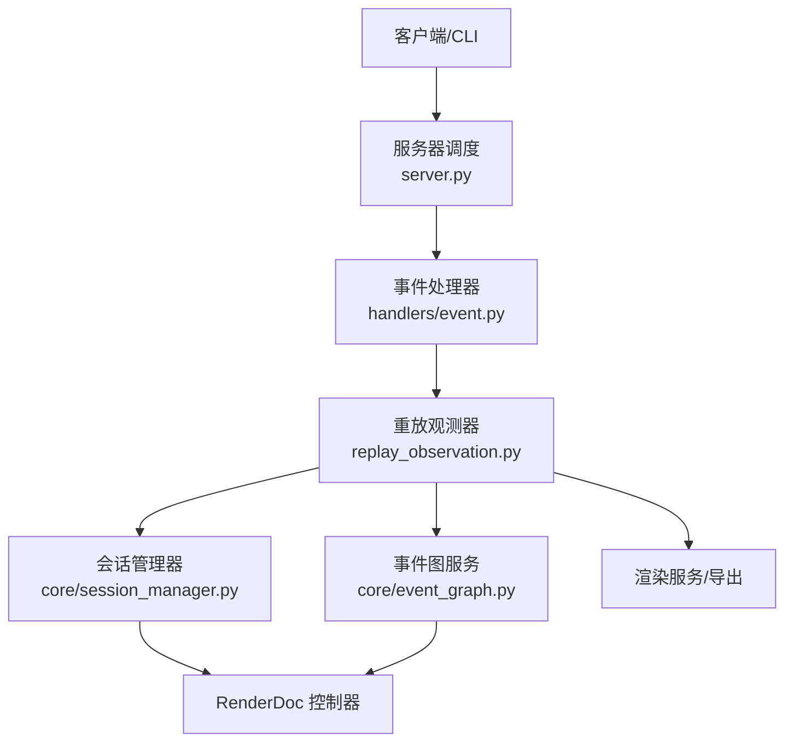
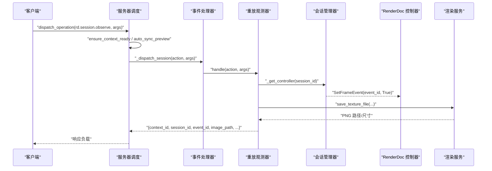
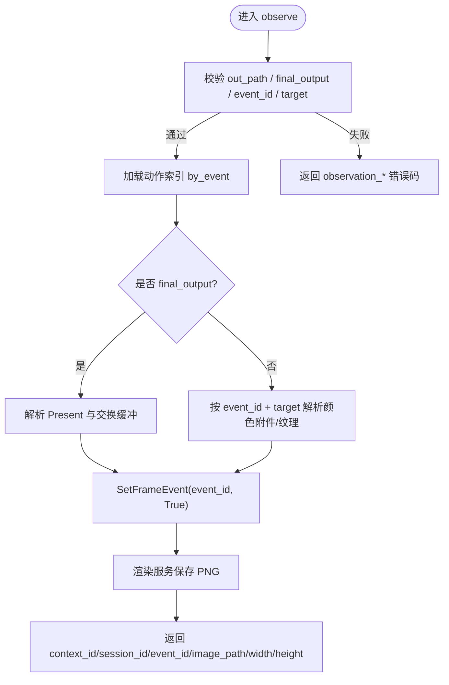
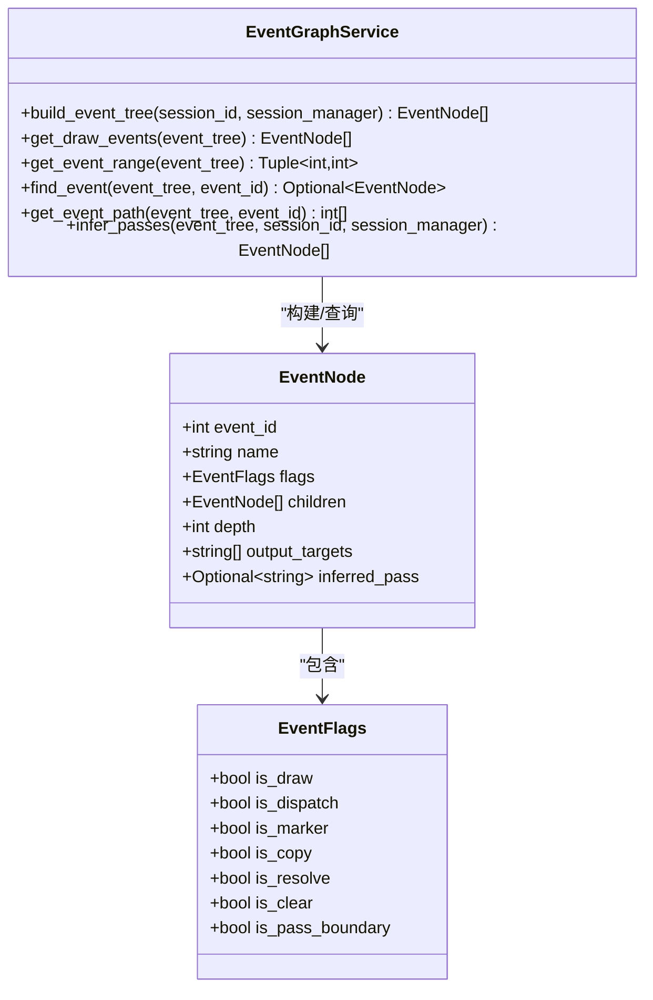
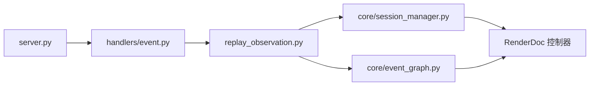

# 事件观测机制

<cite>
**本文引用的文件**
- [rdc_tool/server.py](file://rdc_tool/server.py)
- [rdc_tool/handlers/event.py](file://rdc_tool/handlers/event.py)
- [rdc_tool/replay_observation.py](file://rdc_tool/replay_observation.py)
- [rdc_tool/core/event_graph.py](file://rdc_tool/core/event_graph.py)
- [rdc_tool/core/session_manager.py](file://rdc_tool/core/session_manager.py)
- [rdc_tool/models.py](file://rdc_tool/models.py)
- [tests/test_server_event_pipeline_resource.py](file://tests/test_server_event_pipeline_resource.py)
- [tests/test_texture_and_shader_event_binding.py](file://tests/test_texture_and_shader_event_binding.py)
</cite>

## 目录
1. [简介](#简介)
2. [项目结构](#项目结构)
3. [核心组件](#核心组件)
4. [架构总览](#架构总览)
5. [详细组件分析](#详细组件分析)
6. [依赖关系分析](#依赖关系分析)
7. [性能考量](#性能考量)
8. [故障排除指南](#故障排除指南)
9. [结论](#结论)
10. [附录](#附录)

## 简介
本技术文档围绕“事件观测机制”展开，聚焦于渲染捕获回放中的事件监听、订阅与观测能力。系统通过会话管理、事件图构建、重放控制器交互以及观察导出等模块，实现对特定事件（如绘制、分发、Present）的精准定位、上下文获取与结果导出。文档将解释如何注册处理器、捕获特定类型或属性的事件，如何获取执行环境、资源状态与调用栈信息，如何配置和使用事件过滤器进行复杂条件组合查询，并给出性能影响分析与优化策略。同时提供调试技巧与故障排除指南，帮助开发者高效利用事件观测功能进行问题诊断。

## 项目结构
事件观测相关代码主要分布在以下位置：
- 服务器调度入口：负责操作分发、上下文管理与生命周期控制
- 事件处理器：统一转发到运行时的事件处理逻辑
- 重放观测器：无窗口、上下文拥有的回放观测实现，支持列出事件、选择最终输出、导出图像
- 事件图服务：将 RenderDoc 的 ActionDescription 树转换为可序列化的 EventNode 树，并提供查询与 Pass 推断
- 会话管理器：封装本地/远程回放控制器生命周期、头显输出创建与清理
- 数据模型：定义事件节点、标志位、管线快照、性能计数器等结构化类型
- 测试用例：覆盖事件激活、动作树分页、管线状态、资源使用、着色器绑定等场景

图表来源
- [rdc_tool/server.py:62-145](file://rdc_tool/server.py#L62-L145)
- [rdc_tool/handlers/event.py:8-10](file://rdc_tool/handlers/event.py#L8-L10)
- [rdc_tool/replay_observation.py:40-147](file://rdc_tool/replay_observation.py#L40-L147)
- [rdc_tool/core/session_manager.py:175-251](file://rdc_tool/core/session_manager.py#L175-L251)
- [rdc_tool/core/event_graph.py:152-191](file://rdc_tool/core/event_graph.py#L152-L191)

章节来源
- [rdc_tool/server.py:62-145](file://rdc_tool/server.py#L62-L145)
- [rdc_tool/handlers/event.py:8-10](file://rdc_tool/handlers/event.py#L8-L10)
- [rdc_tool/replay_observation.py:40-147](file://rdc_tool/replay_observation.py#L40-L147)
- [rdc_tool/core/session_manager.py:175-251](file://rdc_tool/core/session_manager.py#L175-L251)
- [rdc_tool/core/event_graph.py:152-191](file://rdc_tool/core/event_graph.py#L152-L191)

## 核心组件
- 服务器调度器：负责操作分发、上下文准备、预览同步与错误规范化
- 事件处理器：将事件动作路由到运行时处理函数
- 重放观测器：提供 get_replay_events 与 observe 两种能力；前者列出捕获事件，后者根据 event_id/target/final_output 选择目标并导出 PNG
- 事件图服务：构建事件树、查询 draw/dispatch 事件、计算事件范围、按输出目标推断 Pass 边界
- 会话管理器：创建/打开/关闭会话，初始化本地或远程回放控制器，创建无头输出，安全清理资源
- 数据模型：EventNode、EventFlags、PipelineSnapshot、PerfResult 等用于描述事件、管线与性能数据

章节来源
- [rdc_tool/server.py:62-145](file://rdc_tool/server.py#L62-L145)
- [rdc_tool/handlers/event.py:8-10](file://rdc_tool/handlers/event.py#L8-L10)
- [rdc_tool/replay_observation.py:40-147](file://rdc_tool/replay_observation.py#L40-L147)
- [rdc_tool/core/event_graph.py:152-191](file://rdc_tool/core/event_graph.py#L152-L191)
- [rdc_tool/core/session_manager.py:175-251](file://rdc_tool/core/session_manager.py#L175-L251)
- [rdc_tool/models.py:163-181](file://rdc_tool/models.py#L163-L181)

## 架构总览
事件观测的整体流程如下：
- 客户端发起 rd.session.get_replay_events 或 rd.session.observe
- 服务器调度确保上下文就绪，必要时自动同步预览
- 事件处理器将动作转发至重放观测器
- 重放观测器校验参数、加载动作索引、解析事件与目标，设置帧事件并更新活跃事件
- 如需导出图像，调用渲染服务保存纹理为 PNG
- 事件图服务可用于构建/查询事件树与推断 Pass 边界
- 会话管理器提供控制器访问与资源生命周期管理

图表来源
- [rdc_tool/server.py:62-145](file://rdc_tool/server.py#L62-L145)
- [rdc_tool/handlers/event.py:8-10](file://rdc_tool/handlers/event.py#L8-L10)
- [rdc_tool/replay_observation.py:40-147](file://rdc_tool/replay_observation.py#L40-L147)
- [rdc_tool/core/session_manager.py:260-273](file://rdc_tool/core/session_manager.py#L260-L273)

## 详细组件分析

### 事件处理器与调度
- 事件处理器仅做轻量转发，将 action 与参数交给 server_runtime 的 _dispatch_event 或 _dispatch_session
- 服务器调度在每次操作前后记录日志、维护上下文与进度报告，并对非预览类操作自动同步预览
- 对异常进行映射与规范化，返回统一的 canonical_error 结构

章节来源
- [rdc_tool/handlers/event.py:8-10](file://rdc_tool/handlers/event.py#L8-L10)
- [rdc_tool/server.py:62-145](file://rdc_tool/server.py#L62-L145)

### 重放观测器（Replay Observation）
- 列出事件：get_replay_events 返回按 eventId 排序的事件列表，便于前端或上层工具展示
- 观察导出：observe 支持三种目标选择方式：
  - final_output：基于 Present 动作与交换缓冲唯一性确定最终输出
  - event_id + target：按指定事件与颜色附件槽或纹理 ID 选择目标
  - 默认：若当前事件是 Present，则尝试解析其交换缓冲作为目标
- 参数校验严格：out_path 必须为绝对 PNG 路径且不可复用；final_output 不能与 event_id/target 同时出现；event_id 必须在捕获中
- 导出失败时清理临时文件，避免暴露旧图像

图表来源
- [rdc_tool/replay_observation.py:40-147](file://rdc_tool/replay_observation.py#L40-L147)

章节来源
- [rdc_tool/replay_observation.py:40-147](file://rdc_tool/replay_observation.py#L40-L147)

### 事件图服务（Event Graph Service）
- 构建事件树：从控制器获取根动作，递归构建 EventNode 树，统计节点总数
- 查询能力：
  - get_draw_events：深度优先收集 draw/dispatch 节点
  - get_event_range：计算全树最小/最大 eventId
  - find_event/get_event_path：按 eventId 查找节点及路径
- Pass 推断：当捕获缺少 debug markers 时，依据输出目标变化推断 render-pass 边界，并为每个分组分配 pass_1/pass_2...

图表来源
- [rdc_tool/core/event_graph.py:152-191](file://rdc_tool/core/event_graph.py#L152-L191)
- [rdc_tool/core/event_graph.py:195-248](file://rdc_tool/core/event_graph.py#L195-L248)
- [rdc_tool/core/event_graph.py:252-309](file://rdc_tool/core/event_graph.py#L252-L309)
- [rdc_tool/models.py:163-181](file://rdc_tool/models.py#L163-L181)

章节来源
- [rdc_tool/core/event_graph.py:152-191](file://rdc_tool/core/event_graph.py#L152-L191)
- [rdc_tool/core/event_graph.py:195-248](file://rdc_tool/core/event_graph.py#L195-L248)
- [rdc_tool/core/event_graph.py:252-309](file://rdc_tool/core/event_graph.py#L252-L309)
- [rdc_tool/models.py:163-181](file://rdc_tool/models.py#L163-L181)

### 会话管理器（Session Manager）
- 会话生命周期：create_session/open_capture/close_session，支持本地与远程后端
- 控制器访问：get_controller 提供 IReplayController 实例，供事件设置与资源查询
- 无头输出：创建 headless windowing data 并生成 Texture 输出，便于离线导出
- 清理：安全关闭输出、控制器、捕获文件与远程连接，必要时关闭全局回放子系统

章节来源
- [rdc_tool/core/session_manager.py:175-251](file://rdc_tool/core/session_manager.py#L175-L251)
- [rdc_tool/core/session_manager.py:260-273](file://rdc_tool/core/session_manager.py#L260-L273)
- [rdc_tool/core/session_manager.py:509-515](file://rdc_tool/core/session_manager.py#L509-L515)
- [rdc_tool/core/session_manager.py:517-568](file://rdc_tool/core/session_manager.py#L517-L568)

### 数据模型（Models）
- EventNode/EventFlags：描述事件节点及其标志位，用于事件图构建与查询
- PipelineSnapshot：描述管线状态，包括着色器、渲染目标、混合状态、拓扑等
- PerfResult/CounterSample/CounterSummary：性能计数器采样与汇总，支持异常事件检测
- ArtifactRef/ErrorDetail/ToolResponse：通用响应与工件引用

章节来源
- [rdc_tool/models.py:163-181](file://rdc_tool/models.py#L163-L181)
- [rdc_tool/models.py:280-301](file://rdc_tool/models.py#L280-L301)
- [rdc_tool/models.py:463-483](file://rdc_tool/models.py#L463-L483)
- [rdc_tool/models.py:103-122](file://rdc_tool/models.py#L103-L122)

## 依赖关系分析
- 服务器调度依赖 CoreEngine 与 ArtifactPublisher，负责操作执行与工件发布
- 事件处理器依赖 server_runtime 的分发方法
- 重放观测器依赖 server_runtime 提供的控制器获取、活动事件管理、渲染服务导出
- 事件图服务依赖 SessionManager 获取控制器，并通过 RenderDoc API 查询输出目标
- 会话管理器直接对接 RenderDoc 本地/远程回放接口，管理控制器与输出资源

图表来源
- [rdc_tool/server.py:62-145](file://rdc_tool/server.py#L62-L145)
- [rdc_tool/handlers/event.py:8-10](file://rdc_tool/handlers/event.py#L8-L10)
- [rdc_tool/replay_observation.py:40-147](file://rdc_tool/replay_observation.py#L40-L147)
- [rdc_tool/core/session_manager.py:175-251](file://rdc_tool/core/session_manager.py#L175-L251)
- [rdc_tool/core/event_graph.py:152-191](file://rdc_tool/core/event_graph.py#L152-L191)

章节来源
- [rdc_tool/server.py:62-145](file://rdc_tool/server.py#L62-L145)
- [rdc_tool/handlers/event.py:8-10](file://rdc_tool/handlers/event.py#L8-L10)
- [rdc_tool/replay_observation.py:40-147](file://rdc_tool/replay_observation.py#L40-L147)
- [rdc_tool/core/session_manager.py:175-251](file://rdc_tool/core/session_manager.py#L175-L251)
- [rdc_tool/core/event_graph.py:152-191](file://rdc_tool/core/event_graph.py#L152-L191)

## 性能考量
- 事件树构建与遍历：采用深度优先遍历，时间复杂度 O(N)，N 为事件节点数；适合中等规模捕获
- Pass 推断：需要为每个 draw 查询输出目标，可能触发控制器 SetFrameEvent 与 GetPipelineState，建议批量或缓存以减少开销
- 性能计数器采样：sample_counters 与 detect_hotspots 会调用 FetchCounters，注意事件范围与计数器数量对性能的影响
- 导出 PNG：save_texture_file 涉及 GPU/CPU 读回与编码，建议在后台线程或异步任务中执行，避免阻塞主循环
- 预览同步：服务器在非预览操作中自动同步预览，频繁调用会增加额外开销，应合理控制调用频率

[本节为一般性指导，不直接分析具体文件]

## 故障排除指南
- 事件不存在：observation_event_invalid，检查 event_id 是否在捕获中
- 路径无效：observation_path_invalid，确保 out_path 为绝对路径且后缀为 .png
- 路径复用：observation_path_exists，禁止覆盖已有文件，使用新路径
- 选择冲突：observation_selection_conflict，final_output 不能与 event_id/target 同时使用
- 目标缺失：missing_target/no_color_output，当前事件无颜色输出或请求的 rt_index 不匹配
- 最终输出不可用：final_output_unavailable/present_output_unavailable，捕获无 Present 或无法识别交换缓冲
- 导出失败：export_failure，检查渲染服务与磁盘空间，失败时会删除不完整文件
- 事件激活校验：set_active 前会验证事件存在，避免污染 active_event_id

章节来源
- [rdc_tool/replay_observation.py:55-90](file://rdc_tool/replay_observation.py#L55-L90)
- [tests/test_server_event_pipeline_resource.py:250-275](file://tests/test_server_event_pipeline_resource.py#L250-L275)

## 结论
事件观测机制通过清晰的职责划分与稳健的参数校验，提供了对渲染捕获事件的精细控制与可视化导出能力。借助事件图服务与会话管理器，开发者可以高效地定位事件、推断 Pass 边界、获取管线状态与资源信息，并结合性能计数器进行热点分析。遵循本文的性能优化建议与故障排除指南，能够在大规模捕获与高频调用场景下保持稳定的观测体验。

[本节为总结性内容，不直接分析具体文件]

## 附录

### 注册事件处理器与订阅模式
- 处理器注册：通过 handlers/event.py 的 handle 方法将 action 路由到 server_runtime._dispatch_event
- 订阅模式：上层工具可调用 rd.session.get_replay_events 获取事件列表，再按需订阅特定事件进行后续处理（如 observe）
- 示例路径参考：
  - 处理器转发：[rdc_tool/handlers/event.py:8-10](file://rdc_tool/handlers/event.py#L8-L10)
  - 事件列表获取：[rdc_tool/replay_observation.py:52-53](file://rdc_tool/replay_observation.py#L52-L53)

章节来源
- [rdc_tool/handlers/event.py:8-10](file://rdc_tool/handlers/event.py#L8-L10)
- [rdc_tool/replay_observation.py:52-53](file://rdc_tool/replay_observation.py#L52-L53)

### 捕获特定类型或属性事件
- 类型过滤：使用事件图服务的 get_draw_events 筛选 draw/dispatch 事件
- 属性过滤：结合 EventFlags 与 output_targets 进行更细粒度筛选
- 示例路径参考：
  - 绘制事件收集：[rdc_tool/core/event_graph.py:195-202](file://rdc_tool/core/event_graph.py#L195-L202)
  - 标志位映射：[rdc_tool/core/event_graph.py:66-96](file://rdc_tool/core/event_graph.py#L66-L96)

章节来源
- [rdc_tool/core/event_graph.py:195-202](file://rdc_tool/core/event_graph.py#L195-L202)
- [rdc_tool/core/event_graph.py:66-96](file://rdc_tool/core/event_graph.py#L66-L96)

### 事件上下文信息获取
- 执行环境：通过 server_runtime 的上下文 ID 与进度报告器追踪操作上下文
- 资源状态：使用事件图服务查询输出目标，或通过渲染服务读取纹理描述符
- 调用栈：服务器调度记录操作开始/结束日志，包含 trace_id、transport、operation、duration_ms
- 示例路径参考：
  - 上下文与进度：[rdc_tool/server.py:79-107](file://rdc_tool/server.py#L79-L107)
  - 输出目标查询：[rdc_tool/replay_observation.py:108-110](file://rdc_tool/replay_observation.py#L108-L110)

章节来源
- [rdc_tool/server.py:79-107](file://rdc_tool/server.py#L79-L107)
- [rdc_tool/replay_observation.py:108-110](file://rdc_tool/replay_observation.py#L108-L110)

### 事件过滤器配置与复杂条件组合
- 基础过滤：按事件类型（draw/dispatch）、Pass 边界（is_pass_boundary）、输出目标集合
- 复杂组合：结合 event_id 范围、target.rt_index、target.texture_id 与 final_output 标志
- 示例路径参考：
  - 事件范围计算：[rdc_tool/core/event_graph.py:204-216](file://rdc_tool/core/event_graph.py#L204-L216)
  - 目标选择逻辑：[rdc_tool/replay_observation.py:61-90](file://rdc_tool/replay_observation.py#L61-L90)

章节来源
- [rdc_tool/core/event_graph.py:204-216](file://rdc_tool/core/event_graph.py#L204-L216)
- [rdc_tool/replay_observation.py:61-90](file://rdc_tool/replay_observation.py#L61-L90)

### 自定义监控与分析逻辑示例
- 监控绘制事件：构建事件树后调用 get_draw_events，遍历节点并记录关键指标（如名称、深度、输出目标）
- 分析热点事件：使用性能服务 sample_counters/detect_hotspots，按事件范围与计数器 ID 采样，识别异常事件
- 示例路径参考：
  - 绘制事件收集：[rdc_tool/core/event_graph.py:195-202](file://rdc_tool/core/event_graph.py#L195-L202)
  - 性能采样：[rdc_tool/core/perf_service.py:314-487](file://rdc_tool/core/perf_service.py#L314-L487)

章节来源
- [rdc_tool/core/event_graph.py:195-202](file://rdc_tool/core/event_graph.py#L195-L202)
- [rdc_tool/core/perf_service.py:314-487](file://rdc_tool/core/perf_service.py#L314-L487)

### 调试技巧与故障排除
- 启用详细日志：服务器调度记录 op.start/op.done，关注 duration_ms 与 ok 字段
- 断点与回溯：在 observe 的参数校验与导出阶段设置断点，检查 out_path、event_id、target 的有效性
- 常见错误码：
  - observation_path_invalid/exist/conflict
  - observation_event_invalid/target_invalid
  - final_output_unavailable/present_output_unavailable
  - export_failure
- 示例路径参考：
  - 日志记录：[rdc_tool/server.py:90-141](file://rdc_tool/server.py#L90-L141)
  - 错误处理：[rdc_tool/replay_observation.py:55-90](file://rdc_tool/replay_observation.py#L55-L90)

章节来源
- [rdc_tool/server.py:90-141](file://rdc_tool/server.py#L90-L141)
- [rdc_tool/replay_observation.py:55-90](file://rdc_tool/replay_observation.py#L55-L90)