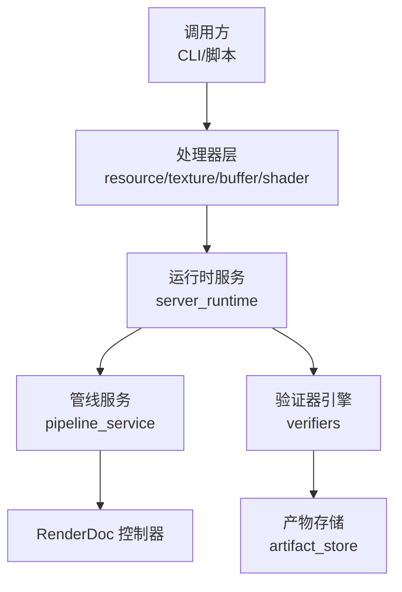
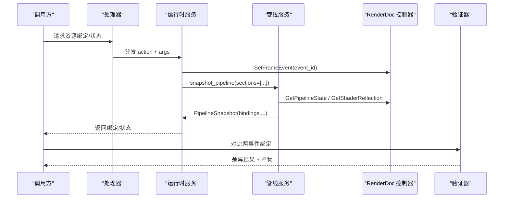
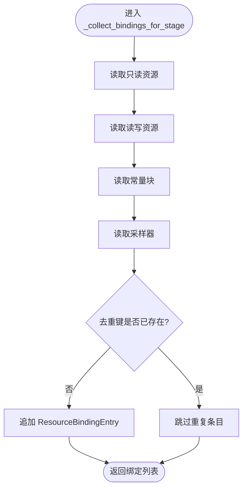
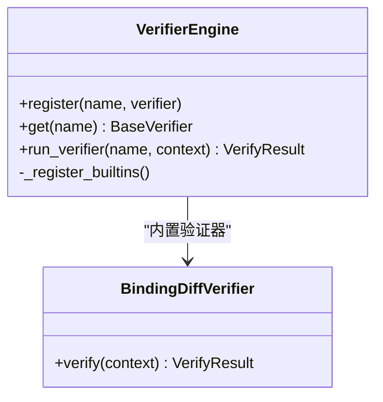
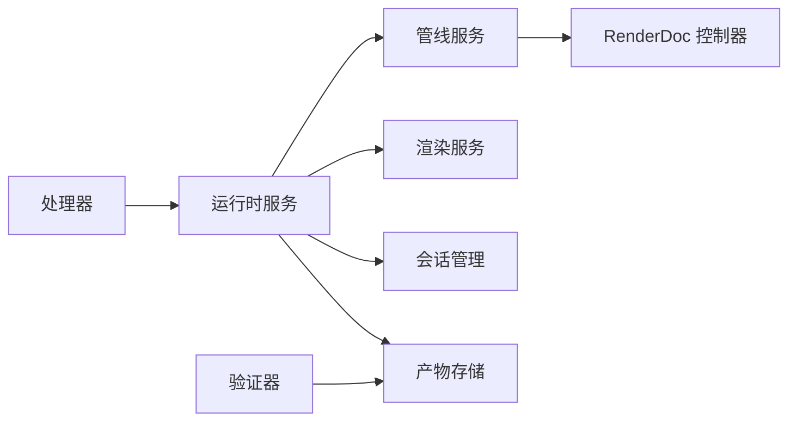

# 资源绑定分析

<cite>
**本文引用的文件**
- [pipeline_service.py](file://rdx/core/pipeline_service.py)
- [verifiers.py](file://rdx/core/verifiers.py)
- [server_runtime.py](file://rdx/server_runtime.py)
- [resource.py](file://rdx/handlers/resource.py)
- [texture.py](file://rdx/handlers/texture.py)
- [buffer.py](file://rdx/handlers/buffer.py)
- [shader.py](file://rdx/handlers/shader.py)
- [operation_definitions.py](file://rdx/operation_definitions.py)
- [tool-interface-upgrade.md](file://docs/tool-interface-upgrade.md)
- [test_texture_and_shader_event_binding.py](file://tests/test_texture_and_shader_event_binding.py)
</cite>

## 目录
1. [简介](#简介)
2. [项目结构](#项目结构)
3. [核心组件](#核心组件)
4. [架构总览](#架构总览)
5. [详细组件分析](#详细组件分析)
6. [依赖关系分析](#依赖关系分析)
7. [性能考虑](#性能考虑)
8. [故障排查指南](#故障排查指南)
9. [结论](#结论)
10. [附录](#附录)

## 简介
本技术文档聚焦于 GPU 事件中的“资源绑定”分析与验证，覆盖纹理、缓冲区、着色器、管线状态等关键资源类型。文档解释：
- 什么是资源绑定以及它在渲染/计算管线中的重要性；
- 如何通过管道状态与描述符访问获取并校验绑定信息；
- 如何构建资源生命周期视图（创建、绑定、使用、释放）；
- 如何分析并可视化资源依赖关系；
- 如何检测资源冲突并优化内存使用；
- 如何使用现有工具链进行具体分析与调优实践。

## 项目结构
围绕资源绑定分析，代码主要分布在以下层次：
- 处理器层：将外部调用路由到运行时服务（资源、纹理、缓冲、着色器等）。
- 运行时服务层：统一调度会话、控制器、管线服务、渲染服务等。
- 管线服务层：从 RenderDoc 控制器读取管线状态、着色器反射、资源绑定、输出目标等。
- 验证器层：对两次事件的绑定差异进行比对并产出可审计产物。
- 操作定义层：对外暴露的标准化操作契约，包括管线状态查询、资源列表、常量缓冲等。

图表来源
- [server_runtime.py:1-120](file://rdx/server_runtime.py#L1-L120)
- [pipeline_service.py:590-702](file://rdx/core/pipeline_service.py#L590-L702)
- [verifiers.py:650-757](file://rdx/core/verifiers.py#L650-L757)

章节来源
- [server_runtime.py:1-120](file://rdx/server_runtime.py#L1-L120)
- [pipeline_service.py:590-702](file://rdx/core/pipeline_service.py#L590-L702)
- [verifiers.py:650-757](file://rdx/core/verifiers.py#L650-L757)

## 核心组件
- 管线服务（PipelineService）
  - 负责在指定事件上设置帧事件、获取管线状态、API 特定状态、着色器、输出目标、混合/深度模板状态、视口/裁剪、拓扑、顶点输入、各阶段资源绑定等。
  - 通过 _collect_bindings_for_stage 聚合只读资源、读写资源、常量块、采样器，并映射为统一的 ResourceBindingEntry。
- 验证器引擎（VerifierEngine）
  - 提供绑定差异对比能力，比较两个事件的绑定集合，记录新增、移除、变更项，并保存差异产物。
- 运行时服务（server_runtime）
  - 统一分发资源、纹理、缓冲、着色器等操作；管理会话、控制器、上下文快照、预览、远程回放等。
- 处理器（handlers）
  - 轻量转发层，将 action 与参数转交给 server_runtime 对应分发方法。
- 操作定义（operation_definitions）
  - 声明对外操作的参数、返回值、影响范围、证据类型等元数据，如 rd.pipeline.get_resource_bindings、rd.resource.list_all、rd.pipeline.get_constant_buffers 等。

章节来源
- [pipeline_service.py:392-502](file://rdx/core/pipeline_service.py#L392-L502)
- [pipeline_service.py:590-702](file://rdx/core/pipeline_service.py#L590-L702)
- [verifiers.py:650-757](file://rdx/core/verifiers.py#L650-L757)
- [server_runtime.py:1-120](file://rdx/server_runtime.py#L1-L120)
- [resource.py:1-11](file://rdx/handlers/resource.py#L1-L11)
- [texture.py:1-11](file://rdx/handlers/texture.py#L1-L11)
- [buffer.py:1-11](file://rdx/handlers/buffer.py#L1-L11)
- [shader.py:1-11](file://rdx/handlers/shader.py#L1-L11)
- [operation_definitions.py:1712-1735](file://rdx/operation_definitions.py#L1712-L1735)
- [operation_definitions.py:1935-1940](file://rdx/operation_definitions.py#L1935-L1940)

## 架构总览
资源绑定分析的整体流程如下：
- 调用方通过处理器调用运行时服务，指定 session_id、event_id 及所需 sections。
- 运行时服务定位控制器，设置帧事件，调用管线服务获取管线快照。
- 管线服务按阶段收集资源绑定，生成 ResourceBindingEntry 列表。
- 验证器可对两个事件的绑定进行差异比对，生成差异产物供后续分析。
- 操作定义确保对外接口稳定且可组合，便于上层工具或 Skill 编排。

图表来源
- [pipeline_service.py:597-702](file://rdx/core/pipeline_service.py#L597-L702)
- [verifiers.py:650-757](file://rdx/core/verifiers.py#L650-L757)
- [server_runtime.py:1-120](file://rdx/server_runtime.py#L1-L120)

## 详细组件分析

### 管线服务：资源绑定采集与校验
- 阶段绑定采集
  - 遍历图形/计算阶段，调用只读资源、读写资源、常量块、采样器接口，映射为 SRV/UAV/CBV/Sampler 类型。
  - 去重键包含 set_or_space、binding、type、resource_id、array_index、descriptorStore、byteOffset，避免重复条目。
  - 若反射可用，则填充 binding_source="shader_reflection"，否则为 "direct_descriptor_access"。
- 管线快照
  - 根据 sections 选择性读取 shaders、output_targets、blend、depth_stencil、viewports_scissors、topology、vertex_input、bindings 等。
  - 对 API 特定状态（D3D11/D3D12/Vulkan/OpenGL）进行差异化提取。
- 错误处理
  - 对不可用或缺失字段采用 try/except 保护，抛出明确异常以便上层诊断。

图表来源
- [pipeline_service.py:392-502](file://rdx/core/pipeline_service.py#L392-L502)

章节来源
- [pipeline_service.py:392-502](file://rdx/core/pipeline_service.py#L392-L502)
- [pipeline_service.py:597-702](file://rdx/core/pipeline_service.py#L597-L702)

### 验证器：绑定差异对比与产物
- 差异算法
  - 以 (set_or_space, binding, type) 为键，比较 good/bad 两个事件的绑定集合。
  - 分类统计 added/removed/changed，并记录 resource_id/format 变化。
- 产物与异常
  - 当存在差异时，将 diff 写入 artifact_store，并生成 AnomalyInfo，便于自动化流水线捕获问题。
- 集成点
  - 由上层 verifier 引擎注册与调度，支持扩展更多验证规则。

图表来源
- [verifiers.py:650-757](file://rdx/core/verifiers.py#L650-L757)
- [verifiers.py:764-849](file://rdx/core/verifiers.py#L764-L849)

章节来源
- [verifiers.py:650-757](file://rdx/core/verifiers.py#L650-L757)
- [verifiers.py:764-849](file://rdx/core/verifiers.py#L764-L849)

### 运行时服务与处理器：调用路由与上下文管理
- 处理器
  - resource/texture/buffer/shader 处理器仅做轻量转发，将 action 与参数交给 server_runtime 的对应分发方法。
- 运行时服务
  - 维护上下文、会话、预览、远程连接等状态；提供 _dispatch_* 系列分发入口。
  - 统一管理 RenderDoc 控制器、管线服务、渲染服务、产物存储等。
- 测试用例
  - 通过 monkeypatch 模拟控制器与服务，验证事件 ID 传递、像素历史解析、常量缓冲内容解码等行为。

章节来源
- [resource.py:1-11](file://rdx/handlers/resource.py#L1-L11)
- [texture.py:1-11](file://rdx/handlers/texture.py#L1-L11)
- [buffer.py:1-11](file://rdx/handlers/buffer.py#L1-L11)
- [shader.py:1-11](file://rdx/handlers/shader.py#L1-L11)
- [server_runtime.py:1-120](file://rdx/server_runtime.py#L1-L120)
- [test_texture_and_shader_event_binding.py:57-151](file://tests/test_texture_and_shader_event_binding.py#L57-L151)
- [test_texture_and_shader_event_binding.py:362-417](file://tests/test_texture_and_shader_event_binding.py#L362-L417)
- [test_texture_and_shader_event_binding.py:419-469](file://tests/test_texture_and_shader_event_binding.py#L419-L469)
- [test_texture_and_shader_event_binding.py:557-618](file://tests/test_texture_and_shader_event_binding.py#L557-L618)

### 操作定义：对外接口契约
- 管线状态与绑定
  - rd.pipeline.get_state：按 sections 选择读取，包含 bindings、shaders、output_targets、topology、viewports_scissors、blend、depth_stencil 等。
  - rd.pipeline.get_resource_bindings：返回当前事件绑定的资源条目。
  - rd.pipeline.get_vertex_buffers / get_index_buffer：获取顶点/索引缓冲绑定。
  - rd.pipeline.get_constant_buffers：获取常量缓冲绑定并可解码变量值。
- 资源与纹理
  - rd.resource.list_all(kind=...)：列出所有资源或按类型筛选。
  - rd.texture.get_data / compute_stats / histogram / diff：读取纹理数据、统计、直方图、差异。
- 着色器
  - rd.shader.get_reflection / get_disassembly / edit_and_replace：获取反射、反汇编、替换源码。

章节来源
- [operation_definitions.py:1712-1735](file://rdx/operation_definitions.py#L1712-L1735)
- [operation_definitions.py:1935-1940](file://rdx/operation_definitions.py#L1935-L1940)

## 依赖关系分析
- 组件耦合
  - 处理器与运行时服务松耦合，仅通过分发函数交互。
  - 运行时服务依赖管线服务、渲染服务、会话管理器、产物存储。
  - 管线服务依赖 RenderDoc 控制器，对不同 API 状态进行适配。
  - 验证器依赖管线快照与产物存储，用于差异对比与归档。
- 外部依赖
  - RenderDoc Python 模块：提供控制器、管线状态、着色器反射、结构化数据等。
  - 产物存储：用于保存差异、调试信息等可审计材料。
- 潜在循环依赖
  - 当前分层清晰，未见明显循环依赖；管线服务不反向依赖运行时服务。

图表来源
- [server_runtime.py:1-120](file://rdx/server_runtime.py#L1-L120)
- [pipeline_service.py:590-702](file://rdx/core/pipeline_service.py#L590-L702)
- [verifiers.py:650-757](file://rdx/core/verifiers.py#L650-L757)

章节来源
- [server_runtime.py:1-120](file://rdx/server_runtime.py#L1-L120)
- [pipeline_service.py:590-702](file://rdx/core/pipeline_service.py#L590-L702)
- [verifiers.py:650-757](file://rdx/core/verifiers.py#L650-L757)

## 性能考虑
- 绑定采集开销
  - 每个阶段的只读/读写/常量块/采样器查询可能带来额外开销；建议按需启用 sections，避免全量读取。
- 去重与数据结构
  - 使用键集合去重，减少冗余条目；注意 descriptorStore 与 byteOffset 对去重的影响。
- 大对象与内存
  - 常量缓冲解码需限制 max_bytes，防止超大 CB 导致内存压力。
  - 纹理直方图/差异/像素历史会占用内存，建议在必要时导出为产物而非常驻内存。
- I/O 与产物
  - 产物存储应合理命名与元数据标注，便于后续检索与分析。

[本节提供通用指导，无需具体文件引用]

## 故障排查指南
- 绑定缺失或不完整
  - 检查 sections 是否包含 bindings；确认 GetReadOnlyResources/GetReadWriteResources/GetConstantBlocks/GetSamplers 是否可用。
  - 参考接口升级说明中对 sampler 采集的边界说明。
- 事件上下文错误
  - 确保 SetFrameEvent 成功设置；确认 event_id 正确传递至纹理/着色器/管线查询。
- 差异对比失败
  - 检查 good/bad 事件的绑定键空间是否一致；关注 format 变化导致的 changed 项。
- 产物存储失败
  - 捕获异常并记录日志；确认 artifact_store 可用与路径权限。

章节来源
- [tool-interface-upgrade.md:295-303](file://docs/tool-interface-upgrade.md#L295-L303)
- [verifiers.py:650-757](file://rdx/core/verifiers.py#L650-L757)
- [pipeline_service.py:597-702](file://rdx/core/pipeline_service.py#L597-L702)

## 结论
RDC-Tool 的资源绑定分析以管线服务为核心，结合运行时服务与验证器，提供了从绑定采集、差异对比到产物归档的完整链路。通过标准化的操作定义，上层工具或 Skill 可以灵活组合这些能力，实现高效的资源绑定诊断与性能调优。实践中应关注：
- 按需启用 sections，降低采集成本；
- 利用差异对比快速定位绑定变更；
- 借助产物存储形成可审计证据；
- 遵循接口契约与最佳实践，避免过度承诺未实现的能力。

[本节总结性内容，无需具体文件引用]

## 附录
- 常用操作速查
  - 获取管线状态（含绑定）：rd.pipeline.get_state(sections=["bindings", ...])
  - 获取资源列表：rd.resource.list_all(kind="texture"/"buffer")
  - 获取常量缓冲：rd.pipeline.get_constant_buffers(stage="PS"/"VS"/..., include_contents=true/false)
  - 纹理数据与统计：rd.texture.get_data / compute_stats / histogram / diff
  - 着色器反射与反汇编：rd.shader.get_reflection / get_disassembly
- 示例工作流
  - 打开回放 -> 设置事件 -> 获取管线状态 -> 提取绑定 -> 对比差异 -> 保存产物 -> 基于产物进行分析与调优。

[本节为补充信息，无需具体文件引用]