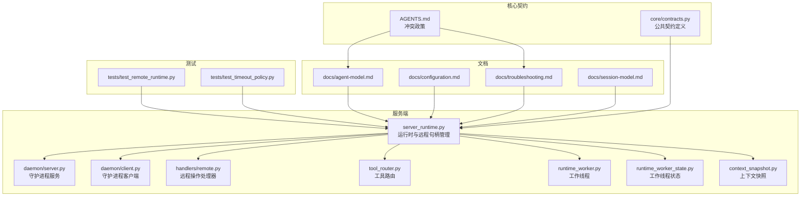
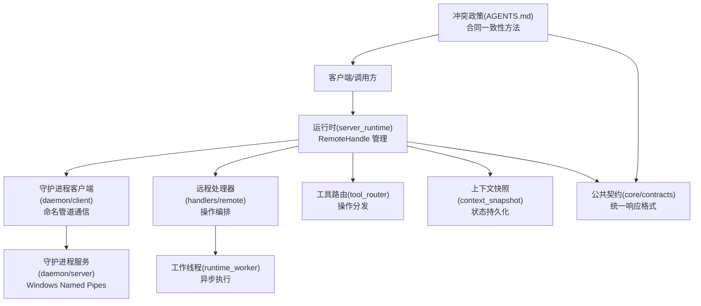
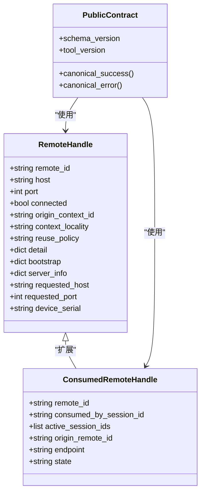
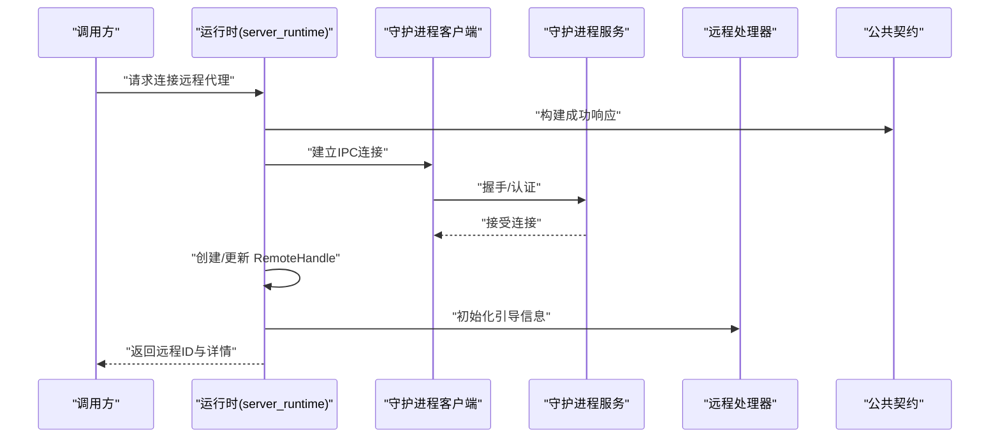
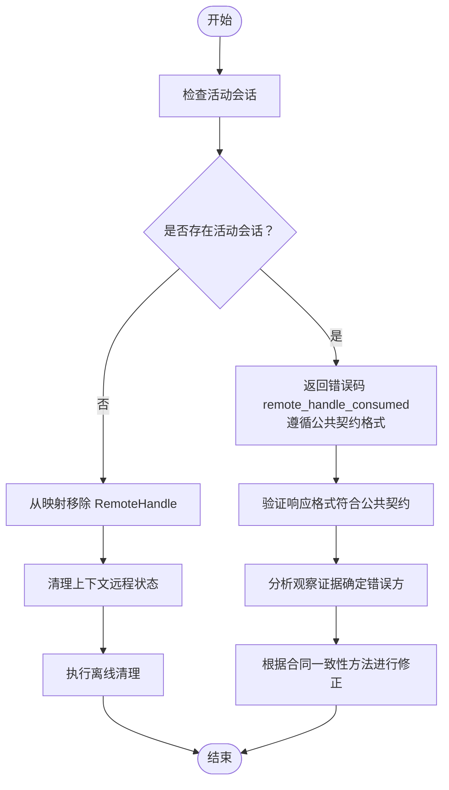
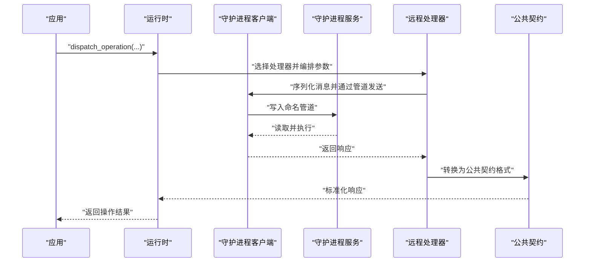
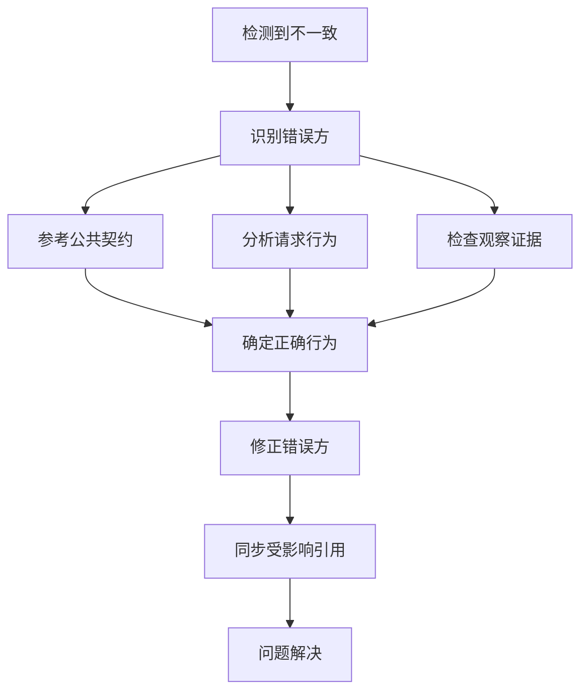
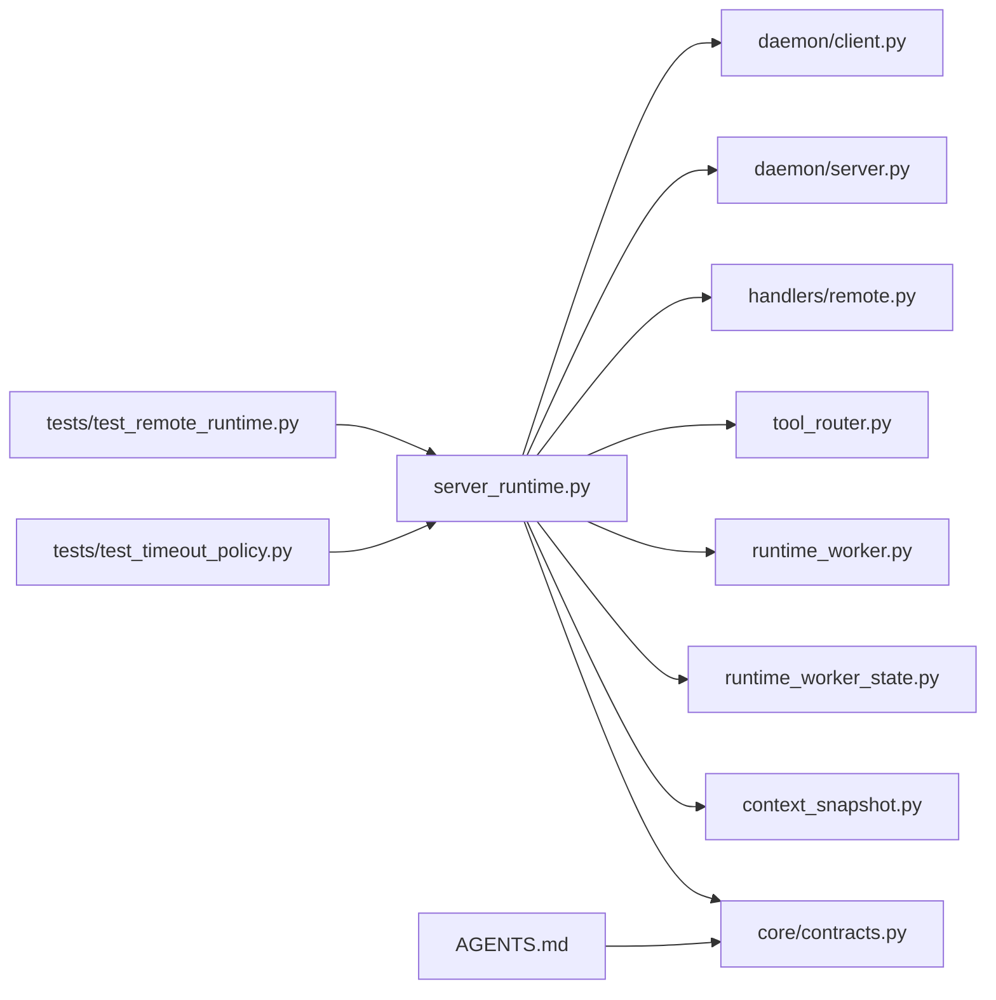
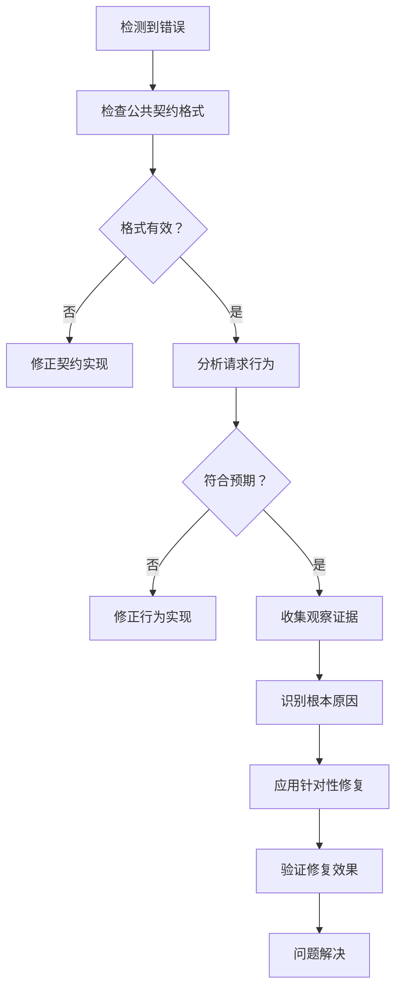

# 代理系统

<cite>
**本文引用的文件**
- [rdx/server_runtime.py](file://rdx/server_runtime.py)
- [rdx/daemon/client.py](file://rdx/daemon/client.py)
- [rdx/daemon/server.py](file://rdx/daemon/server.py)
- [rdx/models.py](file://rdx/models.py)
- [rdx/handlers/remote.py](file://rdx/handlers/remote.py)
- [rdx/tool_router.py](file://rdx/tool_router.py)
- [rdx/runtime_worker.py](file://rdx/runtime_worker.py)
- [rdx/runtime_worker_state.py](file://rdx/runtime_worker_state.py)
- [rdx/context_snapshot.py](file://rdx/context_snapshot.py)
- [tests/test_remote_runtime.py](file://tests/test_remote_runtime.py)
- [tests/test_timeout_policy.py](file://tests/test_timeout_policy.py)
- [docs/agent-model.md](file://docs/agent-model.md)
- [docs/configuration.md](file://docs/configuration.md)
- [docs/troubleshooting.md](file://docs/troubleshooting.md)
- [docs/session-model.md](file://docs/session-model.md)
- [rdx/core/contracts.py](file://rdx/core/contracts.py)
- [AGENTS.md](file://AGENTS.md)
</cite>

## 更新摘要
**变更内容**
- 更新了冲突政策章节，反映从严格同步方法到合同一致性方法的转变
- 增强了远程句柄生命周期管理说明，特别是 remote_handle_consumed 的处理流程
- 完善了故障排查指南，包含新的错误处理策略
- 更新了最佳实践部分，强调基于公共契约的调试方法

## 目录
1. [简介](#简介)
2. [项目结构](#项目结构)
3. [核心组件](#核心组件)
4. [架构总览](#架构总览)
5. [详细组件分析](#详细组件分析)
6. [依赖关系分析](#依赖关系分析)
7. [性能考量](#性能考量)
8. [故障排查指南](#故障排查指南)
9. [结论](#结论)
10. [附录](#附录)

## 简介
本文件面向"代理系统"的设计与实现，聚焦以下目标：
- 深入解释代理模型的设计原理与架构模式
- 详述代理与守护进程的交互机制（IPC 协议与消息格式）
- 解释代理的注册、发现与生命周期管理
- 覆盖远程代理处理与句柄管理，重点阐述 remote_handle_consumed 的概念与处理流程
- 提供代理集成最佳实践与常见问题解决方案
- 给出代理配置与故障排除的实用指南

**更新** 基于最新的冲突政策重构，现在采用合同一致性方法，通过公共契约、请求行为和观察证据来识别错误方并相应修正，而非要求同时修复文档和实现的严格方式。

## 项目结构
该仓库采用模块化分层组织：服务端运行时与守护进程位于 rdx 包内；代理相关逻辑集中在运行时与处理器模块中；测试用例覆盖远程代理生命周期与超时策略等关键场景。

**图表来源**
- [rdx/server_runtime.py](file://rdx/server_runtime.py)
- [rdx/daemon/server.py](file://rdx/daemon/server.py)
- [rdx/daemon/client.py](file://rdx/daemon/client.py)
- [rdx/handlers/remote.py](file://rdx/handlers/remote.py)
- [rdx/tool_router.py](file://rdx/tool_router.py)
- [rdx/runtime_worker.py](file://rdx/runtime_worker.py)
- [rdx/runtime_worker_state.py](file://rdx/runtime_worker_state.py)
- [rdx/context_snapshot.py](file://rdx/context_snapshot.py)
- [tests/test_remote_runtime.py](file://tests/test_remote_runtime.py)
- [tests/test_timeout_policy.py](file://tests/test_timeout_policy.py)
- [docs/agent-model.md](file://docs/agent-model.md)
- [docs/configuration.md](file://docs/configuration.md)
- [docs/troubleshooting.md](file://docs/troubleshooting.md)
- [docs/session-model.md](file://docs/session-model.md)
- [rdx/core/contracts.py](file://rdx/core/contracts.py)
- [AGENTS.md](file://AGENTS.md)

**章节来源**
- [rdx/server_runtime.py](file://rdx/server_runtime.py)
- [rdx/daemon/server.py](file://rdx/daemon/server.py)
- [rdx/daemon/client.py](file://rdx/daemon/client.py)
- [rdx/handlers/remote.py](file://rdx/handlers/remote.py)
- [rdx/tool_router.py](file://rdx/tool_router.py)
- [rdx/runtime_worker.py](file://rdx/runtime_worker.py)
- [rdx/runtime_worker_state.py](file://rdx/runtime_worker_state.py)
- [rdx/context_snapshot.py](file://rdx/context_snapshot.py)
- [tests/test_remote_runtime.py](file://tests/test_remote_runtime.py)
- [tests/test_timeout_policy.py](file://tests/test_timeout_policy.py)
- [docs/agent-model.md](file://docs/agent-model.md)
- [docs/configuration.md](file://docs/configuration.md)
- [docs/troubleshooting.md](file://docs/troubleshooting.md)
- [docs/session-model.md](file://docs/session-model.md)
- [rdx/core/contracts.py](file://rdx/core/contracts.py)
- [AGENTS.md](file://AGENTS.md)

## 核心组件
- 运行时与远程句柄管理：负责远程代理的注册、连接、会话绑定、生命周期维护与清理。
- 守护进程服务与客户端：提供基于命名管道（Windows）的 IPC 通道，承载代理与宿主之间的消息传递。
- 远程处理器：封装对远端工具或设备的操作请求与响应。
- 工具路由：根据操作类型选择合适的处理器与执行路径。
- 工作线程与状态：在后台线程中执行耗时任务，并持久化工作状态。
- 上下文快照：记录远程代理在特定上下文中的状态与作用域信息。
- 公共契约：定义统一的响应格式和错误处理标准。

**更新** 新增公共契约组件，作为合同一致性方法的基础，确保文档、实现和测试之间的一致性。

**章节来源**
- [rdx/server_runtime.py](file://rdx/server_runtime.py)
- [rdx/daemon/server.py](file://rdx/daemon/server.py)
- [rdx/daemon/client.py](file://rdx/daemon/client.py)
- [rdx/handlers/remote.py](file://rdx/handlers/remote.py)
- [rdx/tool_router.py](file://rdx/tool_router.py)
- [rdx/runtime_worker.py](file://rdx/runtime_worker.py)
- [rdx/runtime_worker_state.py](file://rdx/runtime_worker_state.py)
- [rdx/context_snapshot.py](file://rdx/context_snapshot.py)
- [rdx/core/contracts.py](file://rdx/core/contracts.py)

## 架构总览
代理系统以"运行时"为中心，围绕 RemoteHandle 建立远程资源的统一抽象。运行时通过守护进程客户端与远端建立连接，借助工具路由将操作分发到远程处理器，最终完成对远端设备或工具的控制。

**图表来源**
- [rdx/server_runtime.py](file://rdx/server_runtime.py)
- [rdx/daemon/client.py](file://rdx/daemon/client.py)
- [rdx/daemon/server.py](file://rdx/daemon/server.py)
- [rdx/handlers/remote.py](file://rdx/handlers/remote.py)
- [rdx/tool_router.py](file://rdx/tool_router.py)
- [rdx/runtime_worker.py](file://rdx/runtime_worker.py)
- [rdx/context_snapshot.py](file://rdx/context_snapshot.py)
- [rdx/core/contracts.py](file://rdx/core/contracts.py)
- [AGENTS.md](file://AGENTS.md)

## 详细组件分析

### 远程句柄模型与生命周期
RemoteHandle 是远程代理的统一抽象，包含远程 ID、主机、端口、连接状态、上下文本地性、复用策略、传输细节、服务器信息、引导详情等字段。ConsumedRemoteHandle 表示已被消费（占用）的远程句柄，通常用于标记已绑定到会话的状态。

**图表来源**
- [rdx/server_runtime.py](file://rdx/server_runtime.py)
- [rdx/core/contracts.py](file://rdx/core/contracts.py)

**章节来源**
- [rdx/server_runtime.py](file://rdx/server_runtime.py)
- [rdx/core/contracts.py](file://rdx/core/contracts.py)

### 注册与发现流程
- 注册：运行时在建立连接后，将 RemoteHandle 写入内部映射，并更新上下文快照，标记为"已同步"。
- 发现：通过上下文快照与远程映射查询已存在的远程句柄；若缺失则尝试从快照重建。
- 会话绑定：将远程句柄与活动会话关联，记录 lease 信息以便后续回收。

**图表来源**
- [rdx/server_runtime.py](file://rdx/server_runtime.py)
- [rdx/daemon/client.py](file://rdx/daemon/client.py)
- [rdx/daemon/server.py](file://rdx/daemon/server.py)
- [rdx/handlers/remote.py](file://rdx/handlers/remote.py)
- [rdx/core/contracts.py](file://rdx/core/contracts.py)

**章节来源**
- [rdx/server_runtime.py](file://rdx/server_runtime.py)
- [rdx/daemon/client.py](file://rdx/daemon/client.py)
- [rdx/daemon/server.py](file://rdx/daemon/server.py)
- [rdx/handlers/remote.py](file://rdx/handlers/remote.py)
- [rdx/core/contracts.py](file://rdx/core/contracts.py)

### 生命周期管理与 remote_handle_consumed
- 消费（consumed）：当远程句柄被某个会话占用时，其状态进入 consumed，表示不可再被其他会话直接使用。
- 回收（disconnect）：断开前检查是否仍有活动会话占用；若存在则拒绝断开并返回错误码 remote_handle_consumed；否则移除映射并清理上下文状态。
- 快照与恢复：通过上下文快照保存远程句柄的作用域与状态，支持重启后的恢复。

**更新** 基于新的冲突政策，当出现 remote_handle_consumed 错误时，应首先检查公共契约定义的响应格式，然后验证请求行为是否符合预期，最后通过观察证据确定错误方并进行相应修正。

**图表来源**
- [rdx/server_runtime.py](file://rdx/server_runtime.py)
- [rdx/context_snapshot.py](file://rdx/context_snapshot.py)
- [tests/test_remote_runtime.py](file://tests/test_remote_runtime.py)
- [rdx/core/contracts.py](file://rdx/core/contracts.py)
- [AGENTS.md](file://AGENTS.md)

**章节来源**
- [rdx/server_runtime.py](file://rdx/server_runtime.py)
- [rdx/context_snapshot.py](file://rdx/context_snapshot.py)
- [tests/test_remote_runtime.py](file://tests/test_remote_runtime.py)
- [rdx/core/contracts.py](file://rdx/core/contracts.py)
- [AGENTS.md](file://AGENTS.md)

### 进程间通信协议与消息格式
- 传输层：基于 Windows 命名管道的守护进程服务与客户端实现 IPC。
- 认证与握手：客户端在连接时携带认证密钥，服务端接受连接并建立会话标识。
- 操作编排：运行时通过工具路由将操作分发至远程处理器，处理器构造请求并经由守护进程客户端发送到远端，再由远端服务执行并回传结果。

**更新** 所有 IPC 消息现在遵循公共契约定义的统一响应格式，包括 schema_version、tool_version、result_kind、ok、data、artifacts、error、meta、projections 等字段。

**图表来源**
- [rdx/daemon/client.py](file://rdx/daemon/client.py)
- [rdx/daemon/server.py](file://rdx/daemon/server.py)
- [rdx/tool_router.py](file://rdx/tool_router.py)
- [rdx/handlers/remote.py](file://rdx/handlers/remote.py)
- [rdx/core/contracts.py](file://rdx/core/contracts.py)

**章节来源**
- [rdx/daemon/client.py](file://rdx/daemon/client.py)
- [rdx/daemon/server.py](file://rdx/daemon/server.py)
- [rdx/tool_router.py](file://rdx/tool_router.py)
- [rdx/handlers/remote.py](file://rdx/handlers/remote.py)
- [rdx/core/contracts.py](file://rdx/core/contracts.py)

### 远程代理处理与句柄管理
- 句柄复用策略：根据 context_locality 与 reuse_policy 控制连接复用行为。
- 引导与信息：bootstrap 与 server_info 记录远端环境与设备信息，便于诊断与重连。
- 设备序列号：device_serial 用于区分多设备场景下的句柄归属。

**更新** 句柄管理现在遵循合同一致性方法，当出现不一致时，优先参考公共契约定义的行为，然后通过请求行为和观察证据来确定正确的处理方式。

**章节来源**
- [rdx/server_runtime.py](file://rdx/server_runtime.py)
- [rdx/models.py](file://rdx/models.py)
- [rdx/core/contracts.py](file://rdx/core/contracts.py)
- [AGENTS.md](file://AGENTS.md)

### 冲突政策与合同一致性方法
**新增章节** 基于 AGENTS.md 中的最新冲突政策，系统现在采用合同一致性方法来处理文档、实现和测试之间的不一致问题。

**图表来源**
- [AGENTS.md](file://AGENTS.md)
- [rdx/core/contracts.py](file://rdx/core/contracts.py)

**章节来源**
- [AGENTS.md](file://AGENTS.md)
- [rdx/core/contracts.py](file://rdx/core/contracts.py)

## 依赖关系分析
- 运行时依赖守护进程客户端/服务进行 IPC；依赖工具路由进行操作分发；依赖远程处理器执行具体动作。
- 测试用例覆盖远程句柄生命周期与超时策略，确保在异常场景下仍能正确返回错误码与状态。
- 公共契约为所有组件提供统一的响应格式标准。

**更新** 新增公共契约依赖，确保所有组件遵循一致的接口规范。

**图表来源**
- [rdx/server_runtime.py](file://rdx/server_runtime.py)
- [rdx/daemon/client.py](file://rdx/daemon/client.py)
- [rdx/daemon/server.py](file://rdx/daemon/server.py)
- [rdx/handlers/remote.py](file://rdx/handlers/remote.py)
- [rdx/tool_router.py](file://rdx/tool_router.py)
- [rdx/runtime_worker.py](file://rdx/runtime_worker.py)
- [rdx/runtime_worker_state.py](file://rdx/runtime_worker_state.py)
- [rdx/context_snapshot.py](file://rdx/context_snapshot.py)
- [tests/test_remote_runtime.py](file://tests/test_remote_runtime.py)
- [tests/test_timeout_policy.py](file://tests/test_timeout_policy.py)
- [rdx/core/contracts.py](file://rdx/core/contracts.py)
- [AGENTS.md](file://AGENTS.md)

**章节来源**
- [rdx/server_runtime.py](file://rdx/server_runtime.py)
- [rdx/daemon/client.py](file://rdx/daemon/client.py)
- [rdx/daemon/server.py](file://rdx/daemon/server.py)
- [rdx/handlers/remote.py](file://rdx/handlers/remote.py)
- [rdx/tool_router.py](file://rdx/tool_router.py)
- [rdx/runtime_worker.py](file://rdx/runtime_worker.py)
- [rdx/runtime_worker_state.py](file://rdx/runtime_worker_state.py)
- [rdx/context_snapshot.py](file://rdx/context_snapshot.py)
- [tests/test_remote_runtime.py](file://tests/test_remote_runtime.py)
- [tests/test_timeout_policy.py](file://tests/test_timeout_policy.py)
- [rdx/core/contracts.py](file://rdx/core/contracts.py)
- [AGENTS.md](file://AGENTS.md)

## 性能考量
- 连接复用：合理设置 reuse_policy 与 context_locality，避免频繁重建连接带来的延迟。
- 异步执行：通过工作线程与工具路由实现异步处理，减少阻塞。
- 超时策略：结合超时策略测试用例，确保在网络不稳定时能及时失败并释放资源。
- 日志与快照：利用上下文快照与运行日志定位性能瓶颈与异常路径。
- 契约优化：通过公共契约减少序列化开销，提高 IPC 效率。

**更新** 新增契约优化考虑，利用标准化的响应格式减少数据传输开销。

## 故障排查指南
- 常见错误码
  - remote_handle_consumed：远程句柄仍被活动会话占用，无法断开。
  - remote_not_found：未知远程ID或句柄未注册。
  - remote_handle_in_use：远程句柄正被会话租用。
  - preview_session_mismatch：预览会话不匹配。
  - stale_session_requires_restart：需要重启以清理陈旧会话。

**更新** 新增基于合同一致性方法的故障排查流程：

**图表来源**
- [rdx/core/contracts.py](file://rdx/core/contracts.py)
- [AGENTS.md](file://AGENTS.md)

**章节来源**
- [rdx/server_runtime.py](file://rdx/server_runtime.py)
- [tests/test_remote_runtime.py](file://tests/test_remote_runtime.py)
- [tests/test_timeout_policy.py](file://tests/test_timeout_policy.py)
- [docs/troubleshooting.md](file://docs/troubleshooting.md)
- [rdx/core/contracts.py](file://rdx/core/contracts.py)
- [AGENTS.md](file://AGENTS.md)

## 结论
代理系统通过运行时对 RemoteHandle 的集中管理，结合守护进程提供的 IPC 能力与工具路由的分发机制，实现了对远程设备与工具的统一接入与生命周期管控。remote_handle_consumed 作为关键状态信号，确保了句柄使用的安全性与一致性。配合上下文快照与异步工作线程，系统在复杂场景下仍具备良好的稳定性与可维护性。

**更新** 通过引入合同一致性方法，系统现在能够更有效地处理文档、实现和测试之间的不一致问题，通过公共契约、请求行为和观察证据来识别错误方并进行相应修正，提高了系统的可维护性和可靠性。

## 附录
- 最佳实践
  - 在断开前先查询活动会话，避免 remote_handle_consumed 错误。
  - 合理设置 context_locality 与 reuse_policy，平衡性能与隔离性。
  - 使用上下文快照记录关键状态，便于故障恢复与审计。
  - 遵循公共契约定义的错误处理格式，确保响应一致性。
  - 当出现不一致时，优先参考公共契约，然后通过请求行为和观察证据确定正确处理方式。

**更新** 新增合同一致性最佳实践，指导如何处理文档、实现和测试之间的不一致问题。

- 配置参考
  - 参考配置文档了解传输、认证与超时等参数设置。
- 文档索引
  - 代理模型与会话模型详见相关文档。
  - 冲突政策详见 AGENTS.md。

**章节来源**
- [docs/agent-model.md](file://docs/agent-model.md)
- [docs/configuration.md](file://docs/configuration.md)
- [docs/troubleshooting.md](file://docs/troubleshooting.md)
- [docs/session-model.md](file://docs/session-model.md)
- [AGENTS.md](file://AGENTS.md)
- [rdx/core/contracts.py](file://rdx/core/contracts.py)