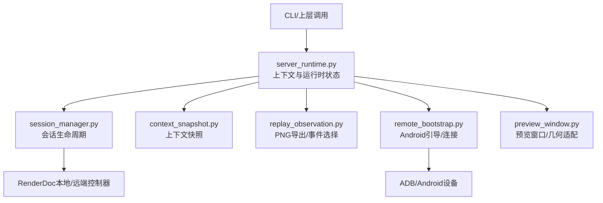
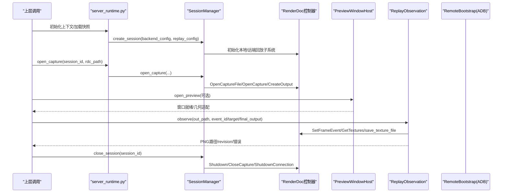
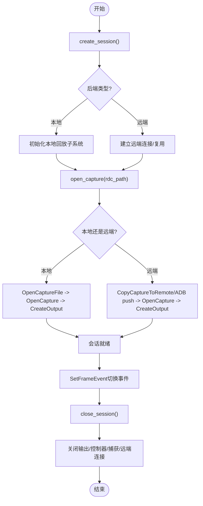
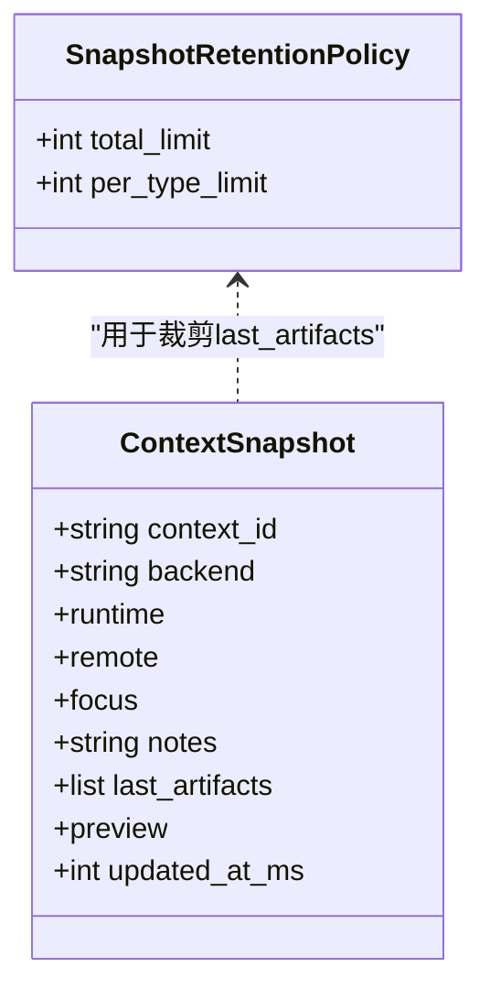
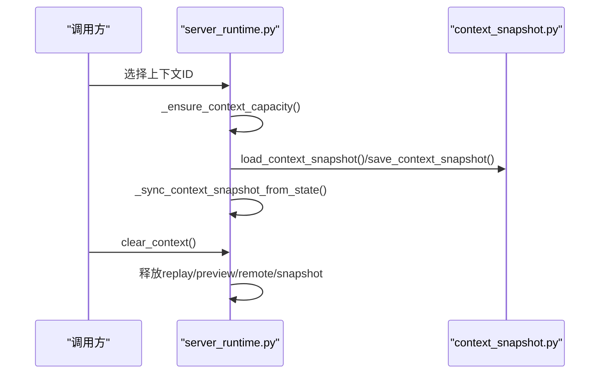
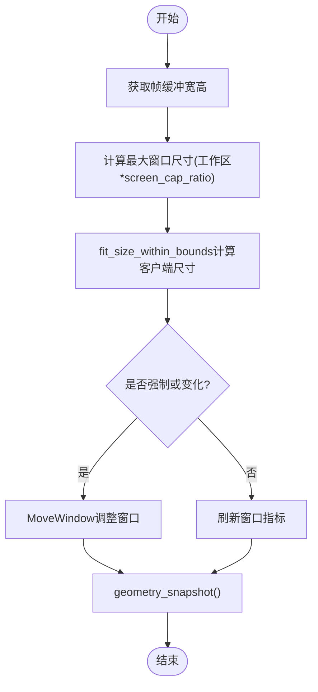
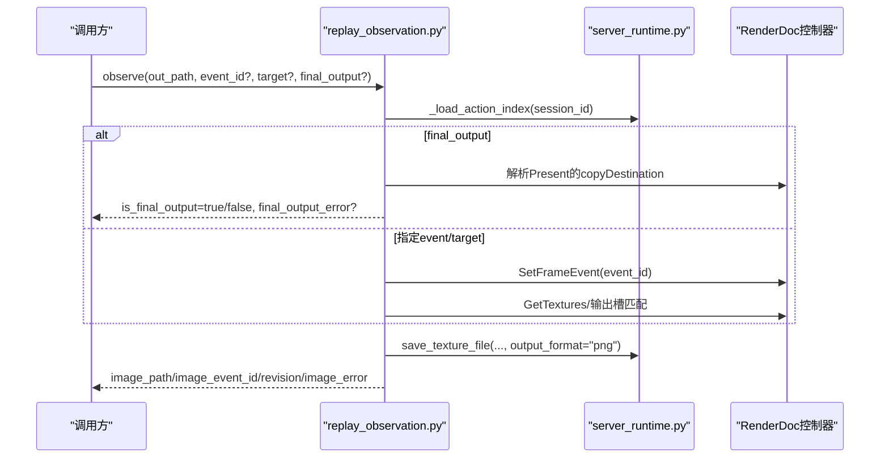
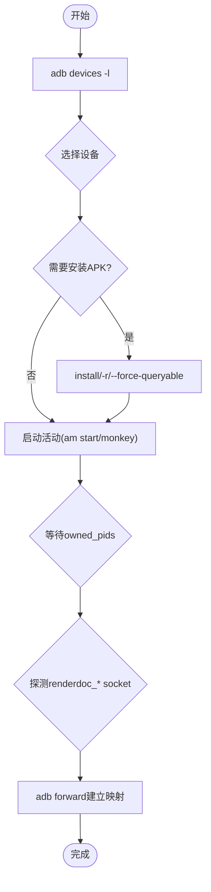
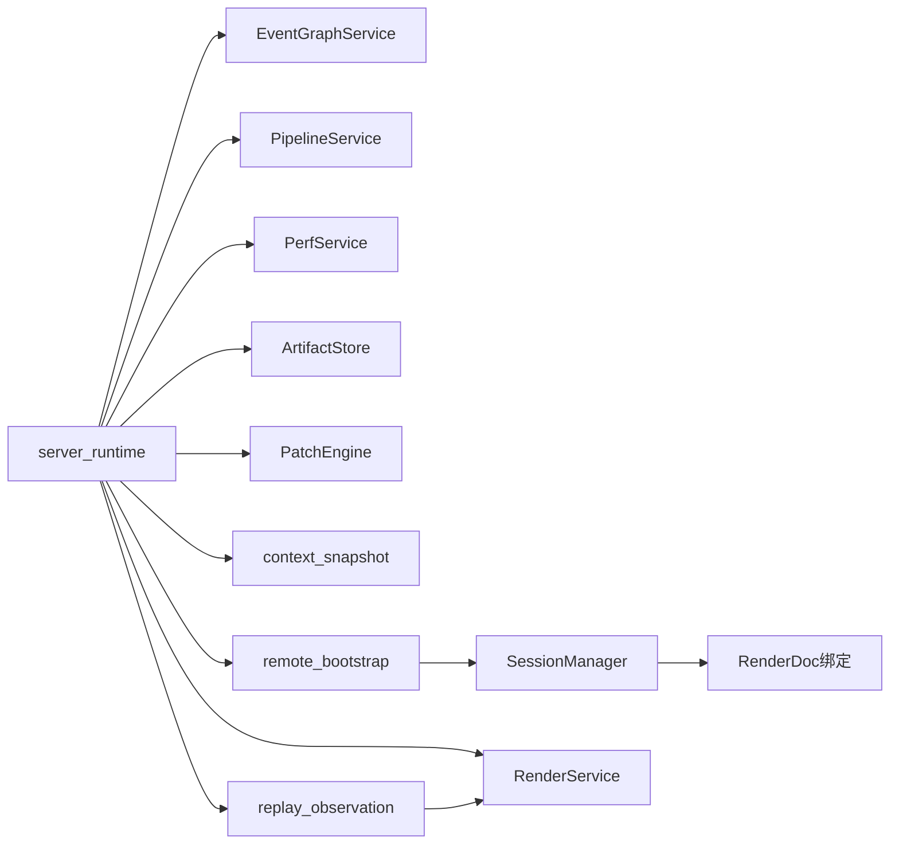

# 会话模型

<cite>
**本文引用的文件**
- [session_manager.py](file://rdc_tool/core/session_manager.py)
- [session.py](file://rdc_tool/handlers/session.py)
- [context_snapshot.py](file://rdc_tool/context_snapshot.py)
- [replay_observation.py](file://rdc_tool/replay_observation.py)
- [server_runtime.py](file://rdc_tool/server_runtime.py)
- [remote_bootstrap.py](file://rdc_tool/remote_bootstrap.py)
- [preview_window.py](file://rdc_tool/preview_window.py)
- [models.py](file://rdc_tool/models.py)
- [runtime_worker.py](file://rdc_tool/runtime_worker.py)
- [session-model.md](file://docs/session-model.md)
</cite>

## 目录
1. [简介](#简介)
2. [项目结构](#项目结构)
3. [核心组件](#核心组件)
4. [架构总览](#架构总览)
5. [详细组件分析](#详细组件分析)
6. [依赖关系分析](#依赖关系分析)
7. [性能考虑](#性能考虑)
8. [故障排查指南](#故障排查指南)
9. [结论](#结论)
10. [附录：API调用模式与示例路径](#附录api调用模式与示例路径)

## 简介
本文件系统性阐述 RDC-Tool 的会话模型，聚焦以下目标：
- Replay 会话的生命周期管理：创建、打开捕获、状态切换、销毁与资源清理。
- 上下文快照机制：保存和恢复运行时状态，支持多上下文隔离。
- Daemon context 的概念与使用方式：上下文隔离、占用限制、清理策略。
- 预览状态管理：帧缓冲预览、窗口适配、显示区域计算。
- 嵌入式回放观察机制：PNG 导出、事件选择、目标指定、最终输出判定。
- Android 辅助工具的会话生命周期：连接管理、进程所有权、资源清理。
- 提供具体代码示例与 API 调用模式，帮助开发者理解内部实现。

## 项目结构
RDC-Tool 将“会话”抽象为跨本地/远端的 RenderDoc 回放控制器实例，并通过上下文（daemon context）进行隔离。关键模块职责如下：
- rdc_tool/core/session_manager.py：会话管理器，封装本地/远端渲染后端初始化、捕获打开、无头输出创建、清理等。
- rdc_tool/server_runtime.py：运行时服务，维护上下文状态、会话映射、预览绑定、远程句柄、快照同步等。
- rdc_tool/context_snapshot.py：上下文快照持久化与归一化，支持用户字段与运行时字段分离、保留策略。
- rdc_tool/replay_observation.py：嵌入式回放观察，导出 PNG、选择事件与目标、判定最终输出。
- rdc_tool/remote_bootstrap.py：Android 辅助工具引导，设备发现、APK 安装、端口转发、进程所有权与清理。
- rdc_tool/preview_window.py：Windows 预览窗口宿主，帧缓冲几何适配、窗口尺寸调整、消息循环。
- rdc_tool/models.py：会话能力、捕获信息、事件树等数据模型。
- rdc_tool/runtime_worker.py：独立工作进程，维持一个事件循环与单线程执行器以保障原生线程亲和性。
- docs/session-model.md：官方会话模型文档，定义行为契约与约束。

**图表来源**
- [server_runtime.py:196-239](file://rdc_tool/server_runtime.py#L196-L239)
- [session_manager.py:148-207](file://rdc_tool/core/session_manager.py#L148-L207)
- [context_snapshot.py:242-279](file://rdc_tool/context_snapshot.py#L242-L279)
- [replay_observation.py:40-147](file://rdc_tool/replay_observation.py#L40-L147)
- [remote_bootstrap.py:495-699](file://rdc_tool/remote_bootstrap.py#L495-L699)
- [preview_window.py:192-301](file://rdc_tool/preview_window.py#L192-L301)

**章节来源**
- [session_manager.py:148-207](file://rdc_tool/core/session_manager.py#L148-L207)
- [server_runtime.py:196-239](file://rdc_tool/server_runtime.py#L196-L239)
- [context_snapshot.py:242-279](file://rdc_tool/context_snapshot.py#L242-L279)
- [replay_observation.py:40-147](file://rdc_tool/replay_observation.py#L40-L147)
- [remote_bootstrap.py:495-699](file://rdc_tool/remote_bootstrap.py#L495-L699)
- [preview_window.py:192-301](file://rdc_tool/preview_window.py#L192-L301)
- [models.py:128-157](file://rdc_tool/models.py#L128-L157)
- [runtime_worker.py:65-167](file://rdc_tool/runtime_worker.py#L65-L167)
- [session-model.md:11-82](file://docs/session-model.md#L11-L82)

## 核心组件
- SessionManager：单例会话管理器，负责创建会话、打开捕获、获取控制器/输出、关闭会话与清理。
- RuntimeState：运行时状态容器，维护 captures、replays、remotes、previews、shader debug、快照等。
- ContextSnapshot：上下文快照持久化，区分用户可更新字段与运行时拥有字段，支持保留策略与原子写入。
- ReplayObservation：嵌入式观察，导出 PNG、选择事件与目标、判定最终输出、返回 revision 与错误信息。
- RemoteBootstrap：Android 辅助工具引导，设备选择、APK 安装、配置推送、活动启动、端口转发、清理。
- PreviewWindowHost：Windows 预览窗口，帧缓冲几何适配、窗口尺寸自动调整、消息循环。

**章节来源**
- [session_manager.py:118-207](file://rdc_tool/core/session_manager.py#L118-L207)
- [server_runtime.py:196-239](file://rdc_tool/server_runtime.py#L196-L239)
- [context_snapshot.py:39-47](file://rdc_tool/context_snapshot.py#L39-L47)
- [replay_observation.py:16-37](file://rdc_tool/replay_observation.py#L16-L37)
- [remote_bootstrap.py:83-121](file://rdc_tool/remote_bootstrap.py#L83-L121)
- [preview_window.py:192-301](file://rdc_tool/preview_window.py#L192-L301)

## 架构总览
下图展示从 CLI/上层调用到渲染后端的整体流程，包括上下文隔离、会话生命周期、预览与观察、Android 辅助工具。

**图表来源**
- [session_manager.py:175-259](file://rdc_tool/core/session_manager.py#L175-L259)
- [replay_observation.py:40-147](file://rdc_tool/replay_observation.py#L40-L147)
- [preview_window.py:221-301](file://rdc_tool/preview_window.py#L221-L301)
- [server_runtime.py:450-531](file://rdc_tool/server_runtime.py#L450-L531)

## 详细组件分析

### Replay 会话生命周期管理
- 创建会话：根据 backend_config 判断 local/remote；本地需初始化回放子系统，远端建立连接或复用已有 remote server。
- 打开捕获：本地通过 OpenCaptureFile + OpenCapture；远端通过 CopyCaptureToRemote 或 ADB push，再 OpenCapture。
- 状态切换：SetFrameEvent 切换帧/事件；active_event_id 与 frame_index 在上下文状态中记录。
- 销毁会话：关闭输出、控制器、捕获文件、远端连接；若最后一个本地会话结束则关闭回放子系统。

**图表来源**
- [session_manager.py:175-259](file://rdc_tool/core/session_manager.py#L175-L259)
- [session_manager.py:301-441](file://rdc_tool/core/session_manager.py#L301-L441)
- [session_manager.py:509-569](file://rdc_tool/core/session_manager.py#L509-L569)

**章节来源**
- [session_manager.py:175-259](file://rdc_tool/core/session_manager.py#L175-L259)
- [session_manager.py:301-441](file://rdc_tool/core/session_manager.py#L301-L441)
- [session_manager.py:509-569](file://rdc_tool/core/session_manager.py#L509-L569)

### 上下文快照机制
- 快照结构：包含 runtime、remote、focus、notes、last_artifacts、preview、updated_at_ms 等。
- 字段权限：USER_CONTEXT_KEYS 允许用户更新；RUNTIME_OWNED_KEYS 由运行时拥有，禁止手动修改。
- 持久化：按上下文 ID 生成文件名，使用锁文件与原子写入保证并发安全；支持保留策略裁剪 last_artifacts。
- 归一化：normalize_context_snapshot 对输入进行严格校验与默认值填充；load/save/clear 提供完整操作。

**图表来源**
- [context_snapshot.py:39-47](file://rdc_tool/context_snapshot.py#L39-L47)
- [context_snapshot.py:242-279](file://rdc_tool/context_snapshot.py#L242-L279)
- [context_snapshot.py:367-444](file://rdc_tool/context_snapshot.py#L367-L444)

**章节来源**
- [context_snapshot.py:18-35](file://rdc_tool/context_snapshot.py#L18-L35)
- [context_snapshot.py:214-279](file://rdc_tool/context_snapshot.py#L214-L279)
- [context_snapshot.py:367-444](file://rdc_tool/context_snapshot.py#L367-L444)
- [context_snapshot.py:447-541](file://rdc_tool/context_snapshot.py#L447-L541)

### 多上下文隔离与 daemon context
- 上下文 ID：normalize_context_id 将空或 default 统一为 "default"，其他上下文按规范化 ID 隔离。
- 容量限制：_ensure_context_capacity 检查占用上下文数量，超过 max_contexts 抛出错误。
- 状态同步：_sync_context_snapshot_from_state 将当前 session/capture 信息同步至快照；_store_context_state 持久化。
- 清理：clear_context 释放该上下文的 replay、preview、remote、snapshot 状态，不终止 daemon/worker。

**图表来源**
- [server_runtime.py:413-468](file://rdc_tool/server_runtime.py#L413-L468)
- [server_runtime.py:764-800](file://rdc_tool/server_runtime.py#L764-L800)
- [context_snapshot.py:184-220](file://rdc_tool/context_snapshot.py#L184-L220)

**章节来源**
- [server_runtime.py:413-468](file://rdc_tool/server_runtime.py#L413-L468)
- [server_runtime.py:764-800](file://rdc_tool/server_runtime.py#L764-L800)
- [context_snapshot.py:184-220](file://rdc_tool/context_snapshot.py#L184-L220)

### 预览状态管理与窗口适配
- 预览状态：enabled/state/view_mode/bound_session_id/bound_capture_file_id/bound_event_id/backend/display/updated_at_ms。
- 显示区域：framebuffer_extent、viewport_rect、scissor_rect、effective_region_rect、window_rect、fit_mode/screen_cap_ratio。
- 窗口适配：PreviewWindowHost.apply_framebuffer_geometry 根据屏幕工作区与缩放比例计算客户端尺寸并调整窗口。
- 几何计算：_clip_rect_to_extent/_intersect_rects 确保 viewport/scissor 有效交集。

**图表来源**
- [preview_window.py:91-129](file://rdc_tool/preview_window.py#L91-L129)
- [preview_window.py:274-301](file://rdc_tool/preview_window.py#L274-L301)
- [server_runtime.py:562-621](file://rdc_tool/server_runtime.py#L562-L621)

**章节来源**
- [preview_window.py:192-301](file://rdc_tool/preview_window.py#L192-L301)
- [server_runtime.py:471-531](file://rdc_tool/server_runtime.py#L471-L531)
- [server_runtime.py:562-621](file://rdc_tool/server_runtime.py#L562-L621)

### 嵌入式回放观察机制
- 事件索引：get_replay_events 返回完整 action 索引，不改变 active event。
- 目标选择：target 可为 texture_id 或 rt_index；若无颜色输出或缺失目标返回相应错误。
- 最终输出：final_output=true 时解析 Present 的 copyDestination 唯一 SwapBuffer；不可与 event_id/target 组合。
- PNG 导出：save_texture_file 输出 PNG；失败时删除不完整文件并返回 image_error。
- Revision：每次观察增加 revision，消费者需跟踪绑定生成。

**图表来源**
- [replay_observation.py:16-37](file://rdc_tool/replay_observation.py#L16-L37)
- [replay_observation.py:40-147](file://rdc_tool/replay_observation.py#L40-L147)

**章节来源**
- [replay_observation.py:40-147](file://rdc_tool/replay_observation.py#L40-L147)
- [session-model.md:19-67](file://docs/session-model.md#L19-L67)

### Android 辅助工具的会话生命周期
- 设备发现：adb devices -l 解析设备列表，选择可用设备或报错。
- APK 安装：尝试安装/升级/强制替换；记录 install_mode/install_reason/uninstalled_existing。
- 活动启动：am start 或 monkey 启动 Loader；等待 owned_pids 确认进程存在。
- 端口转发：探测 renderdoc_* unix socket，建立 adb forward 映射。
- 清理：移除 forward、停止 activity、删除本地配置；所有权变更拒绝危险操作。

**图表来源**
- [remote_bootstrap.py:294-338](file://rdc_tool/remote_bootstrap.py#L294-L338)
- [remote_bootstrap.py:495-699](file://rdc_tool/remote_bootstrap.py#L495-L699)
- [remote_bootstrap.py:701-754](file://rdc_tool/remote_bootstrap.py#L701-L754)

**章节来源**
- [remote_bootstrap.py:495-699](file://rdc_tool/remote_bootstrap.py#L495-L699)
- [remote_bootstrap.py:701-754](file://rdc_tool/remote_bootstrap.py#L701-L754)
- [session-model.md:69-82](file://docs/session-model.md#L69-L82)

## 依赖关系分析
- SessionManager 依赖 RenderDoc Python 绑定，封装本地/远端差异。
- server_runtime 聚合多个服务：EventGraphService、RenderService、PipelineService、PerfService、ArtifactStore、PatchEngine。
- context_snapshot 与 server_runtime 双向协作：状态变更触发快照同步，快照加载影响上下文推断。
- replay_observation 依赖 server_runtime 提供的控制器与渲染服务。
- remote_bootstrap 与 session_manager 协作：Android 传输路径通过 ADB，远端复制回调进度。

**图表来源**
- [server_runtime.py:230-239](file://rdc_tool/server_runtime.py#L230-L239)
- [session_manager.py:27-31](file://rdc_tool/core/session_manager.py#L27-L31)
- [replay_observation.py:11-12](file://rdc_tool/replay_observation.py#L11-L12)
- [remote_bootstrap.py:17-18](file://rdc_tool/remote_bootstrap.py#L17-L18)

**章节来源**
- [server_runtime.py:230-239](file://rdc_tool/server_runtime.py#L230-L239)
- [session_manager.py:27-31](file://rdc_tool/core/session_manager.py#L27-L31)
- [replay_observation.py:11-12](file://rdc_tool/replay_observation.py#L11-L12)
- [remote_bootstrap.py:17-18](file://rdc_tool/remote_bootstrap.py#L17-L18)

## 性能考虑
- 单线程执行器：runtime_worker 使用 ThreadPoolExecutor(max_workers=1) 保持原生线程亲和，避免每请求创建事件循环导致原生上下文失效。
- 异步卸载：SessionManager._offload 将阻塞操作放入线程池，避免阻塞事件循环。
- 快照保留策略：last_artifacts 按 total_limit/per_type_limit 裁剪，减少磁盘与序列化开销。
- 预览窗口自适应：基于屏幕工作区与缩放比例计算窗口尺寸，避免过度重绘。
- 远端传输进度：CopyCaptureToRemote/ADB push 回调进度，便于 UI 反馈与超时控制。

[本节提供一般性指导，无需特定文件分析]

## 故障排查指南
- 会话冲突：create_session 已存在相同 session_id 抛出 session_conflict。
- 控制器缺失：open_capture 后 controller 为空抛出 controller_missing。
- 远端复制失败：remote_capture_copy_failed，details 包含 copy_error。
- 观察路径无效：out_path 必须为绝对 PNG 路径且不存在；final_output 不能与 event_id/target 组合。
- 目标缺失：no_color_output/missing_target/export_failure 分别对应无颜色输出、目标不存在、导出失败。
- Android 辅助工具：adb_unavailable/android_apk_install_failed/android_remote_launch_failed/android_helper_ownership_changed 等错误码。

**章节来源**
- [session_manager.py:185-224](file://rdc_tool/core/session_manager.py#L185-L224)
- [session_manager.py:399-441](file://rdc_tool/core/session_manager.py#L399-L441)
- [replay_observation.py:55-68](file://rdc_tool/replay_observation.py#L55-L68)
- [replay_observation.py:122-147](file://rdc_tool/replay_observation.py#L122-L147)
- [remote_bootstrap.py:156-202](file://rdc_tool/remote_bootstrap.py#L156-L202)
- [remote_bootstrap.py:661-699](file://rdc_tool/remote_bootstrap.py#L661-L699)

## 结论
RDC-Tool 的会话模型以 SessionManager 为核心，结合 server_runtime 的上下文隔离与快照机制，实现了本地/远端一致的 Replay 生命周期管理。预览与观察功能提供了灵活的可视化与取证能力，Android 辅助工具确保了移动端调试的端到端闭环。通过严格的错误分类、资源清理与保留策略，系统在稳定性与可维护性方面具备良好基础。

[本节总结性内容，无需特定文件分析]

## 附录：API调用模式与示例路径
- 创建会话：参考 [session_manager.py:175-207](file://rdc_tool/core/session_manager.py#L175-L207)
- 打开捕获：参考 [session_manager.py:208-251](file://rdc_tool/core/session_manager.py#L208-L251)
- 切换事件：参考 [replay_observation.py:91-94](file://rdc_tool/replay_observation.py#L91-L94)
- 导出 PNG：参考 [replay_observation.py:55-147](file://rdc_tool/replay_observation.py#L55-L147)
- 预览窗口：参考 [preview_window.py:221-301](file://rdc_tool/preview_window.py#L221-L301)
- Android 引导：参考 [remote_bootstrap.py:495-699](file://rdc_tool/remote_bootstrap.py#L495-L699)
- 上下文快照：参考 [context_snapshot.py:447-541](file://rdc_tool/context_snapshot.py#L447-L541)
- 工作进程：参考 [runtime_worker.py:65-167](file://rdc_tool/runtime_worker.py#L65-L167)

**章节来源**
- [session_manager.py:175-251](file://rdc_tool/core/session_manager.py#L175-L251)
- [replay_observation.py:55-147](file://rdc_tool/replay_observation.py#L55-L147)
- [preview_window.py:221-301](file://rdc_tool/preview_window.py#L221-L301)
- [remote_bootstrap.py:495-699](file://rdc_tool/remote_bootstrap.py#L495-L699)
- [context_snapshot.py:447-541](file://rdc_tool/context_snapshot.py#L447-L541)
- [runtime_worker.py:65-167](file://rdc_tool/runtime_worker.py#L65-L167)