# 会话模型

<cite>
**本文引用的文件**   
- [agent-model.md](file://docs/agent-model.md)
- [session-model.md](file://docs/session-model.md)
- [configuration.md](file://docs/configuration.md)
- [server_runtime.py](file://rdx/server_runtime.py)
- [context_snapshot.py](file://rdx/context_snapshot.py)
- [preview_window.py](file://rdx/preview_window.py)
- [daemon/client.py](file://rdx/daemon/client.py)
- [daemon/server.py](file://rdx/daemon/server.py)
- [runtime_state.py](file://rdx/runtime_state.py)
- [config.py](file://rdx/config.py)
- [test_context_snapshot.py](file://tests/test_context_snapshot.py)
- [test_runtime_recovery_and_discovery.py](file://tests/test_runtime_recovery_and_discovery.py)
- [test_preview.py](file://tests/test_preview.py)
- [test_cli_vfs.py](file://tests/test_cli_vfs.py)
- [test_daemon_client.py](file://tests/test_daemon_client.py)
- [run_cli.py](file://cli/run_cli.py)
- [rdx-native-agent-playbook.md](file://docs/rdx-native-agent-playbook.md)
</cite>

## 更新摘要
**所做更改**
- 更新了创建新命名空间的限制机制，现在由活跃占用（live occupancy）而非磁盘状态文件数量限制
- 改进了上下文容量管理的准确性和错误报告，包括详细的上下文占用信息
- 增强了重用现有命名空间不消耗额外槽位的说明
- 完善了守护进程上下文清理和资源管理流程
- 更新了故障排查指南中的上下文隔离问题处理

## 目录
1. [引言](#引言)
2. [项目结构](#项目结构)
3. [核心组件](#核心组件)
4. [架构总览](#架构总览)
5. [详细组件分析](#详细组件分析)
6. [依赖分析](#依赖分析)
7. [性能考虑](#性能考虑)
8. [故障排查指南](#故障排查指南)
9. [结论](#结论)
10. [附录](#附录)

## 引言
本文件系统化阐述 RDX 会话模型，重点围绕"会话定位器（session_locator）"的概念与组成，解释其与 .active.rdc、会话、帧和事件之间的关联；梳理会话状态查询与更新机制，覆盖 rdx context status 与 rdx context update 的使用；说明多会话并发与隔离策略；详解预览状态管理（预览几何体、视口/剪裁区域、窗口适配）；并给出会话创建、维护与销毁的完整流程。

**更新** 显著增强了显式守护进程上下文管理机制，通过 `--daemon-context <id>` 参数实现严格的上下文隔离，确保在多任务并发环境下状态不泄漏。新增了完整的上下文生命周期管理，包括状态文件隔离、清理机制和恢复流程。特别重要的是，创建了新的命名空间现在基于活跃占用（live occupancy）进行限制，而不是磁盘状态文件数量，这提高了资源管理的准确性。

## 项目结构
与会话模型直接相关的代码主要集中在运行时与上下文快照模块中，测试用例提供了行为验证与边界条件示例。日志报告展示了 CLI 命令与上下文快照的实际输出形态。

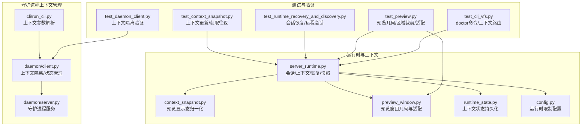

**图表来源**
- [client.py:576-832](file://rdx/daemon/client.py#L576-L832)
- [server.py:70-157](file://rdx/daemon/server.py#L70-L157)
- [run_cli.py:49-157](file://cli/run_cli.py#L49-L157)
- [server_runtime.py:6534-6733](file://rdx/server_runtime.py#L6534-L6733)
- [context_snapshot.py:95-171](file://rdx/context_snapshot.py#L95-L171)
- [preview_window.py:282-308](file://rdx/preview_window.py#L282-L308)
- [runtime_state.py:43-81](file://rdx/runtime_state.py#L43-L81)
- [config.py:172-185](file://rdx/config.py#L172-L185)

## 核心组件
- 会话定位器（session_locator）
  - 定义：用于快速定位当前上下文下"捕获文件路径 + 会话ID + 帧索引 + 活动事件ID"的投影对象。
  - 组成字段：rdc_path、session_id、frame_index、active_event_id。
  - 生成逻辑：在上下文快照构建时，基于当前会话、捕获文件与运行时信息进行投影。
- 上下文快照（Context Snapshot）
  - 包含 runtime、remote、focus、notes、preview、sessions 等字段，以及 session_locator 投影。
  - 提供上下文状态的稳定视图，支持 CLI 查询与更新。
- 预览显示态（Preview Display State）
  - 归一化处理输出槽位、纹理标识与格式、帧缓冲尺寸、视口/剪裁/有效区域矩形、窗口尺寸与适配模式等。
- 运行时会话管理
  - 负责会话生命周期（创建、选择、关闭、移除）、远程会话租约、恢复与降级策略、会话度量与指标同步。
- **新增** 显式守护进程上下文管理
  - 通过 `--daemon-context <id>` 参数实现严格的上下文隔离
  - 每个上下文拥有独立的守护进程实例和状态文件
  - 支持上下文的生命周期管理（启动、停止、清理）

**更新** 显著增强了上下文隔离机制，通过显式守护进程上下文管理确保多任务环境下的状态独立性，避免会话间的状态泄漏和冲突。新的限制机制基于活跃占用而非磁盘文件数量，提高了资源管理的准确性。

**章节来源**
- [server_runtime.py:6534-6733](file://rdx/server_runtime.py#L6534-L6733)
- [context_snapshot.py:95-171](file://rdx/context_snapshot.py#L95-L171)
- [agent-model.md:5-8](file://docs/agent-model.md#L5-L8)
- [client.py:576-832](file://rdx/daemon/client.py#L576-L832)
- [server.py:70-157](file://rdx/daemon/server.py#L70-L157)

## 架构总览
会话模型围绕"上下文"组织，每个上下文包含若干会话与捕获文件。CLI 通过操作上下文快照实现状态查询与更新；运行时负责会话生命周期与预览显示态计算。

**更新** 增强了上下文隔离机制，通过显式守护进程上下文管理实现严格的隔离，每个上下文都有独立的守护进程实例、状态文件和资源管理。新的限制机制基于活跃占用检查，确保准确的资源控制。

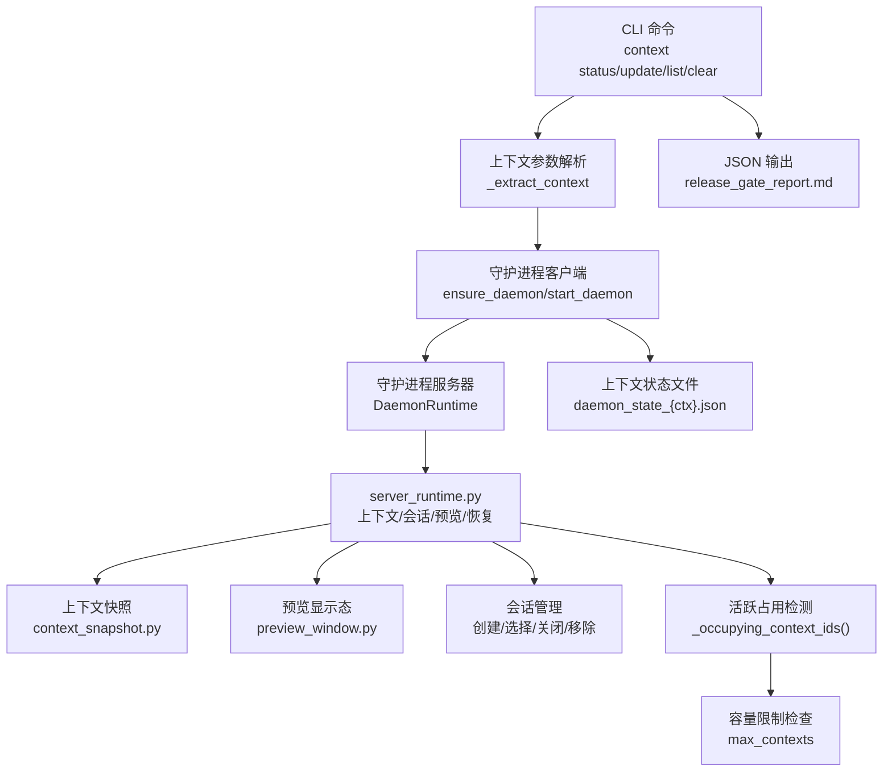

**图表来源**
- [run_cli.py:49-157](file://cli/run_cli.py#L49-L157)
- [client.py:576-832](file://rdx/daemon/client.py#L576-L832)
- [server.py:70-157](file://rdx/daemon/server.py#L70-L157)
- [server_runtime.py:6534-6733](file://rdx/server_runtime.py#L6534-L6733)
- [context_snapshot.py:95-171](file://rdx/context_snapshot.py#L95-L171)
- [preview_window.py:282-308](file://rdx/preview_window.py#L282-L308)
- [agent-model.md:5-8](file://docs/agent-model.md#L5-L8)

## 详细组件分析

### 显式守护进程上下文管理
**新增** 系统现在支持通过 `--daemon-context <id>` 参数进行显式的守护进程上下文管理：

- **上下文隔离**：每个上下文拥有独立的守护进程实例，状态文件按上下文命名（如 `daemon_state_case-1.json`）
- **生命周期管理**：支持上下文的启动、停止、清理等操作
- **状态持久化**：每个上下文的状态独立存储，避免状态泄漏
- **资源清理**：自动清理过期和孤立的上下文状态文件

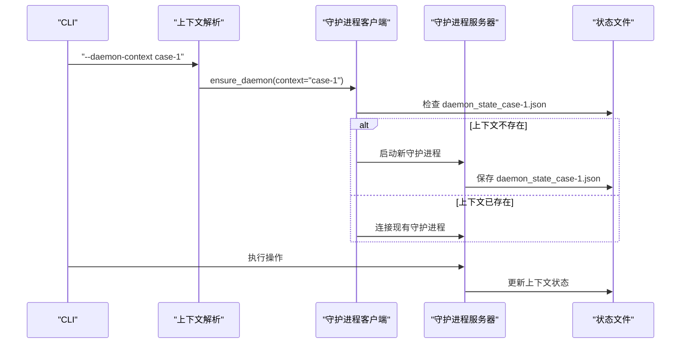

**图表来源**
- [client.py:576-674](file://rdx/daemon/client.py#L576-L674)
- [server.py:101-157](file://rdx/daemon/server.py#L101-L157)
- [run_cli.py:138-142](file://cli/run_cli.py#L138-L142)

**章节来源**
- [client.py:576-832](file://rdx/daemon/client.py#L576-L832)
- [server.py:70-157](file://rdx/daemon/server.py#L70-L157)
- [run_cli.py:49-157](file://cli/run_cli.py#L49-L157)
- [test_daemon_client.py:38-90](file://tests/test_daemon_client.py#L38-90)

### 会话定位器（session_locator）与 .active.rdc 关系
- 定位器由运行时在构建上下文快照时投影生成，包含 rdc_path、session_id、frame_index、active_event_id。
- 当存在当前会话与捕获文件时，定位器字段取自会话记录或运行时 runtime 字段。
- 在 CLI 输出中，session_locator 作为顶层投影字段出现，便于外部工具快速识别当前活动的捕获与事件。

**更新** 强调了 session_locator 在不同守护进程上下文中的独立性，确保跨上下文操作时的准确性。每个上下文维护自己的 session_locator，避免状态混淆。

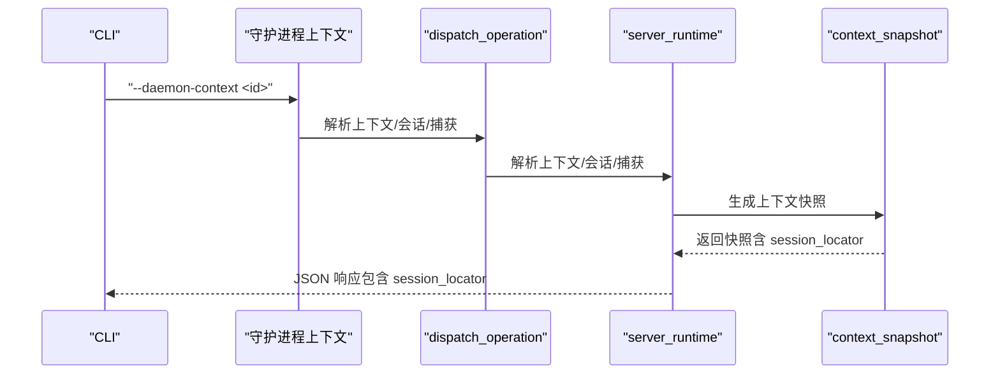

**图表来源**
- [server_runtime.py:6534-6733](file://rdx/server_runtime.py#L6534-L6733)
- [agent-model.md:5-8](file://docs/agent-model.md#L5-L8)

**章节来源**
- [server_runtime.py:6534-6733](file://rdx/server_runtime.py#L6534-L6733)
- [agent-model.md:5-8](file://docs/agent-model.md#L5-L8)

### 会话状态查询与更新机制
- 查询：rdx context status 返回当前上下文快照，其中包含 session_locator、runtime、preview、sessions、limits、recent_operations 等。
- 更新：rdx context update 支持对上下文元数据（如 notes、focus 等）进行键值更新；测试用例验证了 focus_pixel 的更新与读取往返。
- 字段约束：某些字段（如 session_id）不允许通过上下文更新直接修改，以保证会话一致性。

**更新** 强调了在复杂任务中使用显式上下文的重要性，确保状态更新的准确性和可追踪性。每个上下文的操作都独立记录，便于调试和审计。

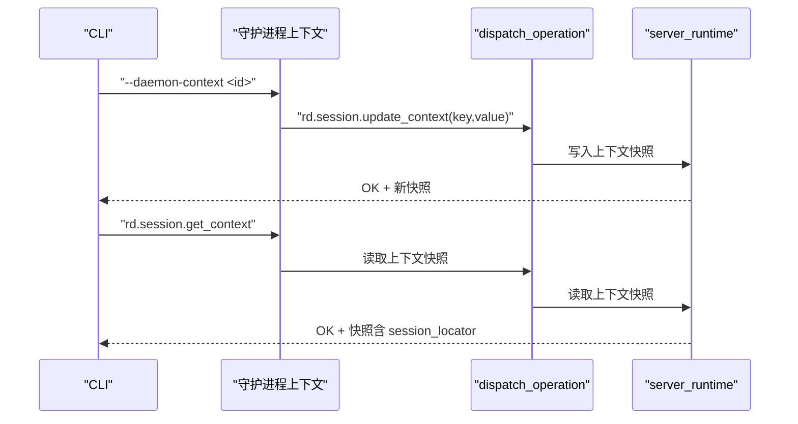

**图表来源**
- [test_context_snapshot.py:12-32](file://tests/test_context_snapshot.py#L12-L32)
- [test_cli_vfs.py:169-207](file://tests/test_cli_vfs.py#L169-L207)
- [agent-model.md:5-8](file://docs/agent-model.md#L5-L8)

**章节来源**
- [test_context_snapshot.py:12-32](file://tests/test_context_snapshot.py#L12-L32)
- [test_cli_vfs.py:169-207](file://tests/test_cli_vfs.py#L169-L207)
- [agent-model.md:5-8](file://docs/agent-model.md#L5-L8)

### 多会话并发处理与隔离
- 会话隔离：每个会话绑定到特定捕获文件与事件，运行时维护 sessions 映射与会话度量，确保不同会话间资源不互相污染。
- 并发与租约：远程会话通过租约机制登记到上下文，记录已占用会话列表与首个租约会话；会话关闭或异常时进入降级状态并触发恢复尝试。
- 限制与容量：上下文包含最大会话数、捕获文件数等限制，超出时会话恢复可能被降级或延迟。

**更新** 强化了守护进程上下文的隔离机制，通过 `--daemon-context <id>` 参数确保不同任务间的完全隔离，避免状态泄漏。每个上下文都有独立的资源管理和生命周期。新的限制机制基于活跃占用检查，提高了资源控制的准确性。

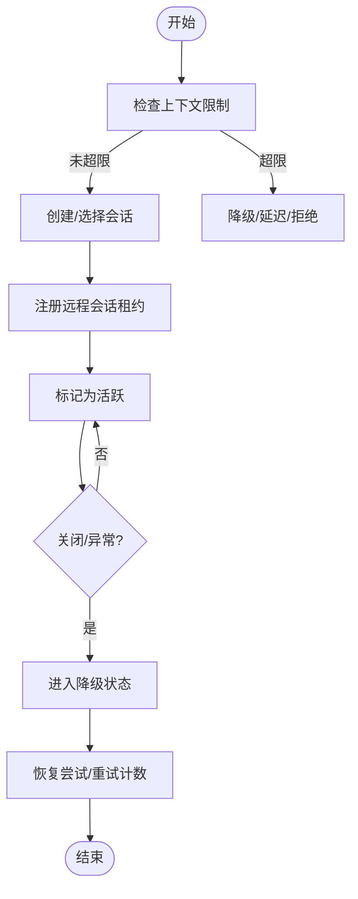

**图表来源**
- [server_runtime.py:2624-2643](file://rdx/server_runtime.py#L2624-L2643)
- [server_runtime.py:5570-5637](file://rdx/server_runtime.py#L5570-L5637)
- [server_runtime.py:5494-5517](file://rdx/server_runtime.py#L5494-L5517)

**章节来源**
- [server_runtime.py:2624-2643](file://rdx/server_runtime.py#L2624-L2643)
- [server_runtime.py:5570-5637](file://rdx/server_runtime.py#L5570-L5637)
- [server_runtime.py:5494-5517](file://rdx/server_runtime.py#L5494-L5517)

### 预览状态管理
- 几何体与显示态
  - 输出槽位、纹理标识与格式、帧缓冲尺寸、视口/剪裁/有效区域矩形、窗口尺寸与适配模式均在预览显示态中统一描述。
  - 显示态通过归一化函数确保字段类型与范围一致，避免后续处理出错。
- 视口/剪裁区域与窗口适配
  - 视口与剪裁矩形先按帧缓冲尺寸裁剪，再求交集得到有效区域；窗口尺寸根据屏幕占比进行适配，支持强制刷新几何。
- 测试验证
  - 测试覆盖了区域裁剪与相交、窗口适配比例与居中、默认纹理目标回退等场景。

**更新** 强调了预览状态在不同守护进程上下文中的独立性，确保预览窗口与上下文会话的正确绑定。每个上下文维护自己的预览状态，避免跨上下文干扰。

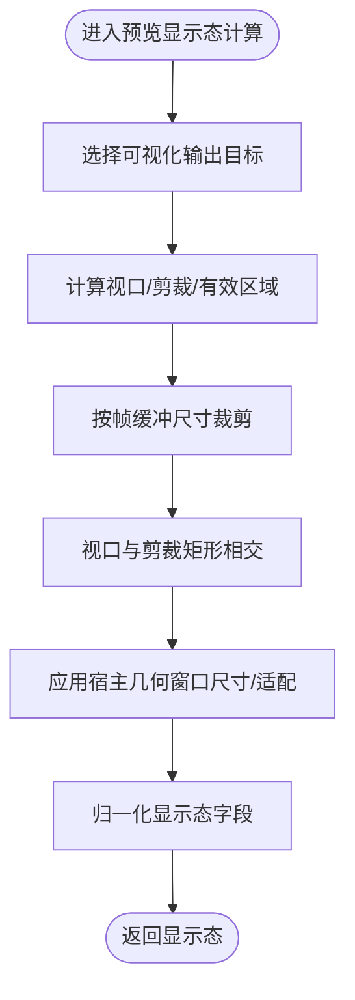

**图表来源**
- [server_runtime.py:549-2005](file://rdx/server_runtime.py#L549-L2005)
- [context_snapshot.py:95-171](file://rdx/context_snapshot.py#L95-L171)
- [preview_window.py:282-308](file://rdx/preview_window.py#L282-L308)
- [test_preview.py:549-587](file://tests/test_preview.py#L549-L587)

**章节来源**
- [server_runtime.py:549-2005](file://rdx/server_runtime.py#L549-L2005)
- [context_snapshot.py:95-171](file://rdx/context_snapshot.py#L95-L171)
- [preview_window.py:282-308](file://rdx/preview_window.py#L282-L308)
- [test_preview.py:549-587](file://tests/test_preview.py#L549-L587)

### 会话创建、维护与销毁
- 创建与选择
  - 通过上下文状态选择当前会话；若无则可创建新会话并绑定捕获文件与事件。
- 维护
  - 运行时维护会话活跃标志、错误信息与恢复统计；定期同步上下文指标与快照。
- 销毁
  - 关闭会话时清理回放映射与远程租约；异常情况下标记为降级并记录错误，触发恢复流程。

**更新** 强调了在复杂任务中使用显式守护进程上下文的重要性，确保会话生命周期的正确管理和资源清理。每个上下文都有独立的会话管理，避免跨上下文会话冲突。

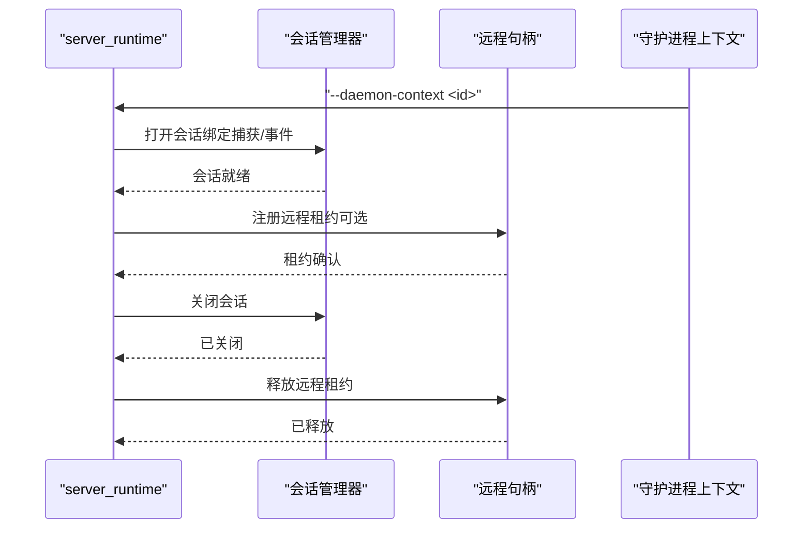

**图表来源**
- [server_runtime.py:2624-2643](file://rdx/server_runtime.py#L2624-L2643)
- [server_runtime.py:5494-5517](file://rdx/server_runtime.py#L5494-L5517)
- [agent-model.md:5-8](file://docs/agent-model.md#L5-L8)

**章节来源**
- [server_runtime.py:2624-2643](file://rdx/server_runtime.py#L2624-L2643)
- [server_runtime.py:5494-5517](file://rdx/server_runtime.py#L5494-L5517)
- [agent-model.md:5-8](file://docs/agent-model.md#L5-L8)

### Doctor 命令的条件性使用
**更新** 根据最新的指导原则，doctor 命令的使用已从强制性要求调整为条件性建议：

- **条件性使用**：仅在运行时就绪状态未知或环境发生变化时使用 `rdx --json doctor`
- **结果复用**：如果已有成功的 doctor 结果，可以重复使用该结果而无需重新执行
- **上下文感知**：doctor 命令现在支持 `--daemon-context` 参数，可以在特定上下文中执行诊断

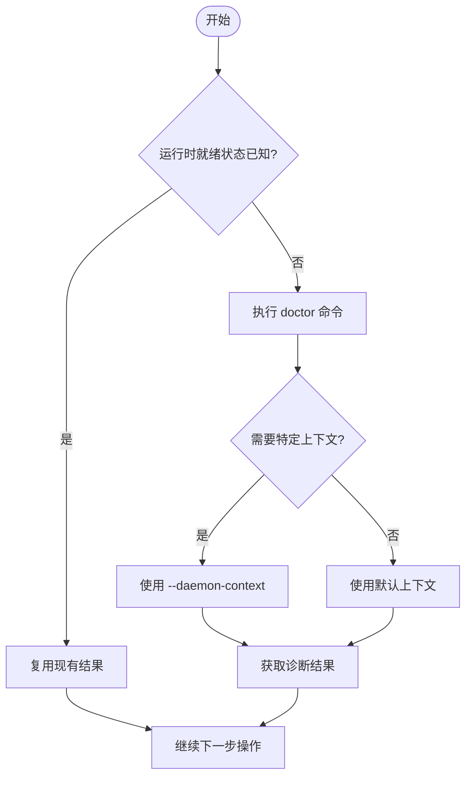

**图表来源**
- [test_cli_vfs.py:76-120](file://tests/test_cli_vfs.py#L76-L120)
- [agent-model.md:5-8](file://docs/agent-model.md#L5-L8)

**章节来源**
- [test_cli_vfs.py:76-120](file://tests/test_cli_vfs.py#L76-L120)
- [agent-model.md:5-8](file://docs/agent-model.md#L5-L8)

### 上下文容量管理与限制机制
**新增** 系统现在采用基于活跃占用的上下文限制机制：

- **活跃占用检测**：通过 `_occupying_context_ids()` 函数检测实际活跃的上下文，包括守护进程PID、工作进程PID、所有者PID和活跃的回放/预览
- **精确限制检查**：`_ensure_context_capacity()` 函数检查是否超过 `max_contexts` 限制，只计算真正活跃的上下文
- **改进的错误报告**：当达到容量限制时，提供详细的上下文占用信息和已知上下文列表
- **重用优化**：重用现有命名空间不会消耗额外的容量槽位

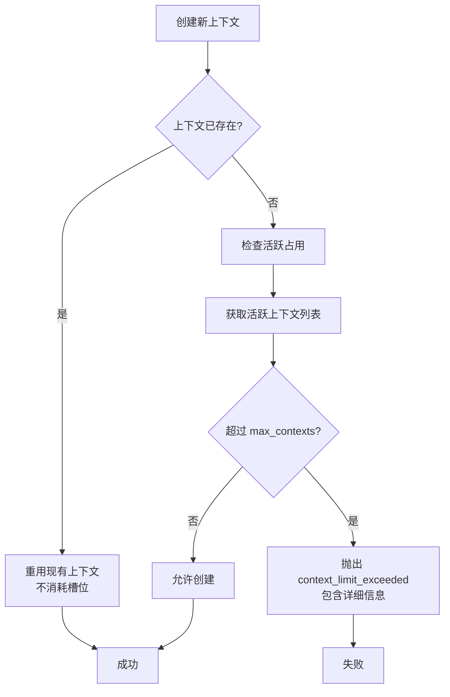

**图表来源**
- [server_runtime.py:417-447](file://rdx/server_runtime.py#L417-L447)
- [daemon/client.py:291-294](file://rdx/daemon/client.py#L291-L294)

**章节来源**
- [server_runtime.py:417-447](file://rdx/server_runtime.py#L417-L447)
- [daemon/client.py:291-294](file://rdx/daemon/client.py#L291-L294)
- [configuration.md:15](file://docs/configuration.md#L15)

## 依赖分析
- 运行时模块依赖上下文快照模块生成稳定的上下文视图；预览模块依赖运行时提供的显示态与宿主几何接口。
- 测试用例覆盖上下文更新/获取往返、远程会话恢复、预览几何计算等关键路径，确保行为正确性与边界处理。
- **新增** 守护进程上下文管理模块依赖状态文件系统进行上下文隔离和资源管理。

**更新** 增强了对守护进程上下文依赖的管理，确保在不同上下文间切换时的正确性和一致性。每个上下文都有独立的依赖链和资源管理。新的容量管理机制依赖于活跃占用检测，提高了资源控制的准确性。

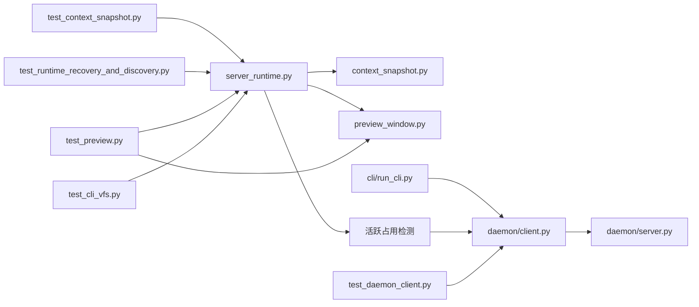

**图表来源**
- [server_runtime.py:549-2005](file://rdx/server_runtime.py#L549-L2005)
- [context_snapshot.py:95-171](file://rdx/context_snapshot.py#L95-L171)
- [preview_window.py:282-308](file://rdx/preview_window.py#L282-L308)
- [client.py:576-832](file://rdx/daemon/client.py#L576-L832)
- [server.py:70-157](file://rdx/daemon/server.py#L70-L157)
- [run_cli.py:49-157](file://cli/run_cli.py#L49-L157)
- [test_context_snapshot.py:12-32](file://tests/test_context_snapshot.py#L12-L32)
- [test_runtime_recovery_and_discovery.py:340-404](file://tests/test_runtime_recovery_and_discovery.py#L340-L404)
- [test_preview.py:549-587](file://tests/test_preview.py#L549-L587)
- [test_cli_vfs.py:76-120](file://tests/test_cli_vfs.py#L76-L120)
- [test_daemon_client.py:38-90](file://tests/test_daemon_client.py#L38-L90)

**章节来源**
- [server_runtime.py:549-2005](file://rdx/server_runtime.py#L549-L2005)
- [context_snapshot.py:95-171](file://rdx/context_snapshot.py#L95-L171)
- [preview_window.py:282-308](file://rdx/preview_window.py#L282-L308)
- [client.py:576-832](file://rdx/daemon/client.py#L576-L832)
- [server.py:70-157](file://rdx/daemon/server.py#L70-L157)
- [run_cli.py:49-157](file://cli/run_cli.py#L49-L157)
- [test_context_snapshot.py:12-32](file://tests/test_context_snapshot.py#L12-L32)
- [test_runtime_recovery_and_discovery.py:340-404](file://tests/test_runtime_recovery_and_discovery.py#L340-L404)
- [test_preview.py:549-587](file://tests/test_preview.py#L549-L587)
- [test_cli_vfs.py:76-120](file://tests/test_cli_vfs.py#L76-L120)
- [test_daemon_client.py:38-90](file://tests/test_daemon_client.py#L38-L90)

## 性能考虑
- 预览显示态计算涉及多次矩形裁剪与相交，建议在事件变更频率较高时启用"强制几何"开关以减少重复计算。
- 远程会话租约与恢复流程可能引入额外开销，应结合上下文限制与会话数量进行容量规划。
- 上下文快照同步与指标更新为后台任务，需关注 I/O 与序列化成本。
- **更新** 显式守护进程上下文会增加上下文切换开销，应在保证隔离性的前提下合理设计上下文粒度。多个上下文同时运行会消耗更多系统资源，应根据任务需求平衡隔离性和性能。新的活跃占用检测机制减少了不必要的文件系统检查，提高了性能。

## 故障排查指南
- 会话必需错误
  - 若调用需要会话的工具而上下文中无可用 session_id，CLI 将返回"需要会话"的错误提示，需先打开捕获或显式传入会话 ID。
- 远程会话恢复
  - 远程会话恢复可能被延迟或降级，查看 recovery 字段与最近操作列表，确认尝试次数与最后错误。
- 预览显示态异常
  - 检查视口/剪裁/有效区域是否为空或无效，确认帧缓冲尺寸与窗口适配参数；必要时强制刷新几何。
- **更新** 上下文隔离问题
  - 如果发现状态泄漏或会话冲突，检查是否正确使用了 `--daemon-context <id>` 参数，确保不同任务使用独立的上下文。
- **新增** 守护进程上下文故障
  - 上下文启动失败：检查端口冲突和权限问题
  - 上下文状态损坏：使用 `rdx --daemon-context <id> context clear` 清理后重启
  - 上下文清理不彻底：使用 `cleanup_stale_daemon_states()` 清理孤儿状态文件
- **新增** 容量限制问题
  - 遇到 `context_limit_exceeded` 错误：检查当前活跃上下文数量，使用 `rdx context list` 查看所有上下文
  - 清理不再使用的上下文：使用 `rdx context clear` 清理空闲上下文
  - 调整限制：通过环境变量 `RDX_MAX_CONTEXTS` 调整最大上下文数量

**章节来源**
- [server_runtime.py:5570-5637](file://rdx/server_runtime.py#L5570-5637)
- [test_preview.py:549-587](file://tests/test_preview.py#L549-L587)
- [agent-model.md:5-8](file://docs/agent-model.md#L5-L8)
- [client.py:774-832](file://rdx/daemon/client.py#L774-L832)

## 结论
会话模型通过"上下文 + 会话 + 捕获文件 + 事件"的组合实现了清晰的状态管理与稳定的 CLI 接口。session_locator 为外部工具提供了快速定位能力；运行时负责会话生命周期、远程租约与恢复；预览显示态在几何与适配上提供了可配置的策略。配合测试用例与日志输出，整体具备良好的可维护性与可观测性。

**更新** 通过增强的显式守护进程上下文管理机制和基于活跃占用的限制机制，进一步提升了多会话环境的隔离性和可靠性。新的上下文管理系统确保了任务间的完全隔离，避免了状态泄漏和资源冲突，特别适合复杂的自动化任务和并发处理场景。基于活跃占用的限制机制提高了资源管理的准确性，确保只有真正活跃的上下文才消耗容量。

## 附录
- 常用 CLI 命令
  - 查询上下文：rdx context status --json
  - 更新上下文：rdx context update --key <k> --value <v> --json
  - 列举上下文：rdx context list --json
  - 清理上下文：rdx context clear --json
  - **新增** 条件性诊断：rdx --json doctor（仅在需要时执行）
  - **新增** 显式上下文：rdx --daemon-context <id> context status --json
  - **新增** 上下文管理：rdx --daemon-context <id> daemon start/stop/status
  - **新增** 上下文清理：rdx --daemon-context <id> context clear --json

**最佳实践**
- 对于非平凡捕获任务，始终使用 `--daemon-context <id>` 参数
- 保持同一任务的上下文 ID 一致，避免状态混乱
- 任务完成后及时清理上下文，释放资源
- 定期检查并清理过期的上下文状态文件
- 在并发环境中为每个任务分配唯一的上下文 ID
- **新增** 监控活跃上下文数量，避免达到容量限制
- **新增** 利用重用机制，避免不必要的上下文创建

**章节来源**
- [agent-model.md:5-8](file://docs/agent-model.md#L5-L8)
- [test_cli_vfs.py:76-120](file://tests/test_cli_vfs.py#L76-L120)
- [session-model.md:1-16](file://docs/session-model.md#L1-L16)
- [rdx-native-agent-playbook.md:15-47](file://docs/rdx-native-agent-playbook.md#L15-L47)
- [run_cli.py:110-113](file://cli/run_cli.py#L110-L113)