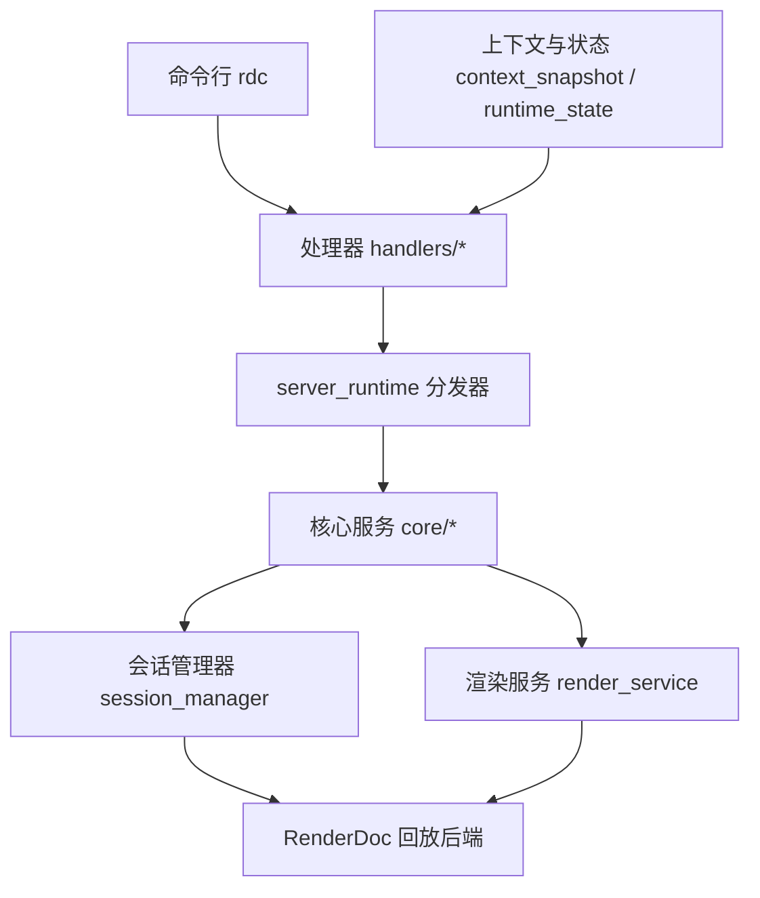
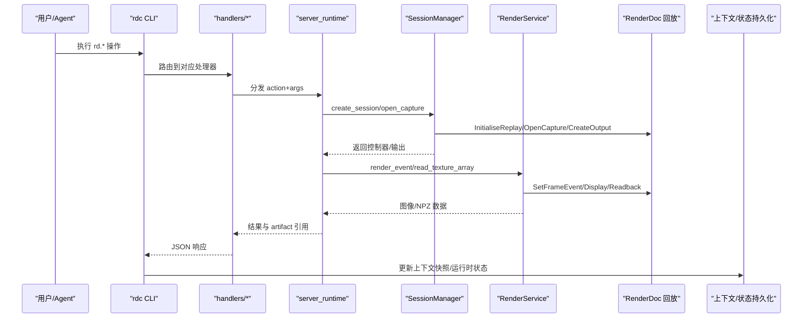
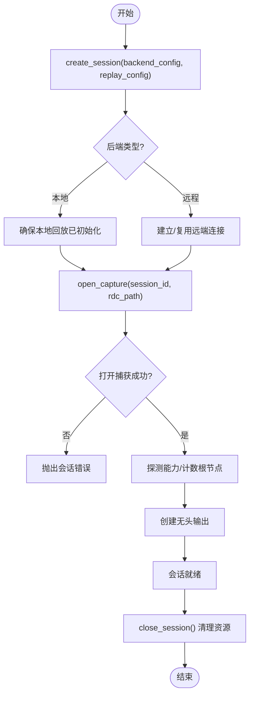
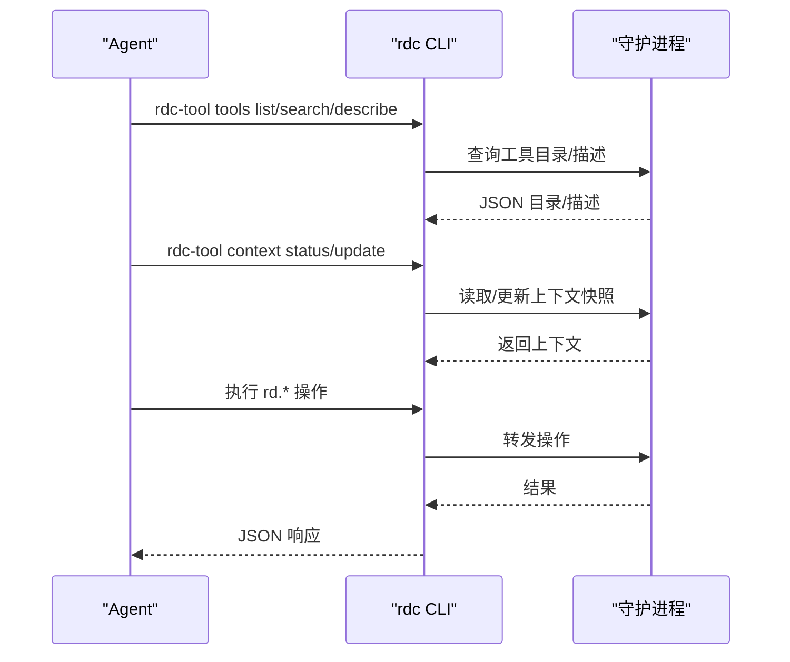
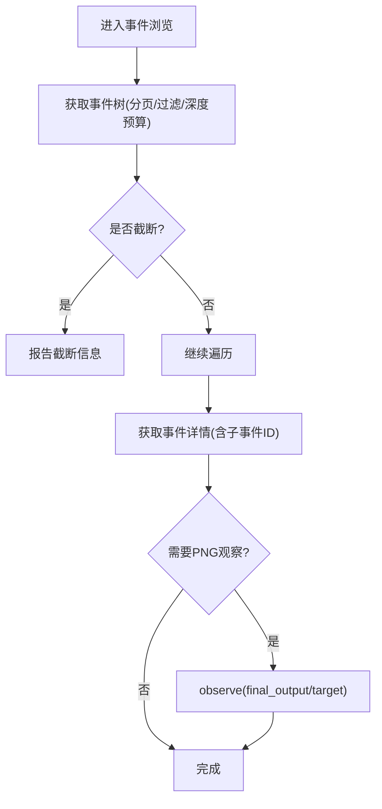
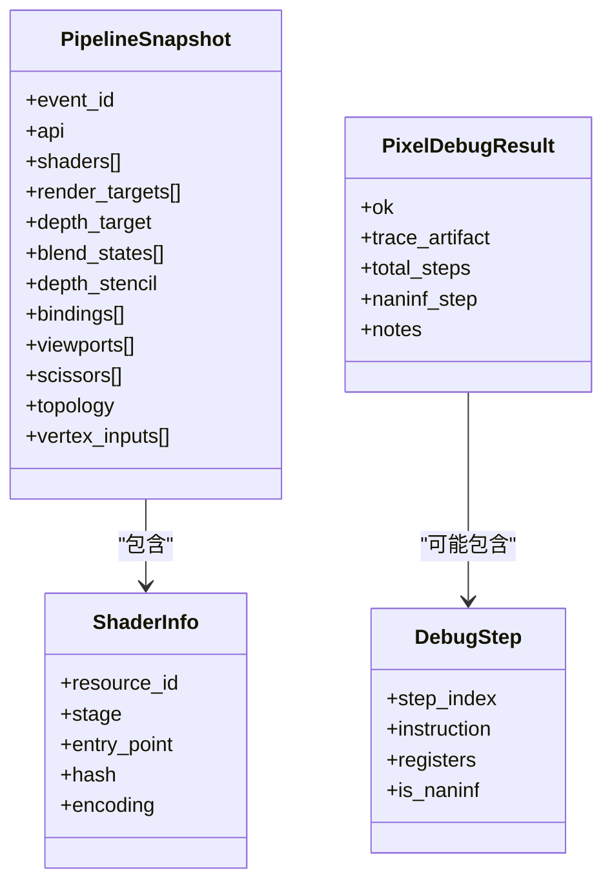
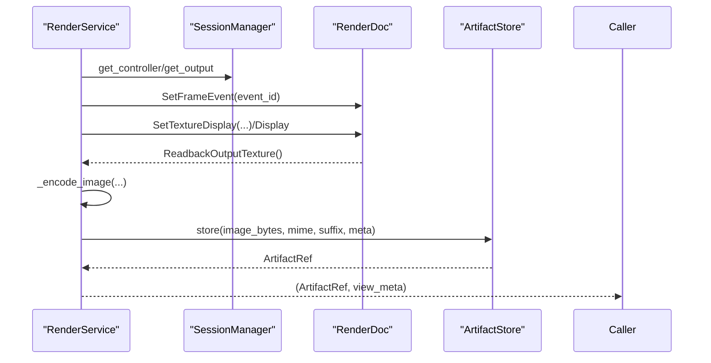
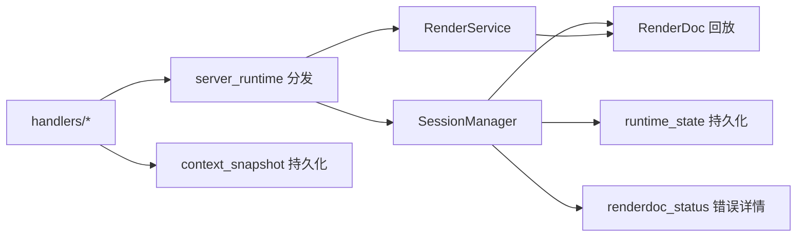

# 核心概念

<cite>
**本文引用的文件**
- [README.md](file://README.md)
- [models.py](file://rdc_tool/models.py)
- [session_manager.py](file://rdc_tool/core/session_manager.py)
- [render_service.py](file://rdc_tool/core/render_service.py)
- [context_snapshot.py](file://rdc_tool/context_snapshot.py)
- [runtime_state.py](file://rdc_tool/runtime_state.py)
- [renderdoc_status.py](file://rdc_tool/core/renderdoc_status.py)
- [replay.py](file://rdc_tool/handlers/replay.py)
- [event.py](file://rdc_tool/handlers/event.py)
- [pipeline.py](file://rdc_tool/handlers/pipeline.py)
- [public-contract.md](file://docs/public-contract.md)
- [session-model.md](file://docs/session-model.md)
- [agent-model.md](file://docs/agent-model.md)
</cite>

## 目录
1. [简介](#简介)
2. [项目结构](#项目结构)
3. [核心组件](#核心组件)
4. [架构总览](#架构总览)
5. [详细组件分析](#详细组件分析)
6. [依赖关系分析](#依赖关系分析)
7. [性能考量](#性能考量)
8. [故障排查指南](#故障排查指南)
9. [结论](#结论)
10. [附录](#附录)

## 简介
本文件面向希望深入理解 RDC-Tool（rdc-tools）内部模型与运行机制的开发者。围绕 RenderDoc 捕获文件 .rdc 的格式与生命周期、Replay 会话模型、上下文快照机制、Agent 自动化模型、GPU 事件模型、管线状态与着色器调试等主题，给出从数据模型到控制流、从本地到远端的完整说明，并辅以代码级图示与可追溯来源。

## 项目结构
RDC-Tool 采用“CLI + 守护进程 + 运行时”的分层组织：
- CLI 入口通过 rdc 命令暴露 JSON-first 操作；工具集由代码生成目录与注册表驱动。
- 核心服务位于 rdc_tool/core，封装 RenderDoc 回放、渲染读回、差异对比、性能统计等能力。
- 处理器 handlers 将 rd.* 动作路由到 server_runtime 的统一分发器。
- 上下文与持久化状态分别由 context_snapshot 与 runtime_state 管理，支持多上下文隔离。
- 文档 docs 提供会话模型、Agent 模型、公共契约等权威说明。



**图表来源**
- [replay.py:8-9](file://rdc_tool/handlers/replay.py#L8-L9)
- [event.py:8-9](file://rdc_tool/handlers/event.py#L8-L9)
- [pipeline.py:8-9](file://rdc_tool/handlers/pipeline.py#L8-L9)
- [session_manager.py:148-259](file://rdc_tool/core/session_manager.py#L148-L259)
- [render_service.py:346-521](file://rdc_tool/core/render_service.py#L346-L521)

**章节来源**
- [README.md:1-70](file://README.md#L1-L70)
- [public-contract.md:1-26](file://docs/public-contract.md#L1-L26)

## 核心组件
- 数据模型：集中定义在 models.py，涵盖会话、捕获、事件树、管线快照、着色器信息、补丁、实验、报告、指纹、任务等。
- 会话管理：session_manager.py 负责本地/远程回放会话创建、打开捕获、控制器与输出对象生命周期管理。
- 渲染服务：render_service.py 提供无头渲染、纹理导出、像素读取、图像编码与 artifact 存储。
- 上下文快照：context_snapshot.py 维护跨调用可见的用户焦点、预览状态、最近产物等。
- 运行时状态：runtime_state.py 持久化每个 daemon 上下文的捕获、会话、恢复、限制与指标。
- 错误处理：renderdoc_status.py 统一解析 RenderDoc 状态并构造结构化错误详情。

**章节来源**
- [models.py:103-122](file://rdc_tool/models.py#L103-L122)
- [models.py:128-157](file://rdc_tool/models.py#L128-L157)
- [models.py:163-180](file://rdc_tool/models.py#L163-L180)
- [models.py:224-301](file://rdc_tool/models.py#L224-L301)
- [models.py:319-332](file://rdc_tool/models.py#L319-L332)
- [models.py:338-385](file://rdc_tool/models.py#L338-L385)
- [models.py:391-423](file://rdc_tool/models.py#L391-L423)
- [models.py:429-457](file://rdc_tool/models.py#L429-L457)
- [models.py:463-483](file://rdc_tool/models.py#L463-L483)
- [models.py:489-503](file://rdc_tool/models.py#L489-L503)
- [models.py:510-552](file://rdc_tool/models.py#L510-L552)
- [models.py:558-584](file://rdc_tool/models.py#L558-L584)
- [session_manager.py:118-146](file://rdc_tool/core/session_manager.py#L118-L146)
- [session_manager.py:148-259](file://rdc_tool/core/session_manager.py#L148-L259)
- [render_service.py:346-521](file://rdc_tool/core/render_service.py#L346-L521)
- [context_snapshot.py:18-34](file://rdc_tool/context_snapshot.py#L18-L34)
- [context_snapshot.py:242-279](file://rdc_tool/context_snapshot.py#L242-L279)
- [runtime_state.py:104-149](file://rdc_tool/runtime_state.py#L104-L149)
- [renderdoc_status.py:57-105](file://rdc_tool/core/renderdoc_status.py#L57-L105)

## 架构总览
下图展示从 CLI 到 RenderDoc 回放后端的整体流程，包括会话创建、捕获打开、无头输出创建、渲染与读回、以及状态持久化。



**图表来源**
- [replay.py:8-9](file://rdc_tool/handlers/replay.py#L8-L9)
- [event.py:8-9](file://rdc_tool/handlers/event.py#L8-L9)
- [pipeline.py:8-9](file://rdc_tool/handlers/pipeline.py#L8-L9)
- [session_manager.py:175-251](file://rdc_tool/core/session_manager.py#L175-L251)
- [render_service.py:357-521](file://rdc_tool/core/render_service.py#L357-L521)
- [context_snapshot.py:447-475](file://rdc_tool/context_snapshot.py#L447-L475)
- [runtime_state.py:388-416](file://rdc_tool/runtime_state.py#L388-L416)

## 详细组件分析

### 会话模型与生命周期
- 会话创建：根据后端配置决定本地或远程；本地首次初始化回放子系统，远程建立连接或复用已有连接。
- 打开捕获：本地通过 OpenFile/OpenCapture，远端先复制捕获文件再 OpenCapture；成功后创建无头输出。
- 能力探测：获取 API 类型、着色器调试支持、补丁支持、计数器支持等。
- 销毁清理：按顺序关闭输出、控制器、捕获文件、远端连接；当无剩余本地会话时关闭回放子系统。



**图表来源**
- [session_manager.py:175-251](file://rdc_tool/core/session_manager.py#L175-L251)
- [session_manager.py:301-383](file://rdc_tool/core/session_manager.py#L301-L383)
- [session_manager.py:509-569](file://rdc_tool/core/session_manager.py#L509-L569)

**章节来源**
- [session_manager.py:118-146](file://rdc_tool/core/session_manager.py#L118-L146)
- [session_manager.py:175-259](file://rdc_tool/core/session_manager.py#L175-L259)
- [session_model.md:11-24](file://docs/session-model.md#L11-L24)

### 上下文快照机制
- 作用：保存与恢复用户关注点（像素、资源、着色器）、笔记、预览状态、最近产物等，支持多上下文隔离。
- 规范化：对像素坐标、矩形、预览显示状态等进行严格归一化，保证跨进程/重启一致性。
- 持久化：原子写入 JSON，带锁保护并发访问；支持保留策略裁剪历史产物。
- 使用场景：CLI 前后一致的状态可见性；Agent 在多次调用间维持上下文；预览几何与窗口适配。

```mermaid
classDiagram
class ContextSnapshot {
+context_id
+backend
+runtime{session_id,capture_file_id,frame_index,active_event_id,backend_type}
+remote{state,remote_id,endpoint,...}
+focus{pixel,resource_id,shader_id}
+notes
+last_artifacts[]
+preview{enabled,state,display,...}
+updated_at_ms
}
class RetentionPolicy {
+total_limit
+per_type_limit
}
ContextSnapshot --> RetentionPolicy : "应用裁剪策略"
```

**图表来源**
- [context_snapshot.py:18-34](file://rdc_tool/context_snapshot.py#L18-L34)
- [context_snapshot.py:83-171](file://rdc_tool/context_snapshot.py#L83-L171)
- [context_snapshot.py:242-279](file://rdc_tool/context_snapshot.py#L242-L279)
- [context_snapshot.py:335-364](file://rdc_tool/context_snapshot.py#L335-L364)
- [context_snapshot.py:447-475](file://rdc_tool/context_snapshot.py#L447-L475)

**章节来源**
- [context_snapshot.py:18-34](file://rdc_tool/context_snapshot.py#L18-L34)
- [context_snapshot.py:242-279](file://rdc_tool/context_snapshot.py#L242-L279)
- [context_snapshot.py:367-444](file://rdc_tool/context_snapshot.py#L367-L444)
- [context_snapshot.py:447-475](file://rdc_tool/context_snapshot.py#L447-L475)

### Agent 模型与自动化
- 原则：以 CLI-only 方式与 rdc 交互；通过 tools list/describe 发现能力；通过 context status/update 维护任务连续性。
- 安全边界：声明的作用域与效果不授予权限，宿主需校验身份、会话所有权、路径与操作影响。
- 远端与会话：当远端句柄被消费后必须重建；避免重用失效句柄。
- 观察与导航：使用 get_replay_events 与 observe 进行无窗 PNG 观察；区分独立预览窗口工作流。



**图表来源**
- [agent-model.md:1-32](file://docs/agent-model.md#L1-L32)
- [public-contract.md:1-26](file://docs/public-contract.md#L1-L26)

**章节来源**
- [agent-model.md:1-32](file://docs/agent-model.md#L1-L32)
- [public-contract.md:1-26](file://docs/public-contract.md#L1-L26)

### GPU 事件模型
- 事件树：EventNode 表示事件节点，包含 flags（draw/dispatch/marker/copy/resolve/clear/pass boundary）、子节点、输出目标、推断 pass 等。
- 浏览与导航：get_action_tree 提供分页与截断；get_action_details 包含直接子事件 ID；observe 支持最终输出与目标选择。
- 帧级时序：完整回放 GPU 时间戳测量，不包含初始状态重建，排除调度间隙。



**图表来源**
- [models.py:163-180](file://rdc_tool/models.py#L163-L180)
- [session-model.md:19-39](file://docs/session-model.md#L19-L39)
- [session-model.md:63-67](file://docs/session-model.md#L63-L67)
- [session-model.md:75-82](file://docs/session-model.md#L75-L82)

**章节来源**
- [models.py:163-180](file://rdc_tool/models.py#L163-L180)
- [session-model.md:19-39](file://docs/session-model.md#L19-L39)
- [session-model.md:63-67](file://docs/session-model.md#L63-L67)
- [session-model.md:75-82](file://docs/session-model.md#L75-L82)

### 管线状态与着色器调试
- 管线快照：PipelineSnapshot 记录事件级别的 API、着色器、渲染目标、混合/深度模板、绑定、视口/裁剪、拓扑、顶点输入等。
- 着色器信息：ShaderInfo 包含 resource_id、stage、entry_point、hash、encoding。
- 调试轨迹：DebugStep/PixelDebugResult 用于逐指令追踪与 NaN/Inf 定位。
- 补丁与实验：PatchSpec/PatchOp 表达替换/守卫等操作；ExperimentDef/Evidence/Result 支撑假设验证与证据收集。



**图表来源**
- [models.py:224-301](file://rdc_tool/models.py#L224-L301)
- [models.py:319-332](file://rdc_tool/models.py#L319-L332)
- [models.py:338-385](file://rdc_tool/models.py#L338-L385)
- [models.py:391-423](file://rdc_tool/models.py#L391-L423)

**章节来源**
- [models.py:224-301](file://rdc_tool/models.py#L224-L301)
- [models.py:319-332](file://rdc_tool/models.py#L319-L332)
- [models.py:338-385](file://rdc_tool/models.py#L338-L385)
- [models.py:391-423](file://rdc_tool/models.py#L391-L423)

### 渲染服务与读回
- 无头渲染：通过 TextureDisplay 设置源、通道、叠加层、HDR、翻转等，调用 Display 与 ReadbackOutputTexture 获取 RGBA 数据。
- 图像编码：支持 PNG/JPG/EXR/HDR/BMP/TGA/DDS/Raw/NPZ，失败时降级为 PNG。
- 纹理导出：SaveTexture 或 GetTextureData 直接写出文件或原始字节；NPZ 导出用于数值分析。
- 像素统计：read_texture_array 解析格式、计算统计量（NaN/Inf、min/max/mean），支持区域裁剪。



**图表来源**
- [render_service.py:357-521](file://rdc_tool/core/render_service.py#L357-L521)
- [render_service.py:523-646](file://rdc_tool/core/render_service.py#L523-L646)
- [render_service.py:658-794](file://rdc_tool/core/render_service.py#L658-L794)

**章节来源**
- [render_service.py:346-521](file://rdc_tool/core/render_service.py#L346-L521)
- [render_service.py:523-646](file://rdc_tool/core/render_service.py#L523-L646)
- [render_service.py:658-794](file://rdc_tool/core/render_service.py#L658-L794)

## 依赖关系分析
- 处理器到分发器：handlers/* 仅做轻量路由，实际逻辑在 server_runtime。
- 会话管理与渲染服务：两者都依赖 RenderDoc 回放后端；渲染服务通过会话管理器获取控制器与输出。
- 状态与快照：上下文快照与运行时状态共同支撑跨调用一致性；前者偏用户可见，后者偏系统级元数据与指标。
- 错误处理：renderdoc_status 统一包装 RenderDoc 状态，便于上层构建可诊断的错误详情。



**图表来源**
- [replay.py:8-9](file://rdc_tool/handlers/replay.py#L8-L9)
- [event.py:8-9](file://rdc_tool/handlers/event.py#L8-L9)
- [pipeline.py:8-9](file://rdc_tool/handlers/pipeline.py#L8-L9)
- [session_manager.py:148-259](file://rdc_tool/core/session_manager.py#L148-L259)
- [render_service.py:346-521](file://rdc_tool/core/render_service.py#L346-L521)
- [runtime_state.py:388-416](file://rdc_tool/runtime_state.py#L388-L416)
- [context_snapshot.py:447-475](file://rdc_tool/context_snapshot.py#L447-L475)
- [renderdoc_status.py:57-105](file://rdc_tool/core/renderdoc_status.py#L57-L105)

**章节来源**
- [replay.py:8-9](file://rdc_tool/handlers/replay.py#L8-L9)
- [event.py:8-9](file://rdc_tool/handlers/event.py#L8-L9)
- [pipeline.py:8-9](file://rdc_tool/handlers/pipeline.py#L8-L9)
- [session_manager.py:148-259](file://rdc_tool/core/session_manager.py#L148-L259)
- [render_service.py:346-521](file://rdc_tool/core/render_service.py#L346-L521)
- [runtime_state.py:388-416](file://rdc_tool/runtime_state.py#L388-L416)
- [context_snapshot.py:447-475](file://rdc_tool/context_snapshot.py#L447-L475)
- [renderdoc_status.py:57-105](file://rdc_tool/core/renderdoc_status.py#L57-L105)

## 性能考量
- 阻塞调用异步化：所有 RenderDoc 阻塞调用通过线程池执行，避免阻塞事件循环。
- 资源释放：会话销毁按序关闭输出、控制器、捕获文件与远端连接，最后关闭回放子系统。
- 数据裁剪：上下文快照与运行时状态均对最近操作与产物进行裁剪，控制内存与磁盘占用。
- 图像编码降级：当可选编码器不可用时自动回退到 PNG，保障可用性。

[本节为通用指导，无需特定文件引用]

## 故障排查指南
- 统一错误详情：使用 renderdoc_status 构建结构化错误，包含操作名、后端类型、捕获上下文、分类与修复提示。
- 会话错误：常见如 capture_already_open、controller_missing、no_remote_server、remote_capture_copy_failed 等，结合上下文快照与运行时状态定位问题。
- 远端传输：Android 使用 ADB 推送并校验 SHA256；非 Android 使用 RPC 复制；失败时清理临时路径并上报错误。
- 预览与观察：区分独立预览窗口与嵌入式观察；观察失败需区分 no_color_output、missing_target、export_failure。

**章节来源**
- [renderdoc_status.py:57-105](file://rdc_tool/core/renderdoc_status.py#L57-L105)
- [session_manager.py:175-259](file://rdc_tool/core/session_manager.py#L175-L259)
- [session_manager.py:373-440](file://rdc_tool/core/session_manager.py#L373-L440)
- [session_manager.py:442-507](file://rdc_tool/core/session_manager.py#L442-L507)
- [session-model.md:19-39](file://docs/session-model.md#L19-L39)

## 结论
RDC-Tool 通过清晰的数据模型、稳健的会话生命周期管理、可复用的渲染与读回服务、以及健壮的上下文与状态持久化机制，实现了对 .rdc 捕获文件的可靠回放与分析。配合 Agent 模型与公开契约，既能满足交互式调试，也能支撑自动化流水线。建议在使用中遵循会话与上下文隔离原则，充分利用错误详情与状态快照进行排障，并在大规模任务中合理裁剪与归档产物。

[本节为总结，无需特定文件引用]

## 附录
- 关键数据模型参考：
  - 会话与捕获：SessionInfo、CaptureInfo
  - 事件树：EventFlags、EventNode
  - 管线与着色器：PipelineSnapshot、ShaderInfo、ResourceBindingEntry
  - 调试与补丁：DebugStep、PixelDebugResult、PatchSpec、PatchOp
  - 实验与报告：ExperimentDef、ExperimentEvidence、ExperimentResult、ReportBundle
  - 指纹与回归：PassFingerprint、ShaderFingerprint、FingerprintRecord、RegressionEntry
  - 任务：TaskInput、TaskState

**章节来源**
- [models.py:128-157](file://rdc_tool/models.py#L128-L157)
- [models.py:163-180](file://rdc_tool/models.py#L163-L180)
- [models.py:224-301](file://rdc_tool/models.py#L224-L301)
- [models.py:319-332](file://rdc_tool/models.py#L319-L332)
- [models.py:338-385](file://rdc_tool/models.py#L338-L385)
- [models.py:391-423](file://rdc_tool/models.py#L391-L423)
- [models.py:429-457](file://rdc_tool/models.py#L429-L457)
- [models.py:463-483](file://rdc_tool/models.py#L463-L483)
- [models.py:489-503](file://rdc_tool/models.py#L489-L503)
- [models.py:510-552](file://rdc_tool/models.py#L510-L552)
- [models.py:558-584](file://rdc_tool/models.py#L558-L584)