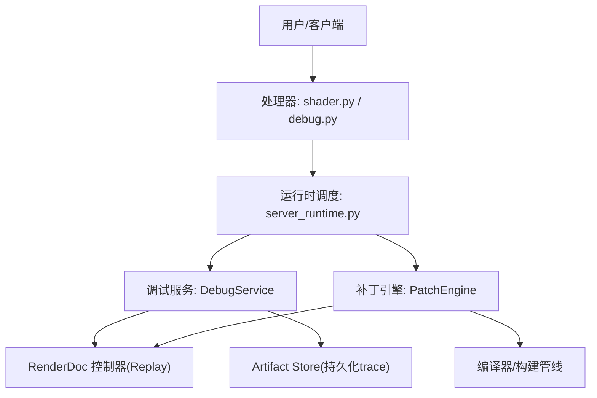
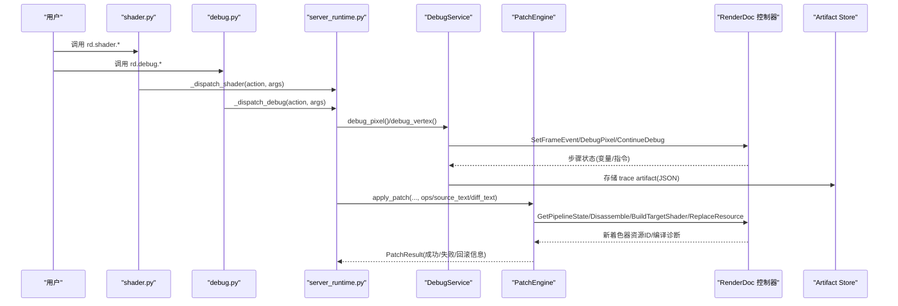
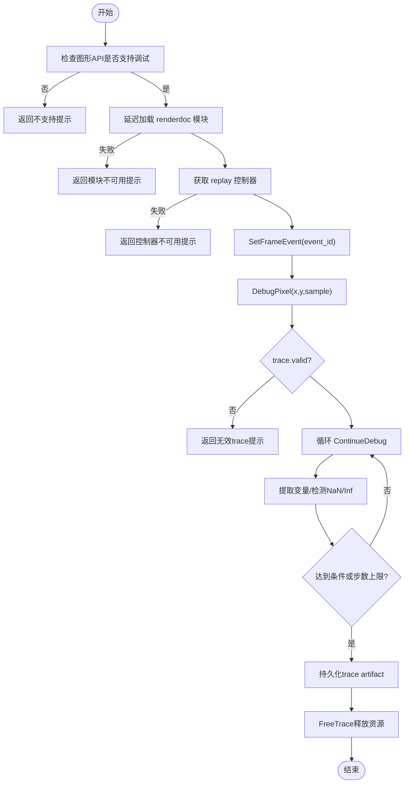
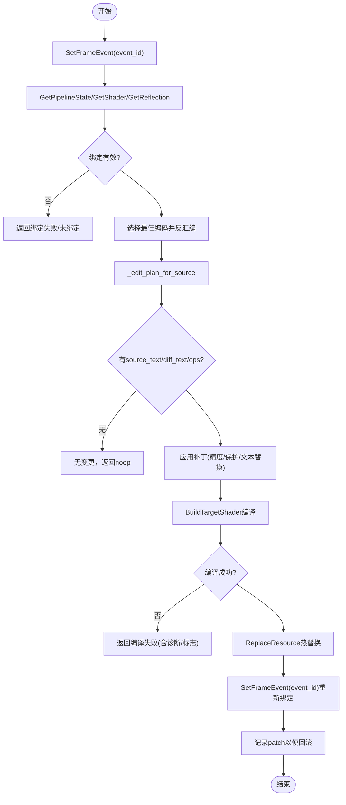
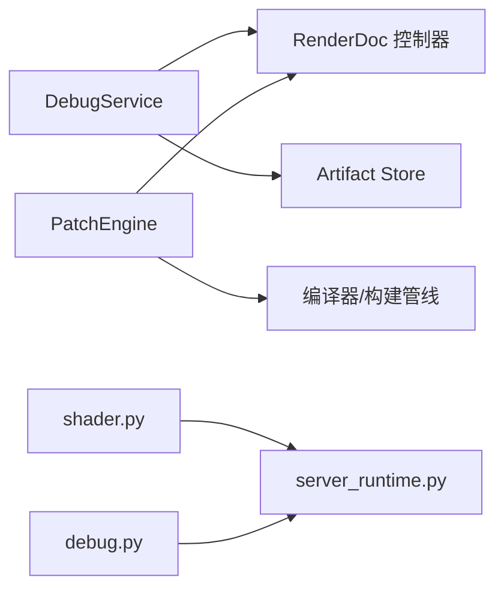

# 着色器调试

<cite>
**本文引用的文件**
- [debug_service.py](file://rdx/core/debug_service.py)
- [patch_engine.py](file://rdx/core/patch_engine.py)
- [models.py](file://rdx/models.py)
- [operation_definitions.py](file://rdx/operation_definitions.py)
- [shader.py](file://rdx/handlers/shader.py)
- [debug.py](file://rdx/handlers/debug.py)
- [server_runtime.py](file://rdx/server_runtime.py)
- [cli.py](file://rdx/cli.py)
- [test_shader_replace_contracts.py](file://tests/test_shader_replace_contracts.py)
</cite>

## 目录
1. [简介](#简介)
2. [项目结构](#项目结构)
3. [核心组件](#核心组件)
4. [架构总览](#架构总览)
5. [详细组件分析](#详细组件分析)
6. [依赖关系分析](#依赖关系分析)
7. [性能考虑](#性能考虑)
8. [故障排查指南](#故障排查指南)
9. [结论](#结论)
10. [附录](#附录)

## 简介
本文件面向使用 RDC-Tool 进行着色器调试的开发者，系统性说明以下能力：
- 着色器断点与命中控制：通过逐步执行、条件停止（NaN/Inf）与步数上限实现“条件断点”和“命中计数”；以 trace artifact 形式记录命中历史。
- 变量检查与修改：从每步状态中提取寄存器/变量值；结合源码替换与补丁操作间接“修改”着色器行为。
- 调用栈与执行流程：通过逐步骤 trace 理解函数调用顺序与数据流变化。
- SPIR-V 反汇编与源码映射：获取可读的反汇编文本，并在不可用时提供可编辑的 IR/源码替代路径。
- 最佳实践与常见问题：覆盖编译失败、驱动不支持、资源释放等场景。
- 实战示例：基于测试用例展示典型工作流。

## 项目结构
围绕着色器调试的关键代码分布在服务层、处理器层、模型定义与工具契约中：
- 服务层：DebugService 封装 RenderDoc 的像素/顶点着色器调试 API，输出结构化 trace 并持久化。
- 补丁引擎：PatchEngine 在 Replay 环境中对着色器进行源码级修改、编译与热替换，支持多种编码与操作。
- 处理器层：shader.py 与 debug.py 将外部调用转发至 server_runtime 的统一调度入口。
- 模型与契约：models.py 定义会话、阶段、结果等类型；operation_definitions.py 描述工具输入输出契约。
- CLI：cli.py 暴露环境检测与依赖可用性信息，辅助定位工具链问题。

图表来源
- [shader.py:8-9](file://rdx/handlers/shader.py#L8-L9)
- [debug.py:8-9](file://rdx/handlers/debug.py#L8-L9)
- [server_runtime.py:9518](file://rdx/server_runtime.py#L9518)
- [debug_service.py:43-614](file://rdx/core/debug_service.py#L43-L614)
- [patch_engine.py:175-800](file://rdx/core/patch_engine.py#L175-L800)

章节来源
- [shader.py:1-11](file://rdx/handlers/shader.py#L1-L11)
- [debug.py:1-11](file://rdx/handlers/debug.py#L1-L11)
- [server_runtime.py:9518](file://rdx/server_runtime.py#L9518)
- [debug_service.py:1-614](file://rdx/core/debug_service.py#L1-L614)
- [patch_engine.py:1-800](file://rdx/core/patch_engine.py#L1-L800)

## 核心组件
- DebugService
  - 提供异步接口用于像素/顶点着色器调试，支持“运行到首个 NaN/Inf”或“完整 trace”。
  - 提取每步变量值，识别 NaN/Inf，并将 trace 持久化为 JSON artifact。
  - 自动释放渲染驱动资源，避免泄漏。
- PatchEngine
  - 在 Replay 中读取当前事件绑定的着色器，选择最佳可编辑编码进行反汇编。
  - 应用补丁操作（如精度提升、插入 NaN/Inf 保护），编译并通过 ReplaceResource 热替换。
  - 记录已应用的 patch，支持回滚与清理。
- Models & Operation Definitions
  - 统一的数据结构与工具契约，明确输入参数、返回字段、错误码与推荐下一步工具。

章节来源
- [debug_service.py:43-614](file://rdx/core/debug_service.py#L43-L614)
- [patch_engine.py:175-800](file://rdx/core/patch_engine.py#L175-L800)
- [models.py:1-200](file://rdx/models.py#L1-L200)
- [operation_definitions.py:2946-3038](file://rdx/operation_definitions.py#L2946-L3038)
- [operation_definitions.py:3263-3403](file://rdx/operation_definitions.py#L3263-L3403)

## 架构总览
下图展示了从调用入口到具体实现的端到端流程，包括调试与补丁两条主线。

图表来源
- [shader.py:8-9](file://rdx/handlers/shader.py#L8-L9)
- [debug.py:8-9](file://rdx/handlers/debug.py#L8-L9)
- [server_runtime.py:9518](file://rdx/server_runtime.py#L9518)
- [debug_service.py:122-267](file://rdx/core/debug_service.py#L122-L267)
- [patch_engine.py:196-800](file://rdx/core/patch_engine.py#L196-L800)

## 详细组件分析

### 调试服务（DebugService）
- 功能要点
  - 像素着色器调试：支持指定像素坐标与采样索引，模式可选“运行到首个 NaN/Inf”或“完整 trace”，内置最大步数限制防止失控。
  - 顶点着色器调试：针对特定 vertex_id/instance_id 执行逐步跟踪。
  - 变量提取：从每步状态中抽取变量名与数值，支持 float/uint/sint 及数组形式。
  - 异常处理：捕获 ContinueDebug 异常并安全释放 trace。
  - 持久化：将 trace 保存为 JSON artifact，便于后续离线分析。
- 关键流程（像素调试）
  - 导航到目标事件 -> 启动 DebugPixel -> 循环 ContinueDebug -> 提取变量与 NaN/Inf -> 达到条件或步数上限 -> 释放 trace -> 持久化 artifact。

图表来源
- [debug_service.py:54-267](file://rdx/core/debug_service.py#L54-L267)
- [debug_service.py:427-490](file://rdx/core/debug_service.py#L427-L490)
- [debug_service.py:492-563](file://rdx/core/debug_service.py#L492-L563)

章节来源
- [debug_service.py:54-267](file://rdx/core/debug_service.py#L54-L267)
- [debug_service.py:271-421](file://rdx/core/debug_service.py#L271-L421)
- [debug_service.py:427-563](file://rdx/core/debug_service.py#L427-L563)

### 补丁引擎（PatchEngine）
- 功能要点
  - 解析当前事件绑定着色器与反射信息，选择最佳可编辑编码（HLSL/GLSL/SPIR-V ASM）。
  - 应用补丁操作：force_full_precision、insert_guard，或直接替换 source_text/diff_text。
  - 编译与热替换：通过 BuildTargetShader 编译，ReplaceResource 热替换，必要时回滚。
  - 错误分类：区分绑定失败、反汇编不可用、编译失败、替换失败等，并提供上下文信息。
- 关键流程（apply_patch）
  - 导航到事件 -> 获取 pipeline state -> 反汇编 -> 计算 edit_plan -> 应用补丁 -> 编译 -> 替换 -> 记录/回滚。

图表来源
- [patch_engine.py:196-800](file://rdx/core/patch_engine.py#L196-L800)

章节来源
- [patch_engine.py:175-800](file://rdx/core/patch_engine.py#L175-L800)

### 处理器与运行时调度
- shader.py 与 debug.py 作为薄包装，将 action 与参数转发给 server_runtime 的统一调度方法。
- operation_definitions.py 定义了工具的输入/输出契约，包括 get_source、get_disassembly、edit_and_replace 等。

章节来源
- [shader.py:8-9](file://rdx/handlers/shader.py#L8-L9)
- [debug.py:8-9](file://rdx/handlers/debug.py#L8-L9)
- [operation_definitions.py:2946-3038](file://rdx/operation_definitions.py#L2946-L3038)
- [operation_definitions.py:3263-3403](file://rdx/operation_definitions.py#L3263-L3403)

### 模型与数据结构
- models.py 定义了 GraphicsAPI、ShaderStage、SessionCapabilities、ArtifactRef 等基础类型，贯穿调试与补丁流程。

章节来源
- [models.py:1-200](file://rdx/models.py#L1-L200)

## 依赖关系分析
- 组件耦合
  - DebugService 依赖 RenderDoc 控制器与 Artifact Store，保持无状态设计，便于测试。
  - PatchEngine 依赖 session_manager、controller 与编译器后端，严格管理资源生命周期。
  - 处理器层仅做路由，降低耦合度。
- 外部依赖
  - renderdoc Python 模块按需延迟导入，缺失时给出清晰提示。
  - 工具链依赖（如 SPIR-V 汇编/反汇编）在 CLI 中报告可用性。

图表来源
- [debug_service.py:104-120](file://rdx/core/debug_service.py#L104-L120)
- [patch_engine.py:50-60](file://rdx/core/patch_engine.py#L50-L60)
- [cli.py:477-513](file://rdx/cli.py#L477-L513)

章节来源
- [debug_service.py:104-120](file://rdx/core/debug_service.py#L104-L120)
- [patch_engine.py:50-60](file://rdx/core/patch_engine.py#L50-L60)
- [cli.py:477-513](file://rdx/cli.py#L477-L513)

## 性能考虑
- 步数上限：调试过程设置 max_steps，防止无限循环或过大 trace 导致内存压力。
- 延迟导入：renderdoc 模块仅在需要时导入，减少启动开销。
- 资源释放：每次调试后显式 FreeTrace，避免驱动资源泄漏。
- 反汇编与编译：优先选择最合适的编码以减少转换成本；编译失败时尽早返回，避免不必要的替换尝试。

[本节为通用指导，不直接分析具体文件]

## 故障排查指南
- 图形 API 不支持调试
  - 现象：返回不支持提示。
  - 原因：OpenGL/OpenGLES 不受支持；D3D11/D3D12/Vulkan 通常可用。
  - 处理：切换支持的 API 或使用其他诊断手段。
- renderdoc 模块不可用
  - 现象：提示模块未找到。
  - 处理：确保模块路径正确或设置环境变量。
- 反汇编不可用
  - 现象：返回 disassembly_unavailable，附带 failure_stage/failure_reason。
  - 处理：根据 operation_definitions 的建议，改用 get_disassembly 或 extract_binary。
- 编译失败
  - 现象：返回 shader_build_failed，包含 compiler_output 与 compile_flags。
  - 处理：修正源文本或补丁操作；必要时回退到只读反汇编。
- 替换失败
  - 现象：ReplaceResource 失败，引擎尝试清理临时资源。
  - 处理：检查事件绑定与阶段匹配；确认资源 ID 有效。

章节来源
- [debug_service.py:94-120](file://rdx/core/debug_service.py#L94-L120)
- [debug_service.py:193-211](file://rdx/core/debug_service.py#L193-L211)
- [patch_engine.py:235-296](file://rdx/core/patch_engine.py#L235-L296)
- [patch_engine.py:626-743](file://rdx/core/patch_engine.py#L626-L743)
- [operation_definitions.py:3263-3403](file://rdx/operation_definitions.py#L3263-L3403)

## 结论
RDC-Tool 的着色器调试能力通过 DebugService 与 PatchEngine 协同工作，提供了从“观察执行”到“源码级修复”的闭环：
- 调试侧：支持像素/顶点着色器的逐步执行、条件停止与 trace 持久化，帮助快速定位 NaN/Inf 等问题。
- 补丁侧：支持多编码反汇编与源码级修改，编译与热替换一体化，具备完善的错误分类与回滚机制。
- 工具契约：明确的输入输出与推荐下一步工具，便于自动化与集成。

[本节为总结性内容，不直接分析具体文件]

## 附录

### 断点与命中计数
- 条件断点：通过“运行到首个 NaN/Inf”模式实现条件断点；也可通过 insert_guard 在源码层面插入保护逻辑，使异常值被拦截。
- 命中计数：每次调试产生的 trace artifact 包含 total_steps 与 naninf_step_index，可用于统计命中次数与位置。
- 断点组：可通过多次调用不同像素坐标或顶点实例，形成“断点组”进行批量验证。

章节来源
- [debug_service.py:54-267](file://rdx/core/debug_service.py#L54-L267)
- [patch_engine.py:480-582](file://rdx/core/patch_engine.py#L480-L582)

### 变量检查与修改
- 变量检查：每步状态中的 variables 字典包含寄存器/变量名与值，支持浮点、整型与向量。
- 变量修改：通过补丁操作（如 force_full_precision、insert_guard）或 source_text/diff_text 直接修改源码，从而改变变量行为。

章节来源
- [debug_service.py:492-563](file://rdx/core/debug_service.py#L492-L563)
- [patch_engine.py:447-603](file://rdx/core/patch_engine.py#L447-L603)

### 调用栈与执行流程
- 调用栈：当前实现以步骤序列呈现执行流程；如需更细粒度函数调用关系，可结合源码映射与反汇编文本进行分析。
- 执行流程：通过逐步 trace 观察变量变化与指令执行顺序，定位问题发生点。

章节来源
- [debug_service.py:143-191](file://rdx/core/debug_service.py#L143-L191)
- [patch_engine.py:320-382](file://rdx/core/patch_engine.py#L320-L382)

### SPIR-V 反汇编与源码映射
- 反汇编：支持获取 SPIR-V ASM 或其他目标反汇编；当原始调试源码不可用时，返回 fallback_tool 建议。
- 源码映射：若存在源码信息，可结合 edit_plan 判断是否可编辑；否则建议使用只读反汇编或二进制提取。

章节来源
- [operation_definitions.py:3263-3403](file://rdx/operation_definitions.py#L3263-L3403)
- [test_shader_replace_contracts.py:1551-1608](file://tests/test_shader_replace_contracts.py#L1551-L1608)

### 最佳实践
- 先调试后补丁：先用 DebugService 定位问题，再使用 PatchEngine 进行最小化修改。
- 小步快跑：每次只应用一个补丁操作，验证效果后再继续。
- 保留上下文：编译失败时不要盲目替换，先检查编译标志与诊断信息。
- 及时回滚：使用记录的 patch 信息进行回滚，恢复原始着色器。

[本节为通用指导，不直接分析具体文件]

### 常见问题解决方案
- 无法获取控制器：检查 session_id 与 replay 状态。
- 反汇编为空：确认目标编码是否受支持；必要时切换到 auto 或指定目标。
- 编译失败：查看 compiler_output 与 compile_flags；修正语法或语义错误。
- 替换失败：确认事件绑定与阶段匹配；检查资源 ID 有效性。

章节来源
- [debug_service.py:112-120](file://rdx/core/debug_service.py#L112-L120)
- [patch_engine.py:235-296](file://rdx/core/patch_engine.py#L235-L296)
- [patch_engine.py:626-743](file://rdx/core/patch_engine.py#L626-L743)

### 实战示例
- 示例一：像素着色器调试并持久化 trace
  - 调用 debug_pixel，设置 mode="run_to_naninf"，max_steps=20000，获取首个 NaN/Inf 的步骤与变量快照。
- 示例二：SPIR-V ASM 反汇编与可编辑性评估
  - 调用 get_disassembly，target="SPIR-V ASM"，source_encoding="spirvasm"，根据 edit_plan 决定是否可替换。
- 示例三：源码替换与热更新
  - 调用 edit_and_replace，传入 source_text 或 diff_text，验证编译成功后进行热替换，并记录 artifacts。

章节来源
- [test_shader_replace_contracts.py:276-303](file://tests/test_shader_replace_contracts.py#L276-L303)
- [test_shader_replace_contracts.py:1551-1608](file://tests/test_shader_replace_contracts.py#L1551-L1608)
- [test_shader_replace_contracts.py:963-1015](file://tests/test_shader_replace_contracts.py#L963-L1015)