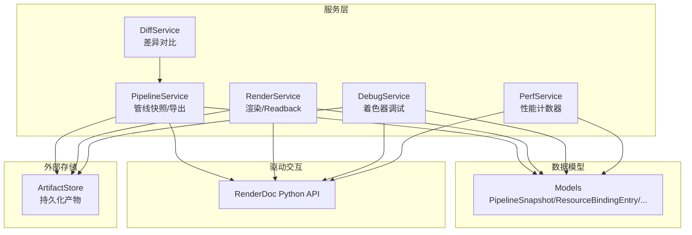
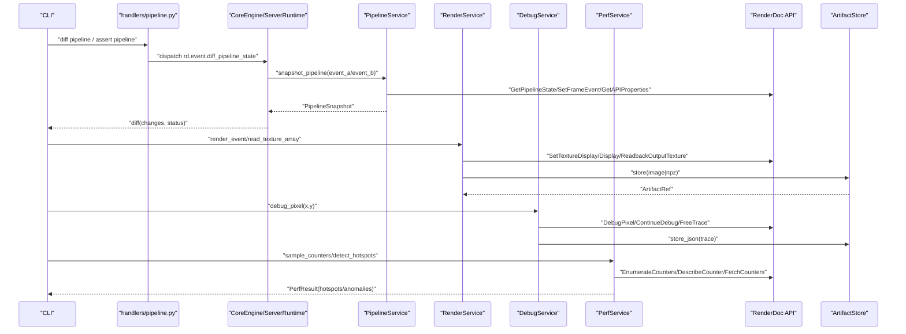
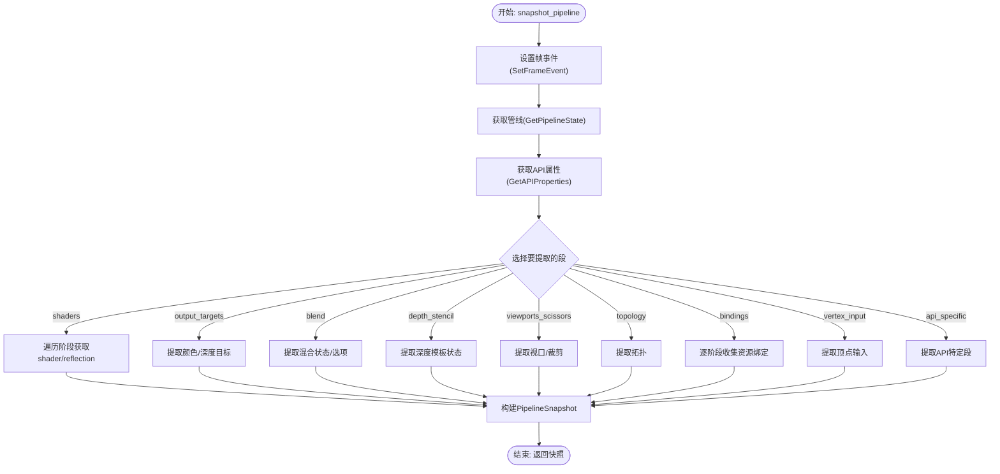
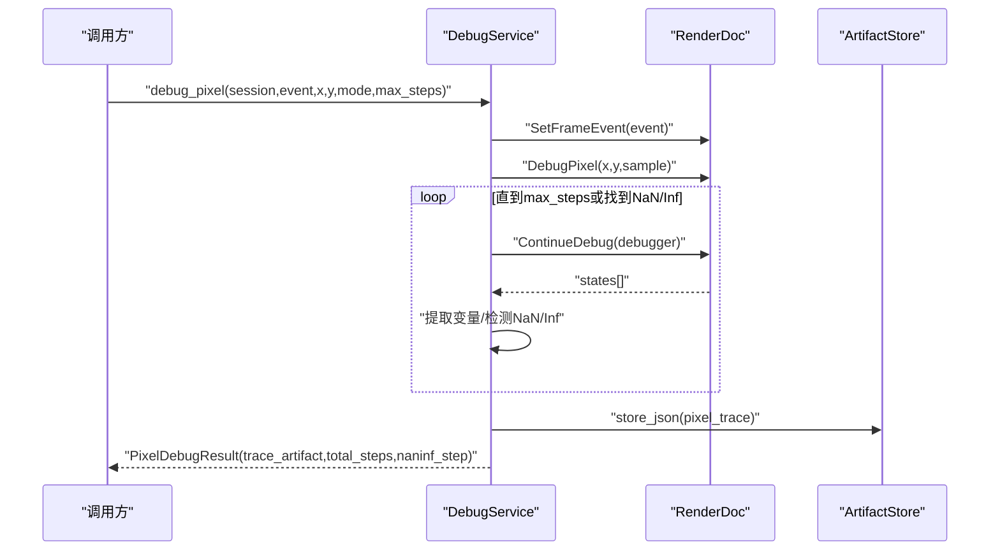
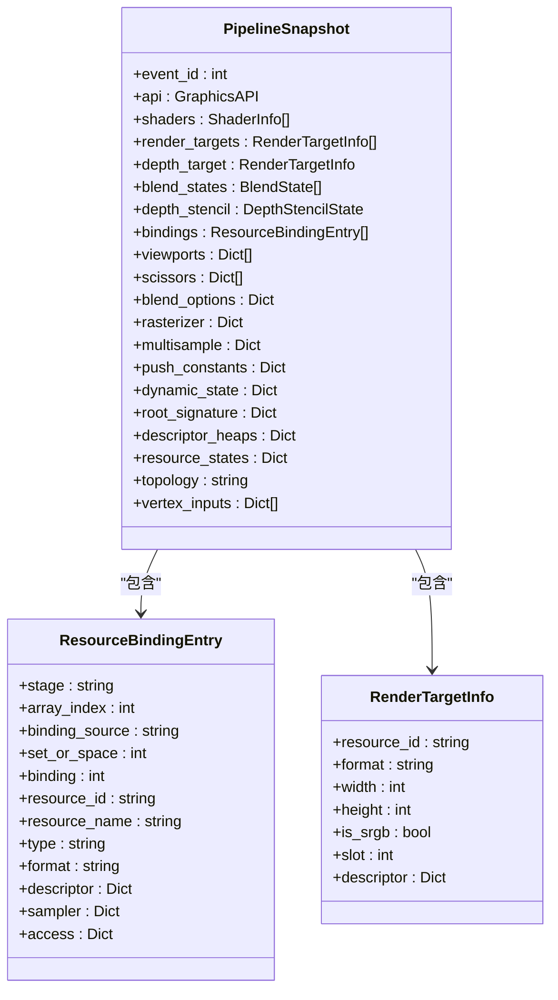
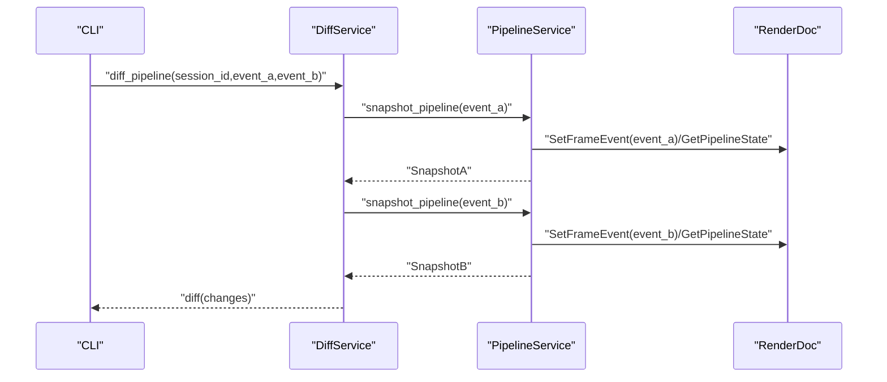
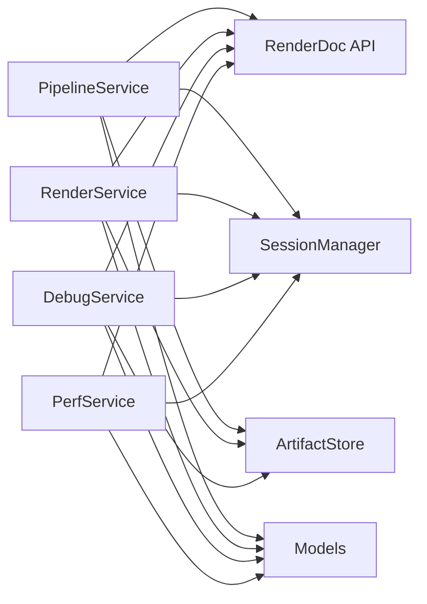

# 管线状态

<cite>
**本文引用的文件**
- [pipeline_service.py](file://rdx/core/pipeline_service.py)
- [render_service.py](file://rdx/core/render_service.py)
- [debug_service.py](file://rdx/core/debug_service.py)
- [perf_service.py](file://rdx/core/perf_service.py)
- [diff_service.py](file://rdx/core/diff_service.py)
- [models.py](file://rdx/models.py)
- [renderdoc_status.py](file://rdx/core/renderdoc_status.py)
- [pipeline.py](file://rdx/handlers/pipeline.py)
- [cli.py](file://rdx/cli.py)
</cite>

## 目录
1. [简介](#简介)
2. [项目结构](#项目结构)
3. [核心组件](#核心组件)
4. [架构总览](#架构总览)
5. [详细组件分析](#详细组件分析)
6. [依赖关系分析](#依赖关系分析)
7. [性能考量](#性能考量)
8. [故障排查指南](#故障排查指南)
9. [结论](#结论)
10. [附录：API调用示例与最佳实践](#附录api调用示例与最佳实践)

## 简介
本文件面向使用 RDC-Tool（RDX）进行 GPU 渲染调试的开发者，系统化阐述 RenderDoc 管线状态的采集、比较、着色器调试、资源绑定检查以及性能优化建议。内容覆盖顶点输入、光栅化、片段着色等阶段的状态提取；提供状态差异检测与变化追踪方法；解释着色器断点/变量检查/调用栈分析；说明纹理、缓冲区、常量缓冲区的绑定验证；并给出实际案例与最佳实践。

## 项目结构
围绕“管线状态”的核心代码分布在以下模块：
- 管线快照与导出：core/pipeline_service.py
- 渲染与像素读取：core/render_service.py
- 着色器调试：core/debug_service.py
- 性能计数器采样：core/perf_service.py
- 管线状态差异：core/diff_service.py
- 数据模型：models.py
- 错误与状态封装：core/renderdoc_status.py
- 处理器路由：handlers/pipeline.py
- CLI 入口与命令：cli.py

图表来源
- [pipeline_service.py:590-702](file://rdx/core/pipeline_service.py#L590-L702)
- [render_service.py:346-521](file://rdx/core/render_service.py#L346-L521)
- [debug_service.py:43-267](file://rdx/core/debug_service.py#L43-L267)
- [perf_service.py:212-618](file://rdx/core/perf_service.py#L212-L618)
- [diff_service.py:11-51](file://rdx/core/diff_service.py#L11-L51)
- [models.py:224-313](file://rdx/models.py#L224-L313)

章节来源
- [pipeline_service.py:590-702](file://rdx/core/pipeline_service.py#L590-L702)
- [render_service.py:346-521](file://rdx/core/render_service.py#L346-L521)
- [debug_service.py:43-267](file://rdx/core/debug_service.py#L43-L267)
- [perf_service.py:212-618](file://rdx/core/perf_service.py#L212-L618)
- [diff_service.py:11-51](file://rdx/core/diff_service.py#L11-L51)
- [models.py:224-313](file://rdx/models.py#L224-L313)

## 核心组件
- PipelineService：从 RenderDoc 回放控制器中按事件抓取管线状态，包括着色器、输出目标、混合、深度模板、视口/裁剪、拓扑、顶点输入、各阶段资源绑定、根签名/描述符堆/D3D12 资源状态等。支持导出着色器反射与反汇编产物。
- RenderService：将 RenderDoc 的 TextureDisplay/Readback/SaveTexture/GetTextureData 等能力封装为异步接口，支持截图、纹理保存、像素数组读取与统计。
- DebugService：基于 RenderDoc 的 pixel/vertex 调试 API，逐步执行着色器，提取寄存器/变量值，自动检测 NaN/Inf，并将 trace 持久化为 artifact。
- PerfService：枚举/采样 GPU 性能计数器，计算 per-counter 摘要与异常事件，识别热点事件。
- DiffService：统一封装“比较两个事件的管线状态差异”的操作，供 CLI/上层工具调用。
- Models：定义 PipelineSnapshot、ResourceBindingEntry、BlendState、DepthStencilState、RenderTargetInfo、ShaderExportBundle、PixelDebugResult 等结构化类型。
- renderdoc_status：统一解析 RenderDoc 返回的状态对象，构造错误详情并抛出标准化异常。
- handlers/pipeline.py：将 pipeline 相关请求转发到 server_runtime 调度。
- cli.py：提供 diff/assert 等稳定命令行入口，便于自动化集成。

章节来源
- [pipeline_service.py:590-702](file://rdx/core/pipeline_service.py#L590-L702)
- [render_service.py:346-521](file://rdx/core/render_service.py#L346-L521)
- [debug_service.py:43-267](file://rdx/core/debug_service.py#L43-L267)
- [perf_service.py:212-618](file://rdx/core/perf_service.py#L212-L618)
- [diff_service.py:11-51](file://rdx/core/diff_service.py#L11-L51)
- [models.py:224-313](file://rdx/models.py#L224-L313)
- [renderdoc_status.py:57-104](file://rdx/core/renderdoc_status.py#L57-L104)
- [pipeline.py:8-9](file://rdx/handlers/pipeline.py#L8-L9)
- [cli.py:1274-1344](file://rdx/cli.py#L1274-L1344)

## 架构总览
下图展示了从 CLI 到服务层再到 RenderDoc 的调用链，以及产物如何被 ArtifactStore 持久化。

图表来源
- [cli.py:1274-1344](file://rdx/cli.py#L1274-L1344)
- [pipeline_service.py:590-702](file://rdx/core/pipeline_service.py#L590-L702)
- [render_service.py:346-521](file://rdx/core/render_service.py#L346-L521)
- [debug_service.py:54-267](file://rdx/core/debug_service.py#L54-L267)
- [perf_service.py:235-618](file://rdx/core/perf_service.py#L235-L618)

## 详细组件分析

### 管线状态快照与阶段字段
- 着色器阶段：VS/HS/DS/GS/PS/CS，分别获取 shader id、入口名、编码信息。
- 输出目标：颜色渲染目标列表与深度目标，包含格式、尺寸、是否 sRGB。
- 混合状态：按 API 差异提取 blends 与全局 blend options。
- 深度模板：深度测试/写入、深度函数、模板开关及前后向面配置。
- 视口/裁剪：按 API 差异提取 viewport/scissor 列表。
- 拓扑：输入装配拓扑。
- 顶点输入：顶点布局描述。
- 资源绑定：逐阶段收集只读资源(SRV)、读写资源(UAV)、常量缓冲(CBV)、采样器，记录 set/space、binding、resource_id、format、访问信息等。
- API 特定段：rasterizer、multisample、push_constants、dynamic_state、root_signature、descriptor_heaps、resource_states。

图表来源
- [pipeline_service.py:590-702](file://rdx/core/pipeline_service.py#L590-L702)

章节来源
- [pipeline_service.py:87-156](file://rdx/core/pipeline_service.py#L87-L156)
- [pipeline_service.py:193-250](file://rdx/core/pipeline_service.py#L193-L250)
- [pipeline_service.py:252-316](file://rdx/core/pipeline_service.py#L252-L316)
- [pipeline_service.py:318-386](file://rdx/core/pipeline_service.py#L318-L386)
- [pipeline_service.py:392-503](file://rdx/core/pipeline_service.py#L392-L503)
- [pipeline_service.py:590-702](file://rdx/core/pipeline_service.py#L590-L702)
- [models.py:224-313](file://rdx/models.py#L224-L313)

### 着色器调试机制（断点、变量检查、调用栈）
- 支持 pixel 与 vertex 着色器调试，逐步执行并提取变量/寄存器值。
- 自动检测首个 NaN/Inf 步骤，支持“运行到NaN/Inf”和“完整trace”两种模式。
- 限制最大步数防止失控，释放调试句柄回收驱动资源。
- 将 trace 序列化为 JSON artifact 持久化，便于后续分析。

图表来源
- [debug_service.py:54-267](file://rdx/core/debug_service.py#L54-L267)

章节来源
- [debug_service.py:43-267](file://rdx/core/debug_service.py#L43-L267)
- [debug_service.py:271-421](file://rdx/core/debug_service.py#L271-L421)
- [debug_service.py:427-562](file://rdx/core/debug_service.py#L427-L562)
- [debug_service.py:573-613](file://rdx/core/debug_service.py#L573-L613)

### 资源绑定检查（纹理、缓冲区、常量缓冲区）
- 通过管线快照中的 bindings 字段，可逐项检查每个阶段的绑定情况。
- 每条 ResourceBindingEntry 包含 set_or_space、binding、resource_id、type（SRV/UAV/CBV/Sampler）、format、access、sampler、descriptor 等，便于定位未绑定、错绑或格式不匹配问题。
- 结合 RenderTargetInfo 可确认颜色/深度目标是否正确绑定与格式兼容。

图表来源
- [models.py:224-313](file://rdx/models.py#L224-L313)
- [pipeline_service.py:392-503](file://rdx/core/pipeline_service.py#L392-L503)

章节来源
- [pipeline_service.py:392-503](file://rdx/core/pipeline_service.py#L392-L503)
- [models.py:224-313](file://rdx/models.py#L224-L313)

### 管线状态查询与比较（差异检测与变化追踪）
- 通过 DiffService 的 diff_pipeline 调用，传入 session_id 与两个 event_id，获取两事件间管线状态差异。
- CLI 提供 diff pipeline 与 assert pipeline 命令，支持在 CI 中失败即退出。
- 差异结果可用于回归检测、变更影响分析。

图表来源
- [diff_service.py:11-51](file://rdx/core/diff_service.py#L11-L51)
- [pipeline_service.py:590-702](file://rdx/core/pipeline_service.py#L590-L702)
- [cli.py:1274-1344](file://rdx/cli.py#L1274-L1344)

章节来源
- [diff_service.py:11-51](file://rdx/core/diff_service.py#L11-L51)
- [cli.py:1274-1344](file://rdx/cli.py#L1274-L1344)

### 管线状态对渲染性能的影响与优化建议
- 通过 PerfService 枚举/采样 GPU 计数器，识别热点事件与异常事件，辅助定位性能瓶颈。
- detect_hotspots 基于 EventGPUDuration 等计数器排序，返回 top-K 最慢事件。
- 建议：
  - 减少不必要的状态切换（如混合、深度模板、拓扑）。
  - 合并绘制批次，降低 draw call 数量。
  - 合理设置视口/裁剪区域，避免过度覆盖。
  - 使用合适的纹理格式与 mipmap，减少带宽压力。
  - 利用 push constants 与 descriptor heaps 减少频繁更新开销。

章节来源
- [perf_service.py:235-618](file://rdx/core/perf_service.py#L235-L618)

## 依赖关系分析
- PipelineService/RenderService/DebugService/PerfService 均依赖 RenderDoc Python API，采用延迟导入以避免在无回放环境时加载失败。
- 所有服务通过 SessionManager 协议获取 ReplayController/ReplayOutput，保持松耦合。
- 产物通过 ArtifactStore 协议持久化，便于跨进程/远程场景共享。
- 数据模型集中定义，确保各服务间数据结构一致。

图表来源
- [pipeline_service.py:590-702](file://rdx/core/pipeline_service.py#L590-L702)
- [render_service.py:346-521](file://rdx/core/render_service.py#L346-L521)
- [debug_service.py:43-267](file://rdx/core/debug_service.py#L43-L267)
- [perf_service.py:212-618](file://rdx/core/perf_service.py#L212-L618)
- [models.py:224-313](file://rdx/models.py#L224-L313)

章节来源
- [pipeline_service.py:590-702](file://rdx/core/pipeline_service.py#L590-L702)
- [render_service.py:346-521](file://rdx/core/render_service.py#L346-L521)
- [debug_service.py:43-267](file://rdx/core/debug_service.py#L43-L267)
- [perf_service.py:212-618](file://rdx/core/perf_service.py#L212-L618)
- [models.py:224-313](file://rdx/models.py#L224-L313)

## 性能考量
- 所有阻塞的 RenderDoc 调用通过线程池执行，避免阻塞异步事件循环。
- 计数器采样与热点检测批量处理，减少往返次数。
- 图像 readback 与编码过程尽量本地化，必要时回退到 PNG 以保证可用性。
- 调试 trace 限制最大步数，防止长时间运行导致资源耗尽。

[本节为通用指导，不直接分析具体文件]

## 故障排查指南
- RenderDoc 状态错误：使用 renderdoc_status 工具将状态对象转换为结构化错误详情，便于定位后端类型、操作与修复提示。
- 常见错误：
  - 无法加载 renderdoc 模块：检查运行环境与 PYTHONPATH。
  - 不支持的图形 API：当前 OpenGL/OpenGLES 可能不支持某些调试功能。
  - 纹理导出失败：检查文件格式、subresource 范围与驱动支持。
  - 计数器不可用：确认驱动/队列配置支持所需计数器。

章节来源
- [renderdoc_status.py:57-104](file://rdx/core/renderdoc_status.py#L57-L104)
- [render_service.py:161-195](file://rdx/core/render_service.py#L161-L195)
- [debug_service.py:427-466](file://rdx/core/debug_service.py#L427-L466)
- [perf_service.py:235-308](file://rdx/core/perf_service.py#L235-L308)

## 结论
RDX 提供了完整的管线状态采集、比较、着色器调试与性能分析能力。借助 PipelineService 的多阶段状态提取、DiffService 的差异对比、DebugService 的逐步调试与 NaN/Inf 检测、PerfService 的计数器采样与热点识别，开发者可以高效定位渲染问题与性能瓶颈。配合 CLI 的稳定命令与 ArtifactStore 的产物管理，可在本地与 CI 环境中实现可靠的回归检测与持续优化。

[本节为总结性内容，不直接分析具体文件]

## 附录：API调用示例与最佳实践

- 管线状态差异检测
  - CLI：使用 diff pipeline 命令比较两个事件的管线状态，支持 --fail-on-diff 用于 CI 失败退出。
  - 参考路径：[cli.py:1274-1293](file://rdx/cli.py#L1274-L1293)

- 管线状态断言
  - CLI：使用 assert pipeline 命令，结合 max_changes 阈值判断是否通过。
  - 参考路径：[cli.py:1313-1344](file://rdx/cli.py#L1313-L1344)

- 着色器调试
  - 调用 debug_pixel 指定像素坐标与模式，获取 trace 与首个 NaN/Inf 步骤。
  - 参考路径：[debug_service.py:54-267](file://rdx/core/debug_service.py#L54-L267)

- 资源绑定检查
  - 通过 PipelineSnapshot.bindings 逐项检查 SRV/UAV/CBV/Sampler 的绑定位置与格式。
  - 参考路径：[pipeline_service.py:392-503](file://rdx/core/pipeline_service.py#L392-L503), [models.py:232-245](file://rdx/models.py#L232-L245)

- 纹理导出与像素读取
  - 使用 save_texture_file 或 read_texture_array 导出纹理或像素数组，支持多种格式与子资源。
  - 参考路径：[render_service.py:523-646](file://rdx/core/render_service.py#L523-L646), [render_service.py:658-794](file://rdx/core/render_service.py#L658-L794)

- 性能热点识别
  - 使用 detect_hotspots 获取 top-K 最慢事件，结合 sample_counters 分析异常事件。
  - 参考路径：[perf_service.py:493-618](file://rdx/core/perf_service.py#L493-L618)

- 最佳实践
  - 在关键渲染路径前后采集管线快照，建立基线；定期运行 diff pipeline 以捕获回归。
  - 对复杂着色器启用 debug_pixel，优先关注 NaN/Inf 出现的位置。
  - 使用 PerfService 识别热点事件，针对性优化状态切换与批处理。
  - 对资源绑定进行静态检查与运行时校验，避免格式/维度不匹配导致的未定义行为。

[本节为实践指导，不直接分析具体文件]