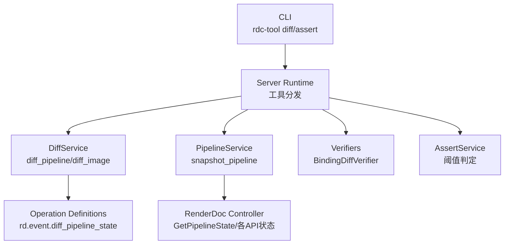
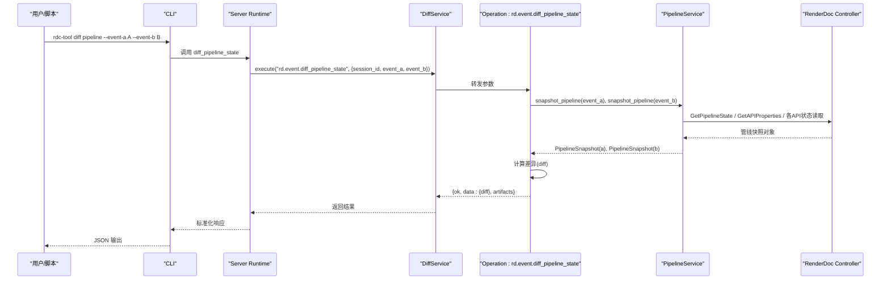
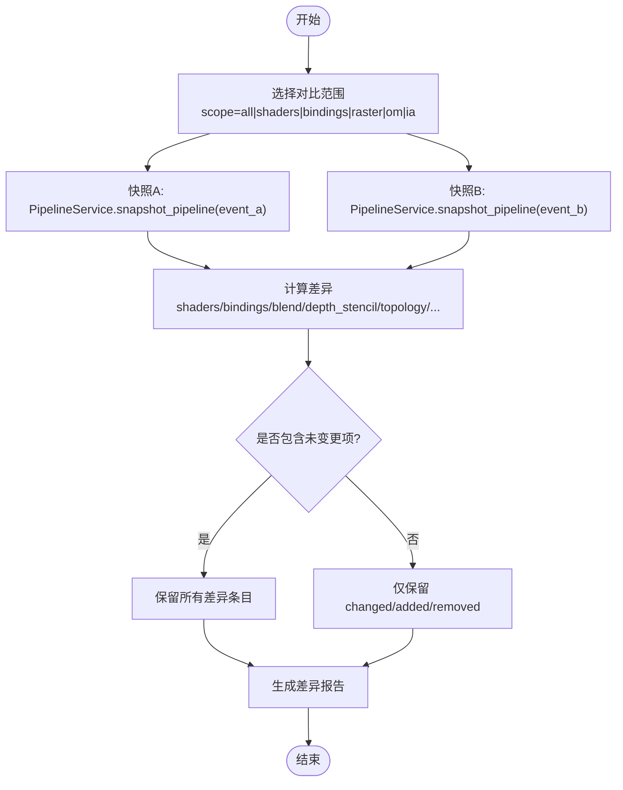
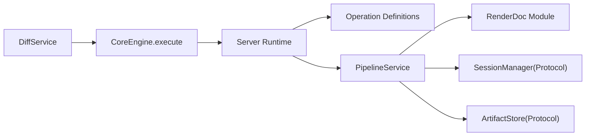

# 管线状态比较

<cite>
**本文引用的文件**
- [diff_service.py](file://rdc_tool/core/diff_service.py)
- [pipeline_service.py](file://rdc_tool/core/pipeline_service.py)
- [verifiers.py](file://rdc_tool/core/verifiers.py)
- [assert_service.py](file://rdc_tool/core/assert_service.py)
- [operation_definitions.py](file://rdc_tool/operation_definitions.py)
- [server_runtime.py](file://rdc_tool/server_runtime.py)
- [cli.py](file://rdc_tool/cli.py)
- [tool-interface-upgrade.md](file://docs/tool-interface-upgrade.md)
</cite>

## 目录
1. [简介](#简介)
2. [项目结构](#项目结构)
3. [核心组件](#核心组件)
4. [架构总览](#架构总览)
5. [详细组件分析](#详细组件分析)
6. [依赖关系分析](#依赖关系分析)
7. [性能考虑](#性能考虑)
8. [故障排查指南](#故障排查指南)
9. [结论](#结论)
10. [附录：使用示例与最佳实践](#附录使用示例与最佳实践)

## 简介
本文件面向“管线状态比较”能力，说明如何在同一回放会话中比较两个时间点（事件）或两个 Drawcall 之间的渲染管线状态差异。文档覆盖以下要点：
- 差异检测算法与精度控制
- 差异结果的可视化与报告生成
- 关键状态变化识别（着色器切换、混合模式改变等）
- 在回归测试与性能基准测试中的应用
- 具体比较示例与结果解读
- 性能考量与最佳实践

## 项目结构
围绕管线状态比较，代码主要分布在如下模块：
- 操作定义与工具注册：声明 diff_pipeline_state、find_state_change_point 等操作及其参数、返回值与作用域
- 服务层：DiffService 封装底层操作调用；PipelineService 负责从 RenderDoc 控制器读取管线快照
- 验证与断言：BindingDiffVerifier 用于资源绑定差异判定；AssertService 提供通过/失败判定与阈值控制
- 运行时调度：server_runtime 将工具名分发到对应实现
- CLI：提供命令行入口，支持 pipeline/image 差异对比与 assert 断言

图表来源
- [cli.py:1583-1604](file://rdc_tool/cli.py#L1583-L1604)
- [server_runtime.py:1-200](file://rdc_tool/server_runtime.py#L1-L200)
- [diff_service.py:11-51](file://rdc_tool/core/diff_service.py#L11-L51)
- [pipeline_service.py:597-702](file://rdc_tool/core/pipeline_service.py#L597-L702)
- [operation_definitions.py:867-874](file://rdc_tool/operation_definitions.py#L867-L874)

章节来源
- [operation_definitions.py:867-874](file://rdc_tool/operation_definitions.py#L867-L874)
- [diff_service.py:11-51](file://rdc_tool/core/diff_service.py#L11-L51)
- [pipeline_service.py:597-702](file://rdc_tool/core/pipeline_service.py#L597-L702)
- [cli.py:1583-1604](file://rdc_tool/cli.py#L1583-L1604)

## 核心组件
- DiffService：统一封装对 rd.event.diff_pipeline_state 和 rd.util.diff_images 的调用，屏蔽底层细节
- PipelineService：根据 sections 选择性采集管线状态（shaders、bindings、blend、depth_stencil、viewports_scissors、topology、rasterizer、multisample、push_constants、dynamic_state、root_signature、descriptor_heaps、resource_states），并映射不同 API（D3D11/D3D12/Vulkan/OpenGL）的具体字段
- Verifiers：BindingDiffVerifier 比较 good/bad 事件的资源绑定差异，输出 added/removed/changed
- AssertService：对 diff 结果进行阈值判定（如最大允许变更数、图像指标 MSE/PSNR/MaxAbs）
- Operation Definitions：声明 diff_pipeline_state、find_state_change_point 等操作的参数、返回与约束
- Server Runtime：工具路由与执行上下文管理
- CLI：暴露 diff/assert 子命令，便于自动化与脚本化

章节来源
- [diff_service.py:11-51](file://rdc_tool/core/diff_service.py#L11-L51)
- [pipeline_service.py:318-373](file://rdc_tool/core/pipeline_service.py#L318-L373)
- [pipeline_service.py:597-702](file://rdc_tool/core/pipeline_service.py#L597-L702)
- [verifiers.py:591-679](file://rdc_tool/core/verifiers.py#L591-L679)
- [assert_service.py:16-35](file://rdc_tool/core/assert_service.py#L16-L35)
- [operation_definitions.py:867-874](file://rdc_tool/operation_definitions.py#L867-L874)
- [operation_definitions.py:1461-1483](file://rdc_tool/operation_definitions.py#L1461-L1483)
- [server_runtime.py:1-200](file://rdc_tool/server_runtime.py#L1-L200)
- [cli.py:1583-1604](file://rdc_tool/cli.py#L1583-L1604)

## 架构总览
下图展示一次“比较两个事件管线状态”的端到端流程：CLI 发起请求，Server Runtime 路由到 DiffService，后者调用 rd.event.diff_pipeline_state；该操作内部通过 PipelineService 获取两个事件的管线快照，并进行差异计算，最终返回 diff 列表与元数据。

图表来源
- [cli.py:1583-1604](file://rdc_tool/cli.py#L1583-L1604)
- [diff_service.py:11-29](file://rdc_tool/core/diff_service.py#L11-L29)
- [operation_definitions.py:867-874](file://rdc_tool/operation_definitions.py#L867-L874)
- [pipeline_service.py:597-702](file://rdc_tool/core/pipeline_service.py#L597-L702)

## 详细组件分析

### 差异检测算法与精度控制
- 差异范围选择：operation_definitions 定义了 scope 参数（all/shaders/bindings/raster/om/ia），可限制对比范围，减少噪声
- 包含未变更项：include_unchanged 可选，默认 false，便于聚焦关键变更
- 快照粒度：PipelineService 按 sections 选择性采集，避免不必要的全量读取，提升性能与可控性
- 绑定差异：BindingDiffVerifier 将 good/bad 事件的 bindings 转为键值集合，统计 added/removed/changed，支持 set_or_space/binding/type/resource_id/array_index 等多维键
- 图像差异：DiffService 同时提供 rd.util.diff_images，结合 AssertService 的 MSE/PSNR/MaxAbs 阈值进行视觉一致性判定

图表来源
- [operation_definitions.py:867-874](file://rdc_tool/operation_definitions.py#L867-L874)
- [pipeline_service.py:318-373](file://rdc_tool/core/pipeline_service.py#L318-L373)
- [verifiers.py:641-679](file://rdc_tool/core/verifiers.py#L641-L679)

章节来源
- [operation_definitions.py:867-874](file://rdc_tool/operation_definitions.py#L867-L874)
- [pipeline_service.py:318-373](file://rdc_tool/core/pipeline_service.py#L318-L373)
- [verifiers.py:641-679](file://rdc_tool/core/verifiers.py#L641-L679)

### 关键状态变化识别
- 着色器切换：shaders 段包含 stage、entry_point、encoding、resource_id 等，差异即表明阶段着色器被替换
- 混合模式改变：blend 段包含 per-slot 的 blend 配置（src/dst/op、alpha、write_mask、logic_op），差异意味着混合策略变化
- 深度/模板状态：depth_stencil 段包含 depth_test/write、stencil、函数与面设置，差异影响深度/模板测试行为
- 拓扑与视口裁剪：topology/viewports_scissors 变化会影响顶点装配与可见区域
- 资源绑定：bindings 段记录只读/读写资源、常量缓冲、采样器的 set/space/binding/resource_id 等，差异可能引发数据源变化

章节来源
- [pipeline_service.py:597-702](file://rdc_tool/core/pipeline_service.py#L597-L702)
- [pipeline_service.py:193-250](file://rdc_tool/core/pipeline_service.py#L193-L250)
- [pipeline_service.py:376-385](file://rdc_tool/core/pipeline_service.py#L376-L385)
- [pipeline_service.py:392-502](file://rdc_tool/core/pipeline_service.py#L392-L502)

### 差异结果的可视化与报告生成
- 结构化 diff：rd.event.diff_pipeline_state 返回 data.diff 列表，每项描述一个差异点（如 shaders/bindings/blend 等）
- 图像差异：rd.util.diff_images 可输出差异图与指标（MSE/PSNR/MaxAbs），配合 AssertService 阈值判定
- CLI 集成：rdc-tool diff pipeline/image 直接输出 JSON；rdc-tool assert pipeline/image 以 0/1/2 退出码表达通过/失败/错误
- 专家级搜索：rd.macro.find_state_change_point 可在事件区间内二分/线性扫描定位“某状态何时从 A 变为 B”，辅助快速定位问题

章节来源
- [operation_definitions.py:867-874](file://rdc_tool/operation_definitions.py#L867-L874)
- [operation_definitions.py:1461-1483](file://rdc_tool/operation_definitions.py#L1461-L1483)
- [cli.py:1583-1604](file://rdc_tool/cli.py#L1583-L1604)
- [assert_service.py:16-35](file://rdc_tool/core/assert_service.py#L16-L35)

### 实际应用场景
- 回归测试：在 CI 中运行 rdc-tool assert pipeline，设置 max_changes=0 确保无意外状态变更；或允许少量已知变更
- 性能基准测试：结合 find_state_change_point 定位导致性能回退的状态突变点；用 perf 相关工具采样计数器
- 问题诊断：通过 scope 限定对比范围，聚焦 shaders/bindings/blend 等关键段；结合图像 diff 确认视觉影响

章节来源
- [operation_definitions.py:1461-1483](file://rdc_tool/operation_definitions.py#L1461-L1483)
- [cli.py:1583-1604](file://rdc_tool/cli.py#L1583-L1604)
- [assert_service.py:16-35](file://rdc_tool/core/assert_service.py#L16-L35)

## 依赖关系分析
- 低耦合：DiffService 仅依赖 CoreEngine.execute，不感知具体实现；PipelineService 通过 Protocol 抽象 SessionManager/ArtifactStore，便于替换
- 外部依赖：renderdoc Python 模块用于读取管线状态；不同 API（D3D11/D3D12/Vulkan/OpenGL）通过 _get_api_specific_state 分支处理
- 工具注册：server_runtime 基于 catalog 注册工具，保证可扩展性与版本演进

图表来源
- [diff_service.py:11-51](file://rdc_tool/core/diff_service.py#L11-L51)
- [pipeline_service.py:56-82](file://rdc_tool/core/pipeline_service.py#L56-L82)
- [pipeline_service.py:175-186](file://rdc_tool/core/pipeline_service.py#L175-L186)
- [server_runtime.py:1-200](file://rdc_tool/server_runtime.py#L1-L200)

章节来源
- [pipeline_service.py:56-82](file://rdc_tool/core/pipeline_service.py#L56-L82)
- [pipeline_service.py:175-186](file://rdc_tool/core/pipeline_service.py#L175-L186)
- [server_runtime.py:1-200](file://rdc_tool/server_runtime.py#L1-L200)

## 性能考虑
- 按需采集：通过 sections 参数仅读取需要的管线段，减少跨 API 的昂贵调用
- 范围限定：使用 scope 缩小对比范围，降低 diff 计算开销
- 跳过无关项：include_unchanged=false 可减少输出体积
- 采样与预算：find_state_change_point 支持 stride/max_events 等参数，控制扫描成本
- 异步与线程：PipelineService 使用 asyncio.to_thread 调用 RenderDoc 同步接口，避免阻塞事件循环

章节来源
- [pipeline_service.py:597-702](file://rdc_tool/core/pipeline_service.py#L597-L702)
- [operation_definitions.py:1461-1483](file://rdc_tool/operation_definitions.py#L1461-L1483)

## 故障排查指南
- 无法加载 renderdoc 模块：PipelineService 会抛出 ImportError，需确保在 RenderDoc replay 环境或正确设置 PYTHONPATH
- 读取失败：各 API 状态读取处捕获 AttributeError/TypeError 并抛出 RuntimeError，建议检查 API 类型与版本兼容性
- 差异为空但预期有变更：确认 scope/sections 是否覆盖目标段；必要时扩大范围或启用 include_unchanged
- 图像差异误报：调整 AssertService 阈值（mse_max/psnr_min/max_abs_max）或使用 ROI/通道过滤

章节来源
- [pipeline_service.py:34-48](file://rdc_tool/core/pipeline_service.py#L34-L48)
- [pipeline_service.py:193-250](file://rdc_tool/core/pipeline_service.py#L193-L250)
- [assert_service.py:37-78](file://rdc_tool/core/assert_service.py#L37-L78)

## 结论
本项目的管线状态比较能力通过“操作定义 + 服务层 + 验证器 + CLI”的分层设计，提供了灵活、可控且可扩展的差异检测方案。借助 sections/scope/阈值控制，既能满足回归测试的严格性，也能支撑性能基准与问题诊断的灵活性。推荐在实践中优先使用最小必要范围与阈值，以获得高效可靠的比较结果。

## 附录：使用示例与最佳实践
- 比较两个事件管线状态
  - 使用 CLI：rdc-tool diff pipeline --event-a A --event-b B
  - 使用服务：DiffService.diff_pipeline(session_id, event_a, event_b)
  - 关注重点：shaders/bindings/blend/depth_stencil/topology 等关键段
- 查找状态变化点
  - 使用 rd.macro.find_state_change_point 在事件区间内定位“某状态何时从 A 变为 B”
- 断言与阈值
  - rdc-tool assert pipeline --max-changes N：允许最多 N 处变更
  - rdc-tool assert image --mse-max/--psnr-min/--max-abs-max：图像指标阈值
- 最佳实践
  - 明确 scope/sections，避免全量对比
  - 使用 include_unchanged=false 聚焦变更
  - 在 CI 中固定阈值，确保回归稳定性
  - 结合图像 diff 与管线 diff 双重验证

章节来源
- [cli.py:1583-1604](file://rdc_tool/cli.py#L1583-L1604)
- [operation_definitions.py:867-874](file://rdc_tool/operation_definitions.py#L867-L874)
- [operation_definitions.py:1461-1483](file://rdc_tool/operation_definitions.py#L1461-L1483)
- [assert_service.py:16-78](file://rdc_tool/core/assert_service.py#L16-L78)