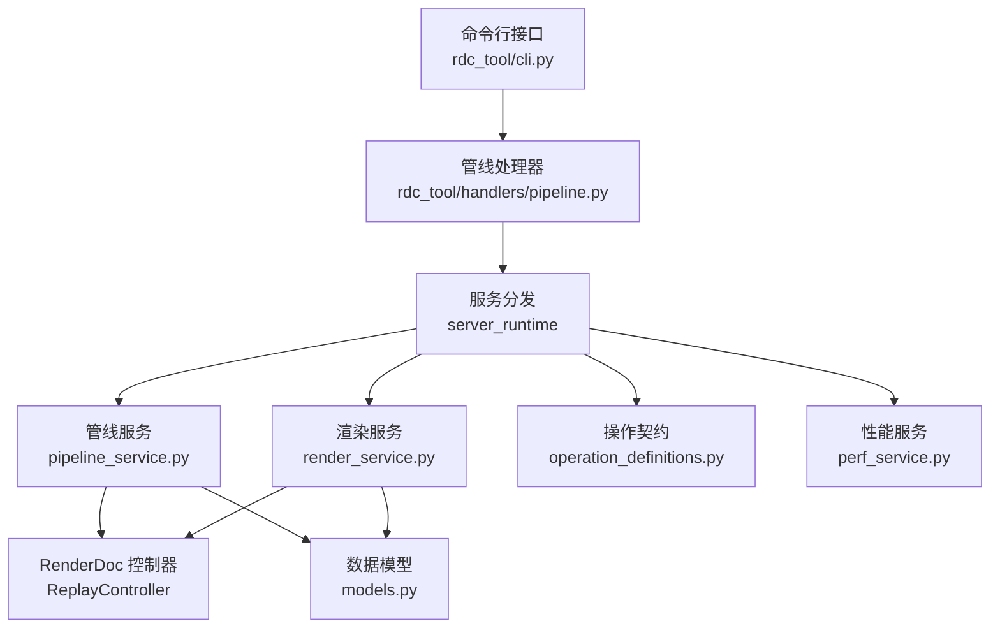
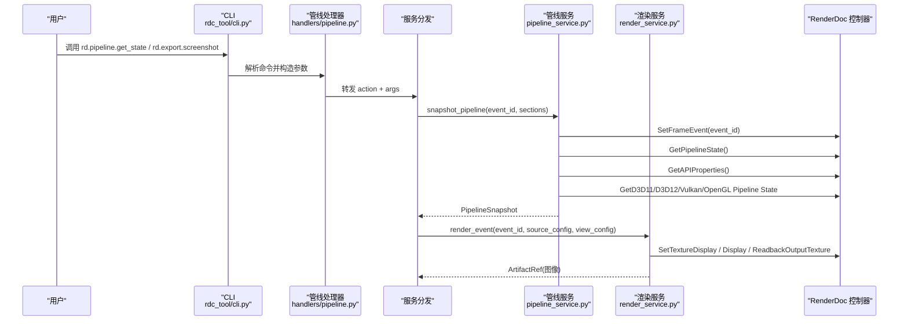
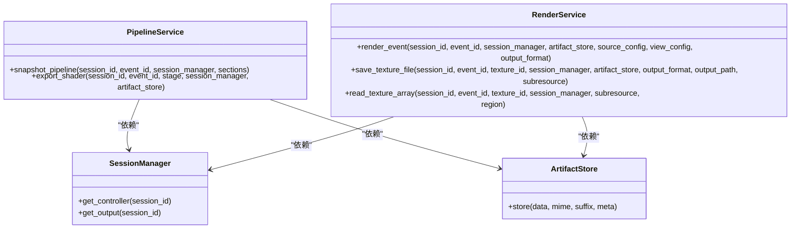

# 管线阶段详解

<cite>
**本文引用的文件**
- [pipeline_service.py](file://rdc_tool/core/pipeline_service.py)
- [render_service.py](file://rdc_tool/core/render_service.py)
- [models.py](file://rdc_tool/models.py)
- [operation_definitions.py](file://rdc_tool/operation_definitions.py)
- [perf_service.py](file://rdc_tool/core/perf_service.py)
- [pipeline.py](file://rdc_tool/handlers/pipeline.py)
- [cli.py](file://rdc_tool/cli.py)
</cite>

## 目录
1. [简介](#简介)
2. [项目结构](#项目结构)
3. [核心组件](#核心组件)
4. [架构总览](#架构总览)
5. [详细组件分析](#详细组件分析)
6. [依赖关系分析](#依赖关系分析)
7. [性能考量](#性能考量)
8. [故障排查指南](#故障排查指南)
9. [结论](#结论)
10. [附录](#附录)

## 简介
本文面向希望在 RenderDoc 回放环境中理解并操作 GPU 渲染管线的开发者与测试工程师，系统性说明 RDC-Tool 中“管线各阶段”的查询、分析与可视化能力。内容覆盖顶点输入装配、顶点着色器、几何着色器（如启用）、光栅化、片段着色器等关键阶段的功能、输入输出数据流、配置选项、阶段间依赖与数据传递机制，以及 OpenGL/DirectX/Vulkan 在管线实现上的差异。同时提供可执行的 API 调用示例路径，帮助读者定位和分析各阶段的执行状态。

## 项目结构
RDC-Tool 将管线相关能力集中在 core 层的服务模块中：
- pipeline_service：封装管线状态快照、着色器导出、阶段绑定与反射信息提取。
- render_service：负责无头渲染、纹理读取、像素级检查与图像导出。
- models：定义管线快照、着色器信息、混合/深度模板状态等数据结构。
- operation_definitions：对外暴露的操作契约（工具名、参数、返回值、作用域）。
- perf_service：基于 RenderDoc 原生计数器进行整帧 GPU 耗时测量。
- handlers/pipeline：路由到 server_runtime 的分发入口。
- cli：命令行解析与工具映射。

图表来源
- [pipeline_service.py:590-702](file://rdc_tool/core/pipeline_service.py#L590-L702)
- [render_service.py:346-521](file://rdc_tool/core/render_service.py#L346-L521)
- [models.py:224-313](file://rdc_tool/models.py#L224-L313)
- [operation_definitions.py:1887-1934](file://rdc_tool/operation_definitions.py#L1887-L1934)
- [perf_service.py:28-63](file://rdc_tool/core/perf_service.py#L28-L63)

章节来源
- [pipeline_service.py:590-702](file://rdc_tool/core/pipeline_service.py#L590-L702)
- [render_service.py:346-521](file://rdc_tool/core/render_service.py#L346-L521)
- [models.py:224-313](file://rdc_tool/models.py#L224-L313)
- [operation_definitions.py:1887-1934](file://rdc_tool/operation_definitions.py#L1887-L1934)
- [perf_service.py:28-63](file://rdc_tool/core/perf_service.py#L28-L63)

## 核心组件
- PipelineService：提供 snapshot_pipeline/export_shader 等方法，按事件导航到指定 draw-call，获取管线状态、着色器、资源绑定、视口/裁剪、拓扑、混合/深度模板、光栅化/多重采样、Push Constants、动态状态、根签名、描述符堆、资源状态等。
- RenderService：提供 render_event/save_texture_file/read_texture_array 等方法，用于无头渲染、纹理保存、像素读取与统计。
- Models：统一的数据结构，包括 ShaderInfo、ResourceBindingEntry、BlendState、DepthStencilState、RenderTargetInfo、PipelineSnapshot、ShaderExportBundle 等。
- Operation Definitions：声明了 rd.pipeline.get_state、rd.pipeline.get_stage_state、rd.pipeline.get_vertex_buffers、rd.perf.get_frame_timing 等操作契约。
- PerfService：通过 RenderDoc 的 GPU 计数器测量整帧耗时，支持 warmup/samples 控制。

章节来源
- [pipeline_service.py:590-702](file://rdc_tool/core/pipeline_service.py#L590-L702)
- [render_service.py:346-521](file://rdc_tool/core/render_service.py#L346-L521)
- [models.py:224-313](file://rdc_tool/models.py#L224-L313)
- [operation_definitions.py:1887-1934](file://rdc_tool/operation_definitions.py#L1887-L1934)
- [perf_service.py:28-63](file://rdc_tool/core/perf_service.py#L28-L63)

## 架构总览
下图展示了从 CLI 到管线服务的调用链，以及在管线快照过程中对 RenderDoc 控制器的访问顺序。

图表来源
- [pipeline_service.py:590-702](file://rdc_tool/core/pipeline_service.py#L590-L702)
- [render_service.py:357-521](file://rdc_tool/core/render_service.py#L357-L521)
- [cli.py:971-1001](file://rdc_tool/cli.py#L971-L1001)

## 详细组件分析

### 顶点输入装配阶段（Vertex Input Assembly）
- 功能：描述顶点缓冲布局、输入槽位、步长、偏移、拓扑类型（点/线/三角等），为后续着色器阶段提供顶点数据。
- 输入：顶点缓冲区绑定、输入布局描述、索引缓冲（可选）。
- 输出：装配后的图元序列（供光栅化前使用）。
- 配置选项：
  - 拓扑：通过 _extract_topology 获取 D3D11/D3D12/Vulkan/OpenGL 的 inputAssembly.topology 或 vertexInput.topology。
  - 顶点输入：通过 pipe.GetVertexInputs() 获取每个槽位的布局。
- 数据流：顶点缓冲 -> 输入装配 -> 顶点着色器。
- 依赖关系：依赖于顶点缓冲绑定与输入布局；影响后续 VS/GS 的输入语义。
- 性能特征：装配开销通常较低，但错误的拓扑会导致大量无效图元，增加后续阶段压力。
- 优化建议：
  - 确保拓扑与实际绘制一致，避免过度细分。
  - 减少不必要的顶点属性，降低带宽与缓存压力。
- API 调用示例：
  - 查询顶点输入：参见操作契约中的“获取当前绑定的 Vertex Buffers 列表”。
  - 获取拓扑：通过 get_state 的 sections 包含 topology。

章节来源
- [pipeline_service.py:376-385](file://rdc_tool/core/pipeline_service.py#L376-L385)
- [pipeline_service.py:697-702](file://rdc_tool/core/pipeline_service.py#L697-L702)
- [operation_definitions.py:1935-1940](file://rdc_tool/operation_definitions.py#L1935-L1940)

### 顶点着色器阶段（Vertex Shader）
- 功能：处理顶点位置、法线、UV 等属性，输出变换后的顶点数据。
- 输入：来自输入装配的顶点数据、常量缓冲、纹理/采样器绑定。
- 输出：顶点流（可能包含 GS 所需的额外信息）。
- 配置选项：
  - 着色器资源绑定：通过 _collect_bindings_for_stage 收集 SRV/UAV/CBV/Sampler。
  - 反射信息：entry point、常量块、资源列表。
- 数据流：输入装配 -> VS -> （可选）几何着色器。
- 依赖关系：依赖顶点输入、常量缓冲、资源绑定；GS 若启用则依赖 VS 输出。
- 性能特征：VS 通常是并行度高的阶段，瓶颈多在于内存带宽与寄存器压力。
- 优化建议：
  - 合并常量缓冲，减少绑定数量。
  - 避免在 VS 中进行昂贵计算，尽量下推到后续阶段或 CPU。
- API 调用示例：
  - 获取阶段着色器：rd.pipeline.get_stage_state(stage="vs")。
  - 导出着色器反射：export_shader(stage="vs")。

章节来源
- [pipeline_service.py:98-139](file://rdc_tool/core/pipeline_service.py#L98-L139)
- [pipeline_service.py:392-502](file://rdc_tool/core/pipeline_service.py#L392-L502)
- [pipeline_service.py:708-772](file://rdc_tool/core/pipeline_service.py#L708-L772)
- [operation_definitions.py:1821-1847](file://rdc_tool/operation_definitions.py#L1821-L1847)

### 几何着色器阶段（Geometry Shader，可选）
- 功能：接收图元（点/线/三角），生成新的图元（如实例化、边缘检测、体积投影）。
- 输入：来自 VS 的图元。
- 输出：新的图元流（供光栅化阶段）。
- 配置选项：
  - 是否启用 GS：取决于应用管线状态；RDC-Tool 通过阶段枚举与反射判断是否存在 GS。
- 数据流：VS -> GS（可选）-> 光栅化。
- 依赖关系：依赖 VS 输出；若未启用则跳过。
- 性能特征：GS 可能显著放大图元数量，需谨慎使用。
- 优化建议：
  - 仅在必要时启用 GS，避免过度实例化。
  - 将复杂逻辑移至 TCS/TESS 或 PS。
- API 调用示例：
  - 查询阶段状态：rd.pipeline.get_stage_state(stage="gs")。
  - 导出着色器：export_shader(stage="gs")。

章节来源
- [pipeline_service.py:87-108](file://rdc_tool/core/pipeline_service.py#L87-L108)
- [pipeline_service.py:621-644](file://rdc_tool/core/pipeline_service.py#L621-L644)

### 光栅化阶段（Rasterizer）
- 功能：将图元转换为片段（像素候选），处理视口、裁剪、背面剔除、深度/模板测试、多重采样等。
- 输入：图元流、视口/裁剪矩形、混合/深度模板状态。
- 输出：片段流（供片段着色器）。
- 配置选项：
  - 视口/裁剪：_extract_viewport/_extract_scissor 获取 API 特定状态。
  - 混合：_extract_blend_state 获取每通道混合方程与写掩码。
  - 深度模板：_extract_depth_stencil 获取深度/模板开关与函数。
  - 多重采样：multisample 状态。
- 数据流：图元 -> 光栅化 -> 片段着色器。
- 依赖关系：依赖拓扑、视口/裁剪、混合/深度模板、多重采样状态。
- 性能特征：光栅化是吞吐密集阶段，受屏幕覆盖率、overdraw、混合复杂度影响。
- 优化建议：
  - 合理设置视口/裁剪，减少无效片段。
  - 禁用不必要的混合/深度测试以降低带宽。
  - 控制多重采样级别，避免过度采样。
- API 调用示例：
  - 获取光栅化状态：get_state(sections=["rasterizer","multisample"])。
  - 获取视口/裁剪：get_state(sections=["viewports_scissors"])。
  - 获取混合/深度模板：get_state(sections=["blend","depth_stencil"])。

章节来源
- [pipeline_service.py:193-250](file://rdc_tool/core/pipeline_service.py#L193-L250)
- [pipeline_service.py:302-315](file://rdc_tool/core/pipeline_service.py#L302-L315)
- [pipeline_service.py:318-373](file://rdc_tool/core/pipeline_service.py#L318-L373)
- [pipeline_service.py:646-702](file://rdc_tool/core/pipeline_service.py#L646-L702)

### 片段着色器阶段（Pixel/Fragment Shader）
- 功能：为每个片段计算颜色、透明度等最终输出值。
- 输入：光栅化产生的片段、纹理/采样器、常量缓冲。
- 输出：颜色目标（可能写入深度/模板）。
- 配置选项：
  - 资源绑定：SRV/UAV/CBV/Sampler 的集合与格式。
  - 输出目标：颜色/深度目标的资源 ID、格式、尺寸。
- 数据流：光栅化 -> PS -> 输出目标。
- 依赖关系：依赖光栅化状态、资源绑定、输出目标。
- 性能特征：PS 是计算密集阶段，受纹理采样、分支、精度影响。
- 优化建议：
  - 减少纹理采样次数，合并常量缓冲。
  - 使用合适的精度与格式，避免不必要的浮点运算。
  - 利用早 Z/延迟 Z 等硬件特性。
- API 调用示例：
  - 获取阶段着色器：rd.pipeline.get_stage_state(stage="ps")。
  - 导出着色器：export_shader(stage="ps")。
  - 查看输出目标：snapshot_pipeline 返回 render_targets/depth_target。

章节来源
- [pipeline_service.py:252-295](file://rdc_tool/core/pipeline_service.py#L252-L295)
- [pipeline_service.py:621-644](file://rdc_tool/core/pipeline_service.py#L621-L644)
- [models.py:270-300](file://rdc_tool/models.py#L270-L300)

### 阶段间依赖与数据传递机制
- 输入装配 -> 顶点着色器：顶点数据与布局决定 VS 输入语义。
- 顶点着色器 -> 几何着色器（可选）：VS 输出作为 GS 输入。
- 几何着色器 -> 光栅化：GS 输出图元进入光栅化。
- 光栅化 -> 片段着色器：片段候选与状态（混合/深度模板）驱动 PS 计算。
- 片段着色器 -> 输出目标：写入颜色/深度目标。
- 数据传递：通过 RenderDoc 的管线状态对象在各阶段间传递；RDC-Tool 通过 API 特定的状态提取函数统一抽象。

章节来源
- [pipeline_service.py:175-186](file://rdc_tool/core/pipeline_service.py#L175-L186)
- [pipeline_service.py:318-373](file://rdc_tool/core/pipeline_service.py#L318-L373)

### 不同渲染 API 的差异
- OpenGL：
  - 光栅化状态位于 rasterizer.state；混合状态位于 framebuffer.blendState；深度模板状态位于 stencilState/depthState。
  - 顶点输入拓扑位于 vertexInput.topology。
- DirectX 11/12：
  - 光栅化状态位于 rasterizer.state；混合状态位于 outputMerger.blendState；深度模板状态位于 outputMerger.depthStencilState。
  - 拓扑位于 inputAssembly.topology。
- Vulkan：
  - 光栅化状态位于 rasterizer；混合状态位于 colorBlend；深度模板状态位于 depthStencil。
  - 视口/裁剪位于 viewportScissor.viewportScissors。
  - Push Constants 与动态状态通过 pushconsts/dynamic_state 提供。
- RDC-Tool 通过 _map_graphics_api 与 _state_section 统一抽象，屏蔽 API 差异。

章节来源
- [pipeline_service.py:146-155](file://rdc_tool/core/pipeline_service.py#L146-L155)
- [pipeline_service.py:193-250](file://rdc_tool/core/pipeline_service.py#L193-L250)
- [pipeline_service.py:302-315](file://rdc_tool/core/pipeline_service.py#L302-L315)
- [pipeline_service.py:318-373](file://rdc_tool/core/pipeline_service.py#L318-L373)

## 依赖关系分析
- PipelineService 依赖 SessionManager 获取 ReplayController/ReplayOutput。
- RenderService 依赖 SessionManager 与 ArtifactStore 完成渲染与持久化。
- 两者均通过延迟导入 renderdoc 模块，确保在无回放环境也能加载。
- 操作契约（operation_definitions）定义了外部工具的输入/输出与作用域，便于 CLI 与服务层解耦。

图表来源
- [pipeline_service.py:590-702](file://rdc_tool/core/pipeline_service.py#L590-L702)
- [render_service.py:346-521](file://rdc_tool/core/render_service.py#L346-L521)

章节来源
- [pipeline_service.py:590-702](file://rdc_tool/core/pipeline_service.py#L590-L702)
- [render_service.py:346-521](file://rdc_tool/core/render_service.py#L346-L521)

## 性能考量
- 整帧 GPU 耗时测量：
  - 使用 perf_service.measure_frame_gpu 获取单队列完整回放的 GPU 时间戳，支持 samples/warmup 控制。
  - 适用于定位慢帧与回归检测。
- 事件级耗时：
  - 通过 rd.perf.get_event_durations 获取每个事件的 GPU duration（若支持 timing queries）。
- 光栅化与混合：
  - 高 overdraw 与复杂混合会增加带宽压力；应结合视口/裁剪与混合开关优化。
- 着色器：
  - 减少纹理采样与分支；合并常量缓冲；选择合适的精度。
- 资源绑定：
  - 减少绑定数量与更新频率；利用 descriptor heaps/root signatures 提升效率。

章节来源
- [perf_service.py:28-63](file://rdc_tool/core/perf_service.py#L28-L63)
- [operation_definitions.py:1648-1659](file://rdc_tool/operation_definitions.py#L1648-L1659)

## 故障排查指南
- 无法加载 renderdoc 模块：
  - 错误提示会明确指出缺少 renderdoc Python 模块或共享库路径问题。
  - 解决：确保在 RenderDoc 回放上下文运行或将共享库目录加入 sys.path/PYTHONPATH。
- 管线状态读取失败：
  - 混合/深度/视口读取异常会抛出 RuntimeError，需检查 API 特定状态结构与版本兼容性。
- 纹理导出失败：
  - SaveTexture 返回的状态会被包装为 RuntimeToolError，包含后端类型、捕获上下文、RenderDoc 状态码与修复建议。
- 像素读取格式不支持：
  - 当纹理分量类型或格式不被支持时，read_texture_array 会抛出 ValueError，需调整格式或降级处理。

章节来源
- [pipeline_service.py:34-48](file://rdc_tool/core/pipeline_service.py#L34-L48)
- [pipeline_service.py:193-250](file://rdc_tool/core/pipeline_service.py#L193-L250)
- [render_service.py:523-646](file://rdc_tool/core/render_service.py#L523-L646)
- [render_service.py:658-769](file://rdc_tool/core/render_service.py#L658-L769)

## 结论
RDC-Tool 通过 PipelineService 与 RenderService 提供了完整的管线阶段查询、分析与可视化能力，屏蔽了 OpenGL/DirectX/Vulkan 的差异，并以统一的模型表达管线状态。借助操作契约与 CLI，用户可以便捷地定位问题、优化性能并验证修复效果。建议在开发流程中结合整帧与事件级性能测量，配合资源绑定与光栅化状态调优，以获得稳定高效的渲染表现。

## 附录

### 常用 API 调用示例（路径引用）
- 查询管线状态：
  - 操作：rd.pipeline.get_state
  - 参数：session_id, event_id, context_id, detail, sections
  - 参考：[operation_definitions.py:1887-1934](file://rdc_tool/operation_definitions.py#L1887-L1934)
- 查询阶段着色器：
  - 操作：rd.pipeline.get_stage_state
  - 参数：session_id, stage, event_id
  - 参考：[operation_definitions.py:1821-1847](file://rdc_tool/operation_definitions.py#L1821-L1847)
- 导出着色器反射与反汇编：
  - 方法：PipelineService.export_shader
  - 参考：[pipeline_service.py:708-800](file://rdc_tool/core/pipeline_service.py#L708-L800)
- 无头渲染截图：
  - 方法：RenderService.render_event
  - 参考：[render_service.py:357-521](file://rdc_tool/core/render_service.py#L357-L521)
- 纹理保存与读取：
  - 方法：RenderService.save_texture_file / read_texture_array
  - 参考：[render_service.py:523-769](file://rdc_tool/core/render_service.py#L523-L769)
- 整帧 GPU 耗时测量：
  - 方法：perf_service.measure_frame_gpu
  - 参考：[perf_service.py:28-63](file://rdc_tool/core/perf_service.py#L28-L63)