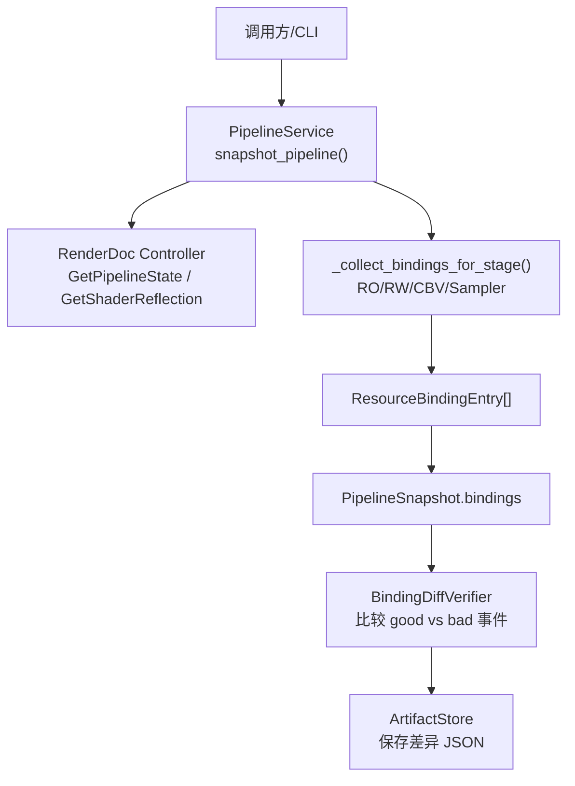
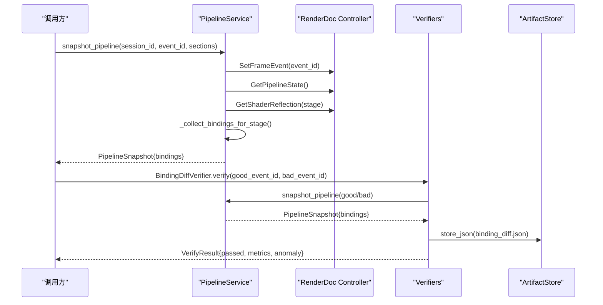
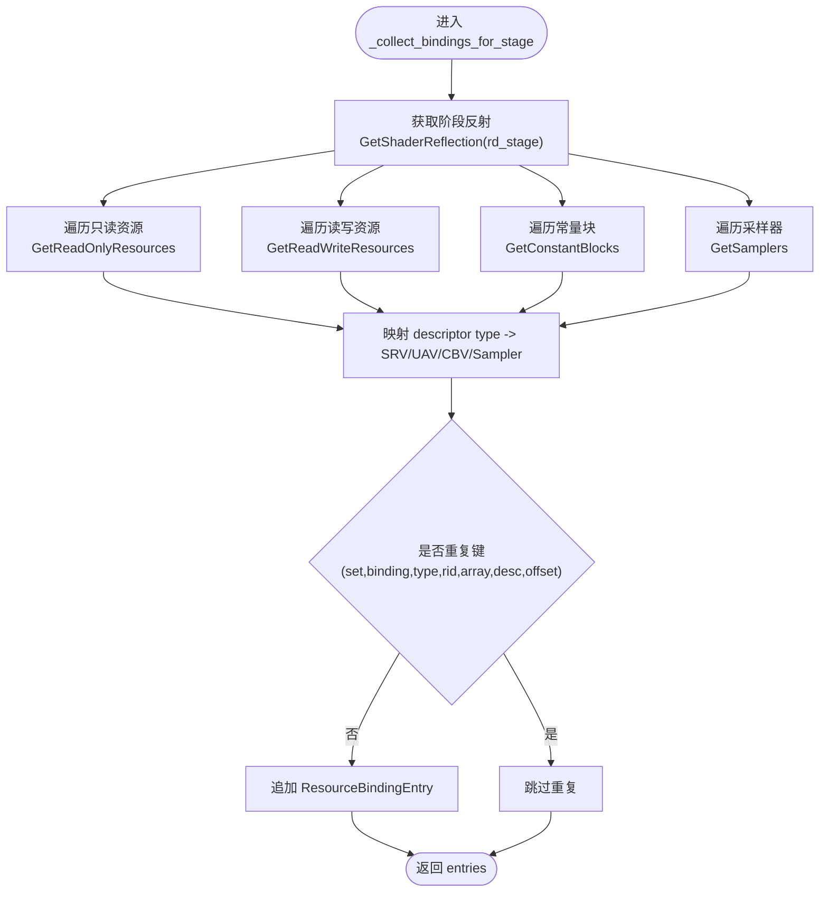
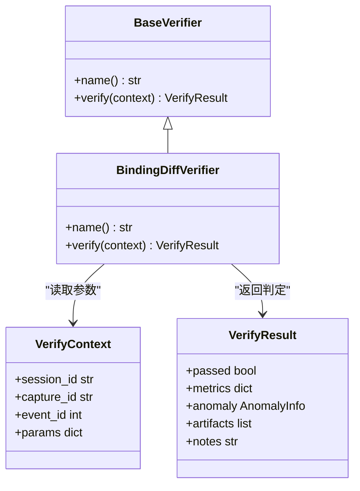
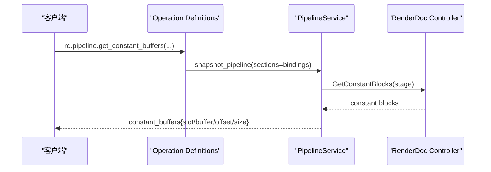
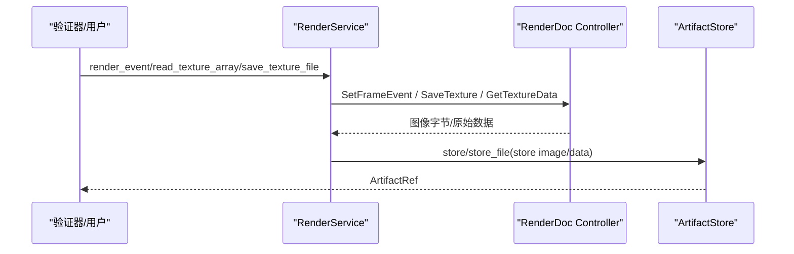
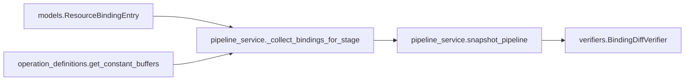

# 资源绑定检查

<cite>
**本文引用的文件**
- [pipeline_service.py](file://rdx/core/pipeline_service.py)
- [verifiers.py](file://rdx/core/verifiers.py)
- [models.py](file://rdx/models.py)
- [render_service.py](file://rdx/core/render_service.py)
- [operation_definitions.py](file://rdx/operation_definitions.py)
- [tool-interface-upgrade.md](file://docs/tool-interface-upgrade.md)
</cite>

## 目录
1. [简介](#简介)
2. [项目结构](#项目结构)
3. [核心组件](#核心组件)
4. [架构总览](#架构总览)
5. [详细组件分析](#详细组件分析)
6. [依赖关系分析](#依赖关系分析)
7. [性能考虑](#性能考虑)
8. [故障排查指南](#故障排查指南)
9. [结论](#结论)
10. [附录](#附录)

## 简介
本文件聚焦“资源绑定检查”能力，围绕 GPU 资源的绑定机制、验证流程、生命周期与内存监控、性能影响与优化策略、问题诊断与修复步骤，以及不同渲染 API 的最佳实践进行系统化说明。内容基于代码库中的管线状态采集、资源绑定提取、差异比较与可插拔验证器实现，并结合文档中对采样器、常量缓冲区、描述符堆等能力的边界说明，形成从数据采集到诊断闭环的完整指南。

## 项目结构
与资源绑定检查直接相关的模块分布如下：
- 管线状态与绑定采集：PipelineService 负责在回放中定位事件、获取管线状态并提取各阶段资源绑定（只读纹理 SRV、读写纹理/缓冲 UAV、常量缓冲区 CBV、采样器 Sampler）。
- 数据模型：ResourceBindingEntry、PipelineSnapshot 等结构化类型承载绑定条目与快照。
- 验证器：BindingDiffVerifier 对两个事件的绑定进行差异比对，输出新增、移除、变更项。
- 渲染服务：提供纹理读取、导出与像素级检查，辅助绑定问题的可视化与证据留存。
- 操作定义：暴露常量缓冲区读取等工具接口，便于按需解码常量值。
- 升级文档：明确当前绑定采集的覆盖范围与已知缺口（例如采样器采集调用情况、顶点输入布局等）。

图表来源
- [pipeline_service.py:597-702](file://rdx/core/pipeline_service.py#L597-L702)
- [pipeline_service.py:392-502](file://rdx/core/pipeline_service.py#L392-L502)
- [verifiers.py:591-757](file://rdx/core/verifiers.py#L591-L757)
- [models.py:232-300](file://rdx/models.py#L232-L300)

章节来源
- [pipeline_service.py:597-702](file://rdx/core/pipeline_service.py#L597-L702)
- [pipeline_service.py:392-502](file://rdx/core/pipeline_service.py#L392-L502)
- [verifiers.py:591-757](file://rdx/core/verifiers.py#L591-L757)
- [models.py:232-300](file://rdx/models.py#L232-L300)

## 核心组件
- PipelineService.snapshot_pipeline
  - 作用：导航到指定事件，获取管线状态，按 sections 提取着色器、输出目标、拓扑、视口/裁剪、混合、深度模板、绑定、顶点输入及 API 专属状态。
  - 关键点：通过 _collect_bindings_for_stage 统一收集各阶段的资源绑定；将结果写入 PipelineSnapshot.bindings。
- _collect_bindings_for_stage
  - 作用：针对给定阶段，遍历只读资源、读写资源、常量块、采样器，映射为 ResourceBindingEntry。
  - 关键点：使用反射信息（名称、固定绑定号/集合）与描述符访问信息共同构建条目；支持去重与元数据附加。
- BindingDiffVerifier
  - 作用：对比两个事件的绑定快照，统计新增、移除、变更的绑定项，生成可持久化的差异 artifact。
  - 关键点：以 (set_or_space, binding, type) 作为键，比较 resource_id 与 format 变化。
- RenderService
  - 作用：提供纹理导出、像素读取与统计，用于绑定问题的可视化与证据留存。
- 操作定义（常量缓冲区）
  - 作用：暴露按 stage/slot 读取常量缓冲区内容的工具，支持变量解码与大小限制，避免超大 CB 导致内存压力。

章节来源
- [pipeline_service.py:597-702](file://rdx/core/pipeline_service.py#L597-L702)
- [pipeline_service.py:392-502](file://rdx/core/pipeline_service.py#L392-L502)
- [verifiers.py:591-757](file://rdx/core/verifiers.py#L591-L757)
- [render_service.py:357-521](file://rdx/core/render_service.py#L357-L521)
- [operation_definitions.py:1715-1732](file://rdx/operation_definitions.py#L1715-L1732)

## 架构总览
下图展示了从事件导航到绑定采集、再到差异验证与证据存储的整体流程。

图表来源
- [pipeline_service.py:597-702](file://rdx/core/pipeline_service.py#L597-L702)
- [pipeline_service.py:392-502](file://rdx/core/pipeline_service.py#L392-L502)
- [verifiers.py:606-757](file://rdx/core/verifiers.py#L606-L757)

## 详细组件分析

### 资源绑定采集：_collect_bindings_for_stage
该函数是绑定检查的核心采集器，负责将运行时绑定转换为结构化条目。

图表来源
- [pipeline_service.py:392-502](file://rdx/core/pipeline_service.py#L392-L502)

章节来源
- [pipeline_service.py:392-502](file://rdx/core/pipeline_service.py#L392-L502)

### 绑定差异验证：BindingDiffVerifier
该验证器用于比较两个事件的绑定差异，帮助快速定位渲染错误与回归。

图表来源
- [verifiers.py:68-79](file://rdx/core/verifiers.py#L68-L79)
- [verifiers.py:591-757](file://rdx/core/verifiers.py#L591-L757)

章节来源
- [verifiers.py:591-757](file://rdx/core/verifiers.py#L591-L757)

### 常量缓冲区读取：rd.pipeline.get_constant_buffers
该工具允许按阶段和槽位读取常量缓冲区内容，并可选择解码变量值，适合高级核对。

图表来源
- [operation_definitions.py:1715-1732](file://rdx/operation_definitions.py#L1715-L1732)
- [pipeline_service.py:392-502](file://rdx/core/pipeline_service.py#L392-L502)

章节来源
- [operation_definitions.py:1715-1732](file://rdx/operation_definitions.py#L1715-L1732)
- [pipeline_service.py:392-502](file://rdx/core/pipeline_service.py#L392-L502)

### 纹理与像素证据：RenderService
当绑定问题需要可视化证据时，可使用 RenderService 导出纹理或读取像素数组，结合统计与掩码生成 artifact。

图表来源
- [render_service.py:357-521](file://rdx/core/render_service.py#L357-L521)
- [render_service.py:523-646](file://rdx/core/render_service.py#L523-L646)
- [render_service.py:658-794](file://rdx/core/render_service.py#L658-L794)

章节来源
- [render_service.py:357-521](file://rdx/core/render_service.py#L357-L521)
- [render_service.py:523-646](file://rdx/core/render_service.py#L523-L646)
- [render_service.py:658-794](file://rdx/core/render_service.py#L658-L794)

## 依赖关系分析
- PipelineService 依赖 RenderDoc Controller 提供的管线状态与反射接口，并通过 _collect_bindings_for_stage 统一抽象多 API 差异。
- BindingDiffVerifier 依赖 PipelineService 的快照能力，并以 ResourceBindingEntry 的结构化字段进行比较。
- models.py 定义了 ResourceBindingEntry、PipelineSnapshot 等关键数据结构，确保跨模块一致的数据契约。
- operation_definitions.py 暴露高层工具接口，组合底层服务完成具体任务（如常量缓冲区读取）。

图表来源
- [models.py:232-300](file://rdx/models.py#L232-L300)
- [pipeline_service.py:392-502](file://rdx/core/pipeline_service.py#L392-L502)
- [pipeline_service.py:597-702](file://rdx/core/pipeline_service.py#L597-L702)
- [verifiers.py:591-757](file://rdx/core/verifiers.py#L591-L757)
- [operation_definitions.py:1715-1732](file://rdx/operation_definitions.py#L1715-L1732)

章节来源
- [models.py:232-300](file://rdx/models.py#L232-L300)
- [pipeline_service.py:392-502](file://rdx/core/pipeline_service.py#L392-L502)
- [pipeline_service.py:597-702](file://rdx/core/pipeline_service.py#L597-L702)
- [verifiers.py:591-757](file://rdx/core/verifiers.py#L591-L757)
- [operation_definitions.py:1715-1732](file://rdx/operation_definitions.py#L1715-L1732)

## 性能考虑
- 绑定采集开销
  - 每个阶段调用多次反射与描述符访问（只读、读写、常量块、采样器），应仅在必要时启用 bindings section，减少不必要的往返。
  - 常量缓冲区解码可能较慢，建议设置 max_bytes 限制，避免超大 CB 导致内存压力。
- 差异比较复杂度
  - 以 (set_or_space, binding, type) 为键建立哈希表，时间复杂度近似 O(N)，N 为绑定条目数量。
- 渲染与读回成本
  - 纹理导出与像素读回涉及 GPU-CPU 同步与编码，应在确认问题时再执行，避免频繁调用。
- 采样器采集现状
  - 根据升级文档，当前绑定采集虽接受 Sampler 参数，但实际未调用 GetSamplers；需关注后续补齐以提升采样器绑定的可观测性。

章节来源
- [operation_definitions.py:1715-1732](file://rdx/operation_definitions.py#L1715-L1732)
- [verifiers.py:649-708](file://rdx/core/verifiers.py#L649-L708)
- [render_service.py:357-521](file://rdx/core/render_service.py#L357-L521)
- [tool-interface-upgrade.md:295-303](file://docs/tool-interface-upgrade.md#L295-L303)

## 故障排查指南
常见问题与解决步骤：
- 无渲染目标或未绑定着色器
  - 现象：无法渲染或读取像素。
  - 处理：检查 output_targets 与 shaders 是否存在；必要时调整管线状态或事件选择。
- 绑定缺失或错误
  - 现象：渲染异常、颜色错误或性能退化。
  - 处理：使用 BindingDiffVerifier 比较 good vs bad 事件，查看 added/removed/changed 列表；结合常量缓冲区内容核对。
- 常量缓冲区值异常
  - 现象：材质参数不正确导致视觉偏差。
  - 处理：通过 rd.pipeline.get_constant_buffers 读取对应 slot 的值，限制 max_bytes，逐步缩小范围定位错误变量。
- 采样器绑定不可见
  - 现象：纹理采样效果不符合预期。
  - 处理：注意当前实现未调用 GetSamplers；优先检查只读/读写资源绑定，等待采样器采集补齐后进一步诊断。
- 资源状态不一致（D3D12/Vulkan）
  - 现象：屏障或状态切换不当导致渲染失败。
  - 处理：利用 API 专属状态 section（如 root_signature、descriptor_heaps、resource_states）核查当前状态；结合像素历史与绑定差异综合判断。

章节来源
- [tool-interface-upgrade.md:295-303](file://docs/tool-interface-upgrade.md#L295-L303)
- [operation_definitions.py:1715-1732](file://rdx/operation_definitions.py#L1715-L1732)
- [verifiers.py:649-708](file://rdx/core/verifiers.py#L649-L708)
- [pipeline_service.py:597-702](file://rdx/core/pipeline_service.py#L597-L702)

## 结论
本项目的资源绑定检查以 PipelineService 为核心，通过统一的绑定采集与差异验证，提供了从事件级快照到问题定位的完整链路。常量缓冲区读取与纹理证据导出增强了诊断的可操作性。当前实现已覆盖 SRV/UAV/CBV 的主要绑定类型，并对采样器采集存在已知缺口。建议在关键渲染路径中启用 bindings 快照与差异比较，配合常量缓冲区与像素证据，快速识别与修复绑定错误。同时关注 API 专属状态（根签名、描述符堆、资源状态）的接入，进一步完善多后端兼容性。

## 附录
- 最佳实践（按渲染 API）
  - D3D12
    - 使用 root_signature 与 descriptor_heaps 管理绑定布局，避免频繁重建。
    - 通过 resource_states 校验资源状态转换，减少屏障带来的性能损失。
  - Vulkan
    - 关注 push_constants 与动态状态，确保阶段内一致性。
    - 使用 images/resource_states 核查资源可见性与状态。
  - OpenGL/D3D11
    - 保持绑定槽位稳定，减少状态切换；合理组织纹理与缓冲区复用。
- 示例检查流程
  - 选择 good 与 bad 事件 ID。
  - 调用 snapshot_pipeline(sections=["bindings"]) 获取两帧绑定快照。
  - 运行 BindingDiffVerifier 比较差异，导出 binding_diff.json。
  - 若发现 CBV 变化，使用 get_constant_buffers 读取对应 slot 的值。
  - 必要时导出纹理或读取像素数组，生成可视化证据。

章节来源
- [pipeline_service.py:597-702](file://rdx/core/pipeline_service.py#L597-L702)
- [verifiers.py:606-757](file://rdx/core/verifiers.py#L606-L757)
- [operation_definitions.py:1715-1732](file://rdx/operation_definitions.py#L1715-L1732)
- [render_service.py:357-521](file://rdx/core/render_service.py#L357-L521)