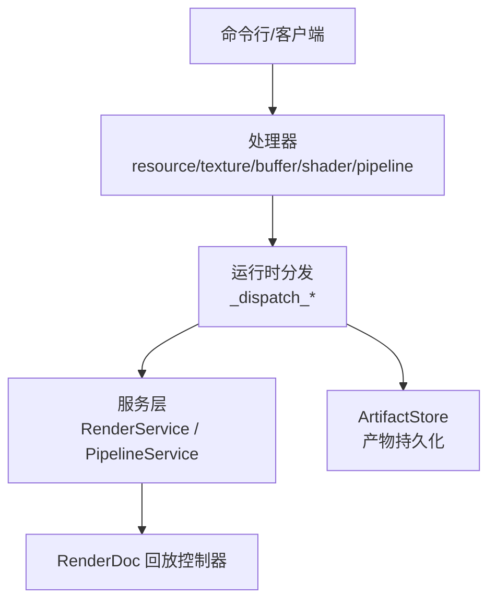
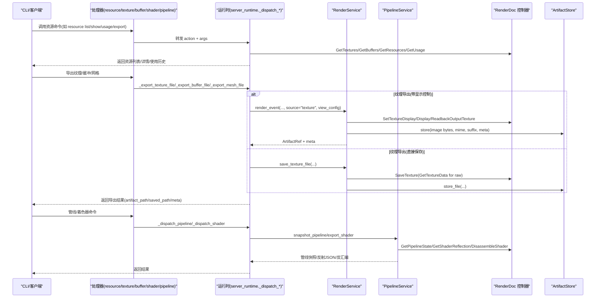
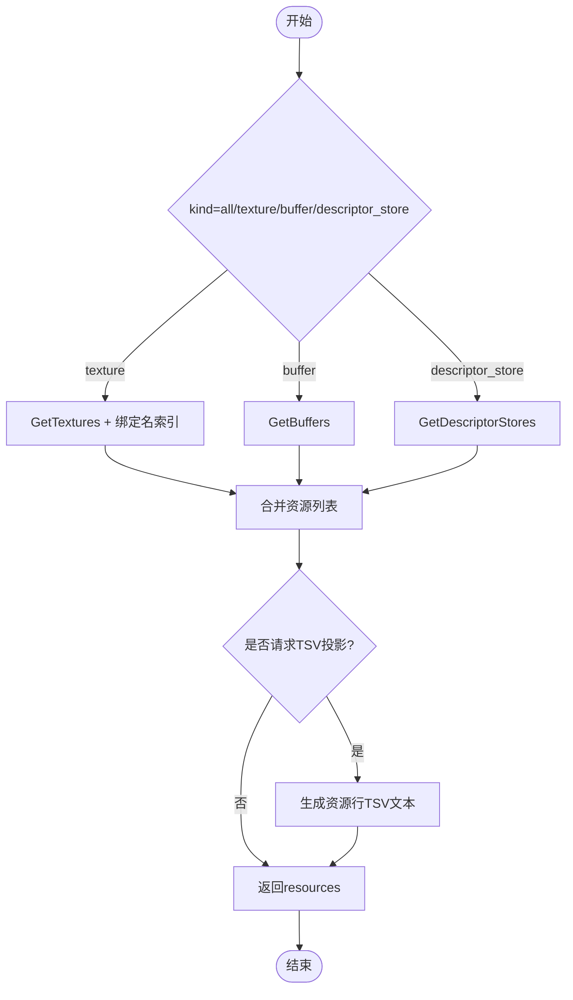
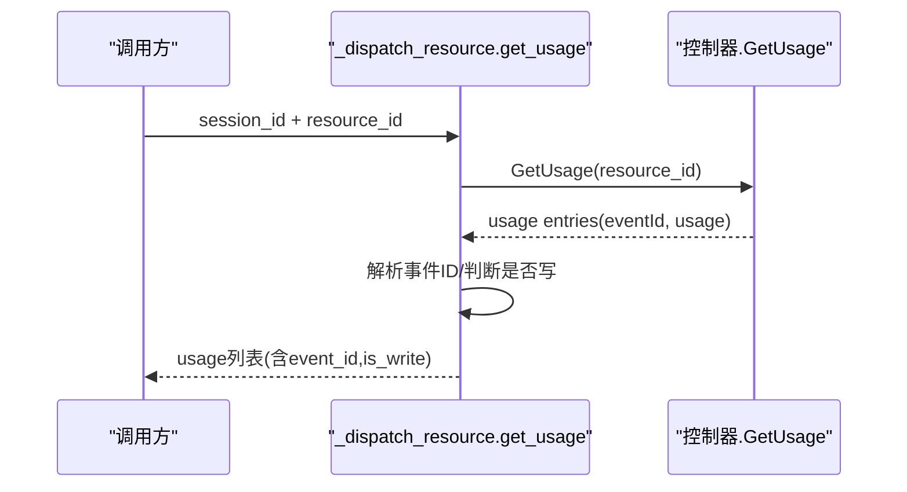
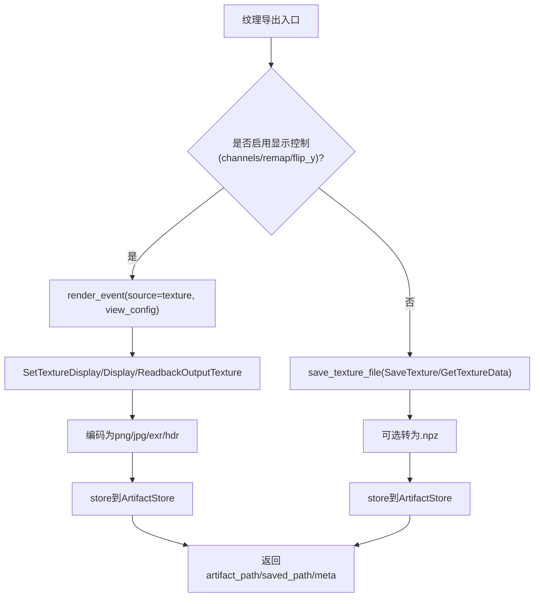
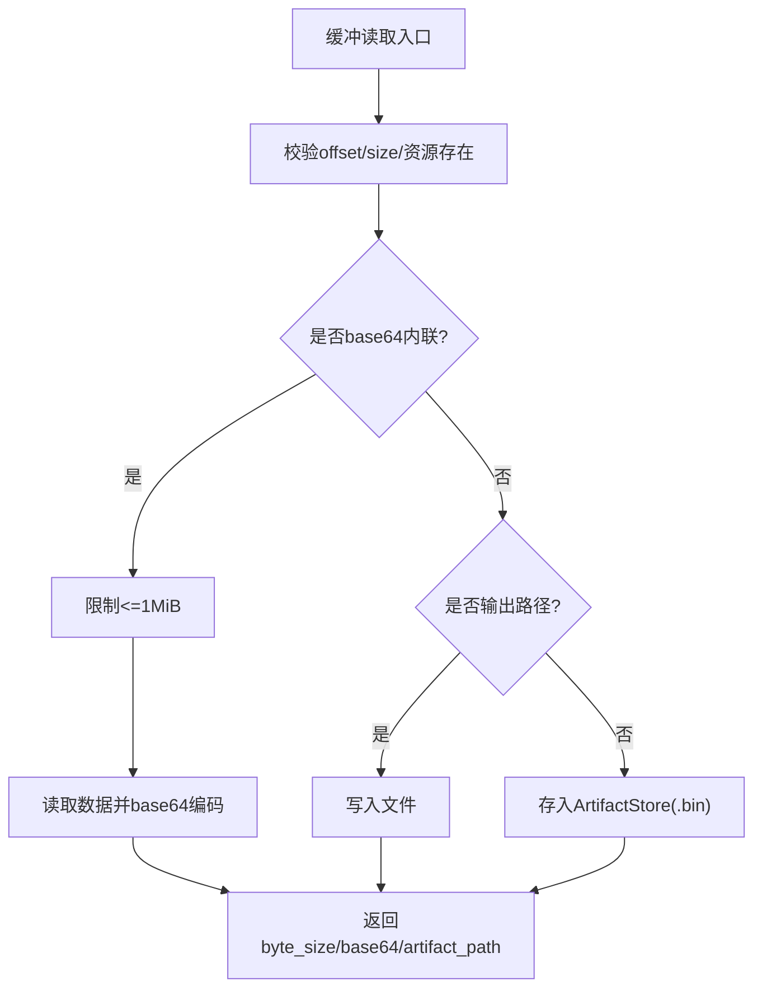
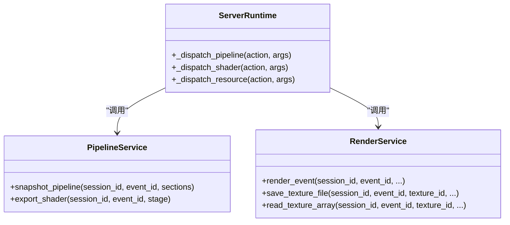
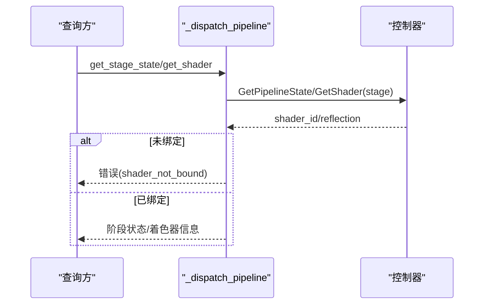
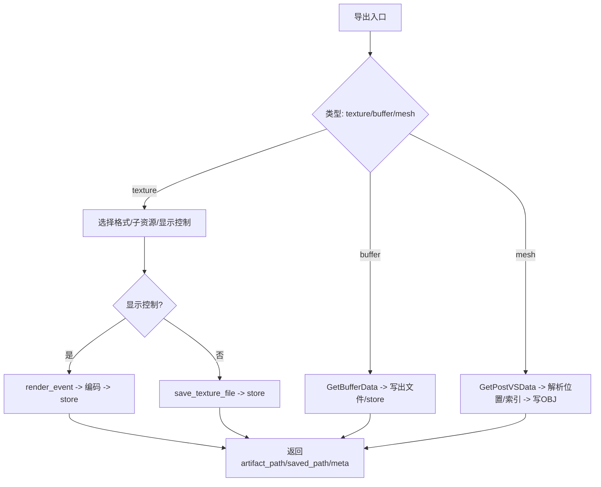
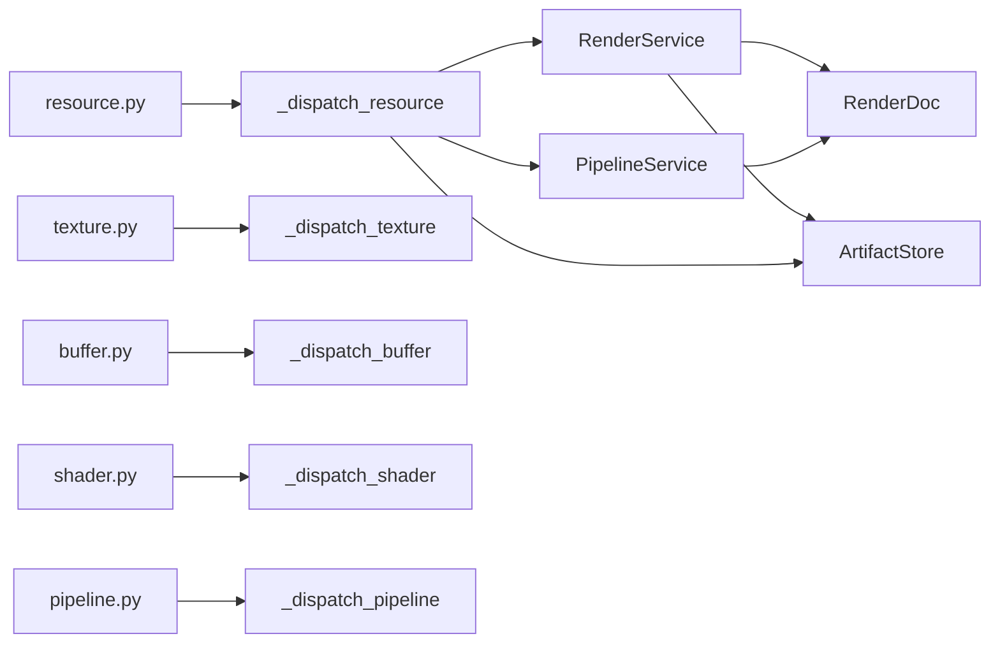

# 资源管理

<cite>
**本文引用的文件**
- [server_runtime.py](file://rdx/server_runtime.py)
- [resource.py](file://rdx/handlers/resource.py)
- [texture.py](file://rdx/handlers/texture.py)
- [buffer.py](file://rdx/handlers/buffer.py)
- [shader.py](file://rdx/handlers/shader.py)
- [pipeline.py](file://rdx/handlers/pipeline.py)
- [render_service.py](file://rdx/core/render_service.py)
- [pipeline_service.py](file://rdx/core/pipeline_service.py)
- [cli.py](file://rdx/cli.py)
</cite>

## 目录
1. [简介](#简介)
2. [项目结构](#项目结构)
3. [核心组件](#核心组件)
4. [架构总览](#架构总览)
5. [详细组件分析](#详细组件分析)
6. [依赖关系分析](#依赖关系分析)
7. [性能考虑](#性能考虑)
8. [故障排查指南](#故障排查指南)
9. [结论](#结论)
10. [附录](#附录)

## 简介
本文件面向 GPU 资源管理，围绕 RenderDoc 回放环境中的纹理、缓冲区、着色器与管线对象等资源的内存生命周期、查询浏览、历史追踪、导出以及与事件绑定的状态变更进行系统化说明。文档基于 RDC-Tool 的运行时调度与服务层实现，重点覆盖：
- 资源类型与职责边界（纹理、缓冲区、着色器、管线）
- 分配、使用与释放策略（通过 RenderDoc API 与 ArtifactStore 抽象）
- 资源列表、详情与内存估算
- 资源使用历史与依赖关系（绑定索引、用途事件）
- 导出能力（纹理图像、缓冲数据、网格 OBJ）
- 资源与事件的关联（绑定检查、状态变更追踪）
- 最佳实践与性能优化建议

## 项目结构
RDX 的资源管理采用“处理器 -> 运行时分发 -> 服务层 -> RenderDoc 后端”的分层设计：
- 处理器层：按资源类型提供统一入口（resource/texture/buffer/shader/pipeline），将 action 与参数转发到 server_runtime 的对应分发函数。
- 运行时层：集中处理会话、事件、控制器获取、RenderDoc 调用封装、错误包装与产物存储。
- 服务层：渲染服务负责纹理读取/编码/保存；管线服务负责管线快照、着色器反射与导出。
- 后端：延迟加载 renderdoc Python 模块，在回放上下文中执行具体 GPU 操作。

图表来源
- [resource.py:8-9](file://rdx/handlers/resource.py#L8-L9)
- [texture.py:8-9](file://rdx/handlers/texture.py#L8-L9)
- [buffer.py:8-9](file://rdx/handlers/buffer.py#L8-L9)
- [shader.py:8-9](file://rdx/handlers/shader.py#L8-L9)
- [pipeline.py:8-9](file://rdx/handlers/pipeline.py#L8-L9)
- [server_runtime.py:7461-7814](file://rdx/server_runtime.py#L7461-L7814)
- [render_service.py:346-521](file://rdx/core/render_service.py#L346-L521)
- [pipeline_service.py:590-702](file://rdx/core/pipeline_service.py#L590-L702)

章节来源
- [resource.py:8-9](file://rdx/handlers/resource.py#L8-L9)
- [texture.py:8-9](file://rdx/handlers/texture.py#L8-L9)
- [buffer.py:8-9](file://rdx/handlers/buffer.py#L8-L9)
- [shader.py:8-9](file://rdx/handlers/shader.py#L8-L9)
- [pipeline.py:8-9](file://rdx/handlers/pipeline.py#L8-L9)
- [server_runtime.py:7461-7814](file://rdx/server_runtime.py#L7461-L7814)
- [render_service.py:346-521](file://rdx/core/render_service.py#L346-L521)
- [pipeline_service.py:590-702](file://rdx/core/pipeline_service.py#L590-L702)

## 核心组件
- 资源分发器
  - _dispatch_resource：统一管理纹理、缓冲区、描述符存储的列举、详情、使用历史、别名与内存估算。
  - _dispatch_buffer：缓冲区的读取、搜索结构化数据、导出二进制。
  - _dispatch_texture：纹理导出（图像或原始数据）、像素值与历史。
  - _dispatch_shader：着色器编译、源码/反汇编、常量缓冲内容、调试目标配置。
  - _dispatch_pipeline：管线快照、阶段状态、资源绑定、顶点/索引缓冲、常量缓冲。
- 渲染服务 RenderService
  - 纹理显示、读回、编码为 PNG/JPG/EXR/HDR/RAW/NPZ，并写入 ArtifactStore。
  - 支持 subresource 选择、通道可见性、HDR 乘数、翻转与范围映射。
- 管线服务 PipelineService
  - 管线快照（shaders、output_targets、bindings、topology、viewport/scissor 等）。
  - 着色器反射解析、导出反射 JSON 与反汇编。

章节来源
- [server_runtime.py:7461-7814](file://rdx/server_runtime.py#L7461-L7814)
- [server_runtime.py:8180-8259](file://rdx/server_runtime.py#L8180-L8259)
- [server_runtime.py:9518-10000](file://rdx/server_runtime.py#L9518-L10000)
- [render_service.py:346-521](file://rdx/core/render_service.py#L346-L521)
- [pipeline_service.py:590-702](file://rdx/core/pipeline_service.py#L590-L702)

## 架构总览
下图展示了从 CLI 到资源管理的完整调用链，包括资源列举、详情、使用历史、导出以及管线/着色器相关操作。

图表来源
- [resource.py:8-9](file://rdx/handlers/resource.py#L8-L9)
- [texture.py:8-9](file://rdx/handlers/texture.py#L8-L9)
- [buffer.py:8-9](file://rdx/handlers/buffer.py#L8-L9)
- [shader.py:8-9](file://rdx/handlers/shader.py#L8-L9)
- [pipeline.py:8-9](file://rdx/handlers/pipeline.py#L8-L9)
- [server_runtime.py:7461-7814](file://rdx/server_runtime.py#L7461-L7814)
- [server_runtime.py:7945-8090](file://rdx/server_runtime.py#L7945-L8090)
- [render_service.py:346-521](file://rdx/core/render_service.py#L346-L521)
- [pipeline_service.py:590-702](file://rdx/core/pipeline_service.py#L590-L702)

## 详细组件分析

### 资源枚举与详情
- 资源列举
  - 纹理：通过控制器 GetTextures 获取资源 ID、尺寸、格式、名称，并结合当前事件绑定名索引生成展示名与绑定名列表。
  - 缓冲区：通过 GetBuffers 获取长度与名称（可被别名覆盖）。
  - 描述符存储：通过 GetDescriptorStores 列出 descriptor_store，并以 native_value 序列化。
- 资源详情
  - get_details：合并纹理/缓冲/描述符存储信息，并可包含初始化块、父/派生资源等元数据。
- 内存估算
  - estimate_memory：对单个资源根据 width*height*4 估算纹理字节，或汇总所有纹理与缓冲大小；返回 human 可读大小。

图表来源
- [server_runtime.py:7624-7814](file://rdx/server_runtime.py#L7624-L7814)

章节来源
- [server_runtime.py:7624-7814](file://rdx/server_runtime.py#L7624-L7814)

### 资源使用历史与依赖关系
- 使用历史
  - get_usage：调用控制器 GetUsage 获取资源在各事件中的用法（读/写/渲染目标/深度模板/拷贝/生成mips等），并附带事件ID解析与是否写标记。
- 依赖关系
  - 绑定名索引：通过 _binding_name_index_for_event 建立资源ID到事件内绑定名的映射，用于资源命名与可视化。
  - 管线绑定：PipelineService 收集各阶段的 SRV/UAV/CBV/Sampler 绑定，形成资源依赖图。

图表来源
- [server_runtime.py:7782-7796](file://rdx/server_runtime.py#L7782-L7796)
- [pipeline_service.py:392-502](file://rdx/core/pipeline_service.py#L392-L502)

章节来源
- [server_runtime.py:7782-7796](file://rdx/server_runtime.py#L7782-L7796)
- [pipeline_service.py:392-502](file://rdx/core/pipeline_service.py#L392-L502)

### 纹理导出与像素访问
- 纹理导出
  - 显示控制路径：当启用 channels/remap/flip_y 时，走 render_event 路径，设置 TextureDisplay 后 ReadbackOutputTexture 并编码为 png/jpg/exr/hdr。
  - 直接保存路径：SaveTexture 或 GetTextureData(raw)，输出 dds/png/jpg/exr/hdr/raw，必要时转存为 npz。
- 像素访问
  - read_texture_array：读取指定 mip/slice/sample 的像素数据，解析分量类型与布局，计算统计信息（min/max/mean/nan/inf）。
  - readback_texture：将数组序列化为 .npz 并通过 ArtifactStore 持久化。

图表来源
- [server_runtime.py:7856-8074](file://rdx/server_runtime.py#L7856-L8074)
- [render_service.py:346-521](file://rdx/core/render_service.py#L346-L521)
- [render_service.py:523-646](file://rdx/core/render_service.py#L523-L646)
- [render_service.py:658-794](file://rdx/core/render_service.py#L658-L794)

章节来源
- [server_runtime.py:7856-8074](file://rdx/server_runtime.py#L7856-L8074)
- [render_service.py:346-521](file://rdx/core/render_service.py#L346-L521)
- [render_service.py:523-646](file://rdx/core/render_service.py#L523-L646)
- [render_service.py:658-794](file://rdx/core/render_service.py#L658-L794)

### 缓冲区数据与结构化读取
- 数据读取
  - get_data：校验偏移与长度，支持 base64 内联或小于1MiB限制；否则写入临时文件或 ArtifactStore。
  - search_pattern：在缓冲数据中查找十六进制或字节序列模式，返回匹配偏移。
  - get_structured_data：按 stride 与字段布局解析结构化缓冲，限制最大元素数量。
- 导出
  - _export_buffer_file：直接写出二进制文件。

图表来源
- [server_runtime.py:8180-8259](file://rdx/server_runtime.py#L8180-L8259)
- [server_runtime.py:8077-8090](file://rdx/server_runtime.py#L8077-L8090)

章节来源
- [server_runtime.py:8180-8259](file://rdx/server_runtime.py#L8180-L8259)
- [server_runtime.py:8077-8090](file://rdx/server_runtime.py#L8077-L8090)

### 着色器与管线
- 着色器
  - compile：校验源编码与目标，构建目标着色器，可选择保存二进制或存入 ArtifactStore。
  - debug_start：配置像素级调试目标，读取像素历史，支持超时与失败重试。
- 管线
  - snapshot_pipeline：聚合 shaders、output_targets、blend/depth_stencil、viewports/scissors、bindings、vertex_inputs 等。
  - export_shader：导出反射 JSON 与反汇编文本。

图表来源
- [pipeline_service.py:590-702](file://rdx/core/pipeline_service.py#L590-L702)
- [pipeline_service.py:708-800](file://rdx/core/pipeline_service.py#L708-L800)
- [server_runtime.py:7461-7621](file://rdx/server_runtime.py#L7461-L7621)
- [server_runtime.py:9518-10000](file://rdx/server_runtime.py#L9518-L10000)

章节来源
- [pipeline_service.py:590-702](file://rdx/core/pipeline_service.py#L590-L702)
- [pipeline_service.py:708-800](file://rdx/core/pipeline_service.py#L708-L800)
- [server_runtime.py:7461-7621](file://rdx/server_runtime.py#L7461-L7621)
- [server_runtime.py:9518-10000](file://rdx/server_runtime.py#L9518-L10000)

### 资源与事件关联
- 绑定检查
  - 通过管线快照与阶段状态获取 shader_id、entry、reflection，若未绑定则返回明确错误（如 shader_not_bound）。
- 状态变更追踪
  - 使用历史（get_usage）记录每个事件中资源的读写/渲染目标/拷贝等操作，结合事件ID定位变更点。
  - 绑定名索引将资源ID与事件内的绑定名关联，便于资源命名与可视化。

图表来源
- [server_runtime.py:7504-7621](file://rdx/server_runtime.py#L7504-L7621)

章节来源
- [server_runtime.py:7504-7621](file://rdx/server_runtime.py#L7504-L7621)

### 资源导出功能
- 纹理导出
  - 支持 png/jpg/exr/hdr/raw/dds，自动推荐格式；当编码器不可用时会降级并返回 format_error 详情。
  - 支持 subresource（mip/slice/sample）与显示控制（channels/remap/flip_y）。
- 缓冲导出
  - 直接写出二进制文件，支持 offset/size 范围读取。
- 网格导出
  - 仅支持 post-VS 空间、三角/线/点拓扑，输出 OBJ 文件；若数据不完整或非浮点32位位置则拒绝导出。

图表来源
- [server_runtime.py:7945-8090](file://rdx/server_runtime.py#L7945-L8090)
- [render_service.py:523-646](file://rdx/core/render_service.py#L523-L646)

章节来源
- [server_runtime.py:7945-8090](file://rdx/server_runtime.py#L7945-L8090)
- [render_service.py:523-646](file://rdx/core/render_service.py#L523-L646)

## 依赖关系分析
- 处理器到运行时
  - resource/texture/buffer/shader/pipeline 处理器均委托给 server_runtime 的 _dispatch_* 方法，保持接口一致性与可扩展性。
- 运行时到服务层
  - _dispatch_resource/_dispatch_buffer/_dispatch_texture/_dispatch_shader/_dispatch_pipeline 分别调用 RenderService/PipelineService 完成具体任务。
- 服务层到后端
  - RenderService/PipelineService 延迟导入 renderdoc 模块，并在回放上下文中调用控制器 API。
- 产物存储
  - 所有导出与中间产物通过 ArtifactStore 持久化，避免随意落盘，仅在显式导出或证据需求时写盘。

图表来源
- [resource.py:8-9](file://rdx/handlers/resource.py#L8-L9)
- [texture.py:8-9](file://rdx/handlers/texture.py#L8-L9)
- [buffer.py:8-9](file://rdx/handlers/buffer.py#L8-L9)
- [shader.py:8-9](file://rdx/handlers/shader.py#L8-L9)
- [pipeline.py:8-9](file://rdx/handlers/pipeline.py#L8-L9)
- [server_runtime.py:7461-7814](file://rdx/server_runtime.py#L7461-L7814)
- [render_service.py:346-521](file://rdx/core/render_service.py#L346-L521)
- [pipeline_service.py:590-702](file://rdx/core/pipeline_service.py#L590-L702)

章节来源
- [resource.py:8-9](file://rdx/handlers/resource.py#L8-L9)
- [texture.py:8-9](file://rdx/handlers/texture.py#L8-L9)
- [buffer.py:8-9](file://rdx/handlers/buffer.py#L8-L9)
- [shader.py:8-9](file://rdx/handlers/shader.py#L8-L9)
- [pipeline.py:8-9](file://rdx/handlers/pipeline.py#L8-L9)
- [server_runtime.py:7461-7814](file://rdx/server_runtime.py#L7461-L7814)
- [render_service.py:346-521](file://rdx/core/render_service.py#L346-L521)
- [pipeline_service.py:590-702](file://rdx/core/pipeline_service.py#L590-L702)

## 性能考虑
- 延迟导入与线程分派
  - renderdoc 模块延迟导入，避免启动开销；所有阻塞的 RenderDoc 调用通过 asyncio.to_thread 分派到线程，不阻塞事件循环。
- 内存与产物管理
  - 默认内存或 stdout；纹理统计、直方图与差异复用读回数据，仅在导出或证据请求时写盘。
  - 大缓冲 base64 内联限制为 1 MiB，避免响应过大；超出范围应使用输出路径或 ArtifactStore。
- 事件与上下文切换
  - 读取前 SetFrameEvent 导航到目标事件，注意频繁切换可能带来开销；批量操作尽量复用同一事件上下文。
- 格式降级与可用性
  - 当编码器不可用时自动降级并返回 format_error 详情；优先选择稳定支持的格式（如 PNG/JPG）。

[本节为通用指导，不直接分析具体文件]

## 故障排查指南
- 常见错误与定位
  - shader_not_bound：当前事件未绑定着色器，需先确认事件与阶段绑定。
  - mesh_export_unsupported：非 post-VS 空间、非浮点32位位置或不支持拓扑，需调整导出条件。
  - format_encoder_unavailable：请求格式不可用，查看 recommended_formats 与 selected_formats。
  - initial_contents_unavailable/replay_restore_failed：初始内容不可用或回放恢复失败，需重启上下文或重新打开捕获。
- 排查步骤
  - 使用 resource list/show/usage 确认资源存在与使用历史。
  - 使用 pipeline show 检查管线状态与绑定情况。
  - 使用 shader source/disasm/constants 检查着色器与常量缓冲。
  - 保留失败的 JSON 负载，关注 failure_stage、failure_reason、resolved_event_id、binding_truth_level 等字段。

章节来源
- [server_runtime.py:7504-7621](file://rdx/server_runtime.py#L7504-L7621)
- [server_runtime.py:7945-8090](file://rdx/server_runtime.py#L7945-L8090)
- [server_runtime.py:8093-8146](file://rdx/server_runtime.py#L8093-L8146)
- [server_runtime.py:8149-8177](file://rdx/server_runtime.py#L8149-L8177)

## 结论
RDX 的资源管理以清晰的处理器-运行时-服务层分层组织，围绕 RenderDoc 回放环境提供统一的资源查询、历史追踪、导出与管线/着色器能力。通过 ArtifactStore 抽象与延迟导入策略，系统在性能与可维护性之间取得平衡。开发者应遵循最佳实践：
- 使用资源列表与详情快速定位目标，结合使用历史定位变更事件。
- 导出时选择合适的格式与 subresource，必要时启用显示控制以获得期望视图。
- 关注错误负载中的 failure_stage 与 recommended_next_tools，避免盲目重试。
- 控制内存与产物规模，仅在必要时写盘，避免不必要的磁盘IO。

[本节为总结，不直接分析具体文件]

## 附录
- CLI 资源命令映射
  - resource list -> rd.resource.list_all
  - resource show -> rd.resource.get_details
  - resource usage -> rd.resource.get_usage
  - export texture/buffer/mesh -> rd.export.texture/buffer/mesh
  - pixel value/history -> rd.texture.get_pixel_value/history

章节来源
- [cli.py:997-1021](file://rdx/cli.py#L997-L1021)
- [cli.py:1538-1560](file://rdx/cli.py#L1538-L1560)