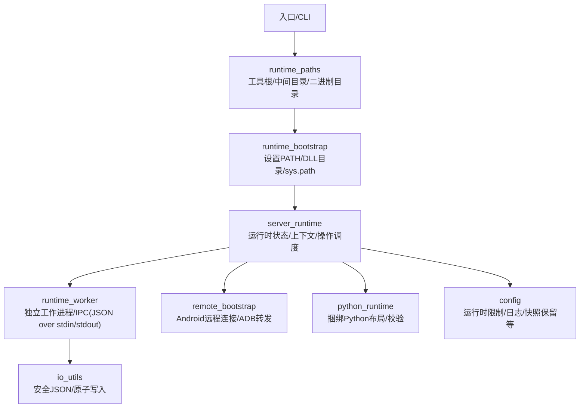
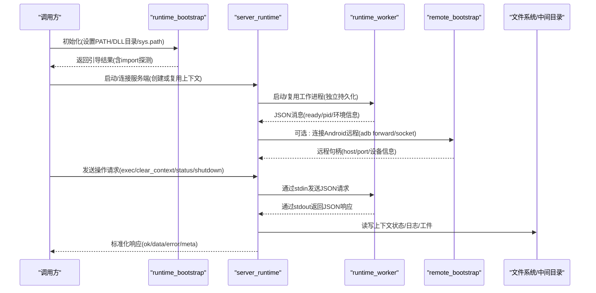
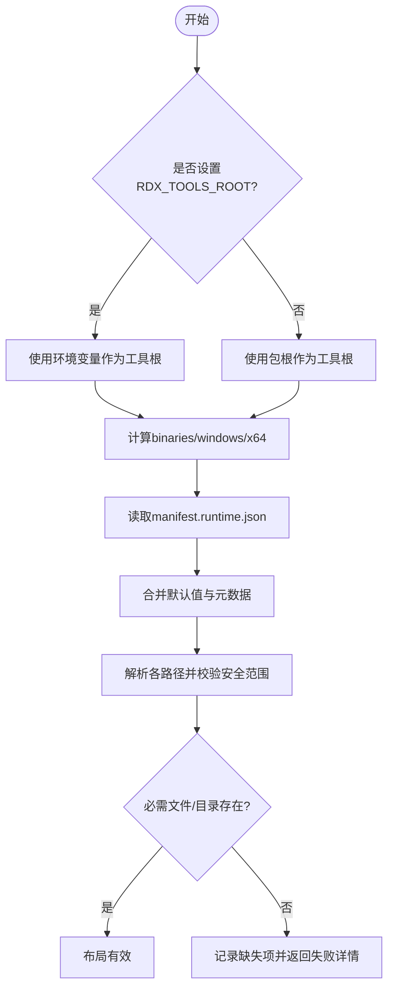
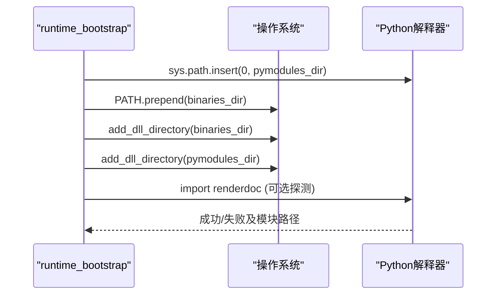
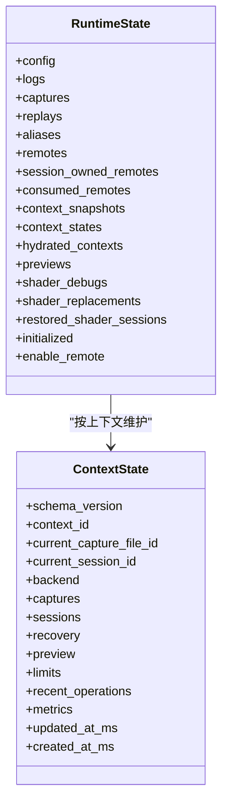
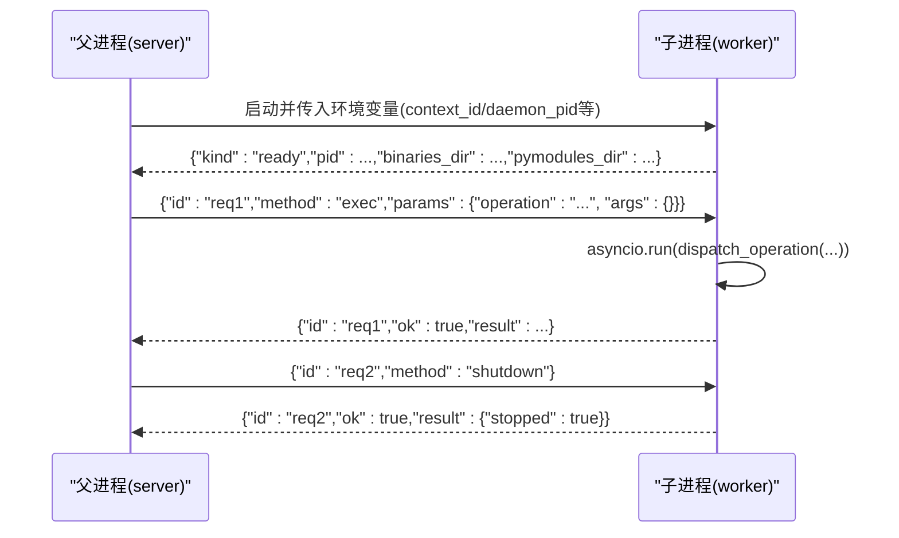
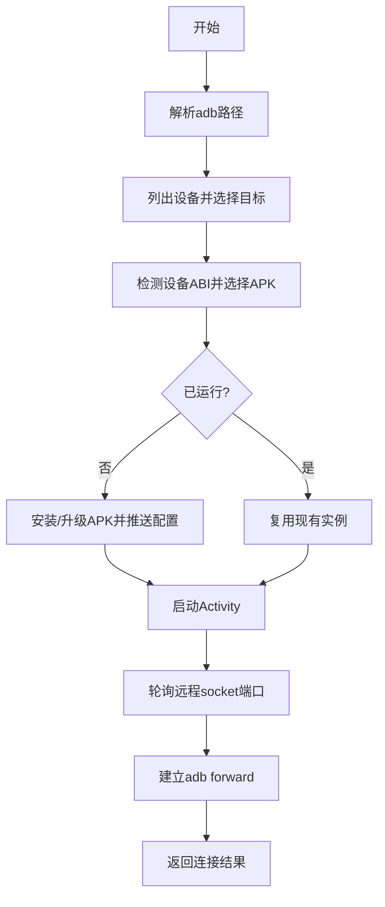
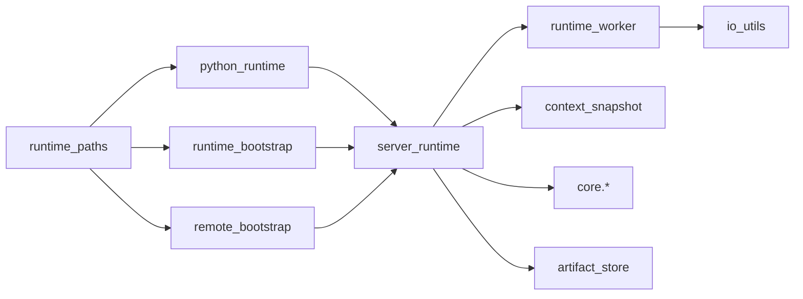

# Python运行时管理

<cite>
**本文引用的文件**
- [rdx/python_runtime.py](file://rdx/python_runtime.py)
- [rdx/runtime_paths.py](file://rdx/runtime_paths.py)
- [rdx/runtime_bootstrap.py](file://rdx/runtime_bootstrap.py)
- [rdx/runtime_worker.py](file://rdx/runtime_worker.py)
- [rdx/server_runtime.py](file://rdx/server_runtime.py)
- [rdx/remote_bootstrap.py](file://rdx/remote_bootstrap.py)
- [rdx/config.py](file://rdx/config.py)
- [rdx/io_utils.py](file://rdx/io_utils.py)
- [binaries/windows/x64/manifest.runtime.json](file://binaries/windows/x64/manifest.runtime.json)
</cite>

## 目录
1. [简介](#简介)
2. [项目结构](#项目结构)
3. [核心组件](#核心组件)
4. [架构总览](#架构总览)
5. [详细组件分析](#详细组件分析)
6. [依赖关系分析](#依赖关系分析)
7. [性能考虑](#性能考虑)
8. [故障排查指南](#故障排查指南)
9. [结论](#结论)
10. [附录](#附录)

## 简介
本文件系统性阐述本项目中Python运行时的管理与控制机制，覆盖以下主题：
- Python环境的发现与选择策略（系统Python与捆绑Python）
- 模块加载机制（sys.path、包导入、命名空间）
- 运行时隔离技术（会话级上下文隔离）
- 进程间通信（子进程启动、参数传递、结果收集）
- 内存管理与资源清理
- 配置选项与性能调优建议
- 常见问题诊断与解决方法

## 项目结构
围绕Python运行时的关键代码分布在以下模块：
- 路径与环境解析：runtime_paths.py
- 捆绑Python布局与校验：python_runtime.py
- 渲染库运行时引导：runtime_bootstrap.py
- 工作进程与IPC：runtime_worker.py
- 服务端运行时状态与操作调度：server_runtime.py
- Android远程引导：remote_bootstrap.py
- 全局配置：config.py
- 原子IO工具：io_utils.py

图表来源
- [rdx/runtime_paths.py:14-123](file://rdx/runtime_paths.py#L14-L123)
- [rdx/runtime_bootstrap.py:42-130](file://rdx/runtime_bootstrap.py#L42-L130)
- [rdx/server_runtime.py:98-239](file://rdx/server_runtime.py#L98-L239)
- [rdx/runtime_worker.py:65-167](file://rdx/runtime_worker.py#L65-L167)
- [rdx/remote_bootstrap.py:495-698](file://rdx/remote_bootstrap.py#L495-L698)
- [rdx/python_runtime.py:64-172](file://rdx/python_runtime.py#L64-L172)
- [rdx/config.py:118-186](file://rdx/config.py#L118-L186)
- [rdx/io_utils.py:35-161](file://rdx/io_utils.py#L35-L161)

章节来源
- [rdx/runtime_paths.py:14-123](file://rdx/runtime_paths.py#L14-L123)
- [rdx/runtime_bootstrap.py:42-130](file://rdx/runtime_bootstrap.py#L42-L130)
- [rdx/server_runtime.py:98-239](file://rdx/server_runtime.py#L98-L239)
- [rdx/runtime_worker.py:65-167](file://rdx/runtime_worker.py#L65-L167)
- [rdx/remote_bootstrap.py:495-698](file://rdx/remote_bootstrap.py#L495-L698)
- [rdx/python_runtime.py:64-172](file://rdx/python_runtime.py#L64-L172)
- [rdx/config.py:118-186](file://rdx/config.py#L118-L186)
- [rdx/io_utils.py:35-161](file://rdx/io_utils.py#L35-L161)

## 核心组件
- 路径与环境解析器：提供工具根、二进制根、中间目录、pymodules目录等统一访问点，支持环境变量覆盖。
- 捆绑Python布局管理器：从manifest读取并校验捆绑Python的exe、DLL、stdlib、site-packages、_pth文件等。
- 运行时引导器：准备PATH、注册DLL搜索目录、将pymodules加入sys.path，并探测renderdoc模块可导入性。
- 工作进程：独立的持久化worker，通过stdin/stdout进行JSON消息协议通信，执行服务端操作并返回结果。
- 服务端运行时：维护上下文、会话、捕获、预览、远程句柄等状态；提供操作分发、生命周期管理、资源清理。
- Android远程引导：通过adb安装/启动RenderDocCmd APK，建立本地到设备的socket转发，完成远程连接。
- 配置系统：集中管理后端、重放、工件存储、数据库、bisect、报告、限制等配置项，支持环境变量注入。
- IO工具：安全的JSON序列化、原子写入、追加日志等。

章节来源
- [rdx/runtime_paths.py:14-123](file://rdx/runtime_paths.py#L14-L123)
- [rdx/python_runtime.py:28-172](file://rdx/python_runtime.py#L28-L172)
- [rdx/runtime_bootstrap.py:42-130](file://rdx/runtime_bootstrap.py#L42-L130)
- [rdx/runtime_worker.py:65-167](file://rdx/runtime_worker.py#L65-L167)
- [rdx/server_runtime.py:98-239](file://rdx/server_runtime.py#L98-L239)
- [rdx/remote_bootstrap.py:495-698](file://rdx/remote_bootstrap.py#L495-L698)
- [rdx/config.py:118-186](file://rdx/config.py#L118-L186)
- [rdx/io_utils.py:35-161](file://rdx/io_utils.py#L35-L161)

## 架构总览
下图展示了主进程、工作进程、Android远程服务之间的交互以及运行时环境准备流程。

图表来源
- [rdx/runtime_bootstrap.py:105-130](file://rdx/runtime_bootstrap.py#L105-L130)
- [rdx/runtime_worker.py:65-167](file://rdx/runtime_worker.py#L65-L167)
- [rdx/server_runtime.py:98-239](file://rdx/server_runtime.py#L98-L239)
- [rdx/remote_bootstrap.py:495-698](file://rdx/remote_bootstrap.py#L495-L698)
- [rdx/runtime_state.py:41-116](file://rdx/runtime_state.py#L41-L116)

## 详细组件分析

### Python环境发现与选择策略
- 工具根与二进制根：优先使用RDX_TOOLS_ROOT环境变量，否则回退到当前包根；二进制根固定为tools_root/binaries/windows/x64。
- 捆绑Python布局：从manifest.runtime.json读取bundled_python元数据，合并默认值后解析出python.exe、pythonw.exe、python3.dll、python314.dll、stdlib路径、site-packages、DLL目录、_pth文件。
- 路径安全校验：所有相对路径必须位于binaries根内，防止逃逸；缺失或缺失标记文件会记录失败原因。
- 当前Python详情：输出当前进程的executable、version、prefix、base_prefix用于诊断。

图表来源
- [rdx/runtime_paths.py:14-80](file://rdx/runtime_paths.py#L14-L80)
- [rdx/python_runtime.py:40-92](file://rdx/python_runtime.py#L40-L92)
- [rdx/python_runtime.py:104-172](file://rdx/python_runtime.py#L104-L172)

章节来源
- [rdx/runtime_paths.py:14-80](file://rdx/runtime_paths.py#L14-L80)
- [rdx/python_runtime.py:40-172](file://rdx/python_runtime.py#L40-L172)

### 模块加载机制（sys.path、包导入、命名空间）
- sys.path注入：引导阶段将pymodules目录插入sys.path首位，确保优先加载渲染相关Python模块。
- PATH前缀：将binaries目录前置到PATH，便于动态链接器查找第三方DLL。
- DLL目录注册：在Windows上通过add_dll_directory显式注册binaries与pymodules目录，避免依赖冲突。
- 导入探测：可选择性地尝试导入renderdoc模块以验证环境就绪。

图表来源
- [rdx/runtime_bootstrap.py:60-103](file://rdx/runtime_bootstrap.py#L60-L103)

章节来源
- [rdx/runtime_bootstrap.py:60-103](file://rdx/runtime_bootstrap.py#L60-L103)

### 运行时隔离技术（会话级上下文）
- 上下文标识：通过RDX_CONTEXT_ID或contextvars维护当前上下文ID，所有状态按上下文隔离。
- 上下文容量限制：根据配置限制最大上下文数、每上下文会话数、捕获文件数量等，超出时抛出明确错误。
- 上下文状态持久化：每个上下文的状态保存在intermediate/runtime/rdx_cli下的JSON文件中，带锁保护并发写。
- 快照与指标：上下文快照包含运行时、预览、度量等信息，支持保留策略与最近操作统计。

图表来源
- [rdx/server_runtime.py:196-239](file://rdx/server_runtime.py#L196-L239)
- [rdx/runtime_state.py:104-149](file://rdx/runtime_state.py#L104-L149)

章节来源
- [rdx/server_runtime.py:413-468](file://rdx/server_runtime.py#L413-L468)
- [rdx/runtime_state.py:41-116](file://rdx/runtime_state.py#L41-L116)
- [rdx/runtime_state.py:293-385](file://rdx/runtime_state.py#L293-L385)

### 进程间通信（子进程启动、参数传递、结果收集）
- 工作进程模型：独立持久化的worker进程，启动后通过stdout发送ready消息，包含pid、环境目录、源清单等。
- 请求协议：stdin接收JSON行，包含id、method、params；方法包括exec、clear_context、status、shutdown。
- 响应协议：stdout返回JSON行，包含id、ok、result或error；错误包含message。
- 父进程守护：后台线程监控父daemon进程，若父进程退出则worker自动退出。
- 异步执行：使用asyncio.Runner和单线程ThreadPoolExecutor保证图形状态一致性。

图表来源
- [rdx/runtime_worker.py:65-167](file://rdx/runtime_worker.py#L65-L167)

章节来源
- [rdx/runtime_worker.py:25-63](file://rdx/runtime_worker.py#L25-L63)
- [rdx/runtime_worker.py:65-167](file://rdx/runtime_worker.py#L65-L167)

### Android远程连接与隔离
- 设备发现与ABI检测：通过adb查询设备列表与CPU ABI，选择匹配的RenderDocCmd APK。
- APK安装与配置推送：必要时卸载冲突版本并重新安装，推送renderdoc.conf到设备。
- 活动启动与端口转发：启动Activity，轮询unix socket端口，建立adb forward映射到本地端口。
- 连接预算与超时：使用ConnectionBudget统一管理超时与取消信号，确保长时间操作可控。
- 清理策略：结束时移除forward、停止活动、删除本地配置文件，保证资源释放。

图表来源
- [rdx/remote_bootstrap.py:133-167](file://rdx/remote_bootstrap.py#L133-L167)
- [rdx/remote_bootstrap.py:495-698](file://rdx/remote_bootstrap.py#L495-L698)
- [rdx/remote_bootstrap.py:701-754](file://rdx/remote_bootstrap.py#L701-L754)

章节来源
- [rdx/remote_bootstrap.py:495-698](file://rdx/remote_bootstrap.py#L495-L698)
- [rdx/remote_bootstrap.py:701-754](file://rdx/remote_bootstrap.py#L701-L754)

### 内存管理与资源清理
- 上下文状态锁：使用MSVC文件锁与线程锁保护状态文件并发写，避免竞争。
- 原子写入：临时文件+原子替换，失败时清理临时文件与备份，保证一致性。
- 日志追加：JSONL格式追加写入，支持按时间过滤读取。
- 资源回收：工作进程关闭时调用runtime_shutdown；Android远程清理forward、停止活动、删除配置。
- 限制与配额：通过配置限制上下文数、会话数、捕获文件大小、估计回放内存等，防止资源耗尽。

章节来源
- [rdx/runtime_state.py:63-76](file://rdx/runtime_state.py#L63-L76)
- [rdx/io_utils.py:67-161](file://rdx/io_utils.py#L67-L161)
- [rdx/remote_bootstrap.py:701-754](file://rdx/remote_bootstrap.py#L701-L754)
- [rdx/config.py:82-90](file://rdx/config.py#L82-L90)

### 配置选项与性能调优建议
- 关键环境变量：
  - RDX_TOOLS_ROOT：覆盖工具根目录
  - RDX_RUNTIME_DLL_DIR / RDX_RENDERDOC_PATH：覆盖二进制与pymodules路径
  - RDX_ARTIFACT_STORE / RDX_DATA_DIR / RDX_REPORT_DIR：覆盖工件、数据库、报告输出路径
  - RDX_LOG_LEVEL / RDX_GPU_VENDOR / RDX_HEADLESS：调整日志级别、GPU供应商、无头模式
  - RDX_BISECT_* / RDX_MAX_*：调整二分搜索权重与运行时限制
- 运行时限制：
  - max_contexts、max_sessions_per_context、max_capture_files、max_capture_size_bytes、max_estimated_replay_memory_bytes、replay_memory_multiplier、max_recent_operations
- 性能建议：
  - 合理设置replay_memory_multiplier与max_estimated_replay_memory_bytes以避免OOM
  - 限制recent_operations数量以减少状态膨胀
  - 使用headless模式减少UI开销
  - 将artifacts与data目录放置在高速磁盘以提升I/O吞吐

章节来源
- [rdx/config.py:118-186](file://rdx/config.py#L118-L186)
- [rdx/server_runtime.py:277-390](file://rdx/server_runtime.py#L277-L390)

## 依赖关系分析
- runtime_paths依赖：无外部依赖，仅基于os/pathlib
- python_runtime依赖：runtime_paths、json
- runtime_bootstrap依赖：runtime_paths、importlib、os、sys
- runtime_worker依赖：io_utils、server（操作分发）、asyncio、concurrent.futures
- server_runtime依赖：config、context_snapshot、core.*、remote_bootstrap、runtime_bootstrap、runtime_state、utils.artifact_store
- remote_bootstrap依赖：runtime_paths、subprocess、socket、re、time
- io_utils依赖：json、os、secrets、shutil、tempfile、pathlib

图表来源
- [rdx/runtime_paths.py:14-123](file://rdx/runtime_paths.py#L14-L123)
- [rdx/python_runtime.py:11-172](file://rdx/python_runtime.py#L11-L172)
- [rdx/runtime_bootstrap.py:12-130](file://rdx/runtime_bootstrap.py#L12-L130)
- [rdx/runtime_worker.py:15-167](file://rdx/runtime_worker.py#L15-L167)
- [rdx/server_runtime.py:37-96](file://rdx/server_runtime.py#L37-L96)
- [rdx/remote_bootstrap.py:17-785](file://rdx/remote_bootstrap.py#L17-L785)
- [rdx/io_utils.py:1-161](file://rdx/io_utils.py#L1-L161)

章节来源
- [rdx/runtime_paths.py:14-123](file://rdx/runtime_paths.py#L14-L123)
- [rdx/python_runtime.py:11-172](file://rdx/python_runtime.py#L11-L172)
- [rdx/runtime_bootstrap.py:12-130](file://rdx/runtime_bootstrap.py#L12-L130)
- [rdx/runtime_worker.py:15-167](file://rdx/runtime_worker.py#L15-L167)
- [rdx/server_runtime.py:37-96](file://rdx/server_runtime.py#L37-L96)
- [rdx/remote_bootstrap.py:17-785](file://rdx/remote_bootstrap.py#L17-L785)
- [rdx/io_utils.py:1-161](file://rdx/io_utils.py#L1-L161)

## 性能考虑
- 单线程回放执行器：避免频繁创建销毁executor导致原生上下文失效，提升稳定性。
- 上下文容量限制：防止过多上下文占用内存与句柄。
- 工件与日志路径：使用SSD或RAMDisk可显著降低I/O延迟。
- 远程连接预算：统一超时与取消，避免长耗时阻塞。
- 内存估算：根据捕获文件大小乘以倍数估算回放内存需求，避免过大分配。

[本节为通用指导，不直接分析具体文件]

## 故障排查指南
- 捆绑Python布局无效：
  - 检查manifest.runtime.json是否存在且包含必需字段
  - 确认python.exe、pythonw.exe、python3.dll、python314.dll、stdlib、site-packages、DLL目录、_pth文件存在
  - 查看validate_bundled_python_layout返回的failures与details
- 模块导入失败：
  - 确认pymodules已加入sys.path且binaries已在PATH与DLL目录注册
  - 使用bootstrap_renderdoc_runtime(probe_import=True)获取import_error
- 工作进程异常：
  - 检查stdin/stdout JSON格式是否正确
  - 查看ready消息中的pid与环境目录是否与预期一致
  - 确认父daemon进程存活，否则worker会自动退出
- Android远程连接失败：
  - 检查adb是否可用、设备是否在线、ABI是否受支持
  - 查看cleanup_actions与错误码定位失败阶段（install/launch/forward）
- 上下文状态损坏：
  - 使用clear_context_state重置损坏的上下文文件
  - 检查并发写入锁是否正常释放

章节来源
- [rdx/python_runtime.py:104-172](file://rdx/python_runtime.py#L104-L172)
- [rdx/runtime_bootstrap.py:93-103](file://rdx/runtime_bootstrap.py#L93-L103)
- [rdx/runtime_worker.py:72-89](file://rdx/runtime_worker.py#L72-L89)
- [rdx/remote_bootstrap.py:701-754](file://rdx/remote_bootstrap.py#L701-L754)
- [rdx/runtime_state.py:419-425](file://rdx/runtime_state.py#L419-L425)

## 结论
本项目通过分层设计实现了稳健的Python运行时管理：
- 环境发现与选择：基于manifest与默认值的灵活布局解析，确保捆绑Python可用
- 模块加载：通过sys.path、PATH、DLL目录注册保障依赖正确加载
- 运行时隔离：上下文级状态与限制，保证多会话独立性
- 进程间通信：JSON over stdin/stdout的稳定IPC，支持持久化工作进程
- 资源管理：原子写入、文件锁、清理策略，避免资源泄漏
- 配置与调优：丰富的环境变量与运行时限制，支持性能优化与故障恢复

[本节为总结性内容，不直接分析具体文件]

## 附录
- 关键环境变量速查：
  - RDX_TOOLS_ROOT、RDX_RUNTIME_DLL_DIR、RDX_RENDERDOC_PATH
  - RDX_ARTIFACT_STORE、RDX_DATA_DIR、RDX_REPORT_DIR
  - RDX_LOG_LEVEL、RDX_GPU_VENDOR、RDX_HEADLESS
  - RDX_BISECT_*、RDX_MAX_*
- 常用路径：
  - tools_root()、binaries_root()、bundled_python_root()、pymodules_dir()
  - intermediate_root()、runtime_root()、cli_runtime_dir()、worker_state_dir()、artifacts_dir()、logs_dir()

章节来源
- [rdx/config.py:135-186](file://rdx/config.py#L135-L186)
- [rdx/runtime_paths.py:60-123](file://rdx/runtime_paths.py#L60-L123)