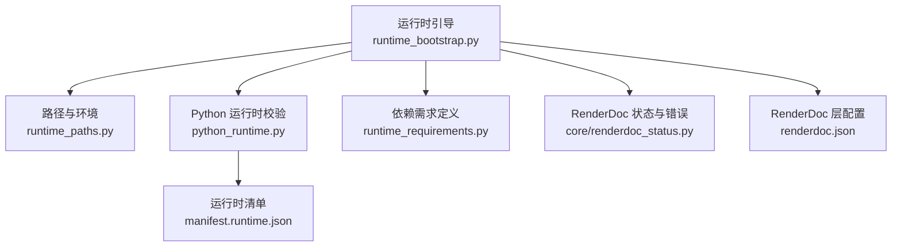
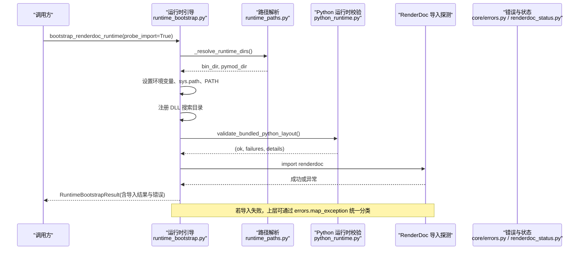
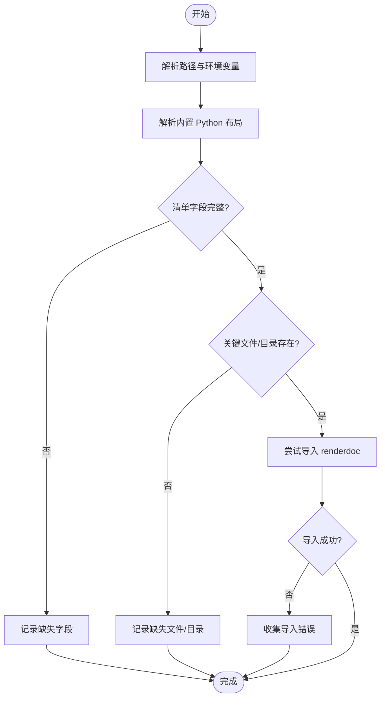
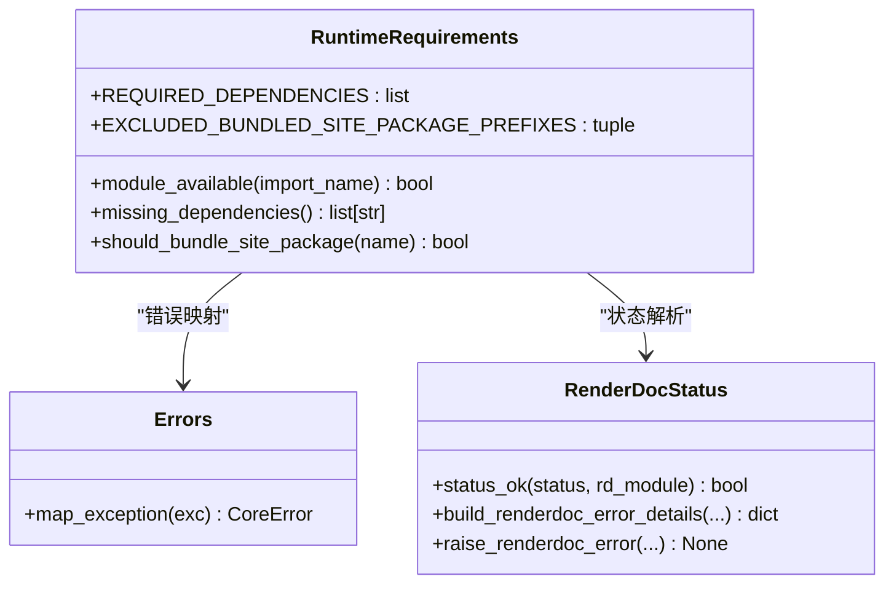
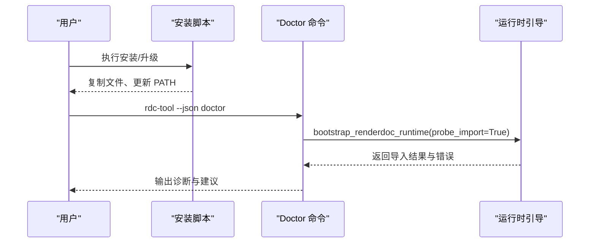
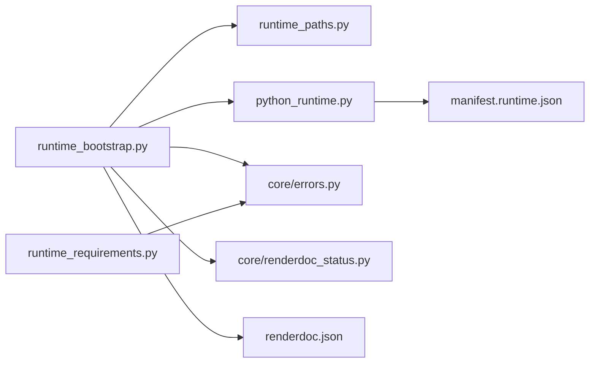

# 依赖检查系统

<cite>
**本文引用的文件**
- [rdc_tool/runtime_requirements.py](file://rdc_tool/runtime_requirements.py)
- [rdc_tool/python_runtime.py](file://rdc_tool/python_runtime.py)
- [rdc_tool/runtime_paths.py](file://rdc_tool/runtime_paths.py)
- [rdc_tool/runtime_bootstrap.py](file://rdc_tool/runtime_bootstrap.py)
- [rdc_tool/core/renderdoc_status.py](file://rdc_tool/core/renderdoc_status.py)
- [rdc_tool/core/errors.py](file://rdc_tool/core/errors.py)
- [binaries/windows/x64/manifest.runtime.json](file://binaries/windows/x64/manifest.runtime.json)
- [binaries/windows/x64/renderdoc.json](file://binaries/windows/x64/renderdoc.json)
- [tests/test_runtime_requirements.py](file://tests/test_runtime_requirements.py)
- [docs/install.md](file://docs/install.md)
</cite>

## 目录
1. [简介](#简介)
2. [项目结构](#项目结构)
3. [核心组件](#核心组件)
4. [架构总览](#架构总览)
5. [详细组件分析](#详细组件分析)
6. [依赖关系分析](#依赖关系分析)
7. [性能考量](#性能考量)
8. [故障排查指南](#故障排查指南)
9. [结论](#结论)
10. [附录](#附录)

## 简介
本文件系统性阐述 RDC 工具的依赖检查与验证体系，覆盖环境验证（操作系统、Python 运行时、RenderDoc）、依赖项检测（必需组件、可选功能、平台特定要求）、兼容性检查（版本冲突与向后兼容）、缺失恢复策略与安装指导，以及诊断方法与配置扩展。目标是帮助开发者与用户快速定位并解决环境问题，确保工具在 Windows x64 环境下稳定运行。

## 项目结构
RDC 的依赖检查由多个模块协同完成：
- Python 运行时布局与清单校验：负责解析内置 Python 包结构与元数据，验证关键路径与标记文件。
- 运行时引导：准备 PATH、sys.path、DLL 搜索目录，探测 renderdoc.pyd 是否可导入。
- 依赖需求定义：声明 Python 第三方库的必需依赖及打包过滤规则。
- RenderDoc 状态与错误：统一渲染后端状态解读与错误上报。
- 路径与环境：提供工具根目录、二进制目录、中间产物目录等解析。
- 测试与文档：保障依赖列表一致性并提供安装/医生命令指引。

**图示来源**
- [rdc_tool/runtime_bootstrap.py:105-130](file://rdc_tool/runtime_bootstrap.py#L105-L130)
- [rdc_tool/runtime_paths.py:60-80](file://rdc_tool/runtime_paths.py#L60-L80)
- [rdc_tool/python_runtime.py:104-172](file://rdc_tool/python_runtime.py#L104-L172)
- [rdc_tool/runtime_requirements.py:7-13](file://rdc_tool/runtime_requirements.py#L7-L13)
- [rdc_tool/core/renderdoc_status.py:57-104](file://rdc_tool/core/renderdoc_status.py#L57-L104)
- [binaries/windows/x64/manifest.runtime.json:1-30](file://binaries/windows/x64/manifest.runtime.json#L1-L30)
- [binaries/windows/x64/renderdoc.json:1-49](file://binaries/windows/x64/renderdoc.json#L1-L49)

**章节来源**
- [rdc_tool/runtime_bootstrap.py:105-130](file://rdc_tool/runtime_bootstrap.py#L105-L130)
- [rdc_tool/runtime_paths.py:60-80](file://rdc_tool/runtime_paths.py#L60-L80)
- [rdc_tool/python_runtime.py:104-172](file://rdc_tool/python_runtime.py#L104-L172)
- [rdc_tool/runtime_requirements.py:7-13](file://rdc_tool/runtime_requirements.py#L7-L13)
- [rdc_tool/core/renderdoc_status.py:57-104](file://rdc_tool/core/renderdoc_status.py#L57-L104)
- [binaries/windows/x64/manifest.runtime.json:1-30](file://binaries/windows/x64/manifest.runtime.json#L1-L30)
- [binaries/windows/x64/renderdoc.json:1-49](file://binaries/windows/x64/renderdoc.json#L1-L49)

## 核心组件
- 运行时引导器：设置环境变量、调整 sys.path 与 PATH、注册 DLL 搜索目录，并可选择探测 renderdoc.pyd 导入。
- Python 运行时校验：读取 manifest.runtime.json，解析内置 Python 布局，校验关键文件/目录是否存在，输出诊断详情。
- 依赖需求管理：声明必需 Python 依赖，提供模块可用性检测与打包过滤逻辑。
- RenderDoc 状态处理：将底层状态转换为结构化错误信息，便于上层统一处理。
- 路径与环境：提供工具根、二进制目录、pymodules 目录等解析，支持通过环境变量覆盖。

**章节来源**
- [rdc_tool/runtime_bootstrap.py:18-130](file://rdc_tool/runtime_bootstrap.py#L18-L130)
- [rdc_tool/python_runtime.py:14-172](file://rdc_tool/python_runtime.py#L14-L172)
- [rdc_tool/runtime_requirements.py:7-73](file://rdc_tool/runtime_requirements.py#L7-L73)
- [rdc_tool/core/renderdoc_status.py:10-104](file://rdc_tool/core/renderdoc_status.py#L10-L104)
- [rdc_tool/runtime_paths.py:14-80](file://rdc_tool/runtime_paths.py#L14-L80)

## 架构总览
下图展示启动阶段依赖检查与控制流：从引导器开始，解析路径与环境，加载 Python 运行时布局，验证清单与文件完整性，最后尝试导入 renderdoc 模块并汇总结果。

**图示来源**
- [rdc_tool/runtime_bootstrap.py:105-130](file://rdc_tool/runtime_bootstrap.py#L105-L130)
- [rdc_tool/runtime_paths.py:42-57](file://rdc_tool/runtime_paths.py#L42-L57)
- [rdc_tool/python_runtime.py:104-172](file://rdc_tool/python_runtime.py#L104-L172)
- [rdc_tool/core/errors.py:90-121](file://rdc_tool/core/errors.py#L90-L121)
- [rdc_tool/core/renderdoc_status.py:57-104](file://rdc_tool/core/renderdoc_status.py#L57-L104)

## 详细组件分析

### 环境验证机制
- 操作系统检测
  - 通过 Python 标准库判断平台（如 Windows），并在非 Windows 平台跳过 DLL 目录注册。
  - 相关实现参考运行时引导中的平台分支与 ctypes 加载逻辑。
- Python 版本与布局检查
  - 读取 manifest.runtime.json 中 bundled_python 字段，解析 python.exe、pythonw.exe、DLL、stdlib、site-packages、pth 等路径。
  - 校验关键目录/文件存在性，并对 stdlib 采用 zip 或目录两种形态的检测。
  - 输出当前 Python 运行时的 executable、version、prefix、base_prefix 等诊断信息。
- RenderDoc 依赖验证
  - 通过引导器将 pymodules 目录加入 sys.path，并将 binaries 目录加入 PATH，同时使用 add_dll_directory 注册 DLL 搜索路径。
  - 尝试导入 renderdoc 模块，记录导入成功与否、模块路径与异常信息。
  - 若导入失败，上层可使用 renderdoc_status 工具将状态转为结构化错误，便于诊断。

**图示来源**
- [rdc_tool/runtime_bootstrap.py:42-130](file://rdc_tool/runtime_bootstrap.py#L42-L130)
- [rdc_tool/python_runtime.py:104-172](file://rdc_tool/python_runtime.py#L104-L172)
- [rdc_tool/core/renderdoc_status.py:57-104](file://rdc_tool/core/renderdoc_status.py#L57-L104)

**章节来源**
- [rdc_tool/runtime_bootstrap.py:42-130](file://rdc_tool/runtime_bootstrap.py#L42-L130)
- [rdc_tool/python_runtime.py:104-172](file://rdc_tool/python_runtime.py#L104-L172)
- [rdc_tool/core/renderdoc_status.py:57-104](file://rdc_tool/core/renderdoc_status.py#L57-L104)

### 依赖项检测功能
- 必需组件
  - 通过 REQUIRED_DEPENDENCIES 声明 Python 第三方库（如 pydantic、numpy、Pillow、jinja2、aiofiles）。
  - 使用 module_available 基于 importlib.util.find_spec 检测模块是否可用。
  - missing_dependencies 返回缺失的发行包名称列表。
- 可选功能与平台特定要求
  - 打包时通过 should_bundle_site_package 排除测试与开发辅助包（如 pytest、pip、setuptools、pyarrow 等），减少分发体积。
  - 平台差异体现在 DLL 加载与注册（仅 Windows 生效）与 RenderDoc 层配置（renderdoc.json 指定 Vulkan 层与启用环境变量）。
- 兼容性检查算法
  - 版本冲突检测：通过 find_spec 获取已安装模块的版本信息（由 importlib 提供），可与期望版本范围比较（可在上层扩展）。
  - 向后兼容性验证：对 renderdoc 的状态码进行兼容读取（支持属性访问或枚举值），保证不同版本的 ResultCode 能正确解析。

**图示来源**
- [rdc_tool/runtime_requirements.py:7-73](file://rdc_tool/runtime_requirements.py#L7-L73)
- [rdc_tool/core/errors.py:90-121](file://rdc_tool/core/errors.py#L90-L121)
- [rdc_tool/core/renderdoc_status.py:10-104](file://rdc_tool/core/renderdoc_status.py#L10-L104)

**章节来源**
- [rdc_tool/runtime_requirements.py:7-73](file://rdc_tool/runtime_requirements.py#L7-L73)
- [tests/test_runtime_requirements.py:6-14](file://tests/test_runtime_requirements.py#L6-L14)
- [rdc_tool/core/renderdoc_status.py:10-104](file://rdc_tool/core/renderdoc_status.py#L10-L104)

### 依赖缺失时的恢复策略与安装指导
- 自动恢复
  - 引导器自动将 pymodules 目录加入 sys.path，将 binaries 目录加入 PATH，并注册 DLL 搜索目录，尽可能避免“找不到模块/DLL”的问题。
  - 若导入失败，报告包含具体异常类型与消息，便于上层给出修复建议。
- 安装与医生命令
  - 提供安装脚本与 doctor 命令，用于检查环境与依赖，必要时提示修复步骤。
  - 安装脚本支持 dry-run 模式，先预览操作再执行。

**图示来源**
- [docs/install.md:1-31](file://docs/install.md#L1-L31)
- [rdc_tool/runtime_bootstrap.py:105-130](file://rdc_tool/runtime_bootstrap.py#L105-L130)

**章节来源**
- [docs/install.md:1-31](file://docs/install.md#L1-L31)
- [rdc_tool/runtime_bootstrap.py:105-130](file://rdc_tool/runtime_bootstrap.py#L105-L130)

### 配置选项与自定义扩展方法
- 环境变量
  - RDC_TOOL_ROOT：覆盖工具根目录。
  - RDC_TOOL_RUNTIME_DLL_DIR：覆盖二进制目录（默认 binaries/windows/x64）。
  - RDC_TOOL_RENDERDOC_PATH：覆盖 pymodules 目录（默认 binaries/windows/x64/pymodules）。
  - RDC_TOOL_INTERMEDIATE_ROOT：覆盖中间产物目录。
- 清单与层配置
  - manifest.runtime.json：描述内置 Python 布局与文件清单。
  - renderdoc.json：描述 Vulkan 层、API 版本、启用/禁用环境变量。
- 扩展点
  - 在 runtime_requirements.py 中添加新的必需依赖或排除前缀。
  - 在 python_runtime.py 中扩展 validate_bundled_python_layout 以添加更多校验规则。
  - 在 runtime_bootstrap.py 中扩展 _probe_renderdoc_import 以支持更多探测逻辑。

**章节来源**
- [rdc_tool/runtime_paths.py:14-86](file://rdc_tool/runtime_paths.py#L14-L86)
- [rdc_tool/runtime_bootstrap.py:42-130](file://rdc_tool/runtime_bootstrap.py#L42-L130)
- [rdc_tool/python_runtime.py:104-172](file://rdc_tool/python_runtime.py#L104-L172)
- [rdc_tool/runtime_requirements.py:7-73](file://rdc_tool/runtime_requirements.py#L7-L73)
- [binaries/windows/x64/manifest.runtime.json:1-30](file://binaries/windows/x64/manifest.runtime.json#L1-L30)
- [binaries/windows/x64/renderdoc.json:1-49](file://binaries/windows/x64/renderdoc.json#L1-L49)

## 依赖关系分析
- 组件耦合
  - runtime_bootstrap 依赖 runtime_paths 解析目录，依赖 python_runtime 校验布局，依赖 core 模块进行错误与状态处理。
  - runtime_requirements 独立于平台，提供通用依赖检测能力。
- 外部依赖
  - Windows 平台特性：add_dll_directory、ctypes 加载、Vulkan 层配置。
  - Python 标准库：importlib、sys、os、pathlib。
- 潜在循环依赖
  - 当前模块间为单向依赖，未发现循环引用。
- 集成点
  - 通过环境变量与清单文件解耦路径与布局，便于在不同环境中复用。

**图示来源**
- [rdc_tool/runtime_bootstrap.py:105-130](file://rdc_tool/runtime_bootstrap.py#L105-L130)
- [rdc_tool/runtime_paths.py:60-80](file://rdc_tool/runtime_paths.py#L60-L80)
- [rdc_tool/python_runtime.py:104-172](file://rdc_tool/python_runtime.py#L104-L172)
- [rdc_tool/runtime_requirements.py:7-73](file://rdc_tool/runtime_requirements.py#L7-L73)
- [rdc_tool/core/errors.py:90-121](file://rdc_tool/core/errors.py#L90-L121)
- [rdc_tool/core/renderdoc_status.py:57-104](file://rdc_tool/core/renderdoc_status.py#L57-L104)
- [binaries/windows/x64/manifest.runtime.json:1-30](file://binaries/windows/x64/manifest.runtime.json#L1-L30)
- [binaries/windows/x64/renderdoc.json:1-49](file://binaries/windows/x64/renderdoc.json#L1-L49)

**章节来源**
- [rdc_tool/runtime_bootstrap.py:105-130](file://rdc_tool/runtime_bootstrap.py#L105-L130)
- [rdc_tool/runtime_paths.py:60-80](file://rdc_tool/runtime_paths.py#L60-L80)
- [rdc_tool/python_runtime.py:104-172](file://rdc_tool/python_runtime.py#L104-L172)
- [rdc_tool/runtime_requirements.py:7-73](file://rdc_tool/runtime_requirements.py#L7-L73)
- [rdc_tool/core/errors.py:90-121](file://rdc_tool/core/errors.py#L90-L121)
- [rdc_tool/core/renderdoc_status.py:57-104](file://rdc_tool/core/renderdoc_status.py#L57-L104)
- [binaries/windows/x64/manifest.runtime.json:1-30](file://binaries/windows/x64/manifest.runtime.json#L1-L30)
- [binaries/windows/x64/renderdoc.json:1-49](file://binaries/windows/x64/renderdoc.json#L1-L49)

## 性能考量
- 导入缓存：引导器在探测导入前调用 invalidate_caches，确保最新的路径变更生效，但可能带来轻微开销；建议在批量检查场景下复用结果。
- 路径解析：优先使用 Path.resolve 与相对路径校验，避免重复 I/O。
- DLL 注册：仅在 Windows 平台注册 DLL 目录，减少跨平台开销。
- 依赖检测：module_available 使用 find_spec，时间复杂度近似 O(1)，适合高频调用。

[本节为通用指导，不直接分析具体文件]

## 故障排查指南
- 常见问题
  - 无法导入 renderdoc：检查 RDC_TOOL_RENDERDOC_PATH 是否正确指向 pymodules，确认 binaries 目录已在 PATH，且 add_dll_directory 已成功注册。
  - Python 运行时不完整：检查 manifest.runtime.json 中 bundled_python 字段是否完整，确认关键文件/目录存在。
  - 依赖缺失：使用 missing_dependencies 列出缺失的 Python 包，按提示安装。
- 诊断步骤
  - 运行 doctor 命令，查看 JSON 输出中的导入结果与错误。
  - 检查环境变量 RDC_TOOL_ROOT、RDC_TOOL_RUNTIME_DLL_DIR、RDC_TOOL_RENDERDOC_PATH。
  - 查看 runtime_bootstrap 返回的 dll_dirs_registered 与 dll_dir_errors。
- 解决方案
  - 重新安装或升级 rdc-tools，确保 binaries 与 pymodules 完整。
  - 修正 PATH 与 PYTHONPATH，确保模块与 DLL 可被找到。
  - 根据 renderdoc_status 的错误详情，调整 Vulkan 层配置或驱动版本。

**章节来源**
- [rdc_tool/runtime_bootstrap.py:70-130](file://rdc_tool/runtime_bootstrap.py#L70-L130)
- [rdc_tool/python_runtime.py:104-172](file://rdc_tool/python_runtime.py#L104-L172)
- [rdc_tool/core/renderdoc_status.py:57-104](file://rdc_tool/core/renderdoc_status.py#L57-L104)
- [docs/install.md:16-21](file://docs/install.md#L16-L21)

## 结论
该依赖检查系统通过清晰的职责划分与可扩展的设计，实现了环境验证、依赖检测、兼容性检查与恢复策略的闭环。借助清单与层配置文件，系统在 Windows x64 平台上提供了稳定的 RenderDoc 集成能力。用户可通过 doctor 命令与日志快速定位问题，开发者可按需扩展依赖规则与校验逻辑。

[本节为总结，不直接分析具体文件]

## 附录
- 关键路径与环境变量
  - tools_root：工具根目录，可通过 RDC_TOOL_ROOT 覆盖。
  - binaries_root：二进制目录，默认 binaries/windows/x64。
  - pymodules_dir：Python 模块目录，默认 binaries/windows/x64/pymodules。
  - intermediate_root：中间产物目录，可通过 RDC_TOOL_INTERMEDIATE_ROOT 覆盖。
- 清单与层配置
  - manifest.runtime.json：内置 Python 布局与文件清单。
  - renderdoc.json：Vulkan 层配置与启用/禁用环境变量。

**章节来源**
- [rdc_tool/runtime_paths.py:14-86](file://rdc_tool/runtime_paths.py#L14-L86)
- [binaries/windows/x64/manifest.runtime.json:1-30](file://binaries/windows/x64/manifest.runtime.json#L1-L30)
- [binaries/windows/x64/renderdoc.json:1-49](file://binaries/windows/x64/renderdoc.json#L1-L49)