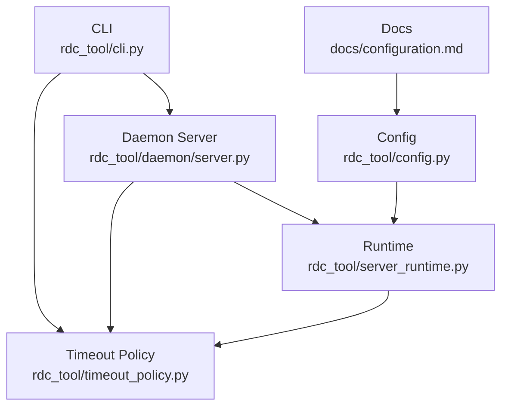
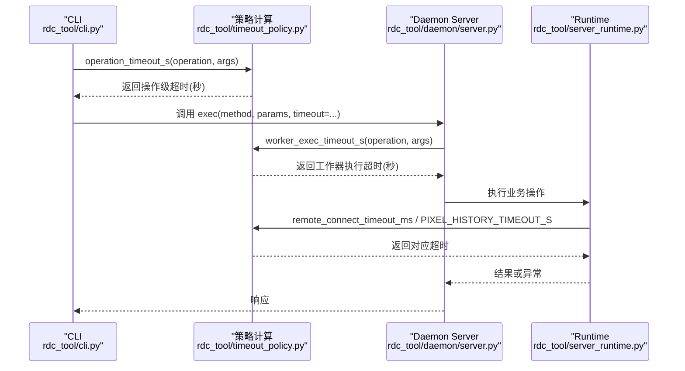
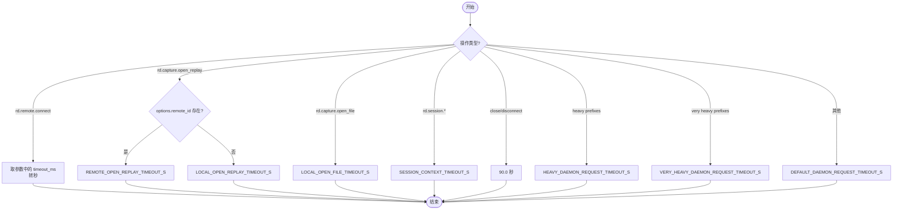
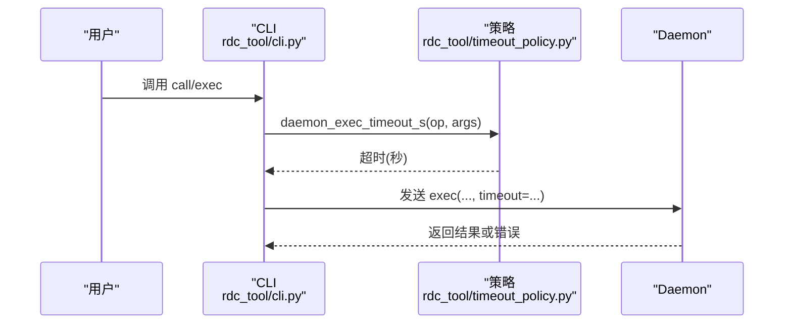
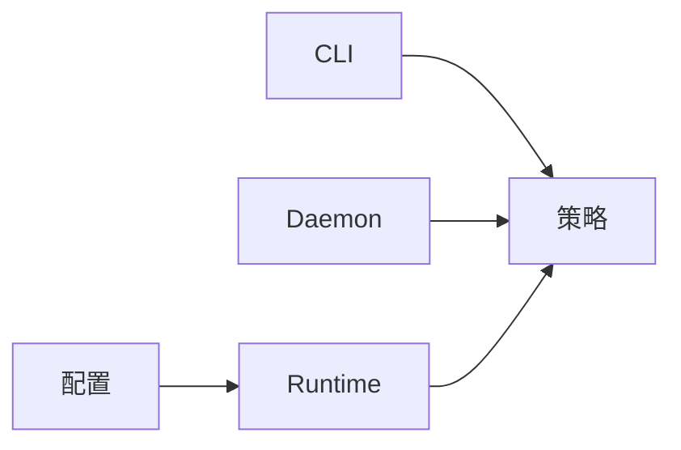

# 超时策略管理

<cite>
**本文引用的文件**
- [rdc_tool/timeout_policy.py](file://rdc_tool/timeout_policy.py)
- [tests/test_timeout_policy.py](file://tests/test_timeout_policy.py)
- [rdc_tool/cli.py](file://rdc_tool/cli.py)
- [rdc_tool/daemon/server.py](file://rdc_tool/daemon/server.py)
- [rdc_tool/server_runtime.py](file://rdc_tool/server_runtime.py)
- [rdc_tool/config.py](file://rdc_tool/config.py)
- [docs/configuration.md](file://docs/configuration.md)
</cite>

## 目录
1. [简介](#简介)
2. [项目结构](#项目结构)
3. [核心组件](#核心组件)
4. [架构总览](#架构总览)
5. [详细组件分析](#详细组件分析)
6. [依赖关系分析](#依赖关系分析)
7. [性能考量](#性能考量)
8. [故障排查指南](#故障排查指南)
9. [结论](#结论)
10. [附录](#附录)

## 简介
本文件系统性阐述 RDC-Tool 中的“超时策略系统”，覆盖操作超时的定义与分类、重试机制（含指数退避）、资源清理与状态恢复、监控与日志记录、可配置性与动态调整能力，以及诊断方法与优化建议。目标是帮助读者理解并正确使用该系统的超时控制，确保 I/O、网络请求与计算任务在可控时间内完成，并在失败时安全释放资源、恢复状态。

## 项目结构
围绕超时策略的核心代码集中在以下模块：
- 策略定义与计算：rdc_tool/timeout_policy.py
- CLI 调用链集成：rdc_tool/cli.py
- Daemon 执行侧集成：rdc_tool/daemon/server.py
- 运行时与远程连接集成：rdc_tool/server_runtime.py
- 配置模型与环境变量：rdc_tool/config.py
- 用户配置说明：docs/configuration.md
- 行为验证测试：tests/test_timeout_policy.py

图表来源
- [rdc_tool/cli.py:46-46](file://rdc_tool/cli.py#L46-L46)
- [rdc_tool/daemon/server.py:29-29](file://rdc_tool/daemon/server.py#L29-L29)
- [rdc_tool/server_runtime.py:65-65](file://rdc_tool/server_runtime.py#L65-L65)
- [rdc_tool/timeout_policy.py:56-104](file://rdc_tool/timeout_policy.py#L56-L104)
- [rdc_tool/config.py:118-186](file://rdc_tool/config.py#L118-L186)
- [docs/configuration.md:1-20](file://docs/configuration.md#L1-L20)

章节来源
- [rdc_tool/timeout_policy.py:1-104](file://rdc_tool/timeout_policy.py#L1-L104)
- [rdc_tool/cli.py:1-200](file://rdc_tool/cli.py#L1-L200)
- [rdc_tool/daemon/server.py:1-200](file://rdc_tool/daemon/server.py#L1-L200)
- [rdc_tool/server_runtime.py:60-259](file://rdc_tool/server_runtime.py#L60-L259)
- [rdc_tool/config.py:1-186](file://rdc_tool/config.py#L1-L186)
- [docs/configuration.md:1-20](file://docs/configuration.md#L1-L20)

## 核心组件
- 超时策略计算中心：提供按操作类型和参数计算超时秒数的函数族，包括默认值、重型操作前缀、极重型操作前缀、远程连接特殊处理等。
- CLI 集成点：将策略计算的超时传递给 daemon 请求，保证端到端超时一致。
- Daemon 执行侧：使用 worker_exec_timeout_s 为子进程/工作器设置执行超时，避免长时间阻塞。
- 运行时集成：针对远程连接等待、像素历史查询等场景采用特定超时常量或策略函数。
- 配置与环境：通过环境变量与配置对象影响运行限制与路径，但不直接暴露超时参数；超时策略以集中常量与函数形式维护，便于统一治理。

章节来源
- [rdc_tool/timeout_policy.py:8-104](file://rdc_tool/timeout_policy.py#L8-L104)
- [rdc_tool/cli.py:46-46](file://rdc_tool/cli.py#L46-L46)
- [rdc_tool/daemon/server.py:29-29](file://rdc_tool/daemon/server.py#L29-L29)
- [rdc_tool/server_runtime.py:65-65](file://rdc_tool/server_runtime.py#L65-L65)
- [rdc_tool/config.py:118-186](file://rdc_tool/config.py#L118-L186)

## 架构总览
下图展示从 CLI 到 Daemon 再到 Runtime 的超时传递与决策流程，以及策略函数的作用位置。

图表来源
- [rdc_tool/cli.py:46-46](file://rdc_tool/cli.py#L46-L46)
- [rdc_tool/timeout_policy.py:56-104](file://rdc_tool/timeout_policy.py#L56-L104)
- [rdc_tool/daemon/server.py:29-29](file://rdc_tool/daemon/server.py#L29-L29)
- [rdc_tool/server_runtime.py:65-65](file://rdc_tool/server_runtime.py#L65-L65)

## 详细组件分析

### 超时策略计算（operation_timeout_s）
- 功能：根据操作名与参数决定基础超时秒数。
- 关键分支：
  - 远程连接：支持从参数中读取毫秒级超时，并转换为秒。
  - 回放打开：区分本地与远程回放，分别使用不同超时。
  - 会话上下文：固定较短超时。
  - 关闭/断开：固定中等超时。
  - 重型操作前缀：匹配一组重负载操作，使用较长超时。
  - 极重型操作前缀：匹配更重的操作，使用更长超时。
  - 默认：通用短超时。
- 辅助：transport_timeout_s 在基础超时上增加传输缓冲时间；daemon_exec_timeout_s 与 worker_exec_timeout_s 分别用于不同执行层。

图表来源
- [rdc_tool/timeout_policy.py:56-84](file://rdc_tool/timeout_policy.py#L56-L84)

章节来源
- [rdc_tool/timeout_policy.py:8-104](file://rdc_tool/timeout_policy.py#L8-L104)

### CLI 集成与超时传递
- CLI 在发起 daemon 请求时，使用 daemon_exec_timeout_s 计算并传入超时，确保远端执行有明确的截止时间。
- 测试覆盖了远程连接超时透传、重型操作窗口选择、本地/远程回放差异等场景。

图表来源
- [rdc_tool/cli.py:46-46](file://rdc_tool/cli.py#L46-L46)
- [rdc_tool/timeout_policy.py:94-99](file://rdc_tool/timeout_policy.py#L94-L99)
- [tests/test_timeout_policy.py:83-105](file://tests/test_timeout_policy.py#L83-L105)

章节来源
- [tests/test_timeout_policy.py:38-105](file://tests/test_timeout_policy.py#L38-L105)
- [rdc_tool/cli.py:1-200](file://rdc_tool/cli.py#L1-L200)

### Daemon 执行侧超时
- Daemon 在服务端使用 worker_exec_timeout_s 为具体 worker 执行设定超时，避免长耗时任务阻塞服务。
- 该函数直接返回操作级超时，不包含传输缓冲，适合隔离执行边界。

章节来源
- [rdc_tool/daemon/server.py:29-29](file://rdc_tool/daemon/server.py#L29-L29)
- [rdc_tool/timeout_policy.py:98-99](file://rdc_tool/timeout_policy.py#L98-L99)

### 运行时与远程连接超时
- 运行时在远程连接等待时使用 remote_connect_timeout_ms 获取毫秒级超时，确保连接阶段有足够的时间容限。
- 像素历史查询使用专用常量 PIXEL_HISTORY_TIMEOUT_S，避免对 UI/交互造成卡顿。

章节来源
- [rdc_tool/server_runtime.py:65-65](file://rdc_tool/server_runtime.py#L65-L65)
- [rdc_tool/timeout_policy.py:8-16](file://rdc_tool/timeout_policy.py#L8-L16)

### 配置与可观测性
- 配置对象提供运行限制、工件存储、报告输出等选项，但不直接暴露超时参数；超时策略通过集中常量与函数管理，便于统一治理与测试覆盖。
- 文档说明了外部用户安装与运行时路径约定，有助于定位日志与工件以便调试超时问题。

章节来源
- [rdc_tool/config.py:118-186](file://rdc_tool/config.py#L118-L186)
- [docs/configuration.md:1-20](file://docs/configuration.md#L1-L20)

## 依赖关系分析
- 耦合关系：
  - CLI 依赖策略计算，向 Daemon 传递超时。
  - Daemon 依赖策略计算，为 Worker 设置执行超时。
  - Runtime 依赖策略常量与函数，用于远程连接与像素历史等场景。
- 外部依赖：
  - 操作系统/网络栈的超时语义由上层策略统一约束。
  - 日志与工件路径由配置与环境变量驱动，便于定位问题。

图表来源
- [rdc_tool/cli.py:46-46](file://rdc_tool/cli.py#L46-L46)
- [rdc_tool/daemon/server.py:29-29](file://rdc_tool/daemon/server.py#L29-L29)
- [rdc_tool/server_runtime.py:65-65](file://rdc_tool/server_runtime.py#L65-L65)
- [rdc_tool/config.py:118-186](file://rdc_tool/config.py#L118-L186)

章节来源
- [rdc_tool/timeout_policy.py:56-104](file://rdc_tool/timeout_policy.py#L56-L104)
- [rdc_tool/cli.py:1-200](file://rdc_tool/cli.py#L1-L200)
- [rdc_tool/daemon/server.py:1-200](file://rdc_tool/daemon/server.py#L1-L200)
- [rdc_tool/server_runtime.py:60-259](file://rdc_tool/server_runtime.py#L60-L259)
- [rdc_tool/config.py:1-186](file://rdc_tool/config.py#L1-L186)

## 性能考量
- 分级超时：通过重型/极重型操作前缀为高负载操作提供更宽裕的超时窗口，减少误杀。
- 传输缓冲：transport_timeout_s 在基础超时上增加缓冲，补偿网络往返与序列化开销。
- 专用常量：像素历史等高频交互使用独立常量，平衡响应性与稳定性。
- 建议：
  - 结合业务特征调整 HEAVY/VERY_HEAVY 前缀集合与超时阈值。
  - 对慢速 I/O（如大文件回放）优先使用远程回放专用超时。
  - 监控各操作的超时命中比例，必要时分层调优。

[本节为通用指导，不直接分析具体文件]

## 故障排查指南
- 常见症状与定位：
  - 远程连接超时：检查是否传入 timeout_ms，确认 transport_timeout_s 的计算结果是否符合预期。
  - 回放打开超时：区分本地与远程回放，核对 options.remote_id 是否存在。
  - 重型操作超时：确认操作是否命中 heavy/very heavy 前缀，评估是否需要提升超时。
- 调试信息：
  - 保留失败的 JSON 载荷，关注 failure_stage、failure_reason、resolved_event_id 等字段。
  - 使用 context status 查看上下文状态，必要时关闭回放并清理上下文。
- 资源清理与恢复：
  - 若上下文陈旧或清理失败，重启对应 daemon 上下文，重新打开捕获或指定 session_id。
  - 使用标准路径关闭回放资源，避免残留句柄导致后续操作失败。

章节来源
- [tests/test_timeout_policy.py:139-213](file://tests/test_timeout_policy.py#L139-L213)
- [docs/rdc-native-agent-playbook.md:34-47](file://docs/rdc-native-agent-playbook.md#L34-L47)

## 结论
RDC-Tool 的超时策略系统通过集中化的策略函数与前缀匹配，为不同操作提供差异化超时；CLI、Daemon 与 Runtime 协同使用这些策略，形成端到端的超时控制闭环。配合测试覆盖与配置环境，可在保证稳定性的同时兼顾性能与用户体验。建议在生产环境中持续监控超时命中率，并结合业务特征进行精细化调优。

[本节为总结性内容，不直接分析具体文件]

## 附录

### 超时分类与默认值参考
- 远程连接：支持参数化毫秒超时，并转换为秒。
- 回放打开：本地与远程分别使用不同超时。
- 会话上下文：固定较短超时。
- 关闭/断开：固定中等超时。
- 重型操作：较长超时。
- 极重型操作：更长超时。
- 默认：通用短超时。

章节来源
- [rdc_tool/timeout_policy.py:8-104](file://rdc_tool/timeout_policy.py#L8-L104)

### 重试机制与指数退避
- 当前仓库未实现应用层重试逻辑；超时由策略函数统一计算并在调用处生效。
- 如需引入重试，建议在调用方封装重试策略（指数退避、最大重试次数、失败条件判断），并与现有超时策略解耦，避免重复计时。

[本节为概念性说明，不直接分析具体文件]

### 资源清理与状态恢复
- 当操作超时或失败后，应通过标准路径关闭回放、清理上下文与资源，避免泄漏。
- 若上下文状态陈旧，先检查状态，再尝试关闭资源；必要时重启 daemon 上下文。

章节来源
- [docs/rdc-native-agent-playbook.md:34-47](file://docs/rdc-native-agent-playbook.md#L34-L47)

### 监控与日志
- 使用运行时日志与工件输出定位超时问题；结合配置的环境变量调整输出路径。
- 保留失败载荷，关注失败阶段与原因，辅助快速定位瓶颈。

章节来源
- [rdc_tool/config.py:118-186](file://rdc_tool/config.py#L118-L186)
- [docs/configuration.md:1-20](file://docs/configuration.md#L1-L20)

### 可配置性与动态调整
- 超时策略以集中常量与函数维护，便于统一治理；可通过修改策略函数或前缀集合进行动态调整。
- 运行限制与路径通过环境变量配置，间接影响超时体验（如工件存储、日志路径）。

章节来源
- [rdc_tool/timeout_policy.py:21-40](file://rdc_tool/timeout_policy.py#L21-L40)
- [rdc_tool/config.py:118-186](file://rdc_tool/config.py#L118-L186)

### 最佳实践
- 明确区分 I/O、网络与计算任务的超时目标，合理设置分级超时。
- 对慢速操作优先使用专用超时（如远程回放）。
- 定期评估 heavy/very heavy 前缀集合，保持与业务负载一致。
- 结合测试用例验证超时行为，确保回归稳定。

[本节为通用指导，不直接分析具体文件]