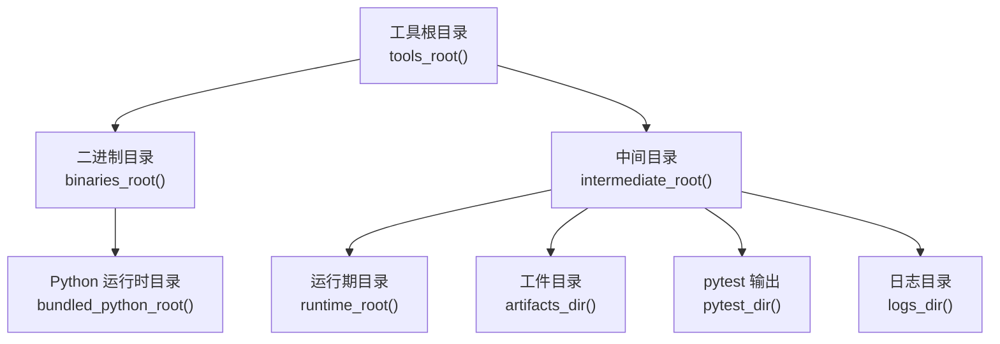
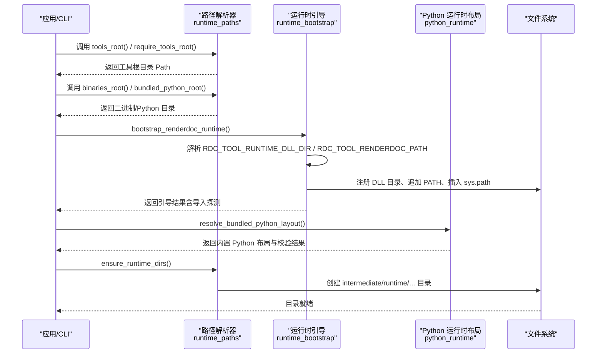
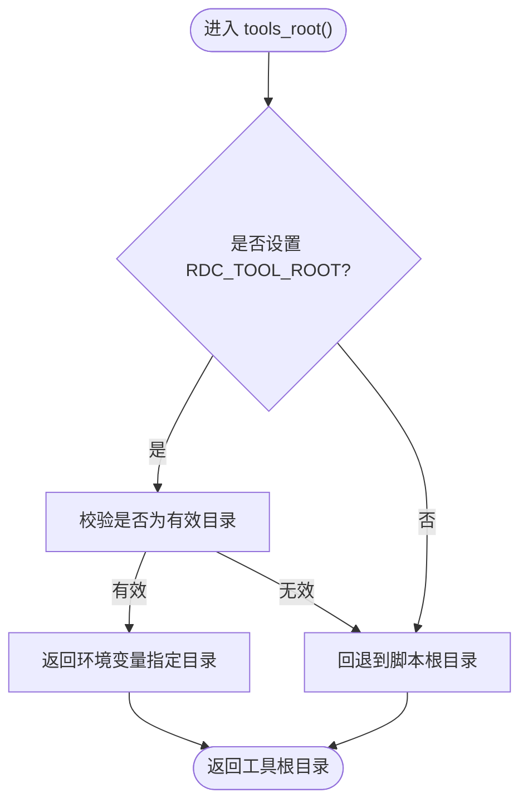
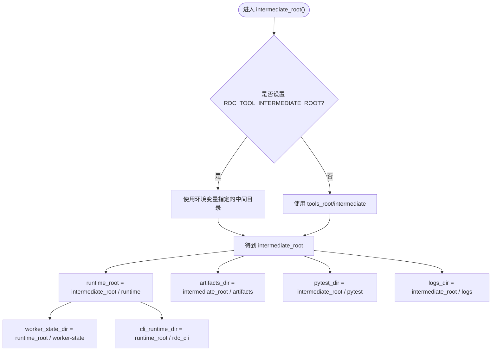
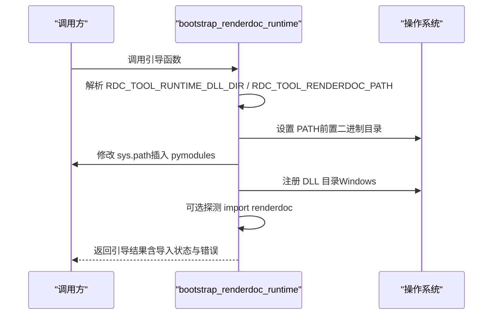
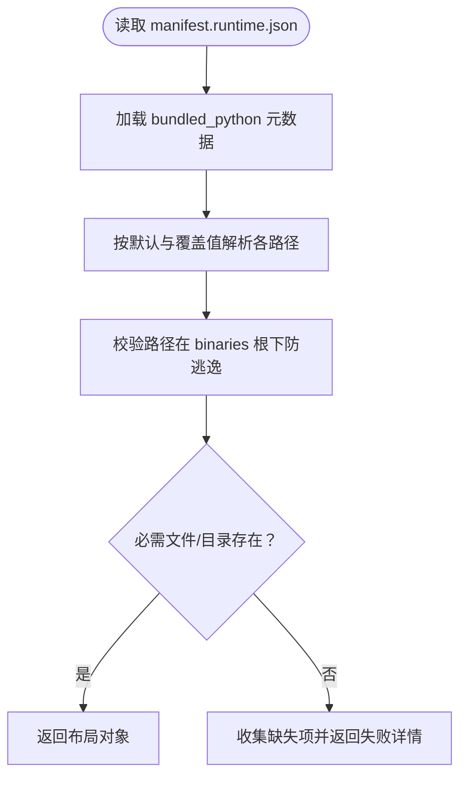
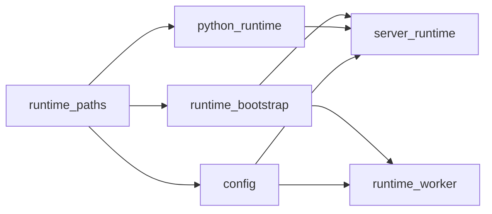

# 路径管理系统

<cite>
**本文引用的文件**
- [runtime_paths.py](file://rdc_tool/runtime_paths.py)
- [python_runtime.py](file://rdc_tool/python_runtime.py)
- [runtime_bootstrap.py](file://rdc_tool/runtime_bootstrap.py)
- [config.py](file://rdc_tool/config.py)
- [server_runtime.py](file://rdc_tool/server_runtime.py)
- [runtime_worker.py](file://rdc_tool/runtime_worker.py)
- [conftest.py](file://tests/conftest.py)
- [test_layout.py](file://tests/test_layout.py)
</cite>

## 目录
1. [简介](#简介)
2. [项目结构](#项目结构)
3. [核心组件](#核心组件)
4. [架构总览](#架构总览)
5. [详细组件分析](#详细组件分析)
6. [依赖关系分析](#依赖关系分析)
7. [性能考虑](#性能考虑)
8. [故障排除指南](#故障排除指南)
9. [结论](#结论)
10. [附录：使用示例与最佳实践](#附录：使用示例与最佳实践)

## 简介
本文件系统性地介绍 RDC-Tool 的路径管理系统，重点覆盖以下方面：
- 运行时路径解析机制：工具根目录、二进制目录、Python 运行时目录的查找策略。
- 环境变量优先级：RDC_TOOL_ROOT 与 RDC_TOOL_INTERMEDIATE_ROOT 的作用与优先级。
- 临时文件目录结构：intermediate、runtime、artifacts、pytest、logs 等组织方式。
- 路径验证与错误处理：如何校验路径有效性并给出明确错误信息。
- 配置最佳实践与故障排除：常见问题的定位方法与修复建议。
- 代码级示例：通过引用具体函数路径展示如何使用各路径函数。

## 项目结构
路径管理相关代码集中在 rdc 包内，围绕“根目录发现”、“运行时目录解析”、“临时目录创建”三大职责展开。关键目录约定如下：
- 工具根目录（tools_root）：默认位于 rdc 包的父目录；可通过环境变量覆盖。
- 二进制目录（binaries_root）：tools_root/binaries/windows/x64，包含 Python 运行时与第三方 DLL。
- Python 运行时目录（bundled_python_root）：binaries/windows/x64/python，内含 python.exe、DLLs、Lib 等。
- 中间目录（intermediate_root）：默认 tools_root/intermediate；可通过环境变量覆盖。
- 运行期目录（runtime_root）：intermediate/runtime，存放会话状态、日志、快照等。
- 工件目录（artifacts_dir）：intermediate/artifacts，用于持久化产物。
- pytest 输出目录（pytest_dir）：intermediate/pytest。
- 日志目录（logs_dir）：intermediate/logs。

图表来源
- [runtime_paths.py:14-123](file://rdc_tool/runtime_paths.py#L14-L123)

章节来源
- [runtime_paths.py:14-123](file://rdc_tool/runtime_paths.py#L14-L123)

## 核心组件
- 路径解析器：负责根据环境变量与脚本位置推导各类目录。
- 运行时引导器：负责设置 PATH、sys.path、注册 DLL 搜索目录，确保渲染库可加载。
- Python 运行时布局解析器：从清单中解析内置 Python 的各子路径，并进行完整性校验。
- 配置中心：将环境变量映射为配置项，影响工件存储、数据库、报告等路径。
- 服务器与 Worker：消费上述路径与配置，启动渲染上下文与任务执行。

章节来源
- [runtime_paths.py:14-123](file://rdc_tool/runtime_paths.py#L14-L123)
- [runtime_bootstrap.py:42-131](file://rdc_tool/runtime_bootstrap.py#L42-L131)
- [python_runtime.py:28-172](file://rdc_tool/python_runtime.py#L28-L172)
- [config.py:118-186](file://rdc_tool/config.py#L118-L186)
- [server_runtime.py:277-390](file://rdc_tool/server_runtime.py#L277-L390)
- [runtime_worker.py:65-167](file://rdc_tool/runtime_worker.py#L65-L167)

## 架构总览
下图展示了路径解析与运行时引导的整体流程：从工具根目录发现开始，到二进制与 Python 运行时定位，再到中间目录与运行期目录的创建与使用。

图表来源
- [runtime_paths.py:14-123](file://rdc_tool/runtime_paths.py#L14-L123)
- [runtime_bootstrap.py:42-131](file://rdc_tool/runtime_bootstrap.py#L42-L131)
- [python_runtime.py:28-172](file://rdc_tool/python_runtime.py#L28-L172)

## 详细组件分析

### 工具根目录与二进制目录解析
- 工具根目录优先策略：
  - 若设置了 RDC_TOOL_ROOT 且指向有效目录，则使用该值。
  - 否则回退到当前脚本所在包的父目录（即 rdc 包的上级）。
  - 当两者不一致时仅发出一次警告，并以环境变量为准。
- 二进制目录：固定为 tools_root/binaries/windows/x64。
- Python 运行时目录：binaries/windows/x64/python，提供 python.exe 与标准库。

图表来源
- [runtime_paths.py:14-41](file://rdc_tool/runtime_paths.py#L14-L41)

章节来源
- [runtime_paths.py:14-80](file://rdc_tool/runtime_paths.py#L14-L80)

### 中间目录与运行期目录
- 中间目录（intermediate_root）：
  - 若设置 RDC_TOOL_INTERMEDIATE_ROOT 且有效，则使用该值。
  - 否则默认 tools_root/intermediate。
- 运行期目录（runtime_root）：intermediate/root，存放会话状态、日志、快照等。
- 其他子目录：
  - cli_runtime_dir：runtime/rdc_cli，存放 CLI 运行态数据。
  - worker_state_dir：runtime/worker-state，存放工作进程状态。
  - artifacts_dir：intermediate/artifacts，工件输出。
  - pytest_dir：intermediate/pytest，测试输出。
  - logs_dir：intermediate/logs，日志输出。
- 自动创建：ensure_runtime_dirs() 会一次性创建上述所有目录，保证后续写入不失败。

图表来源
- [runtime_paths.py:83-123](file://rdc_tool/runtime_paths.py#L83-L123)

章节来源
- [runtime_paths.py:83-123](file://rdc_tool/runtime_paths.py#L83-L123)

### 运行时引导与 DLL 加载
- 目标：确保 renderdoc.pyd 及其依赖 DLL 可被正确加载。
- 关键步骤：
  - 解析 RDC_TOOL_RUNTIME_DLL_DIR 与 RDC_TOOL_RENDERDOC_PATH，未设置时使用默认二进制与 pymodules 目录。
  - 将 pymodules 目录插入 sys.path 首位，避免模块冲突。
  - 将二进制目录前置到 PATH，便于系统动态链接器找到 DLL。
  - 在 Windows 上通过 add_dll_directory 显式注册 DLL 搜索目录，提升加载可靠性。
  - 可选探测 renderdoc 模块导入是否成功，并记录导入错误或模块路径。

图表来源
- [runtime_bootstrap.py:42-131](file://rdc_tool/runtime_bootstrap.py#L42-L131)

章节来源
- [runtime_bootstrap.py:42-131](file://rdc_tool/runtime_bootstrap.py#L42-L131)

### 内置 Python 运行时布局与校验
- 清单驱动：从 binaries/windows/x64/manifest.runtime.json 读取 bundled_python 元数据。
- 路径解析：基于相对路径解析出 python.exe、pythonw.exe、python3.dll、python314.dll、stdlib、site-packages、DLLs、_pth 文件等。
- 安全校验：确保解析出的路径均在 binaries 根目录下，防止路径逃逸。
- 完整性检查：
  - 校验必需元数据字段是否存在。
  - 校验目录与文件存在性（包括 stdlib 的标记文件 os.py、site.py、encodings/__init__.py）。
  - 支持 stdlib 以 zip 或目录两种形式存在。
- 诊断信息：返回当前 Python 环境详情（executable、version、prefix、base_prefix），便于对比。

图表来源
- [python_runtime.py:28-172](file://rdc_tool/python_runtime.py#L28-L172)

章节来源
- [python_runtime.py:28-172](file://rdc_tool/python_runtime.py#L28-L172)

### 配置与环境变量映射
- 配置类集中管理运行时参数，并通过 from_env() 读取环境变量覆盖默认值。
- 与路径相关的覆盖项：
  - RDC_TOOL_ARTIFACT_STORE：覆盖工件存储路径。
  - RDC_TOOL_DATA_DIR：覆盖数据库文件路径（metadata.db、fingerprints.db）。
  - RDC_TOOL_REPORT_DIR：覆盖报告输出目录。
  - RDC_TOOL_RENDERDOC_PATH：覆盖 Python 模块路径（与运行时引导配合）。
  - RDC_TOOL_RUNTIME_DLL_DIR：覆盖二进制目录（与运行时引导配合）。
- 这些配置会被序列化到运行时配置中，供服务端与 Worker 使用。

章节来源
- [config.py:118-186](file://rdc_tool/config.py#L118-L186)
- [server_runtime.py:277-390](file://rdc_tool/server_runtime.py#L277-L390)

### Worker 进程中的路径与状态
- Worker 进程启动时会注入 RDC_TOOL_CONTEXT_ID，并暴露当前二进制与 pymodules 目录，便于上层监控。
- 通过 stdin/stdout 协议接收 exec/clear_context/status/shutdown 指令，统一由 server.dispatch_operation 处理。
- 生命周期结束时进行清理，确保资源释放。

章节来源
- [runtime_worker.py:65-167](file://rdc_tool/runtime_worker.py#L65-L167)

## 依赖关系分析
- runtime_paths 是基础层，提供统一的目录访问接口。
- runtime_bootstrap 依赖 runtime_paths 获取默认二进制与 pymodules 目录，并负责运行时环境准备。
- python_runtime 依赖 runtime_paths 提供的 binaries_root，解析内置 Python 布局。
- config 依赖 runtime_paths 提供的 artifacts_dir、logs_dir、runtime_root 作为默认值。
- server_runtime 与 runtime_worker 消费上述路径与配置，完成实际业务逻辑。

图表来源
- [runtime_paths.py:14-123](file://rdc_tool/runtime_paths.py#L14-L123)
- [runtime_bootstrap.py:42-131](file://rdc_tool/runtime_bootstrap.py#L42-L131)
- [python_runtime.py:28-172](file://rdc_tool/python_runtime.py#L28-L172)
- [config.py:118-186](file://rdc_tool/config.py#L118-L186)
- [server_runtime.py:277-390](file://rdc_tool/server_runtime.py#L277-L390)
- [runtime_worker.py:65-167](file://rdc_tool/runtime_worker.py#L65-L167)

章节来源
- [runtime_paths.py:14-123](file://rdc_tool/runtime_paths.py#L14-L123)
- [runtime_bootstrap.py:42-131](file://rdc_tool/runtime_bootstrap.py#L42-L131)
- [python_runtime.py:28-172](file://rdc_tool/python_runtime.py#L28-L172)
- [config.py:118-186](file://rdc_tool/config.py#L118-L186)
- [server_runtime.py:277-390](file://rdc_tool/server_runtime.py#L277-L390)
- [runtime_worker.py:65-167](file://rdc_tool/runtime_worker.py#L65-L167)

## 性能考虑
- 路径解析尽量使用 Path.resolve() 与缓存策略，减少重复计算。
- ensure_runtime_dirs() 一次性创建多个目录，避免多次 IO 开销。
- 运行时引导仅在必要时探测 renderdoc 导入，降低启动成本。
- 对 PATH 与 sys.path 的操作去重，避免重复插入导致的性能退化。

[本节为通用指导，不直接分析具体文件]

## 故障排除指南
常见问题与定位方法：
- 工具根目录不正确：
  - 检查 RDC_TOOL_ROOT 是否指向有效目录；若不生效，确认路径是否存在且为目录。
  - 参考：[tools_root():14-41](file://rdc_tool/runtime_paths.py#L14-L41)。
- 中间目录未生效：
  - 检查 RDC_TOOL_INTERMEDIATE_ROOT 是否设置；确认路径存在且可写。
  - 参考：[intermediate_root():83-86](file://rdc_tool/runtime_paths.py#L83-L86)。
- 无法加载 renderdoc：
  - 检查 RDC_TOOL_RUNTIME_DLL_DIR 与 RDC_TOOL_RENDERDOC_PATH 是否正确；确认二进制与 pymodules 目录存在。
  - 查看引导结果中的 dll_dir_errors 与 import_error。
  - 参考：[bootstrap_renderdoc_runtime():105-131](file://rdc_tool/runtime_bootstrap.py#L105-L131)。
- 内置 Python 不完整：
  - 检查 manifest.runtime.json 的 bundled_python 字段是否齐全；核对 stdlib 与 site-packages。
  - 参考：[validate_bundled_python_layout():104-172](file://rdc_tool/python_runtime.py#L104-L172)。
- 工件或日志未生成：
  - 确认 ensure_runtime_dirs() 已调用；检查 artifacts_dir 与 logs_dir 权限。
  - 参考：[ensure_runtime_dirs():112-123](file://rdc_tool/runtime_paths.py#L112-L123)。

章节来源
- [runtime_paths.py:14-123](file://rdc_tool/runtime_paths.py#L14-L123)
- [runtime_bootstrap.py:105-131](file://rdc_tool/runtime_bootstrap.py#L105-L131)
- [python_runtime.py:104-172](file://rdc_tool/python_runtime.py#L104-L172)

## 结论
本路径管理系统通过清晰的环境变量优先级、严格的目录结构与完善的校验机制，确保了工具在不同环境下的一致性与稳定性。结合运行时引导与内置 Python 布局解析，能够可靠地加载渲染库与依赖模块。推荐在生产环境中显式设置 RDC_TOOL_ROOT 与 RDC_TOOL_INTERMEDIATE_ROOT，以获得可预测的路径行为。

[本节为总结，不直接分析具体文件]

## 附录：使用示例与最佳实践

- 获取工具根目录并强制写入环境变量：
  - 参考：[require_tools_root():44-49](file://rdc_tool/runtime_paths.py#L44-L49)、[ensure_tools_root_env():52-57](file://rdc_tool/runtime_paths.py#L52-L57)
- 获取二进制与 Python 运行时目录：
  - 参考：[binaries_root():60-62](file://rdc_tool/runtime_paths.py#L60-L62)、[bundled_python_root():65-67](file://rdc_tool/runtime_paths.py#L65-L67)、[bundled_python_executable():70-71](file://rdc_tool/runtime_paths.py#L70-L71)
- 获取中间与运行期目录：
  - 参考：[intermediate_root():83-86](file://rdc_tool/runtime_paths.py#L83-L86)、[runtime_root():88-89](file://rdc_tool/runtime_paths.py#L88-L89)、[artifacts_dir():100-101](file://rdc_tool/runtime_paths.py#L100-L101)、[logs_dir():108-109](file://rdc_tool/runtime_paths.py#L108-L109)
- 确保目录存在：
  - 参考：[ensure_runtime_dirs():112-123](file://rdc_tool/runtime_paths.py#L112-L123)
- 引导渲染库与 Python 模块：
  - 参考：[bootstrap_renderdoc_runtime():105-131](file://rdc_tool/runtime_bootstrap.py#L105-L131)
- 校验内置 Python 布局：
  - 参考：[resolve_bundled_python_layout():64-92](file://rdc_tool/python_runtime.py#L64-L92)、[validate_bundled_python_layout():104-172](file://rdc_tool/python_runtime.py#L104-L172)
- 通过配置覆盖工件与数据库路径：
  - 参考：[RdcToolConfig.from_env():135-186](file://rdc_tool/config.py#L135-L186)

最佳实践：
- 始终在启动早期设置 RDC_TOOL_ROOT 与 RDC_TOOL_INTERMEDIATE_ROOT，避免隐式回退带来的不确定性。
- 在 CI/CD 中隔离 intermediate 目录，避免多任务竞争。
- 使用 validate_bundled_python_layout() 在部署后自检内置 Python 完整性。
- 在 Windows 上确保 add_dll_directory 可用，并在引导阶段记录 dll_dir_errors。

章节来源
- [runtime_paths.py:14-123](file://rdc_tool/runtime_paths.py#L14-L123)
- [runtime_bootstrap.py:105-131](file://rdc_tool/runtime_bootstrap.py#L105-L131)
- [python_runtime.py:64-172](file://rdc_tool/python_runtime.py#L64-L172)
- [config.py:135-186](file://rdc_tool/config.py#L135-L186)